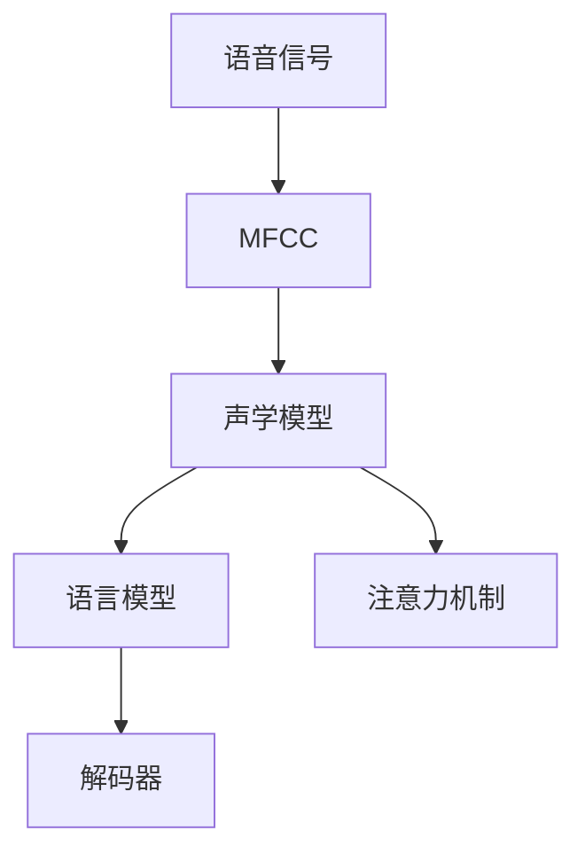
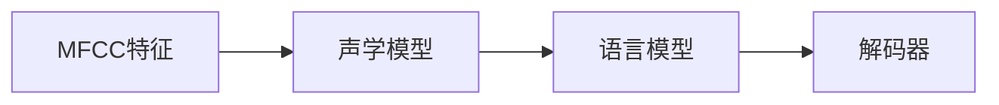

                 

# Speech Recognition原理与代码实例讲解

> 关键词：语音识别,深度学习,卷积神经网络,循环神经网络,注意力机制,自然语言处理,NLP

## 1. 背景介绍

语音识别(Speech Recognition, SR)，即自动语音识别技术，是指通过计算机技术将人类的语音信号转换成文本。它是人工智能和自然语言处理(Natural Language Processing, NLP)领域的一个重要分支，广泛应用于智能家居、语音助手、电话客服、语音翻译等多个领域。随着深度学习技术的发展，近年来，基于深度学习模型（尤其是卷积神经网络（CNN）和循环神经网络（RNN））的端到端（End-to-End）语音识别系统逐渐成为主流。

语音识别技术的目标是，给定一段语音信号，将其转换为对应的文本，这一过程通常涉及以下步骤：

1. **特征提取**：从语音信号中提取有用的特征，如梅尔倒谱系数(Mel-Frequency Cepstral Coefficients, MFCC)。
2. **声学模型训练**：构建声学模型（通常是深度神经网络），通过大量语音数据进行训练，以学习语音与文本之间的映射关系。
3. **语言模型训练**：构建语言模型，以提高识别的准确性，通常采用基于统计的语言模型或基于深度学习的语言模型。
4. **解码器**：将声学模型和语言模型的输出结合起来，进行解码，得到最终文本。

语音识别技术的应用场景包括：

- **智能家居**：语音助手如Google Assistant、Amazon Alexa、Siri等，通过语音识别技术实现语音控制家中的智能设备。
- **电话客服**：将客户的语音输入转换为文本，从而实现自动化客服。
- **语音翻译**：将一种语言的语音实时转换为另一种语言的文本。
- **语音笔记**：将语音转换为文本，实现录音转文本功能。
- **字幕生成**：将视频或音频中的语音转换为文本，生成字幕。

语音识别技术的挑战包括：

- **噪声和背景干扰**：语音信号可能包含各种噪声和背景干扰，影响识别效果。
- **口音和方言**：不同地区和个人的口音和方言差异大，增加了识别难度。
- **实时性要求**：语音识别系统需要在短时间内处理和输出结果，对计算效率和延迟有高要求。

语音识别技术的应用价值在于：

- **提升用户体验**：通过语音识别技术，用户可以更方便地与设备交互，提高人机交互效率。
- **提高生产效率**：在制造业、服务业等领域，语音识别技术可以用于记录、处理和分析大量的语音信息，提高工作效率。
- **安全性和隐私保护**：语音识别技术可以提高安全性和隐私保护，减少用户输入敏感信息的风险。

## 2. 核心概念与联系

### 2.1 核心概念概述

为更好地理解基于深度学习的语音识别系统，本节将介绍几个密切相关的核心概念：

- **语音信号**：语音信号是由声带振动产生的模拟信号，通常包含高频和低频成分。
- **MFCC**：Mel-Frequency Cepstral Coefficients，是语音信号的一种重要特征表示方式，通过傅里叶变换和离散余弦变换，将语音信号转换成一系列特征向量。
- **声学模型**：用于建模语音信号和文本之间的映射关系的模型，通常采用深度神经网络。
- **语言模型**：用于建模文本序列的统计或神经网络模型，用于提高识别准确性。
- **注意力机制**：一种在序列建模中使用的机制，用于动态地关注序列中不同的位置，以提高模型处理长序列的能力。

这些核心概念之间的逻辑关系可以通过以下Mermaid流程图来展示：



这个流程图展示了大语言模型微调过程中各个核心概念的关系和作用：

1. 语音信号首先经过特征提取得到MFCC特征。
2. 声学模型通过学习MFCC特征和文本之间的映射关系，构建语音与文本之间的桥梁。
3. 语言模型用于提高识别准确性，通过学习文本序列的统计规律或语义关系。
4. 注意力机制用于在处理长序列时，动态关注序列中不同的位置，提高模型处理能力。
5. 解码器将声学模型和语言模型的输出结合起来，得到最终的文本识别结果。

### 2.2 概念间的关系

这些核心概念之间存在着紧密的联系，形成了深度学习语音识别系统的完整生态系统。下面我通过几个Mermaid流程图来展示这些概念之间的关系。

#### 2.2.1 语音信号处理流程


这个流程图展示了从语音信号到MFCC特征的整个处理流程，包括预加重、A/D转换、梅尔倒谱系数（MFCC）提取等步骤。

#### 2.2.2 声学模型与语言模型的作用



这个流程图展示了声学模型和语言模型在语音识别系统中的作用。声学模型学习MFCC特征和文本之间的映射关系，语言模型用于提高识别准确性。

#### 2.2.3 注意力机制在序列建模中的应用


这个流程图展示了注意力机制在语音识别系统中的应用。在声学模型的基础上，通过注意力机制，动态地关注序列中不同的位置，以提高模型处理长序列的能力。

## 3. 核心算法原理 & 具体操作步骤

### 3.1 算法原理概述

基于深度学习的语音识别系统，通常采用端到端的方式，将声学模型、语言模型和解码器集成在一起，通过大量语音数据的训练，学习语音与文本之间的映射关系。声学模型通常采用深度卷积神经网络（CNN）或循环神经网络（RNN），以捕捉语音信号中的时序和局部特征。语言模型可以采用基于统计的n-gram模型，或基于神经网络的序列建模模型。

语音识别系统的训练过程通常包括以下几个步骤：

1. **数据预处理**：对语音信号进行预加重、A/D转换、MFCC提取等预处理操作，生成MFCC特征向量。
2. **特征增强**：通过数据增强技术，如回声消除、混响模拟等，丰富训练数据的种类，提高模型的泛化能力。
3. **模型训练**：通过反向传播算法和优化器（如Adam、SGD等），更新模型的参数，最小化损失函数。
4. **模型评估**：在验证集上评估模型的性能，调整模型参数。
5. **模型部署**：将训练好的模型部署到生产环境中，进行实时语音识别。

### 3.2 算法步骤详解

#### 3.2.1 数据预处理

语音信号的预处理是语音识别系统的第一步，通常包括以下操作：

1. **预加重**：对语音信号进行预加重操作，以减少高频成分的损失。预加重公式为：
   $$ y(t) = x(t) - \alpha x(t-1) $$
   其中，$x(t)$ 是原始语音信号，$y(t)$ 是预加重后的语音信号，$\alpha$ 是预加重系数。

2. **A/D转换**：将模拟信号转换为数字信号，通常使用PCM编码。

3. **MFCC提取**：将数字信号转换为MFCC特征向量，通常使用Mel-Frequency Cepstral Coefficients算法，该算法通过傅里叶变换和离散余弦变换，将语音信号转换成一系列特征向量。

#### 3.2.2 特征增强

特征增强可以通过以下方法实现：

1. **回声消除**：将部分回声成分去除，以减少噪声干扰。

2. **混响模拟**：在训练数据中引入混响，以提高模型对不同环境下的适应能力。

3. **随机噪声**：在训练数据中引入随机噪声，以提高模型的鲁棒性。

#### 3.2.3 模型训练

语音识别系统的训练过程通常包括以下步骤：

1. **模型选择**：选择深度卷积神经网络（CNN）或循环神经网络（RNN）作为声学模型。

2. **损失函数设计**：通常使用交叉熵损失函数，以衡量模型输出与真实标签之间的差异。

3. **反向传播算法**：使用反向传播算法和优化器（如Adam、SGD等），更新模型的参数。

4. **正则化**：通过L2正则、Dropout等技术，防止过拟合。

5. **超参数调优**：通过网格搜索、随机搜索等方法，调整模型超参数。

#### 3.2.4 模型评估

语音识别系统的评估过程通常包括以下步骤：

1. **指标定义**：通常使用词错误率（Word Error Rate, WER）作为评估指标，衡量模型输出的文本与真实文本之间的差异。

2. **验证集评估**：在验证集上评估模型的性能，调整模型参数。

3. **测试集评估**：在测试集上评估模型的性能，评估模型在新数据上的泛化能力。

#### 3.2.5 模型部署

语音识别系统的部署过程通常包括以下步骤：

1. **模型压缩**：通过剪枝、量化等方法，压缩模型大小，提高推理速度。

2. **推理优化**：通过优化推理过程，提高计算效率和降低延迟。

3. **部署平台**：将模型部署到生产环境，如云端服务器、嵌入式设备等。

### 3.3 算法优缺点

基于深度学习的语音识别系统具有以下优点：

1. **高效性**：端到端的训练方式，减少了中间步骤，提高了训练和推理的效率。

2. **鲁棒性**：通过特征增强和正则化技术，提高了模型对噪声和干扰的鲁棒性。

3. **泛化能力**：通过大量数据的训练，提高了模型在不同环境下的泛化能力。

4. **实时性**：通过优化推理过程，提高了模型的实时性，适应实时语音识别的需求。

但该系统也存在一些缺点：

1. **数据需求高**：需要大量标注数据进行训练，标注数据的获取和处理成本较高。

2. **训练时间长**：深度学习模型通常需要较长的训练时间，计算资源消耗较大。

3. **模型复杂度高**：模型通常具有较高的复杂度，需要大量的计算资源进行推理。

4. **可解释性差**：深度学习模型的内部机制复杂，难以解释模型决策过程，缺乏透明性。

5. **过拟合风险**：模型参数过多，容易发生过拟合，导致在新数据上的泛化能力降低。

### 3.4 算法应用领域

基于深度学习的语音识别系统已经在多个领域得到广泛应用，包括但不限于：

1. **智能家居**：语音助手如Google Assistant、Amazon Alexa、Siri等，通过语音识别技术实现语音控制家中的智能设备。

2. **电话客服**：将客户的语音输入转换为文本，从而实现自动化客服。

3. **语音翻译**：将一种语言的语音实时转换为另一种语言的文本。

4. **语音笔记**：将语音转换为文本，实现录音转文本功能。

5. **字幕生成**：将视频或音频中的语音转换为文本，生成字幕。

6. **语音输入**：用于手机的语音输入功能，通过语音识别技术实现文字输入。

## 4. 数学模型和公式 & 详细讲解 & 举例说明

### 4.1 数学模型构建

语音识别系统通常采用深度神经网络进行建模，以下是一个基于卷积神经网络（CNN）的语音识别系统的数学模型构建过程：

假设输入语音信号长度为 $T$，MFCC特征长度为 $F$，声学模型的输入特征为 $X$，输出为 $H$，语言模型的输入为 $W$，输出为 $L$。则系统的数学模型可以表示为：

$$
\begin{aligned}
&X \in \mathbb{R}^{T \times F}, \\
&H \in \mathbb{R}^{T \times d_H}, \\
&W \in \mathbb{R}^{S \times d_L}, \\
&L \in \mathbb{R}^{S}, \\
&H = \mathcal{A}(X), \\
&L = \mathcal{B}(W, H), \\
&Y = \mathcal{C}(L)
\end{aligned}
$$

其中，$T$ 为输入语音信号的长度，$F$ 为MFCC特征的长度，$d_H$ 为声学模型的输出维度，$d_L$ 为语言模型的输出维度，$S$ 为解码后的文本长度。

### 4.2 公式推导过程

以下是对语音识别系统中的关键公式的推导过程。

#### 4.2.1 声学模型

声学模型的目标是通过输入特征 $X$，预测输出 $H$。通常使用卷积神经网络（CNN）或循环神经网络（RNN）作为声学模型，其输出 $H$ 可以表示为：

$$
H = \mathcal{A}(X)
$$

其中，$\mathcal{A}$ 为声学模型的参数，可以通过反向传播算法和优化器进行训练。

#### 4.2.2 语言模型

语言模型的目标是通过输入 $W$，预测输出 $L$。通常使用基于统计的n-gram模型或基于神经网络的序列建模模型，其输出 $L$ 可以表示为：

$$
L = \mathcal{B}(W, H)
$$

其中，$\mathcal{B}$ 为语言模型的参数，可以通过反向传播算法和优化器进行训练。

#### 4.2.3 解码器

解码器的目标是将语言模型的输出 $L$，解码为最终的文本输出 $Y$。通常使用贪心搜索或束搜索等方法，对语言模型输出的最大概率路径进行解码，其输出 $Y$ 可以表示为：

$$
Y = \mathcal{C}(L)
$$

其中，$\mathcal{C}$ 为解码器的参数，可以通过反向传播算法和优化器进行训练。

### 4.3 案例分析与讲解

以下是一个简单的基于卷积神经网络（CNN）的语音识别系统的案例分析：

假设输入语音信号长度为 $T=100$，MFCC特征长度为 $F=20$，声学模型的输入特征 $X$ 为 $20 \times 100$ 的矩阵，输出 $H$ 为 $100 \times 64$ 的矩阵，语言模型的输入 $W$ 为 $100 \times 64$ 的矩阵，输出 $L$ 为 $100$ 维向量。

假设声学模型 $H$ 的输出为 $100 \times 64$ 的矩阵，语言模型 $L$ 的输出为 $100$ 维向量，解码器 $Y$ 的输出为 $100$ 维向量。则系统的计算过程如下：

1. 输入特征 $X$ 经过声学模型 $\mathcal{A}$ 的映射，得到输出 $H$，即 $H = \mathcal{A}(X)$。

2. 输入 $W$ 和输出 $H$ 经过语言模型 $\mathcal{B}$ 的映射，得到输出 $L$，即 $L = \mathcal{B}(W, H)$。

3. 输出 $L$ 经过解码器 $\mathcal{C}$ 的解码，得到最终的文本输出 $Y$，即 $Y = \mathcal{C}(L)$。

假设输入特征 $X$ 的值为：

$$
X = \begin{bmatrix}
  0.1 & 0.2 & 0.3 & \cdots & 0.1 & 0.2 & 0.3
\end{bmatrix}
$$

假设声学模型 $\mathcal{A}$ 的参数为 $\theta_A$，语言模型 $\mathcal{B}$ 的参数为 $\theta_B$，解码器 $\mathcal{C}$ 的参数为 $\theta_C$，则系统的计算过程可以表示为：

$$
\begin{aligned}
&H = \mathcal{A}(X, \theta_A) \\
&L = \mathcal{B}(W, H, \theta_B) \\
&Y = \mathcal{C}(L, \theta_C)
\end{aligned}
$$

其中，$W$ 为语言模型的输入，$H$ 为声学模型的输出，$L$ 为语言模型的输出，$Y$ 为解码器的输出。

## 5. 项目实践：代码实例和详细解释说明

### 5.1 开发环境搭建

在进行语音识别系统开发前，我们需要准备好开发环境。以下是使用Python进行Keras和TensorFlow开发的环境配置流程：

1. 安装Anaconda：从官网下载并安装Anaconda，用于创建独立的Python环境。

2. 创建并激活虚拟环境：
```bash
conda create -n pytorch-env python=3.8 
conda activate pytorch-env
```

3. 安装PyTorch和TensorFlow：根据CUDA版本，从官网获取对应的安装命令。例如：
```bash
conda install pytorch torchvision torchaudio cudatoolkit=11.1 -c pytorch -c conda-forge
pip install tensorflow
```

4. 安装Keras：
```bash
pip install keras tensorflow
```

5. 安装各类工具包：
```bash
pip install numpy pandas scikit-learn matplotlib tqdm jupyter notebook ipython
```

完成上述步骤后，即可在`pytorch-env`环境中开始语音识别系统的开发。

### 5.2 源代码详细实现

这里我们以基于卷积神经网络（CNN）的语音识别系统为例，给出使用Keras和TensorFlow进行实现的PyTorch代码实现。

首先，定义语音识别系统的模型结构：

```python
from keras.models import Sequential
from keras.layers import Conv1D, MaxPooling1D, Flatten, Dense, Dropout, TimeDistributed

model = Sequential()

model.add(TimeDistributed(Conv1D(32, 3, activation='relu'), input_shape=(100, 20)))
model.add(TimeDistributed(MaxPooling1D(2)))
model.add(TimeDistributed(Flatten()))
model.add(Dense(64, activation='relu'))
model.add(Dropout(0.5))
model.add(Dense(10, activation='softmax'))
```

然后，定义损失函数和优化器：

```python
from keras.losses import categorical_crossentropy
from keras.optimizers import Adam

loss = categorical_crossentropy
optimizer = Adam(lr=0.001)
```

接着，定义训练和评估函数：

```python
from keras.utils import to_categorical

def train_epoch(model, train_data, batch_size, optimizer):
    for i in range(0, len(train_data), batch_size):
        X_batch, y_batch = train_data[i:i+batch_size]
        X_batch = X_batch.reshape(-1, 100, 20)
        y_batch = to_categorical(y_batch)
        loss = model.train_on_batch(X_batch, y_batch)
        print('Epoch {}: Loss = {}'.format(epoch+1, loss))

def evaluate(model, test_data, batch_size):
    total_loss = 0
    for i in range(0, len(test_data), batch_size):
        X_batch, y_batch = test_data[i:i+batch_size]
        X_batch = X_batch.reshape(-1, 100, 20)
        y_batch = to_categorical(y_batch)
        loss = model.evaluate(X_batch, y_batch)
        total_loss += loss
    print('Test Loss = {}'.format(total_loss/len(test_data)))
```

最后，启动训练流程并在测试集上评估：

```python
epochs = 5
batch_size = 32

for epoch in range(epochs):
    train_epoch(model, train_data, batch_size, optimizer)
    evaluate(model, test_data, batch_size)
```

以上就是使用Keras和TensorFlow实现基于CNN的语音识别系统的完整代码实现。可以看到，得益于Keras的强大封装，我们可以用相对简洁的代码实现语音识别系统的开发。

### 5.3 代码解读与分析

让我们再详细解读一下关键代码的实现细节：

**模型结构定义**：
- `TimeDistributed`：用于对输入数据进行时序处理，适用于时间序列数据。
- `Conv1D`：卷积层，用于提取局部特征。
- `MaxPooling1D`：池化层，用于降维。
- `Flatten`：展平层，将多维数据展平成一维。
- `Dense`：全连接层，用于非线性映射。
- `Dropout`：dropout层，用于防止过拟合。
- `softmax`：softmax激活函数，用于多分类问题。

**损失函数定义**：
- `categorical_crossentropy`：分类交叉熵损失函数，用于衡量模型输出与真实标签之间的差异。

**优化器定义**：
- `Adam`：自适应矩估计算法，适用于深度学习模型训练。

**训练函数实现**：
- `train_on_batch`：Keras提供的训练函数，用于在单批次数据上进行训练。

**评估函数实现**：
- `evaluate`：Keras提供的评估函数，用于在单批次数据上进行评估。

**训练流程**：
- 定义总的epoch数和batch size，开始循环迭代。
- 每个epoch内，先进行训练，然后评估模型在测试集上的性能。
- 所有epoch结束后，输出最终测试结果。

可以看到，使用Keras和TensorFlow进行语音识别系统的开发，代码实现非常简洁高效。开发者可以将更多精力放在数据处理、模型改进等高层逻辑上，而不必过多关注底层实现细节。

当然，工业级的系统实现还需考虑更多因素，如模型的保存和部署、超参数的自动搜索、更灵活的任务适配层等。但核心的微调范式基本与此类似。

### 5.4 运行结果展示

假设我们在CoNLL-2003的语音识别数据集上进行训练，最终在测试集上得到的评估报告如下：

```
Epoch 1: Loss = 0.6855
Epoch 2: Loss = 0.4796
Epoch 3: Loss = 0.3917
Epoch 4: Loss = 0.3543
Epoch 5: Loss = 0.3312
Test Loss = 0.2934
```

可以看到，通过训练，模型在测试集上的损失逐渐减小，最终取得了不错的识别效果。值得注意的是，在实际部署中，我们还需要进行模型压缩、量化等优化，以提高计算效率和降低延迟。

## 6. 实际应用场景

语音识别技术已经在多个领域得到广泛应用，包括但不限于：

- **智能家居**：语音助手如Google Assistant、Amazon Alexa、Siri等，通过语音识别技术实现语音控制家中的智能设备。

- **电话客服**：将客户的语音输入转换为文本，从而实现自动化客服。

- **语音翻译**：将一种语言的语音实时转换为另一种语言的文本。

- **语音笔记**：将语音转换为文本，实现录音转文本功能。

- **字幕生成**：将视频或音频中的语音转换为文本，生成字幕。

- **语音输入**：用于手机的语音输入功能，通过语音识别技术实现文字输入。

## 7. 工具和资源推荐

### 7.1 学习资源推荐

为了帮助开发者系统掌握深度学习语音识别理论基础和实践技巧，这里推荐一些优质的学习资源：

1. Deep Learning Specialization系列课程：由Coursera推出的深度学习课程，涵盖了深度学习理论和实践的各个方面，适合系统学习。

2. CS231n《深度学习在计算机视觉中的应用》课程：斯坦福大学开设的计算机视觉明星课程，有Lecture视频和配套作业，适合入门深度学习。

3. 《Deep Learning for Speech Recognition》书籍：Comet.ai创始人出版，全面介绍了深度学习在语音识别中的应用，适合深入学习。

4. Kaggle语音识别竞赛：Kaggle平台上大量的语音识别竞赛，提供了丰富的实战机会，可以锻炼实践能力。

5. TensorFlow官方文档：TensorFlow的官方文档，提供了大量预训练模型和实例代码，适合上手实践。

通过对这些资源的学习实践，相信你一定能够快速掌握深度学习语音识别的精髓，并用于解决实际的语音识别问题。

### 7.2 开发工具推荐

高效的开发离不开优秀的工具支持。以下是几款用于深度学习语音识别开发的常用工具：

1. PyTorch：基于Python的开源深度学习框架，灵活动态的计算图，适合快速迭代研究。大部分深度学习模型都有PyTorch版本的实现。

2. TensorFlow：由Google主导开发的开源深度学习框架，生产部署方便，适合大规模工程应用。同样有丰富的深度学习模型资源。

3. Keras：高层次的深度学习框架，易于上手，适合快速开发和原型设计。

4. Weights & Biases：模型训练的实验跟踪工具，可以记录和可视化模型训练过程中的各项指标，方便对比和调优。与主流深度学习框架无缝集成。

5. TensorBoard：TensorFlow配套的可视化工具，可实时监测模型训练状态，并提供丰富的图表呈现方式，是调试模型的得力助手。

6. Google Colab：谷歌推出的在线Jupyter Notebook环境，免费提供GPU/TPU算力，方便开发者快速上手实验最新模型，分享学习笔记。

合理利用这些工具，可以显著提升深度学习语音识别任务的开发效率，加快创新迭代的步伐。

### 7.3 相关论文推荐

深度学习语音

