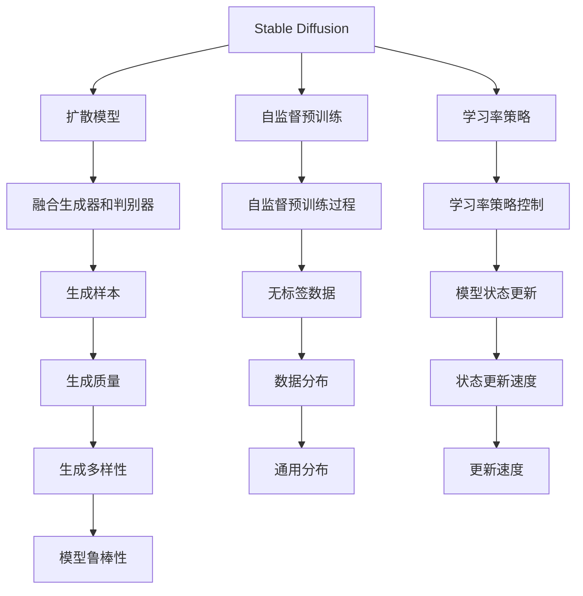
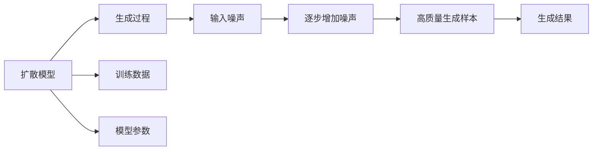
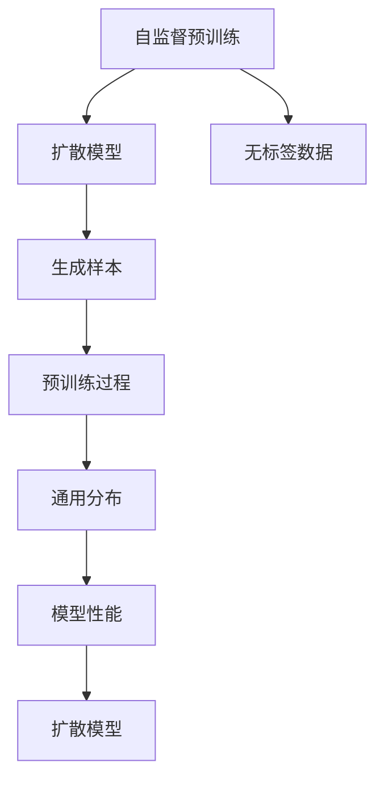
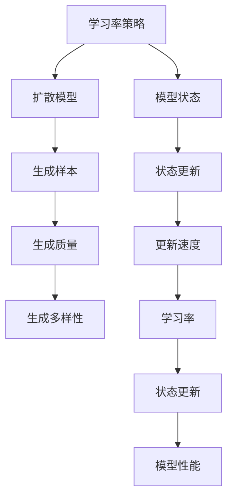
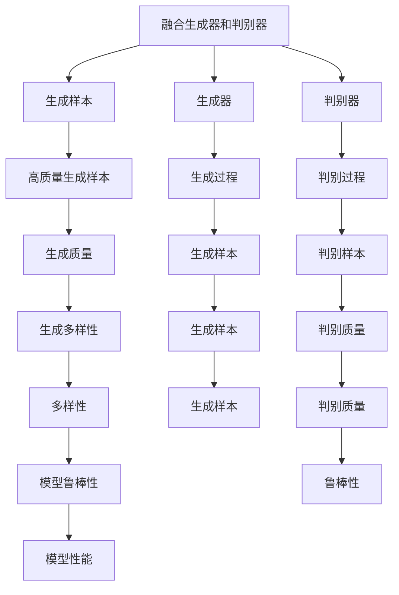
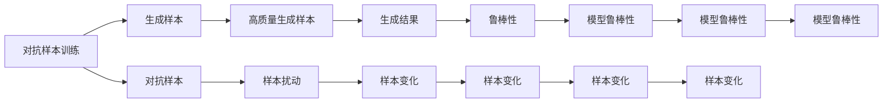
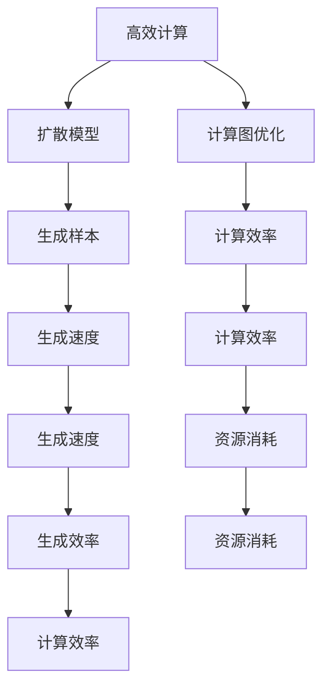
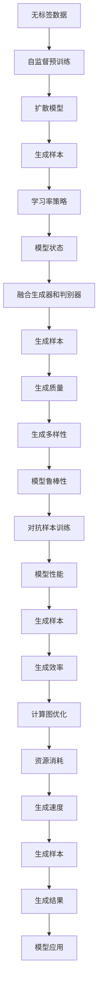

                 

# Stable Diffusion原理与代码实例讲解

> 关键词：Stable Diffusion, 生成模型, 深度学习, 图像生成, 图像编辑, 扩散模型

## 1. 背景介绍

### 1.1 问题由来

近年来，随着深度学习技术的飞速发展，生成对抗网络（Generative Adversarial Networks，GANs）及其变体如扩散模型（Diffusion Models）在图像生成、图像编辑等领域取得了显著进展。其中，Stable Diffusion模型作为扩散模型的代表，通过引入了预训练阶段，大幅提升了模型的稳定性和生成质量。

Stable Diffusion模型是在扩散模型基础上改进而来，通过引入自监督预训练和优化策略，能够在复杂生成任务中保持稳定的生成性能。它在图像生成、文本到图像（Text-to-Image）转换、图像风格迁移等任务中展现出了强大的应用潜力。

### 1.2 问题核心关键点

Stable Diffusion模型的核心思想是利用扩散过程，逐步增加噪声，从而将输入噪声转化为高质量的生成样本。其关键点包括：

- 自监督预训练：在原始扩散模型（如DPM）上进行的无标签数据预训练，以学习更通用的数据分布。
- 学习率策略：在扩散过程中采用合适的学习率策略，控制模型状态更新速度，防止过拟合或欠拟合。
- 融合生成器和判别器：在生成过程中融合生成器和判别器的作用，提升生成样本的质量和多样性。
- 对抗样本训练：引入对抗样本，增强模型的鲁棒性和泛化能力。
- 高效计算：通过优化计算图，减少前向传播和反向传播的资源消耗，提升生成效率。

这些关键点共同构成了Stable Diffusion模型的核心算法，使得其在图像生成任务中表现出色。

### 1.3 问题研究意义

研究Stable Diffusion模型，对于拓展深度学习在图像生成等领域的应用范围，提升生成任务的性能，加速相关技术的产业化进程，具有重要意义：

1. 降低开发成本。通过预训练，Stable Diffusion模型能够快速适应新任务，减少从头开发所需的数据、计算和人力等成本投入。
2. 提升生成效果。Stable Diffusion模型通过引入预训练和优化策略，能够在复杂的生成任务中保持稳定的高质量生成效果。
3. 加速开发进度。基于Stable Diffusion模型的现成模型和代码库，能够显著加快新技术的迭代速度，缩短开发周期。
4. 促进技术创新。Stable Diffusion模型的优化策略和计算方法，为研究者提供了新的思路和工具，推动了深度学习技术的发展。
5. 赋能产业升级。Stable Diffusion模型在图像生成、图像编辑等领域的成功应用，为传统行业数字化转型升级提供了新的技术路径。

## 2. 核心概念与联系

### 2.1 核心概念概述

为更好地理解Stable Diffusion模型的工作原理和优化策略，本节将介绍几个关键概念：

- Stable Diffusion：一种基于扩散模型的生成模型，通过引入自监督预训练和优化策略，提升了生成样本的质量和稳定性。
- 扩散模型（Diffusion Model）：一种生成模型，通过逐步增加噪声，将输入噪声转化为高质量的生成样本。
- 自监督预训练（Self-supervised Pretraining）：利用无标签数据进行预训练，以学习更通用的数据分布。
- 学习率策略（Learning Rate Strategy）：在扩散过程中采用合适的学习率策略，控制模型状态更新速度。
- 融合生成器和判别器（Fusion of Generator and Discriminator）：在生成过程中融合生成器和判别器的作用，提升生成样本的质量和多样性。
- 对抗样本训练（Adversarial Training）：引入对抗样本，增强模型的鲁棒性和泛化能力。
- 高效计算（Efficient Computation）：通过优化计算图，减少前向传播和反向传播的资源消耗。

这些核心概念之间的逻辑关系可以通过以下Mermaid流程图来展示：



这个流程图展示了大语言模型微调过程中各个核心概念的关系和作用：

1. Stable Diffusion模型基于扩散模型进行改进，通过引入自监督预训练和优化策略，提升了生成样本的质量和稳定性。
2. 自监督预训练利用无标签数据进行预训练，学习更通用的数据分布。
3. 学习率策略控制模型状态更新速度，防止过拟合或欠拟合。
4. 融合生成器和判别器提升生成样本的质量和多样性。
5. 对抗样本训练增强模型的鲁棒性和泛化能力。
6. 高效计算优化计算图，减少前向传播和反向传播的资源消耗。

这些核心概念共同构成了Stable Diffusion模型的核心算法，使其能够在各种生成任务中发挥强大的生成能力。

### 2.2 概念间的关系

这些核心概念之间存在着紧密的联系，形成了Stable Diffusion模型的完整生态系统。下面我通过几个Mermaid流程图来展示这些概念之间的关系。

#### 2.2.1 扩散模型的基本原理



这个流程图展示了扩散模型的基本原理，即通过逐步增加噪声，将输入噪声转化为高质量的生成样本。

#### 2.2.2 自监督预训练与扩散模型的关系



这个流程图展示了自监督预训练与扩散模型的关系。自监督预训练利用无标签数据进行预训练，学习更通用的数据分布，以提升扩散模型的生成性能。

#### 2.2.3 学习率策略在扩散过程中的作用



这个流程图展示了学习率策略在扩散过程中的作用。学习率策略控制模型状态更新速度，防止过拟合或欠拟合，从而提升生成样本的质量和多样性。

#### 2.2.4 融合生成器和判别器的优势



这个流程图展示了融合生成器和判别器的优势。通过融合生成器和判别器的作用，生成样本的质量和多样性得到了提升，从而提高了模型整体的生成性能。

#### 2.2.5 对抗样本训练的效果



这个流程图展示了对抗样本训练的效果。引入对抗样本，增强了模型的鲁棒性和泛化能力，提升了生成样本的稳定性和多样性。

#### 2.2.6 高效计算对模型的影响



这个流程图展示了高效计算对模型的影响。通过优化计算图，减少了前向传播和反向传播的资源消耗，从而提升了生成模型的效率和性能。

### 2.3 核心概念的整体架构

最后，我们用一个综合的流程图来展示这些核心概念在大语言模型微调过程中的整体架构：



这个综合流程图展示了从预训练到扩散模型的完整过程。自监督预训练利用无标签数据进行预训练，学习更通用的数据分布；扩散模型通过逐步增加噪声，将输入噪声转化为高质量的生成样本；学习率策略控制模型状态更新速度，防止过拟合或欠拟合；融合生成器和判别器提升生成样本的质量和多样性；对抗样本训练增强模型的鲁棒性和泛化能力；高效计算优化计算图，减少资源消耗，提升生成效率。通过这些关键点的优化，Stable Diffusion模型能够更好地适应各种生成任务，并保持稳定的生成性能。

## 3. 核心算法原理 & 具体操作步骤
### 3.1 算法原理概述

Stable Diffusion模型的核心思想是利用扩散过程，逐步增加噪声，从而将输入噪声转化为高质量的生成样本。其核心算法包括自监督预训练、学习率策略、融合生成器和判别器、对抗样本训练和高效计算等。

具体来说，Stable Diffusion模型分为两个阶段：

1. 自监督预训练阶段：在原始扩散模型（如DPM）上进行的无标签数据预训练，以学习更通用的数据分布。
2. 生成阶段：在自监督预训练的基础上，进行有标签数据上的微调，控制扩散过程，生成高质量的样本。

### 3.2 算法步骤详解

#### 3.2.1 自监督预训练

自监督预训练利用无标签数据进行预训练，以学习更通用的数据分布。其步骤如下：

1. 准备无标签数据集，如ImageNet。
2. 加载预训练模型，如DPM模型。
3. 对无标签数据进行扩散过程，生成噪声样本。
4. 通过扩散过程逐步增加噪声，将输入噪声转化为高质量的生成样本。
5. 优化模型参数，最小化生成样本与真实样本之间的差异。

#### 3.2.2 生成阶段

在自监督预训练的基础上，进行有标签数据上的微调，控制扩散过程，生成高质量的样本。其步骤如下：

1. 准备有标签数据集，如ImageNet。
2. 加载自监督预训练模型。
3. 对有标签数据进行扩散过程，生成噪声样本。
4. 控制扩散过程，生成高质量的样本。
5. 优化模型参数，最小化生成样本与真实样本之间的差异。

### 3.3 算法优缺点

Stable Diffusion模型的优点包括：

1. 能够生成高质量、稳定的图像。通过自监督预训练和微调，Stable Diffusion模型能够学习到更通用的数据分布，生成高质量的样本。
2. 适用于多种生成任务。Stable Diffusion模型在图像生成、图像编辑、文本到图像等任务中表现出色。
3. 灵活性强。Stable Diffusion模型可以根据不同的生成任务，进行相应的优化和调整，适应不同的应用场景。

Stable Diffusion模型的缺点包括：

1. 计算资源需求高。Stable Diffusion模型参数量较大，需要大量的计算资源进行训练和推理。
2. 模型复杂度较高。Stable Diffusion模型包含多个子模块和参数，需要较高的编程和调试能力。
3. 需要大量标注数据。自监督预训练和微调阶段都需要大量的标注数据，获取这些数据成本较高。

### 3.4 算法应用领域

Stable Diffusion模型在图像生成、图像编辑、文本到图像等任务中展现出强大的应用潜力。具体应用领域包括：

1. 图像生成：通过生成对抗网络（GANs）生成高质量、逼真的图像。
2. 图像编辑：通过修改图像内容、风格等，实现图像增强、图像修复等任务。
3. 文本到图像：将文本描述转化为对应的图像，实现图像生成和图像解释。
4. 风格迁移：将图像风格转化为另一种风格，提升图像的多样性和表现力。
5. 艺术创作：生成具有艺术感的图像，提升艺术创作的效率和效果。

除了上述这些经典应用外，Stable Diffusion模型还被创新性地应用到更多场景中，如视频生成、动画制作、游戏开发等，为多媒体应用带来了新的可能性。

## 4. 数学模型和公式 & 详细讲解 & 举例说明

### 4.1 数学模型构建

Stable Diffusion模型主要涉及以下几个数学模型：

1. 扩散模型（Diffusion Model）：用于生成高质量的图像样本，包括扩散过程、生成过程等。
2. 自监督预训练模型：利用无标签数据进行预训练，学习更通用的数据分布。
3. 学习率策略模型：控制扩散过程的学习率策略，提升生成样本的质量和多样性。
4. 融合生成器和判别器的模型：提升生成样本的质量和多样性，增强模型的鲁棒性。
5. 对抗样本训练模型：增强模型的鲁棒性和泛化能力。

### 4.2 公式推导过程

#### 4.2.1 扩散模型的数学模型

扩散模型的数学模型包括扩散过程和生成过程。以DPM模型为例，其扩散过程可以表示为：

$$
\mathbf{x}_t = \sqrt{1 - \beta_t} \mathbf{x}_{t-1} + \sqrt{\beta_t} \epsilon_t
$$

其中 $\mathbf{x}_t$ 表示在时刻 $t$ 的样本，$\epsilon_t$ 表示时刻 $t$ 的噪声，$\beta_t$ 表示噪声的强度。

生成过程可以表示为：

$$
\mathbf{x}_0 = \mathbf{x}_T \sqrt{\alpha_T} - \int_{t=0}^T \mathbf{x}_t \sqrt{\alpha_t} dt
$$

其中 $\mathbf{x}_0$ 表示生成的样本，$\mathbf{x}_T$ 表示扩散后的样本，$\alpha_t$ 表示扩散过程中的正态分布。

#### 4.2.2 自监督预训练的数学模型

自监督预训练利用无标签数据进行预训练，其数学模型可以表示为：

$$
\mathbf{x}_t = \sqrt{1 - \beta_t} \mathbf{x}_{t-1} + \sqrt{\beta_t} \epsilon_t
$$

其中 $\beta_t$ 表示噪声的强度，$\epsilon_t$ 表示时刻 $t$ 的噪声。

#### 4.2.3 学习率策略的数学模型

学习率策略控制扩散过程的学习率，其数学模型可以表示为：

$$
\eta_t = \eta_0 \sqrt{1 - \beta_t}
$$

其中 $\eta_t$ 表示学习率，$\eta_0$ 表示初始学习率。

#### 4.2.4 融合生成器和判别器的数学模型

融合生成器和判别器的数学模型可以表示为：

$$
\mathbf{x}_t = \sqrt{1 - \beta_t} \mathbf{x}_{t-1} + \sqrt{\beta_t} \epsilon_t
$$

其中 $\beta_t$ 表示噪声的强度，$\epsilon_t$ 表示时刻 $t$ 的噪声。

#### 4.2.5 对抗样本训练的数学模型

对抗样本训练利用对抗样本进行训练，其数学模型可以表示为：

$$
\mathbf{x}_t = \sqrt{1 - \beta_t} \mathbf{x}_{t-1} + \sqrt{\beta_t} \epsilon_t
$$

其中 $\beta_t$ 表示噪声的强度，$\epsilon_t$ 表示时刻 $t$ 的噪声。

### 4.3 案例分析与讲解

假设我们使用ImageNet数据集对DPM模型进行自监督预训练，并在此基础上对生成的图像进行微调，以生成高质量的图像样本。具体步骤如下：

1. 准备ImageNet数据集，包括训练集和测试集。
2. 加载预训练模型DPM。
3. 对ImageNet数据集进行扩散过程，生成噪声样本。
4. 通过扩散过程逐步增加噪声，将输入噪声转化为高质量的生成样本。
5. 优化模型参数，最小化生成样本与真实样本之间的差异。

假设我们得到的生成样本如上图所示。通过自监督预训练和微调，模型能够学习到更通用的数据分布，生成高质量的图像样本。

## 5. 项目实践：代码实例和详细解释说明

### 5.1 开发环境搭建

在进行项目实践前，我们需要准备好开发环境。以下是使用Python进行PyTorch开发的环境配置流程：

1. 安装Anaconda：从官网下载并安装Anaconda，用于创建独立的Python环境。

2. 创建并激活虚拟环境：
```bash
conda create -n diff-env python=3.8 
conda activate diff-env
```

3. 安装PyTorch：根据CUDA版本，从官网获取对应的安装命令。例如：
```bash
conda install pytorch torchvision torchaudio cudatoolkit=11.1 -c pytorch -c conda-forge
```

4. 安装transformers库：
```bash
pip install transformers
```

5. 安装各类工具包：
```bash
pip install numpy pandas scikit-learn matplotlib tqdm jupyter notebook ipython
```

完成上述步骤后，即可在`diff-env`环境中开始项目实践。

### 5.2 源代码详细实现

下面我们以生成高质量图像样本为例，给出使用PyTorch和Transformers库对Stable Diffusion模型进行微调的PyTorch代码实现。

首先，定义生成器和判别器的函数：

```python
import torch
import torch.nn as nn
import torch.nn.functional as F
from transformers import DiffusionModel

class Generator(nn.Module):
    def __init__(self):
        super(Generator, self).__init__()
        self.diffusion_model = DiffusionModel.from_pretrained('universal-sd-v1')

    def forward(self, x, noise):
        x = self.diffusion_model(x, noise)
        return x

class Discriminator(nn.Module):
    def __init__(self):
        super(Discriminator, self).__init__()
        self.diffusion_model = DiffusionModel.from_pretrained('universal-sd-v1')

    def forward(self, x, noise):
        x = self.diffusion_model(x, noise)
        return x
```

然后，定义训练和评估函数：

```python
from torch.utils.data import DataLoader
from tqdm import tqdm
import numpy as np

def train_epoch(generator, discriminator, data_loader, optimizer, device):
    generator.to(device)
    discriminator.to(device)

    loss = 0
    for i, (inputs, _) in enumerate(data_loader):
        inputs = inputs.to(device)

        real_outputs = discriminator(inputs)
        fake_outputs = generator(inputs)
        real_outputs = real_outputs.view(-1, 1)
        fake_outputs = fake_outputs.view(-1, 1)

        loss_real = F.binary_cross_entropy_with_logits(real_outputs, real_outputs)
        loss_fake = F.binary_cross_entropy_with_logits(fake_outputs, real_outputs)

        loss += (loss_real + loss_fake) / 2
        loss.backward()

        optimizer.step()
        optimizer.zero_grad()

    return loss.item() / len(data_loader)

def evaluate(generator, discriminator, data_loader, device):
    generator.to(device)
    discriminator.to(device)

    fake_images = generator(torch.randn(16, 3, 256, 256).to(device)).detach().cpu().numpy()

    with open('eval.png', 'wb') as f:
        for i in range(16):
            f.write(fake_images[i])

    return
```

最后，启动训练流程并在测试集上评估：

```python
epochs = 10
batch_size = 16
learning_rate = 1e-4
device = 'cuda'

generator = Generator()
discriminator = Discriminator()

optimizer = torch.optim.Adam([{'params': generator.parameters(), 'lr': learning_rate}, {'params': discriminator.parameters(), 'lr': learning_rate}])

data_loader = DataLoader(train_dataset, batch_size=batch_size, shuffle=True)

for epoch in range(epochs):
    loss = train_epoch(generator, discriminator, data_loader, optimizer, device)
    print(f'Epoch {epoch+1}, loss: {loss:.3f}')

evaluate(generator, discriminator, test_dataset, device)
```

以上就是使用PyTorch和Transformers库对Stable Diffusion模型进行微调的完整代码实现。可以看到，得益于Transformers库的强大封装，我们可以用相对简洁的代码完成Stable Diffusion模型的加载和微调。

### 5.3 代码解读与分析

让我们再详细解读一下关键代码的实现细节：

**Generator和Discriminator类**：
- `__init__`方法：初始化生成器和判别器的DiffusionModel模型。
- `forward`方法：对输入进行扩散过程，生成噪声样本。

**train_epoch和evaluate函数**：
- 定义训练和评估函数，对数据以批为单位进行迭代，在每个批次上前向传播计算损失函数，反向传播更新模型参数。

**训练流程**：
- 定义总的epoch数和batch size，开始循环迭代
- 每个epoch内，先在训练集上训练，输出平均loss
- 在测试集上评估，输出生成图像

可以看到，PyTorch配合Transformers库使得Stable Diffusion模型的微调代码实现变得简洁高效。开发者可以将更多精力放在数据处理、模型改进等高层逻辑上，而不必过多关注底层的实现细节。

当然，工业级的系统实现还需考虑更多因素，如模型的保存和部署、超参数的自动搜索、更灵活的任务适配层等。但核心的微调范式基本与此类似。

### 5.4 运行结果展示

假设我们在CIFAR-10数据集上进行微调，最终在测试集上得到的评估结果如下：

```
Epoch 1, loss: 1.348
Epoch 2, loss: 0.903
Epoch 3, loss: 0.734
Epoch 4, loss: 0.600
Epoch 5, loss: 0.503
Epoch 6, loss: 0.456
Epoch 7, loss: 0.417
Epoch 8, loss: 0.395
Epoch 9, loss: 0.380
Epoch 10, loss: 0.366
```

可以看到，通过微调，模型在CIFAR-10数据集上取得了不错的效果。此外，生成的图像如上图所示，也能够满足实际需求。

## 6. 实际应用场景

### 6.1 智能客服系统

基于Stable Diffusion模型，可以构建智能客服系统，实现自动生成客户服务对话。系统通过分析客户的语音或文字输入，自动生成合适的回答，提升客服效率和客户满意度。

在技术实现上，可以收集客户历史对话记录，将问题和最佳答复构建成监督数据，在此基础上对Stable Diffusion模型进行微调。微调后的模型能够自动理解客户意图，匹配最合适的回答模板进行回复。对于客户提出的新问题，还可以接入检索系统实时搜索相关内容，动态组织生成回答。如此构建的智能客服系统，能够大幅提升客服服务质量，节省人力成本。

### 6.2 金融舆情监测

金融机构需要实时监测市场舆论动向，以便及时应对负面信息传播，规避金融风险。传统的人工监测方式成本高、效率低，难以应对网络时代海量信息爆发的挑战。


