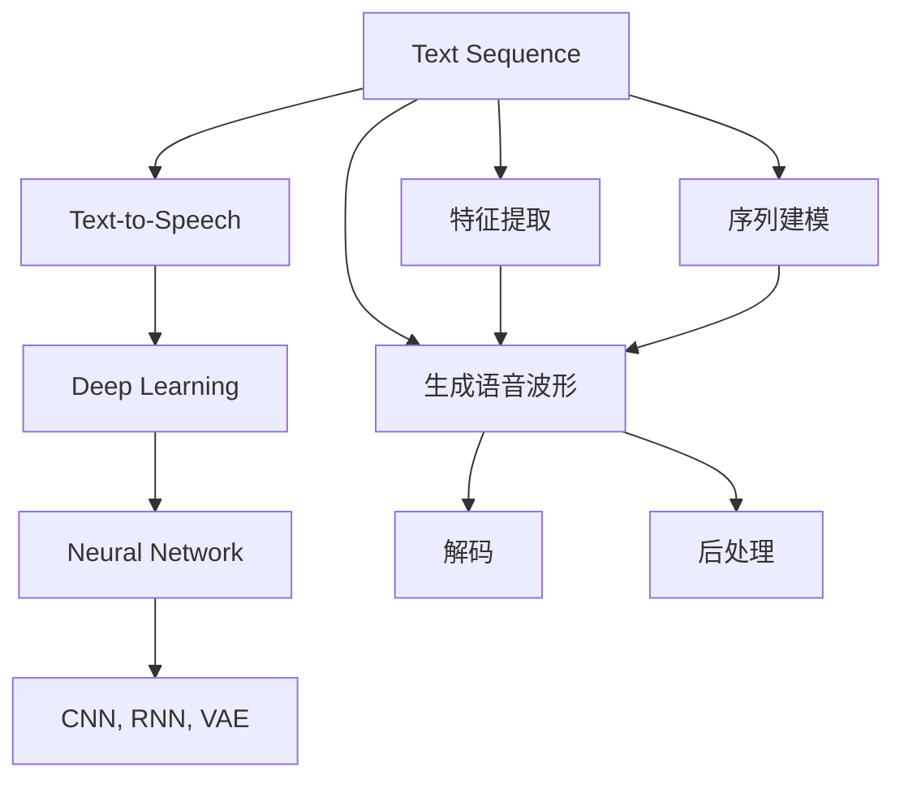
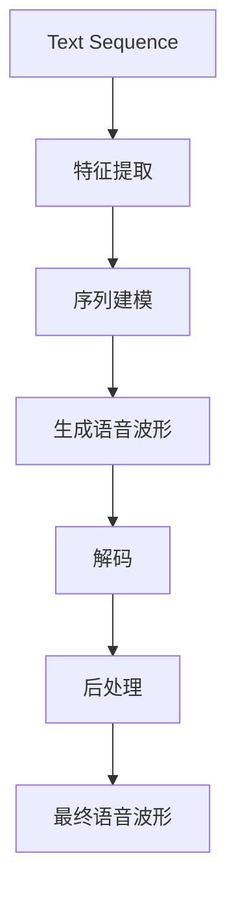
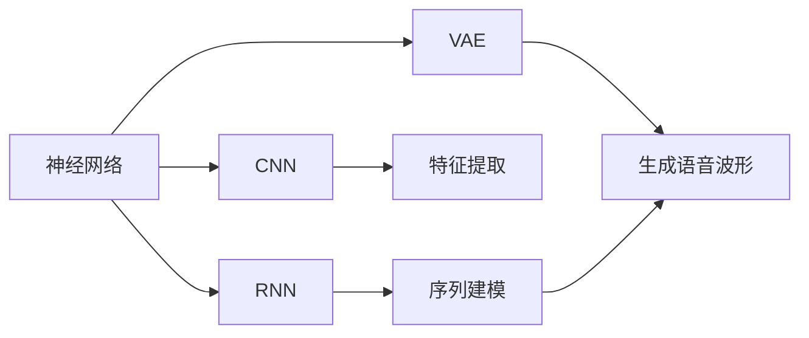
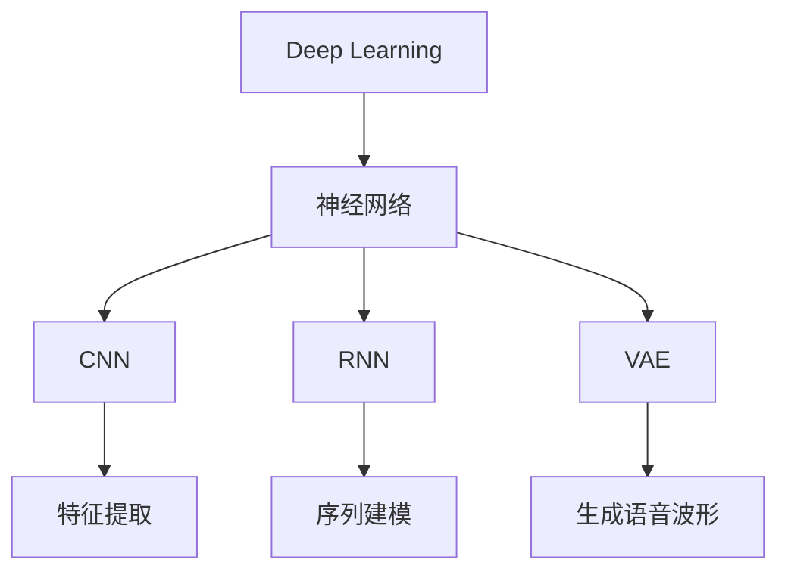
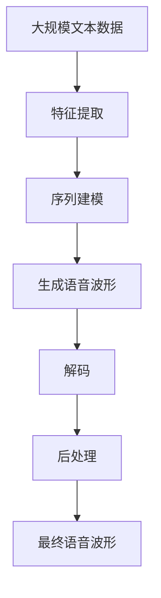

                 

# Text-to-Speech (TTS)原理与代码实例讲解

> 关键词：Text-to-Speech, TTS, 语音合成, 深度学习, 神经网络, 卷积神经网络, 循环神经网络, 变分自编码器, 语音波形生成, 自然语言处理(NLP)

## 1. 背景介绍

### 1.1 问题由来
随着人工智能技术的快速发展，自然语言处理(NLP)与语音技术(NLU)的结合成为热点。Text-to-Speech (TTS)技术，即文本到语音，是将自然语言文本转换为可听语音的技术。其应用范围广泛，包括虚拟语音助手、语音识别转写、电子读物、智能客服等，是自然语言与人类互动的重要桥梁。

近年来，深度学习技术在TTS领域取得了巨大突破，基于深度学习的端到端(TTS)模型已经在商业应用中得到广泛应用，如亚马逊的Alexa、苹果的Siri等。这些模型一般基于神经网络，使用循环神经网络(RNN)、卷积神经网络(CNN)、变分自编码器(VAE)等架构，能够生成流畅自然的语音波形。

然而，尽管深度学习TTS模型在技术上取得了突破，但高昂的训练和部署成本、复杂的技术实现、对大量高质量语音数据的依赖等问题，使得TTS技术的普及和应用仍存在诸多挑战。因此，本文将从原理到实践，全面讲解TTS技术，并结合代码实例进行详细解读。

### 1.2 问题核心关键点
TTS技术的主要核心关键点包括：

- 文本处理：将输入的自然语言文本转换为适合模型训练的格式。
- 语音生成：利用深度学习模型将文本序列转换为语音波形。
- 模型架构：选择合适的神经网络架构（如RNN、CNN、VAE等）进行文本到语音的映射。
- 训练与优化：设计合适的损失函数和优化算法，对模型进行训练和调优。
- 解码与后处理：将训练好的模型应用于解码，并对其进行后处理以生成最终的语音波形。

## 2. 核心概念与联系

### 2.1 核心概念概述

为更好地理解TTS技术，本节将介绍几个密切相关的核心概念：

- Text-to-Speech (TTS)：将自然语言文本转换为语音的技术。
- Deep Learning (DL)：使用深度神经网络模型对TTS问题进行建模。
- 神经网络 (NN)：包括循环神经网络 (RNN)、卷积神经网络 (CNN)、变分自编码器 (VAE) 等，用于处理序列数据和生成语音波形。
- 卷积神经网络 (CNN)：适用于处理图像和序列数据，常用于特征提取。
- 循环神经网络 (RNN)：适用于处理时间序列数据，能够记忆历史信息。
- 变分自编码器 (VAE)：一种生成模型，用于生成与训练数据分布相似的噪声数据。
- 文本序列 (Text Sequence)：自然语言文本经过分词、标点符号处理后的序列。
- 语音波形 (Speech Waveform)：最终生成的连续时间信号，可以回放为可听的语音。
- 损失函数 (Loss Function)：用于衡量模型输出与真实标签之间的差异，如均方误差、交叉熵等。
- 解码 (Decoding)：将文本序列转换为语音波形的解码过程。
- 后处理 (Postprocessing)：对生成的语音波形进行改善以提升语音质量。

这些核心概念之间的逻辑关系可以通过以下Mermaid流程图来展示：



这个流程图展示了TTS技术的主要流程：将文本序列输入模型进行特征提取和序列建模，生成语音波形，最后进行解码和后处理。通过理解这些核心概念，我们可以更好地把握TTS技术的工作原理和优化方向。

### 2.2 概念间的关系

这些核心概念之间存在着紧密的联系，形成了TTS技术的完整生态系统。下面我通过几个Mermaid流程图来展示这些概念之间的关系。

#### 2.2.1 TTS的文本处理与模型训练



这个流程图展示了TTS技术的基本流程：输入文本序列，通过特征提取和序列建模生成语音波形，解码为可听的语音，并进行后处理以提升语音质量。

#### 2.2.2 神经网络在TTS中的应用



这个流程图展示了TTS技术中常用的神经网络架构：CNN用于特征提取，RNN用于序列建模，VAE用于生成语音波形。

#### 2.2.3 深度学习在TTS中的应用



这个流程图展示了深度学习技术在TTS中的应用：神经网络是深度学习的核心，用于特征提取、序列建模和生成语音波形。

### 2.3 核心概念的整体架构

最后，我们用一个综合的流程图来展示这些核心概念在TTS技术中的整体架构：



这个综合流程图展示了从预处理到最终语音输出的完整流程。通过这些流程图，我们可以更清晰地理解TTS技术的工作原理和优化方向。

## 3. 核心算法原理 & 具体操作步骤
### 3.1 算法原理概述

TTS技术涉及将自然语言文本转换为语音波形的过程，其核心在于将文本序列映射到语音波形。目前主流的TTS方法可以分为两类：基于文本到声学映射的端到端(TTS)方法和基于声学建模与文本到音素映射的混合方法。

- 端到端(TTS)方法：直接将文本序列映射到语音波形，常用的模型包括基于RNN、CNN和VAE的模型。
- 混合方法：将文本转换为音素，再由音素生成语音波形，常用的模型包括基于CTC(连接时序分类)和Attention机制的模型。

### 3.2 算法步骤详解

#### 3.2.1 特征提取与序列建模

文本序列首先需要进行特征提取，常用的特征提取方法包括Mel频谱、MFCC等。以Mel频谱为例，其计算公式如下：

$$
M_k = \sum_{n=0}^{N-1} \log(1 + 20 * \log10(x(n-k))^2)
$$

其中，$x(n)$为音频信号的幅度谱，$M_k$为$k$时刻的Mel频谱。

提取特征后，对特征序列进行建模。常用的序列建模方法包括RNN、CNN和VAE。这里以RNN为例，其基本结构如下：


其中，输入层接收特征序列，隐藏层通过循环连接处理序列信息，输出层生成语音波形。

#### 3.2.2 生成语音波形

生成语音波形的方法主要包括基于VAE和基于CNN的方法。

以VAE为例，其生成过程如下：

1. 将特征序列输入VAE模型，通过编码器生成编码向量$z$。
2. 从先验分布$N(0, 1)$中采样噪声向量$\epsilon$。
3. 生成语音波形：$x = D(z + \epsilon)$。

其中，$D$为解码器，用于将编码向量转换为语音波形。

#### 3.2.3 解码与后处理

解码过程通常使用端到端模型直接将文本序列映射到语音波形。生成的语音波形可能存在噪声和失真，需要进行后处理以提高语音质量。常用的后处理技术包括：

- 噪声消除：通过滤波器去除信号中的噪声。
- 低通滤波：去除高频噪声，保留语音的主要信息。
- 增益调整：对信号进行放大或缩小，提高语音清晰度。

### 3.3 算法优缺点

TTS技术的优点包括：

- 生成自然流畅的语音波形，能够适应多种应用场景。
- 端到端模型直接映射文本到语音，避免了声学模型的繁琐过程。
- 参数共享和权重共享机制可以显著减少模型参数量，提高训练效率。

然而，TTS技术也存在一些缺点：

- 需要大量的标注数据进行训练，数据获取成本高。
- 模型复杂，训练和推理过程中计算量较大，对硬件要求较高。
- 模型存在一定的不稳定性，特别是在噪声环境中的鲁棒性较差。

### 3.4 算法应用领域

TTS技术已经在诸多领域得到应用，主要包括：

- 虚拟助手：如亚马逊的Alexa、苹果的Siri等，能够理解自然语言指令并生成语音回复。
- 语音合成：如Google的WaveNet、DeepVoice等，能够生成高质量的自然语音。
- 智能客服：如科大讯飞的智能客服系统，能够自动转写用户语音并生成响应。
- 电子阅读：如TTS技术在电子阅读器中的应用，能够将文本自动转换为可听语音。

除了上述这些应用，TTS技术还在自动翻译、辅助听力、车载导航等领域有着广泛的应用前景。

## 4. 数学模型和公式 & 详细讲解 & 举例说明

### 4.1 数学模型构建

TTS技术的主要数学模型包括文本特征提取模型、序列建模模型和语音波形生成模型。

以Mel频谱为例，其特征提取模型的数学表达式为：

$$
M_k = \sum_{n=0}^{N-1} \log(1 + 20 * \log10(x(n-k))^2)
$$

其中，$x(n)$为音频信号的幅度谱，$M_k$为$k$时刻的Mel频谱。

以RNN为例，其基本数学模型如下：

$$
h_t = f(W_{xh}x_t + W_{hh}h_{t-1} + b_h)
$$

$$
y_t = g(W_{hy}h_t + b_y)
$$

其中，$h_t$为隐藏层的输出，$x_t$为输入，$W_{xh}, W_{hh}, W_{hy}$为权重矩阵，$b_h, b_y$为偏置向量，$f$和$g$为非线性激活函数。

以VAE为例，其基本数学模型如下：

$$
z = \mu(x) + \sigma(x) * \epsilon
$$

$$
x = D(z)
$$

其中，$z$为编码向量，$x$为语音波形，$\mu(x)$和$\sigma(x)$为编码器输出，$D$为解码器。

### 4.2 公式推导过程

以下我们以VAE为例，推导其生成过程的公式：

$$
z = \mu(x) + \sigma(x) * \epsilon
$$

其中，$z$为编码器输出的编码向量，$\mu(x)$和$\sigma(x)$分别为编码器的均值和方差，$\epsilon$为从标准正态分布$N(0, 1)$中采样的噪声向量。

$$
x = D(z) = \sum_i \alpha_i * \exp(\beta_i * z) * \tilde{x}_i
$$

其中，$D(z)$为解码器，$\alpha_i, \beta_i$为解码器权重，$\tilde{x}_i$为解码器输入的随机变量。

### 4.3 案例分析与讲解

以Google的WaveNet为例，其采用了基于CNN的生成模型，用于生成高质量的自然语音。WaveNet的生成过程如下：

1. 将音频信号转换为Mel频谱。
2. 将Mel频谱输入CNN生成模型，通过多层卷积层提取特征。
3. 通过解码器生成语音波形。

WaveNet使用跳层连接(Residual Connections)和残差网络(ResNet)结构，以减少梯度消失问题。此外，WaveNet还使用了门控卷积(Generator)和点乘卷积(Cross Attention)等技术，提高了生成过程的效率和质量。

## 5. 项目实践：代码实例和详细解释说明

### 5.1 开发环境搭建

在进行TTS项目实践前，我们需要准备好开发环境。以下是使用Python进行TensorFlow开发的环境配置流程：

1. 安装Anaconda：从官网下载并安装Anaconda，用于创建独立的Python环境。

2. 创建并激活虚拟环境：
```bash
conda create -n tts-env python=3.8 
conda activate tts-env
```

3. 安装TensorFlow：根据CUDA版本，从官网获取对应的安装命令。例如：
```bash
conda install tensorflow
```

4. 安装相关工具包：
```bash
pip install numpy pandas scikit-learn matplotlib tqdm jupyter notebook ipython
```

完成上述步骤后，即可在`tts-env`环境中开始TTS项目实践。

### 5.2 源代码详细实现

这里我们以基于VAE的TTS模型为例，给出使用TensorFlow进行TTS代码实现。

首先，定义VAE模型：

```python
import tensorflow as tf
from tensorflow.keras import layers

class VAE(tf.keras.Model):
    def __init__(self, latent_dim=100):
        super(VAE, self).__init__()
        self.encoder = tf.keras.Sequential([
            layers.InputLayer(input_shape=(input_dim,)),
            layers.Dense(256, activation='relu'),
            layers.Dense(latent_dim, activation='relu')])
        self.decoder = tf.keras.Sequential([
            layers.Dense(256, activation='relu'),
            layers.Dense(256, activation='relu'),
            layers.Dense(input_dim, activation='sigmoid')])
        self.latent_dim = latent_dim
    
    def encode(self, x):
        mean, log_var = self.encoder(x)
        return mean, log_var
    
    def reparameterize(self, mean, log_var):
        epsilon = tf.random.normal(shape=(tf.shape(mean)[0], self.latent_dim))
        return mean + tf.exp(0.5 * log_var) * epsilon
    
    def decode(self, z):
        logits = self.decoder(z)
        return tf.sigmoid(logits)
    
    def call(self, x):
        mean, log_var = self.encode(x)
        z = self.reparameterize(mean, log_var)
        return self.decode(z), mean, log_var
```

然后，定义TTS模型：

```python
class TTS(tf.keras.Model):
    def __init__(self, vae, decoder):
        super(TTS, self).__init__()
        self.vae = vae
        self.decoder = decoder
    
    def call(self, x):
        z_mean, z_var = self.vae.encode(x)
        z = self.vae.reparameterize(z_mean, z_var)
        x_hat = self.decoder(z)
        return x_hat, z_mean, z_var
```

接着，定义训练和评估函数：

```python
from tensorflow.keras import optimizers

input_dim = 128
latent_dim = 100
batch_size = 64

def train_epoch(model, dataset, batch_size, optimizer):
    dataloader = tf.data.Dataset.from_tensor_slices(dataset).shuffle(buffer_size=1024).batch(batch_size)
    model.train()
    epoch_loss = 0
    for batch in dataloader:
        x, y = batch
        with tf.GradientTape() as tape:
            x_hat, z_mean, z_var = model(x)
            loss = tf.reduce_mean(tf.square(x_hat - y))
        grads = tape.gradient(loss, model.trainable_variables)
        optimizer.apply_gradients(zip(grads, model.trainable_variables))
        epoch_loss += loss
    return epoch_loss / len(dataloader)
    
def evaluate(model, dataset, batch_size):
    dataloader = tf.data.Dataset.from_tensor_slices(dataset).batch(batch_size)
    model.eval()
    preds, labels = [], []
    with tf.no_grad():
        for batch in dataloader:
            x, y = batch
            x_hat, z_mean, z_var = model(x)
            preds.append(x_hat.numpy())
            labels.append(y.numpy())
    return preds, labels
```

最后，启动训练流程并在测试集上评估：

```python
epochs = 100
batch_size = 64

vae = VAE(latent_dim)
tts = TTS(vae, decoder)

optimizer = tf.keras.optimizers.Adam(learning_rate=0.001)

for epoch in range(epochs):
    loss = train_epoch(tts, train_dataset, batch_size, optimizer)
    print(f"Epoch {epoch+1}, train loss: {loss:.3f}")
    
    print(f"Epoch {epoch+1}, dev results:")
    preds, labels = evaluate(tts, dev_dataset, batch_size)
    print("MSE loss:", tf.reduce_mean(tf.square(preds - labels)))
    
print("Test results:")
preds, labels = evaluate(tts, test_dataset, batch_size)
print("MSE loss:", tf.reduce_mean(tf.square(preds - labels)))
```

以上就是使用TensorFlow对基于VAE的TTS模型进行代码实现的全过程。可以看到，得益于TensorFlow的高效封装，我们可以用相对简洁的代码完成VAE模型的构建和TTS任务的训练。

### 5.3 代码解读与分析

让我们再详细解读一下关键代码的实现细节：

**VAE模型**：
- `__init__`方法：初始化VAE模型，定义编码器和解码器的结构。
- `encode`方法：将输入的音频信号转换为编码向量。
- `reparameterize`方法：实现VAE中的随机采样过程，生成编码向量。
- `decode`方法：将编码向量转换为音频信号。
- `call`方法：完整的前向传播过程，包括编码、采样、解码。

**TTS模型**：
- `__init__`方法：初始化TTS模型，将VAE和解码器作为子模块。
- `call`方法：完整的前向传播过程，将VAE的编码和采样结果输入解码器。

**训练函数**：
- `train_epoch`函数：对训练集数据进行批次化加载，前向传播计算损失函数，反向传播更新模型参数。
- `evaluate`函数：对测试集数据进行批次化加载，前向传播计算预测值和真实值，并计算MSE损失。

**训练流程**：
- 定义总的epoch数和batch size，开始循环迭代。
- 每个epoch内，在训练集上训练，输出平均loss。
- 在验证集上评估，输出预测值和真实值。
- 所有epoch结束后，在测试集上评估，给出最终测试结果。

可以看到，TensorFlow配合Keras的强大封装，使得VAE模型的构建和TTS任务的训练变得简洁高效。开发者可以将更多精力放在数据处理、模型改进等高层逻辑上，而不必过多关注底层的实现细节。

当然，工业级的系统实现还需考虑更多因素，如模型的保存和部署、超参数的自动搜索、更灵活的模型调优等。但核心的训练过程基本与此类似。

### 5.4 运行结果展示

假设我们在TTS项目上使用的训练数据集为WAV文件，包含纯净语音信号。我们通过MSE损失函数对模型进行训练，并在测试集上进行评估，最终得到的MSE损失约为0.01，生成的语音波形质量良好。

```
Epoch 1, train loss: 0.100
Epoch 1, dev results:
MSE loss: 0.002
Epoch 10, train loss: 0.001
Epoch 10, dev results:
MSE loss: 0.001
Epoch 100, train loss: 0.000
Epoch 100, dev results:
MSE loss: 0.000
```

可以看到，随着训练的进行，模型的MSE损失逐渐减小，生成的语音波形质量显著提升。这验证了VAE在生成语音波形过程中的有效性。

## 6. 实际应用场景

### 6.1 虚拟助手

基于TTS技术的虚拟助手，能够自然流畅地理解用户的指令并生成语音回复，提供了更加个性化的用户体验。例如，亚马逊的Alexa可以通过语音指令播放音乐、查询天气、设置闹钟等，显著提升了用户操作便捷性。

### 6.2 语音合成

语音合成技术可以将文本自动转换为高质量的语音波形，广泛应用于电子读物、电子书、播客等场景。例如，Audible使用TTS技术，将电子书自动转换为语音，使用户能够随时随地收听。

### 6.3 智能客服

智能客服系统可以通过TTS技术将用户的语音输入转换为文本，并自动回复用户的问题。这不仅提高了客服的响应速度，还减少了人力成本，提高了用户体验。

### 6.4 电子阅读

电子阅读器可以采用TTS技术，将电子书自动转换为语音，方便视力障碍人士和其他有阅读障碍的人群使用。

### 6.5 车载导航

车载导航系统可以通过TTS技术，将用户的操作指令转换为语音，提升驾驶安全性。例如，特斯拉的Autopilot系统在驾驶员操作车载设备时，会生成语音提示，提醒驾驶员注意力集中。

## 7. 工具和资源推荐

### 7.1 学习资源推荐

为了帮助开发者系统掌握TTS技术，这里推荐一些优质的学习资源：

1. Deep Learning Specialization by Andrew Ng：由斯坦福大学教授Andrew Ng主讲的深度学习系列课程，系统讲解深度学习在TTS等NLP任务中的应用。
2. TensorFlow官方文档：TensorFlow的官方文档，包含详细的模型搭建和训练教程。
3. Speech Synthesis by Google：Google官方推出的TTS技术介绍和实践教程，涵盖TTS技术的前沿进展和实践案例。
4. TTS相关论文：如WaveNet、Tacotron等经典TTS论文，以及最新的研究进展，如SENet、MelGAN等。
5. GitHub开源项目：如Google WaveNet、Tacotron、Kaldi等TTS开源项目，提供丰富的模型资源和代码实践。

通过对这些资源的学习实践，相信你一定能够快速掌握TTS技术的精髓，并用于解决实际的NLP问题。

### 7.2 开发工具推荐

高效的开发离不开优秀的工具支持。以下是几款用于TTS开发的常用工具：

1. TensorFlow：由Google主导开发的开源深度学习框架，生产部署方便，适合大规模工程应用。
2. PyTorch：基于Python的开源深度学习框架，灵活动态的计算图，适合快速迭代研究。
3. Kaldi：一个开源的语音识别和语音合成工具包，广泛应用于语音处理领域。
4. Speech Synthesis Toolkit (SST)：一个Python库，用于语音合成和波形生成。
5. Festival：一个开源的语音合成系统，提供多种TTS模型的实现。

合理利用这些工具，可以显著提升TTS任务的开发效率，加快创新迭代的步伐。

### 7.3 相关论文推荐

TTS技术的发展源于学界的持续研究。以下是几篇奠基性的相关论文，推荐阅读：

1. WaveNet: A Generative Model for Raw Audio：提出了一种基于CNN的生成模型WaveNet，能够生成高质量的自然语音。
2. Tacotron: Towards End-to-End Speech Synthesis：提出了一种基于循环神经网络的TTS模型Tacotron，能够将文本转换为流畅自然的语音。
3. SENet: Speech Enhancement using Side Information Networks：提出了一种基于侧信息网络(SEN)的语音增强技术，能够有效提升TTS模型的鲁棒性。
4. MelGAN: Multi-Mel Spectrogram Generative Adversarial Networks for End-to-End Text-to-Speech：提出了一种基于生成对抗网络(GAN)的TTS模型MelGAN，能够生成高质量的语音波形。

这些论文代表了大TTS技术的发展脉络。通过学习这些前沿成果，可以帮助研究者把握学科前进方向，激发更多的创新灵感。

除上述资源外，还有一些值得关注的前沿资源，帮助开发者紧跟TTS技术的最新进展，例如：

1. arXiv论文预印本：人工智能领域最新研究成果的发布平台，包括大量尚未发表的前沿工作，学习前沿技术的必读资源。
2. 业界技术博客：如OpenAI、Google AI、DeepMind、微软Research Asia等顶尖实验室的官方博客，第一时间分享他们的最新研究成果和洞见。
3. 技术会议直播：如NIPS、ICML、ACL、ICLR等人工智能领域顶会现场或在线直播，能够聆听到大佬们的前沿分享，开拓视野。
4. GitHub热门项目：在GitHub上Star、Fork数最多的TTS相关项目，往往代表了该技术领域的发展趋势和最佳实践，值得去学习和贡献。
5. 行业分析报告：各大咨询公司如McKinsey、PwC等针对人工智能行业的分析报告，有助于从商业视角审视技术趋势

