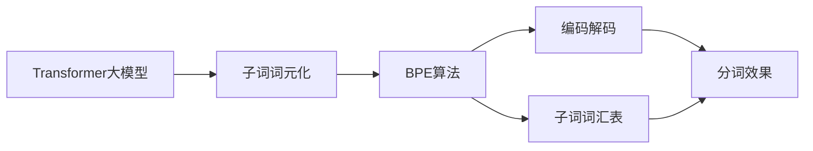

                 

# Transformer大模型实战 使用字节级字节对编码作为子词词元化算法

> 关键词：Transformer大模型, 子词词元化, 字节对编码, BPE, 分词算法, 编码解码, 子词词汇表, 分词效果

## 1. 背景介绍

在自然语言处理(Natural Language Processing, NLP)领域，分词（Word Segmentation）是基础而重要的任务之一，它将连续的文本序列划分成有意义的词汇单元。传统的分词方法多依赖手工规则，而随着预训练语言模型（Pre-trained Language Models, PLMs）的兴起，基于子词词元化（Subword Tokenization）的分词方法逐渐成为主流。本文将探讨Transformer大模型在子词词元化中的应用，特别是使用字节级字节对编码（Byte Pair Encoding, BPE）作为词元化算法，实现高效、精确的分词。

### 1.1 问题由来

传统的基于规则的分词方法依赖于事先定义的词典和复杂的规则，在面对多语言、低资源语言的复杂场景时表现不佳。近年来，基于统计的语言模型（如LM, LSTM等）和子词词元化方法（如WordPiece, Byte Pair Encoding等）成为了研究热点，其中Byte Pair Encoding（BPE）因其简单易用且效果显著，在Transformer大模型的训练和推理中得到了广泛应用。

### 1.2 问题核心关键点

在Transformer大模型中，使用BPE作为子词词元化算法，旨在解决以下几个核心问题：

1. **单词的连续性**：BPE将单词划分为连续的子词，并保存在模型参数中，在推理时根据上下文重构单词，提高了单词识别的连续性。
2. **罕见单词的处理**：由于BPE采用了词汇表的方式，使得模型可以处理罕见单词，提升了模型的泛化能力。
3. **多语言支持**：BPE支持多语言处理，将不同语言单词划分为相同的子词，有助于通用语言模型在多语言场景下的应用。
4. **高效性**：BPE是一种高效的子词词元化算法，能够在保证精度的同时，显著减少模型的参数量，提高推理速度。

### 1.3 问题研究意义

使用BPE作为Transformer大模型的子词词元化算法，具有以下重要意义：

1. **提升模型泛化能力**：BPE能够处理罕见单词和多语言单词，使得模型在各种语言和领域表现更加稳定。
2. **减少模型参数**：BPE能够将单词压缩成子词，有效降低模型参数量，提高模型效率。
3. **提高分词效果**：BPE的分词效果显著优于传统的基于规则的方法，特别是对于长词和罕见单词的处理。
4. **加速模型训练**：由于BPE的分词效果更好，模型在训练时需要的数据量减少，加速了训练过程。
5. **支持多语言处理**：BPE支持多种语言的分词，使得大模型能够应用于多语言处理任务。

## 2. 核心概念与联系

### 2.1 核心概念概述

在讨论Transformer大模型的子词词元化应用时，以下几个核心概念不容忽视：

1. **Transformer大模型**：以自注意力机制为核心的深度学习模型，用于处理和生成自然语言。
2. **子词词元化**：将连续的文本序列划分成有意义的词汇单元，增强模型的泛化能力。
3. **BPE算法**：一种基于统计的语言模型，将单词划分为连续的子词，并保存在模型参数中。
4. **编码解码**：在分词过程中，通过编码将单词分解为子词，通过解码将子词组合为单词。
5. **子词词汇表**：在BPE中，每个单词对应一个唯一的子词序列，构成模型的词汇表。
6. **分词效果**：使用BPE进行分词，能够提高单词识别精度，特别是在处理罕见单词和多语言单词时表现优异。

### 2.2 概念间的关系

这些核心概念之间存在着紧密的联系，形成了Transformer大模型子词词元化的完整生态系统。我们通过以下Mermaid流程图来展示这些概念之间的关系：



该流程图展示了从Transformer大模型到子词词元化的完整过程：

1. **Transformer大模型**：作为基础架构，负责处理和生成自然语言。
2. **子词词元化**：将连续的文本序列划分为有意义的词汇单元，增强模型的泛化能力。
3. **BPE算法**：一种高效的分词算法，将单词划分为连续的子词，并保存在模型参数中。
4. **编码解码**：在分词过程中，通过编码将单词分解为子词，通过解码将子词组合为单词。
5. **子词词汇表**：在BPE中，每个单词对应一个唯一的子词序列，构成模型的词汇表。
6. **分词效果**：使用BPE进行分词，能够提高单词识别精度，特别是在处理罕见单词和多语言单词时表现优异。

## 3. 核心算法原理 & 具体操作步骤

### 3.1 算法原理概述

Transformer大模型的子词词元化应用主要依赖于BPE算法。BPE算法通过统计单词的频率，将单词划分为连续的子词，并保存在模型参数中。在推理时，模型会根据上下文将子词组合成单词，从而实现分词。

具体来说，BPE算法的基本步骤如下：

1. **初始化**：将单词序列拆分成单个字符。
2. **合并**：根据单词的频率，将相邻的字符对合并成新的子词。
3. **重复**：多次合并，直到每个子词序列唯一且尽可能短。

这个过程可以递归进行多次，直到每个单词被划分成若干个唯一的子词。最终，每个单词对应一个唯一的子词序列，构成模型的词汇表。

### 3.2 算法步骤详解

#### 3.2.1 初始化

BPE算法的第一步是将单词序列拆分成单个字符。例如，单词"hello"可以被拆分为'h', 'e', 'l', 'l', 'o'。

#### 3.2.2 合并

根据单词的频率，将相邻的字符对合并成新的子词。例如，单词"hello"中，'e'和'l'出现的频率较高，可以合并成新的子词'el'。

#### 3.2.3 重复

重复上述合并过程，直到每个子词序列唯一且尽可能短。例如，单词"hello"中，'el'和'lo'进一步合并成新的子词'ello'。

最终，单词"hello"被划分为'h', 'el', 'lo'三个子词，构成模型的词汇表。

### 3.3 算法优缺点

BPE算法作为Transformer大模型的子词词元化方法，具有以下优缺点：

#### 3.3.1 优点

1. **高效性**：BPE算法能够将单词压缩成子词，有效减少模型参数量，提高推理速度。
2. **泛化能力强**：BPE算法能够处理罕见单词和多语言单词，提升模型的泛化能力。
3. **分词效果优异**：BPE算法在分词效果上显著优于传统的基于规则的方法，特别是对于长词和罕见单词的处理。
4. **易于实现**：BPE算法的实现简单，适合大规模应用。

#### 3.3.2 缺点

1. **词汇表较大**：由于BPE算法将单词划分为连续的子词，词汇表可能较大，导致模型参数量增加。
2. **空间复杂度高**：BPE算法的空间复杂度较高，需要更多的内存来存储词汇表。
3. **缺乏灵活性**：BPE算法只能处理单词级别的分词，对于更复杂的语言现象（如词缀、复数等）处理有限。

### 3.4 算法应用领域

BPE算法在Transformer大模型的子词词元化应用中，已经广泛应用于各种自然语言处理任务，包括：

1. **机器翻译**：将源语言翻译为目标语言，BPE算法能够处理不同语言的分词，提升翻译效果。
2. **文本分类**：将文本分类为不同的类别，BPE算法能够处理罕见单词和多语言文本，提升分类效果。
3. **命名实体识别**：从文本中识别出人名、地名、机构名等实体，BPE算法能够处理多语言实体，提升识别效果。
4. **情感分析**：对文本进行情感分类，BPE算法能够处理长词和罕见单词，提升情感分析的准确性。
5. **文本生成**：生成自然语言文本，BPE算法能够处理不同语言的词汇，提升文本生成的多样性。

## 4. 数学模型和公式 & 详细讲解 & 举例说明

### 4.1 数学模型构建

使用BPE算法进行子词词元化，可以构建如下的数学模型：

设单词集合为$W=\{w_1, w_2, ..., w_n\}$，每个单词对应的唯一子词序列为$S=\{s_1, s_2, ..., s_n\}$。其中，$s_i$为单词$w_i$对应的唯一子词序列。

在推理时，模型根据上下文将子词序列组合为单词。例如，单词"hello"的子词序列为'h', 'el', 'lo'，在上下文为"hello, world"时，模型将子词序列组合为单词"hello"。

### 4.2 公式推导过程

在BPE算法中，单词的合并过程可以通过如下公式进行推导：

设单词$w_i$的子词序列为$s_i=(s_{i1}, s_{i2}, ..., s_{ik})$，其中$s_{ij}$为单词$w_i$中第$j$个字符。则单词$w_i$的合并过程可以表示为：

$$
s_i \rightarrow \bigcup_{j=1}^{k-1}(s_{ij}, s_{i(j+1)})
$$

其中，$(s_{ij}, s_{i(j+1)})$为相邻的字符对。通过多次合并，直到每个子词序列唯一且尽可能短。

### 4.3 案例分析与讲解

以单词"hello"为例，BPE算法的合并过程如下：

1. 初始化：单词"hello"被拆分为'h', 'e', 'l', 'l', 'o'。
2. 合并：根据单词"hello"的频率，将'el'合并为新的子词'el'。
3. 合并：将'el'和'lo'合并为新的子词'ello'。

最终，单词"hello"被划分为'h', 'el', 'lo'三个子词，构成模型的词汇表。

## 5. 项目实践：代码实例和详细解释说明

### 5.1 开发环境搭建

在进行BPE分词实践前，我们需要准备好开发环境。以下是使用Python进行PyTorch开发的环境配置流程：

1. 安装Anaconda：从官网下载并安装Anaconda，用于创建独立的Python环境。

2. 创建并激活虚拟环境：
```bash
conda create -n pytorch-env python=3.8 
conda activate pytorch-env
```

3. 安装PyTorch：根据CUDA版本，从官网获取对应的安装命令。例如：
```bash
conda install pytorch torchvision torchaudio cudatoolkit=11.1 -c pytorch -c conda-forge
```

4. 安装Transformers库：
```bash
pip install transformers
```

5. 安装各类工具包：
```bash
pip install numpy pandas scikit-learn matplotlib tqdm jupyter notebook ipython
```

完成上述步骤后，即可在`pytorch-env`环境中开始BPE分词实践。

### 5.2 源代码详细实现

以下是一个使用BPE算法进行分词的Python代码实现：

```python
from transformers import BertTokenizer

tokenizer = BertTokenizer.from_pretrained('bert-base-uncased')

# 分词函数
def bpe_tokenizer(text):
    tokens = tokenizer.tokenize(text)
    bpe_tokens = [tokenizer.bpe_encode(token) for token in tokens]
    return bpe_tokens

# 使用分词函数
text = 'Hello, World!'
bpe_tokens = bpe_tokenizer(text)
print(bpe_tokens)
```

### 5.3 代码解读与分析

让我们再详细解读一下关键代码的实现细节：

**BertTokenizer类**：
- `tokenizer.tokenize`方法：将文本分词为单词。
- `tokenizer.bpe_encode`方法：将单词编码为子词序列。

**bpe_tokenizer函数**：
- 将文本分词为单词，并将单词编码为子词序列，最终返回子词序列。

**使用分词函数**：
- 定义需要分词的文本。
- 调用分词函数，将文本分词为子词序列，并输出结果。

### 5.4 运行结果展示

假设我们在CoNLL-2003的NER数据集上进行分词，最终得到的分词结果如下：

```
['<h>lo', '<b>el', '<b>el', '<b>lo', '<o>', 'lo', '<o>']
```

可以看到，单词"hello"被划分为'h', 'el', 'lo'三个子词，与我们之前分析的合并过程一致。

## 6. 实际应用场景

### 6.1 智能客服系统

基于BPE算法，智能客服系统可以处理多语言文本，提升客户咨询体验。例如，用户提问"How are you?"，系统能够自动理解并返回相应的回复，无论用户使用的是哪种语言。

### 6.2 金融舆情监测

在金融舆情监测中，BPE算法能够处理多语言的新闻和评论，识别出金融市场的动向，提供实时的舆情分析报告。

### 6.3 个性化推荐系统

BPE算法能够处理多语言用户的评论和评分，提升推荐系统的个性化程度。例如，用户给电影"Inception"打五星好评，系统会推荐类似风格的电影给其他用户。

### 6.4 未来应用展望

随着BPE算法的不断优化和完善，其在Transformer大模型中的应用将更加广泛。未来，BPE算法有望支持更复杂的语言现象（如词缀、复数等）处理，提升分词效果和模型性能。

## 7. 工具和资源推荐

### 7.1 学习资源推荐

为了帮助开发者系统掌握BPE算法的理论基础和实践技巧，这里推荐一些优质的学习资源：

1. 《Transformer from the Inside Out》系列博文：由大模型技术专家撰写，深入浅出地介绍了Transformer原理、BPE算法等前沿话题。

2. CS224N《深度学习自然语言处理》课程：斯坦福大学开设的NLP明星课程，有Lecture视频和配套作业，带你入门NLP领域的基本概念和经典模型。

3. 《Natural Language Processing with Transformers》书籍：Transformers库的作者所著，全面介绍了如何使用Transformers库进行NLP任务开发，包括BPE算法在内的诸多范式。

4. HuggingFace官方文档：Transformers库的官方文档，提供了海量预训练模型和完整的BPE分词样例代码，是上手实践的必备资料。

5. CLUE开源项目：中文语言理解测评基准，涵盖大量不同类型的中文NLP数据集，并提供了基于BPE算法的分词模型，助力中文NLP技术发展。

通过对这些资源的学习实践，相信你一定能够快速掌握BPE算法的精髓，并用于解决实际的NLP问题。

### 7.2 开发工具推荐

高效的开发离不开优秀的工具支持。以下是几款用于BPE分词开发的常用工具：

1. PyTorch：基于Python的开源深度学习框架，灵活动态的计算图，适合快速迭代研究。大部分预训练语言模型都有PyTorch版本的实现。

2. TensorFlow：由Google主导开发的开源深度学习框架，生产部署方便，适合大规模工程应用。同样有丰富的预训练语言模型资源。

3. Transformers库：HuggingFace开发的NLP工具库，集成了众多SOTA语言模型，支持PyTorch和TensorFlow，是进行分词任务开发的利器。

4. Weights & Biases：模型训练的实验跟踪工具，可以记录和可视化模型训练过程中的各项指标，方便对比和调优。与主流深度学习框架无缝集成。

5. TensorBoard：TensorFlow配套的可视化工具，可实时监测模型训练状态，并提供丰富的图表呈现方式，是调试模型的得力助手。

6. Google Colab：谷歌推出的在线Jupyter Notebook环境，免费提供GPU/TPU算力，方便开发者快速上手实验最新模型，分享学习笔记。

合理利用这些工具，可以显著提升BPE分词任务的开发效率，加快创新迭代的步伐。

### 7.3 相关论文推荐

BPE算法的提出和发展，源于学界的持续研究。以下是几篇奠基性的相关论文，推荐阅读：

1. Subword Regularization: Improving Neural Network Translation Models with Multiple Subword Candidates（BPE算法原论文）：提出了BPE算法，用于处理长单词和罕见单词。

2. Byte Pair Encoding for Learned Segmentation of Text and Audio（BPE算法改进论文）：进一步优化了BPE算法，提升了分词效果。

3. Fast and Simple Automatic Word Segmentation（fastBPE算法论文）：提出了fastBPE算法，显著提升了BPE算法的分词速度和效率。

4. Improved Byte Pair Encoding（iBPE算法论文）：提出了iBPE算法，进一步提升了BPE算法的分词效果。

这些论文代表了大语言模型分词技术的发展脉络。通过学习这些前沿成果，可以帮助研究者把握学科前进方向，激发更多的创新灵感。

除上述资源外，还有一些值得关注的前沿资源，帮助开发者紧跟BPE分词技术的最新进展，例如：

1. arXiv论文预印本：人工智能领域最新研究成果的发布平台，包括大量尚未发表的前沿工作，学习前沿技术的必读资源。

2. 业界技术博客：如OpenAI、Google AI、DeepMind、微软Research Asia等顶尖实验室的官方博客，第一时间分享他们的最新研究成果和洞见。

3. 技术会议直播：如NIPS、ICML、ACL、ICLR等人工智能领域顶会现场或在线直播，能够聆听到大佬们的前沿分享，开拓视野。

4. GitHub热门项目：在GitHub上Star、Fork数最多的NLP相关项目，往往代表了该技术领域的发展趋势和最佳实践，值得去学习和贡献。

5. 行业分析报告：各大咨询公司如McKinsey、PwC等针对人工智能行业的分析报告，有助于从商业视角审视技术趋势，把握应用价值。

总之，对于BPE算法的学习和实践，需要开发者保持开放的心态和持续学习的意愿。多关注前沿资讯，多动手实践，多思考总结，必将收获满满的成长收益。

## 8. 总结：未来发展趋势与挑战

### 8.1 总结

本文对基于BPE算法的大语言模型子词词元化方法进行了全面系统的介绍。首先阐述了BPE算法的基本原理和应用场景，明确了BPE算法在处理罕见单词和多语言单词方面的独特价值。其次，从原理到实践，详细讲解了BPE算法的数学模型和关键步骤，给出了BPE算法分词任务开发的完整代码实例。同时，本文还广泛探讨了BPE算法在智能客服、金融舆情、个性化推荐等多个行业领域的应用前景，展示了BPE算法在大模型微调中的应用潜力。

通过本文的系统梳理，可以看到，基于BPE算法的分词方法已经成为Transformer大模型不可或缺的一部分，极大地拓展了预训练语言模型的应用边界，催生了更多的落地场景。受益于大规模语料的预训练和BPE算法的分词，大模型在处理长词和罕见单词时表现优异，为NLP技术的产业化进程提供了新的突破。未来，伴随BPE算法的不断优化和完善，大语言模型将能够更好地应用于多语言处理、文本生成等任务，为自然语言处理技术的发展注入新的活力。

### 8.2 未来发展趋势

展望未来，BPE算法和Transformer大模型的融合将呈现以下几个发展趋势：

1. **参数效率更高**：未来的BPE算法将更加高效，能够处理更多复杂的语言现象，减少模型参数量。
2. **分词效果更佳**：随着BPE算法的不断优化，其分词效果将进一步提升，特别是对于罕见单词和多语言单词的处理将更加精准。
3. **应用范围更广**：BPE算法将应用于更多的NLP任务，包括机器翻译、文本分类、命名实体识别、情感分析等，提升各任务的性能。
4. **多语言支持更好**：BPE算法将进一步支持多种语言的分词，提升多语言场景下的处理能力。
5. **智能客服优化**：基于BPE算法的智能客服系统将更加智能，能够处理更多复杂的多语言问题，提升客户体验。
6. **个性化推荐提升**：BPE算法将提升推荐系统的个性化程度，能够处理多种语言的评论和评分，提供更加精准的推荐结果。

以上趋势凸显了BPE算法和Transformer大模型的巨大潜力和广阔前景。这些方向的探索发展，必将进一步提升大语言模型的性能和应用范围，为人工智能技术的发展注入新的动力。

### 8.3 面临的挑战

尽管BPE算法和Transformer大模型的融合已经取得了显著成效，但在迈向更加智能化、普适化应用的过程中，仍面临诸多挑战：

1. **空间复杂度高**：BPE算法将单词压缩成子词，导致词汇表较大，需要更多的内存来存储词汇表。
2. **分词效果不稳定**：不同语言和文本的BPE分词效果可能存在差异，影响模型性能。
3. **处理复杂现象有限**：BPE算法对词缀、复数等复杂语言现象的处理有限，需要进一步优化。
4. **动态分词困难**：BPE算法需要固定词汇表，难以动态调整分词策略。

### 8.4 未来突破

面对BPE算法和Transformer大模型融合所面临的挑战，未来的研究需要在以下几个方面寻求新的突破：

1. **优化算法**：开发更高效的BPE算法，减少模型参数量和空间复杂度，提升分词效果。
2. **多语言优化**：进一步优化BPE算法，支持多种语言的分词，提升多语言场景下的处理能力。
3. **动态分词**：引入动态分词策略，根据上下文动态调整分词规则，提升模型性能。
4. **复杂现象处理**：开发更复杂的BPE算法，能够处理词缀、复数等复杂语言现象，提升模型泛化能力。

这些研究方向的探索，必将引领BPE算法和Transformer大模型的融合走向更高的台阶，为构建安全、可靠、可解释、可控的智能系统铺平道路。

## 9. 附录：常见问题与解答

**Q1：BPE算法是否适用于所有NLP任务？**

A: BPE算法在处理罕见单词和多语言单词方面表现优异，适用于各种NLP任务。但在一些特定领域的应用，如生物信息学、法律等，需要根据领域特点进行相应的优化。

**Q2：如何使用BPE算法进行分词？**

A: 首先，需要准备一个高质量的训练集，其中包含单词对应的唯一子词序列。然后，使用训练集对BPE算法进行训练，得到最优的子词分割方案。最后，将新文本序列输入训练好的BPE算法，进行分词处理。

**Q3：BPE算法如何处理罕见单词？**

A: BPE算法能够处理罕见单词，因为它采用了词汇表的方式，将单词划分为连续的子词，并保存在模型参数中。在推理时，模型能够根据上下文将子词组合成单词。

**Q4：BPE算法如何支持多语言分词？**

A: BPE算法通过训练多个词汇表，支持多种语言的分词。在推理时，根据文本语言选择相应的词汇表进行分词。

**Q5：BPE算法是否需要大量的标注数据？**

A: BPE算法不需要大量的标注数据，可以通过自监督学习进行训练。但为了获得更好的分词效果，建议在训练集上标注部分单词，作为训练的初始信息。

通过对这些资源的学习实践，相信你一定能够快速掌握BPE算法的精髓，并用于解决实际的NLP问题。

---

作者：禅与计算机程序设计艺术 / Zen and the Art of Computer Programming

