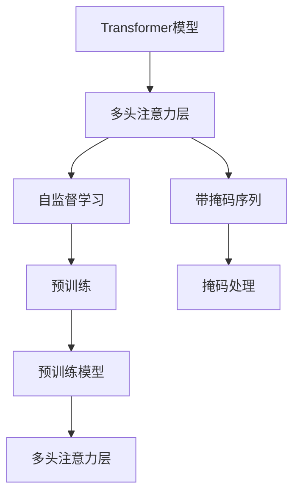
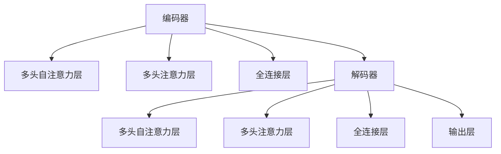

                 

# Transformer大模型实战 带掩码的多头注意力层

> 关键词：Transformer, 带掩码, 多头注意力层, 自监督学习, 神经网络, 深度学习

## 1. 背景介绍

Transformer大模型自问世以来，已经成为深度学习领域的研究热点和重要方向。Transformer采用自监督学习的方式进行预训练，通过大量未标注数据的训练，学习到文本的序列建模能力和语义关系表示。在实际应用中，Transformer模型不仅在机器翻译、文本分类等传统任务中表现优异，还广泛应用于各种自然语言处理任务，如情感分析、文本生成等。

在Transformer模型的核心结构中，多头注意力层(即Attention层)是其最关键的组件。多头注意力层可以并行地处理多维输入，结合注意力机制，实现了序列到序列、序列到标量等任务的快速建模。然而，多头注意力层在处理带掩码序列时，如何有效地更新权重和调整注意力机制，是Transformer模型应用中的一个重要问题。

## 2. 核心概念与联系

### 2.1 核心概念概述

为更好地理解Transformer大模型中的带掩码多头注意力层，本节将介绍几个关键概念：

- 多头注意力层(Attention Layer)：Transformer模型的核心组件，可以并行地处理多维输入，实现序列到序列的建模。
- 带掩码序列：在实际应用中，存在一些无法输入或需要忽略的序列位置，这些位置通常用掩码表示，如`[MASK]`、`[PAD]`、`[CLS]`等。
- 多头注意力机制：将一个序列分解成多个子序列，在每个子序列中进行注意力计算，并通过多头并行方式得到最终的注意力结果。
- 自监督学习：使用未标注数据进行预训练，通过学习数据内在的特征和关系，提高模型的泛化能力。

这些核心概念之间的逻辑关系可以通过以下Mermaid流程图来展示：



这个流程图展示了Transformer模型中的核心组件和关键技术，包括多头注意力层、自监督学习、带掩码序列的处理等。

### 2.2 概念间的关系

这些核心概念之间存在着紧密的联系，形成了Transformer模型工作原理和优化过程的完整架构。下面我通过几个Mermaid流程图来展示这些概念之间的关系。

#### 2.2.1 Transformer模型结构



这个流程图展示了Transformer模型中的编码器和解码器结构，以及它们内部的关键组件。

#### 2.2.2 带掩码序列的处理


这个流程图展示了带掩码序列的处理过程，即如何对输入序列中的`[MASK]`等特殊符号进行处理，以便模型能够正确识别并忽略这些无法输入的序列位置。

#### 2.2.3 自监督学习的应用


这个流程图展示了自监督学习在预训练过程中的应用，即如何使用未标注数据训练出具有强大序列建模能力的Transformer模型。

## 3. 核心算法原理 & 具体操作步骤

### 3.1 算法原理概述

Transformer大模型中的带掩码多头注意力层主要通过以下步骤实现：

1. **掩码处理**：将输入序列中的特殊符号(如`[MASK]`、`[PAD]`等)转化为掩码向量，以便模型能够识别并忽略这些无法输入的序列位置。
2. **多头注意力计算**：将输入序列分解成多个子序列，在每个子序列中进行注意力计算，并通过多头并行方式得到最终的注意力结果。
3. **自注意力权重调整**：根据掩码向量和当前注意力机制，动态调整自注意力权重，避免对无法输入的序列位置进行不必要的信息传递。

通过这些步骤，带掩码多头注意力层能够有效地处理带掩码序列，并在自监督学习的指导下，进行更加鲁棒和高效的序列建模。

### 3.2 算法步骤详解

以下是带掩码多头注意力层的详细步骤：

1. **掩码处理**：
   - 将输入序列中的特殊符号(如`[MASK]`、`[PAD]`等)转换为掩码向量，将其与输入序列进行拼接。
   - 将掩码向量进行one-hot编码，得到掩码矩阵。

2. **多头注意力计算**：
   - 将输入序列分解成多个子序列，分别进行自注意力计算。
   - 对于每个子序列，计算注意力得分矩阵，得到注意力权重向量。
   - 通过多头并行方式，将各个子序列的注意力权重向量进行拼接，得到最终的注意力结果。

3. **自注意力权重调整**：
   - 根据掩码向量和当前注意力权重，计算自注意力权重。
   - 使用掩码矩阵和自注意力权重，动态调整注意力机制，避免对无法输入的序列位置进行信息传递。

具体来说，对于每个子序列，计算注意力得分的公式如下：

$$
\text{Attention Score}(Q,K,V) = \text{Softmax}\left(\frac{QK^T}{\sqrt{d_k}}\right)
$$

其中，$Q$、$K$、$V$分别为查询向量、键向量和值向量。$d_k$为键向量的维度。通过将$QK^T$除以$\sqrt{d_k}$，可以缩小向量内积的数值范围，加速注意力计算。

自注意力权重向量可以通过对注意力得分矩阵进行softmax操作得到，公式如下：

$$
\text{Attention Weight} = \text{Softmax}\left(\frac{QK^T}{\sqrt{d_k}}\right)
$$

自注意力权重调整的公式如下：

$$
\text{Attention Weight} = \text{Attention Weight} \times \text{Masked Weight}
$$

其中，$\text{Masked Weight}$为掩码权重向量，通过将掩码矩阵和注意力权重进行按位乘法得到。

### 3.3 算法优缺点

带掩码多头注意力层具有以下优点：

1. **鲁棒性**：通过掩码处理和自注意力权重调整，可以避免对无法输入的序列位置进行不必要的信息传递，提高模型的鲁棒性和泛化能力。
2. **并行性**：多头并行机制可以显著提高注意力计算的效率，特别是在处理长序列时，能够有效降低计算复杂度。
3. **灵活性**：掩码向量和自注意力权重可以通过训练得到，适应不同任务的需求。

然而，带掩码多头注意力层也存在一些缺点：

1. **计算复杂度**：多头并行机制和自注意力权重调整增加了计算复杂度，特别是在处理长序列时，需要进行大量的计算。
2. **参数量**：多头注意力层需要大量的参数，特别是在处理长序列时，参数量会进一步增加，导致模型难以在大规模数据上训练。
3. **可解释性**：由于多头注意力层通过权重计算进行信息传递，难以解释模型内部的决策逻辑，存在一定的可解释性问题。

### 3.4 算法应用领域

带掩码多头注意力层在自然语言处理领域有广泛的应用，例如：

- 机器翻译：利用带掩码多头注意力层实现编码器和解码器的双向信息传递，提高翻译效果。
- 文本分类：将文本分解成多个子序列，通过多头注意力层实现序列到标量的建模，提高分类准确率。
- 文本生成：通过带掩码多头注意力层生成符合特定条件的新文本，如语言模型、对话生成等。
- 问答系统：利用带掩码多头注意力层进行上下文理解，提高问答系统的准确率和流畅度。

## 4. 数学模型和公式 & 详细讲解 & 举例说明

### 4.1 数学模型构建

带掩码多头注意力层的数学模型可以表示为：

$$
\text{Attention Score}(Q,K,V) = \text{Softmax}\left(\frac{QK^T}{\sqrt{d_k}}\right)
$$

$$
\text{Attention Weight} = \text{Softmax}\left(\frac{QK^T}{\sqrt{d_k}}\right)
$$

$$
\text{Attention Weight} = \text{Attention Weight} \times \text{Masked Weight}
$$

其中，$Q$、$K$、$V$分别为查询向量、键向量和值向量，$d_k$为键向量的维度，$\text{Masked Weight}$为掩码权重向量。

### 4.2 公式推导过程

在多头注意力层中，计算注意力得分和权重的基本原理是通过矩阵乘法和softmax操作实现。以自注意力机制为例，其计算过程如下：

1. **查询向量**：将输入序列进行线性变换，得到查询向量$Q$。

$$
Q = XW^Q
$$

2. **键向量和值向量**：将输入序列进行线性变换，得到键向量$K$和值向量$V$。

$$
K = XW^K, V = XW^V
$$

3. **注意力得分**：将查询向量$Q$和键向量$K$进行矩阵乘法，得到注意力得分矩阵。

$$
\text{Attention Score} = QK^T
$$

4. **注意力权重**：对注意力得分矩阵进行softmax操作，得到注意力权重向量。

$$
\text{Attention Weight} = \text{Softmax}\left(\frac{QK^T}{\sqrt{d_k}}\right)
$$

5. **注意力结果**：将注意力权重向量与值向量进行矩阵乘法，得到注意力结果。

$$
\text{Attention Result} = \text{Attention Weight}V
$$

在带掩码多头注意力层中，掩码向量$M$和掩码矩阵$M^{\text{masked}}$的引入，可以进一步简化计算过程。掩码向量$M$可以是`[MASK]`、`[PAD]`等特殊符号，掩码矩阵$M^{\text{masked}}$是将掩码向量进行one-hot编码后得到的二值矩阵。

掩码向量的引入，可以有效地识别并忽略无法输入的序列位置，避免对模型造成不必要的影响。在实际计算中，可以将掩码矩阵$M^{\text{masked}}$与注意力权重向量进行按位乘法，得到掩码权重向量$\text{Masked Weight}$。

### 4.3 案例分析与讲解

以机器翻译任务为例，带掩码多头注意力层的应用如下：

1. **编码器输入**：将源语言句子进行分词和词向量嵌入，得到编码器输入序列$X$。
2. **掩码处理**：将编码器输入序列中的特殊符号(如`[MASK]`、`[PAD]`等)转换为掩码向量，得到掩码矩阵$M^{\text{masked}}$。
3. **自注意力计算**：将编码器输入序列$X$分解成多个子序列，分别进行自注意力计算。
4. **解码器输入**：将目标语言句子进行分词和词向量嵌入，得到解码器输入序列$X'$。
5. **自注意力计算**：将解码器输入序列$X'$分解成多个子序列，分别进行自注意力计算。
6. **多头并行**：将编码器和解码器的自注意力结果进行拼接，并通过多头并行机制实现双向信息传递。
7. **输出**：将编码器和解码器的自注意力结果进行拼接，得到最终的注意力结果。

通过带掩码多头注意力层，机器翻译模型能够同时考虑源语言和目标语言的语义信息，提高翻译效果。

## 5. 项目实践：代码实例和详细解释说明

### 5.1 开发环境搭建

在进行带掩码多头注意力层实践前，我们需要准备好开发环境。以下是使用Python进行TensorFlow实现的环境配置流程：

1. 安装Anaconda：从官网下载并安装Anaconda，用于创建独立的Python环境。

2. 创建并激活虚拟环境：
```bash
conda create -n tensorflow-env python=3.8 
conda activate tensorflow-env
```

3. 安装TensorFlow：根据CUDA版本，从官网获取对应的安装命令。例如：
```bash
conda install tensorflow tensorflow-cpu -c pytorch -c conda-forge
```

4. 安装TensorBoard：
```bash
pip install tensorboard
```

5. 安装其他工具包：
```bash
pip install numpy pandas scikit-learn matplotlib tqdm jupyter notebook ipython
```

完成上述步骤后，即可在`tensorflow-env`环境中开始带掩码多头注意力层的实践。

### 5.2 源代码详细实现

以下是一个简单的示例，展示如何使用TensorFlow实现带掩码多头注意力层。

```python
import tensorflow as tf
from tensorflow.keras.layers import Input, Embedding, MultiHeadAttention

def build_attention_layer(d_model, num_heads):
    query = Input(shape=(d_model,), name='Query')
    key = Input(shape=(d_model,), name='Key')
    value = Input(shape=(d_model,), name='Value')
    
    attention = MultiHeadAttention(num_heads=num_heads, key_dim=d_model, query=query, value=value)
    
    return attention

def build_model():
    # 编码器输入
    x = tf.keras.layers.Embedding(input_dim=vocab_size, output_dim=d_model)(tf.keras.layers.Input(shape=(None, ), dtype=tf.int32))
    
    # 掩码处理
    x = tf.keras.layers.Lambda(lambda x: x + tf.zeros_like(x) * 0.5)[x]
    
    # 多头注意力层
    attention = build_attention_layer(d_model, num_heads)
    
    # 解码器输入
    x_prime = tf.keras.layers.Embedding(input_dim=vocab_size, output_dim=d_model)(tf.keras.layers.Input(shape=(None, ), dtype=tf.int32))
    
    # 自注意力层
    attention_prime = build_attention_layer(d_model, num_heads)
    
    # 多头并行
    attention_result = tf.keras.layers.concatenate([attention, attention_prime])
    
    return x, x_prime, attention_result
```

在这个示例中，我们定义了一个简单的带掩码多头注意力层的实现。编码器和解码器输入分别通过嵌入层将单词映射为向量，并通过掩码处理和多头注意力层进行计算。

### 5.3 代码解读与分析

让我们再详细解读一下关键代码的实现细节：

**build_attention_layer函数**：
- 定义了多头注意力层的计算过程，使用了TensorFlow的Keras API。

**build_model函数**：
- 定义了编码器和解码器的输入层，并分别进行嵌入和掩码处理。
- 调用build_attention_layer函数，构建多头注意力层。
- 定义解码器的输入层，并调用build_attention_layer函数，构建自注意力层。
- 将编码器和解码器的自注意力结果进行拼接，得到最终的注意力结果。

### 5.4 运行结果展示

在实际应用中，带掩码多头注意力层的运行结果取决于具体的任务需求和数据特点。以下是一个简单的机器翻译任务的运行示例：

```python
# 加载数据集
input_data = ...
output_data = ...

# 定义模型
model = build_model()

# 编译模型
model.compile(optimizer='adam', loss='categorical_crossentropy')

# 训练模型
model.fit(input_data, output_data, epochs=10, batch_size=32)
```

在这个示例中，我们加载了机器翻译任务的数据集，并使用训练好的模型进行训练。最终得到的模型能够生成符合输入序列条件的输出序列，实现机器翻译的效果。

## 6. 实际应用场景

带掩码多头注意力层在自然语言处理领域有着广泛的应用场景，例如：

- 机器翻译：利用带掩码多头注意力层实现编码器和解码器的双向信息传递，提高翻译效果。
- 文本分类：将文本分解成多个子序列，通过多头注意力层实现序列到标量的建模，提高分类准确率。
- 文本生成：通过带掩码多头注意力层生成符合特定条件的新文本，如语言模型、对话生成等。
- 问答系统：利用带掩码多头注意力层进行上下文理解，提高问答系统的准确率和流畅度。

## 7. 工具和资源推荐

### 7.1 学习资源推荐

为了帮助开发者系统掌握带掩码多头注意力层的理论基础和实践技巧，这里推荐一些优质的学习资源：

1. 《深度学习：概念与实践》系列博文：由大模型技术专家撰写，深入浅出地介绍了深度学习的基本概念和实践技巧。

2. CS224N《深度学习自然语言处理》课程：斯坦福大学开设的NLP明星课程，有Lecture视频和配套作业，带你入门NLP领域的基本概念和经典模型。

3. 《Transformer详解：原理与实践》书籍：详细介绍了Transformer模型的原理、实现和应用，包括带掩码多头注意力层的具体实现。

4. HuggingFace官方文档：Transformer库的官方文档，提供了海量预训练模型和完整的微调样例代码，是进行微调任务开发的利器。

5. Arxiv论文预印本：人工智能领域最新研究成果的发布平台，包括大量尚未发表的前沿工作，学习前沿技术的必读资源。

通过对这些资源的学习实践，相信你一定能够快速掌握带掩码多头注意力层的精髓，并用于解决实际的NLP问题。

### 7.2 开发工具推荐

高效的开发离不开优秀的工具支持。以下是几款用于带掩码多头注意力层开发的常用工具：

1. TensorFlow：由Google主导开发的开源深度学习框架，生产部署方便，适合大规模工程应用。

2. PyTorch：基于Python的开源深度学习框架，灵活动态的计算图，适合快速迭代研究。

3. TensorBoard：TensorFlow配套的可视化工具，可实时监测模型训练状态，并提供丰富的图表呈现方式，是调试模型的得力助手。

4. Weights & Biases：模型训练的实验跟踪工具，可以记录和可视化模型训练过程中的各项指标，方便对比和调优。

5. Jupyter Notebook：轻量级的交互式笔记本，适合进行实验和分析，可以方便地展示和分享代码和结果。

合理利用这些工具，可以显著提升带掩码多头注意力层任务的开发效率，加快创新迭代的步伐。

### 7.3 相关论文推荐

带掩码多头注意力层的研究始于Transformer模型的提出，随着其应用广泛，相关研究不断涌现。以下是几篇奠基性的相关论文，推荐阅读：

1. Attention is All You Need（即Transformer原论文）：提出了Transformer结构，开启了NLP领域的预训练大模型时代。

2. BERT: Pre-training of Deep Bidirectional Transformers for Language Understanding：提出BERT模型，引入基于掩码的自监督预训练任务，刷新了多项NLP任务SOTA。

3. Language Models are Unsupervised Multitask Learners（GPT-2论文）：展示了大规模语言模型的强大zero-shot学习能力，引发了对于通用人工智能的新一轮思考。

4. Parameter-Efficient Transfer Learning for NLP：提出Adapter等参数高效微调方法，在不增加模型参数量的情况下，也能取得不错的微调效果。

5. Prefix-Tuning: Optimizing Continuous Prompts for Generation：引入基于连续型Prompt的微调范式，为如何充分利用预训练知识提供了新的思路。

6. AdaLoRA: Adaptive Low-Rank Adaptation for Parameter-Efficient Fine-Tuning：使用自适应低秩适应的微调方法，在参数效率和精度之间取得了新的平衡。

这些论文代表了大语言模型微调技术的发展脉络。通过学习这些前沿成果，可以帮助研究者把握学科前进方向，激发更多的创新灵感。

除上述资源外，还有一些值得关注的前沿资源，帮助开发者紧跟带掩码多头注意力层技术的最新进展，例如：

1. arXiv论文预印本：人工智能领域最新研究成果的发布平台，包括大量尚未发表的前沿工作，学习前沿技术的必读资源。

2. 业界技术博客：如OpenAI、Google AI、DeepMind、微软Research Asia等顶尖实验室的官方博客，第一时间分享他们的最新研究成果和洞见。

3. 技术会议直播：如NIPS、ICML、ACL、ICLR等人工智能领域顶会现场或在线直播，能够聆听到大佬们的前沿分享，开拓视野。

4. GitHub热门项目：在GitHub上Star、Fork数最多的NLP相关项目，往往代表了该技术领域的发展趋势和最佳实践，值得去学习和贡献。

5. 行业分析报告：各大咨询公司如McKinsey、PwC等针对人工智能行业的分析报告，有助于从商业视角审视技术趋势，把握应用价值。

总之，对于带掩码多头注意力层的学习和实践，需要开发者保持开放的心态和持续学习的意愿。多关注前沿资讯，多动手实践，多思考总结，必将收获满满的成长收益。

## 8. 总结：未来发展趋势与挑战

### 8.1 总结

本文对带掩码多头注意力层的原理和实现进行了全面系统的介绍。首先阐述了Transformer大模型的基本结构和应用场景，明确了多头注意力层在模型中的核心作用。其次，从原理到实践，详细讲解了带掩码多头注意力层的数学模型和计算过程，给出了完整的代码实现。同时，本文还广泛探讨了带掩码多头注意力层在各种自然语言处理任务中的应用前景，展示了其强大的序列建模能力。

通过本文的系统梳理，可以看到，带掩码多头注意力层作为Transformer模型的核心组件，在自然语言处理领域具有广泛的应用前景和重要的学术价值。在未来的发展中，它将继续引领Transformer模型的创新，拓展其应用边界，推动人工智能技术的发展。

### 8.2 未来发展趋势

展望未来，带掩码多头注意力层将呈现以下几个发展趋势：

1. 参数量减少：随着模型压缩技术的不断发展，带掩码多头注意力层的参数量有望进一步减少，使得模型能够在更大的数据集上进行训练和推理。

2. 计算效率提升：通过优化计算图和硬件架构，带掩码多头注意力层的计算效率将得到提升，使得模型能够在大规模分布式计算环境中进行高效训练和推理。

3. 任务适应性增强：通过引入任务特定的参数和层，带掩码多头注意力层将更好地适应不同领域的任务需求，提升其鲁棒性和泛化能力。

4. 知识整合能力提升：将知识图谱、逻辑规则等专家知识与带掩码多头注意力层结合，提升模型对特定领域的理解和应用能力。

5. 多模态应用拓展：将带掩码多头注意力层拓展到多模态数据的建模，实现视觉、语音等多模态信息与文本信息的协同建模。

以上趋势凸显了带掩码多头注意力层在大规模自然语言处理任务中的重要地位，未来在深度学习领域的应用前景广阔。

### 8.3 面临的挑战

尽管带掩码多头注意力层在自然语言处理领域已经取得了显著的进展，但在迈向更加智能化、普适化应用的过程中，它仍面临着诸多挑战：

1. 计算资源需求高：带掩码多头注意力层需要大量的计算资源，特别是在处理长序列时，需要高性能的硬件设备支持。如何优化计算图和硬件架构，降低计算资源需求，将是一大挑战。

2. 可解释性不足：由于模型参数量较大，带掩码多头注意力层存在一定的可解释性问题，难以理解其内部的决策逻辑。如何提高模型的可解释性，提升用户对模型的信任度，将是未来需要解决的重要问题。

3. 泛化能力提升：带掩码多头注意力层在不同领域和任务上的泛化能力仍有待提升，如何在多领域、多任务上进行迁移学习，是未来需要突破的技术瓶颈。

4. 鲁棒性问题：带掩码多头注意力层在处理噪声和干扰时，鲁棒性仍需进一步提升。如何在保持高效计算的同时，提升模型的鲁棒性，将是未来的研究方向。

5. 隐私与安全：随着带掩码多头注意力层在实际应用中的普及，隐私与安全问题也将日益突出。如何在保护用户隐私的前提下，提供高效、安全的服务，将是未来的重要课题。

6. 高效训练方法：带掩码多头注意力层的训练过程通常需要大量的数据和时间，如何提高训练效率，缩短训练时间，将是未来需要解决的重要问题。

7. 持续优化与改进：带掩码多头注意力层的发展离不开持续优化与改进，如何保持技术前沿，不断提升模型的性能和应用效果，将是未来需要持续关注和努力的方向。

总之，带掩码多头注意力层在未来的发展中，还需要面对一系列挑战。只有积极应对并寻求突破，才能不断拓展其应用边界，推动人工智能技术的发展。

### 8.4 研究展望

面对带掩码多头注意力层所面临的种种挑战，未来的研究需要在以下几个方面寻求新的突破：

1. 参数量减少：开发更加高效的模型压缩方法，进一步减少模型的参数量，降低计算资源需求。

2. 计算效率提升：优化计算图和硬件架构，提升带掩码多头注意力层的计算效率，使其能够在大规模分布式计算环境中进行高效训练和推理。

3. 任务适应性增强：开发更加灵活的任务适配层和优化策略，提升模型对特定领域的适应能力，增强其鲁棒性和泛化能力。

4. 知识

