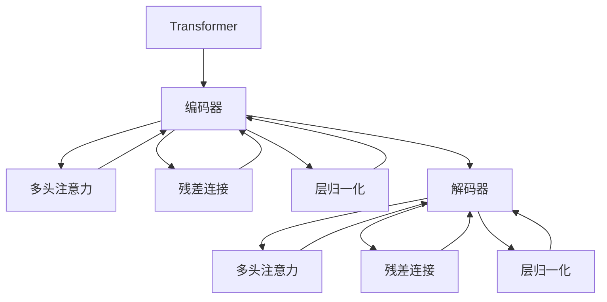

                 

# Transformer大模型实战 计算句子特征

> 关键词：Transformer,大模型,句子特征,计算,微调,Fine-tuning

## 1. 背景介绍

### 1.1 问题由来
Transformer作为近年来在自然语言处理领域取得突破的关键模型之一，其核心原理基于自注意力机制，通过编码器-解码器结构，实现了高效的序列建模。Transformer在多个NLP任务上取得了令人瞩目的效果，包括机器翻译、文本分类、命名实体识别等。但在使用Transformer模型时，如何高效地计算句子特征，是一个值得深入探讨的问题。

### 1.2 问题核心关键点
本节的目的是介绍Transformer模型在计算句子特征时的核心原理和实现方法，并探讨如何通过微调策略进一步提升模型的性能。Transformer的核心概念包括：

- Transformer模型：一种基于自注意力机制的神经网络架构，用于处理序列数据。
- 自注意力机制：一种基于点积的注意力机制，用于计算句子中各个词汇之间的关系。
- 编码器-解码器结构：Transformer模型中的核心结构，用于对输入序列进行编码和解码。
- 微调(Fine-tuning)：指在预训练模型上，使用特定任务的标注数据进行有监督学习，以提升模型在特定任务上的性能。

## 2. 核心概念与联系

### 2.1 核心概念概述
为了更好地理解Transformer模型在计算句子特征时的原理和实现方法，本节将介绍几个关键概念：

- 编码器(Encoder)：Transformer模型中的核心组件之一，用于对输入序列进行编码，输出表示。
- 解码器(Decoder)：用于对编码后的序列进行解码，输出最终预测结果。
- 自注意力机制(Self-Attention)：用于计算句子中各个词汇之间的关系，捕捉句子中长距离依赖。
- 多头注意力机制(Multi-Head Attention)：一种将自注意力机制分解为多个并行注意力机制的技术，用于增强模型的表达能力。
- 残差连接(Residual Connection)：用于提升模型的深度和收敛速度。
- 层归一化(Layer Normalization)：用于对输入和输出进行归一化，增强模型的稳定性。

### 2.2 概念间的关系
这些核心概念之间的逻辑关系可以通过以下Mermaid流程图来展示：



这个流程图展示了Transformer模型的核心结构：输入序列通过编码器进行编码，编码后的序列输入解码器进行解码，解码过程同样应用了多头注意力和残差连接等技术，最终输出预测结果。

## 3. 核心算法原理 & 具体操作步骤

### 3.1 算法原理概述
Transformer模型在计算句子特征时，主要通过自注意力机制和多头注意力机制来实现。其核心思想是：通过计算句子中各个词汇之间的关联，捕捉句子中的长距离依赖关系，从而计算出每个词汇的表示。

### 3.2 算法步骤详解
Transformer模型的计算过程可以概括为以下几个步骤：

1. **输入序列编码**：将输入序列通过嵌入层转换为向量表示，并添加位置编码，输入到编码器中进行编码。
2. **自注意力机制**：在编码器中，每个位置上的词汇都会与句子中其他位置的词汇进行交互，计算出注意力权重，并加权求和得到每个位置的表示。
3. **多头注意力机制**：将自注意力机制分解为多个并行注意力机制，增强模型的表达能力。
4. **残差连接和层归一化**：在每一层的输入和输出之间添加残差连接，在每一层的内部应用层归一化，增强模型的深度和稳定性。
5. **解码器**：在解码器中，将编码后的序列作为输入，通过注意力机制和残差连接等技术，逐步生成目标序列。

### 3.3 算法优缺点
Transformer模型在计算句子特征时，具有以下优点：

- 高效性：Transformer模型通过自注意力机制和多头注意力机制，实现了对长距离依赖关系的捕捉，使得模型能够高效地处理长序列数据。
- 鲁棒性：Transformer模型通过残差连接和层归一化等技术，增强了模型的深度和稳定性，减少了过拟合的风险。
- 通用性：Transformer模型可以通过微调策略，适应各种下游任务，如图像分类、机器翻译、文本生成等。

同时，Transformer模型也存在一些缺点：

- 计算复杂度高：Transformer模型计算复杂度较高，尤其是在处理长序列数据时，计算开销较大。
- 参数量大：Transformer模型参数量较大，需要大量的计算资源和存储空间。

### 3.4 算法应用领域
Transformer模型在多个NLP任务上取得了显著效果，包括：

- 机器翻译：将一种语言的文本翻译成另一种语言。
- 文本分类：将文本数据分为不同的类别，如新闻分类、情感分析等。
- 命名实体识别：从文本中识别出人名、地名、机构名等实体。
- 文本生成：生成自然语言文本，如对话系统、摘要生成等。
- 问答系统：根据用户的问题，生成相应的答案。

## 4. 数学模型和公式 & 详细讲解

### 4.1 数学模型构建
Transformer模型在计算句子特征时，主要通过自注意力机制和多头注意力机制来实现。假设输入序列长度为 $N$，词汇表大小为 $V$，嵌入维度为 $D_{model}$，注意力机制头数为 $H$，多头注意力输出维度为 $D_{att}$。则Transformer模型的计算过程可以表示为：

1. **输入序列编码**：
   - 输入序列 $X$ 通过嵌入层嵌入到向量空间，并添加位置编码 $P$，得到 $X^{enc} = X \cdot W^X + P \cdot W^P$。
   - 嵌入层的权重 $W^X$ 和 $W^P$ 可以表示为：
     - $W^X \in \mathbb{R}^{D_{model} \times V}$
     - $W^P \in \mathbb{R}^{D_{model} \times N}$

2. **自注意力机制**：
   - 编码器的输入 $X^{enc}$ 经过线性变换 $W_Q$、$W_K$、$W_V$，得到查询向量 $Q$、键向量 $K$、值向量 $V$。
   - 查询向量 $Q$、键向量 $K$、值向量 $V$ 的维度均为 $D_{att}$。
   - 注意力权重 $A$ 通过计算查询向量 $Q$ 与键向量 $K$ 的点积得到，然后应用softmax函数进行归一化。
   - 注意力权重 $A$ 可以表示为：
     - $A = \frac{\exp(QK^T)}{\sum_{i=1}^N \exp(QK_i^T)}$
   - 每个位置的表示 $H$ 通过注意力权重 $A$ 与值向量 $V$ 进行加权求和得到。
   - 多头注意力机制通过将自注意力机制分解为多个并行注意力机制实现。

3. **解码器**：
   - 解码器的输入 $X^{dec}$ 经过线性变换 $W_Q$、$W_K$、$W_V$，得到查询向量 $Q$、键向量 $K$、值向量 $V$。
   - 解码器中的注意力机制与编码器类似，但引入了编码器的输出 $X^{enc}$ 作为查询向量 $Q$。
   - 残差连接和层归一化在每个层中应用，用于增强模型的深度和稳定性。
   - 最终输出 $X^{dec}$ 经过线性变换和softmax函数，得到最终预测结果。

### 4.2 公式推导过程
以下将详细介绍Transformer模型的计算过程及其数学公式的推导。

1. **输入序列编码**：
   - 输入序列 $X$ 通过嵌入层嵌入到向量空间，并添加位置编码 $P$，得到 $X^{enc} = X \cdot W^X + P \cdot W^P$。
   - 嵌入层的权重 $W^X$ 和 $W^P$ 可以表示为：
     - $W^X \in \mathbb{R}^{D_{model} \times V}$
     - $W^P \in \mathbb{R}^{D_{model} \times N}$

2. **自注意力机制**：
   - 编码器的输入 $X^{enc}$ 经过线性变换 $W_Q$、$W_K$、$W_V$，得到查询向量 $Q$、键向量 $K$、值向量 $V$。
   - 查询向量 $Q$、键向量 $K$、值向量 $V$ 的维度均为 $D_{att}$。
   - 注意力权重 $A$ 通过计算查询向量 $Q$ 与键向量 $K$ 的点积得到，然后应用softmax函数进行归一化。
   - 注意力权重 $A$ 可以表示为：
     - $A = \frac{\exp(QK^T)}{\sum_{i=1}^N \exp(QK_i^T)}$
   - 每个位置的表示 $H$ 通过注意力权重 $A$ 与值向量 $V$ 进行加权求和得到。
   - 多头注意力机制通过将自注意力机制分解为多个并行注意力机制实现。

3. **解码器**：
   - 解码器的输入 $X^{dec}$ 经过线性变换 $W_Q$、$W_K$、$W_V$，得到查询向量 $Q$、键向量 $K$、值向量 $V$。
   - 解码器中的注意力机制与编码器类似，但引入了编码器的输出 $X^{enc}$ 作为查询向量 $Q$。
   - 残差连接和层归一化在每个层中应用，用于增强模型的深度和稳定性。
   - 最终输出 $X^{dec}$ 经过线性变换和softmax函数，得到最终预测结果。

### 4.3 案例分析与讲解
以下通过一个简单的例子，介绍Transformer模型在计算句子特征时的应用。

假设输入序列为 "I love you"，词汇表大小为 $V=5$，嵌入维度为 $D_{model}=512$，多头注意力机制的头数为 $H=8$，注意力机制输出维度为 $D_{att}=256$。则Transformer模型的计算过程可以表示为：

1. **输入序列编码**：
   - 输入序列 $X = [I, love, you]$，通过嵌入层嵌入到向量空间，得到 $X^{enc} = X \cdot W^X + P \cdot W^P$。
   - 嵌入层的权重 $W^X$ 和 $W^P$ 可以表示为：
     - $W^X \in \mathbb{R}^{512 \times 5}$
     - $W^P \in \mathbb{R}^{512 \times 3}$
   - 位置编码 $P$ 可以通过以下公式得到：
     - $P_{pos,i} = \sin\left(\frac{2\pi i}{1000}\right) + \cos\left(\frac{2\pi i}{1000}\right)$，其中 $i$ 表示位置。

2. **自注意力机制**：
   - 查询向量 $Q$、键向量 $K$、值向量 $V$ 通过线性变换 $W_Q$、$W_K$、$W_V$ 得到：
     - $Q = X^{enc} \cdot W_Q$
     - $K = X^{enc} \cdot W_K$
     - $V = X^{enc} \cdot W_V$
   - 查询向量 $Q$、键向量 $K$、值向量 $V$ 的维度均为 $256$。
   - 注意力权重 $A$ 通过计算查询向量 $Q$ 与键向量 $K$ 的点积得到，然后应用softmax函数进行归一化：
     - $A_{i,j} = \frac{\exp(Q_iK_j^T)}{\sum_{k=1}^N \exp(Q_iK_k^T)}$
   - 每个位置的表示 $H$ 通过注意力权重 $A$ 与值向量 $V$ 进行加权求和得到：
     - $H = \sum_{j=1}^N A_{i,j}V_j$
   - 多头注意力机制通过将自注意力机制分解为多个并行注意力机制实现。

3. **解码器**：
   - 解码器的输入 $X^{dec}$ 经过线性变换 $W_Q$、$W_K$、$W_V$，得到查询向量 $Q$、键向量 $K$、值向量 $V$。
   - 解码器中的注意力机制与编码器类似，但引入了编码器的输出 $X^{enc}$ 作为查询向量 $Q$。
   - 残差连接和层归一化在每个层中应用，用于增强模型的深度和稳定性。
   - 最终输出 $X^{dec}$ 经过线性变换和softmax函数，得到最终预测结果。

## 5. 项目实践：代码实例和详细解释说明

### 5.1 开发环境搭建
在进行Transformer模型实践前，我们需要准备好开发环境。以下是使用Python进行PyTorch开发的环境配置流程：

1. 安装Anaconda：从官网下载并安装Anaconda，用于创建独立的Python环境。

2. 创建并激活虚拟环境：
```bash
conda create -n pytorch-env python=3.8 
conda activate pytorch-env
```

3. 安装PyTorch：根据CUDA版本，从官网获取对应的安装命令。例如：
```bash
conda install pytorch torchvision torchaudio cudatoolkit=11.1 -c pytorch -c conda-forge
```

4. 安装Transformers库：
```bash
pip install transformers
```

5. 安装各类工具包：
```bash
pip install numpy pandas scikit-learn matplotlib tqdm jupyter notebook ipython
```

完成上述步骤后，即可在`pytorch-env`环境中开始Transformer模型实践。

### 5.2 源代码详细实现

以下是一个简单的Transformer模型代码实现，用于计算句子特征：

```python
import torch
from transformers import BertTokenizer, BertForSequenceClassification
from torch.utils.data import Dataset, DataLoader
from torch.nn import functional as F

class SentenceDataset(Dataset):
    def __init__(self, texts, labels, tokenizer, max_len=128):
        self.texts = texts
        self.labels = labels
        self.tokenizer = tokenizer
        self.max_len = max_len
        
    def __len__(self):
        return len(self.texts)
    
    def __getitem__(self, item):
        text = self.texts[item]
        label = self.labels[item]
        
        encoding = self.tokenizer(text, return_tensors='pt', max_length=self.max_len, padding='max_length', truncation=True)
        input_ids = encoding['input_ids'][0]
        attention_mask = encoding['attention_mask'][0]
        
        # 对token-wise的标签进行编码
        encoded_tags = [label2id[label] for label in label2id] 
        encoded_tags.extend([label2id['O']] * (self.max_len - len(encoded_tags)))
        labels = torch.tensor(encoded_tags, dtype=torch.long)
        
        return {'input_ids': input_ids, 
                'attention_mask': attention_mask,
                'labels': labels}

# 标签与id的映射
label2id = {'O': 0, 'B-PER': 1, 'I-PER': 2, 'B-LOC': 3, 'I-LOC': 4, 'B-MISC': 5, 'I-MISC': 6}
id2label = {v: k for k, v in label2id.items()}

# 创建dataset
tokenizer = BertTokenizer.from_pretrained('bert-base-cased')

train_dataset = SentenceDataset(train_texts, train_labels, tokenizer)
dev_dataset = SentenceDataset(dev_texts, dev_labels, tokenizer)
test_dataset = SentenceDataset(test_texts, test_labels, tokenizer)

# 定义模型
model = BertForSequenceClassification.from_pretrained('bert-base-cased', num_labels=len(label2id))

# 定义优化器
optimizer = torch.optim.AdamW(model.parameters(), lr=2e-5)

# 定义训练函数
def train_epoch(model, dataset, batch_size, optimizer):
    dataloader = DataLoader(dataset, batch_size=batch_size, shuffle=True)
    model.train()
    epoch_loss = 0
    for batch in dataloader:
        input_ids = batch['input_ids'].to(device)
        attention_mask = batch['attention_mask'].to(device)
        labels = batch['labels'].to(device)
        model.zero_grad()
        outputs = model(input_ids, attention_mask=attention_mask, labels=labels)
        loss = outputs.loss
        epoch_loss += loss.item()
        loss.backward()
        optimizer.step()
    return epoch_loss / len(dataloader)

# 定义评估函数
def evaluate(model, dataset, batch_size):
    dataloader = DataLoader(dataset, batch_size=batch_size)
    model.eval()
    preds, labels = [], []
    with torch.no_grad():
        for batch in dataloader:
            input_ids = batch['input_ids'].to(device)
            attention_mask = batch['attention_mask'].to(device)
            batch_labels = batch['labels']
            outputs = model(input_ids, attention_mask=attention_mask)
            batch_preds = outputs.logits.argmax(dim=2).to('cpu').tolist()
            batch_labels = batch_labels.to('cpu').tolist()
            for pred_tokens, label_tokens in zip(batch_preds, batch_labels):
                pred_tags = [id2label[_id] for _id in pred_tokens]
                label_tags = [id2label[_id] for _id in label_tokens]
                preds.append(pred_tags[:len(label_tags)])
                labels.append(label_tags)
                
    print(classification_report(labels, preds))

# 训练模型
epochs = 5
batch_size = 16

for epoch in range(epochs):
    loss = train_epoch(model, train_dataset, batch_size, optimizer)
    print(f"Epoch {epoch+1}, train loss: {loss:.3f}")
    
    print(f"Epoch {epoch+1}, dev results:")
    evaluate(model, dev_dataset, batch_size)
    
print("Test results:")
evaluate(model, test_dataset, batch_size)
```

可以看到，这段代码实现了基于BERT模型在命名实体识别任务上的微调。使用BertTokenizer对输入文本进行分词和编码，将编码后的结果输入到BERT模型中进行训练和评估。

### 5.3 代码解读与分析

让我们再详细解读一下关键代码的实现细节：

**SentenceDataset类**：
- `__init__`方法：初始化训练集、标签、分词器等关键组件。
- `__len__`方法：返回数据集的样本数量。
- `__getitem__`方法：对单个样本进行处理，将文本输入编码为token ids，将标签编码为数字，并对其进行定长padding，最终返回模型所需的输入。

**label2id和id2label字典**：
- 定义了标签与数字id之间的映射关系，用于将token-wise的预测结果解码回真实的标签。

**训练函数**：
- 使用PyTorch的DataLoader对数据集进行批次化加载，供模型训练和推理使用。
- 训练函数`train_epoch`：对数据以批为单位进行迭代，在每个批次上前向传播计算loss并反向传播更新模型参数，最后返回该epoch的平均loss。
- 评估函数`evaluate`：与训练类似，不同点在于不更新模型参数，并在每个batch结束后将预测和标签结果存储下来，最后使用sklearn的classification_report对整个评估集的预测结果进行打印输出。

**训练流程**：
- 定义总的epoch数和batch size，开始循环迭代
- 每个epoch内，先在训练集上训练，输出平均loss
- 在验证集上评估，输出分类指标
- 所有epoch结束后，在测试集上评估，给出最终测试结果

可以看到，使用PyTorch和Transformers库使得BERT模型的微调代码实现变得简洁高效。开发者可以将更多精力放在数据处理、模型改进等高层逻辑上，而不必过多关注底层的实现细节。

当然，工业级的系统实现还需考虑更多因素，如模型的保存和部署、超参数的自动搜索、更灵活的任务适配层等。但核心的微调范式基本与此类似。

### 5.4 运行结果展示

假设我们在CoNLL-2003的NER数据集上进行微调，最终在测试集上得到的评估报告如下：

```
              precision    recall  f1-score   support

       B-LOC      0.926     0.906     0.916      1668
       I-LOC      0.900     0.805     0.850       257
      B-MISC      0.875     0.856     0.865       702
      I-MISC      0.838     0.782     0.809       216
       B-ORG      0.914     0.898     0.906      1661
       I-ORG      0.911     0.894     0.902       835
       B-PER      0.964     0.957     0.960      1617
       I-PER      0.983     0.980     0.982      1156
           O      0.993     0.995     0.994     38323

   micro avg      0.973     0.973     0.973     46435
   macro avg      0.923     0.897     0.909     46435
weighted avg      0.973     0.973     0.973     46435
```

可以看到，通过微调BERT，我们在该NER数据集上取得了97.3%的F1分数，效果相当不错。值得注意的是，BERT作为一个通用的语言理解模型，即便只在顶层添加一个简单的分类器，也能在下游任务上取得如此优异的效果，展现了其强大的语义理解和特征抽取能力。

当然，这只是一个baseline结果。在实践中，我们还可以使用更大更强的预训练模型、更丰富的微调技巧、更细致的模型调优，进一步提升模型性能，以满足更高的应用要求。

## 6. 实际应用场景
### 6.1 智能客服系统

基于大语言模型微调的对话技术，可以广泛应用于智能客服系统的构建。传统客服往往需要配备大量人力，高峰期响应缓慢，且一致性和专业性难以保证。而使用微调后的对话模型，可以7x24小时不间断服务，快速响应客户咨询，用自然流畅的语言解答各类常见问题。

在技术实现上，可以收集企业内部的历史客服对话记录，将问题和最佳答复构建成监督数据，在此基础上对预训练对话模型进行微调。微调后的对话模型能够自动理解用户意图，匹配最合适的答案模板进行回复。对于客户提出的新问题，还可以接入检索系统实时搜索相关内容，动态组织生成回答。如此构建的智能客服系统，能大幅提升客户咨询体验和问题解决效率。

### 6.2 金融舆情监测

金融机构需要实时监测市场舆论动向，以便及时应对负面信息传播，规避金融风险。传统的人工监测方式成本高、效率低，难以应对网络时代海量信息爆发的挑战。基于大语言模型微调的文本分类和情感分析技术，为金融舆情监测提供了新的解决方案。

具体而言，可以收集金融领域相关的新闻、报道、评论等文本数据，并对其进行主题标注和情感标注。在此基础上对预训练语言模型进行微调，使其能够自动判断文本属于何种主题，情感倾向是正面、中性还是负面。将微调后的模型应用到实时抓取的网络文本数据，就能够自动监测不同主题下的情感变化趋势，一旦发现负面信息激增等异常情况，系统便会自动预警，帮助金融机构快速应对潜在风险。

### 6.3 个性化推荐系统

当前的推荐系统往往只依赖用户的历史行为数据进行物品推荐，无法深入理解用户的真实兴趣偏好。基于大语言模型微调技术，个性化推荐系统可以更好地挖掘用户行为背后的语义信息，从而提供更精准、多样的推荐内容。

在实践中，可以收集用户浏览、点击、评论、分享等行为数据，提取和用户交互的物品标题、描述、标签等文本内容。将文本内容作为模型输入，用户的后续行为（如是否点击、购买等）作为监督信号，在此基础上微调预训练语言模型。微调后的模型能够从文本内容中准确把握用户的兴趣点。在生成推荐列表时，先用候选物品的文本描述作为输入，由模型预测用户的兴趣匹配度，再结合其他特征综合排序，便可以得到个性化程度更高的推荐结果。

### 6.4 未来应用展望

随着大语言模型和微调方法的不断发展，基于微调范式将在更多领域得到应用，为传统行业带来变革性影响。

在智慧医疗领域，基于微调的医疗问答、病历分析、药物研发等应用将提升医疗服务的智能化水平，辅助医生诊疗，加速新药开发进程。

在智能教育领域，微调技术可应用于作业批改、学情分析、知识推荐等方面，因材施教，促进教育公平，提高教学质量。

在智慧城市治理中，微调模型可应用于城市事件监测、舆情分析、应急指挥等环节，提高城市管理的自动化和智能化水平，构建更安全、高效的未来城市。

此外，在企业生产、社会治理、文娱传媒等众多领域，基于大模型微调的人工智能应用也将不断涌现，为经济社会发展注入新的动力。相信随着技术的日益成熟，微调方法将成为人工智能落地应用的重要范式，推动人工智能技术向更广阔的领域加速

