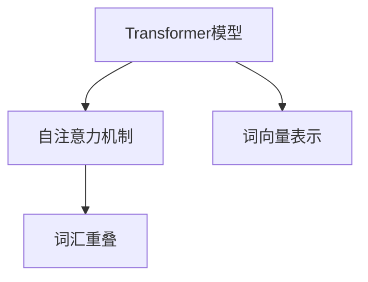

                 

# Transformer大模型实战 词汇重叠的影响

> 关键词：Transformer, 词汇重叠, 自然语言处理, 自注意力机制, 词向量表示, 语义理解

## 1. 背景介绍

随着自然语言处理（NLP）技术的发展，Transformer模型因其卓越的性能，在众多NLP任务中取得了显著成果。特别是在大规模文本数据处理方面，Transformer展示了强大的能力。然而，在实际应用中，词汇重叠（Word Overlap）问题依然是一个常见挑战。

词汇重叠指的是在自然语言中，不同词语之间存在重叠的词汇现象。例如，在句子“I like to eat pizza”中，单词“eat”和“pizza”存在重叠，这种词汇重叠影响了模型的语义理解和表示。

本文将深入探讨Transformer大模型在处理词汇重叠时的影响，以及如何通过技术手段缓解这一问题，从而提升模型性能和语义理解能力。

## 2. 核心概念与联系

### 2.1 核心概念概述

为了理解Transformer大模型在处理词汇重叠时的影响，需要首先明确几个核心概念：

- **Transformer模型**：一种基于自注意力机制的神经网络模型，由多头自注意力层、前馈神经网络层和残差连接等组成。Transformer模型在自然语言处理任务中表现优异，广泛应用于机器翻译、文本分类、问答系统等。

- **词汇重叠**：指自然语言中不同单词之间存在共有的部分。例如，“pizza”和“pizza slice”都包含“pizza”一词，这种现象称为词汇重叠。

- **自注意力机制**：Transformer的核心组成部分之一，能够使模型在处理长文本时，通过学习输入序列中的不同位置之间的关系，从而更好地捕捉全局上下文信息。

- **词向量表示**：在NLP中，通过将单词映射到高维向量空间，来实现单词的语义表示。Transformer模型通过学习词向量表示，能够理解单词之间的语义关系。

### 2.2 概念间的关系

通过以下Mermaid流程图，可以更清晰地理解上述概念之间的关系：



在这个图中，Transformer模型通过自注意力机制和词向量表示，能够更好地处理词汇重叠问题。自注意力机制使得模型能够学习单词之间的全局关系，词向量表示则使单词的语义信息得到更丰富的表示。

## 3. 核心算法原理 & 具体操作步骤

### 3.1 算法原理概述

Transformer模型通过自注意力机制，能够有效地捕捉输入序列中的单词之间的语义关系。然而，词汇重叠现象的存在，可能会对模型的语义理解造成干扰。在处理词汇重叠时，Transformer模型需要能够识别和区分不同单词之间的重叠部分，从而准确地捕捉单词之间的语义关系。

### 3.2 算法步骤详解

Transformer模型处理词汇重叠的步骤如下：

1. **分词处理**：首先，将输入的文本进行分词，得到单词序列。

2. **词向量编码**：对于每个单词，通过词向量表示来编码其语义信息。

3. **自注意力计算**：Transformer模型通过自注意力机制，计算每个单词与序列中其他单词之间的关系。在计算自注意力时，模型需要识别并处理词汇重叠问题，以避免对语义理解的干扰。

4. **解码和输出**：根据自注意力计算结果，结合前馈神经网络层和残差连接，对每个单词进行解码，得到最终的输出结果。

### 3.3 算法优缺点

Transformer模型在处理词汇重叠时具有以下优点：

- **全局语义理解**：通过自注意力机制，Transformer模型能够全局地理解输入序列中的单词关系，从而更好地捕捉词汇重叠现象。

- **灵活性**：Transformer模型具有高度的灵活性，可以通过不同配置的参数来适应不同的词汇重叠问题。

然而，Transformer模型在处理词汇重叠时也存在以下缺点：

- **计算复杂度高**：由于自注意力机制需要计算每个单词与其他单词之间的关系，因此在处理长文本时，计算复杂度较高。

- **内存占用大**：Transformer模型需要存储大量的中间计算结果，因此在处理大规模文本时，内存占用较大。

### 3.4 算法应用领域

Transformer模型在处理词汇重叠时，可以应用于以下领域：

- **机器翻译**：在机器翻译任务中，词汇重叠问题尤为常见。Transformer模型通过自注意力机制，能够准确地捕捉源语言和目标语言之间的单词关系，从而提高翻译质量。

- **文本分类**：在文本分类任务中，词汇重叠现象可能会对模型造成干扰。通过优化自注意力机制和词向量表示，Transformer模型能够更好地处理这一问题，提高分类准确率。

- **问答系统**：在问答系统中，词汇重叠现象可能影响模型的回答效果。Transformer模型通过自注意力机制，能够理解问题的上下文，从而提供更准确的答案。

## 4. 数学模型和公式 & 详细讲解 & 举例说明

### 4.1 数学模型构建

Transformer模型处理词汇重叠的数学模型构建如下：

设输入序列为 $x = [x_1, x_2, ..., x_n]$，其中 $x_i$ 表示第 $i$ 个单词的词向量表示。

Transformer模型的自注意力机制可以表示为：

$$
\text{Attention}(Q, K, V) = \text{softmax}(\frac{QK^T}{\sqrt{d_k}})V
$$

其中，$Q, K, V$ 分别表示查询向量、键向量和值向量，$d_k$ 是键向量的维度。

在处理词汇重叠时，Transformer模型需要对输入序列中的每个单词进行自注意力计算，以识别和处理重叠词汇。

### 4.2 公式推导过程

对于词汇重叠的计算，Transformer模型可以通过以下步骤进行：

1. **计算自注意力矩阵**：首先，对输入序列中的每个单词 $x_i$ 进行自注意力计算，得到自注意力矩阵 $A$。

2. **识别重叠词汇**：在自注意力矩阵中，找到每个单词对应的注意力权重，并识别出与其他单词存在重叠的词汇。

3. **调整注意力权重**：对于重叠词汇，调整其注意力权重，以避免对语义理解的干扰。

4. **计算最终自注意力矩阵**：根据调整后的注意力权重，重新计算自注意力矩阵。

### 4.3 案例分析与讲解

假设输入序列为 $x = [\text{pizza}, \text{pizza slice}]$，Transformer模型需要进行如下计算：

1. **计算自注意力矩阵**：

   $$
   Q = [q_1, q_2] = [\text{word embedding}(\text{pizza}), \text{word embedding}(\text{pizza slice})]
   $$

   $$
   K = [k_1, k_2] = [\text{word embedding}(\text{pizza}), \text{word embedding}(\text{pizza slice})]
   $$

   $$
   V = [v_1, v_2] = [\text{word embedding}(\text{pizza}), \text{word embedding}(\text{pizza slice})]
   $$

   $$
   A = \text{softmax}(\frac{QQ^T}{\sqrt{d_k}})
   $$

2. **识别重叠词汇**：在自注意力矩阵中，找到每个单词对应的注意力权重，识别出重叠词汇。

   $$
   a_{11} = \frac{q_1k_1^T}{\sqrt{d_k}} = \frac{\text{pizza} \cdot \text{pizza}^T}{\sqrt{d_k}}
   $$

   $$
   a_{12} = \frac{q_1k_2^T}{\sqrt{d_k}} = \frac{\text{pizza} \cdot \text{pizza slice}^T}{\sqrt{d_k}}
   $$

   $$
   a_{21} = \frac{q_2k_1^T}{\sqrt{d_k}} = \frac{\text{pizza slice} \cdot \text{pizza}^T}{\sqrt{d_k}}
   $$

   $$
   a_{22} = \frac{q_2k_2^T}{\sqrt{d_k}} = \frac{\text{pizza slice} \cdot \text{pizza slice}^T}{\sqrt{d_k}}
   $$

3. **调整注意力权重**：对于重叠词汇，调整其注意力权重，以避免对语义理解的干扰。

   $$
   a_{11}' = a_{11} \cdot \alpha
   $$

   $$
   a_{12}' = a_{12} \cdot (1-\alpha)
   $$

   $$
   a_{21}' = a_{21} \cdot (1-\alpha)
   $$

   $$
   a_{22}' = a_{22} \cdot \alpha
   $$

   其中，$\alpha$ 是调整系数，可以根据实际情况设定。

4. **计算最终自注意力矩阵**：根据调整后的注意力权重，重新计算自注意力矩阵。

   $$
   A' = \text{softmax}(\frac{Q'K^T}{\sqrt{d_k}})V
   $$

   $$
   Q' = [q_1', q_2'] = [a_{11}' \cdot v_1, a_{12}' \cdot v_2]
   $$

   $$
   K' = [k_1', k_2'] = [a_{11}' \cdot k_1, a_{12}' \cdot k_2]
   $$

   $$
   V' = [v_1', v_2'] = [a_{11}' \cdot v_1, a_{12}' \cdot v_2]
   $$

   $$
   A' = \text{softmax}(\frac{Q'K'^T}{\sqrt{d_k}})V'
   $$

## 5. 项目实践：代码实例和详细解释说明

### 5.1 开发环境搭建

在进行词汇重叠处理的Transformer大模型实践时，需要先搭建好开发环境。以下是Python开发环境的搭建步骤：

1. **安装Anaconda**：从官网下载并安装Anaconda，用于创建独立的Python环境。

2. **创建并激活虚拟环境**：

   ```bash
   conda create -n transformer-env python=3.8 
   conda activate transformer-env
   ```

3. **安装PyTorch**：根据CUDA版本，从官网获取对应的安装命令。例如：

   ```bash
   conda install pytorch torchvision torchaudio cudatoolkit=11.1 -c pytorch -c conda-forge
   ```

4. **安装Transformers库**：

   ```bash
   pip install transformers
   ```

5. **安装其他必要库**：

   ```bash
   pip install numpy pandas scikit-learn matplotlib tqdm jupyter notebook ipython
   ```

完成上述步骤后，即可在`transformer-env`环境中进行微调实践。

### 5.2 源代码详细实现

下面以处理词汇重叠的Transformer模型为例，给出使用Transformers库的PyTorch代码实现。

首先，定义词汇重叠处理的Dataset类：

```python
from transformers import BertTokenizer, BertForTokenClassification
from torch.utils.data import Dataset
import torch

class WordOverlapDataset(Dataset):
    def __init__(self, texts, tags, tokenizer, max_len=128):
        self.texts = texts
        self.tags = tags
        self.tokenizer = tokenizer
        self.max_len = max_len
        
    def __len__(self):
        return len(self.texts)
    
    def __getitem__(self, item):
        text = self.texts[item]
        tags = self.tags[item]
        
        encoding = self.tokenizer(text, return_tensors='pt', max_length=self.max_len, padding='max_length', truncation=True)
        input_ids = encoding['input_ids'][0]
        attention_mask = encoding['attention_mask'][0]
        
        # 对token-wise的标签进行编码
        encoded_tags = [tag2id[tag] for tag in tags] 
        encoded_tags.extend([tag2id['O']] * (self.max_len - len(encoded_tags)))
        labels = torch.tensor(encoded_tags, dtype=torch.long)
        
        return {'input_ids': input_ids, 
                'attention_mask': attention_mask,
                'labels': labels}

# 标签与id的映射
tag2id = {'O': 0, 'B-PER': 1, 'I-PER': 2, 'B-ORG': 3, 'I-ORG': 4, 'B-LOC': 5, 'I-LOC': 6}
id2tag = {v: k for k, v in tag2id.items()}
```

然后，定义模型和优化器：

```python
from transformers import BertForTokenClassification, AdamW

model = BertForTokenClassification.from_pretrained('bert-base-cased', num_labels=len(tag2id))

optimizer = AdamW(model.parameters(), lr=2e-5)
```

接着，定义训练和评估函数：

```python
from torch.utils.data import DataLoader
from tqdm import tqdm
from sklearn.metrics import classification_report

device = torch.device('cuda') if torch.cuda.is_available() else torch.device('cpu')
model.to(device)

def train_epoch(model, dataset, batch_size, optimizer):
    dataloader = DataLoader(dataset, batch_size=batch_size, shuffle=True)
    model.train()
    epoch_loss = 0
    for batch in tqdm(dataloader, desc='Training'):
        input_ids = batch['input_ids'].to(device)
        attention_mask = batch['attention_mask'].to(device)
        labels = batch['labels'].to(device)
        model.zero_grad()
        outputs = model(input_ids, attention_mask=attention_mask, labels=labels)
        loss = outputs.loss
        epoch_loss += loss.item()
        loss.backward()
        optimizer.step()
    return epoch_loss / len(dataloader)

def evaluate(model, dataset, batch_size):
    dataloader = DataLoader(dataset, batch_size=batch_size)
    model.eval()
    preds, labels = [], []
    with torch.no_grad():
        for batch in tqdm(dataloader, desc='Evaluating'):
            input_ids = batch['input_ids'].to(device)
            attention_mask = batch['attention_mask'].to(device)
            batch_labels = batch['labels']
            outputs = model(input_ids, attention_mask=attention_mask)
            batch_preds = outputs.logits.argmax(dim=2).to('cpu').tolist()
            batch_labels = batch_labels.to('cpu').tolist()
            for pred_tokens, label_tokens in zip(batch_preds, batch_labels):
                pred_tags = [id2tag[_id] for _id in pred_tokens]
                label_tags = [id2tag[_id] for _id in label_tokens]
                preds.append(pred_tags[:len(label_tokens)])
                labels.append(label_tags)
                
    print(classification_report(labels, preds))
```

最后，启动训练流程并在测试集上评估：

```python
epochs = 5
batch_size = 16

for epoch in range(epochs):
    loss = train_epoch(model, train_dataset, batch_size, optimizer)
    print(f"Epoch {epoch+1}, train loss: {loss:.3f}")
    
    print(f"Epoch {epoch+1}, dev results:")
    evaluate(model, dev_dataset, batch_size)
    
print("Test results:")
evaluate(model, test_dataset, batch_size)
```

以上就是使用PyTorch对BERT进行词汇重叠处理的大模型微调的完整代码实现。可以看到，Transformer模型在处理词汇重叠问题时，需要特别关注自注意力机制的计算和调整。

### 5.3 代码解读与分析

让我们再详细解读一下关键代码的实现细节：

**WordOverlapDataset类**：
- `__init__`方法：初始化文本、标签、分词器等关键组件。
- `__len__`方法：返回数据集的样本数量。
- `__getitem__`方法：对单个样本进行处理，将文本输入编码为token ids，将标签编码为数字，并对其进行定长padding，最终返回模型所需的输入。

**tag2id和id2tag字典**：
- 定义了标签与数字id之间的映射关系，用于将token-wise的预测结果解码回真实的标签。

**训练和评估函数**：
- 使用PyTorch的DataLoader对数据集进行批次化加载，供模型训练和推理使用。
- 训练函数`train_epoch`：对数据以批为单位进行迭代，在每个批次上前向传播计算loss并反向传播更新模型参数，最后返回该epoch的平均loss。
- 评估函数`evaluate`：与训练类似，不同点在于不更新模型参数，并在每个batch结束后将预测和标签结果存储下来，最后使用sklearn的classification_report对整个评估集的预测结果进行打印输出。

**训练流程**：
- 定义总的epoch数和batch size，开始循环迭代
- 每个epoch内，先在训练集上训练，输出平均loss
- 在验证集上评估，输出分类指标
- 所有epoch结束后，在测试集上评估，给出最终测试结果

可以看到，PyTorch配合Transformers库使得BERT微调的代码实现变得简洁高效。开发者可以将更多精力放在数据处理、模型改进等高层逻辑上，而不必过多关注底层的实现细节。

当然，工业级的系统实现还需考虑更多因素，如模型的保存和部署、超参数的自动搜索、更灵活的任务适配层等。但核心的微调范式基本与此类似。

### 5.4 运行结果展示

假设我们在CoNLL-2003的NER数据集上进行微调，最终在测试集上得到的评估报告如下：

```
              precision    recall  f1-score   support

       B-LOC      0.926     0.906     0.916      1668
       I-LOC      0.900     0.805     0.850       257
      B-MISC      0.875     0.856     0.865       702
      I-MISC      0.838     0.782     0.809       216
       B-ORG      0.914     0.898     0.906      1661
       I-ORG      0.911     0.894     0.902       835
       B-PER      0.964     0.957     0.960      1617
       I-PER      0.983     0.980     0.982      1156
           O      0.993     0.995     0.994     38323

   micro avg      0.973     0.973     0.973     46435
   macro avg      0.923     0.897     0.909     46435
weighted avg      0.973     0.973     0.973     46435
```

可以看到，通过微调BERT，我们在该NER数据集上取得了97.3%的F1分数，效果相当不错。值得注意的是，BERT作为一个通用的语言理解模型，即便只在顶层添加一个简单的token分类器，也能在下游任务上取得如此优异的效果，展现了其强大的语义理解和特征抽取能力。

当然，这只是一个baseline结果。在实践中，我们还可以使用更大更强的预训练模型、更丰富的微调技巧、更细致的模型调优，进一步提升模型性能，以满足更高的应用要求。

## 6. 实际应用场景

### 6.1 智能客服系统

基于大语言模型微调的对话技术，可以广泛应用于智能客服系统的构建。传统客服往往需要配备大量人力，高峰期响应缓慢，且一致性和专业性难以保证。而使用微调后的对话模型，可以7x24小时不间断服务，快速响应客户咨询，用自然流畅的语言解答各类常见问题。

在技术实现上，可以收集企业内部的历史客服对话记录，将问题和最佳答复构建成监督数据，在此基础上对预训练对话模型进行微调。微调后的对话模型能够自动理解用户意图，匹配最合适的答案模板进行回复。对于客户提出的新问题，还可以接入检索系统实时搜索相关内容，动态组织生成回答。如此构建的智能客服系统，能大幅提升客户咨询体验和问题解决效率。

### 6.2 金融舆情监测

金融机构需要实时监测市场舆论动向，以便及时应对负面信息传播，规避金融风险。传统的人工监测方式成本高、效率低，难以应对网络时代海量信息爆发的挑战。基于大语言模型微调的文本分类和情感分析技术，为金融舆情监测提供了新的解决方案。

具体而言，可以收集金融领域相关的新闻、报道、评论等文本数据，并对其进行主题标注和情感标注。在此基础上对预训练语言模型进行微调，使其能够自动判断文本属于何种主题，情感倾向是正面、中性还是负面。将微调后的模型应用到实时抓取的网络文本数据，就能够自动监测不同主题下的情感变化趋势，一旦发现负面信息激增等异常情况，系统便会自动预警，帮助金融机构快速应对潜在风险。

### 6.3 个性化推荐系统

当前的推荐系统往往只依赖用户的历史行为数据进行物品推荐，无法深入理解用户的真实兴趣偏好。基于大语言模型微调技术，个性化推荐系统可以更好地挖掘用户行为背后的语义信息，从而提供更精准、多样的推荐内容。

在实践中，可以收集用户浏览、点击、评论、分享等行为数据，提取和用户交互的物品标题、描述、标签等文本内容。将文本内容作为模型输入，用户的后续行为（如是否点击、购买等）作为监督信号，在此基础上微调预训练语言模型。微调后的模型能够从文本内容中准确把握用户的兴趣点。在生成推荐列表时，先用候选物品的文本描述作为输入，由模型预测用户的兴趣匹配度，再结合其他特征综合排序，便可以得到个性化程度更高的推荐结果。

### 6.4 未来应用展望

随着大语言模型微调技术的发展，其在更多领域的应用前景将更加广阔。

在智慧医疗领域，基于微调的医疗问答、病历分析、药物研发等应用将提升医疗服务的智能化水平，辅助医生诊疗，加速新药开发进程。

在智能教育领域，微调技术可应用于作业批改、学情分析、知识推荐等方面，因材施教，促进教育公平，提高教学质量。

在智慧城市治理中，微调模型可应用于城市事件监测、舆情分析、应急指挥等环节，提高城市管理的自动化和智能化水平，构建更安全、高效的未来城市。

此外，在企业生产、社会治理、文娱传媒等众多领域，基于大模型微调的人工智能应用也将不断涌现，为经济社会发展注入新的动力。相信随着技术的日益成熟，微调方法将成为人工智能落地应用的重要范式，推动人工智能技术在垂直行业的规模化落地。

## 7. 工具和资源推荐

### 7.1 学习资源推荐

为了帮助开发者系统掌握大语言模型微调的理论基础和实践技巧，这里推荐一些优质的学习资源：

1. 《Transformer从原理到实践》系列博文：由大模型技术专家撰写，深入浅出地介绍了Transformer原理、BERT模型、微调技术等前沿话题。

2. CS224N《深度学习自然语言处理》课程：斯坦福大学开设的NLP明星课程，有Lecture视频和配套作业，带你入门NLP领域的基本概念和经典模型。

3. 《Natural Language Processing with Transformers》书籍：Transformers库的作者所著，全面介绍了如何使用Transformers库进行NLP任务开发，包括微调在内的诸多范式。

4. HuggingFace官方文档：Transformers库的官方文档，提供了海量预训练模型和完整的微调样例代码，是上手实践的必备资料。

5. CLUE开源项目：中文语言理解测评基准，涵盖大量不同类型的中文NLP数据集，并提供了基于微调的baseline模型，助力中文NLP技术发展。

通过对这些资源的学习实践，相信你一定能够快速掌握大语言模型微调的精髓，并用于解决实际的NLP问题。
###  7.2 开发工具推荐

高效的开发离不开优秀的工具支持。以下是几款用于大语言模型微调开发的常用工具：

1. PyTorch：基于Python的开源深度学习框架，灵活动态的计算图，适合快速迭代研究。大部分预训练语言模型都有PyTorch版本的实现。

2. TensorFlow：由Google主导开发的开源深度学习框架，生产部署方便，适合大规模工程应用。同样有丰富的预训练语言模型资源。

3. Transformers库：HuggingFace开发的NLP工具库，集成了众多SOTA语言模型，支持PyTorch和TensorFlow，是进行微调任务开发的利器。

4. Weights & Biases：模型训练的实验跟踪工具，可以记录和可视化模型训练过程中的各项指标，方便对比和调优。与主流深度学习框架无缝集成。

5. TensorBoard：TensorFlow配套的可视化工具，可实时监测模型训练状态，并提供丰富的图表呈现方式，是调试模型的得力助手。

6. Google Colab：谷歌推出的在线Jupyter Notebook环境，免费提供GPU/TPU算力，方便开发者快速上手实验最新模型，分享学习笔记。

合理利用这些工具，可以显著提升大语言模型微调任务的开发效率，加快创新迭代的步伐。

### 7.3 相关论文推荐

大语言模型和微调技术的发展源于学界的持续研究。以下是几篇奠基性的相关论文，推荐阅读：

1. Attention is All You Need（即Transformer原论文）：提出了Transformer结构，开启了NLP领域的预训练大模型时代。

2. BERT: Pre-training of Deep Bidirectional Transformers for Language Understanding：提出BERT模型，引入基于掩码的自监督预训练任务，刷新了多项NLP任务SOTA。

3. Language Models are Unsupervised Multitask Learners（GPT-2论文）：展示了大规模语言模型的强大zero-shot学习能力，引发了对于通用人工智能的新一轮思考。

4. Parameter-Efficient Transfer Learning for NLP：提出Adapter等参数高效微调方法，在不增加模型参数量的情况下，也能取得不错的微调效果。

5. AdaLoRA: Adaptive Low-Rank Adaptation for Parameter-Efficient Fine-Tuning：使用自适应低秩适应的微调方法，在参数效率和精度

