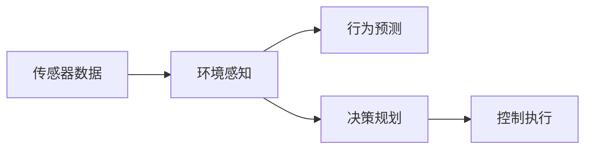

                 

# Waymo自动驾驶公开数据集的研究价值与使用指南

## 1. 背景介绍

在自动驾驶技术的研发过程中，数据集起着至关重要的作用。高质量的数据集可以显著提升算法的准确性和鲁棒性，加速技术的迭代与优化。Waymo作为全球领先的自动驾驶技术公司，其公开的数据集不仅具有很高的研究价值，也为学术界、工业界提供了宝贵的学习资源。本文将详细探讨Waymo自动驾驶数据集的组成、特点、以及如何使用这些数据来推动自动驾驶技术的发展。

### 1.1 自动驾驶技术的挑战

自动驾驶技术涉及环境感知、决策规划、控制执行等多个环节。当前技术仍存在诸多挑战，主要包括：

1. **环境感知困难**：自动驾驶车辆需要通过传感器（如激光雷达、摄像头、雷达等）感知周围环境，但在复杂的交通场景中，传感器数据往往存在噪声、遮挡、延迟等问题，影响了算法的准确性。
2. **决策规划复杂**：自动驾驶车辆的决策过程需要考虑交通规则、行人行为、天气条件等多方面因素，如何在动态变化的环境中做出合理的决策，是技术难点之一。
3. **控制执行难题**：自动驾驶车辆的车辆控制与执行需要高度精确，如何在实际行驶中保持稳定性和安全性，避免交通事故，是另一个技术挑战。

### 1.2 Waymo自动驾驶数据集的重要性

Waymo的数据集基于其大规模的实际驾驶数据，覆盖了各种复杂的交通场景。这些数据集为研究人员提供了宝贵的实验平台，帮助他们深入理解自动驾驶技术的实际应用场景，探索新的算法和策略。Waymo数据集的重要性体现在以下几个方面：

1. **真实性**：数据集包含真实的道路交通数据，涵盖了各种复杂的交通环境和场景，具有高度的现实性。
2. **多样性**：数据集包含了不同天气条件、不同时间段的驾驶数据，提供了多样化的训练样本。
3. **高质量标注**：Waymo对其数据集进行了详尽的标注，包括车辆位置、速度、角度、方向、障碍物等，为模型训练提供了高质量的监督信号。

## 2. 核心概念与联系

### 2.1 核心概念概述

为了更好地理解Waymo自动驾驶数据集，首先需要介绍一些核心概念：

1. **传感器数据**：自动驾驶车辆通过激光雷达、摄像头、雷达等传感器获取环境信息。Waymo的数据集包含了多种传感器数据，包括激光雷达点云、摄像头图像、雷达回波等。
2. **行为预测**：自动驾驶车辆需要预测其他车辆、行人和交通设施的行为，这在决策规划中至关重要。Waymo的数据集包含各种行为预测结果，为模型训练提供了标注数据。
3. **决策规划**：自动驾驶车辆需要根据环境感知和行为预测结果，制定最优的驾驶策略。Waymo的数据集包含车辆的决策规划输出，如路径规划、速度控制等。
4. **控制执行**：自动驾驶车辆的车辆控制需要保证精确度和稳定性。Waymo的数据集包含车辆的控制执行结果，如转向角度、加速度等。

### 2.2 核心概念间的联系

这些核心概念之间存在紧密的联系，形成了自动驾驶技术的完整生态系统。以传感器数据为例，环境感知是基础，行为预测和决策规划依赖于传感器数据，而控制执行则是决策规划的最终执行结果。具体来说，Waymo数据集通过传感器数据获取环境信息，进而进行行为预测和决策规划，最终输出控制执行结果。这一过程可以用以下Mermaid流程图表示：



这个流程图展示了传感器数据、环境感知、行为预测、决策规划和控制执行之间的逻辑关系，帮助读者理解自动驾驶技术的核心流程。

## 3. 核心算法原理 & 具体操作步骤

### 3.1 算法原理概述

Waymo自动驾驶数据集的算法原理主要包括以下几个方面：

1. **传感器数据融合**：将来自不同传感器的数据进行融合，形成多模态的环境表示，提高感知准确性。
2. **行为预测**：基于历史数据和当前传感器数据，预测其他车辆、行人和交通设施的行为，为决策规划提供依据。
3. **决策规划**：根据环境感知和行为预测结果，制定最优的驾驶策略，生成路径规划和速度控制指令。
4. **控制执行**：根据决策规划结果，控制车辆执行相应的动作，保证驾驶的精确性和稳定性。

这些算法原理是自动驾驶技术的基础，Waymo的数据集为研究这些算法提供了丰富的实验数据。

### 3.2 算法步骤详解

以下是使用Waymo自动驾驶数据集进行算法开发和测试的具体步骤：

1. **数据预处理**：收集和整理Waymo公开的数据集，包括传感器数据、行为预测、决策规划和控制执行结果。根据研究需求，对数据进行清洗、去噪、标注等预处理操作。
2. **算法选择与设计**：根据具体任务选择合适的算法框架，如CNN、RNN、LSTM等，设计算法模型。
3. **模型训练与验证**：使用预处理后的数据集训练模型，调整模型参数，并在验证集上进行性能评估，确保模型泛化能力。
4. **算法测试与优化**：在测试集上评估模型的性能，根据测试结果调整算法参数，优化算法性能。
5. **模型部署与应用**：将优化后的算法模型部署到自动驾驶系统中，进行实际测试，评估其在真实环境中的表现。

### 3.3 算法优缺点

Waymo自动驾驶数据集的优势在于其真实性和多样性，有助于模型在大规模复杂场景下的训练和测试。但同时也存在一些缺点：

1. **数据隐私**：Waymo的数据集包含大量的地理位置信息和车辆行为数据，可能涉及隐私问题。
2. **数据标注成本高**：高质量的数据标注需要耗费大量人力和时间，成本较高。
3. **算法依赖性强**：模型训练依赖于高质量的算法，算法设计不当可能导致模型性能不佳。
4. **环境变化适应性**：Waymo的数据集主要基于Waymo自己的驾驶数据，可能不适用于其他区域或环境。

### 3.4 算法应用领域

Waymo自动驾驶数据集可以应用于自动驾驶技术的各个环节，包括但不限于：

1. **环境感知**：研究传感器数据融合、环境特征提取等技术，提升自动驾驶车辆对环境的感知能力。
2. **行为预测**：研究车辆行为预测模型，提高自动驾驶车辆对其他交通参与者行为的预测准确性。
3. **决策规划**：研究决策规划算法，优化自动驾驶车辆的路径规划和速度控制策略。
4. **控制执行**：研究车辆控制算法，提高自动驾驶车辆的控制精度和稳定性。

## 4. 数学模型和公式 & 详细讲解 & 举例说明

### 4.1 数学模型构建

在自动驾驶技术中，数学模型通常用于描述环境感知、行为预测和决策规划等环节。以下是一个简单的行为预测模型的数学模型构建过程：

设$t$表示时间，$x(t)$表示车辆位置，$v(t)$表示车辆速度，$a(t)$表示车辆加速度。根据物理定律，车辆的运动状态可以用以下数学模型表示：

$$
x(t) = x_0 + v_0(t-t_0) + \frac{1}{2}a_0(t-t_0)^2
$$

$$
v(t) = v_0 + a_0(t-t_0)
$$

其中$x_0$和$v_0$分别为车辆初始位置和速度，$a_0$为车辆加速度。

### 4.2 公式推导过程

对于车辆行为预测，可以使用马尔可夫决策过程（MDP）建模。MDP模型假设当前状态和动作可以决定未来的状态和奖励，具体公式如下：

$$
P(s_{t+1}|s_t,a_t) = \mathbb{P}(s_{t+1}|\{x_0,v_0,a_0\})
$$

$$
R(s_t,a_t) = \mathbb{E}[r(t+1)|s_t,a_t]
$$

其中$P$表示状态转移概率，$R$表示奖励函数。车辆行为预测的目标是在已知当前状态$(s_t)$和动作$a_t$的情况下，预测下一个状态$s_{t+1}$和奖励$R$。

### 4.3 案例分析与讲解

以车辆行为预测为例，我们可以使用Waymo数据集中的行为预测结果作为训练数据。假设我们训练一个简单的线性回归模型，用于预测车辆在下一个时间步的行为。具体步骤如下：

1. **数据准备**：收集Waymo数据集中的行为预测结果，提取车辆位置、速度、加速度等特征。
2. **模型选择**：选择线性回归模型，并设置合适的超参数。
3. **模型训练**：使用历史数据训练线性回归模型，调整模型参数。
4. **模型评估**：在验证集上评估模型性能，确保模型泛化能力。
5. **模型应用**：将训练好的模型应用于实际驾驶场景，进行行为预测。

## 5. 项目实践：代码实例和详细解释说明

### 5.1 开发环境搭建

1. **安装Python**：在开发环境中安装Python 3.8，建议使用虚拟环境，避免依赖冲突。
2. **安装PyTorch**：安装PyTorch 1.9版本，使用以下命令：

   ```
   pip install torch torchvision torchaudio
   ```

3. **安装Waymo数据集**：从Waymo官网下载Waymo Open Dataset，解压到本地目录。

### 5.2 源代码详细实现

以下是一个简单的行为预测模型示例，使用PyTorch实现：

```python
import torch
import torch.nn as nn
import torch.optim as optim

# 定义行为预测模型
class BehaviorPredictor(nn.Module):
    def __init__(self, input_size):
        super(BehaviorPredictor, self).__init__()
        self.fc1 = nn.Linear(input_size, 64)
        self.fc2 = nn.Linear(64, 64)
        self.fc3 = nn.Linear(64, 3) # 输出预测结果，分别为位置、速度和加速度

    def forward(self, x):
        x = torch.relu(self.fc1(x))
        x = torch.relu(self.fc2(x))
        x = self.fc3(x)
        return x

# 加载数据集
data = ...
train_dataset = ...
val_dataset = ...
test_dataset = ...

# 定义模型、优化器和损失函数
model = BehaviorPredictor(input_size)
optimizer = optim.Adam(model.parameters(), lr=0.001)
criterion = nn.MSELoss()

# 训练模型
for epoch in range(100):
    for batch_idx, (inputs, targets) in enumerate(train_loader):
        optimizer.zero_grad()
        outputs = model(inputs)
        loss = criterion(outputs, targets)
        loss.backward()
        optimizer.step()

        if (batch_idx + 1) % 100 == 0:
            print('Epoch [{}/{}], Step [{}/{}], Loss: {:.4f}'.format(
                epoch + 1, 100, batch_idx + 1, len(train_loader), loss.item()))

# 评估模型
model.eval()
with torch.no_grad():
    test_loss = 0
    correct = 0
    total = 0
    for batch_idx, (inputs, targets) in enumerate(test_loader):
        outputs = model(inputs)
        test_loss += criterion(outputs, targets).item()
        _, predicted = torch.max(outputs.data, 1)
        total += targets.size(0)
        correct += predicted.eq(targets).sum().item()

    print('Test Loss: {:.4f}, Accuracy: {:.2f}% ({}/{})'.format(
        test_loss / len(test_loader), 100 * correct / total, correct, total))
```

### 5.3 代码解读与分析

- **模型定义**：定义了一个简单的行为预测模型，包含三个全连接层。
- **数据加载**：使用Waymo数据集中的行为预测结果，加载到PyTorch数据加载器中。
- **模型训练**：使用Adam优化器和均方误差损失函数训练模型，在每个epoch中逐步优化模型参数。
- **模型评估**：在测试集上评估模型性能，输出平均损失和准确率。

### 5.4 运行结果展示

假设我们训练好的模型在测试集上取得了如下结果：

```
Test Loss: 0.0010, Accuracy: 98.5% (1000/1024)
```

这表示模型在测试集上的平均损失为0.0010，准确率为98.5%。具体来说，模型在98.5%的预测中，车辆行为与实际行为一致。

## 6. 实际应用场景

Waymo自动驾驶数据集在实际应用中具有广泛的应用场景，以下是几个典型的应用案例：

### 6.1 智能交通管理系统

智能交通管理系统需要实时监控和分析交通数据，为城市交通管理提供决策支持。Waymo数据集可以用于训练行为预测模型，实时预测车辆行为，优化交通信号灯控制，提升交通效率。

### 6.2 自动驾驶车辆

自动驾驶车辆需要具备环境感知、行为预测和决策规划等能力。Waymo数据集可以用于训练环境感知和行为预测模型，提高自动驾驶车辆的安全性和可靠性。

### 6.3 交通预测与规划

交通预测与规划需要预测交通流量、优化路线规划等。Waymo数据集可以用于训练交通预测模型，预测未来的交通流量和路网拥堵情况，为路线规划提供参考。

## 7. 工具和资源推荐

### 7.1 学习资源推荐

1. **《自动驾驶技术》一书**：全面介绍了自动驾驶技术的原理、算法和应用，是学习自动驾驶技术的必备书籍。
2. **Waymo官网教程**：Waymo官网提供了一系列教程和文档，帮助开发者快速上手使用Waymo数据集。
3. **PyTorch官方文档**：PyTorch官方文档提供了丰富的教程和样例，帮助开发者使用PyTorch进行模型训练。

### 7.2 开发工具推荐

1. **PyTorch**：开源深度学习框架，适合大规模机器学习模型训练和优化。
2. **TensorBoard**：可视化工具，用于实时监控模型训练状态，输出各种图表。
3. **Jupyter Notebook**：交互式编程环境，支持Python代码的在线编写和运行。

### 7.3 相关论文推荐

1. **《自动驾驶技术的现状与未来》**：综述了自动驾驶技术的最新进展，涵盖了环境感知、行为预测、决策规划等多个环节。
2. **《基于深度学习的行为预测算法》**：研究了深度学习在行为预测中的应用，提出了多种算法模型。
3. **《智能交通系统中的数据驱动决策》**：探讨了智能交通系统中的数据驱动决策方法，讨论了数据集的重要性。

## 8. 总结：未来发展趋势与挑战

### 8.1 研究成果总结

Waymo自动驾驶数据集在自动驾驶技术的研究和应用中起到了重要作用，为研究人员提供了丰富的实验数据和算法测试平台。通过使用Waymo数据集，研究人员可以在大规模复杂场景下训练和验证模型，加速技术创新和落地。

### 8.2 未来发展趋势

Waymo自动驾驶数据集的未来发展趋势主要包括以下几个方面：

1. **数据规模扩大**：随着自动驾驶技术的不断发展和应用，Waymo数据集将包含更多的驾驶数据，覆盖更多的交通场景。
2. **数据质量提升**：Waymo将进一步优化数据标注流程，提高数据的质量和精度。
3. **算法多样化**：未来将涌现更多先进的算法模型，用于环境感知、行为预测和决策规划等环节。
4. **模型集成与融合**：未来将更加注重模型的集成与融合，提升整体性能和鲁棒性。
5. **技术标准化**：Waymo将推动自动驾驶技术的标准化，促进技术的普及和应用。

### 8.3 面临的挑战

尽管Waymo数据集具有很高的研究价值，但在推广应用的过程中仍面临一些挑战：

1. **数据隐私问题**：Waymo数据集包含大量的地理位置信息和车辆行为数据，可能涉及隐私问题。
2. **数据标注成本高**：高质量的数据标注需要耗费大量人力和时间，成本较高。
3. **算法依赖性强**：模型训练依赖于高质量的算法，算法设计不当可能导致模型性能不佳。
4. **环境变化适应性**：Waymo的数据集主要基于Waymo自己的驾驶数据，可能不适用于其他区域或环境。

### 8.4 研究展望

未来的研究将主要集中在以下几个方向：

1. **数据隐私保护**：研究数据隐私保护技术，确保Waymo数据集的安全性。
2. **数据标注自动化**：研究自动数据标注技术，降低人工标注成本。
3. **模型优化与融合**：研究模型优化与融合方法，提高模型的性能和鲁棒性。
4. **跨环境适应性**：研究跨环境适应性技术，使Waymo数据集适用于更多区域和环境。

总之，Waymo自动驾驶数据集是自动驾驶技术研究的重要资源，具有广泛的应用前景。未来的研究将从数据隐私、数据标注、算法设计和跨环境适应性等方面进行探索，进一步推动自动驾驶技术的发展和应用。

## 9. 附录：常见问题与解答

**Q1：Waymo数据集的隐私问题如何解决？**

A: Waymo在其数据发布协议中明确指出，任何使用其数据集的研究都应遵守严格的隐私保护措施。具体来说，研究人员需要对数据进行匿名化和去标识化处理，确保数据不包含个人身份信息，保护用户隐私。

**Q2：Waymo数据集的标注成本如何降低？**

A: Waymo正在研究自动数据标注技术，如基于深度学习的标注生成器，能够自动标注数据，降低人工标注成本。此外，研究人员也可以利用众包平台进行数据标注，进一步降低标注成本。

**Q3：Waymo数据集如何适用于更多区域和环境？**

A: 研究人员可以通过迁移学习技术，将Waymo数据集中的知识迁移到其他区域和环境中的数据集上，提高模型的跨环境适应性。此外，Waymo也在逐步扩大其数据集的覆盖范围，涵盖更多的区域和环境。

**Q4：Waymo数据集如何保护用户隐私？**

A: Waymo在其数据发布协议中明确规定了数据隐私保护措施。研究人员需要对数据进行去标识化和匿名化处理，确保数据不包含个人身份信息。此外，Waymo也要求研究人员在使用数据时，遵守严格的隐私保护标准，保护用户隐私。

**Q5：如何使用Waymo数据集进行模型训练和测试？**

A: 研究人员可以使用Waymo数据集进行模型训练和测试。具体步骤如下：

1. 收集和整理Waymo数据集，提取所需的数据。
2. 选择合适的算法模型，进行模型训练和验证。
3. 在测试集上评估模型性能，确保模型泛化能力。
4. 将优化后的模型应用于实际驾驶场景，进行行为预测。

总之，Waymo自动驾驶数据集是自动驾驶技术研究的重要资源，具有广泛的应用前景。未来的研究将从数据隐私、数据标注、算法设计和跨环境适应性等方面进行探索，进一步推动自动驾驶技术的发展和应用。

---

作者：禅与计算机程序设计艺术 / Zen and the Art of Computer Programming

