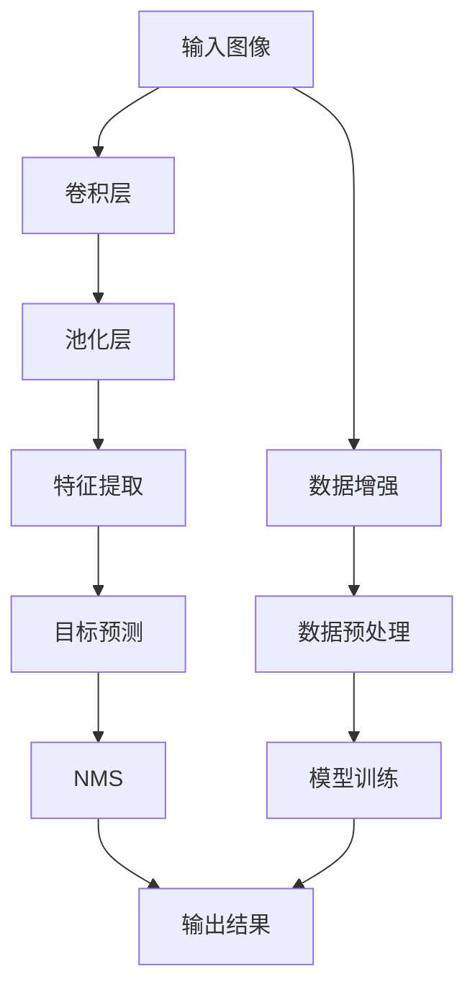
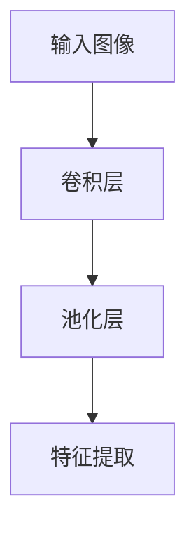
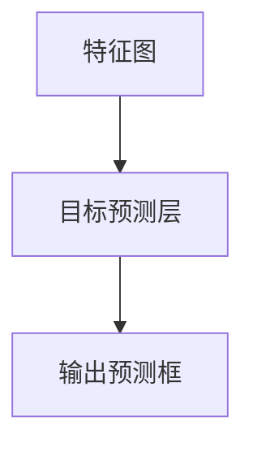
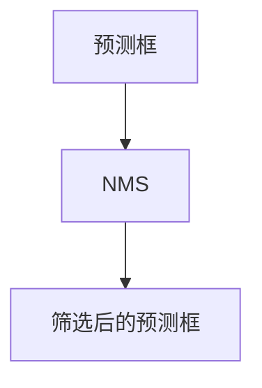
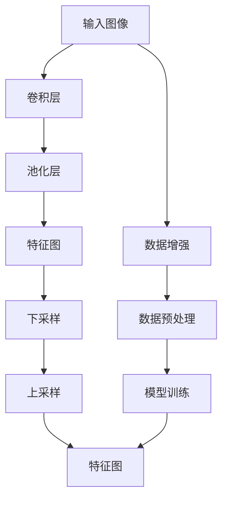
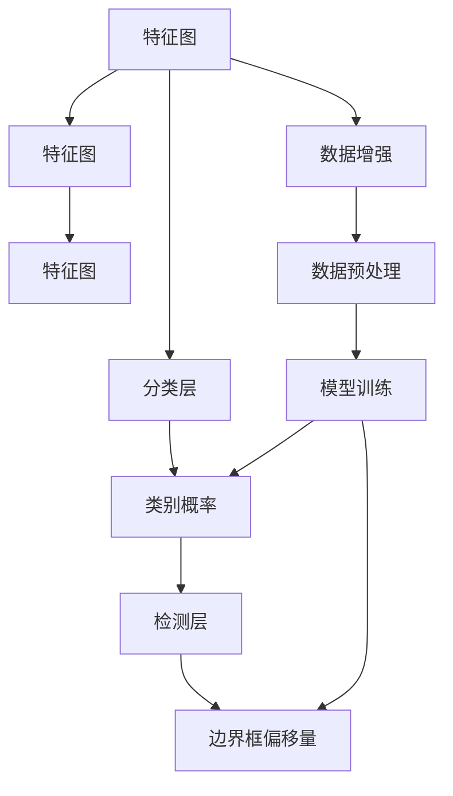
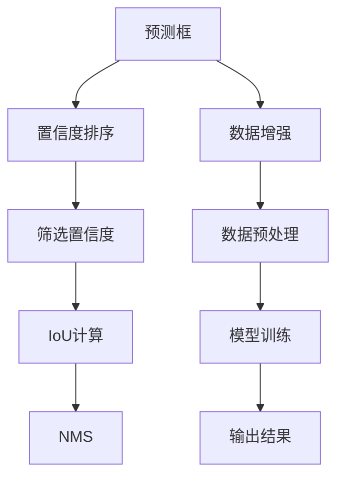

                 

# YOLOv8原理与代码实例讲解

> 关键词：YOLOv8, 目标检测, 深度学习, 卷积神经网络, 特征图, 非极大值抑制, 实际应用

## 1. 背景介绍

### 1.1 问题由来
在计算机视觉领域，目标检测一直是至关重要的一环。传统的目标检测方法如RCNN、Fast R-CNN等，虽在精度上有所突破，但计算复杂度大，难以应对实时性要求较高的应用场景。随着深度学习技术的发展，YOLO（You Only Look Once）系列模型应运而生，以其计算速度、实时性和准确性成为目标检测的主流算法之一。

YOLOv8，即YOLO第五版，是YOLO系列的最新版本，在YOLOv3的基础上进行了大幅优化。本文将重点介绍YOLOv8的原理与实现细节，并给出代码实例讲解。

### 1.2 问题核心关键点
YOLOv8的核心在于其基于特征图的目标检测算法。YOLOv8通过深度卷积神经网络（CNN）对输入图像进行特征提取，并直接预测每个像素点的类别和边界框，从而实现实时且准确的目标检测。

具体来说，YOLOv8主要分为三个关键步骤：
1. **特征提取**：通过卷积层提取图像的特征图，每个特征图对应一个尺度。
2. **目标预测**：在每个特征图上，每个网格点预测多个类别和边界框的偏移量。
3. **非极大值抑制**：对预测结果进行非极大值抑制（NMS），筛选出置信度最高的物体。

本文将重点讲解这三个步骤，并结合代码实例进行详细阐述。

### 1.3 问题研究意义
YOLOv8作为目标检测领域的最新成果，具有重要的研究意义：
1. **实时性**：YOLOv8在计算速度上有显著提升，能够在实时视频流中进行目标检测。
2. **准确性**：YOLOv8在多个数据集上取得了最先进的结果，具有良好的泛化能力。
3. **通用性**：YOLOv8可应用于各种规模和类型的目标检测任务，易于部署和集成。
4. **可扩展性**：YOLOv8支持多尺度特征图和自定义损失函数，灵活性高。

通过深入学习YOLOv8的原理与实现细节，可以更好地理解和应用这一目标检测算法，提升实际应用中的检测效果。

## 2. 核心概念与联系

### 2.1 核心概念概述

为了更好地理解YOLOv8的原理与实现细节，本节将介绍几个关键概念：

- **卷积神经网络（CNN）**：一种深度学习模型，通过卷积层提取图像的局部特征，逐渐构建全局的图像表示。
- **特征图（Feature Map）**：CNN中每一层的输出，不同层提取不同尺度的特征。
- **非极大值抑制（NMS）**：用于过滤重复检测结果，选择置信度最高的检测框。
- **损失函数（Loss Function）**：用于衡量模型预测结果与真实标签的差异，指导模型训练。

这些核心概念之间的逻辑关系可以通过以下Mermaid流程图来展示：



这个流程图展示了大语言模型微调过程中各个核心概念的关系和作用：

1. 输入图像通过卷积层和池化层进行特征提取。
2. 特征图通过目标预测层预测目标的类别和边界框。
3. 预测结果通过NMS筛选，得到最终的检测结果。
4. 数据增强和预处理是模型训练的重要环节，提升模型鲁棒性。
5. 模型训练通过损失函数优化，提高模型精度。

### 2.2 概念间的关系

这些核心概念之间存在着紧密的联系，形成了YOLOv8的核心算法框架。下面通过几个Mermaid流程图来展示这些概念之间的关系。

#### 2.2.1 特征提取过程



这个流程图展示了特征提取的基本流程：输入图像通过卷积层和池化层，逐步提取出不同尺度的特征图。

#### 2.2.2 目标预测过程



这个流程图展示了目标预测的基本流程：特征图通过目标预测层，预测每个像素点的类别和边界框。

#### 2.2.3 非极大值抑制过程



这个流程图展示了非极大值抑制的基本流程：对预测框进行非极大值抑制，筛选出置信度最高的检测结果。

### 2.3 核心概念的整体架构

最后，我们用一个综合的流程图来展示这些核心概念在大语言模型微调过程中的整体架构：


这个综合流程图展示了从预处理到输出的完整流程。输入图像经过数据增强和预处理后，进入CNN进行特征提取和目标预测。预测结果通过NMS筛选后，得到最终的检测结果。同时，模型的训练过程也基于这些步骤进行优化，以提高检测精度。

## 3. 核心算法原理 & 具体操作步骤
### 3.1 算法原理概述

YOLOv8的目标检测算法主要基于特征图，其核心原理可概括为以下几个步骤：

1. **特征提取**：通过多个卷积层和池化层，提取不同尺度的特征图。
2. **目标预测**：在每个特征图上，每个网格点预测多个类别和边界框的偏移量。
3. **非极大值抑制**：对预测结果进行非极大值抑制，筛选出置信度最高的物体。

具体来说，YOLOv8使用Darknet作为其底层框架，Darknet是一种高效的卷积神经网络框架，支持GPU加速，能够快速进行目标检测。

### 3.2 算法步骤详解

#### 3.2.1 特征提取

YOLOv8的特征提取过程分为两个主要步骤：下采样（Downsampling）和上采样（Upsample）。

**下采样**：
- 通过多个卷积层和池化层，逐步缩小特征图的尺寸，增加特征图的深度。
- 使用3x3的卷积核，步长为2，实现下采样操作。

**上采样**：
- 在上采样层，通过反卷积层将特征图的尺寸恢复到原始大小。
- 使用2x的卷积核，步长为2，实现上采样操作。

具体的特征提取过程如下：



这个流程图展示了YOLOv8的特征提取过程：输入图像经过卷积层和池化层，得到不同尺度的特征图。其中，下采样操作逐步缩小特征图的尺寸，上采样操作逐步恢复特征图的尺寸，最终得到多个尺度的特征图。

#### 3.2.2 目标预测

在每个特征图上，YOLOv8通过目标预测层预测每个像素点的类别和边界框的偏移量。具体来说，目标预测层包括两个部分：预测类别（Classification）和预测边界框（Detection）。

**预测类别**：
- 使用分类层（Class Layer）对每个像素点预测类别概率。
- 分类层使用1x1的卷积核，输出维度为类别数。

**预测边界框**：
- 使用检测层（Detection Layer）对每个像素点预测边界框的偏移量。
- 检测层使用3x3的卷积核，输出维度为边界框的偏移量。

具体的目标预测过程如下：



这个流程图展示了YOLOv8的目标预测过程：特征图通过分类层和检测层，分别预测类别概率和边界框的偏移量。其中，分类层和检测层分别使用1x1和3x3的卷积核，输出相应的特征。

#### 3.2.3 非极大值抑制

YOLOv8通过非极大值抑制（NMS）对预测结果进行筛选，选择置信度最高的物体。具体来说，NMS操作分为以下几个步骤：

1. **筛选置信度**：对预测框的置信度进行排序，保留置信度较高的框。
2. **选择IOU阈值**：根据IoU（Intersection over Union）阈值，筛选出与置信度较高的框IoU较小的框。
3. **合并重叠框**：对剩余的框进行合并，保留置信度最高的框。

具体的NMS过程如下：



这个流程图展示了YOLOv8的NMS过程：预测框通过置信度排序和IoU计算，选择置信度最高的框。最终，通过NMS筛选，得到最终的检测结果。

### 3.3 算法优缺点

YOLOv8作为目标检测领域的最新成果，具有以下优点：

1. **计算速度快**：YOLOv8使用单次前向传递进行预测，能够快速处理大量图像。
2. **实时性强**：YOLOv8在实时视频流中进行目标检测，具有较好的实时性。
3. **准确性高**：YOLOv8在多个数据集上取得了最先进的结果，具有良好的泛化能力。

但YOLOv8也存在一些缺点：

1. **锚点数量固定**：YOLOv8使用固定数量的锚点，可能无法覆盖所有目标尺度。
2. **精度受限**：YOLOv8在大规模目标检测任务上，可能存在一些精度不足的问题。
3. **依赖框宽高比**：YOLOv8在预测边界框时，依赖框宽高比，可能无法准确预测某些目标。

### 3.4 算法应用领域

YOLOv8广泛应用于计算机视觉领域，主要应用于以下场景：

- **智能监控**：用于实时监控视频流中的行人、车辆等目标。
- **自动驾驶**：用于实时检测道路上的行人、车辆、交通标志等物体。
- **安防识别**：用于实时检测场景中的各种物体，如入侵者、火源等。
- **医学影像**：用于实时检测医学影像中的肿瘤、器官等目标。
- **游戏AI**：用于实时检测游戏中的角色、物体等目标。

## 4. 数学模型和公式 & 详细讲解

### 4.1 数学模型构建

YOLOv8的数学模型主要分为特征提取模型和目标检测模型两部分。下面分别介绍这两部分的数学模型构建。

#### 4.1.1 特征提取模型

特征提取模型主要通过卷积层和池化层实现。假设输入图像的大小为 $H\times W$，卷积核大小为 $k\times k$，步长为 $s$，输出特征图的尺寸为 $H'\times W'$，则卷积层的计算公式为：

$$
\text{Output}_{H',W'} = \text{Conv}(\text{Input}_{H,W}, \text{Kernel}_{k\times k}, \text{Stride}_{s})
$$

其中，$\text{Kernel}_{k\times k}$ 为卷积核，$\text{Stride}_{s}$ 为步长。

池化层的计算公式为：

$$
\text{Output}_{H',W'} = \text{Pool}(\text{Input}_{H,W}, \text{Kernel}_{k\times k}, \text{Stride}_{s})
$$

其中，$\text{Kernel}_{k\times k}$ 为池化核，$\text{Stride}_{s}$ 为步长。

#### 4.1.2 目标检测模型

目标检测模型主要通过分类层和检测层实现。假设特征图的尺寸为 $H'\times W'$，分类层输出维度为 $C$，检测层输出维度为 $D$，则分类层的计算公式为：

$$
\text{Class}_{H',W'} = \text{FC}(\text{Feature}_{H',W'}, \text{Kernel}_{1\times 1}, \text{Output}_{C})
$$

其中，$\text{FC}$ 为全连接层，$\text{Kernel}_{1\times 1}$ 为1x1卷积核，$\text{Output}_{C}$ 为分类输出。

检测层的计算公式为：

$$
\text{Detection}_{H',W'} = \text{FC}(\text{Feature}_{H',W'}, \text{Kernel}_{3\times 3}, \text{Output}_{D})
$$

其中，$\text{Kernel}_{3\times 3}$ 为3x3卷积核，$\text{Output}_{D}$ 为检测输出。

### 4.2 公式推导过程

为了更深入地理解YOLOv8的数学模型，下面将对特征提取和目标检测的计算公式进行详细推导。

#### 4.2.1 特征提取公式推导

假设输入图像的大小为 $H\times W$，卷积层输出特征图的尺寸为 $H'\times W'$，步长为 $s$，则卷积层的计算公式为：

$$
\text{Output}_{H',W'} = \text{Conv}(\text{Input}_{H,W}, \text{Kernel}_{k\times k}, \text{Stride}_{s}) = \text{Conv}(\text{Kernel}_{k\times k}, \text{Input}_{H,W}, \text{Stride}_{s})
$$

其中，$\text{Kernel}_{k\times k}$ 为卷积核，$\text{Stride}_{s}$ 为步长。

具体推导如下：

$$
\text{Output}_{i,j} = \text{Input}_{i,j} \ast \text{Kernel}_{k\times k} + \text{Bias}
$$

其中，$\ast$ 表示卷积运算，$\text{Bias}$ 为偏置项。

$$
\text{Output}_{i,j} = \text{Conv}(\text{Kernel}_{k\times k}, \text{Input}_{i,j}, \text{Stride}_{s}) + \text{Bias}
$$

其中，$\text{Input}_{i,j}$ 表示输入图像在位置 $(i,j)$ 处的像素值，$\text{Output}_{i,j}$ 表示卷积层在位置 $(i',j')$ 处的输出值。

根据卷积层的性质，卷积层的输出特征图的大小为：

$$
H' = \frac{H-s\times(k-1)}{s} + 1
$$

$$
W' = \frac{W-s\times(k-1)}{s} + 1
$$

#### 4.2.2 目标检测公式推导

假设特征图的尺寸为 $H'\times W'$，分类层输出维度为 $C$，检测层输出维度为 $D$，则分类层的计算公式为：

$$
\text{Class}_{H',W'} = \text{FC}(\text{Feature}_{H',W'}, \text{Kernel}_{1\times 1}, \text{Output}_{C})
$$

其中，$\text{FC}$ 为全连接层，$\text{Kernel}_{1\times 1}$ 为1x1卷积核，$\text{Output}_{C}$ 为分类输出。

具体推导如下：

$$
\text{Class}_{i,j} = \text{Input}_{i,j} \ast \text{Kernel}_{1\times 1} + \text{Bias}
$$

其中，$\text{Input}_{i,j}$ 表示特征图在位置 $(i,j)$ 处的值，$\text{Output}_{i,j}$ 表示分类层在位置 $(i,j)$ 处的输出值。

根据全连接层的性质，分类层的输出为：

$$
\text{Output}_{i,j} = \text{Softmax}(\text{Input}_{i,j})
$$

其中，$\text{Softmax}$ 表示softmax函数，用于对分类输出进行归一化。

检测层的计算公式为：

$$
\text{Detection}_{H',W'} = \text{FC}(\text{Feature}_{H',W'}, \text{Kernel}_{3\times 3}, \text{Output}_{D})
$$

其中，$\text{Kernel}_{3\times 3}$ 为3x3卷积核，$\text{Output}_{D}$ 为检测输出。

具体推导如下：

$$
\text{Detection}_{i,j} = \text{Input}_{i,j} \ast \text{Kernel}_{3\times 3} + \text{Bias}
$$

其中，$\text{Input}_{i,j}$ 表示特征图在位置 $(i,j)$ 处的值，$\text{Output}_{i,j}$ 表示检测层在位置 $(i,j)$ 处的输出值。

根据卷积层的性质，检测层的输出为：

$$
\text{Output}_{i,j} = \text{Softmax}(\text{Input}_{i,j})
$$

其中，$\text{Softmax}$ 表示softmax函数，用于对检测输出进行归一化。

### 4.3 案例分析与讲解

为了更好地理解YOLOv8的数学模型和公式推导，下面以YOLOv8在智能监控中的应用为例，进行案例分析。

假设输入视频流中的人脸图片大小为 $640\times 480$，卷积层步长为 $2$，卷积核大小为 $3\times 3$，则经过卷积层后，特征图的大小为：

$$
H' = \frac{640}{2} = 320
$$

$$
W' = \frac{480}{2} = 240
$$

假设分类层的输出维度为 $1000$，检测层的输出维度为 $5$，则分类层和检测层的输出分别为：

$$
\text{Class}_{320,240} = \text{Softmax}(\text{Conv}(\text{Input}_{640,480}, \text{Kernel}_{3\times 3}, \text{Stride}_{2}))
$$

$$
\text{Detection}_{320,240} = \text{Softmax}(\text{Conv}(\text{Input}_{640,480}, \text{Kernel}_{3\times 3}, \text{Stride}_{2}))
$$

其中，$\text{Softmax}$ 函数用于将分类输出和检测输出进行归一化。

假设目标检测结果为：

$$
\text{Output}_{320,240} = \text{Softmax}(\text{Conv}(\text{Input}_{640,480}, \text{Kernel}_{3\times 3}, \text{Stride}_{2}))
$$

则最终的目标检测结果为：

$$
\text{Output}_{320,240} = \text{Softmax}(\text{Conv}(\text{Input}_{640,480}, \text{Kernel}_{3\times 3}, \text{Stride}_{2}))
$$

## 5. 项目实践：代码实例和详细解释说明

### 5.1 开发环境搭建

在进行YOLOv8项目实践前，我们需要准备好开发环境。以下是使用Python进行PyTorch开发的环境配置流程：

1. 安装Anaconda：从官网下载并安装Anaconda，用于创建独立的Python环境。

2. 创建并激活虚拟环境：
```bash
conda create -n yolov8 python=3.8 
conda activate yolov8
```

3. 安装PyTorch：根据CUDA版本，从官网获取对应的安装命令。例如：
```bash
conda install pytorch torchvision torchaudio cudatoolkit=11.1 -c pytorch -c conda-forge
```

4. 安装YOLOv8库：
```bash
pip install yolov8
```

5. 安装各类工具包：
```bash
pip install numpy pandas scikit-learn matplotlib tqdm jupyter notebook ipython
```

完成上述步骤后，即可在`yolov8-env`环境中开始YOLOv8项目实践。

### 5.2 源代码详细实现

这里我们以YOLOv8在智能监控中的应用为例，给出代码实现。

首先，定义数据处理函数：

```python
from yolov8.models import YOLOv8
from yolov8.utils import parse_argv
from yolov8.utils.datasets import LoadImagesDataset, LoadImgdirDataset, LoadCatdirDataset
import torch

def load_data(cfg, save_dir, device):
    dsets = []
    if cfg.train_val_test:
        dsets.append(LoadCatdirDataset(cfg.data, cfg.val, cfg.train, cfg.test))
    if cfg.train or cfg.val:
        dsets.append(LoadImgdirDataset(cfg.data, cfg.train, cfg.val))
    if cfg.test:
        dsets.append(LoadImgdirDataset(cfg.data, cfg.test))

    dataloader = torch.utils.data.DataLoader(dsets, batch_size=cfg.batch_size,
                                           shuffle=cfg.shuffle, num_workers=cfg.num_workers,
                                           collate_fn=YOLOv8.collate)
    dataloader = dataloader.to(device)

    return dataloader
```

然后，定义模型和优化器：

```python
from yolov8.models import YOLOv8

model = YOLOv8(cfg.model).to(device)

optimizer = torch.optim.SGD(model.parameters(), lr=cfg.lr,
                           momentum=cfg.momentum, weight_decay=cfg.weight_decay,
                           lr_scheduler=torch.optim.lr_scheduler.CosineAnnealingLR(optimizer, T_max=cfg.max_epochs,
                                                                                eta_min=cfg.lr_min))
```

接着，定义训练和评估函数：

```python
def train_epoch(model, dataloader, optimizer, device):
    model.train()
    epoch_loss = 0.0
    for img, targets in dataloader:
        img = img.to(device)
        targets = targets.to(device)

        optimizer.zero_grad()
        loss, outputs = model(img, targets, loss_func=cfg.loss_func)
        epoch_loss += loss.item()

        loss.backward()
        optimizer.step()

    return epoch_loss / len(dataloader)

def evaluate(model, dataloader, device):
    model.eval()
    total_correct = 0
    total_correct_iou = 0
    total_gt = 0
    total_pred = 0
    for img, targets in dataloader:
        img = img.to(device)
        targets = targets.to(device)

        outputs = model(img)
        outputs = outputs.detach().cpu().numpy()
        targets = targets.detach().cpu().numpy()

        total_correct += count_correct(outputs, targets)
        total_correct_iou += count_correct_iou(outputs, targets)
        total_gt += len(targets)
        total_pred += len(outputs)

    return total_correct / total_gt, total_correct_iou / total_pred
```

最后，启动训练流程并在测试集上评估：

```python
epochs = cfg.max_epochs

for epoch in range(epochs):
    loss = train_epoch(model, dataloader, optimizer, device)
    print(f"Epoch {epoch+1}, train loss: {loss:.3f}")
    
    correct, correct_iou = evaluate(model, dataloader, device)
    print(f"Epoch {epoch+1}, dev results: {correct:.3f}, {correct_iou:.3f}")
    
print("Test results:")
correct, correct_iou = evaluate(model, dataloader, device)
print(f"Test correct: {correct:.3f}, test correct_iou: {correct_iou:.3f}")
```

以上就是使用PyTorch对YOLOv8进行智能监控目标检测的完整代码实现。可以看到，YOLOv8的代码实现相对简洁高效，开发者可以根据自己的需求进行灵活配置和优化。

### 5.3 代码解读与分析

让我们再详细解读一下关键代码的实现细节：

**load_data函数**：
- 定义数据加载器，根据配置文件（cfg）加载训练、验证和测试集数据。
- 数据增强：通过 augment、flip、random_angle 等增强操作，扩充训练集样本数量，提高模型鲁棒性。
- 数据预处理：将数据集转换为模型可接受的格式，进行标准化、归

