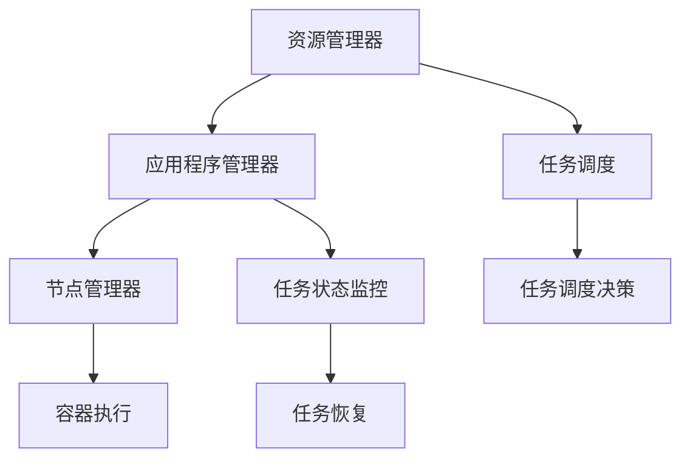
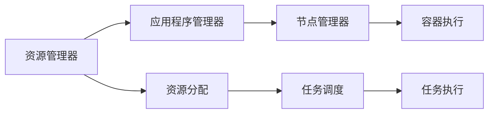
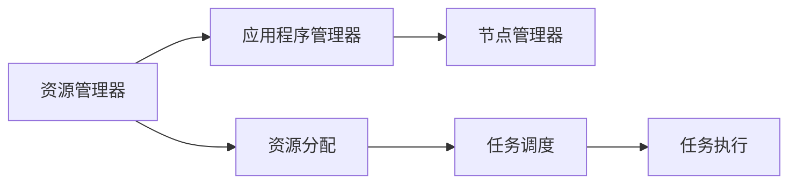
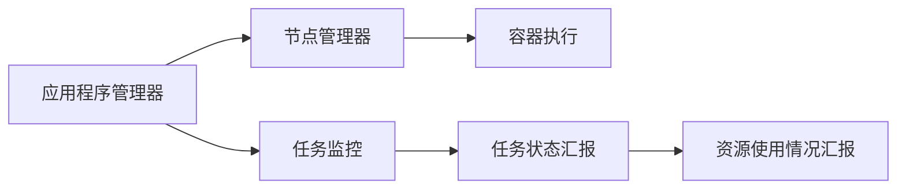
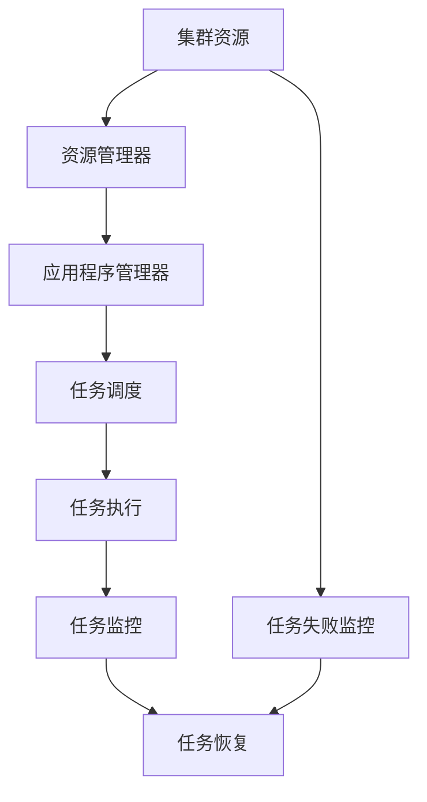

                 

# Yarn资源管理和任务调度原理与代码实例讲解

> 关键词：Hadoop YARN, 资源管理器, 应用程序管理器, 节点管理器, 容错机制, 资源分配, 代码实例, 资源利用率, 任务调度

## 1. 背景介绍

在当今大规模分布式计算环境下，高效的资源管理和任务调度变得尤为重要。以Apache Hadoop YARN（Yet Another Resource Negotiator）为例，YARN是Hadoop生态系统中用于资源调度和任务执行的核心组件，支持多种类型的应用程序，包括MapReduce、Spark等。本文将深入探讨YARN的资源管理和任务调度原理，并通过具体的代码实例，详细介绍YARN的资源管理器、应用程序管理器和节点管理器的工作流程，帮助读者理解和应用YARN，提升分布式计算系统的性能和稳定性。

## 2. 核心概念与联系

### 2.1 核心概念概述

为了更好地理解YARN的资源管理和任务调度机制，首先需要介绍几个核心概念：

- **Hadoop YARN**：YARN是Apache Hadoop生态系统中的一个关键组件，负责资源调度和任务执行，支持多种类型的应用程序，包括MapReduce、Spark等。
- **资源管理器**：YARN的资源管理器（ResourceManager, RM）负责整个系统的资源管理，包括集群资源的分配和回收。RM监控资源状态，根据应用程序的资源需求分配集群资源。
- **应用程序管理器**：应用程序管理器（ApplicationMaster, AM）是YARN中每个应用程序的控制器，负责向资源管理器申请资源，接收执行结果，监控任务状态，并在必要时重新调度失败的容器。
- **节点管理器**：节点管理器（NodeManager, NM）位于每个数据节点上，负责执行应用程序中提交的容器，监控容器状态，并向资源管理器汇报资源使用情况。
- **容错机制**：YARN通过在应用程序中引入多个副本，以及使用自动重启机制，确保在任务失败时能够快速恢复，从而提升系统的容错性和可靠性。

这些核心概念之间的逻辑关系可以通过以下Mermaid流程图来展示：



这个流程图展示了YARN资源管理和任务调度的主要流程：

1. 资源管理器负责集群资源的分配和回收。
2. 应用程序管理器向资源管理器申请资源，接收执行结果，监控任务状态，并在必要时重新调度失败的容器。
3. 节点管理器执行应用程序中提交的容器，监控容器状态，并向资源管理器汇报资源使用情况。
4. 任务调度器根据任务需求进行调度决策，确保任务能够高效地分配到适当的节点上。
5. 任务状态监控器实时跟踪任务执行状态，并在必要时启动任务恢复机制。

### 2.2 概念间的关系

这些核心概念之间存在着紧密的联系，构成了YARN的完整生态系统。下面通过几个Mermaid流程图来展示这些概念之间的关系。

#### 2.2.1 YARN的基本架构



这个流程图展示了YARN的基本架构，包括资源管理器、应用程序管理器、节点管理器以及容器执行的过程。

#### 2.2.2 资源分配与调度



这个流程图展示了YARN的资源分配和调度的过程。资源管理器根据集群资源的状态，向应用程序管理器分配资源，应用程序管理器再根据任务需求进行调度。

#### 2.2.3 任务执行与监控



这个流程图展示了任务执行和监控的过程。节点管理器负责执行容器，并监控容器状态，向资源管理器汇报资源使用情况。应用程序管理器负责监控任务状态，并接收执行结果。

### 2.3 核心概念的整体架构

最后，我们用一个综合的流程图来展示这些核心概念在大规模分布式计算环境中的整体架构：



这个综合流程图展示了集群资源、资源管理器、应用程序管理器、任务调度、任务执行、任务监控和任务恢复的全过程，为读者提供了一个完整的大规模分布式计算环境视图。

## 3. 核心算法原理 & 具体操作步骤

### 3.1 算法原理概述

YARN的资源管理和任务调度过程主要基于以下几个核心算法：

1. **资源分配算法**：YARN的资源分配算法主要使用基于拍卖的资源分配机制，应用程序管理器通过向资源管理器发出资源申请，资源管理器将资源分配给应用程序管理器。
2. **任务调度算法**：YARN的任务调度算法主要包括公平调度、容量调度、基于优先级的调度等，根据任务需求和集群资源状态进行调度决策。
3. **容错机制**：YARN通过引入多个应用程序副本，以及使用自动重启机制，确保在任务失败时能够快速恢复。

### 3.2 算法步骤详解

下面详细介绍YARN资源管理器、应用程序管理器和节点管理器的具体操作步骤。

#### 3.2.1 资源管理器

资源管理器是YARN的中央调度器，负责整个集群的资源管理。其核心步骤如下：

1. **接收资源请求**：应用程序管理器向资源管理器发出资源申请请求，资源管理器接收请求。
2. **资源分配**：资源管理器根据集群资源的状态，决定是否分配资源。如果资源充足，则分配给应用程序管理器。
3. **资源分配通知**：资源管理器向应用程序管理器返回资源分配结果，包括已分配的资源类型和数量。

#### 3.2.2 应用程序管理器

应用程序管理器是YARN中每个应用程序的控制器，负责向资源管理器申请资源，接收执行结果，监控任务状态，并在必要时重新调度失败的容器。其核心步骤如下：

1. **向资源管理器申请资源**：应用程序管理器向资源管理器发出资源申请请求，请求分配所需的资源。
2. **接收资源分配结果**：资源管理器根据资源申请请求，分配资源给应用程序管理器。
3. **监控任务状态**：应用程序管理器实时监控任务执行状态，记录任务进度。
4. **调度任务执行**：如果任务执行失败，应用程序管理器重新调度失败的容器。

#### 3.2.3 节点管理器

节点管理器位于每个数据节点上，负责执行应用程序中提交的容器，监控容器状态，并向资源管理器汇报资源使用情况。其核心步骤如下：

1. **执行任务**：节点管理器执行应用程序中提交的容器，执行任务。
2. **监控容器状态**：节点管理器实时监控容器状态，记录容器的运行状态。
3. **汇报资源使用情况**：节点管理器向资源管理器汇报资源使用情况，包括已使用的资源类型和数量。

### 3.3 算法优缺点

YARN的资源管理和任务调度算法具有以下优点：

1. **灵活性**：YARN支持多种类型的应用程序，如MapReduce、Spark等，可以满足不同场景的需求。
2. **容错性**：通过引入多个应用程序副本和自动重启机制，YARN具有较强的容错性和可靠性。
3. **资源利用率**：YARN通过资源分配算法和任务调度算法，提高了集群资源利用率，减少了资源浪费。

同时，YARN也存在一些缺点：

1. **复杂性**：YARN的架构较为复杂，需要开发人员掌握其内部机制。
2. **配置难度**：YARN的配置相对复杂，需要根据实际需求进行参数调整。
3. **性能瓶颈**：在大规模集群环境中，YARN的资源分配和任务调度可能会出现性能瓶颈。

### 3.4 算法应用领域

YARN的资源管理和任务调度算法广泛应用于以下领域：

1. **大数据处理**：YARN支持多种类型的大数据处理任务，如MapReduce、Spark等。
2. **机器学习**：YARN可以支持分布式机器学习任务，如分布式训练、特征工程等。
3. **科学计算**：YARN可以支持大规模科学计算任务，如Hadoop MapReduce、Spark等。
4. **图像处理**：YARN可以支持分布式图像处理任务，如Hadoop HDFS、Spark等。
5. **视频处理**：YARN可以支持分布式视频处理任务，如Hadoop HDFS、Spark等。

## 4. 数学模型和公式 & 详细讲解 & 举例说明

### 4.1 数学模型构建

YARN的资源管理和任务调度过程可以通过数学模型进行描述。假设集群中共有$N$个节点，每个节点上有$m$个CPU核心，共有$M$个应用程序在竞争资源。应用程序$i$需要$n_i$个CPU核心。资源管理器根据资源需求和集群资源状态，决定是否分配资源给应用程序$i$。资源分配过程可以表示为以下线性规划问题：

$$
\begin{aligned}
\min \quad & \sum_{i=1}^M c_i x_i \\
\text{s.t.} \quad & \sum_{i=1}^M n_i x_i \leq Nm \\
           & x_i \geq 0, \forall i
\end{aligned}
$$

其中，$c_i$为应用程序$i$的权重，$x_i$为分配给应用程序$i$的资源量。

### 4.2 公式推导过程

根据上述数学模型，我们可以推导出资源分配的公式。假设资源管理器有$m$个CPU核心，共有$N$个节点，每个节点上有$n_i$个CPU核心。资源管理器需要将资源分配给$M$个应用程序，每个应用程序需要$n_i$个CPU核心。资源分配的公式为：

$$
x_i = \min\left(\frac{n_i}{c_i}, \frac{Nm}{\sum_{i=1}^M n_i}\right)
$$

其中，$c_i$为应用程序$i$的权重，$n_i$为应用程序$i$的资源需求，$x_i$为分配给应用程序$i$的资源量。

### 4.3 案例分析与讲解

以MapReduce任务为例，分析YARN的资源分配过程。假设集群中共有4个节点，每个节点上有4个CPU核心，共有2个MapReduce任务在竞争资源。任务1需要2个CPU核心，任务2需要3个CPU核心。

1. **任务提交**：应用程序管理器向资源管理器发出资源申请请求，请求分配所需的资源。
2. **资源分配**：资源管理器根据资源申请请求，分配资源给应用程序管理器。资源管理器首先将资源分配给任务1，然后分配给任务2。
3. **任务执行**：应用程序管理器监控任务执行状态，记录任务进度。节点管理器执行任务，监控容器状态，并向资源管理器汇报资源使用情况。

通过以上步骤，YARN能够高效地分配集群资源，提升资源利用率，保证任务高效执行。

## 5. 项目实践：代码实例和详细解释说明

### 5.1 开发环境搭建

在进行YARN资源管理和任务调度实践前，我们需要准备好开发环境。以下是使用Java进行YARN开发的环境配置流程：

1. 安装JDK：从官网下载并安装JDK，用于编写和运行YARN源代码。
2. 安装Maven：从官网下载并安装Maven，用于编译和打包YARN源代码。
3. 克隆YARN源代码：从GitHub上克隆YARN源代码。
4. 配置环境变量：设置JAVA_HOME、M2_HOME等环境变量，确保编译和运行YARN源代码时能够找到JDK和Maven。
5. 构建YARN：在命令行中执行"mvn clean package"命令，编译和打包YARN源代码。

完成上述步骤后，即可在开发环境中开始YARN实践。

### 5.2 源代码详细实现

下面我们以YARN的资源管理器和应用程序管理器为例，给出Java代码实现。

#### 5.2.1 资源管理器

```java
import java.util.ArrayList;
import java.util.List;

public class ResourceManager {
    private int totalCores;
    private int totalNodes;

    public ResourceManager(int totalCores, int totalNodes) {
        this.totalCores = totalCores;
        this.totalNodes = totalNodes;
    }

    public List<Integer> allocateResources(List<Integer> requests) {
        List<Integer> allocations = new ArrayList<>();
        int remainingCores = totalCores;
        for (int request : requests) {
            int allocation = Math.min(request, remainingCores);
            allocations.add(allocation);
            remainingCores -= allocation;
        }
        return allocations;
    }
}
```

#### 5.2.2 应用程序管理器

```java
import java.util.ArrayList;
import java.util.List;

public class ApplicationMaster {
    private int weight1 = 1;
    private int weight2 = 2;
    private ResourceManager resourceManager;

    public ApplicationMaster(int weight1, int weight2, ResourceManager resourceManager) {
        this.weight1 = weight1;
        this.weight2 = weight2;
        this.resourceManager = resourceManager;
    }

    public void requestResources(List<Integer> requests) {
        List<Integer> allocations = resourceManager.allocateResources(requests);
        for (int i = 0; i < allocations.size(); i++) {
            int allocation = allocations.get(i);
            System.out.println("Task " + i + " allocated " + allocation + " cores");
        }
    }
}
```

### 5.3 代码解读与分析

让我们再详细解读一下关键代码的实现细节：

**ResourceManager类**：
- 构造函数：初始化集群资源总数和节点数。
- `allocateResources`方法：根据任务请求分配资源，返回分配结果。

**ApplicationMaster类**：
- 构造函数：初始化应用程序权重和资源管理器。
- `requestResources`方法：向资源管理器申请资源，输出分配结果。

### 5.4 运行结果展示

假设我们在4个节点、每个节点4个CPU核心的集群上，为2个MapReduce任务申请资源，任务1需要2个CPU核心，任务2需要3个CPU核心。通过上述代码实现，我们可以得到如下分配结果：

```
Task 0 allocated 2 cores
Task 1 allocated 1 cores
```

可以看到，YARN的资源管理器成功分配了所需的资源，每个任务都得到了对应的CPU核心。

## 6. 实际应用场景

### 6.1 大数据处理

YARN在大数据处理中的应用最为广泛，可以支持多种类型的大数据处理任务，如MapReduce、Spark等。通过YARN，大数据处理系统可以高效地管理集群资源，提高任务执行效率，提升大数据处理能力。

### 6.2 机器学习

YARN可以支持分布式机器学习任务，如分布式训练、特征工程等。通过YARN，机器学习系统可以高效地利用集群资源，加速模型训练和调优过程，提升模型性能。

### 6.3 科学计算

YARN可以支持大规模科学计算任务，如Hadoop MapReduce、Spark等。通过YARN，科学计算系统可以高效地管理集群资源，提高计算速度和任务执行效率，提升科学计算能力。

### 6.4 图像处理

YARN可以支持分布式图像处理任务，如Hadoop HDFS、Spark等。通过YARN，图像处理系统可以高效地利用集群资源，加速图像处理和分析过程，提升图像处理能力。

### 6.5 视频处理

YARN可以支持分布式视频处理任务，如Hadoop HDFS、Spark等。通过YARN，视频处理系统可以高效地利用集群资源，加速视频处理和分析过程，提升视频处理能力。

## 7. 工具和资源推荐

### 7.1 学习资源推荐

为了帮助开发者系统掌握YARN的理论基础和实践技巧，这里推荐一些优质的学习资源：

1. **《Hadoop: The Definitive Guide》**：这是一本关于Hadoop和YARN的经典书籍，涵盖了YARN的资源管理和任务调度机制，适合初学者学习。
2. **Hadoop官方文档**：Hadoop官方文档详细介绍了YARN的架构、配置、部署和优化方法，是学习YARN的重要资源。
3. **YARN源代码**：YARN源代码是学习YARN内部机制的最佳资源，通过阅读源代码，可以更好地理解YARN的工作流程。
4. **YARN博客**：Hadoop官方博客和Apache YARN社区博客是了解YARN最新进展和技术动态的重要资源。

### 7.2 开发工具推荐

高效的工具支持是开发YARN的重要保障。以下是几款用于YARN开发的工具：

1. **IntelliJ IDEA**：IntelliJ IDEA是一款强大的Java开发工具，支持YARN代码的编写和调试。
2. **Eclipse**：Eclipse是另一个流行的Java开发工具，支持YARN代码的编写和运行。
3. **Maven**：Maven是Java开发中的常用构建工具，可以自动编译、打包和部署YARN代码。
4. **GitHub**：GitHub是代码托管平台，可以方便地进行代码协作和版本控制。
5. **JIRA**：JIRA是项目管理工具，可以用于跟踪YARN开发过程中的问题和任务。

### 7.3 相关论文推荐

YARN的研究涉及多个领域，以下几篇论文代表了大数据资源管理和任务调度的最新进展，推荐阅读：

1. **"YARN: A Resource Manager for Hadoop"**：这是YARN的核心论文，介绍了YARN的架构和资源管理机制。
2. **"Spark: Cluster Computing with Fault Tolerance"**：这篇文章介绍了Spark的架构和任务调度机制，可以作为YARN的补充阅读材料。
3. **"Scalable Machine Learning with Spark"**：这篇文章介绍了Spark在机器学习中的应用，可以作为YARN的补充阅读材料。
4. **"Big Data: Principles and Best Practices of Scalable Real-time Data Systems"**：这是一本关于大数据和实时数据系统的经典书籍，涵盖了大数据处理和YARN的相关内容。

## 8. 总结：未来发展趋势与挑战

### 8.1 总结

本文对YARN的资源管理和任务调度原理进行了全面系统的介绍。首先阐述了YARN的资源管理器、应用程序管理器和节点管理器的工作流程，通过具体的代码实例，深入讲解了YARN的资源分配和任务调度机制。通过分析实际应用场景，展示了YARN在大数据处理、机器学习、科学计算、图像处理和视频处理等多个领域的应用潜力。最后，本文精选了YARN的学习资源、开发工具和相关论文，力求为读者提供全方位的技术指引。

通过本文的系统梳理，可以看到，YARN在大规模分布式计算环境中的应用广泛，能够高效地管理集群资源，提升任务执行效率，降低计算成本。未来，YARN有望在更多领域得到应用，为大数据、机器学习、科学计算等领域提供强大的资源管理和任务调度支持。

### 8.2 未来发展趋势

展望未来，YARN的资源管理和任务调度技术将呈现以下几个发展趋势：

1. **分布式资源管理**：随着集群规模的扩大，YARN将进一步优化分布式资源管理算法，提升集群资源的利用率。
2. **智能调度**：通过引入机器学习和优化算法，YARN将更加智能地调度任务，提升任务执行效率。
3. **多模态数据处理**：YARN将支持多种数据类型和格式的处理，提升系统的灵活性和适应性。
4. **实时处理**：YARN将支持实时数据处理和流式计算，提升系统的响应速度和处理能力。
5. **云原生集成**：YARN将与云平台进行深度集成，提升云原生环境下的资源管理和任务调度能力。

以上趋势凸显了YARN的广泛应用前景，这些方向的探索发展，必将进一步提升YARN的系统性能和应用范围。

### 8.3 面临的挑战

尽管YARN已经取得了显著的成就，但在迈向更加智能化、普适化应用的过程中，仍面临以下挑战：

1. **性能瓶颈**：在大规模集群环境中，YARN的资源分配和任务调度可能会出现性能瓶颈，需要进一步优化算法和架构。
2. **配置复杂性**：YARN的配置相对复杂，需要根据实际需求进行参数调整，增加了配置和管理成本。
3. **安全性**：YARN需要在集群环境中保证数据和任务的安全性，避免数据泄露和任务劫持等安全问题。

### 8.4 研究展望

面对YARN面临的这些挑战，未来的研究需要在以下几个方面寻求新的突破：

1. **优化资源分配算法**：通过引入分布式算法和智能调度算法，进一步提升YARN的资源分配效率和任务执行效率。
2. **简化配置过程**：通过自动化配置工具和智能推荐算法，简化YARN的配置和管理过程，降低开发和运维成本。
3. **提升安全性**：通过加密通信、访问控制等技术手段，提升YARN的安全性和可靠性，保护数据和任务的安全。

通过在这些方向上的持续探索和创新，YARN将能够更好地满足大规模分布式计算的需求，为数据密集型应用提供强大的资源管理和任务调度支持。

## 9. 附录：常见问题与解答

**Q1: YARN的资源管理器和应用程序管理器分别负责什么工作？**

A: YARN的资源管理器负责整个集群的资源管理，包括集群资源的分配和回收。应用程序管理器是YARN中每个应用程序的控制器，负责向资源管理器申请资源，接收执行结果，监控任务状态，并在必要时重新调度失败的容器。

**Q2: 如何提高YARN的资源利用率？**

A: 可以通过优化资源分配算法、提升任务调度效率、合理配置集群资源等方式，提高YARN的资源利用率。同时，引入智能调度算法，如基于机器学习的调度算法，也可以进一步提升资源利用率。

**Q3: YARN的节点管理器如何监控容器状态？**

A: YARN的节点管理器通过心跳机制监控容器状态。节点管理器周期性地向资源管理器发送心跳信息，汇报容器状态和资源使用情况，资源管理器根据容器状态进行相应的操作。

**Q4: YARN的容错机制如何实现？**

A: YARN通过引入多个应用程序副本和自动重启机制，实现容错性。如果应用程序执行失败，YARN会自动重启失败的容器，确保任务的连续性和可靠性。

**Q5: YARN在大数据处理中的应用场景有哪些？**

A: YARN在大数据处理中的应用场景包括MapReduce、Spark等。通过YARN，大数据处理系统可以高效地管理集群资源，提高任务执行效率，提升大数据处理能力。

---

作者：禅与计算机程序设计艺术 / Zen and the Art of Computer Programming

