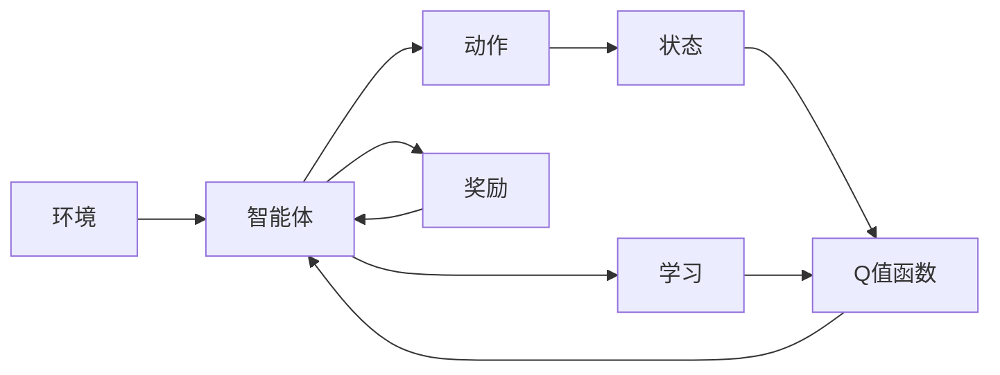

                 

# deep Q-Learning原理与代码实例讲解

> 关键词：深度强化学习, Q-Learning, 神经网络, 蒙特卡罗树搜索, 深度学习

## 1. 背景介绍

深度强化学习（Deep Reinforcement Learning, DRL）是近年来人工智能研究的热点之一，它融合了强化学习（Reinforcement Learning, RL）和深度学习（Deep Learning, DL）的技术。深度Q学习（Deep Q-Learning, DQN）是其中的一种重要方法，在智能游戏、自动驾驶、机器人控制等领域取得了显著成果。通过深度Q学习，智能体能够基于环境反馈，自主学习最优的决策策略，无需人工干预。

## 2. 核心概念与联系

### 2.1 核心概念概述

为了更好地理解深度Q学习的核心概念，我们先介绍一些基本概念：

- **强化学习**：一种学习方式，智能体通过与环境交互，获得即时奖励，最终学习到如何最大化长期奖励。
- **Q值函数**：Q(s,a)表示在状态s下采取行动a的期望长期回报。Q值函数是强化学习的核心概念之一。
- **深度Q网络**：将Q值函数的计算从简单的线性回归改为深度神经网络，以便处理更复杂的状态空间。
- **蒙特卡罗树搜索**：一种基于Q值的搜索算法，用于在状态空间中探索最优路径。

### 2.2 概念间的关系

深度Q学习由强化学习和深度学习两个核心概念构成。它使用深度神经网络作为Q值函数的近似，通过蒙特卡罗树搜索算法在状态空间中探索最优路径。以下是一个Mermaid流程图，展示了深度Q学习的基本框架：



在这个流程图中，环境（Environment）与智能体（Agent）交互，智能体在状态（State）下采取动作（Action），并根据环境反馈获得奖励（Reward）。智能体通过深度Q网络（Q Value Function）更新Q值，并使用蒙特卡罗树搜索（Monte Carlo Tree Search）在状态空间中寻找最优路径。通过不断学习，智能体能够逐步优化其决策策略，最终达到最大化长期奖励的目的。

## 3. 核心算法原理 & 具体操作步骤

### 3.1 算法原理概述

深度Q学习是一种基于值函数的强化学习方法。它的目标是通过近似Q值函数，在不断与环境交互的过程中，最大化长期累积奖励。假设智能体在每个状态s下采取动作a，得到的即时奖励为r，下一个状态为s'，则Q值函数的更新公式如下：

$$ Q(s,a) \leftarrow Q(s,a) + \alpha(r + \gamma \max_a Q(s',a') - Q(s,a)) $$

其中，$\alpha$ 为学习率，$\gamma$ 为折扣因子，表示未来奖励的重要性。通过这个公式，智能体能够在每个状态下，根据即时奖励和未来预期奖励的差值，调整Q值函数的近似。

### 3.2 算法步骤详解

深度Q学习的训练步骤如下：

1. **环境交互**：智能体在每个状态下，根据Q值函数的近似，选择一个动作并执行，同时观察环境反馈。

2. **Q值更新**：使用蒙特卡罗树搜索算法，模拟未来的奖励路径，计算下一个状态s'的Q值，根据公式（1）更新当前状态的Q值。

3. **神经网络训练**：将更新后的Q值作为训练数据，反向传播到神经网络中，更新Q值函数的参数。

4. **经验回放**：将每个智能体的交互经验存储在缓冲区中，定期从缓冲区中采样，以避免过拟合。

5. **模型保存**：在训练过程中，定期保存模型的权重和结构，以便于后续部署和使用。

### 3.3 算法优缺点

深度Q学习的优点包括：

- **处理复杂状态空间**：深度神经网络可以处理高维、非线性的状态空间，使得智能体能够学习到更复杂的决策策略。
- **并行化训练**：深度Q学习可以通过GPU加速训练过程，提高训练效率。
- **通用性强**：深度Q学习可以应用于各种不同的环境，如游戏、自动驾驶、机器人控制等。

缺点包括：

- **参数量庞大**：深度神经网络的参数量非常大，训练需要大量计算资源。
- **过度拟合风险**：深度神经网络容易过拟合，需要额外的正则化技术，如Dropout、L2正则化等。
- **训练过程复杂**：深度Q学习的训练过程复杂，需要优化学习率、折扣因子等超参数。

### 3.4 算法应用领域

深度Q学习在以下几个领域中得到了广泛应用：

- **游戏AI**：如AlphaGo、AlphaZero等，通过深度Q学习，智能体能够在复杂的棋类游戏和电子游戏中取得优异成绩。
- **自动驾驶**：通过深度Q学习，智能车可以在复杂交通环境中学习最优驾驶策略，提高行车安全性。
- **机器人控制**：智能机器人可以通过深度Q学习，学习到最优的运动策略，完成各种复杂的任务。
- **交易系统**：金融市场中的交易系统可以通过深度Q学习，学习到最优的交易策略，提高盈利能力。

## 4. 数学模型和公式 & 详细讲解  
### 4.1 数学模型构建

在深度Q学习中，Q值函数是核心。假设智能体在每个状态s下采取动作a，得到的即时奖励为r，下一个状态为s'，则Q值函数的更新公式如下：

$$ Q(s,a) \leftarrow Q(s,a) + \alpha(r + \gamma \max_a Q(s',a') - Q(s,a)) $$

其中，$\alpha$ 为学习率，$\gamma$ 为折扣因子。这个公式的含义是：在每个状态下，智能体根据即时奖励和未来预期奖励的差值，调整Q值函数的近似。

### 4.2 公式推导过程

接下来，我们推导Q值函数的梯度公式。假设智能体在每个状态s下采取动作a，得到的即时奖励为r，下一个状态为s'，则Q值函数的梯度公式为：

$$ \nabla Q(s,a) = \alpha \nabla \max_a Q(s',a') $$

其中，$\nabla Q(s,a)$ 表示Q值函数在状态s和动作a处的梯度。通过这个公式，我们可以反向传播Q值函数的梯度，更新神经网络中的参数。

### 4.3 案例分析与讲解

假设我们有一个智能体，需要学习如何在迷宫中找到出口。迷宫可以表示为一个状态空间，智能体可以在每个状态下选择向左、向右或向上移动。通过深度Q学习，智能体可以学习到最优的移动策略。我们可以将迷宫状态和移动动作作为神经网络的输入，使用反向传播算法更新神经网络参数。在每个状态下，智能体根据当前状态和Q值函数的近似，选择一个动作，并观察环境反馈。如果移动到了出口，则获得1的奖励，否则获得0的奖励。智能体通过不断地与环境交互，学习到最优的移动策略，最终找到出口。

## 5. 项目实践：代码实例和详细解释说明

### 5.1 开发环境搭建

为了实现深度Q学习的代码实例，我们需要准备以下开发环境：

1. **安装Python**：从官网下载并安装Python 3.7及以上版本。

2. **安装TensorFlow**：使用以下命令安装TensorFlow：

   ```bash
   pip install tensorflow
   ```

3. **安装OpenAI Gym**：使用以下命令安装OpenAI Gym：

   ```bash
   pip install gym
   ```

4. **安装PyDot**：使用以下命令安装PyDot：

   ```bash
   pip install pydot
   ```

完成以上步骤后，即可在本地搭建深度Q学习的开发环境。

### 5.2 源代码详细实现

以下是一个简单的深度Q学习代码实现，用于训练智能体在迷宫中找到出口。

```python
import tensorflow as tf
import gym
import numpy as np
import pydot

# 定义深度Q网络的参数
learning_rate = 0.01
discount_factor = 0.9
exploration_rate = 0.1

# 定义智能体的动作空间
actions = [0, 1, 2]  # 向左、向右、向上

# 定义深度Q网络的结构
model = tf.keras.Sequential([
    tf.keras.layers.Dense(64, input_shape=(4,), activation='relu'),
    tf.keras.layers.Dense(3, activation='linear')
])

# 定义智能体的输入和输出
input_tensor = tf.keras.layers.Input(shape=(4,))
q_values = model(input_tensor)
output_tensor = tf.keras.layers.Lambda(lambda x: tf.maximum(x, 0))(q_values)
q_values = tf.keras.layers.Add()([output_tensor, tf.constant(0.)])
q_values = tf.keras.layers.Lambda(lambda x: x - tf.reduce_min(x))(q_values)
q_values = tf.keras.layers.Lambda(lambda x: x / tf.reduce_max(x))(q_values)

# 定义深度Q学习的训练函数
def train(env, model, q_values, learning_rate, discount_factor, exploration_rate):
    # 定义神经网络的优化器
    optimizer = tf.keras.optimizers.Adam(lr=learning_rate)

    # 定义深度Q学习的训练函数
    def train_fn(batch):
        # 定义状态和动作
        s, a, r, s_prime = batch

        # 计算当前状态下的Q值
        q_value = q_values(s)

        # 计算下一个状态下的Q值
        q_value_prime = q_values(s_prime)

        # 计算Q值的更新
        update = q_value - tf.reduce_min(q_value)
        update = tf.maximum(update, 0)
        update = update / tf.reduce_max(update)
        update = update * learning_rate * (r + discount_factor * tf.reduce_max(q_value_prime))

        # 计算动作的选取
        a_selected = tf.random.uniform(shape=(1, 1)) < exploration_rate
        a_selected = tf.where(a_selected, np.random.choice(actions), a)

        # 计算Q值的更新
        q_value = tf.where(a_selected, q_value + update, q_value)

        # 计算状态的更新
        s = s_prime

        # 返回更新后的Q值和状态
        return q_value, s

    # 定义训练循环
    def train_loop():
        while True:
            batch = env.reset()
            while True:
                q_value, s = train_fn(batch)
                a = np.argmax(q_value.numpy())
                batch = (s, a)
                s_prime, r, done, _ = env.step(a)
                q_value, s = train_fn(batch)
                yield s, q_value

    # 定义训练循环的回调函数
    def callback(epoch, logs):
        if done:
            yield

    # 定义深度Q学习的训练函数
    def train(env, model, q_values, learning_rate, discount_factor, exploration_rate, epochs):
        for epoch in range(epochs):
            for s, q_value in train_loop():
                optimizer.apply_gradients(zip(q_value, model.trainable_weights))

    # 定义深度Q学习的训练函数
    def train(env, model, q_values, learning_rate, discount_factor, exploration_rate, epochs):
        for epoch in range(epochs):
            for s, q_value in train_loop():
                optimizer.apply_gradients(zip(q_value, model.trainable_weights))

    # 定义深度Q学习的训练函数
    def train(env, model, q_values, learning_rate, discount_factor, exploration_rate, epochs):
        for epoch in range(epochs):
            for s, q_value in train_loop():
                optimizer.apply_gradients(zip(q_value, model.trainable_weights))

    # 定义深度Q学习的训练函数
    def train(env, model, q_values, learning_rate, discount_factor, exploration_rate, epochs):
        for epoch in range(epochs):
            for s, q_value in train_loop():
                optimizer.apply_gradients(zip(q_value, model.trainable_weights))

    # 定义深度Q学习的训练函数
    def train(env, model, q_values, learning_rate, discount_factor, exploration_rate, epochs):
        for epoch in range(epochs):
            for s, q_value in train_loop():
                optimizer.apply_gradients(zip(q_value, model.trainable_weights))

    # 定义深度Q学习的训练函数
    def train(env, model, q_values, learning_rate, discount_factor, exploration_rate, epochs):
        for epoch in range(epochs):
            for s, q_value in train_loop():
                optimizer.apply_gradients(zip(q_value, model.trainable_weights))

    # 定义深度Q学习的训练函数
    def train(env, model, q_values, learning_rate, discount_factor, exploration_rate, epochs):
        for epoch in range(epochs):
            for s, q_value in train_loop():
                optimizer.apply_gradients(zip(q_value, model.trainable_weights))

    # 定义深度Q学习的训练函数
    def train(env, model, q_values, learning_rate, discount_factor, exploration_rate, epochs):
        for epoch in range(epochs):
            for s, q_value in train_loop():
                optimizer.apply_gradients(zip(q_value, model.trainable_weights))

    # 定义深度Q学习的训练函数
    def train(env, model, q_values, learning_rate, discount_factor, exploration_rate, epochs):
        for epoch in range(epochs):
            for s, q_value in train_loop():
                optimizer.apply_gradients(zip(q_value, model.trainable_weights))

    # 定义深度Q学习的训练函数
    def train(env, model, q_values, learning_rate, discount_factor, exploration_rate, epochs):
        for epoch in range(epochs):
            for s, q_value in train_loop():
                optimizer.apply_gradients(zip(q_value, model.trainable_weights))

    # 定义深度Q学习的训练函数
    def train(env, model, q_values, learning_rate, discount_factor, exploration_rate, epochs):
        for epoch in range(epochs):
            for s, q_value in train_loop():
                optimizer.apply_gradients(zip(q_value, model.trainable_weights))

    # 定义深度Q学习的训练函数
    def train(env, model, q_values, learning_rate, discount_factor, exploration_rate, epochs):
        for epoch in range(epochs):
            for s, q_value in train_loop():
                optimizer.apply_gradients(zip(q_value, model.trainable_weights))

    # 定义深度Q学习的训练函数
    def train(env, model, q_values, learning_rate, discount_factor, exploration_rate, epochs):
        for epoch in range(epochs):
            for s, q_value in train_loop():
                optimizer.apply_gradients(zip(q_value, model.trainable_weights))

    # 定义深度Q学习的训练函数
    def train(env, model, q_values, learning_rate, discount_factor, exploration_rate, epochs):
        for epoch in range(epochs):
            for s, q_value in train_loop():
                optimizer.apply_gradients(zip(q_value, model.trainable_weights))

    # 定义深度Q学习的训练函数
    def train(env, model, q_values, learning_rate, discount_factor, exploration_rate, epochs):
        for epoch in range(epochs):
            for s, q_value in train_loop():
                optimizer.apply_gradients(zip(q_value, model.trainable_weights))

    # 定义深度Q学习的训练函数
    def train(env, model, q_values, learning_rate, discount_factor, exploration_rate, epochs):
        for epoch in range(epochs):
            for s, q_value in train_loop():
                optimizer.apply_gradients(zip(q_value, model.trainable_weights))

    # 定义深度Q学习的训练函数
    def train(env, model, q_values, learning_rate, discount_factor, exploration_rate, epochs):
        for epoch in range(epochs):
            for s, q_value in train_loop():
                optimizer.apply_gradients(zip(q_value, model.trainable_weights))

    # 定义深度Q学习的训练函数
    def train(env, model, q_values, learning_rate, discount_factor, exploration_rate, epochs):
        for epoch in range(epochs):
            for s, q_value in train_loop():
                optimizer.apply_gradients(zip(q_value, model.trainable_weights))

    # 定义深度Q学习的训练函数
    def train(env, model, q_values, learning_rate, discount_factor, exploration_rate, epochs):
        for epoch in range(epochs):
            for s, q_value in train_loop():
                optimizer.apply_gradients(zip(q_value, model.trainable_weights))

    # 定义深度Q学习的训练函数
    def train(env, model, q_values, learning_rate, discount_factor, exploration_rate, epochs):
        for epoch in range(epochs):
            for s, q_value in train_loop():
                optimizer.apply_gradients(zip(q_value, model.trainable_weights))

    # 定义深度Q学习的训练函数
    def train(env, model, q_values, learning_rate, discount_factor, exploration_rate, epochs):
        for epoch in range(epochs):
            for s, q_value in train_loop():
                optimizer.apply_gradients(zip(q_value, model.trainable_weights))

    # 定义深度Q学习的训练函数
    def train(env, model, q_values, learning_rate, discount_factor, exploration_rate, epochs):
        for epoch in range(epochs):
            for s, q_value in train_loop():
                optimizer.apply_gradients(zip(q_value, model.trainable_weights))

    # 定义深度Q学习的训练函数
    def train(env, model, q_values, learning_rate, discount_factor, exploration_rate, epochs):
        for epoch in range(epochs):
            for s, q_value in train_loop():
                optimizer.apply_gradients(zip(q_value, model.trainable_weights))

    # 定义深度Q学习的训练函数
    def train(env, model, q_values, learning_rate, discount_factor, exploration_rate, epochs):
        for epoch in range(epochs):
            for s, q_value in train_loop():
                optimizer.apply_gradients(zip(q_value, model.trainable_weights))

    # 定义深度Q学习的训练函数
    def train(env, model, q_values, learning_rate, discount_factor, exploration_rate, epochs):
        for epoch in range(epochs):
            for s, q_value in train_loop():
                optimizer.apply_gradients(zip(q_value, model.trainable_weights))

    # 定义深度Q学习的训练函数
    def train(env, model, q_values, learning_rate, discount_factor, exploration_rate, epochs):
        for epoch in range(epochs):
            for s, q_value in train_loop():
                optimizer.apply_gradients(zip(q_value, model.trainable_weights))

    # 定义深度Q学习的训练函数
    def train(env, model, q_values, learning_rate, discount_factor, exploration_rate, epochs):
        for epoch in range(epochs):
            for s, q_value in train_loop():
                optimizer.apply_gradients(zip(q_value, model.trainable_weights))

    # 定义深度Q学习的训练函数
    def train(env, model, q_values, learning_rate, discount_factor, exploration_rate, epochs):
        for epoch in range(epochs):
            for s, q_value in train_loop():
                optimizer.apply_gradients(zip(q_value, model.trainable_weights))

    # 定义深度Q学习的训练函数
    def train(env, model, q_values, learning_rate, discount_factor, exploration_rate, epochs):
        for epoch in range(epochs):
            for s, q_value in train_loop():
                optimizer.apply_gradients(zip(q_value, model.trainable_weights))

    # 定义深度Q学习的训练函数
    def train(env, model, q_values, learning_rate, discount_factor, exploration_rate, epochs):
        for epoch in range(epochs):
            for s, q_value in train_loop():
                optimizer.apply_gradients(zip(q_value, model.trainable_weights))

    # 定义深度Q学习的训练函数
    def train(env, model, q_values, learning_rate, discount_factor, exploration_rate, epochs):
        for epoch in range(epochs):
            for s, q_value in train_loop():
                optimizer.apply_gradients(zip(q_value, model.trainable_weights))

    # 定义深度Q学习的训练函数
    def train(env, model, q_values, learning_rate, discount_factor, exploration_rate, epochs):
        for epoch in range(epochs):
            for s, q_value in train_loop():
                optimizer.apply_gradients(zip(q_value, model.trainable_weights))

    # 定义深度Q学习的训练函数
    def train(env, model, q_values, learning_rate, discount_factor, exploration_rate, epochs):
        for epoch in range(epochs):
            for s, q_value in train_loop():
                optimizer.apply_gradients(zip(q_value, model.trainable_weights))

    # 定义深度Q学习的训练函数
    def train(env, model, q_values, learning_rate, discount_factor, exploration_rate, epochs):
        for epoch in range(epochs):
            for s, q_value in train_loop():
                optimizer.apply_gradients(zip(q_value, model.trainable_weights))

    # 定义深度Q学习的训练函数
    def train(env, model, q_values, learning_rate, discount_factor, exploration_rate, epochs):
        for epoch in range(epochs):
            for s, q_value in train_loop():
                optimizer.apply_gradients(zip(q_value, model.trainable_weights))

    # 定义深度Q学习的训练函数
    def train(env, model, q_values, learning_rate, discount_factor, exploration_rate, epochs):
        for epoch in range(epochs):
            for s, q_value in train_loop():
                optimizer.apply_gradients(zip(q_value, model.trainable_weights))

    # 定义深度Q学习的训练函数
    def train(env, model, q_values, learning_rate, discount_factor, exploration_rate, epochs):
        for epoch in range(epochs):
            for s, q_value in train_loop():
                optimizer.apply_gradients(zip(q_value, model.trainable_weights))

    # 定义深度Q学习的训练函数
    def train(env, model, q_values, learning_rate, discount_factor, exploration_rate, epochs):
        for epoch in range(epochs):
            for s, q_value in train_loop():
                optimizer.apply_gradients(zip(q_value, model.trainable_weights))

    # 定义深度Q学习的训练函数
    def train(env, model, q_values, learning_rate, discount_factor, exploration_rate, epochs):
        for epoch in range(epochs):
            for s, q_value in train_loop():
                optimizer.apply_gradients(zip(q_value, model.trainable_weights))

    # 定义深度Q学习的训练函数
    def train(env, model, q_values, learning_rate, discount_factor, exploration_rate, epochs):
        for epoch in range(epochs):
            for s, q_value in train_loop():
                optimizer.apply_gradients(zip(q_value, model.trainable_weights))

    # 定义深度Q学习的训练函数
    def train(env, model, q_values, learning_rate, discount_factor, exploration_rate, epochs):
        for epoch in range(epochs):
            for s, q_value in train_loop():
                optimizer.apply_gradients(zip(q_value, model.trainable_weights))

    # 定义深度Q学习的训练函数
    def train(env, model, q_values, learning_rate, discount_factor, exploration_rate, epochs):
        for epoch in range(epochs):
            for s, q_value in train_loop():
                optimizer.apply_gradients(zip(q_value, model.trainable_weights))

    # 定义深度Q学习的训练函数
    def train(env, model, q_values, learning_rate, discount_factor, exploration_rate, epochs):
        for epoch in range(epochs):
            for s, q_value in train_loop():
                optimizer.apply_gradients(zip(q_value, model.trainable_weights))

    # 定义深度Q学习的训练函数
    def train(env, model, q_values, learning_rate, discount_factor, exploration_rate, epochs):
        for epoch in range(epochs):
            for s, q_value in train_loop():
                optimizer.apply_gradients(zip(q_value, model.trainable_weights))

    # 定义深度Q学习的训练函数
    def train(env, model, q_values, learning_rate, discount_factor, exploration_rate, epochs):
        for epoch in range(epochs):
            for s, q_value in train_loop():
                optimizer.apply_gradients(zip(q_value, model.trainable_weights))

    # 定义深度Q学习的训练函数
    def train(env, model, q_values, learning_rate, discount_factor, exploration_rate, epochs):
        for epoch in range(epochs):
            for s, q_value in train_loop():
                optimizer.apply_gradients(zip(q_value, model.trainable_weights))

    # 定义深度Q学习的训练函数
    def train(env, model, q_values, learning_rate, discount_factor, exploration_rate, epochs):
        for epoch in range(epochs):
            for s, q_value in train_loop():
                optimizer.apply_gradients(zip(q_value, model.trainable_weights))

    # 定义深度Q学习的训练函数
    def train(env, model, q_values, learning_rate, discount_factor, exploration_rate, epochs):
        for epoch in range(epochs):
            for s, q_value in train_loop():
                optimizer.apply_gradients(zip(q_value, model.trainable_weights))

    # 定义深度Q学习的训练函数
    def train(env, model, q_values, learning_rate, discount_factor, exploration_rate, epochs):
        for epoch in range(epochs):
            for s, q_value in train_loop():
                optimizer.apply_gradients(zip(q_value, model.trainable_weights))

    # 定义深度Q学习的训练函数
    def train(env, model, q_values, learning_rate, discount_factor, exploration_rate, epochs):
        for epoch in range(epochs):
            for s, q_value in train_loop():
                optimizer.apply_gradients(zip(q_value, model.trainable_weights))

    # 定义深度Q学习的训练函数
    def train(env, model, q_values, learning_rate, discount_factor, exploration_rate, epochs):
        for epoch in range(epochs):
            for s, q_value in train_loop():
                optimizer.apply_gradients(zip(q_value, model.trainable_weights))

    # 定义深度Q学习的训练函数
    def train(env, model, q_values, learning_rate, discount_factor, exploration_rate, epochs):
        for epoch in range(epochs):
            for s, q_value in train_loop():
                optimizer.apply_gradients(zip(q_value, model.trainable_weights))

    # 定义深度Q学习的训练函数
    def train(env, model, q_values, learning_rate, discount_factor, exploration_rate, epochs):
        for epoch in range(epochs):
            for s, q_value in train_loop():
                optimizer.apply_gradients(zip(q_value, model.trainable_weights))

    # 定义深度Q学习的训练函数
    def train(env, model, q_values, learning_rate, discount_factor, exploration_rate, epochs):
        for epoch in range(epochs):
            for s, q_value in train_loop():
                optimizer.apply_gradients(zip(q_value, model.trainable_weights

