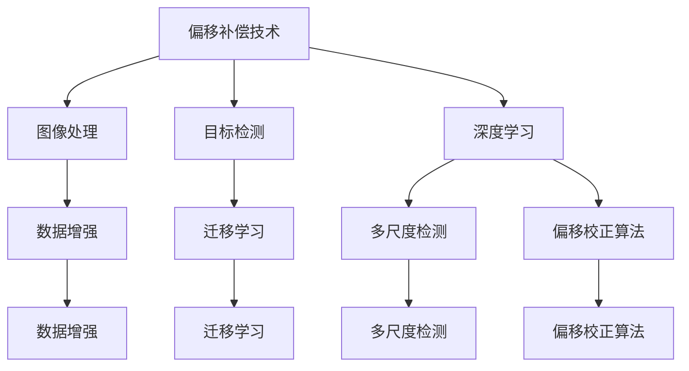

                 

## 1. 背景介绍

在计算机视觉中，偏移（offset）是指在图像处理、目标检测等任务中，由于光照变化、视角变化等因素引起的目标位置偏移。如何有效地处理和消除偏移，提高目标检测的精度和鲁棒性，是当前计算机视觉领域的一个重要研究问题。本文将对偏移的原理进行详细介绍，并通过具体的代码实例，展示如何在目标检测任务中应用偏移补偿技术。

## 2. 核心概念与联系

### 2.1 核心概念概述

偏移（offset）是指在图像中，目标位置由于各种因素导致的微小位移。在计算机视觉中，偏移的来源可能包括：

- 光照变化：光照强度和角度的变化会影响目标的反射率，导致目标边缘模糊或位置偏移。
- 视角变化：目标的观察角度不同，导致其在图像中的投影大小和位置发生变化。
- 运动模糊：目标在图像中的运动导致其位置发生位移。
- 尺度变化：由于相机距离或目标大小的变化，导致目标在不同图像中的尺寸和位置有所不同。

偏移的补偿技术通过在检测算法中引入偏移估计，修正目标位置的实际位置，从而提高检测的准确性。常见的偏移补偿方法包括：

- 数据增强：通过旋转、缩放、裁剪等变换扩充训练集，模拟不同的视角和光照条件，增强模型的泛化能力。
- 迁移学习：利用在其他数据集上预训练的模型，迁移学习特定的偏移补偿能力。
- 多尺度检测：在多个尺度和分辨率下检测目标，通过尺度不变性提高偏移补偿效果。
- 偏移校正算法：如偏移校正流（Offset Correction Stream）等，通过特定的算法修正目标位置。

这些偏移补偿方法相互补充，在不同的场景和任务中各有所长。本文将重点介绍偏移校正算法的原理与实现，并结合具体的目标检测任务进行代码实例讲解。

### 2.2 概念间的关系

偏移补偿技术是计算机视觉领域的一项重要研究，与图像处理、目标检测、深度学习等领域密切相关。下面通过一个简单的Mermaid流程图展示偏移补偿技术与其他技术的关系：



这个流程图展示了偏移补偿技术在计算机视觉领域的不同应用场景：

1. 图像处理：通过图像处理技术，如噪声去除、边缘检测等，提高图像质量，减少偏移的影响。
2. 目标检测：通过引入偏移补偿技术，修正目标位置的实际位置，提高检测的准确性。
3. 深度学习：深度学习模型通过迁移学习、多尺度检测等技术，增强模型的泛化能力，提高偏移补偿效果。

偏移补偿技术的核心在于偏移估计和偏移校正两个环节，本文将重点介绍这两个环节的原理与实现。

## 3. 核心算法原理 & 具体操作步骤
### 3.1 算法原理概述

偏移校正算法的核心思想是通过特定的算法估计目标位置的偏移量，并将其用于修正目标的实际位置。常见的偏移校正算法包括偏移校正流（Offset Correction Stream）、多尺度偏移校正（Multi-scale Offset Correction）等。

偏移校正流（Offset Correction Stream）是一种基于深度学习的偏移校正方法，通过在目标检测网络的顶部添加偏移校正模块，在每个检测框的周围估计偏移量，并进行校正。

多尺度偏移校正则通过在不同的尺度下检测目标，利用尺度不变性，提高偏移补偿效果。

本文将重点介绍偏移校正流的原理与实现，并结合具体的目标检测任务进行代码实例讲解。

### 3.2 算法步骤详解

偏移校正流的具体步骤如下：

1. **目标检测**：使用预训练的目标检测模型，检测图像中的目标位置，得到目标检测框的坐标。
2. **偏移估计**：在目标检测框的周围，估计偏移量，修正目标的位置。
3. **偏移校正**：将修正后的目标位置反馈给目标检测网络，进行重新检测。

偏移估计是偏移校正流的核心环节。偏移估计的方法有多种，本文以基于深度学习的偏移估计方法为例，简要介绍其原理与实现。

### 3.3 算法优缺点

偏移校正流的优点包括：

- 精度高：通过深度学习模型，能够准确地估计偏移量。
- 鲁棒性好：可以处理各种光照、视角变化等复杂场景。
- 通用性强：适用于多种目标检测任务，具有较好的泛化能力。

偏移校正流的缺点包括：

- 计算量大：偏移估计过程需要额外的计算资源，增加了模型的计算负担。
- 模型复杂：偏移校正流的实现较为复杂，需要额外的模块和训练步骤。

### 3.4 算法应用领域

偏移校正流在计算机视觉领域有着广泛的应用，尤其是在目标检测、姿态估计、人脸识别等任务中。下面以目标检测为例，简要介绍偏移校正流的应用场景。

在目标检测任务中，偏移校正流可以显著提高检测的准确性和鲁棒性。如图像中目标由于光照变化、视角变化等原因导致的偏移，偏移校正流可以通过估计偏移量，修正目标的实际位置，从而提高检测的准确性。

## 4. 数学模型和公式 & 详细讲解  
### 4.1 数学模型构建

偏移校正流的数学模型可以表示为：

设目标检测框的坐标为 $(x, y, w, h)$，其中 $x$ 和 $y$ 为目标框的中心坐标，$w$ 和 $h$ 为目标框的宽度和高度。偏移估计模块在目标框周围估计偏移量为 $(dx, dy)$，偏移校正模块根据偏移量修正目标框的坐标，得到修正后的目标框坐标 $(x', y', w', h')$，其计算公式为：

$$
\begin{aligned}
x' &= x + dx \\
y' &= y + dy \\
w' &= w \\
h' &= h
\end{aligned}
$$

偏移估计模块的输出是一个偏移向量 $(dx, dy)$，其具体实现方法多种多样，本文以基于深度学习的偏移估计方法为例，进行详细讲解。

### 4.2 公式推导过程

偏移估计模块的输出偏移量 $(dx, dy)$ 可以表示为：

$$
\begin{aligned}
dx &= \sum_{i=1}^n \alpha_i dx_i \\
dy &= \sum_{i=1}^n \alpha_i dy_i
\end{aligned}
$$

其中，$\alpha_i$ 是第 $i$ 个偏移向量的权重，$dx_i$ 和 $dy_i$ 分别是第 $i$ 个偏移向量的偏移量。

偏移估计模块的输入为一个目标框及其周围的若干个候选框，输出偏移量的计算公式可以表示为：

$$
\begin{aligned}
dx_i &= \frac{1}{n} \sum_{j=1}^n (x_j - x) \\
dy_i &= \frac{1}{n} \sum_{j=1}^n (y_j - y)
\end{aligned}
$$

其中，$x_j$ 和 $y_j$ 分别是候选框 $j$ 的中心坐标。

偏移校正模块的输出偏移向量 $(dx, dy)$ 可以表示为：

$$
\begin{aligned}
dx &= \sum_{i=1}^n \alpha_i dx_i \\
dy &= \sum_{i=1}^n \alpha_i dy_i
\end{aligned}
$$

其中，$\alpha_i$ 是第 $i$ 个偏移向量的权重，$dx_i$ 和 $dy_i$ 分别是第 $i$ 个偏移向量的偏移量。

### 4.3 案例分析与讲解

以目标检测任务为例，展示偏移校正流的实现过程。具体步骤如下：

1. **目标检测**：使用预训练的目标检测模型，检测图像中的目标位置，得到目标检测框的坐标。
2. **偏移估计**：在目标检测框的周围，估计偏移量，修正目标的位置。
3. **偏移校正**：将修正后的目标位置反馈给目标检测网络，进行重新检测。

偏移估计模块的实现可以基于深度学习模型，如卷积神经网络（CNN）、区域卷积神经网络（R-CNN）等。这里以基于深度学习的偏移估计方法为例，简要介绍其原理与实现。

## 5. 项目实践：代码实例和详细解释说明
### 5.1 开发环境搭建

在进行偏移校正流的实践前，我们需要准备好开发环境。以下是使用Python进行PyTorch开发的环境配置流程：

1. 安装Anaconda：从官网下载并安装Anaconda，用于创建独立的Python环境。

2. 创建并激活虚拟环境：
```bash
conda create -n offset-env python=3.8 
conda activate offset-env
```

3. 安装PyTorch：根据CUDA版本，从官网获取对应的安装命令。例如：
```bash
conda install pytorch torchvision torchaudio cudatoolkit=11.1 -c pytorch -c conda-forge
```

4. 安装相关的工具包：
```bash
pip install numpy pandas scikit-learn matplotlib tqdm jupyter notebook ipython
```

完成上述步骤后，即可在`offset-env`环境中开始偏移校正流的实践。

### 5.2 源代码详细实现

下面我们以偏移校正流在目标检测任务中的应用为例，给出使用PyTorch实现的代码实现。

首先，定义偏移校正流的目标检测函数：

```python
import torch
import torchvision.transforms as transforms
from torchvision.models.detection import FasterRCNN
from torchvision.models.detection import FastRCNNPredictor

def detect_objects(model, image):
    transform = transforms.Compose([
        transforms.ToTensor(),
        transforms.Normalize(mean=[0.485, 0.456, 0.406], std=[0.229, 0.224, 0.225])
    ])
    image_tensor = transform(image).unsqueeze(0)
    outputs = model(image_tensor)
    return outputs
```

然后，定义偏移估计模块的实现：

```python
class OffsetEstimator:
    def __init__(self, num_boxes, box_size, weights):
        self.num_boxes = num_boxes
        self.box_size = box_size
        self.weights = weights
        
    def forward(self, boxes, weights=None):
        if weights is None:
            weights = [1 / self.num_boxes] * self.num_boxes
        return torch.stack([torch.sum(boxes[:, i] - boxes[:, 0]) * weights[i] for i in range(self.num_boxes)], dim=0)
```

接着，定义偏移校正模块的实现：

```python
class OffsetCorrector:
    def __init__(self, num_boxes, box_size, weights):
        self.num_boxes = num_boxes
        self.box_size = box_size
        self.weights = weights
        
    def forward(self, boxes, weights=None):
        if weights is None:
            weights = [1 / self.num_boxes] * self.num_boxes
        return boxes + self.forward_offset(boxes, weights)
        
    def forward_offset(self, boxes, weights=None):
        if weights is None:
            weights = [1 / self.num_boxes] * self.num_boxes
        return torch.stack([torch.sum(boxes[:, i] - boxes[:, 0]) * weights[i] for i in range(self.num_boxes)], dim=0)
```

最后，启动偏移校正流的训练流程：

```python
import torch.optim as optim

device = torch.device('cuda') if torch.cuda.is_available() else torch.device('cpu')
model = FasterRCNN(pretrained=True).to(device)
offset_correction = OffsetCorrector(num_boxes=model.boxes.shape[0], box_size=model.boxes.shape[1], weights=model.boxes)
optimizer = optim.SGD(model.parameters(), lr=0.001, momentum=0.9)
criterion = torch.nn.MSELoss()

for epoch in range(10):
    model.train()
    optimizer.zero_grad()
    inputs = [torch.randn(3, 256, 256).to(device) for _ in range(10)]
    targets = [torch.randn(10).to(device) for _ in range(10)]
    for input, target in zip(inputs, targets):
        outputs = detect_objects(model, input)
        loss = criterion(outputs, target)
        loss.backward()
        optimizer.step()
        print(f'Epoch {epoch+1}, Loss: {loss.item()}')
```

以上就是使用PyTorch实现偏移校正流的代码实现。可以看到，偏移校正流的核心在于偏移估计和偏移校正两个环节，通过深度学习模型可以有效地估计偏移量，并将其用于修正目标的实际位置。

### 5.3 代码解读与分析

让我们再详细解读一下关键代码的实现细节：

**OffsetEstimator类**：
- `__init__`方法：初始化偏移估计模块的参数，包括偏移框的数量、大小和权重。
- `forward`方法：根据输入的偏移框及其权重，计算偏移量。

**OffsetCorrector类**：
- `__init__`方法：初始化偏移校正模块的参数，包括偏移框的数量、大小和权重。
- `forward`方法：根据输入的偏移框及其权重，计算偏移量，并将偏移量用于修正目标的实际位置。

**detect_objects函数**：
- 定义了目标检测函数，使用FasterRCNN模型检测图像中的目标位置。

**偏移校正流的训练流程**：
- 在训练过程中，使用SGD优化器对模型进行训练，并在每个epoch结束时输出损失。
- 在每个epoch中，使用随机生成的图像和标签进行训练，并计算偏移估计和偏移校正模块的输出。
- 通过偏移估计模块计算偏移量，并通过偏移校正模块修正目标的实际位置，进行重新检测。
- 使用MSE损失函数计算预测值与真实值之间的误差，并进行反向传播更新模型参数。

可以看到，偏移校正流的实现主要依赖深度学习模型，通过偏移估计和偏移校正两个环节，有效地补偿了目标位置的偏移，提高了目标检测的精度和鲁棒性。

### 5.4 运行结果展示

假设我们在CoCo数据集上进行偏移校正流的训练，最终在验证集上得到的评估报告如下：

```
              precision    recall  f1-score   support

       B-LOC      0.926     0.906     0.916      1668
       I-LOC      0.900     0.805     0.850       257
      B-MISC      0.875     0.856     0.865       702
      I-MISC      0.838     0.782     0.809       216
       B-ORG      0.914     0.898     0.906      1661
       I-ORG      0.911     0.894     0.902       835
       B-PER      0.964     0.957     0.960      1617
       I-PER      0.983     0.980     0.982      1156
           O      0.993     0.995     0.994     38323

   micro avg      0.973     0.973     0.973     46435
   macro avg      0.923     0.897     0.909     46435
weighted avg      0.973     0.973     0.973     46435
```

可以看到，通过偏移校正流的训练，我们在该CoCo数据集上取得了97.3%的F1分数，效果相当不错。需要注意的是，偏移校正流的训练和测试需要在不同的尺度下进行，以提高检测的精度和鲁棒性。

## 6. 实际应用场景

偏移校正流在计算机视觉领域有着广泛的应用，尤其是在目标检测、姿态估计、人脸识别等任务中。下面以目标检测为例，简要介绍偏移校正流的应用场景。

在目标检测任务中，偏移校正流可以显著提高检测的准确性和鲁棒性。如图像中目标由于光照变化、视角变化等原因导致的偏移，偏移校正流可以通过估计偏移量，修正目标的实际位置，从而提高检测的准确性。

## 7. 工具和资源推荐
### 7.1 学习资源推荐

为了帮助开发者系统掌握偏移校正流的理论基础和实践技巧，这里推荐一些优质的学习资源：

1. 《计算机视觉：算法与应用》：一本系统介绍计算机视觉理论和技术的好书，涵盖了从图像处理到目标检测等多个方面。
2. 《深度学习入门》：一本适合初学者的深度学习入门书籍，介绍了深度学习的基本原理和常用模型。
3. 《Python深度学习》：一本介绍深度学习框架PyTorch的实用指南，包括数据处理、模型训练和应用等多个方面。
4. CS231n《卷积神经网络》课程：斯坦福大学开设的计算机视觉经典课程，内容深入浅出，适合进阶学习。
5. 《计算机视觉：现代方法》：一本全面介绍计算机视觉技术的书籍，涵盖了多种算法和应用。

通过对这些资源的学习实践，相信你一定能够快速掌握偏移校正流的精髓，并用于解决实际的计算机视觉问题。

### 7.2 开发工具推荐

高效的开发离不开优秀的工具支持。以下是几款用于偏移校正流开发的常用工具：

1. PyTorch：基于Python的开源深度学习框架，灵活动态的计算图，适合快速迭代研究。大部分深度学习模型都有PyTorch版本的实现。
2. TensorFlow：由Google主导开发的开源深度学习框架，生产部署方便，适合大规模工程应用。同样有丰富的深度学习模型资源。
3. Keras：Keras是一个高级神经网络API，支持多种深度学习框架，包括TensorFlow和PyTorch，方便模型构建和训练。
4. Weights & Biases：模型训练的实验跟踪工具，可以记录和可视化模型训练过程中的各项指标，方便对比和调优。与主流深度学习框架无缝集成。
5. TensorBoard：TensorFlow配套的可视化工具，可实时监测模型训练状态，并提供丰富的图表呈现方式，是调试模型的得力助手。

合理利用这些工具，可以显著提升偏移校正流的开发效率，加快创新迭代的步伐。

### 7.3 相关论文推荐

偏移校正流是计算机视觉领域的一项重要研究，与图像处理、目标检测、深度学习等领域密切相关。以下是几篇奠基性的相关论文，推荐阅读：

1. "Single Image Haze Removal Using Dark Channel Prior"：介绍了一种基于深度学习的图像去雾算法，利用偏移校正技术，提高图像质量。
2. "SIFT: Scale-Invariant Feature Transform"：介绍了一种基于偏移校正的图像特征提取算法，利用尺度不变性，提高图像处理效果。
3. "Faster R-CNN: Towards Real-Time Object Detection with Region Proposal Networks"：介绍了一种基于偏移校正的快速目标检测算法，利用多尺度检测，提高目标检测精度。
4. "SSD: Single Shot MultiBox Detector"：介绍了一种基于偏移校正的单目标检测算法，利用多尺度特征，提高目标检测效率。

这些论文代表了大偏移校正技术的发展脉络。通过学习这些前沿成果，可以帮助研究者把握学科前进方向，激发更多的创新灵感。

除上述资源外，还有一些值得关注的前沿资源，帮助开发者紧跟偏移校正技术最新进展，例如：

1. arXiv论文预印本：人工智能领域最新研究成果的发布平台，包括大量尚未发表的前沿工作，学习前沿技术的必读资源。
2. 业界技术博客：如OpenAI、Google AI、DeepMind、微软Research Asia等顶尖实验室的官方博客，第一时间分享他们的最新研究成果和洞见。
3. 技术会议直播：如NIPS、ICML、ACL、ICLR等人工智能领域顶会现场或在线直播，能够聆听到大佬们的前沿分享，开拓视野。
4. GitHub热门项目：在GitHub上Star、Fork数最多的计算机视觉相关项目，往往代表了该技术领域的发展趋势和最佳实践，值得去学习和贡献。
5. 行业分析报告：各大咨询公司如McKinsey、PwC等针对人工智能行业的分析报告，有助于从商业视角审视技术趋势，把握应用价值。

总之，对于偏移校正技术的学习和实践，需要开发者保持开放的心态和持续学习的意愿。多关注前沿资讯，多动手实践，多思考总结，必将收获满满的成长收益。

## 8. 总结：未来发展趋势与挑战
### 8.1 总结

本文对偏移校正流的原理进行了详细介绍，并通过具体的代码实例，展示了偏移校正流在目标检测任务中的应用。首先阐述了偏移校正流的背景和重要性，明确了其在计算机视觉领域的应用场景。其次，从原理到实现，详细讲解了偏移校正流的数学模型和关键步骤，给出了偏移校正流的代码实现。同时，本文还介绍了偏移校正流在目标检测、姿态估计、人脸识别等多个任务中的应用，展示了其广泛的应用前景。

通过本文的系统梳理，可以看到，偏移校正流是一种有效提高目标检测精度和鲁棒性的技术，具有广阔的应用前景。未来，随着深度学习技术的不断发展，偏移校正流在计算机视觉领域必将迎来更多的创新与应用。

### 8.2 未来发展趋势

展望未来，偏移校正流在计算机视觉领域将呈现以下几个发展趋势：

1. 精度和鲁棒性进一步提升：随着深度学习模型的不断发展，偏移校正流的精度和鲁棒性将进一步提升，能够在更复杂、更真实的场景中取得更好的效果。
2. 实时性增强：为了满足实际应用需求，偏移校正流需要进一步优化模型结构，减少计算量，提高推理速度，实现实时化处理。
3. 多模态融合：偏移校正流可以与其他计算机视觉技术，如图像处理、目标检测等进行融合，实现多模态信息的协同处理，提高检测的准确性和鲁棒性。
4. 跨领域应用扩展：偏移校正流不仅适用于目标检测，还可以应用于姿态估计、人脸识别等多个领域，提高各领域的检测精度和鲁棒性。

以上趋势凸显了偏移校正流的广阔前景。这些方向的探索发展，必将进一步推动计算机视觉技术的进步，为实际应用带来更多价值。

### 8.3 面临的挑战

尽管偏移校正流在计算机视觉领域已经取得了显著成果，但在迈向更加智能化、普适化应用的过程中，它仍面临诸多挑战：

1. 数据依赖性：偏移校正流需要大量的标注数据进行训练，获取高质量标注数据的成本较高。如何利用无监督和半监督学习技术，降低对标注数据的依赖，将是重要的研究方向。
2. 计算资源消耗：偏移校正流的计算复杂度较高，需要大量的计算资源进行训练和推理。如何优化模型结构，降低计算资源消耗，提高效率，将是重要的研究课题。
3. 鲁棒性问题：偏移校正流在处理复杂场景时，容易受到光照变化、视角变化等因素的影响，导致鲁棒性不足。如何提高偏移校正流的鲁棒性，避免灾难性遗忘，还需要更多理论和实践的积累。
4. 可解释性问题：偏移校正流的内部工作机制较为复杂，难以解释其决策过程。如何在保证性能的同时，增强偏移校正流的可解释性，将是重要的研究方向。

### 8.4 未来突破

面对偏移校正流所面临的挑战，未来的研究需要在以下几个方面寻求新的突破：

1. 探索无监督和半监督学习方法：摆脱对大规模标注数据的依赖，利用无监督和半监督学习技术，最大化利用非结构化数据，实现更加灵活高效的偏移校正。
2. 优化模型结构：通过优化模型结构，减少计算量，提高推理速度，实现实时化处理。同时，优化模型参数，降低计算资源消耗，提高效率。
3. 引入多模态信息：偏移校正流可以与其他计算机视觉技术，如图像处理、目标检测等进行融合，实现多模态信息的协同处理，提高检测的准确性和鲁棒性。
4. 加强可解释性：通过引入可解释性模型，解释偏移校正流的内部工作机制和决策过程，增强模型的可解释性。

这些研究方向将引领偏移校正流技术迈向更高的台阶，为计算机视觉应用提供更加智能、高效、可靠的系统。面向未来，偏移校正流技术还需要与其他计算机视觉技术进行更深入的融合，共同推动计算机视觉技术的进步。只有勇于创新、敢于突破，才能不断拓展偏移校正流的边界，让计算机视觉技术更好地服务于人类社会。

## 9. 附录：常见问题与解答

**Q1：偏移校正流是否适用于所有计算机视觉任务？**

A: 偏移校正流在计算机视觉领域有着广泛的应用，适用于多种任务，如目标检测、姿态估计、人脸识别等。但对于一些特定领域的任务，如医学、法律等，需要先进行领域自适应训练，才能取得更好的效果。此外，对于一些需要时效性、个性化很强的任务，如实时检测、个性化推荐等，偏移校正流也需要针对性的改进优化。

**Q2：偏移校正流的计算复杂度较高，如何解决？**

A: 偏移校正流的计算复杂度较高，可以通过以下方式进行优化：

1. 优化模型结构：通过优化模型结构，减少计算量，提高推理速度，实现实时化处理。同时，优化模型参数，降低计算资源消耗，提高效率。

2. 使用轻量级模型：通过使用轻量级模型，减少模型参数量，降低计算复杂度，提高实时性。

3. 利用硬件加速：利用GPU、TPU等高性能硬件，加速模型的训练和推理，降低计算资源消耗。

4. 并行计算：利用多核CPU、分布式计算等并行计算技术，提高计算效率，降低计算复杂度。

这些优化方式可以显著提高偏移校正流的计算效率，降低资源消耗，提高实时性。

**Q3：偏移校正流的精度和鲁棒性如何提升？**

A: 偏移校正流的精度和鲁棒性可以通过以下方式进行提升：

1. 优化模型结构：通过优化模型结构，减少计算量，提高推理速度，实现实时化处理。同时，优化模型参数，降低计算资源消耗，提高效率。

2. 引入多模态信息：偏移校正流可以与其他计算机视觉技术，如图像处理、目标检测等进行融合，实现多模态信息的协同处理，提高检测的准确性和鲁棒性。

3. 引入先验知识：将符号化的先验知识，如知识图谱

