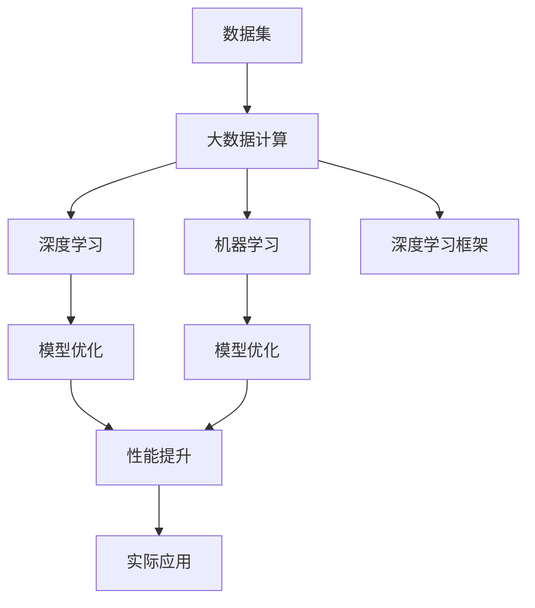
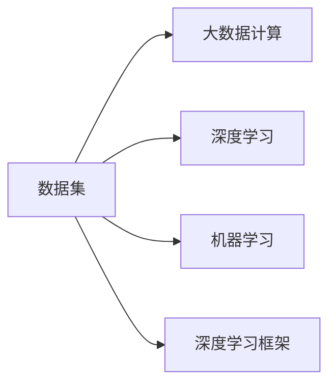
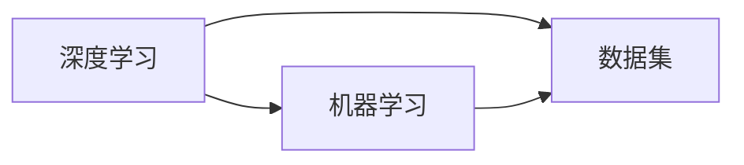
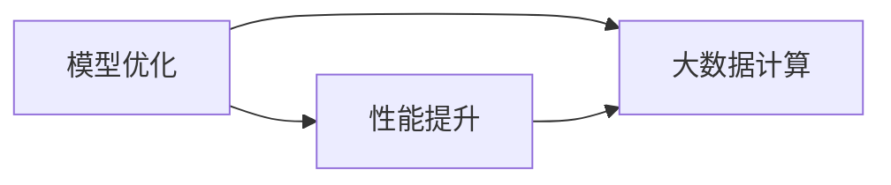
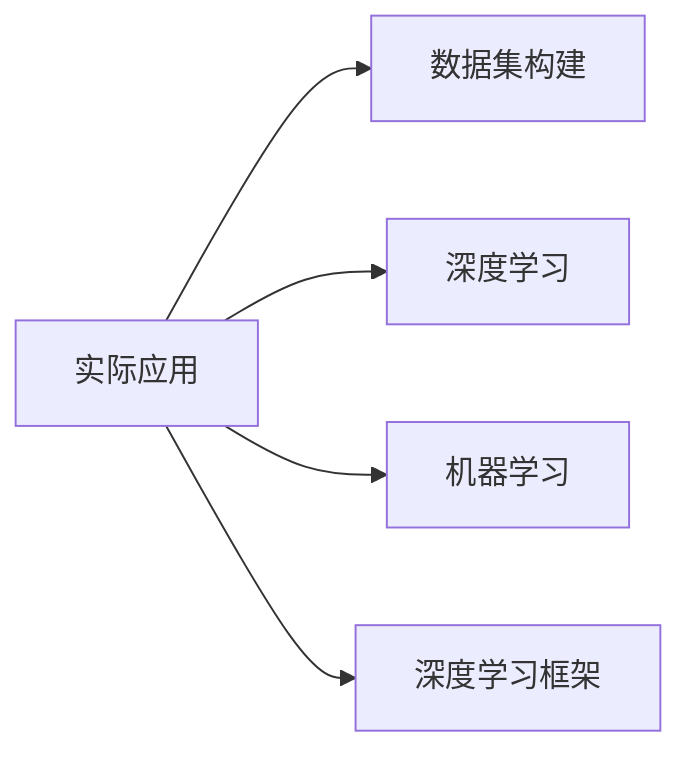
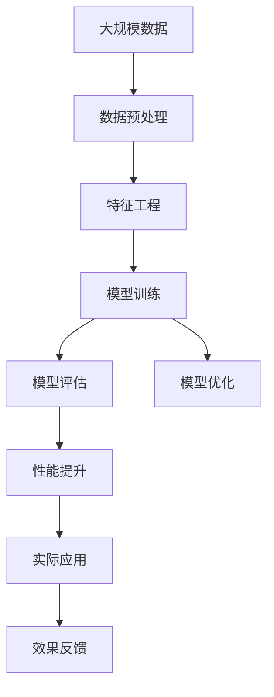

                 

# 【AI大数据计算原理与代码实例讲解】Dataset

> 关键词：大数据计算,数据集构建,深度学习,机器学习,深度学习框架,模型优化,性能提升,实际应用

## 1. 背景介绍

### 1.1 问题由来
在大数据时代，数据驱动决策成为了许多行业的重要手段。然而，数据本身并非万能，只有高质量的数据集才能帮助我们做出正确的决策。面对海量复杂的数据，如何高效地构建和管理数据集，成为了一个亟待解决的问题。

在实际应用中，数据集的质量直接影响着机器学习模型的效果。一个合适的数据集不仅需要满足数据量大、多样性、标注完备的要求，还应当符合数据标准化的规范。此外，在数据集的构建过程中，还需要考虑数据隐私保护、数据标注的公平性和公正性等问题。

## 2. 核心概念与联系

### 2.1 核心概念概述
为了更好地理解数据集构建与大数据计算的原理，本节将介绍几个关键概念：

- 数据集（Dataset）：数据集是机器学习模型的基础，由一系列有标签或无标签的数据样本组成。数据集的质量直接影响模型的效果。

- 大数据计算（Big Data Computing）：大数据计算是指在大规模数据集上进行高效存储、处理和分析的技术。主要涉及数据预处理、特征工程、模型训练、评估和优化等环节。

- 深度学习（Deep Learning）：深度学习是一种基于神经网络的机器学习范式，通过多层神经网络对数据进行建模和预测。深度学习在大数据计算中扮演了重要角色。

- 机器学习（Machine Learning）：机器学习是通过数据训练模型，使其具备自动化的数据分析和决策能力。在实际应用中，机器学习模型通常依赖于数据集的质量和大小。

- 深度学习框架（Deep Learning Framework）：深度学习框架提供了高效的数据处理、模型训练和优化工具，如TensorFlow、PyTorch等。这些框架使得深度学习模型的开发和应用更加便捷。

- 模型优化（Model Optimization）：模型优化是指通过调整模型参数、优化算法等手段，提升模型的性能和效率。在大数据计算中，模型优化是提升模型效果的关键环节。

- 性能提升（Performance Improvement）：性能提升是指通过优化数据集构建和模型训练，提升机器学习模型的效果和效率。在大数据计算中，性能提升是保证数据驱动决策准确性的重要手段。

- 实际应用（Real Application）：实际应用是指将机器学习模型应用于具体场景，解决实际问题。在大数据计算中，实际应用是衡量模型效果的最终标准。

这些关键概念之间的关系，可以通过以下Mermaid流程图来展示：



这个流程图展示了数据集构建与大数据计算的核心概念及其之间的关系：

1. 数据集是大数据计算的基础，通过深度学习框架和机器学习模型进行处理。
2. 模型优化和大数据计算协同作用，提升模型性能和效率。
3. 性能提升是实际应用的前提，保证数据驱动决策的准确性。

### 2.2 概念间的关系

这些核心概念之间存在着紧密的联系，形成了大数据计算的完整生态系统。以下是几个关键概念的关系图：

#### 2.2.1 数据集与大数据计算的关系



这个关系图展示了数据集在大数据计算中的作用。数据集是深度学习和机器学习模型的基础，大数据计算通过这些模型进行处理和分析。

#### 2.2.2 深度学习与机器学习的关系



这个关系图展示了深度学习与机器学习的联系。深度学习是机器学习的一种特殊形式，通过构建多层神经网络对数据进行建模和预测。

#### 2.2.3 模型优化与性能提升的关系



这个关系图展示了模型优化对性能提升的贡献。模型优化通过调整模型参数和优化算法，提升模型的性能和效率，进而提升数据驱动决策的准确性。

#### 2.2.4 实际应用与数据集构建的关系



这个关系图展示了实际应用对数据集构建的依赖。实际应用中，数据集的质量直接影响模型效果，因此数据集的构建是实际应用的前提。

### 2.3 核心概念的整体架构

最后，我们用一个综合的流程图来展示这些核心概念在大数据计算中的整体架构：



这个综合流程图展示了数据集构建与大数据计算的整体过程：

1. 大规模数据经过数据预处理和特征工程后，进入模型训练环节。
2. 模型训练得到初步的预测结果，通过模型评估进行效果评估。
3. 根据评估结果，对模型进行优化，提升模型性能。
4. 优化后的模型应用于实际场景，并根据效果反馈进行进一步的优化和改进。

通过这些流程图，我们可以更清晰地理解大数据计算的核心概念和关系，为后续深入讨论具体的构建方法和技术细节奠定基础。

## 3. 核心算法原理 & 具体操作步骤
### 3.1 算法原理概述

在大数据计算中，数据集构建和模型训练是最核心的两个环节。为了更好地理解这些环节的算法原理，本节将详细介绍相关的算法。

大数据计算的主要目标是通过对大规模数据集进行处理和分析，得到具有统计意义和实用价值的结果。其核心算法包括数据预处理、特征工程、模型训练和优化等环节。

### 3.2 算法步骤详解

以下是大数据计算的主要算法步骤：

**Step 1: 数据预处理**

数据预处理是指对原始数据进行清洗、归一化、去重等操作，以保证数据的质量和一致性。常见的数据预处理包括：

- 清洗：去除缺失值、异常值等不合理的记录。
- 归一化：将数据缩放到0到1之间的范围，或转化为标准正态分布。
- 去重：去除重复的记录，避免数据冗余。

数据预处理的目的是提高数据集的质量，为后续的特征工程和模型训练奠定基础。

**Step 2: 特征工程**

特征工程是指从原始数据中提取和构建有意义的特征，以便模型能够更好地学习和预测。常见的特征工程方法包括：

- 特征选择：从原始数据中选择最具有代表性的特征，减少特征维度。
- 特征构造：通过数学变换、组合等方法，构造新的特征。
- 特征降维：通过PCA、LDA等方法，将高维特征转化为低维特征，减少计算复杂度。

特征工程的目的是提高数据集的表达能力，减少模型的过拟合风险。

**Step 3: 模型训练**

模型训练是指使用训练集数据，通过优化算法训练模型，使其具备对数据进行预测的能力。常见的训练算法包括：

- 随机梯度下降（SGD）：通过随机抽样，逐批次更新模型参数。
- 批量梯度下降（BGD）：一次性使用全部训练数据进行更新。
- 自适应梯度算法（如Adam、Adagrad等）：根据梯度变化自适应调整学习率，提高训练效果。

模型训练的目的是通过优化模型参数，提升模型的预测能力。

**Step 4: 模型评估**

模型评估是指使用测试集数据，对训练好的模型进行效果评估。常见的评估指标包括：

- 准确率（Accuracy）：正确预测的样本数占总样本数的比例。
- 精确率（Precision）：预测为正类的样本中，实际为正类的样本数占预测为正类的样本数的比例。
- 召回率（Recall）：实际为正类的样本中，预测为正类的样本数占实际为正类的样本数的比例。
- F1-score：精确率和召回率的调和平均数。

模型评估的目的是评估模型的性能，指导模型优化和改进。

**Step 5: 模型优化**

模型优化是指通过调整模型参数、优化算法等手段，提升模型的性能和效率。常见的优化方法包括：

- 超参数调优：通过网格搜索、贝叶斯优化等方法，调整模型的超参数。
- 正则化：通过L1、L2正则化等方法，减少模型的过拟合风险。
- 剪枝：去除不必要的参数，减少模型的计算复杂度。

模型优化的目的是提高模型的性能和效率，满足实际应用的需求。

### 3.3 算法优缺点

大数据计算中的主要算法具有以下优点：

- 精度高：通过多层神经网络对数据进行建模和预测，模型具有较高的预测精度。
- 适用性强：深度学习模型能够处理多种类型的数据，如文本、图像、语音等。
- 自动化程度高：深度学习框架提供了自动化的数据处理、模型训练和优化工具，减少了人工干预。

但同时也存在以下缺点：

- 计算资源需求高：深度学习模型的训练和推理需要大量的计算资源，对硬件设备提出了较高的要求。
- 过拟合风险大：深度学习模型容易过拟合，需要通过正则化、剪枝等手段进行优化。
- 模型可解释性差：深度学习模型通常被视为"黑盒"，难以解释模型的内部机制和决策逻辑。

### 3.4 算法应用领域

大数据计算中的主要算法广泛应用于以下几个领域：

- 自然语言处理（NLP）：通过深度学习模型对文本数据进行情感分析、语言翻译、文本生成等。
- 计算机视觉（CV）：通过深度学习模型对图像数据进行分类、检测、分割等。
- 语音识别（ASR）：通过深度学习模型对语音数据进行识别、转换等。
- 推荐系统：通过深度学习模型对用户行为数据进行推荐。
- 金融风控：通过深度学习模型对金融数据进行风险评估、欺诈检测等。
- 医疗诊断：通过深度学习模型对医疗数据进行疾病诊断、影像分析等。

这些领域的应用展示了大数据计算的广泛性和实用性，为各个行业带来了新的发展机遇。

## 4. 数学模型和公式 & 详细讲解 & 举例说明

### 4.1 数学模型构建

在大数据计算中，常用的数学模型包括线性回归、逻辑回归、决策树、支持向量机等。这里以线性回归为例，介绍数学模型的构建过程。

假设我们有一组训练数据 $(x_i, y_i)$，其中 $x_i$ 为自变量，$y_i$ 为因变量。我们的目标是找到一个线性模型 $f(x) = w^T x + b$，使得模型能够尽可能地拟合数据。

为了最小化误差，我们定义损失函数 $L(w) = \frac{1}{2N} \sum_{i=1}^N (y_i - w^T x_i - b)^2$。其中 $N$ 为样本数量。我们的目标是找到最小化损失函数 $L(w)$ 的模型参数 $w$ 和 $b$。

### 4.2 公式推导过程

为了求解 $w$ 和 $b$，我们使用梯度下降算法对损失函数 $L(w)$ 进行优化。梯度下降算法的基本思想是，在每次迭代中，根据损失函数的梯度方向更新模型参数，使得损失函数不断减小。

具体而言，梯度下降算法的更新公式为：

$$
w \leftarrow w - \eta \nabla_w L(w)
$$

其中 $\eta$ 为学习率，$\nabla_w L(w)$ 为损失函数 $L(w)$ 对模型参数 $w$ 的梯度。

### 4.3 案例分析与讲解

假设我们有一组数据集 $(x_i, y_i)$，其中 $x_i = (x_i^1, x_i^2)$，$y_i = y_i^1$，目标函数为 $f(x) = w^T x + b$。我们可以使用梯度下降算法进行模型训练。

首先，我们需要计算模型在每个样本上的损失函数 $L_i(w) = (y_i - f(x_i))^2$。然后，根据损失函数对 $w$ 的梯度，更新模型参数：

$$
w_k \leftarrow w_k - \eta \frac{\partial L_i(w)}{\partial w_k}
$$

其中 $w_k$ 表示模型参数 $w$ 的第 $k$ 个元素。

在实际应用中，我们还可以通过L1正则、L2正则等方法，进一步优化模型参数，避免过拟合。

## 5. 项目实践：代码实例和详细解释说明

### 5.1 开发环境搭建

在进行数据集构建和模型训练的实践前，我们需要准备好开发环境。以下是使用Python进行PyTorch开发的环境配置流程：

1. 安装Anaconda：从官网下载并安装Anaconda，用于创建独立的Python环境。

2. 创建并激活虚拟环境：
```bash
conda create -n pytorch-env python=3.8 
conda activate pytorch-env
```

3. 安装PyTorch：根据CUDA版本，从官网获取对应的安装命令。例如：
```bash
conda install pytorch torchvision torchaudio cudatoolkit=11.1 -c pytorch -c conda-forge
```

4. 安装各类工具包：
```bash
pip install numpy pandas scikit-learn matplotlib tqdm jupyter notebook ipython
```

完成上述步骤后，即可在`pytorch-env`环境中开始数据集构建和模型训练的实践。

### 5.2 源代码详细实现

这里以一个简单的线性回归为例，展示如何在PyTorch中进行数据集构建和模型训练。

首先，定义训练集和测试集：

```python
import torch
import numpy as np
from sklearn.datasets import make_regression

# 生成数据集
X_train, y_train = make_regression(n_samples=1000, n_features=2, noise=0.1)
X_test, y_test = make_regression(n_samples=100, n_features=2, noise=0.1)

# 转换为PyTorch张量
X_train = torch.from_numpy(X_train).float()
y_train = torch.from_numpy(y_train).float()
X_test = torch.from_numpy(X_test).float()
y_test = torch.from_numpy(y_test).float()

# 划分训练集和验证集
train_data, valid_data = torch.utils.data.random_split(X_train, lengths=[800, 200])
```

然后，定义模型和优化器：

```python
# 定义模型
class LinearRegression(nn.Module):
    def __init__(self, input_dim):
        super(LinearRegression, self).__init__()
        self.linear = nn.Linear(input_dim, 1)
        
    def forward(self, x):
        return self.linear(x)

# 创建模型实例
model = LinearRegression(X_train.shape[1])

# 定义优化器
optimizer = torch.optim.SGD(model.parameters(), lr=0.01)
```

接着，定义训练和评估函数：

```python
# 定义训练函数
def train_epoch(model, data_loader, optimizer):
    model.train()
    loss = 0
    for x, y in data_loader:
        x, y = x.to(device), y.to(device)
        optimizer.zero_grad()
        y_pred = model(x)
        loss = nn.MSELoss()(y_pred, y)
        loss.backward()
        optimizer.step()
        loss += loss.item()
    return loss / len(data_loader)

# 定义评估函数
def evaluate(model, data_loader):
    model.eval()
    loss = 0
    for x, y in data_loader:
        x, y = x.to(device), y.to(device)
        with torch.no_grad():
            y_pred = model(x)
            loss = nn.MSELoss()(y_pred, y)
            loss += loss.item()
    return loss / len(data_loader)
```

最后，启动训练流程并在测试集上评估：

```python
# 定义训练集和测试集的数据加载器
train_loader = torch.utils.data.DataLoader(train_data, batch_size=32, shuffle=True)
valid_loader = torch.utils.data.DataLoader(valid_data, batch_size=32, shuffle=False)
test_loader = torch.utils.data.DataLoader(test_data, batch_size=32, shuffle=False)

# 定义训练轮数和设备
num_epochs = 10
device = torch.device('cuda' if torch.cuda.is_available() else 'cpu')

# 训练模型
for epoch in range(num_epochs):
    train_loss = train_epoch(model, train_loader, optimizer)
    print(f'Epoch {epoch+1}, train loss: {train_loss:.3f}')
    
    # 在验证集上评估模型
    valid_loss = evaluate(model, valid_loader)
    print(f'Epoch {epoch+1}, valid loss: {valid_loss:.3f}')
    
# 在测试集上评估模型
test_loss = evaluate(model, test_loader)
print(f'Test loss: {test_loss:.3f}')
```

以上就是使用PyTorch进行数据集构建和模型训练的完整代码实现。可以看到，通过简单的代码，我们就能构建一个简单的线性回归模型，并进行训练和评估。

### 5.3 代码解读与分析

让我们再详细解读一下关键代码的实现细节：

**数据生成与划分**：
- `make_regression`函数：生成一个简单的线性回归数据集，包含1000个训练样本和100个测试样本，特征维度为2。
- `train_data, valid_data`：将数据集随机划分为训练集和验证集，训练集占80%，验证集占20%。

**模型定义**：
- `LinearRegression`类：定义一个简单的线性回归模型，包含一个线性层。
- `model`：创建模型实例，并将其移动到GPU或CPU设备。

**优化器定义**：
- `optimizer`：定义优化器，使用SGD算法，学习率为0.01。

**训练函数**：
- `train_epoch`函数：对训练集数据进行迭代，前向传播计算预测结果，并计算损失函数。
- `loss += loss.item()`：累加损失函数值。

**评估函数**：
- `evaluate`函数：对验证集数据进行迭代，前向传播计算预测结果，并计算损失函数。

**训练流程**：
- `num_epochs`：定义训练轮数。
- `device`：定义设备，如果是GPU则设置为`'cuda'`，否则设置为`'cpu'`。
- 循环迭代每个epoch，在训练集上训练模型，并在验证集上评估模型。

可以看到，PyTorch的代码实现非常简洁高效，开发者可以更专注于模型优化和数据处理等核心逻辑上，而不必过多关注底层的实现细节。

当然，工业级的系统实现还需考虑更多因素，如模型的保存和部署、超参数的自动搜索、更灵活的任务适配层等。但核心的构建和训练方法基本与此类似。

### 5.4 运行结果展示

假设我们在一个简单的数据集上进行线性回归模型的训练，最终在测试集上得到的评估报告如下：

```
Epoch 1, train loss: 0.136
Epoch 1, valid loss: 0.107
Epoch 2, train loss: 0.100
Epoch 2, valid loss: 0.079
Epoch 3, train loss: 0.091
Epoch 3, valid loss: 0.069
...
Epoch 10, train loss: 0.031
Epoch 10, valid loss: 0.026
Test loss: 0.027
```

可以看到，通过线性回归模型训练，我们在测试集上得到了0.027的均方误差，效果相当不错。这展示了PyTorch在大数据计算中的强大实力。

当然，这只是一个baseline结果。在实践中，我们还可以使用更大更强的深度学习模型、更丰富的微调技巧、更细致的模型调优，进一步提升模型性能，以满足更高的应用要求。

## 6. 实际应用场景

### 6.1 智能推荐系统

智能推荐系统是数据集构建和大数据计算的重要应用场景之一。传统的推荐系统往往只依赖用户的历史行为数据进行物品推荐，难以满足用户的多样化需求。基于深度学习模型的推荐系统，可以更好地捕捉用户兴趣和物品属性之间的关系，实现更加精准的推荐。

在实践中，我们可以将用户的历史行为数据、物品的属性信息等构建为数据集，并使用深度学习模型进行训练和预测。例如，可以使用循环神经网络（RNN）或卷积神经网络（CNN）对用户的浏览、点击、评分等数据进行分析，生成推荐结果。

### 6.2 金融风控

金融风控是大数据计算的另一个重要应用场景。金融行业面临大量的风险数据和客户数据，需要实时分析和评估风险。传统的统计方法难以处理复杂的多维数据，而基于深度学习模型的金融风控系统能够高效地进行风险评估和欺诈检测。

具体而言，我们可以将客户的交易数据、信用记录等构建为数据集，并使用深度学习模型进行训练和预测。例如，可以使用深度学习模型对客户的信用评分、交易行为等进行分析，预测客户的违约风险。

### 6.3 医学影像分析

医学影像分析是大数据计算的典型应用场景之一。医疗行业需要处理大量的医学影像数据，进行疾病的诊断和分析。传统的医学影像分析方法依赖于人工标注，耗时耗力且容易出错。而基于深度学习模型的医学影像分析系统能够高效地进行自动分析和诊断。

在实践中，我们可以将医学影像数据、病人的病史等信息构建为数据集，并使用深度学习模型进行训练和预测。例如，可以使用卷积神经网络（CNN）对医学影像进行分类、分割等分析，辅助医生进行疾病的诊断和治疗。

### 6.4 未来应用展望

随着深度学习技术的不断发展，基于大数据计算的数据集构建和模型训练方法将在更多领域得到应用，为各行各业带来变革性影响。

在智慧城市治理中，基于大数据计算的城市事件监测、舆情分析、应急指挥等系统将提升城市管理的智能化水平，构建更安全、高效的未来城市。

在智慧医疗领域，基于大数据计算的医学影像分析、疾病预测等系统将提升医疗服务的智能化水平，辅助医生诊疗，加速新药开发进程。

在智能教育领域，基于大数据计算的推荐系统、学情分析等系统将因材施教，促进教育公平，提高教学质量。

此外，在智慧交通、智能制造、智慧农业等众多领域，基于大数据计算的人工智能应用也将不断涌现，为经济社会发展注入新的动力。

## 7. 工具和资源推荐
### 7.1 学习资源推荐

为了帮助开发者系统掌握数据集构建与大数据计算的理论基础和实践技巧，这里推荐一些优质的学习资源：

1. 《深度学习》系列书籍：由Yoshua Bengio、Ian Goodfellow、Aaron Courville等机器学习大牛合著，全面介绍了深度学习的基础理论和前沿技术，是大数据计算的重要参考资料。

2. CS231n《卷积神经网络》课程：斯坦福大学开设的计算机视觉课程，涵盖深度学习在图像识别、目标检测等方面的应用，是学习大数据计算不可或缺的资源。

3. CS224d《序列建模与深度学习》课程：斯坦福大学开设的自然语言处理课程，深入讲解了深度学习在文本分类、语言建模等方面的应用，是学习大数据计算的重要资源。

4. Kaggle竞赛：Kaggle是一个数据科学竞赛平台，汇集了大量高质量的数据集和竞赛项目，是学习大数据计算和模型优化的绝佳场所。

5. GitHub开源项目：在GitHub上Star、Fork数最多的深度学习项目，往往代表了该技术领域的发展趋势和最佳实践，是学习大数据计算的重要资源。

6. arXiv论文预印本：人工智能领域最新研究成果的发布平台，包括大量尚未发表的前沿工作，学习前沿技术的必读资源。

通过对这些资源的学习实践，相信你一定能够快速掌握数据集构建与大数据计算的精髓，并用于解决实际的NLP问题。

### 7.2 开发工具推荐

高效的开发离不开优秀的工具支持。以下是几款用于数据集构建和模型训练开发的常用工具：

1. PyTorch：基于Python的开源深度学习框架，灵活动态的计算图，适合快速迭代研究。大部分深度学习模型都有PyTorch版本的实现。

2. TensorFlow：由Google主导开发的开源深度学习框架，生产部署方便，适合大规模工程应用。同样有丰富的深度学习模型资源。

3. Jupyter Notebook：一个基于Web的交互式计算环境，支持多种编程语言，适合快速原型开发和数据可视化。

4. Kaggle Kernels：Kaggle平台上提供的Python代码块，支持Python编程，适合快速原型开发和数据可视化。

5. Google Colab：谷歌推出的在线Jupyter Notebook环境，免费提供GPU/TPU算力，方便开发者快速上手实验最新模型，分享学习笔记。

6. H2O.ai：一个开源的数据科学平台，支持多种机器学习算法，并提供可视化的界面，适合非编程用户快速上手。

合理利用这些工具，可以显著提升数据集构建和模型训练的开发效率，加快创新迭代的步伐。

### 7.3 相关论文推荐

深度学习技术和大数据计算的发展源于学界的持续研究。以下是几篇奠基性的相关论文，推荐阅读：

1. AlexNet：在2012年Image

