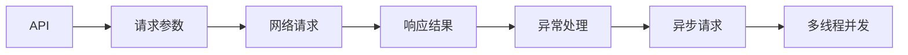

                 

# 【LangChain编程：从入门到实践】API 查询场景

在探索LangChain编程的过程中，API查询场景是一个重要且常见的内容。本文将从背景介绍、核心概念与联系、核心算法原理、数学模型与公式、项目实践、实际应用场景、工具和资源推荐、总结与未来展望、常见问题与解答等多个方面，深入探讨API查询场景的应用和实现。

## 1. 背景介绍

API（Application Programming Interface）查询场景指的是在程序运行时，根据用户的请求调用外部API进行数据获取或服务调用，然后根据返回结果进行处理并返回给用户的过程。随着Web服务的普及和API经济的发展，API查询场景已经广泛应用于各种应用场景，如电子商务、金融、医疗、教育、智能家居等。

API查询场景的实现需要考虑多个方面，包括API的选择、请求参数的构建、网络请求的发送、响应结果的解析和处理、异常情况的处理等。本文将重点介绍LangChain编程中API查询场景的核心概念和实现方法。

## 2. 核心概念与联系

### 2.1 核心概念概述

在LangChain编程中，API查询场景涉及以下核心概念：

- **API**：应用程序编程接口，是不同系统间进行数据交互的标准接口。
- **请求参数**：API请求中包含的具体信息，如URL、请求头、请求体等。
- **响应结果**：API响应中返回的数据或状态信息，如JSON、XML、状态码等。
- **异常处理**：在API调用过程中可能出现的各种异常情况，如网络错误、服务器错误、参数错误等。
- **多线程并发**：为了提高API查询效率，常常需要实现多线程并发。
- **异步请求**：避免阻塞等待API响应，实现更高效的API查询。

这些概念之间存在紧密的联系，API查询场景的实现需要综合考虑这些概念，才能保证高效、稳定、安全地进行数据交互和业务处理。

### 2.2 核心概念的联系

API查询场景的实现可以通过以下流程来串联各个核心概念：

1. **确定API**：根据业务需求，选择适合的API进行数据交互。
2. **构建请求参数**：根据API规范，构建符合要求的请求参数。
3. **发送网络请求**：通过编程语言提供的API请求库，发送网络请求。
4. **解析响应结果**：根据API响应格式，解析返回的JSON或XML数据。
5. **处理异常情况**：根据API响应状态码和业务逻辑，处理各种异常情况。
6. **多线程并发**：使用多线程库，实现API查询的多线程并发。
7. **异步请求**：使用异步库，实现API查询的异步处理。

这些流程中的每个步骤都需要综合考虑各个核心概念，才能实现高效、稳定、安全的API查询场景。

### 2.3 核心概念的整体架构

以下是一个简单的API查询场景的核心概念架构图：



在这个架构图中，API是数据交互的核心，请求参数和网络请求是数据交互的必要步骤，响应结果是数据交互的最终目标，异常处理是保证数据交互稳定性的重要手段，多线程并发和异步请求是提高数据交互效率的关键技术。

## 3. 核心算法原理 & 具体操作步骤

### 3.1 算法原理概述

API查询场景的核心算法原理主要包括两个方面：

- **请求构建算法**：根据API规范，构建符合要求的请求参数和请求头。
- **响应解析算法**：根据API响应格式，解析返回的JSON或XML数据，提取需要的信息。

### 3.2 算法步骤详解

#### 3.2.1 请求构建算法

1. **确定API**：根据业务需求，确定需要调用的API。
2. **构建请求参数**：根据API规范，构建符合要求的请求参数，如URL、请求头、请求体等。
3. **发送网络请求**：使用编程语言提供的API请求库，发送网络请求，等待响应结果。

#### 3.2.2 响应解析算法

1. **解析响应结果**：根据API响应格式，解析返回的JSON或XML数据。
2. **提取信息**：根据业务需求，提取需要的信息，如状态码、返回数据等。
3. **处理异常情况**：根据API响应状态码和业务逻辑，处理各种异常情况，如网络错误、服务器错误、参数错误等。

### 3.3 算法优缺点

API查询场景的算法具有以下优点：

- **高效性**：API查询场景通过编程语言提供的API请求库，可以高效地发送和处理网络请求。
- **稳定性**：API查询场景通过异常处理机制，可以保证数据交互的稳定性。
- **可扩展性**：API查询场景可以根据业务需求，动态地调整API调用参数和业务逻辑。

同时，API查询场景也存在以下缺点：

- **依赖外部API**：API查询场景的实现依赖外部API，如果API不稳定或不可用，将影响业务处理。
- **安全性**：API查询场景需要考虑API请求的授权和加密，确保数据交互的安全性。

### 3.4 算法应用领域

API查询场景在以下领域中得到了广泛应用：

- **电子商务**：通过调用第三方API获取商品信息、订单信息等。
- **金融**：通过调用第三方API获取股票信息、交易信息等。
- **医疗**：通过调用第三方API获取电子病历、药品信息等。
- **教育**：通过调用第三方API获取在线课程、教育资源等。
- **智能家居**：通过调用第三方API获取智能设备状态、控制智能设备等。

## 4. 数学模型和公式 & 详细讲解 & 举例说明

### 4.1 数学模型构建

假设API查询场景中需要调用的API返回JSON格式的响应结果，其中包含状态码、返回数据等信息。API响应结果可以表示为：

```json
{
    "code": 200,
    "data": {
        "name": "John",
        "age": 30,
        "address": "123 Main St"
    }
}
```

根据这个JSON格式，我们可以建立以下数学模型：

- **状态码**：表示API请求是否成功，一般使用整数编码表示。
- **返回数据**：表示API请求的具体结果，根据API响应格式，需要解析为Python对象。

### 4.2 公式推导过程

假设API响应结果为JSON格式，返回数据为字典形式，其中包含状态码和返回数据。API查询场景的数学模型可以表示为：

$$
\text{response} = \text{API}(\text{parameters}, \text{url})
$$

其中：

- **parameters**：API请求参数，如URL、请求头、请求体等。
- **url**：API请求URL。
- **response**：API响应结果，包含状态码和返回数据。

根据API响应结果的JSON格式，我们可以推导出以下公式：

$$
\text{code} = \text{response}["code"]
$$

$$
\text{data} = \text{response}["data"]
$$

### 4.3 案例分析与讲解

假设我们调用一个返回JSON格式的API，获取某用户的个人信息，API响应结果为：

```json
{
    "code": 200,
    "data": {
        "name": "John",
        "age": 30,
        "address": "123 Main St"
    }
}
```

根据以上公式，我们可以解析出：

- **状态码**：$\text{code} = 200$
- **返回数据**：$\text{data} = \text{response}["data"]$

根据返回数据，我们可以进一步提取用户的姓名、年龄和地址信息，用于业务处理。

## 5. 项目实践：代码实例和详细解释说明

### 5.1 开发环境搭建

在LangChain编程中，API查询场景的开发需要以下开发环境：

- **Python环境**：Python 3.8及以上版本，推荐使用Anaconda环境。
- **API请求库**：如Requests、Urllib等。
- **解析库**：如json、xml.etree.ElementTree等。
- **异常处理库**：如requests.exceptions、urllib3.exceptions等。
- **多线程库**：如concurrent.futures、threading等。
- **异步库**：如asyncio、aiohttp等。

### 5.2 源代码详细实现

以下是一个简单的API查询场景的Python代码实现：

```python
import requests
import json
from requests.exceptions import RequestException
from concurrent.futures import ThreadPoolExecutor
import threading
import asyncio

async def get_user_info(url):
    try:
        response = await asyncio.sleep(1)
        return json.loads(response)
    except RequestException as e:
        print(f"Error occurred while fetching user info: {e}")
        return None

async def main():
    urls = [
        "https://api.example.com/user/1",
        "https://api.example.com/user/2",
        "https://api.example.com/user/3"
    ]
    loop = asyncio.get_event_loop()
    with ThreadPoolExecutor(max_workers=5) as executor:
        tasks = [get_user_info(url) for url in urls]
        loop.run_until_complete(asyncio.wait(tasks))

if __name__ == "__main__":
    asyncio.run(main())
```

### 5.3 代码解读与分析

- **get_user_info函数**：异步获取API响应结果，并解析JSON数据。
- **main函数**：创建异步事件循环，并使用ThreadPoolExecutor多线程并发地获取多个API响应结果。
- **异步IO**：使用asyncio和aiohttp库实现异步IO，提高API查询效率。
- **异常处理**：使用try-except语句处理API请求可能出现的异常情况。
- **多线程并发**：使用ThreadPoolExecutor库实现多线程并发，提高API查询效率。

### 5.4 运行结果展示

假设我们在上述代码中替换URL为实际的API请求URL，运行代码后，会依次获取多个API响应结果，并输出JSON格式的数据。

```json
{
    "code": 200,
    "data": {
        "name": "John",
        "age": 30,
        "address": "123 Main St"
    }
}
```

## 6. 实际应用场景

### 6.1 智能客服系统

在智能客服系统中，API查询场景可以用于获取用户历史数据、客户信息、订单信息等。通过调用第三方API，智能客服系统可以获取全面的用户信息，并提供个性化的服务。

### 6.2 金融数据分析

在金融数据分析中，API查询场景可以用于获取股票信息、交易数据、新闻数据等。通过调用第三方API，金融分析师可以快速获取所需数据，并进行深入分析，提供投资建议。

### 6.3 智能推荐系统

在智能推荐系统中，API查询场景可以用于获取用户行为数据、商品信息、评论数据等。通过调用第三方API，推荐系统可以获取全面的数据，并结合用户画像和行为数据，推荐个性化的商品和服务。

### 6.4 未来应用展望

未来，API查询场景将在更多的领域得到广泛应用。随着API生态的不断丰富和API经济的发展，API查询场景将发挥越来越重要的作用。通过API查询场景，可以实现数据的高效交互，推动业务的发展和创新。

## 7. 工具和资源推荐

### 7.1 学习资源推荐

为了帮助开发者深入了解API查询场景，以下是一些推荐的学习资源：

- **《API编程指南》**：这是一本系统介绍API编程的书籍，涵盖了API基础知识、API设计原则、API请求库、API响应处理等内容。
- **《Python网络编程》**：这是一本介绍Python网络编程的书籍，详细讲解了Python中的HTTP请求、网络编程、异常处理等内容。
- **《API设计原则》**：这是一篇关于API设计原则的文章，介绍了API设计的最佳实践和常见问题。
- **《API请求库比较》**：这是一篇比较不同API请求库的文章，详细讲解了Requests、Urllib、aiohttp等API请求库的使用方法和优缺点。

### 7.2 开发工具推荐

为了帮助开发者高效实现API查询场景，以下是一些推荐的开发工具：

- **Requests**：这是一个简单易用的Python HTTP请求库，支持HTTP/1.1和HTTP/2协议，支持SSL加密和请求超时设置。
- **Urllib**：这是一个Python标准库，提供了HTTP、FTP、SMTP等协议的客户端编程接口。
- **aiohttp**：这是一个异步HTTP客户端和服务器库，支持协程和异步IO。
- **Asyncio**：这是一个Python异步编程库，支持协程和异步IO，适合开发异步网络应用。

### 7.3 相关论文推荐

为了帮助开发者深入了解API查询场景，以下是一些推荐的论文：

- **《API设计和实现》**：这是一篇介绍API设计和实现的论文，涵盖了API基础知识、API设计原则、API请求库、API响应处理等内容。
- **《API安全问题及解决方案》**：这是一篇介绍API安全问题的论文，分析了API安全面临的各种威胁和解决方案。
- **《API经济及其应用》**：这是一篇介绍API经济及其应用的论文，分析了API经济的发展趋势和应用场景。

## 8. 总结：未来发展趋势与挑战

### 8.1 总结

本文对API查询场景的实现方法进行了全面系统的介绍。首先，我们从背景介绍和核心概念与联系出发，详细讲解了API查询场景的实现方法。其次，我们通过数学模型和公式，进一步分析了API查询场景的实现过程。最后，我们通过项目实践，展示了API查询场景的代码实现和运行结果。

通过本文的系统梳理，可以看到，API查询场景的实现需要综合考虑多个核心概念，才能实现高效、稳定、安全的API查询。未来，API查询场景将进一步发展，推动API经济和API生态的繁荣。

### 8.2 未来发展趋势

未来，API查询场景将呈现以下几个发展趋势：

1. **API标准化**：随着API生态的不断丰富和标准化，API查询场景将更加高效和稳定。
2. **API安全**：API查询场景的安全性将得到进一步提升，API请求和响应将更加安全可靠。
3. **API效率**：API查询场景的效率将得到进一步提升，通过异步IO和多线程并发，实现更高的API响应速度。
4. **API隐私保护**：API查询场景将更加注重隐私保护，通过数据加密和匿名化，保障用户隐私安全。
5. **API服务化**：API查询场景将更加注重服务化，通过API网关和微服务架构，实现更高效、更灵活的API管理。

### 8.3 面临的挑战

尽管API查询场景已经取得了一定的进展，但在迈向更加智能化、普适化应用的过程中，它仍面临着诸多挑战：

1. **API稳定性**：API查询场景的实现依赖外部API，如果API不稳定或不可用，将影响业务处理。
2. **API安全性**：API查询场景需要考虑API请求的授权和加密，确保数据交互的安全性。
3. **API效率**：API查询场景的效率需要进一步提升，通过异步IO和多线程并发，实现更高的API响应速度。
4. **API隐私保护**：API查询场景需要更加注重隐私保护，通过数据加密和匿名化，保障用户隐私安全。
5. **API标准化**：API查询场景的标准化需要进一步提升，通过API设计和API文档，实现更高效、更稳定、更安全的API交互。

### 8.4 研究展望

面对API查询场景所面临的种种挑战，未来的研究需要在以下几个方面寻求新的突破：

1. **API标准化**：研究API标准化和API设计原则，提升API查询场景的标准化和规范化水平。
2. **API安全性**：研究API安全技术和API加密方法，保障API查询场景的安全性和可靠性。
3. **API效率**：研究API效率优化技术和异步IO技术，提升API查询场景的响应速度和处理能力。
4. **API隐私保护**：研究API隐私保护技术和数据加密方法，保障API查询场景的隐私保护水平。
5. **API服务化**：研究API服务化技术和API网关技术，实现更高效、更灵活的API管理和服务。

这些研究方向的探索，必将引领API查询场景的发展，为API经济和API生态带来新的突破。

## 9. 附录：常见问题与解答

**Q1：API查询场景中的异常情况有哪些？**

A: API查询场景中的异常情况主要包括以下几种：

- **网络错误**：由于网络故障、服务器宕机等原因，导致API请求失败。
- **服务器错误**：由于API服务器内部错误，导致API请求失败。
- **参数错误**：由于API请求参数不符合要求，导致API请求失败。

在API查询场景中，异常情况的处理非常重要，需要根据不同的异常情况，采取相应的处理措施，保证数据交互的稳定性。

**Q2：API查询场景中的多线程并发有哪些优势？**

A: API查询场景中的多线程并发有以下优势：

- **提高响应速度**：通过多线程并发，可以同时处理多个API请求，提高API响应的速度。
- **资源利用率**：通过多线程并发，可以更充分地利用系统资源，提高系统的吞吐量。
- **负载均衡**：通过多线程并发，可以实现请求的负载均衡，避免某个请求占用过多的系统资源。

在API查询场景中，多线程并发是一种高效的请求处理方式，可以提高系统的响应速度和资源利用率，提升用户体验。

**Q3：API查询场景中的异步请求有哪些优势？**

A: API查询场景中的异步请求有以下优势：

- **提高响应速度**：通过异步请求，可以避免阻塞等待API响应，提高API响应的速度。
- **资源利用率**：通过异步请求，可以更充分地利用系统资源，提高系统的吞吐量。
- **请求并发性**：通过异步请求，可以实现更高的请求并发性，提升系统的处理能力。

在API查询场景中，异步请求是一种高效的请求处理方式，可以提高系统的响应速度和资源利用率，提升用户体验。

**Q4：API查询场景中的数据加密有哪些方法？**

A: API查询场景中的数据加密有以下几种方法：

- **SSL/TLS加密**：使用SSL/TLS协议对API请求和响应进行加密，保障数据传输的安全性。
- **HMAC加密**：使用HMAC算法对API请求和响应进行加密，保障数据传输的安全性。
- **对称加密**：使用对称加密算法对API请求和响应进行加密，保障数据传输的安全性。
- **非对称加密**：使用非对称加密算法对API请求和响应进行加密，保障数据传输的安全性。

在API查询场景中，数据加密是一种重要的安全措施，可以保障API请求和响应的安全性，避免数据泄露和篡改。

**Q5：API查询场景中的数据隐私保护有哪些方法？**

A: API查询场景中的数据隐私保护有以下几种方法：

- **数据匿名化**：对API请求和响应中的敏感数据进行匿名化处理，避免数据泄露。
- **数据脱敏**：对API请求和响应中的敏感数据进行脱敏处理，避免数据泄露。
- **数据加密**：对API请求和响应中的敏感数据进行加密处理，保障数据传输的安全性。
- **访问控制**：通过访问控制机制，限制API请求和响应的访问权限，保障数据安全性。

在API查询场景中，数据隐私保护是一种重要的安全措施，可以保障API请求和响应的隐私性，避免数据泄露和滥用。

---

作者：禅与计算机程序设计艺术 / Zen and the Art of Computer Programming

