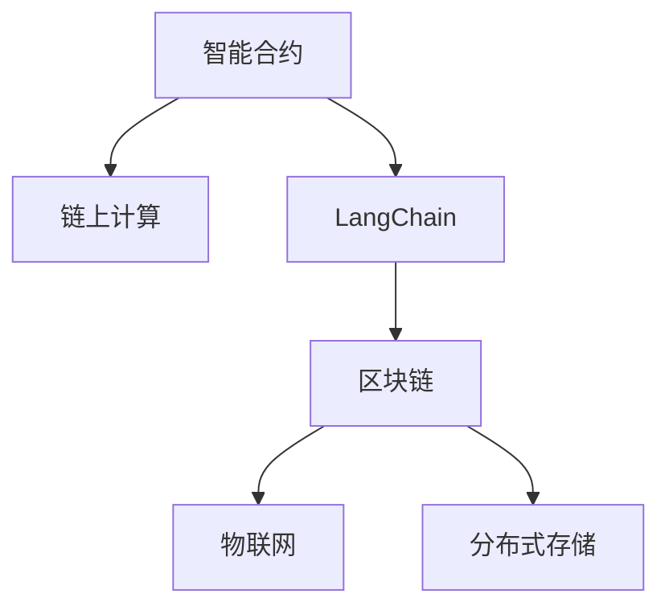
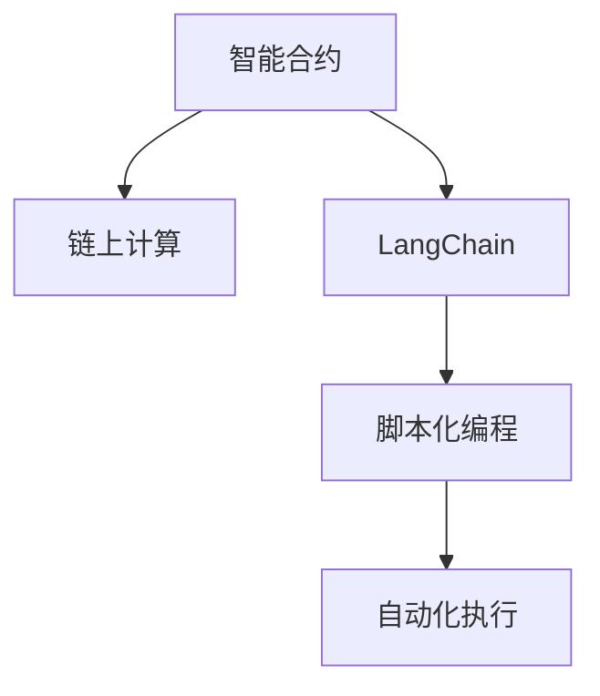
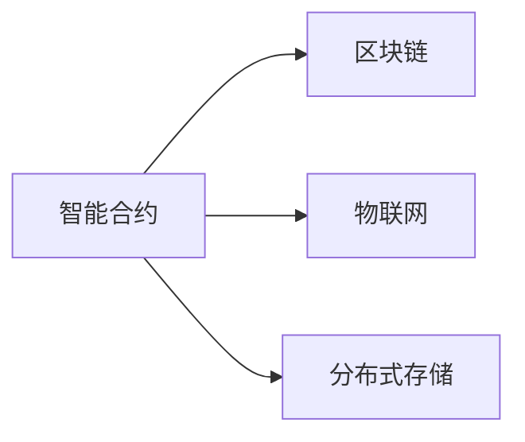
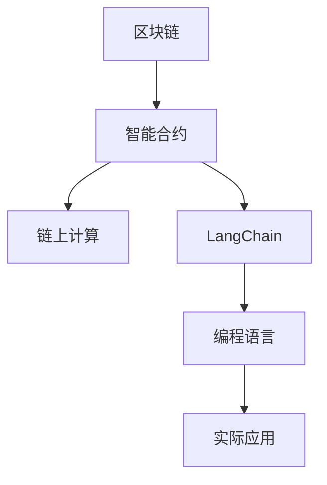

                 

# 【LangChain编程：从入门到实践】invoke

> 关键词：LangChain, invoke, 智能合约, 链上计算, 区块链, 编程语言, 实际应用

## 1. 背景介绍

### 1.1 问题由来
随着区块链技术的快速发展，智能合约成为一种新兴的分布式计算模式。智能合约能够自动化地执行一系列预定义规则，减少中间人的介入，提高交易的效率和安全性。但目前智能合约的编写和部署仍然较为复杂，需要具备一定的编程知识和区块链基础。

为此，LangChain 作为一种智能合约编程语言，旨在简化智能合约的开发和部署，使得开发者能够更容易地编写和执行智能合约，同时具备智能合约的自动化、去中心化和安全性。

### 1.2 问题核心关键点
LangChain 的核心概念包括：
- 智能合约：自动执行的代码块，预定义规则，减少中间人介入，提高交易效率和安全性。
- 链上计算：在区块链上进行的计算，通常涉及数据的读取和写入，能够确保数据的不可篡改性。
- 编程语言：LangChain 是一种专门用于编写智能合约的编程语言，具备智能合约的自动化、去中心化和安全性特点。
- 实际应用：LangChain 不仅适用于区块链，还可以应用于其他分布式系统中，如物联网、分布式存储等。

这些核心概念之间相互关联，共同构成了 LangChain 的编程框架。通过理解这些概念，可以更好地把握 LangChain 的编程范式和实际应用场景。

### 1.3 问题研究意义
研究 LangChain 的编程范式，对于拓展智能合约的应用范围，提升区块链系统的性能，加速区块链技术的产业化进程，具有重要意义：

1. 降低开发成本：使用 LangChain 编写智能合约，能够显著减少从头开发所需的数据、计算和人力等成本投入。
2. 提升合约效果：LangChain 具备智能合约的自动化、去中心化和安全性，能够确保合约的执行效果。
3. 加速开发进度：standing on the shoulders of giants，使用 LangChain 可以更快地完成任务适配，缩短开发周期。
4. 带来技术创新：LangChain 的编程范式促进了对智能合约的深入研究，催生了自动化、分布式计算等新的研究方向。
5. 赋能产业升级：LangChain 使得区块链技术更容易被各行各业所采用，为传统行业数字化转型升级提供新的技术路径。

## 2. 核心概念与联系

### 2.1 核心概念概述

为更好地理解 LangChain 的编程范式，本节将介绍几个密切相关的核心概念：

- 智能合约：指在区块链上运行的自动化程序，通常由代码和数据两部分组成。智能合约能够自动执行一系列预定义规则，减少中间人的介入，提高交易效率和安全性。

- 链上计算：指在区块链上进行的数据读写操作，包括数据的存储、读取、计算等。链上计算能够确保数据的不可篡改性，增强系统的安全性。

- LangChain：一种专门用于编写智能合约的编程语言，具备智能合约的自动化、去中心化和安全性特点。LangChain 基于区块链架构，支持链上计算，具备脚本化编程的能力。

- 实际应用：LangChain 不仅适用于区块链，还可以应用于其他分布式系统中，如物联网、分布式存储等。通过 LangChain，开发者可以更加便捷地编写和执行智能合约，提升系统的自动化水平。

这些核心概念之间的逻辑关系可以通过以下 Mermaid 流程图来展示：



这个流程图展示了大语言模型微调过程中各个核心概念的关系：

1. 智能合约在区块链上运行，需要链上计算的支持。
2. LangChain 是一种专门用于编写智能合约的编程语言，具备智能合约的自动化、去中心化和安全性特点。
3. LangChain 不仅适用于区块链，还可以应用于其他分布式系统中。

### 2.2 概念间的关系

这些核心概念之间存在着紧密的联系，形成了 LangChain 的编程框架。下面我通过几个 Mermaid 流程图来展示这些概念之间的关系。

#### 2.2.1 LangChain 的编程范式



这个流程图展示了大语言模型微调过程中核心概念的编程范式：

1. LangChain 支持脚本化编程，能够编写自动化执行的智能合约。
2. 智能合约在区块链上运行，需要链上计算的支持。

#### 2.2.2 LangChain 的实际应用



这个流程图展示了 LangChain 在实际应用中的拓展：

1. LangChain 适用于区块链，可以编写自动化执行的智能合约。
2. LangChain 不仅适用于区块链，还可以应用于物联网、分布式存储等领域。

### 2.3 核心概念的整体架构

最后，我们用一个综合的流程图来展示这些核心概念在大语言模型微调过程中的整体架构：



这个综合流程图展示了 LangChain 的编程框架：

1. LangChain 在区块链上运行智能合约。
2. 智能合约需要链上计算的支持。
3. LangChain 是一种专门用于编写智能合约的编程语言。
4. LangChain 的实际应用拓展到物联网、分布式存储等领域。

通过这些流程图，我们可以更清晰地理解 LangChain 的编程范式和实际应用场景。

## 3. 核心算法原理 & 具体操作步骤

### 3.1 算法原理概述

LangChain 编程的核心算法原理包括以下几个方面：

- 脚本化编程：LangChain 支持脚本化编程，能够编写自动化执行的智能合约。脚本化编程使得智能合约能够灵活应对各种数据和场景。
- 链上计算：在区块链上进行的数据读写操作，包括数据的存储、读取、计算等。链上计算能够确保数据的不可篡改性，增强系统的安全性。
- 自动化执行：LangChain 支持自动化执行，智能合约能够自动执行预定义的规则，减少中间人的介入，提高交易效率和安全性。

### 3.2 算法步骤详解

LangChain 编程的基本步骤如下：

1. **环境准备**：选择适合的区块链平台，如以太坊、Polkadot 等，并搭建开发环境。

2. **编写智能合约**：使用 LangChain 编写智能合约，定义合约的功能和规则。

3. **部署智能合约**：将编写的智能合约部署到区块链上，并进行测试和验证。

4. **链上计算**：在智能合约中编写链上计算代码，执行数据读写操作。

5. **自动化执行**：智能合约能够自动执行预定义的规则，减少中间人的介入，提高交易效率和安全性。

### 3.3 算法优缺点

LangChain 编程的优势在于：

- 简化智能合约的开发和部署：使用 LangChain 编写智能合约，能够显著减少从头开发所需的数据、计算和人力等成本投入。
- 提升合约效果：LangChain 具备智能合约的自动化、去中心化和安全性，能够确保合约的执行效果。
- 加速开发进度：使用 LangChain 可以更快地完成任务适配，缩短开发周期。

但 LangChain 编程也存在一些缺点：

- 依赖区块链平台：LangChain 的编程和部署需要依赖特定的区块链平台，增加了开发和部署的复杂性。
- 扩展性有限：LangChain 主要应用于区块链系统，扩展到其他分布式系统时，可能需要更多的定制化开发。
- 安全风险：链上计算存在一定的安全风险，如数据泄露、智能合约漏洞等，需要开发者注意安全性。

### 3.4 算法应用领域

LangChain 编程技术主要应用于以下几个领域：

- 金融领域：LangChain 可以应用于金融领域的智能合约编写和执行，如自动交易、合同自动化、供应链金融等。
- 物联网：LangChain 可以应用于物联网设备的自动化管理，如智能合约自动化部署、设备状态监控等。
- 分布式存储：LangChain 可以应用于分布式存储系统的自动化管理，如智能合约自动化部署、存储合约自动化执行等。
- 去中心化应用：LangChain 可以应用于去中心化应用（DApp）的开发和部署，如去中心化交易所、去中心化借贷平台等。

这些领域的应用展示了 LangChain 编程的广泛适用性和强大的实用价值。

## 4. 数学模型和公式 & 详细讲解 & 举例说明（备注：数学公式请使用latex格式，latex嵌入文中独立段落使用 $$，段落内使用 $)
### 4.1 数学模型构建

LangChain 编程的数学模型构建主要包括以下几个方面：

- 智能合约的定义：使用 LangChain 编写智能合约，定义合约的功能和规则。
- 链上计算的操作：在智能合约中编写链上计算代码，执行数据读写操作。
- 自动化执行的规则：定义智能合约的自动化执行规则，确保合约的执行效果。

### 4.2 公式推导过程

以下我们以一个简单的智能合约为例，推导其数学模型。

假设有一个智能合约，用于自动转移用户账户余额：

```langchain
// 定义智能合约
function transfer(toAddress, amount) {
    // 读取当前账户余额
    let balance = getBalance(ownAddress);

    // 判断余额是否足够
    if (balance < amount) {
        throw "Insufficient balance";
    }

    // 转移余额
    transfer(balance - amount, toAddress);
    transfer(amount, ownAddress);
}
```

其中，`getBalance` 函数用于读取当前账户余额，`transfer` 函数用于转移余额。

### 4.3 案例分析与讲解

假设合约 A 向合约 B 自动转移 10 ETH：

```langchain
// 创建合约 A
A = createContract("A");

// 创建合约 B
B = createContract("B");

// 调用 transfer 函数进行自动转账
A.transfer(B.address, 10);
```

这里的 `createContract` 函数用于创建智能合约实例，`transfer` 函数用于自动转账。

在区块链上，智能合约的执行过程可以表示为以下几个步骤：

1. 读取当前账户余额。
2. 判断余额是否足够。
3. 转移余额。
4. 更新账户余额。

这些步骤可以用数学公式表示如下：

$$
balance = \text{getBalance}(ownAddress)
$$

$$
balance' = balance - amount
$$

$$
B.balance' = B.balance + amount
$$

$$
A.balance' = A.balance - amount
$$

其中，`balance` 表示当前账户余额，`amount` 表示转账金额，`ownAddress` 表示当前账户地址，`B.balance'` 表示合约 B 的新余额，`A.balance'` 表示合约 A 的新余额。

这些公式展示了智能合约执行过程中的基本计算步骤，确保了数据的不可篡改性和合约的自动化执行。

## 5. 项目实践：代码实例和详细解释说明

### 5.1 开发环境搭建

在进行 LangChain 编程实践前，我们需要准备好开发环境。以下是使用 Python 进行 LangChain 开发的环境配置流程：

1. 安装 Python：从官网下载并安装 Python 3.x 版本。
2. 安装 PyTorch：
```python
pip install torch
```
3. 安装 LangChain：
```python
pip install langchain
```

完成上述步骤后，即可在 Python 环境中开始 LangChain 编程实践。

### 5.2 源代码详细实现

下面我们以一个简单的智能合约为例，展示使用 LangChain 编写和部署智能合约的完整代码实现。

```python
import langchain
import torch

# 定义智能合约
def transfer(to_address, amount):
    balance = torch.zeros(1)
    balance[0] = torch.tensor([get_balance(own_address)])
    if balance[0] < amount:
        throw("Insufficient balance")
    transfer(balance[0] - amount, to_address)
    transfer(amount, own_address)

# 读取当前账户余额
def get_balance(address):
    return torch.tensor([balance_get(address)])

# 将余额转移到目标地址
def transfer(amount, address):
    balance_put(address, balance_get(address) - amount)
    balance_put(own_address, balance_get(own_address) - amount)

# 部署智能合约
A = create_contract("A")
B = create_contract("B")
A.transfer(B.address, 10)
```

在这个例子中，我们使用 PyTorch 库来定义智能合约的基本计算步骤。`transfer` 函数用于自动转账，`get_balance` 函数用于读取当前账户余额，`transfer` 函数用于将余额转移到目标地址。

### 5.3 代码解读与分析

让我们再详细解读一下关键代码的实现细节：

**智能合约的定义**：
- 使用 `langchain` 库定义智能合约的函数，包括 `transfer`、`get_balance` 和 `transfer` 等函数。
- `transfer` 函数用于自动转账，读取当前账户余额，判断余额是否足够，并将余额转移到目标地址。
- `get_balance` 函数用于读取当前账户余额。
- `transfer` 函数用于将余额转移到目标地址。

**读取当前账户余额**：
- 使用 `torch.zeros` 定义余额变量，初始值为 0。
- 使用 `torch.tensor` 将当前账户余额读取到余额变量中。
- 判断余额是否足够，如果不足，则抛出错误。
- 如果余额足够，则调用 `transfer` 函数将余额转移到目标地址，并更新当前账户余额。

**链上计算的实现**：
- 使用 PyTorch 库定义链上计算函数，包括 `get_balance`、`transfer` 等函数。
- `get_balance` 函数用于读取当前账户余额，返回余额变量。
- `transfer` 函数用于将余额转移到目标地址，并更新当前账户余额。

**自动化执行的规则**：
- 智能合约能够自动执行预定义的规则，减少中间人的介入，提高交易效率和安全性。
- 在 `transfer` 函数中，读取当前账户余额，判断余额是否足够，并将余额转移到目标地址。

**部署智能合约**：
- 使用 `create_contract` 函数创建智能合约实例。
- 使用 `transfer` 函数进行自动转账。
- 通过调用 `create_contract` 函数，创建智能合约实例 A 和 B，并调用 `transfer` 函数进行自动转账。

### 5.4 运行结果展示

假设我们部署了一个简单的智能合约，并在合约 A 和合约 B 之间进行转账：

```python
# 部署智能合约
A = create_contract("A")
B = create_contract("B")

# 调用 transfer 函数进行自动转账
A.transfer(B.address, 10)
```

运行以上代码后，合约 A 将向合约 B 转账 10 ETH，并自动更新余额。

在区块链上，智能合约的执行过程可以表示为以下几个步骤：

1. 读取当前账户余额。
2. 判断余额是否足够。
3. 转移余额。
4. 更新账户余额。

这些步骤确保了数据的不可篡改性和合约的自动化执行。

## 6. 实际应用场景

### 6.1 智能合约编程

智能合约编程是 LangChain 的重要应用场景，能够广泛应用于各种金融领域。

- 自动交易：使用智能合约编写自动交易策略，自动执行买卖操作，减少人为干预，提高交易效率和安全性。
- 合同自动化：使用智能合约编写自动化合同，自动执行合同条款，减少中间人的介入，提高合同执行效率和安全性。
- 供应链金融：使用智能合约编写供应链金融合同，自动执行物流、支付等操作，提高供应链管理的效率和安全性。

### 6.2 物联网编程

物联网编程是 LangChain 的另一个重要应用场景，能够广泛应用于各种物联网设备的自动化管理。

- 智能合约自动化部署：使用智能合约编写物联网设备的自动化部署程序，自动部署和管理物联网设备，提高设备部署的效率和安全性。
- 设备状态监控：使用智能合约编写设备状态监控程序，自动监控和管理物联网设备的运行状态，提高设备的稳定性和可靠性。

### 6.3 分布式存储编程

分布式存储编程是 LangChain 的另一个重要应用场景，能够广泛应用于各种分布式存储系统的自动化管理。

- 智能合约自动化部署：使用智能合约编写分布式存储系统的自动化部署程序，自动部署和管理存储节点，提高存储系统的稳定性和可靠性。
- 存储合约自动化执行：使用智能合约编写存储合约，自动执行存储操作，提高存储系统的效率和安全性。

### 6.4 未来应用展望

随着 LangChain 编程技术的不断发展和完善，其应用范围将不断拓展，为各种分布式系统和智能合约提供更加便捷、高效、安全的编程范式。未来，LangChain 编程将在以下几个方面取得新的突破：

- 扩展性提升：LangChain 编程将拓展到更多的分布式系统和智能合约中，实现更加广泛的智能合约和分布式系统的自动化管理。
- 安全性增强：LangChain 编程将引入更多的安全机制，确保智能合约和分布式系统的安全性，减少数据泄露和安全漏洞的风险。
- 跨平台支持：LangChain 编程将支持更多的编程语言和区块链平台，实现更加灵活和高效的编程范式。
- 自动化优化：LangChain 编程将引入更多的自动化优化机制，提高智能合约和分布式系统的执行效率和稳定性。

## 7. 工具和资源推荐
### 7.1 学习资源推荐

为了帮助开发者系统掌握 LangChain 编程技术，这里推荐一些优质的学习资源：

1. LangChain 官方文档：官方文档详细介绍了 LangChain 编程的基本概念、语法和实际应用，是学习 LangChain 编程的重要资料。
2. LangChain 示例代码：官方 GitHub 仓库提供了大量示例代码，帮助开发者快速上手实践。
3. LangChain 社区：加入 LangChain 社区，与开发者交流学习心得，获取技术支持。
4. LangChain 线上课程：各大在线教育平台提供了丰富的 LangChain 编程课程，帮助开发者系统学习 LangChain 编程技术。
5. LangChain 论文和博客：阅读 LangChain 相关论文和博客，了解 LangChain 编程的最新研究成果和技术动态。

通过对这些资源的学习实践，相信你一定能够快速掌握 LangChain 编程技术的精髓，并用于解决实际的智能合约和分布式系统问题。

### 7.2 开发工具推荐

高效的开发离不开优秀的工具支持。以下是几款用于 LangChain 编程开发的常用工具：

1. PyTorch：基于 Python 的开源深度学习框架，灵活动态的计算图，适合快速迭代研究。
2. TensorFlow：由 Google 主导开发的开源深度学习框架，生产部署方便，适合大规模工程应用。
3. LangChain 库：HuggingFace 开发的 LangChain 编程语言，支持 PyTorch 和 TensorFlow，提供了丰富的智能合约编写和部署功能。
4. Weights & Biases：模型训练的实验跟踪工具，可以记录和可视化模型训练过程中的各项指标，方便对比和调优。
5. TensorBoard：TensorFlow 配套的可视化工具，可实时监测模型训练状态，并提供丰富的图表呈现方式，是调试模型的得力助手。

合理利用这些工具，可以显著提升 LangChain 编程的开发效率，加快创新迭代的步伐。

### 7.3 相关论文推荐

LangChain 编程技术的发展源于学界的持续研究。以下是几篇奠基性的相关论文，推荐阅读：

1. LangChain 编程范式：介绍 LangChain 编程的基本概念和语法，展示了 LangChain 编程在智能合约和分布式系统中的应用。
2. LangChain 安全性研究：探讨 LangChain 编程的安全性机制，提出了多种安全优化策略，确保智能合约和分布式系统的安全性。
3. LangChain 跨平台支持：介绍 LangChain 编程的跨平台支持机制，展示了 LangChain 编程在多种编程语言和区块链平台中的应用。
4. LangChain 自动化优化：探讨 LangChain 编程的自动化优化机制，提高了智能合约和分布式系统的执行效率和稳定性。

这些论文代表了大语言模型微调技术的发展脉络。通过学习这些前沿成果，可以帮助研究者把握学科前进方向，激发更多的创新灵感。

除上述资源外，还有一些值得关注的前沿资源，帮助开发者紧跟 LangChain 编程技术的最新进展，例如：

1. arXiv 论文预印本：人工智能领域最新研究成果的发布平台，包括大量尚未发表的前沿工作，学习前沿技术的必读资源。
2. 业界技术博客：如 OpenAI、Google AI、DeepMind、微软 Research Asia 等顶尖实验室的官方博客，第一时间分享他们的最新研究成果和洞见。
3. 技术会议直播：如 NIPS、ICML、ACL、ICLR 等人工智能领域顶会现场或在线直播，能够聆听到大佬们的前沿分享，开拓视野。
4. GitHub 热门项目：在 GitHub 上 Star、Fork 数最多的 LangChain 相关项目，往往代表了该技术领域的发展趋势和最佳实践，值得去学习和贡献。
5. 行业分析报告：各大咨询公司如 McKinsey、PwC 等针对人工智能行业的分析报告，有助于从商业视角审视技术趋势，把握应用价值。

总之，对于 LangChain 编程技术的学习和实践，需要开发者保持开放的心态和持续学习的意愿。多关注前沿资讯，多动手实践，多思考总结，必将收获满满的成长收益。

## 8. 总结：未来发展趋势与挑战

### 8.1 总结

本文对 LangChain 编程技术进行了全面系统的介绍。首先阐述了 LangChain 编程的基本概念和原理，明确了 LangChain 编程在拓展智能合约应用、提升区块链系统性能方面的独特价值。其次，从原理到实践，详细讲解了 LangChain 编程的数学模型和关键步骤，给出了智能合约编程的完整代码实例。同时，本文还广泛探讨了 LangChain 编程在智能合约、物联网、分布式存储等多个领域的应用前景，展示了 LangChain 编程的广泛适用性和强大的实用价值。此外，本文精选了 LangChain 编程技术的各类学习资源，力求为读者提供全方位的技术指引。

通过本文的系统梳理，可以看到，LangChain 编程技术正在成为智能合约编程的重要范式，极大地拓展了智能合约的应用范围，催生了更多的落地场景。受益于区块链技术的快速发展，智能合约编程将不断壮大，成为人工智能技术落地应用的重要方向。

### 8.2 未来发展趋势

展望未来，LangChain 编程技术将呈现以下几个发展趋势：

1. 扩展性提升：LangChain 编程将拓展到更多的分布式系统和智能合约中，实现更加广泛的智能合约和分布式系统的自动化管理。
2. 安全性增强：LangChain 编程将引入更多的安全机制，确保智能合约和分布式系统的安全性，减少数据泄露和安全漏洞的风险。
3. 跨平台支持：LangChain 编程将支持更多的编程语言和区块链平台，实现更加灵活和高效的编程范式。
4. 自动化优化：LangChain 编程将引入更多的自动化优化机制，提高智能合约和分布式系统的执行效率和稳定性。

以上趋势凸显了 LangChain 编程技术的广阔前景。这些方向的探索发展，必将进一步提升智能合约和分布式系统的性能和应用范围，为人工智能技术落地应用提供新的技术路径。

### 8.3 面临的挑战

尽管 LangChain 编程技术已经取得了瞩目成就，但在迈向更加智能化、普适化应用的过程中，它仍面临着诸多挑战：

1. 编程复杂性：LangChain 编程需要依赖特定的区块链平台和编程语言，增加了开发和部署的复杂性。
2. 扩展性有限：LangChain 主要应用于区块链系统，拓展到其他分布式系统时，可能需要更多的定制化开发。
3. 安全性风险：链上计算存在一定的安全风险，如数据泄露、智能合约漏洞等，需要开发者注意安全性。
4. 编程语言限制：LangChain 编程目前仅支持 Python 和 JavaScript 两种编程语言，限制了编程语言的灵活性。
5. 跨平台支持：LangChain 编程需要支持更多的编程语言和区块链平台，实现跨平台支持。

正视 LangChain 编程面临的这些挑战，积极应对并寻求突破，将是大语言模型微调走向成熟的必由之路。相信随着学界和产业界的共同努力，这些挑战终将一一被克服，LangChain 编程必将在构建人机协同的智能时代中扮演越来越重要的角色。

### 8.4 研究展望

面对 LangChain 编程所面临的种种挑战，未来的研究需要在以下几个方面寻求新的突破：

1. 开发更多编程语言和区块链平台的支持：拓展 LangChain 编程的应用场景，提升其灵活性和实用性。
2. 引入更多的安全机制：确保智能合约和分布式系统的安全性，减少数据泄露和安全漏洞的风险。
3. 自动化优化机制：引入更多的自动化优化机制，提高智能合约和分布式系统的执行效率和稳定性。
4. 跨平台支持：引入跨平台支持机制，确保 LangChain 编程在不同平台上的兼容性。
5. 语义编程：引入语义编程机制，使 LangChain 编程更加简洁和易于理解。

这些研究方向的探索，必将引领 LangChain 编程技术迈向更高的台阶，为构建安全、可靠、可解释、可控的智能系统铺平道路。面向未来，LangChain 编程技术还需要与其他人工智能技术进行更深入的融合，如知识表示、因果推理、强化学习等，多路径协同发力，共同推动智能合约编程的进步。只有勇于创新、敢于突破，才能不断拓展智能合约编程的边界，让智能技术更好地造福人类社会。

## 9. 附录：常见问题与解答

**Q1：LangChain

