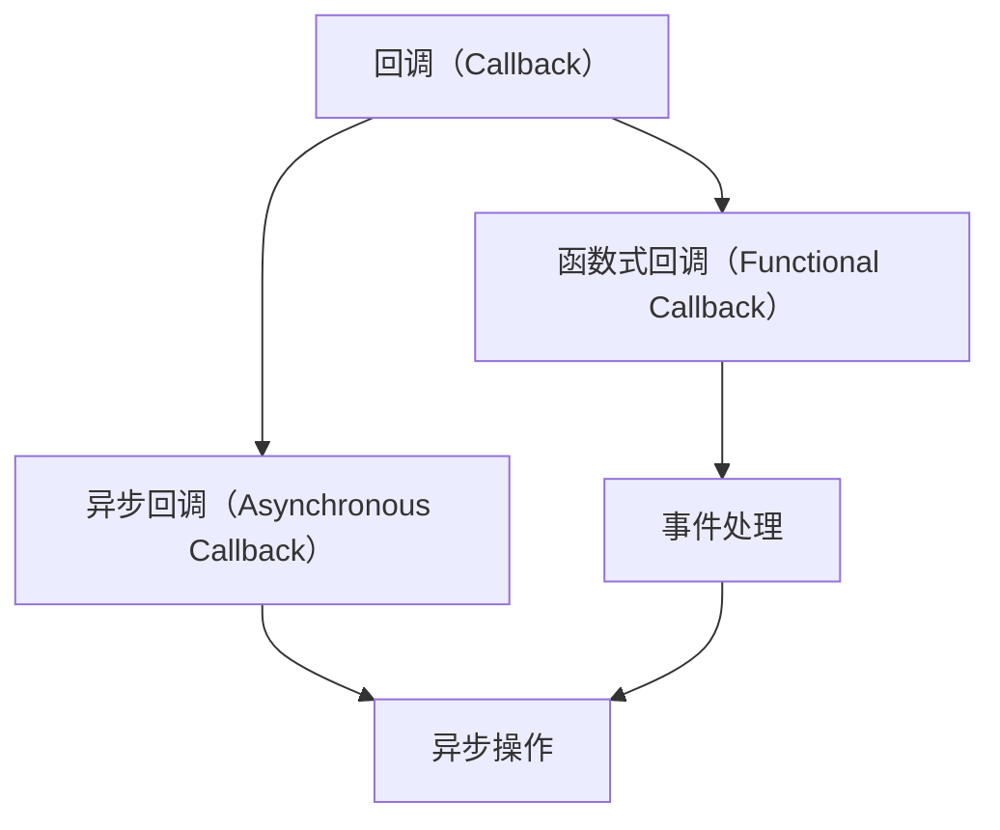

                 

## 1. 背景介绍

在现代程序设计中，回调（Callback）技术已广泛应用于各种场景，如事件驱动、异步编程、函数式编程等。回调是实现代码模块化、提高程序响应性和灵活性的重要手段。本文将从入门到实践，深入探讨使用回调的两种方式：函数式回调和异步回调。通过详细的代码实例和讲解，帮助读者全面掌握回调技术的原理与应用。

## 2. 核心概念与联系

### 2.1 核心概念概述

回调（Callback）是指在函数执行完毕后，将控制权返回到调用者函数的一种机制。回调函数作为参数传递给其他函数，在特定事件发生时触发执行，用于处理异步、事件驱动等场景。

函数式回调（Functional Callback）是指将回调函数作为参数传递给其他函数，待事件触发时，自动调用回调函数。常见场景包括事件处理、函数式编程等。

异步回调（Asynchronous Callback）是指在异步操作完成后，执行回调函数，处理异步操作结果。常见场景包括网络请求、文件I/O、数据库操作等。

这些概念之间的关系可以通过以下Mermaid流程图来展示：



这个流程图展示了回调技术的基本结构，回调函数在事件触发或异步操作完成后被调用，处理相应逻辑。函数式回调和异步回调是回调技术在不同场景下的具体应用形式。

### 2.2 概念间的关系

回调技术通过将回调函数作为参数传递给其他函数，使得函数能够响应外部事件或异步操作结果。在函数式回调中，回调函数本身是独立的，可以作为参数传递，不影响函数内部的执行逻辑。而在异步回调中，回调函数通常与异步操作绑定，用于处理异步操作完成后的逻辑处理。

## 3. 核心算法原理 & 具体操作步骤

### 3.1 算法原理概述

回调函数的核心原理是将函数作为参数传递，在特定事件发生或异步操作完成后执行回调函数。其基本流程包括：

1. 定义回调函数。
2. 将回调函数作为参数传递给其他函数。
3. 触发特定事件或完成异步操作，自动调用回调函数。

### 3.2 算法步骤详解

#### 3.2.1 函数式回调

**Step 1: 定义回调函数**
- 定义一个回调函数，通常以函数名作为标识，如`on_success`。
- 回调函数接收必要参数，并执行相应逻辑。

**Step 2: 调用包含回调的函数**
- 将回调函数作为参数传递给其他函数。
- 调用该函数，待特定事件发生时自动调用回调函数。

**Step 3: 触发事件并执行回调**
- 待特定事件发生（如按钮点击、数据加载完成等），调用包含回调的函数。
- 函数内部自动调用回调函数，执行相应逻辑。

**Step 4: 处理回调函数返回值**
- 回调函数执行完毕后，通常返回结果或状态信息。
- 根据返回值执行后续操作，如更新UI、更新数据等。

#### 3.2.2 异步回调

**Step 1: 定义异步操作**
- 定义一个异步操作函数，如`async_func`。
- 函数执行异步操作，并在操作完成后执行回调函数。

**Step 2: 定义回调函数**
- 定义一个回调函数，接收必要参数，并执行相应逻辑。

**Step 3: 调用异步操作函数并传递回调函数**
- 将回调函数作为参数传递给异步操作函数。
- 调用异步操作函数，异步执行操作。

**Step 4: 异步操作完成后执行回调**
- 异步操作完成后，自动调用回调函数。
- 回调函数接收异步操作结果，执行相应逻辑。

**Step 5: 处理回调函数返回值**
- 回调函数执行完毕后，通常返回结果或状态信息。
- 根据返回值执行后续操作，如更新UI、更新数据等。

### 3.3 算法优缺点

函数式回调和异步回调各有优缺点：

#### 优点

1. **提高代码复用性**：回调函数可以作为参数传递，使得代码能够跨不同场景复用，减少重复编写。
2. **提高程序灵活性**：通过回调函数，程序可以响应外部事件或异步操作结果，提升程序的灵活性和可扩展性。
3. **提高异步操作效率**：异步回调能够减少线程阻塞，提高程序并发性能。

#### 缺点

1. **回调嵌套问题**：多层回调嵌套可能导致逻辑混乱，增加代码维护难度。
2. **回调地狱问题**：过多的回调嵌套可能导致"回调地狱"，增加代码阅读和维护难度。
3. **回调函数依赖**：回调函数的编写和维护依赖于具体场景和需求，可能增加开发复杂度。

### 3.4 算法应用领域

回调技术广泛应用于各种编程场景，包括：

1. **事件驱动编程**：如GUI应用程序中的事件处理、Web应用程序中的HTTP请求处理等。
2. **异步编程**：如Node.js中的回调函数、异步编程模型等。
3. **函数式编程**：如React中的事件处理、Lodash中的函数式编程等。

回调技术在提高程序响应性、灵活性和可扩展性方面具有重要作用，广泛应用于各种软件开发领域。

## 4. 数学模型和公式 & 详细讲解 & 举例说明

### 4.1 数学模型构建

为了更好地理解回调技术的数学原理，我们可以将其抽象为一个函数计算模型。假设有一个函数`f(x)`，其计算过程可能涉及异步操作或事件处理，需要执行回调函数`g(y)`。则回调函数的数学模型可以表示为：

$$
f(x) = g(y)
$$

其中`x`为输入参数，`y`为异步操作结果或事件触发信息。

### 4.2 公式推导过程

在函数式回调中，回调函数`g(y)`作为参数传递给函数`f(x)`，在特定事件发生时自动调用。异步回调中，回调函数`g(y)`在异步操作完成后自动执行。

### 4.3 案例分析与讲解

假设有一个Web应用程序，需要在数据加载完成后更新UI。我们可以使用回调函数来实现这一功能。具体步骤如下：

**Step 1: 定义回调函数**
```python
def on_data_loaded(data):
    update_ui(data)
```

**Step 2: 调用包含回调的函数**
```python
def load_data():
    # 异步加载数据
    ...

    # 调用回调函数
    on_data_loaded(data)
```

**Step 3: 触发事件并执行回调**
```python
load_data()
```

**Step 4: 处理回调函数返回值**
```python
def update_ui(data):
    # 根据数据更新UI
    ...
```

## 5. 项目实践：代码实例和详细解释说明

### 5.1 开发环境搭建

使用Python进行回调技术的项目实践，需要准备以下开发环境：

1. 安装Python：从官网下载并安装Python，建议使用3.7及以上版本。
2. 安装必要的第三方库：如Requests、Flask等，用于异步编程和Web应用开发。
3. 使用IDE：如PyCharm、Visual Studio Code等，方便编写和调试代码。

### 5.2 源代码详细实现

#### 5.2.1 函数式回调示例

```python
import time

# 定义回调函数
def on_success(data):
    print("Data loaded:", data)

# 调用包含回调的函数
def load_data():
    time.sleep(2)
    data = "Sample data"
    on_success(data)

# 触发事件并执行回调
load_data()
```

**代码解读与分析**

- 定义回调函数`on_success`，接收异步操作结果`data`，并打印输出。
- 定义函数`load_data`，模拟异步加载数据的操作，2秒后加载完成。
- 调用函数`load_data`，异步加载数据，并在加载完成后自动调用回调函数`on_success`。

#### 5.2.2 异步回调示例

```python
import time
import asyncio

# 定义异步操作函数
async def async_func():
    await asyncio.sleep(2)
    data = "Sample data"
    return data

# 定义回调函数
def on_success(data):
    print("Data loaded:", data)

# 调用异步操作函数并传递回调函数
async def load_data():
    data = await async_func()
    on_success(data)

# 启动异步事件循环
asyncio.run(load_data())
```

**代码解读与分析**

- 定义异步操作函数`async_func`，使用`asyncio.sleep`模拟异步操作。
- 定义回调函数`on_success`，接收异步操作结果`data`，并打印输出。
- 定义异步函数`load_data`，调用异步操作函数`async_func`，并传递回调函数`on_success`。
- 启动异步事件循环，调用`load_data`函数，执行异步操作并自动调用回调函数`on_success`。

### 5.3 运行结果展示

在运行上述代码后，将得到以下输出：

```
Data loaded: Sample data
```

这表示异步加载的数据成功完成，并触发了回调函数`on_success`。

## 6. 实际应用场景

### 6.1 事件驱动编程

回调技术在事件驱动编程中广泛应用，如GUI应用程序中的事件处理、Web应用程序中的HTTP请求处理等。通过事件驱动编程，程序能够响应用户交互和网络请求，提升用户体验和程序性能。

### 6.2 异步编程

回调技术在异步编程中非常常见，如Node.js中的回调函数、异步编程模型等。异步回调能够减少线程阻塞，提高程序并发性能，适用于I/O密集型任务，如网络请求、文件I/O、数据库操作等。

### 6.3 函数式编程

回调技术在函数式编程中也有广泛应用，如React中的事件处理、Lodash中的函数式编程等。函数式回调能够简化代码逻辑，提升代码可读性和可维护性。

## 7. 工具和资源推荐

### 7.1 学习资源推荐

1. **《JavaScript异步编程》**：详细讲解JavaScript中的回调函数、异步编程模型等，适合初学者学习。
2. **《Python异步编程实战》**：讲解Python中的异步编程、异步回调函数等，适合Python开发者学习。
3. **《JavaScript设计模式与编程实践》**：介绍JavaScript中的事件驱动编程和异步回调等设计模式，适合中高级开发者学习。

### 7.2 开发工具推荐

1. **VS Code**：轻量级的代码编辑器，支持丰富的插件和扩展，适合回调技术的开发和调试。
2. **PyCharm**：功能强大的Python IDE，支持异步编程、回调函数等高级功能，适合Python开发者使用。
3. **IntelliJ IDEA**：强大的IDE，支持Java、Kotlin、Python等多种编程语言，适合跨语言开发和调试。

### 7.3 相关论文推荐

1. **《Java回调函数：设计模式与实现技巧》**：介绍Java中的回调函数及其设计模式，适合Java开发者学习。
2. **《Python异步编程指南》**：讲解Python中的异步编程、回调函数等，适合Python开发者学习。
3. **《JavaScript异步编程实践》**：介绍JavaScript中的异步编程、回调函数等，适合JavaScript开发者学习。

## 8. 总结：未来发展趋势与挑战

### 8.1 研究成果总结

回调技术是现代程序设计中的重要组成部分，广泛应用于各种编程场景。函数式回调和异步回调是回调技术在不同场景下的具体应用形式，各自有其独特的优势和局限性。

### 8.2 未来发展趋势

未来回调技术的发展趋势包括：

1. **更加丰富的异步编程模型**：随着异步编程模型的不断发展，回调函数将逐渐被更高级别的API和语言特性所取代，提高程序的可读性和可维护性。
2. **更加灵活的事件驱动编程**：事件驱动编程将更加灵活和智能化，能够更好地响应外部事件和异步操作结果。
3. **更加高效的异步编程**：异步回调的效率将进一步提升，减少线程阻塞和资源消耗，提高程序并发性能。

### 8.3 面临的挑战

尽管回调技术在现代程序设计中广泛应用，但仍面临一些挑战：

1. **回调嵌套问题**：多层回调嵌套可能导致逻辑混乱，增加代码维护难度。
2. **回调地狱问题**：过多的回调嵌套可能导致"回调地狱"，增加代码阅读和维护难度。
3. **回调函数依赖**：回调函数的编写和维护依赖于具体场景和需求，可能增加开发复杂度。

### 8.4 研究展望

未来回调技术的研究方向包括：

1. **更加高级的异步编程模型**：探索更加高级的异步编程模型，如Coroutine、Future等，提高程序的灵活性和可扩展性。
2. **更加智能的事件驱动编程**：引入更多智能事件处理技术，如事件队列、事件聚合等，提升程序的响应速度和效率。
3. **更加高效的回调函数管理**：研究更加高效的回调函数管理技术，如异步编程框架、事件驱动框架等，提高程序的开发效率和可维护性。

## 9. 附录：常见问题与解答

### Q1: 回调函数与匿名函数的区别？

A: 回调函数是一种函数对象，可以作为参数传递给其他函数。而匿名函数是一种没有名字的函数，通常在需要定义简单函数时使用。回调函数和匿名函数的主要区别在于其生命周期和作用域。

### Q2: 回调函数与闭包的区别？

A: 回调函数和闭包都是函数对象，但二者有不同的作用和生命周期。回调函数通常作为参数传递给其他函数，用于处理特定事件或异步操作结果。而闭包是一个函数对象，可以访问其外部函数的变量和参数，通常在函数式编程中用于创建私有变量和函数。

### Q3: 回调函数在实际应用中的作用？

A: 回调函数在实际应用中通常用于处理异步操作和事件驱动编程。通过回调函数，程序可以响应外部事件和异步操作结果，提高程序的灵活性和可扩展性。在异步编程中，回调函数能够减少线程阻塞，提高程序并发性能。在事件驱动编程中，回调函数能够简化代码逻辑，提升代码可读性和可维护性。

---

作者：禅与计算机程序设计艺术 / Zen and the Art of Computer Programming

