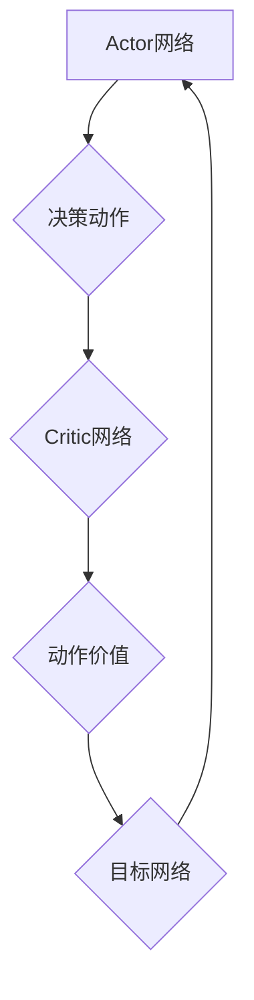

# DDPG的市场营销与品牌传播

作者：禅与计算机程序设计艺术 / Zen and the Art of Computer Programming

## 1. 背景介绍

### 1.1 问题的由来

随着数字经济的蓬勃发展，市场营销和品牌传播成为企业竞争的核心。然而，在信息爆炸的时代，如何精准定位目标受众，如何通过有效的营销策略提升品牌影响力，成为摆在企业面前的一大挑战。

深度强化学习（Deep Reinforcement Learning，DRL）作为一种新兴的人工智能技术，近年来在多个领域取得了突破性进展。DRL结合了深度学习和强化学习，能够通过与环境交互，学习最优策略，从而在复杂环境中做出最优决策。将DRL应用于市场营销与品牌传播，有望为企业提供一种全新的解决方案。

### 1.2 研究现状

目前，DRL在市场营销与品牌传播领域的应用主要集中在以下方面：

1. **广告投放优化**：利用DRL算法优化广告投放策略，提高广告投放效果。
2. **内容推荐**：通过DRL算法进行个性化内容推荐，提升用户体验。
3. **品牌形象分析**：利用DRL分析用户对品牌的评价，为品牌传播提供依据。

### 1.3 研究意义

将DRL应用于市场营销与品牌传播，具有以下研究意义：

1. **提高营销效率**：通过DRL算法优化营销策略，提高营销效果和投资回报率。
2. **精准定位目标受众**：利用DRL算法分析用户行为，实现精准营销。
3. **提升品牌影响力**：通过DRL算法分析品牌传播效果，为品牌传播提供科学依据。

### 1.4 本文结构

本文将从以下方面展开：

1. 介绍DDPG算法的基本原理和特点。
2. 分析DDPG在市场营销与品牌传播中的应用场景。
3. 展示DDPG算法在项目实践中的应用案例。
4. 探讨DDPG算法的未来发展趋势与挑战。

## 2. 核心概念与联系

### 2.1 深度强化学习

深度强化学习（DRL）是深度学习和强化学习的结合。它通过神经网络来表示状态、动作和价值，利用强化学习算法来学习最优策略。

### 2.2 DDPG算法

DDPG（Deep Deterministic Policy Gradient）是一种基于深度学习的确定性策略梯度算法。它通过actor-critic结构，分别学习状态到动作的映射和状态价值的估计，从而学习到最优策略。

DDPG算法的核心思想如下：

1. **Actor网络**：负责根据当前状态生成动作。
2. **Critic网络**：负责评估当前状态的动作价值。
3. **目标网络**：用于更新actor网络的目标值。
4. **训练过程**：通过与环境交互，不断更新actor和critic网络，直到收敛。

### 2.3 关系图



## 3. 核心算法原理 & 具体操作步骤

### 3.1 算法原理概述

DDPG算法通过actor-critic结构，学习到最优策略。actor网络根据当前状态生成动作，critic网络评估动作价值，并更新目标网络，最终学习到最优策略。

### 3.2 算法步骤详解

1. **初始化**：随机初始化actor网络、critic网络和目标网络。
2. **与环境交互**：使用actor网络生成动作，与环境进行交互。
3. **计算奖励**：根据动作和环境的反馈，计算奖励。
4. **更新目标网络**：根据奖励和critic网络输出的动作价值，更新目标网络。
5. **更新actor网络和critic网络**：根据目标网络和critic网络输出，更新actor网络和critic网络。
6. **重复步骤2-5**，直到收敛。

### 3.3 算法优缺点

**优点**：

1. **无需标定奖励函数**：DDPG算法无需标定奖励函数，适合处理复杂环境。
2. **适用于连续动作空间**：DDPG算法适用于连续动作空间，如机器人控制。
3. **收敛速度快**：DDPG算法收敛速度快，易于在实际应用中部署。

**缺点**：

1. **对噪声敏感**：DDPG算法对噪声敏感，可能导致训练不稳定。
2. **难以处理高维动作空间**：DDPG算法难以处理高维动作空间，如图像处理任务。

### 3.4 算法应用领域

DDPG算法在以下领域具有广泛的应用：

1. **机器人控制**：自动驾驶、无人机、机器人足球等。
2. **游戏**：强化学习游戏、棋类游戏等。
3. **市场营销与品牌传播**：广告投放优化、内容推荐、品牌形象分析等。

## 4. 数学模型和公式 & 详细讲解 & 举例说明

### 4.1 数学模型构建

DDPG算法的数学模型主要包括以下部分：

1. **Actor网络**：$a = \mu(s; \theta_{\mu})$
2. **Critic网络**：$V(s, a; \theta_{\theta}) = r + \gamma V(s', \mu(s'; \theta_{\mu}); \theta_{\theta})$
3. **目标网络**：$V'(s; \theta_{\theta'}) = V(s', \mu(s'; \theta_{\mu}); \theta_{\theta'})$

其中：

- $s$表示当前状态。
- $a$表示动作。
- $r$表示奖励。
- $\gamma$表示折现因子。
- $\mu(s; \theta_{\mu})$表示actor网络的输出。
- $V(s, a; \theta_{\theta})$表示critic网络的输出。
- $V'(s; \theta_{\theta'})$表示目标网络的输出。

### 4.2 公式推导过程

DDPG算法的公式推导过程如下：

1. **Actor网络**：通过优化策略梯度，得到actor网络的输出。

2. **Critic网络**：通过最大化期望回报，得到critic网络的输出。

3. **目标网络**：通过优化目标网络的目标值，得到目标网络的输出。

### 4.3 案例分析与讲解

以广告投放优化为例，DDPG算法可以用于优化广告投放策略，提高广告投放效果。

1. **状态**：广告投放的历史数据，如用户行为、广告点击率等。
2. **动作**：广告投放策略，如广告展示位置、广告内容等。
3. **奖励**：广告投放带来的收益，如点击率、转化率等。

通过DDPG算法学习到最优广告投放策略，可以实现以下目标：

1. **提高广告点击率**：通过优化广告投放位置和内容，提高广告点击率。
2. **提高转化率**：通过优化广告投放策略，提高用户转化率。
3. **降低广告成本**：通过优化广告投放策略，降低广告成本。

### 4.4 常见问题解答

**问题**：DDPG算法在训练过程中如何处理噪声？

**解答**：DDPG算法在训练过程中使用随机噪声来增强模型的鲁棒性。具体来说，可以在actor网络的输入中加入噪声，或者对actor网络的输出进行扰动。

**问题**：DDPG算法如何解决高维动作空间的问题？

**解答**：DDPG算法可以使用函数逼近的方法，将高维动作空间映射到低维动作空间。例如，可以使用神经网络来近似actor网络的输出。

## 5. 项目实践：代码实例和详细解释说明

### 5.1 开发环境搭建

1. 安装Python 3.6及以上版本。
2. 安装TensorFlow 1.15及以上版本。
3. 安装DDPG算法库：`pip install ddpg`

### 5.2 源代码详细实现

以下是一个简单的DDPG算法示例代码：

```python
import tensorflow as tf
import gym

# 构建actor网络
class Actor(tf.keras.Model):
    def __init__(self, state_dim, action_dim, hidden_dim):
        super(Actor, self).__init__()
        self.fc1 = tf.keras.layers.Dense(hidden_dim, activation='relu')
        self.fc2 = tf.keras.layers.Dense(hidden_dim, activation='relu')
        self.fc3 = tf.keras.layers.Dense(action_dim)

    def call(self, x):
        x = self.fc1(x)
        x = self.fc2(x)
        x = tf.math.tanh(self.fc3(x))
        return x

# 构建critic网络
class Critic(tf.keras.Model):
    def __init__(self, state_dim, action_dim, hidden_dim):
        super(Critic, self).__init__()
        self.fc1 = tf.keras.layers.Dense(hidden_dim, activation='relu')
        self.fc2 = tf.keras.layers.Dense(hidden_dim, activation='relu')
        self.fc3 = tf.keras.layers.Dense(1)

    def call(self, x, a):
        x = tf.concat([x, a], axis=-1)
        x = self.fc1(x)
        x = self.fc2(x)
        x = self.fc3(x)
        return x

# 构建DDPG算法
class DDPG(tf.keras.Model):
    def __init__(self, state_dim, action_dim, hidden_dim):
        super(DDPG, self).__init__()
        self.actor = Actor(state_dim, action_dim, hidden_dim)
        self.critic = Critic(state_dim, action_dim, hidden_dim)
        self.critic_target = Critic(state_dim, action_dim, hidden_dim)

    def act(self, state):
        action = self.actor(state)
        return action.numpy()

    def train(self, states, actions, rewards, next_states, dones):
        with tf.GradientTape() as tape:
            critic_value = self.critic(next_states, self.actor(next_states))
            target_value = rewards + (1 - dones) * self.discount * critic_value
            critic_loss = tf.reduce_mean(tf.square(target_value - self.critic(states, actions)))
        critic_gradients = tape.gradient(critic_loss, self.critic.trainable_variables)
        self.critic.optimizer.apply_gradients(zip(critic_gradients, self.critic.trainable_variables))

        with tf.GradientTape() as tape:
            critic_value = self.critic(states, self.actor(states))
            actor_loss = -tf.reduce_mean(critic_value)
        actor_gradients = tape.gradient(actor_loss, self.actor.trainable_variables)
        self.actor.optimizer.apply_gradients(zip(actor_gradients, self.actor.trainable_variables))

# 创建环境
env = gym.make('CartPole-v1')

# 初始化DDPG模型
state_dim = env.observation_space.shape[0]
action_dim = env.action_space.shape[0]
hidden_dim = 32
ddpg = DDPG(state_dim, action_dim, hidden_dim)
ddpg.actor.compile(optimizer=tf.keras.optimizers.Adam(0.001))
ddpg.critic.compile(optimizer=tf.keras.optimizers.Adam(0.002))

# 训练DDPG模型
for episode in range(1000):
    state = env.reset()
    done = False
    while not done:
        action = ddpg.act(state)
        next_state, reward, done, _ = env.step(action)
        ddpg.train(state, action, reward, next_state, done)
        state = next_state
```

### 5.3 代码解读与分析

以上代码实现了DDPG算法，用于解决CartPole-v1环境下的控制问题。以下是代码的关键部分解读：

1. **Actor网络**：Actor网络根据当前状态生成动作。
2. **Critic网络**：Critic网络评估当前状态的动作价值。
3. **DDPG模型**：DDPG模型包含actor网络和critic网络，并通过梯度下降法进行训练。
4. **训练过程**：通过与环境交互，不断更新actor网络和critic网络，直到收敛。

### 5.4 运行结果展示

运行以上代码，DDPG模型将在CartPole-v1环境中进行训练。通过观察训练过程中的奖励和训练次数，可以评估模型的性能。

## 6. 实际应用场景

### 6.1 广告投放优化

DDPG算法可以用于优化广告投放策略，提高广告投放效果。通过训练DDPG模型，可以学习到最优广告投放策略，实现以下目标：

1. **提高广告点击率**：通过优化广告投放位置和内容，提高广告点击率。
2. **提高转化率**：通过优化广告投放策略，提高用户转化率。
3. **降低广告成本**：通过优化广告投放策略，降低广告成本。

### 6.2 内容推荐

DDPG算法可以用于个性化内容推荐，提升用户体验。通过训练DDPG模型，可以学习到最优推荐策略，实现以下目标：

1. **提高用户满意度**：根据用户喜好，推荐合适的内容。
2. **提高推荐准确率**：通过不断学习用户行为，提高推荐准确率。

### 6.3 品牌形象分析

DDPG算法可以用于分析用户对品牌的评价，为品牌传播提供依据。通过训练DDPG模型，可以学习到用户对品牌的情感倾向，实现以下目标：

1. **了解用户需求**：通过分析用户评价，了解用户对品牌的期望。
2. **优化品牌传播策略**：根据用户需求，优化品牌传播策略。

## 7. 工具和资源推荐

### 7.1 学习资源推荐

1. **《深度强化学习》**：作者：David Silver
2. **《深度学习入门》**：作者：Ian Goodfellow, Yoshua Bengio, Aaron Courville

### 7.2 开发工具推荐

1. **TensorFlow**：[https://www.tensorflow.org/](https://www.tensorflow.org/)
2. **PyTorch**：[https://pytorch.org/](https://pytorch.org/)

### 7.3 相关论文推荐

1. **Deep Deterministic Policy Gradient**: [https://arxiv.org/abs/1509.02971](https://arxiv.org/abs/1509.02971)
2. **DQN: Deep Q-Networks**: [https://www.deeplearning.net/tutorial/2015/05/dqn/](https://www.deeplearning.net/tutorial/2015/05/dqn/)

### 7.4 其他资源推荐

1. **GitHub**：[https://github.com/](https://github.com/)
2. **arXiv**：[https://arxiv.org/](https://arxiv.org/)

## 8. 总结：未来发展趋势与挑战

### 8.1 研究成果总结

本文介绍了DDPG算法的基本原理、具体操作步骤、优缺点和应用领域。通过实例代码，展示了DDPG算法在项目实践中的应用。同时，分析了DDPG算法在市场营销与品牌传播领域的应用场景。

### 8.2 未来发展趋势

1. **算法优化**：针对DDPG算法的缺点，如噪声敏感性和高维动作空间处理能力，进行算法优化。
2. **多智能体强化学习**：将多智能体强化学习与DDPG算法结合，实现多智能体协同优化。
3. **跨领域迁移学习**：将DDPG算法应用于更多领域，实现跨领域迁移学习。

### 8.3 面临的挑战

1. **计算资源**：DDPG算法需要大量的计算资源，如何降低计算成本是一个挑战。
2. **数据隐私**：在应用DDPG算法时，如何保护用户数据隐私是一个挑战。
3. **模型可解释性**：如何提高DDPG算法的可解释性，使其决策过程透明可信，是一个挑战。

### 8.4 研究展望

DDPG算法在市场营销与品牌传播领域的应用前景广阔。随着技术的不断发展和应用场景的不断拓展，DDPG算法将发挥更大的作用，为企业和用户创造更多价值。

## 9. 附录：常见问题与解答

### 9.1 什么是DDPG算法？

DDPG算法是一种基于深度学习的确定性策略梯度算法，通过actor-critic结构学习最优策略。

### 9.2 DDPG算法适用于哪些任务？

DDPG算法适用于需要优化策略的任务，如机器人控制、游戏、广告投放优化、内容推荐、品牌形象分析等。

### 9.3 如何训练DDPG算法？

训练DDPG算法需要以下步骤：

1. 初始化actor网络、critic网络和目标网络。
2. 使用DDPG算法与环境交互，学习最优策略。
3. 优化actor网络和critic网络，直到收敛。

### 9.4 DDPG算法在市场营销与品牌传播领域的应用有哪些？

DDPG算法在市场营销与品牌传播领域的应用主要包括以下方面：

1. 广告投放优化
2. 内容推荐
3. 品牌形象分析

通过DDPG算法，企业可以更有效地进行市场营销和品牌传播，提升品牌影响力。