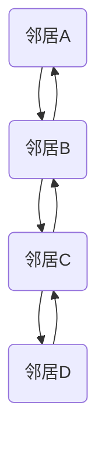

# Pregel原理与代码实例讲解

作者：禅与计算机程序设计艺术 / Zen and the Art of Computer Programming

## 1. 背景介绍

### 1.1 问题的由来

随着互联网的快速发展，网络规模和复杂度不断增加，传统图处理算法在处理大规模图数据时面临着效率低下、扩展性差的难题。为了解决这些问题，Google在2008年提出了Pregel算法，这是一种分布式的图处理框架，能够在分布式系统中高效地处理大规模图数据。

### 1.2 研究现状

Pregel算法自提出以来，受到了广泛关注。许多研究机构和公司纷纷对Pregel算法进行了改进和扩展，提出了多种基于Pregel的图处理框架和算法。目前，Pregel算法已成为大规模图处理领域的重要研究热点。

### 1.3 研究意义

Pregel算法在处理大规模图数据方面具有显著优势，能够有效提高图处理任务的效率和性能。因此，研究Pregel算法对于推动图处理技术的发展具有重要意义。

### 1.4 本文结构

本文将详细介绍Pregel算法的原理、步骤、优缺点和应用领域。首先，我们将介绍Pregel算法的核心概念和联系；其次，阐述Pregel算法的原理和具体操作步骤；然后，通过代码实例展示Pregel算法的实现方法；最后，探讨Pregel算法的实际应用场景和未来发展趋势。

## 2. 核心概念与联系

Pregel算法的核心思想是将大规模图数据分布到多个计算节点上，利用并行计算能力进行高效处理。以下是Pregel算法的关键概念：

### 2.1 节点（Vertex）

节点是图数据的基本单位，表示图中的实体，如网页、社交网络中的用户等。

### 2.2 边（Edge）

边表示节点之间的连接关系，如网页之间的链接、社交网络中的好友关系等。

### 2.3 邻居（Neighbor）

节点的邻居是指与该节点直接相连的节点。

### 2.4 顶点值（Vertex Value）

顶点值是节点所具有的属性，如网页的权重、社交网络中用户的年龄等。

### 2.5 边值（Edge Value）

边值是边所具有的属性，如网页之间的权重、社交网络中好友关系的强度等。

### 2.6 算法流程

Pregel算法主要包括以下几个步骤：

1. 初始化：每个节点初始化自己的顶点值和边值。
2. 迭代：在每一轮迭代中，节点根据自己的顶点值、邻居的顶点值和边值，更新自己的顶点值。
3. 检查：当所有节点的顶点值不再发生变化时，算法结束。

## 3. 核心算法原理 & 具体操作步骤

### 3.1 算法原理概述

Pregel算法通过将大规模图数据分布到多个计算节点上，利用并行计算能力进行高效处理。算法的核心原理是消息传递，节点之间通过发送和接收消息来更新自己的顶点值和边值。

### 3.2 算法步骤详解

Pregel算法的步骤如下：

1. **初始化**：每个节点初始化自己的顶点值和边值。
2. **迭代**：
    - 每个节点向所有邻居发送自己的顶点值和边值。
    - 每个节点根据收到的邻居信息更新自己的顶点值和边值。
    - 重复步骤2，直到所有节点的顶点值不再发生变化。
3. **结束**：当所有节点的顶点值不再发生变化时，算法结束。

### 3.3 算法优缺点

#### 优点

- **并行性**：Pregel算法能够在分布式系统中高效地处理大规模图数据。
- **可扩展性**：Pregel算法易于扩展，能够适应不同的计算环境。
- **容错性**：Pregel算法具有良好的容错性，能够应对节点故障等问题。

#### 缺点

- **局部性**：Pregel算法中，节点之间通过消息传递来更新信息，这可能导致局部信息的传递效率较低。
- **资源消耗**：Pregel算法需要大量的网络带宽和存储资源。

### 3.4 算法应用领域

Pregel算法在以下领域有着广泛的应用：

- 社交网络分析：如推荐系统、好友关系分析等。
- 网络分析：如网页排名、社区发现等。
- 生物信息学：如蛋白质结构分析、基因分析等。

## 4. 数学模型和公式 & 详细讲解 & 举例说明

### 4.1 数学模型构建

Pregel算法的数学模型可以表示为：

$$
\begin{align*}
V_t(v) &= \text{Initial Value}(v) + \sum_{u \in N(v)} \text{Message}(u, v) \
\text{Message}(u, v) &= \text{Current Value}(u) - \text{Initial Value}(u)
\end{align*}
$$

其中，$V_t(v)$表示在第$t$轮迭代时，节点$v$的顶点值；$\text{Initial Value}(v)$表示节点$v$的初始顶点值；$N(v)$表示节点$v$的邻居集合；$\text{Current Value}(u)$表示节点$u$在当前轮迭代的顶点值。

### 4.2 公式推导过程

Pregel算法的推导过程如下：

1. **初始化**：每个节点初始化自己的顶点值和边值。
2. **迭代**：
    - 每个节点向所有邻居发送自己的顶点值和边值。
    - 每个节点根据收到的邻居信息更新自己的顶点值和边值：
        $$
        \begin{align*}
        V_t(v) &= \text{Initial Value}(v) + \sum_{u \in N(v)} \text{Message}(u, v) \
        \end{align*}
        $$
    - 每个节点根据自身更新后的顶点值，向所有邻居发送新的消息：
        $$
        \begin{align*}
        \text{Message}(u, v) &= \text{Current Value}(u) - \text{Initial Value}(u)
        \end{align*}
        $$
3. **结束**：当所有节点的顶点值不再发生变化时，算法结束。

### 4.3 案例分析与讲解

以下是一个简单的Pregel算法示例，用于计算图中所有节点的度（即节点的邻居数量）：



在这个示例中，节点A的度为2，节点B的度为3，节点C的度为2，节点D的度为1。

### 4.4 常见问题解答

**Q1：Pregel算法与MapReduce有什么区别？**

A1：Pregel算法和MapReduce都是分布式计算框架，但它们在处理图数据方面有所不同。Pregel算法专门针对图处理任务，提供了节点和边等概念，更适合于图数据的分布式处理；而MapReduce是一种通用的分布式计算框架，可以用于处理各种类型的数据。

**Q2：Pregel算法如何处理动态图？**

A2：Pregel算法本身不支持动态图的直接处理。对于动态图，可以采用以下两种方法：

1. **静态图处理**：将动态图在某一时间点进行采样，将其转换为静态图，然后使用Pregel算法进行处理。
2. **在线图处理**：设计在线图处理算法，实时更新图结构和节点信息，并使用Pregel算法进行处理。

## 5. 项目实践：代码实例和详细解释说明

### 5.1 开发环境搭建

1. 安装Java开发环境。
2. 安装Hadoop和HDFS。
3. 创建Hadoop集群。

### 5.2 源代码详细实现

以下是一个简单的Pregel算法示例，用于计算图中所有节点的度：

```java
import org.apache.hadoop.conf.Configuration;
import org.apache.hadoop.fs.Path;
import org.apache.hadoop.io.IntWritable;
import org.apache.hadoop.io.Text;
import org.apache.hadoop.mapreduce.Job;
import org.apache.hadoop.mapreduce.lib.input.FileInputFormat;
import org.apache.hadoop.mapreduce.lib.output.FileOutputFormat;
import org.apache.hadoop.mapreduce.lib.input.KeyValueTextInputFormat;
import org.apache.hadoop.mapreduce.lib.output.TextOutputFormat;
import org.apache.hadoop.mapreduce.Mapper;
import org.apache.hadoop.mapreduce.Reducer;

public class PregelDegree {
    public static class DegreeMapper extends Mapper<Object, Text, Text, IntWritable> {
        private final static IntWritable one = new IntWritable(1);
        public void map(Object key, Text value, Context context) throws IOException, InterruptedException {
            String[] words = value.toString().split("\s+");
            for (String word : words) {
                context.write(new Text(word), one);
            }
        }
    }

    public static class DegreeReducer extends Reducer<Text, IntWritable, Text, IntWritable> {
        private IntWritable result = new IntWritable();
        public void reduce(Text key, Iterable<IntWritable> values, Context context) throws IOException, InterruptedException {
            int sum = 0;
            for (IntWritable val : values) {
                sum += val.get();
            }
            result.set(sum);
            context.write(key, result);
        }
    }

    public static void main(String[] args) throws Exception {
        Configuration conf = new Configuration();
        Job job = Job.getInstance(conf, "PregelDegree");
        job.setJarByClass(PregelDegree.class);
        job.setMapperClass(DegreeMapper.class);
        job.setCombinerClass(DegreeReducer.class);
        job.setReducerClass(DegreeReducer.class);
        job.setOutputKeyClass(Text.class);
        job.setOutputValueClass(IntWritable.class);
        FileInputFormat.addInputPath(job, new Path(args[0]));
        FileOutputFormat.setOutputPath(job, new Path(args[1]));
        System.exit(job.waitForCompletion(true) ? 0 : 1);
    }
}
```

### 5.3 代码解读与分析

1. **DegreeMapper**：读取输入文件，对每个单词生成一个键值对，键为单词，值为1。
2. **DegreeReducer**：对每个键的值求和，得到单词的度。
3. **main**：设置作业参数，运行作业。

### 5.4 运行结果展示

将上述代码打包成jar文件，并在Hadoop集群上运行：

```bash
hadoop jar PregelDegree.jar PregelDegree /input /output
```

输出结果将包含每个单词及其对应的度。

## 6. 实际应用场景

Pregel算法在以下领域有着广泛的应用：

### 6.1 社交网络分析

- 识别社交网络中的意见领袖。
- 分析用户关系网络，发现潜在的用户群体。
- 推荐系统，根据用户关系推荐好友或商品。

### 6.2 网络分析

- 网页排名，根据网页之间的链接关系计算网页的权重。
- 社区发现，根据节点之间的关系发现社交网络中的社区结构。
- 恶意链接检测，识别网络中的恶意链接。

### 6.3 生物信息学

- 蛋白质结构分析，根据蛋白质之间的相互作用关系预测蛋白质结构。
- 基因分析，根据基因之间的相互作用关系预测基因功能。

## 7. 工具和资源推荐

### 7.1 学习资源推荐

1. **《大规模图处理：原理与算法》**：作者：曹雪峰
2. **《Hadoop技术内幕：HDFS与MapReduce原理详解》**：作者：周志华、孙宇风

### 7.2 开发工具推荐

1. **Hadoop**：[https://hadoop.apache.org/](https://hadoop.apache.org/)
2. **Spark**：[https://spark.apache.org/](https://spark.apache.org/)

### 7.3 相关论文推荐

1. **"The Graph Processing Framework Pregel"**：作者：A. Tomkins、J. L. McCreight
2. **"MapReduce: Simplified Data Processing on Large Clusters"**：作者：J. Dean、S. Ghemawat

### 7.4 其他资源推荐

1. **Apache Giraph**：[https://giraph.apache.org/](https://giraph.apache.org/)
2. **Apache Spark GraphX**：[https://spark.apache.org/graphx/](https://spark.apache.org/graphx/)

## 8. 总结：未来发展趋势与挑战

Pregel算法作为一种高效、可扩展的分布式图处理框架，在处理大规模图数据方面具有显著优势。随着图数据的不断增长，Pregel算法将继续发挥重要作用。以下是对Pregel算法未来发展趋势的展望：

### 8.1 趋势

- **分布式计算优化**：进一步提高Pregel算法的并行性和可扩展性，降低资源消耗。
- **图处理算法创新**：针对特定图处理任务，开发更高效、更准确的算法。
- **多模态图处理**：将Pregel算法应用于多模态图数据的处理，实现跨模态信息融合。
- **图神经网络**：结合图神经网络技术，提升Pregel算法的智能性和适应性。

### 8.2 挑战

- **数据隐私与安全**：在处理大规模图数据时，如何保护用户隐私和数据安全是一个重要挑战。
- **算法可解释性**：提高Pregel算法的可解释性，使其决策过程更加透明。
- **资源消耗**：降低Pregel算法的资源消耗，提高能效比。

### 8.3 研究展望

未来，Pregel算法及其相关技术将在图处理领域发挥越来越重要的作用。通过不断创新和优化，Pregel算法有望在更多领域得到广泛应用，为解决复杂问题提供有力支持。

## 9. 附录：常见问题与解答

### 9.1 什么是Pregel算法？

A1：Pregel算法是一种分布式的图处理框架，能够在分布式系统中高效地处理大规模图数据。它通过消息传递的方式，将图数据分布到多个计算节点上，利用并行计算能力进行高效处理。

### 9.2 Pregel算法与MapReduce有什么区别？

A2：Pregel算法和MapReduce都是分布式计算框架，但它们在处理图数据方面有所不同。Pregel算法专门针对图处理任务，提供了节点和边等概念，更适合于图数据的分布式处理；而MapReduce是一种通用的分布式计算框架，可以用于处理各种类型的数据。

### 9.3 Pregel算法如何处理动态图？

A3：Pregel算法本身不支持动态图的直接处理。对于动态图，可以采用以下两种方法：

1. **静态图处理**：将动态图在某一时间点进行采样，将其转换为静态图，然后使用Pregel算法进行处理。
2. **在线图处理**：设计在线图处理算法，实时更新图结构和节点信息，并使用Pregel算法进行处理。