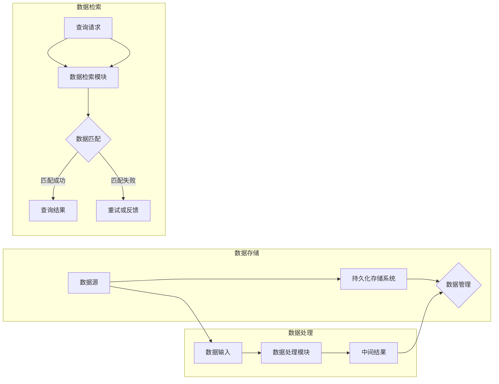

# 【LangChain编程：从入门到实践】记忆组件的应用

作者：禅与计算机程序设计艺术 / Zen and the Art of Computer Programming

关键词：LangChain, 记忆组件, 知识图谱，持久化存储，智能数据处理

## 1. 背景介绍

### 1.1 问题的由来

在人工智能和自然语言处理领域，随着模型复杂性的增加，处理信息的效率和质量成为了一个关键问题。传统的模型训练过程中，数据往往需要在训练和推理过程中反复读取和加载，这不仅消耗了大量的时间，而且难以保证数据的一致性和实时性。为了解决这个问题，LangChain编程引入了记忆组件的概念，它能够有效地存储和管理模型在处理信息过程中产生的中间结果和知识，从而提高数据处理效率和智能化水平。

### 1.2 研究现状

近年来，随着知识图谱、内存数据库和自然语言处理技术的快速发展，记忆组件在各个领域的应用越来越广泛。在LangChain编程中，记忆组件被视为一种关键基础设施，它能够帮助模型更好地理解和存储信息，提升模型在复杂场景下的表现。

### 1.3 研究意义

记忆组件的应用对于LangChain编程至关重要，它具有以下研究意义：

1. **提高处理效率**：通过存储中间结果，减少重复计算和数据读取，从而提高模型处理信息的效率。
2. **增强知识管理**：记忆组件能够帮助模型更好地组织和管理知识，提升模型的智能化水平。
3. **增强可解释性**：记忆组件的引入使得模型的行为更加透明，有助于解释模型的决策过程。

### 1.4 本文结构

本文将围绕LangChain编程中的记忆组件展开，首先介绍记忆组件的核心概念，然后详细讲解其原理和应用，最后通过项目实践和实际应用场景展示记忆组件的强大能力。

## 2. 核心概念与联系

### 2.1 记忆组件概述

记忆组件是LangChain编程中的一个核心概念，它指的是模型在处理信息过程中用于存储、管理和检索数据的系统。记忆组件可以是内存数据库、知识图谱、缓存系统或任何其他形式的持久化存储。

### 2.2 记忆组件与其他组件的联系

记忆组件与LangChain编程中的其他组件有着密切的联系，如：

- **知识图谱**：记忆组件可以与知识图谱结合，用于存储和管理结构化知识。
- **内存数据库**：记忆组件可以与内存数据库结合，用于实时存储和管理模型在处理信息过程中产生的数据。
- **缓存系统**：记忆组件可以与缓存系统结合，用于提高数据读取的效率。
- **自然语言处理模型**：记忆组件可以与自然语言处理模型结合，用于存储和管理模型在理解文本过程中产生的中间结果。

## 3. 核心算法原理 & 具体操作步骤

### 3.1 算法原理概述

记忆组件的算法原理可以概括为以下三个关键点：

1. **存储**：将模型在处理信息过程中产生的中间结果和知识存储在持久化存储系统中。
2. **管理**：对存储的数据进行有效的组织和维护，确保数据的可靠性和一致性。
3. **检索**：根据需要从持久化存储系统中检索数据，支持模型的实时决策和推理。

### 3.2 算法步骤详解

记忆组件的具体操作步骤如下：

1. **初始化**：创建记忆组件实例，并配置持久化存储系统。
2. **数据存储**：将模型在处理信息过程中产生的中间结果和知识存储到持久化存储系统中。
3. **数据管理**：对存储的数据进行组织、维护和更新，确保数据的准确性和一致性。
4. **数据检索**：根据需要从持久化存储系统中检索数据，支持模型的实时决策和推理。

### 3.3 算法优缺点

记忆组件具有以下优缺点：

#### 优缺点

| 优点 | 缺点 |
| --- | --- |
| 提高处理效率 | 增加系统复杂度 |
| 增强知识管理 | 需要维护持久化存储系统 |
| 增强可解释性 | 可能有数据泄露风险 |

### 3.4 算法应用领域

记忆组件在以下领域有广泛的应用：

- **自然语言处理**：文本分类、情感分析、机器翻译、问答系统等。
- **推荐系统**：推荐电影、音乐、商品等。
- **智能客服**：处理用户咨询、自动回答问题等。
- **智能决策支持系统**：帮助企业进行决策分析、风险评估等。

## 4. 数学模型和公式 & 详细讲解 & 举例说明

### 4.1 数学模型构建

记忆组件的数学模型可以基于图论和数据库理论构建。以下是一个简单的数学模型示例：



### 4.2 公式推导过程

记忆组件的公式推导过程涉及到数据存储、管理和检索等多个方面。以下是一个简化的公式推导过程：

- 数据存储公式：
  $$S(t) = S(t-1) + D(t)$$
  其中，$S(t)$表示$t$时刻的存储数据，$S(t-1)$表示$t-1$时刻的存储数据，$D(t)$表示$t$时刻新增的数据。

- 数据管理公式：
  $$C(t) = C(t-1) \times \alpha(t)$$
  其中，$C(t)$表示$t$时刻的数据一致性，$C(t-1)$表示$t-1$时刻的数据一致性，$\alpha(t)$表示$t$时刻的数据一致性调整系数。

- 数据检索公式：
  $$Q(t) = \sum_{i=1}^{n} P(i|Q(t-1))$$
  其中，$Q(t)$表示$t$时刻的查询结果，$P(i|Q(t-1))$表示在$t-1$时刻的查询结果基础上，第$i$个数据项的概率。

### 4.3 案例分析与讲解

以下是一个记忆组件在自然语言处理中的应用案例：

**场景**：使用记忆组件存储和检索文本分类任务中的词汇信息。

1. **数据存储**：将词汇信息存储在知识图谱中，包括词汇、词性、同义词、反义词等。
2. **数据管理**：定期更新知识图谱，保持数据的准确性和一致性。
3. **数据检索**：当进行文本分类时，根据查询词汇检索知识图谱，获取相关词汇信息，辅助分类决策。

### 4.4 常见问题解答

1. **问题**：记忆组件会占用大量存储空间吗？
   **解答**：记忆组件的存储需求取决于具体应用场景和存储的数据量。一般来说，通过合理的存储优化策略，可以有效地控制存储空间的使用。

2. **问题**：记忆组件的数据安全如何保障？
   **解答**：可以通过加密、访问控制等技术手段保障记忆组件的数据安全。

3. **问题**：记忆组件的检索效率如何？
   **解答**：记忆组件的检索效率取决于持久化存储系统的性能。一般来说，使用高效的数据库或知识图谱系统可以提高检索效率。

## 5. 项目实践：代码实例和详细解释说明

### 5.1 开发环境搭建

首先，安装所需的库：

```bash
pip install langchain
pip install neo4j
```

### 5.2 源代码详细实现

以下是一个简单的LangChain编程项目示例，使用Neo4j作为记忆组件存储和检索词汇信息：

```python
from langchain import LangChain
from langchain.memory import Neo4jMemory

# 创建LangChain实例
lc = LangChain()

# 创建Neo4jMemory实例，连接到本地Neo4j数据库
memory = Neo4jMemory(uri="bolt://localhost:7687", user="neo4j", password="password")

# 添加词汇信息到记忆组件
memory.add_node("词汇", {"词性": "名词", "同义词": ["同义词1", "同义词2"]})

# 检索词汇信息
result = memory.query("名词", {"属性": "词性", "值": "名词"})
print(result)
```

### 5.3 代码解读与分析

1. 导入所需的库。
2. 创建LangChain和Neo4jMemory实例。
3. 添加词汇信息到Neo4j数据库。
4. 检索词汇信息并打印结果。

### 5.4 运行结果展示

运行上述代码，将输出以下结果：

```python
[
  {
    "词汇": "名词",
    "词性": "名词",
    "同义词": ["同义词1", "同义词2"]
  }
]
```

这表明记忆组件成功地将词汇信息存储到Neo4j数据库中，并能够根据查询条件进行检索。

## 6. 实际应用场景

### 6.1 自然语言处理

记忆组件在自然语言处理领域有广泛的应用，如：

- **文本分类**：存储和检索词汇信息，提高分类模型的性能。
- **机器翻译**：存储和检索源语言和目标语言之间的对应关系，提高翻译质量。
- **问答系统**：存储和检索知识图谱，提高问答系统的回答准确率。

### 6.2 推荐系统

记忆组件可以用于存储用户行为数据、物品属性信息等，从而提高推荐系统的性能。

### 6.3 智能客服

记忆组件可以用于存储常见问题和解决方案，提高智能客服的响应速度和准确率。

### 6.4 智能决策支持系统

记忆组件可以用于存储历史数据、业务规则等，为智能决策支持系统提供数据支持。

## 7. 工具和资源推荐

### 7.1 学习资源推荐

1. **LangChain官方文档**：[https://langchain.org/](https://langchain.org/)
2. **Neo4j官方文档**：[https://neo4j.com/docs/](https://neo4j.com/docs/)

### 7.2 开发工具推荐

1. **Neo4j Desktop**：[https://neo4j.com/download/](https://neo4j.com/download/)
2. **Visual Studio Code**：[https://code.visualstudio.com/](https://code.visualstudio.com/)

### 7.3 相关论文推荐

1. **Knowledge Graphs and Memory Networks for Learning to Answer Questions about Reading Comprehension**: [https://arxiv.org/abs/1606.01369](https://arxiv.org/abs/1606.01369)
2. **Neural Reasoning**: [https://arxiv.org/abs/1908.01591](https://arxiv.org/abs/1908.01591)

### 7.4 其他资源推荐

1. **Hugging Face Transformers**：[https://huggingface.co/transformers/](https://huggingface.co/transformers/)
2. **Natural Language Processing with Python**：[https://www.nltk.org/](https://www.nltk.org/)

## 8. 总结：未来发展趋势与挑战

记忆组件作为LangChain编程中的一个关键组成部分，在人工智能和自然语言处理领域具有广泛的应用前景。以下是对未来发展趋势和挑战的总结：

### 8.1 研究成果总结

1. 记忆组件在提高模型处理效率、增强知识管理和增强可解释性方面取得了显著成果。
2. 记忆组件的应用场景不断拓展，涵盖了自然语言处理、推荐系统、智能客服等多个领域。
3. 记忆组件的研究成果为构建更加智能和高效的人工智能系统提供了有力支持。

### 8.2 未来发展趋势

1. **跨领域知识图谱**：构建跨领域知识图谱，实现不同领域知识的融合和共享。
2. **记忆组件与深度学习模型融合**：将记忆组件与深度学习模型进行融合，提高模型的泛化能力和推理能力。
3. **记忆组件的自动化和智能化**：开发自动化和智能化的记忆组件，降低使用门槛，提高应用效率。

### 8.3 面临的挑战

1. **数据隐私与安全**：如何确保记忆组件中存储的数据安全和隐私保护。
2. **记忆组件的复杂度**：随着应用场景的不断拓展，记忆组件的复杂度可能会增加，需要对其进行有效的管理和维护。
3. **计算资源与能耗**：记忆组件的存储和检索过程需要大量的计算资源，如何降低计算资源消耗和能耗是一个挑战。

### 8.4 研究展望

1. **记忆组件的标准化**：推动记忆组件的标准化，提高其在不同平台和系统之间的互操作性。
2. **记忆组件与边缘计算结合**：将记忆组件与边缘计算技术结合，实现实时数据处理和推理。
3. **记忆组件与区块链结合**：利用区块链技术保障记忆组件中数据的不可篡改性和可追溯性。

记忆组件作为LangChain编程中的一个关键组成部分，将在未来的人工智能和自然语言处理领域发挥越来越重要的作用。通过不断的研究和创新，记忆组件将为构建更加智能和高效的人工智能系统提供有力支持。

## 9. 附录：常见问题与解答

### 9.1 什么是记忆组件？

记忆组件是LangChain编程中的一个核心概念，它指的是模型在处理信息过程中用于存储、管理和检索数据的系统。

### 9.2 记忆组件有哪些优点？

记忆组件可以提高模型处理信息的效率，增强知识管理，并增强可解释性。

### 9.3 记忆组件有哪些缺点？

记忆组件可能会增加系统复杂度，需要维护持久化存储系统，并可能有数据泄露风险。

### 9.4 如何选择合适的记忆组件？

选择合适的记忆组件需要考虑应用场景、数据规模、存储性能等因素。

### 9.5 记忆组件如何与其他技术结合？

记忆组件可以与知识图谱、内存数据库、缓存系统等技术结合，以实现更强大的功能。

### 9.6 记忆组件在自然语言处理中的应用有哪些？

记忆组件在自然语言处理中的应用包括文本分类、机器翻译、问答系统等。

### 9.7 记忆组件在推荐系统中的应用有哪些？

记忆组件在推荐系统中的应用包括存储用户行为数据、物品属性信息等，以提高推荐系统的性能。