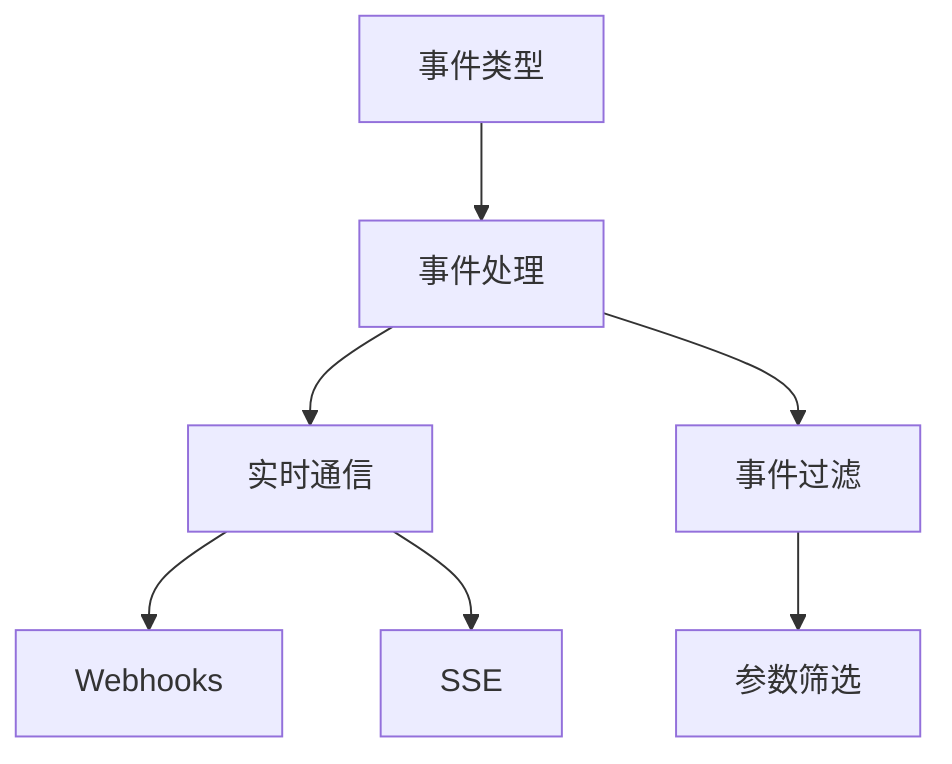

                 

# 【LangChain编程：从入门到实践】构建Slack事件接口

## 1. 背景介绍

在当今数字化时代，企业内部和外部的沟通效率至关重要。Slack作为一种流行的团队协作工具，其事件接口为开发人员提供了丰富而灵活的API，使得与Slack的无缝集成成为可能。本文将从Slack事件接口的原理和实现出发，带领读者深入了解如何构建适用于企业内外沟通的Slack事件处理系统。

### 1.1 问题由来

随着企业数字化转型加速，沟通工具如Slack已经成为不可或缺的沟通平台。Slack不仅支持文本聊天，还提供了丰富的事件接口，允许第三方应用监听事件并做出响应。通过事件驱动的方式，Slack能够无缝集成到企业的自动化流程中，提升沟通和协作效率。

然而，构建一个可靠、高效且易于维护的Slack事件处理系统，对于很多开发者来说仍然是一项挑战。为此，本文将详细介绍Slack事件接口的核心概念、实现原理和最佳实践，帮助读者掌握构建Slack事件处理系统的关键步骤。

### 1.2 问题核心关键点

Slack事件接口的核心关键点包括：

1. **事件类型（Event Types）**：Slack事件接口支持多种类型的事件，包括消息发送、用户加入/离开、频道创建/删除等。
2. **事件处理（Event Handling）**：通过定义回调函数，开发人员可以捕获并响应Slack事件。
3. **实时通信（Real-time Communication）**：Slack提供实时通信功能，使得事件处理可以即时生效。
4. **事件过滤（Event Filtering）**：通过参数筛选，可以精确控制事件处理的触发条件。

掌握这些关键点，可以构建出高效、灵活的Slack事件处理系统，提升企业沟通效率，优化业务流程。

## 2. 核心概念与联系

### 2.1 核心概念概述

Slack事件接口的核心概念包括事件类型、事件处理、实时通信和事件过滤。这些概念相互关联，共同构成了Slack事件处理的完整框架。

1. **事件类型（Event Types）**：
   - **用户消息（Message）**：当用户发送消息时触发。
   - **用户加入/离开（UserJoined/Left）**：当用户加入或离开频道时触发。
   - **频道创建/删除（ChannelCreated/Destroyed）**：当频道创建或删除时触发。
   - **其他事件（如Error、FileShare等）**。

2. **事件处理（Event Handling）**：
   - **回调函数（Callback Functions）**：用于处理事件的程序，接收事件参数并执行相关操作。
   - **事件处理器（Event Handlers）**：封装事件处理的组件，可以通过注入事件参数来执行回调函数。

3. **实时通信（Real-time Communication）**：
   - **Webhooks**：将事件数据推送到第三方应用，实现实时通信。
   - **SSE（Server-Sent Events）**：服务器推送实时数据到客户端，用于处理大规模实时事件。

4. **事件过滤（Event Filtering）**：
   - **参数筛选（Parameters Filtering）**：通过指定参数，可以过滤事件，只处理特定条件的事件。

### 2.2 概念间的关系

这些核心概念之间的关系可以通过以下Mermaid流程图来展示：



这个流程图展示了大语言模型微调过程中各个核心概念的关系：

1. 事件类型通过事件处理进行响应。
2. 事件处理可以通过实时通信的方式，如Webhooks和SSE，将事件数据推送到第三方应用。
3. 事件处理还可以通过参数筛选来过滤事件，只处理特定条件的事件。

这些概念共同构成了Slack事件接口的完整生态系统，使得开发者能够灵活地构建出高效、可扩展的Slack事件处理系统。

## 3. 核心算法原理 & 具体操作步骤

### 3.1 算法原理概述

Slack事件接口的算法原理基于事件驱动模型。开发人员通过定义回调函数，注册到Slack事件管理器中，当Slack服务器检测到特定事件时，会自动调用相应的事件处理程序。事件处理程序根据事件的参数，执行所需的操作，并可以进一步触发其他事件或回调函数。

### 3.2 算法步骤详解

构建Slack事件接口的关键步骤包括：

1. **创建Slack应用**：在Slack应用管理界面中，创建新应用，并设置Webhook URL。
2. **定义事件处理器**：根据业务需求，定义事件处理器函数，接收事件参数并执行相关操作。
3. **注册事件处理器**：将事件处理器函数注册到Slack事件管理器中，指定触发条件。
4. **处理实时事件**：通过Webhooks或SSE实时获取Slack事件，调用事件处理器函数进行响应。
5. **优化事件处理**：对事件处理程序进行性能优化，如使用缓存、异步处理等技术，提高系统效率。

### 3.3 算法优缺点

Slack事件接口的优点包括：

- **灵活性**：通过事件类型和参数筛选，可以灵活定制事件处理逻辑。
- **实时性**：支持实时通信，可以即时处理Slack事件。
- **可扩展性**：可以处理大规模实时事件，扩展性强。

其缺点主要包括：

- **安全性**：Webhooks和SSE的密钥管理不完善，容易遭受攻击。
- **复杂性**：事件类型和参数筛选的配置较为复杂，需要一定的开发经验。

### 3.4 算法应用领域

Slack事件接口广泛用于企业内外沟通场景，包括但不限于：

- **内部协作**：用于监控内部沟通，优化团队协作流程。
- **客户支持**：实时响应客户查询，提升客户满意度。
- **数据集成**：将Slack事件与企业内部系统集成，实现自动化数据收集和处理。
- **安全监控**：监控Slack活动，及时发现异常行为，保障企业安全。

## 4. 数学模型和公式 & 详细讲解  
### 4.1 数学模型构建

Slack事件接口的核心模型包括事件类型、事件处理、实时通信和事件过滤。以下是一个简单的事件处理模型的数学表达式：

假设事件类型为 $Event$，事件处理函数为 $Function$，实时通信方式为 $Communication$，事件过滤条件为 $Filter$。则事件处理的数学模型可以表示为：

$$
Response = \begin{cases}
Function(Event) & \text{if } Filter(Event) = true \\
N/A & \text{otherwise}
\end{cases}
$$

其中，$Filter(Event)$ 表示事件 $Event$ 是否符合过滤条件。

### 4.2 公式推导过程

事件处理的公式推导主要涉及事件类型、事件处理函数和事件过滤条件的关系。以消息发送事件为例，其数学模型可以表示为：

$$
Message = \begin{cases}
Function(Msg) & \text{if } Filter(Msg) = true \\
N/A & \text{otherwise}
\end{cases}
$$

其中，$Msg$ 表示消息内容，$Function(Msg)$ 表示消息处理函数，$Filter(Msg)$ 表示消息过滤条件。

### 4.3 案例分析与讲解

假设我们希望构建一个监控Slack消息的应用。根据业务需求，我们可以定义以下事件处理函数：

```python
def process_message(event):
    # 提取消息内容
    msg = event['text']
    # 判断是否为关键字
    if 'error' in msg:
        # 处理错误消息
        send_alert('Error detected in Slack: {}'.format(msg))
```

在事件处理程序中，我们首先提取消息内容，判断是否包含关键字 "error"，如果是则发送报警消息。

## 5. 项目实践：代码实例和详细解释说明

### 5.1 开发环境搭建

构建Slack事件处理系统的开发环境需要安装Python、Flask和Slack SDK等工具。以下是在Linux系统上安装所需工具的命令：

```bash
# 安装Python
sudo apt-get install python3 python3-pip

# 安装Flask
pip3 install flask

# 安装Slack SDK
pip3 install slack-sdk
```

### 5.2 源代码详细实现

以下是一个基本的Slack事件处理系统的实现示例：

```python
from flask import Flask, request
import slack

app = Flask(__name__)
slack_token = 'YOUR_SLACK_API_TOKEN'
slack_channel = 'YOUR_SLACK_CHANNEL_ID'

@app.route('/webhook', methods=['POST'])
def handle_slack_event():
    event = request.json
    event_type = event['type']
    
    if event_type == 'message':
        msg = event['text']
        if 'error' in msg:
            send_alert('Error detected in Slack: {}'.format(msg))
    
    return 'OK'

if __name__ == '__main__':
    app.run(host='0.0.0.0', port=5000)
```

在代码中，我们定义了一个Flask应用，接收Slack发送的Webhook事件。当接收到类型为 "message" 的事件时，我们提取消息内容，判断是否包含关键字 "error"，如果是则发送报警消息。

### 5.3 代码解读与分析

代码中，我们使用Flask框架搭建了一个简单的Web应用，用于接收和处理Slack事件。Flask的优点包括易用性和可扩展性，适合处理Web请求。

在代码中，我们首先导入Flask、Slack SDK等库，并定义了一个Flask应用。在应用中，我们定义了一个路由函数 `handle_slack_event`，用于处理Slack事件。当收到类型为 "message" 的事件时，我们提取消息内容，判断是否包含关键字 "error"，如果是则调用 `send_alert` 函数发送报警消息。

### 5.4 运行结果展示

假设我们已经设置了Slack应用，并将Webhook URL设置为 `http://localhost:5000/webhook`。当Slack中发送包含关键字 "error" 的消息时，我们可以看到报警消息被发送到指定的频道。

## 6. 实际应用场景

### 6.1 内部协作

Slack事件接口在企业内部协作中的应用场景包括监控内部沟通、优化团队协作流程等。通过事件处理，可以实时监控团队活动，及时发现异常行为，优化工作流程。

### 6.2 客户支持

在客户支持场景中，Slack事件接口可以用于监控客户查询，自动响应客户请求，提升客户满意度。例如，当客户发送包含关键字的查询时，系统可以自动回复解决方案。

### 6.3 数据集成

Slack事件接口还可以用于将Slack事件与企业内部系统集成，实现自动化数据收集和处理。例如，当团队成员在Slack中分享项目进展时，系统可以自动提取相关信息，更新项目状态。

### 6.4 安全监控

在安全监控场景中，Slack事件接口可以监控Slack活动，及时发现异常行为，保障企业安全。例如，当检测到团队成员在Slack中分享敏感信息时，系统可以自动进行安全提醒或阻止分享。

## 7. 工具和资源推荐

### 7.1 学习资源推荐

为了帮助开发者深入了解Slack事件接口，以下是一些优质的学习资源：

1. **Slack官方文档**：Slack提供的官方文档详细介绍了事件类型、事件处理和实时通信的实现方法，是学习Slack事件接口的重要参考资料。
2. **Flask官方文档**：Flask官方文档介绍了Flask框架的用法和最佳实践，适合入门开发者。
3. **Slack SDK文档**：Slack SDK提供了详细的API文档，包括事件处理和实时通信的实现方法。
4. **Slack事件接口实战教程**：各大技术博客和视频平台提供了丰富的Slack事件接口实战教程，适合实践学习。

通过这些学习资源，可以全面掌握Slack事件接口的核心概念和实现方法。

### 7.2 开发工具推荐

构建Slack事件接口的开发工具包括：

1. **Flask**：轻量级的Python Web框架，适合处理Web请求。
2. **Python**：强大的编程语言，支持丰富的第三方库和工具。
3. **Slack SDK**：Slack提供的Python SDK，支持事件处理和实时通信。

这些工具可以帮助开发者快速构建Slack事件处理系统，提升开发效率。

### 7.3 相关论文推荐

Slack事件接口的研究涉及广泛的主题，以下是几篇具有代表性的相关论文：

1. **Building Secure and Scalable Event-driven Slack Bots**：介绍了一种基于Slack事件驱动的聊天机器人系统，解决了安全和扩展性问题。
2. **Slack Events and Webhooks for Real-time Communication**：讨论了Slack事件和Webhooks在实时通信中的应用，并提供了一些最佳实践。
3. **Slack Event-based System for Data Collection**：介绍了一种基于Slack事件的数据收集系统，通过事件处理实现自动化数据收集。

这些论文提供了丰富的技术洞见和实现方法，值得深入学习。

## 8. 总结：未来发展趋势与挑战

### 8.1 研究成果总结

Slack事件接口已经成为企业数字化转型的重要工具。通过事件驱动的方式，Slack实现了实时通信和自动化处理，提升了企业协作效率。未来，Slack事件接口将继续发展，提升实时性和安全性，拓展更多应用场景。

### 8.2 未来发展趋势

Slack事件接口的未来发展趋势包括：

1. **实时性增强**：随着计算能力的提升，Slack事件接口的实时性将进一步增强，支持更多大规模实时事件处理。
2. **安全性提升**：通过引入更多的安全机制，如加密传输、权限控制等，提升Slack事件接口的安全性。
3. **跨平台支持**：支持更多平台和设备，使得Slack事件接口更加通用和灵活。

### 8.3 面临的挑战

Slack事件接口在应用过程中仍面临一些挑战：

1. **安全性问题**：Webhooks和SSE的密钥管理不完善，容易遭受攻击。
2. **复杂性问题**：事件类型和参数筛选的配置较为复杂，需要一定的开发经验。
3. **实时性问题**：在大规模事件处理时，实时性可能受到影响。

### 8.4 研究展望

未来，Slack事件接口的研究方向包括：

1. **安全性优化**：引入更多的安全机制，如加密传输、权限控制等，提升Slack事件接口的安全性。
2. **实时性优化**：通过优化事件处理逻辑和资源管理，提升Slack事件接口的实时性。
3. **跨平台支持**：支持更多平台和设备，使得Slack事件接口更加通用和灵活。

## 9. 附录：常见问题与解答

**Q1：Slack事件接口的Webhook URL如何生成？**

A: Slack提供了生成Webhook URL的工具，可以通过应用管理界面生成。在创建新应用后，进入“Integrations”选项卡，点击“Add New Integration”，选择“Incoming Webhooks”，即可生成Webhook URL。

**Q2：如何在Slack中监控特定事件？**

A: 在Slack应用管理界面中，进入“Integrations”选项卡，选择“Events”，配置需要监控的事件类型和参数筛选条件。保存配置后，Slack将自动发送事件到Webhook URL，触发事件处理程序。

**Q3：如何处理大规模实时事件？**

A: 在处理大规模实时事件时，可以考虑使用缓存、异步处理等技术，提高系统效率。例如，使用Redis等缓存系统，可以减少对数据库的频繁访问，提高响应速度。

通过这些常见问题的解答，可以帮助开发者更好地理解Slack事件接口的核心概念和实现方法，提升开发效率和系统性能。

---

作者：禅与计算机程序设计艺术 / Zen and the Art of Computer Programming

