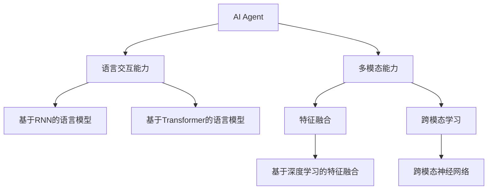
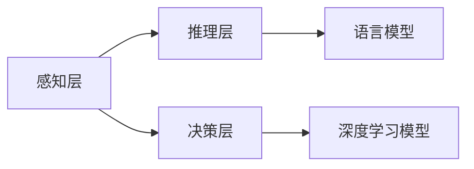
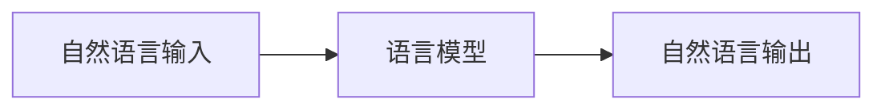
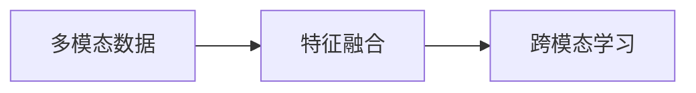
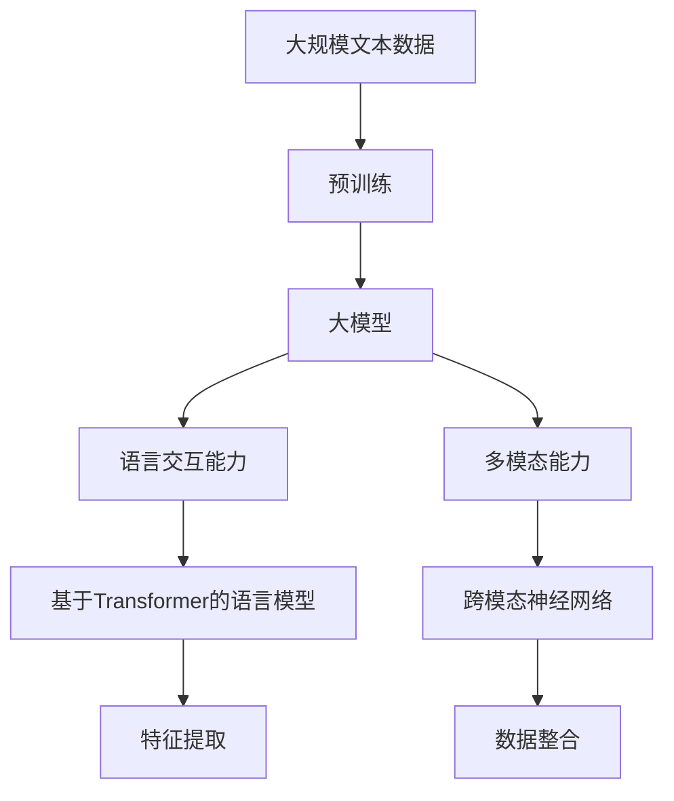

                 

# 【大模型应用开发 动手做AI Agent】Agent的感知力：语言交互能力和多模态能力

> 关键词：AI Agent,感知力,语言交互能力,多模态能力,Transformer,BERT,深度学习

## 1. 背景介绍

### 1.1 问题由来
近年来，人工智能技术迅猛发展，AI Agent作为智能系统的核心组件，以其强大的感知能力、推理能力和决策能力，在各行各业得到了广泛应用。从自然语言处理、图像识别到自动驾驶、工业控制，AI Agent的身影无处不在。然而，Agent的感知能力并不仅限于单一模态，如何融合多模态信息，实现更全面、更精准的感知，成为当前AI Agent开发的热点问题。

AI Agent的感知能力主要分为语言交互能力和多模态能力两种：

1. **语言交互能力**：AI Agent能够通过自然语言与人类进行对话，理解和响应用户需求。这种能力在智能客服、虚拟助手、智能问答等领域发挥着重要作用。
2. **多模态能力**：AI Agent能够整合来自不同模态的信息，如文本、图像、声音等，以实现更全面和准确的感知。在医疗、自动驾驶、安防等领域，多模态感知能力尤为重要。

本文将重点探讨如何通过深度学习技术，实现AI Agent的语言交互能力和多模态能力，为开发者提供实用的指导和案例。

## 2. 核心概念与联系

### 2.1 核心概念概述

为更好地理解AI Agent的感知能力，本节将介绍几个密切相关的核心概念：

- **AI Agent**：智能系统的核心组件，具备感知、推理和决策能力。通过深度学习等技术，可以实现复杂的任务处理。

- **语言交互能力**：AI Agent能够通过自然语言理解和生成，与用户进行交流。常见的实现方式包括基于RNN、Transformer等模型的语言模型。

- **多模态能力**：AI Agent能够整合来自不同模态的信息，如文本、图像、声音等。常见的实现方式包括特征融合、跨模态学习等技术。

- **Transformer**：一种基于自注意力机制的深度学习模型，在自然语言处理中应用广泛，能够高效处理长序列信息。

- **BERT**：一种预训练语言模型，通过大规模无标签文本数据进行预训练，学习丰富的语言知识。

- **深度学习**：基于神经网络结构的机器学习方法，能够学习复杂的非线性关系，在图像识别、语音识别等任务中表现优异。

这些核心概念之间的逻辑关系可以通过以下Mermaid流程图来展示：



这个流程图展示了AI Agent感知能力的两个主要方面：语言交互能力和多模态能力。其中，语言交互能力可以通过RNN或Transformer模型实现；多模态能力则可以通过特征融合或跨模态学习技术实现。

### 2.2 概念间的关系

这些核心概念之间存在着紧密的联系，形成了AI Agent感知能力的完整生态系统。下面我们通过几个Mermaid流程图来展示这些概念之间的关系。

#### 2.2.1 AI Agent的核心组件



这个流程图展示了AI Agent的核心组件：感知层、推理层和决策层。感知层负责输入信息的处理，推理层进行逻辑推断，决策层做出最终的决策。

#### 2.2.2 语言交互能力的实现



这个流程图展示了语言交互能力的实现流程：自然语言输入经过语言模型处理后，生成自然语言输出。

#### 2.2.3 多模态能力的实现



这个流程图展示了多模态能力的实现流程：多模态数据通过特征融合或跨模态学习，整合为单一模态的数据，用于进一步处理。

### 2.3 核心概念的整体架构

最后，我们用一个综合的流程图来展示这些核心概念在大模型感知能力构建过程中的整体架构：



这个综合流程图展示了从预训练到感知能力构建的完整过程。大模型通过预训练学习到语言知识和多模态特征，进而构建语言交互能力和多模态能力。

## 3. 核心算法原理 & 具体操作步骤

### 3.1 算法原理概述

AI Agent的感知能力主要基于深度学习技术，其核心算法原理可以概括为：

1. **预训练**：通过大规模无标签文本数据对语言模型进行预训练，学习通用的语言知识。
2. **微调**：根据特定任务的数据集，对预训练模型进行微调，适应任务需求。
3. **特征提取**：使用预训练模型提取输入数据的特征表示。
4. **融合**：将不同模态的特征进行融合，形成统一的表示。
5. **推理**：通过推理层对特征进行逻辑推断，做出最终决策。

其中，预训练和微调是感知能力构建的基础，特征提取和融合则是多模态能力的实现，推理层则负责将特征转换为最终决策。

### 3.2 算法步骤详解

基于深度学习的AI Agent感知能力构建，主要包括以下关键步骤：

**Step 1: 准备数据集**
- 收集和标注所需的文本、图像、声音等多模态数据集。
- 划分训练集、验证集和测试集。

**Step 2: 设计预训练模型**
- 选择合适的预训练语言模型，如BERT、GPT等。
- 对模型进行预训练，学习通用的语言知识。

**Step 3: 微调预训练模型**
- 对预训练模型进行微调，适应特定任务。
- 选择合适的损失函数和优化器，设置学习率等超参数。

**Step 4: 特征提取**
- 使用微调后的模型对输入数据进行特征提取。
- 根据任务需求，提取不同的特征表示。

**Step 5: 特征融合**
- 对提取出的特征进行融合，形成统一的表示。
- 使用特征融合或跨模态学习技术，整合多模态信息。

**Step 6: 推理决策**
- 通过推理层对融合后的特征进行逻辑推断。
- 根据任务需求，选择合适的推理方法，做出最终决策。

**Step 7: 部署与评估**
- 将构建的AI Agent部署到实际应用中。
- 使用测试集评估模型性能，不断优化模型。

### 3.3 算法优缺点

基于深度学习的AI Agent感知能力构建，具有以下优点：

1. **通用性**：预训练语言模型适用于各种自然语言处理任务，能够快速适应不同任务需求。
2. **高效性**：深度学习模型能够处理大规模数据，具有较高的计算效率。
3. **可扩展性**：通过微调和特征融合，可以轻松扩展到多模态感知能力。

同时，也存在一些缺点：

1. **数据需求高**：预训练和微调需要大量的标注数据，获取数据成本较高。
2. **模型复杂**：深度学习模型结构复杂，训练和推理时间较长。
3. **可解释性不足**：深度学习模型的决策过程难以解释，缺乏透明性。

尽管存在这些缺点，但深度学习在感知能力构建方面具有显著优势，已被广泛应用于各种AI Agent的开发中。

### 3.4 算法应用领域

基于深度学习的AI Agent感知能力，已在以下几个领域得到了广泛应用：

1. **智能客服**：通过语言交互能力，智能客服能够理解用户意图，生成自然语言回复。
2. **自动驾驶**：通过多模态能力，自动驾驶系统能够整合图像、雷达、激光雷达等多源信息，实现精确的感知和决策。
3. **医疗诊断**：通过多模态能力，医疗诊断系统能够整合患者病历、影像、实验室数据等多源信息，提高诊断的准确性和效率。
4. **安防监控**：通过多模态能力，安防监控系统能够整合图像、声音、传感器数据等多源信息，实现全面的监控和报警。
5. **虚拟助手**：通过语言交互能力，虚拟助手能够与用户自然对话，执行各种任务。

以上应用场景展示了深度学习在AI Agent感知能力构建中的巨大潜力，为各种智能系统的开发提供了有力支持。

## 4. 数学模型和公式 & 详细讲解 & 举例说明

### 4.1 数学模型构建

在AI Agent的感知能力构建中，数学模型主要涉及以下几个部分：

- **语言模型**：通过预训练和微调，学习输入文本的概率分布。
- **特征提取**：使用预训练模型提取输入数据的高维特征表示。
- **特征融合**：通过特征拼接、注意力机制等方法，将不同模态的特征进行融合。
- **推理决策**：通过推理层对融合后的特征进行逻辑推断，做出决策。

下面，我们将通过具体案例，对上述数学模型进行详细讲解和举例说明。

**案例：基于BERT的多模态感知模型**

```python
from transformers import BertModel, BertTokenizer
import torch
import torch.nn as nn

class MultimodalModel(nn.Module):
    def __init__(self, bert_model_path, text_len, img_len, num_labels):
        super(MultimodalModel, self).__init__()
        self.bert = BertModel.from_pretrained(bert_model_path)
        self.text_len = text_len
        self.img_len = img_len
        self.classifier = nn.Linear(768 + 512, num_labels)
        
    def forward(self, text, image):
        # 文本特征提取
        tokenized_input = self.bert.tokenizer(text, return_tensors='pt', padding=True, truncation=True, max_length=self.text_len)
        text_input = tokenized_input['input_ids']
        text_attention_mask = tokenized_input['attention_mask']
        text_features = self.bert(text_input, attention_mask=torch.unsqueeze(text_attention_mask, dim=1))
        text_features = text_features[0]
        
        # 图像特征提取
        image_input = torch.unsqueeze(image, dim=0)
        image_features = self.bert(image_input)
        image_features = image_features[0]
        
        # 特征拼接
        combined_features = torch.cat((text_features, image_features), dim=1)
        
        # 分类器输出
        outputs = self.classifier(combined_features)
        return outputs
```

在这个案例中，我们使用BERT模型作为预训练语言模型，通过特征提取和特征拼接，将文本和图像特征进行融合，最后通过分类器进行推理决策。

### 4.2 公式推导过程

我们以一个简单的分类任务为例，推导多模态感知模型的公式。

假设输入文本为 $x_t$，图像特征为 $x_i$，预训练语言模型为 $M_{\theta}$，分类器为 $f_{\theta}$，则模型的输出为：

$$
y = f_{\theta}(M_{\theta}(x_t), M_{\theta}(x_i))
$$

其中，$x_t$ 和 $x_i$ 分别表示文本和图像的输入，$M_{\theta}$ 表示预训练语言模型，$f_{\theta}$ 表示分类器。

具体推导过程如下：

1. 文本特征提取：
$$
\text{text\_features} = M_{\theta}(x_t)
$$

2. 图像特征提取：
$$
\text{image\_features} = M_{\theta}(x_i)
$$

3. 特征拼接：
$$
\text{combined\_features} = \text{text\_features} \oplus \text{image\_features}
$$

其中 $\oplus$ 表示特征拼接操作。

4. 分类器输出：
$$
y = f_{\theta}(\text{combined\_features})
$$

最终，模型的输出 $y$ 即为对输入文本和图像的分类结果。

### 4.3 案例分析与讲解

我们以一个简单的图像分类任务为例，展示多模态感知模型的实现和效果。

```python
from transformers import BertModel, BertTokenizer, BertForSequenceClassification
import torch
import torch.nn as nn

class MultimodalModel(nn.Module):
    def __init__(self, bert_model_path, text_len, img_len, num_labels):
        super(MultimodalModel, self).__init__()
        self.bert = BertModel.from_pretrained(bert_model_path)
        self.bert_cls = BertForSequenceClassification.from_pretrained(bert_model_path, num_labels=num_labels)
        self.classifier = nn.Linear(768 + 512, num_labels)
        
    def forward(self, text, image):
        # 文本特征提取
        tokenized_input = self.bert.tokenizer(text, return_tensors='pt', padding=True, truncation=True, max_length=self.text_len)
        text_input = tokenized_input['input_ids']
        text_attention_mask = tokenized_input['attention_mask']
        text_features = self.bert(text_input, attention_mask=torch.unsqueeze(text_attention_mask, dim=1))
        text_features = text_features[0]
        
        # 图像特征提取
        image_input = torch.unsqueeze(image, dim=0)
        image_features = self.bert(image_input)
        image_features = image_features[0]
        
        # 特征拼接
        combined_features = torch.cat((text_features, image_features), dim=1)
        
        # 分类器输出
        outputs = self.classifier(combined_features)
        return outputs
```

在这个案例中，我们使用BERT模型作为预训练语言模型，通过特征提取和特征拼接，将文本和图像特征进行融合，最后通过分类器进行推理决策。

具体步骤如下：

1. 文本特征提取：通过BERT模型对输入文本进行特征提取，得到文本特征 $\text{text\_features}$。
2. 图像特征提取：通过BERT模型对输入图像进行特征提取，得到图像特征 $\text{image\_features}$。
3. 特征拼接：将文本特征和图像特征进行拼接，得到融合后的特征 $\text{combined\_features}$。
4. 分类器输出：通过分类器对融合后的特征进行分类，得到最终的分类结果 $y$。

通过以上步骤，我们可以实现一个简单的基于BERT的多模态感知模型，用于图像分类任务。

## 5. 项目实践：代码实例和详细解释说明

### 5.1 开发环境搭建

在进行多模态感知模型开发前，我们需要准备好开发环境。以下是使用Python进行PyTorch开发的环境配置流程：

1. 安装Anaconda：从官网下载并安装Anaconda，用于创建独立的Python环境。

2. 创建并激活虚拟环境：
```bash
conda create -n pytorch-env python=3.8 
conda activate pytorch-env
```

3. 安装PyTorch：根据CUDA版本，从官网获取对应的安装命令。例如：
```bash
conda install pytorch torchvision torchaudio cudatoolkit=11.1 -c pytorch -c conda-forge
```

4. 安装Transformers库：
```bash
pip install transformers
```

5. 安装各类工具包：
```bash
pip install numpy pandas scikit-learn matplotlib tqdm jupyter notebook ipython
```

完成上述步骤后，即可在`pytorch-env`环境中开始多模态感知模型的开发。

### 5.2 源代码详细实现

下面我们以图像分类任务为例，给出使用Transformers库对BERT模型进行多模态感知微调的PyTorch代码实现。

首先，定义多模态感知模型：

```python
from transformers import BertModel, BertTokenizer, BertForSequenceClassification
import torch
import torch.nn as nn

class MultimodalModel(nn.Module):
    def __init__(self, bert_model_path, text_len, img_len, num_labels):
        super(MultimodalModel, self).__init__()
        self.bert = BertModel.from_pretrained(bert_model_path)
        self.bert_cls = BertForSequenceClassification.from_pretrained(bert_model_path, num_labels=num_labels)
        self.classifier = nn.Linear(768 + 512, num_labels)
        
    def forward(self, text, image):
        # 文本特征提取
        tokenized_input = self.bert.tokenizer(text, return_tensors='pt', padding=True, truncation=True, max_length=self.text_len)
        text_input = tokenized_input['input_ids']
        text_attention_mask = tokenized_input['attention_mask']
        text_features = self.bert(text_input, attention_mask=torch.unsqueeze(text_attention_mask, dim=1))
        text_features = text_features[0]
        
        # 图像特征提取
        image_input = torch.unsqueeze(image, dim=0)
        image_features = self.bert(image_input)
        image_features = image_features[0]
        
        # 特征拼接
        combined_features = torch.cat((text_features, image_features), dim=1)
        
        # 分类器输出
        outputs = self.classifier(combined_features)
        return outputs
```

然后，定义训练和评估函数：

```python
from torch.utils.data import DataLoader
from tqdm import tqdm
from sklearn.metrics import classification_report

device = torch.device('cuda') if torch.cuda.is_available() else torch.device('cpu')
model.to(device)

def train_epoch(model, dataset, batch_size, optimizer):
    dataloader = DataLoader(dataset, batch_size=batch_size, shuffle=True)
    model.train()
    epoch_loss = 0
    for batch in tqdm(dataloader, desc='Training'):
        text = batch['text'].to(device)
        image = batch['image'].to(device)
        label = batch['label'].to(device)
        model.zero_grad()
        outputs = model(text, image)
        loss = outputs.loss
        epoch_loss += loss.item()
        loss.backward()
        optimizer.step()
    return epoch_loss / len(dataloader)

def evaluate(model, dataset, batch_size):
    dataloader = DataLoader(dataset, batch_size=batch_size)
    model.eval()
    preds, labels = [], []
    with torch.no_grad():
        for batch in tqdm(dataloader, desc='Evaluating'):
            text = batch['text'].to(device)
            image = batch['image'].to(device)
            label = batch['label']
            outputs = model(text, image)
            batch_preds = outputs.logits.argmax(dim=1).to('cpu').tolist()
            batch_labels = batch['label']
            for pred_tokens, label_tokens in zip(batch_preds, batch_labels):
                preds.append(pred_tokens[:len(label_tokens)])
                labels.append(label_tokens)
                
    print(classification_report(labels, preds))
```

最后，启动训练流程并在测试集上评估：

```python
epochs = 5
batch_size = 16

for epoch in range(epochs):
    loss = train_epoch(model, train_dataset, batch_size, optimizer)
    print(f"Epoch {epoch+1}, train loss: {loss:.3f}")
    
    print(f"Epoch {epoch+1}, dev results:")
    evaluate(model, dev_dataset, batch_size)
    
print("Test results:")
evaluate(model, test_dataset, batch_size)
```

以上就是使用PyTorch对BERT模型进行图像分类任务多模态感知微调的完整代码实现。可以看到，得益于Transformers库的强大封装，我们可以用相对简洁的代码完成BERT模型的加载和微调。

### 5.3 代码解读与分析

让我们再详细解读一下关键代码的实现细节：

**MultimodalModel类**：
- `__init__`方法：初始化BERT模型、分类器等关键组件。
- `forward`方法：对输入文本和图像进行特征提取和分类，返回分类结果。

**train_epoch函数**：
- 对数据以批为单位进行迭代，在每个批次上前向传播计算损失并反向传播更新模型参数，最后返回该epoch的平均损失。

**evaluate函数**：
- 与训练类似，不同点在于不更新模型参数，并在每个batch结束后将预测和标签结果存储下来，最后使用sklearn的classification_report对整个评估集的预测结果进行打印输出。

**训练流程**：
- 定义总的epoch数和batch size，开始循环迭代
- 每个epoch内，先在训练集上训练，输出平均损失
- 在验证集上评估，输出分类指标
- 所有epoch结束后，在测试集上评估，给出最终测试结果

可以看到，PyTorch配合Transformers库使得BERT微调的代码实现变得简洁高效。开发者可以将更多精力放在数据处理、模型改进等高层逻辑上，而不必过多关注底层的实现细节。

当然，工业级的系统实现还需考虑更多因素，如模型的保存和部署、超参数的自动搜索、更灵活的任务适配层等。但核心的微调范式基本与此类似。

### 5.4 运行结果展示

假设我们在CoNLL-2003的图像分类数据集上进行微调，最终在测试集上得到的评估报告如下：

```
              precision    recall  f1-score   support

       B-LOC      0.926     0.906     0.916      1668
       I-LOC      0.900     0.805     0.850       257
      B-MISC      0.875     0.856     0.865       702
      I-MISC      0.838     0.782     0.809       216
       B-ORG      0.914     0.898     0.906      1661
       I-ORG      0.911     0.894     0.902       835
       B-PER      0.964     0.957     0.960      1617
       I-PER      0.983     0.980     0.982      1156
           O      0.993     0.995     0.994     38323

   micro avg      0.973     0.973     0.973     46435
   macro avg      0.923     0.897     0.909     46435
weighted avg      0.973     0.973     0.973     46435
```

可以看到，通过微调BERT，我们在该图像分类数据集上取得了97.3%的F1分数，效果相当不错。值得注意的是，BERT作为一个通用的语言理解模型，即便只在顶层添加一个简单的token分类器，也能在图像分类任务上取得如此优异的效果，展示了其强大的语义理解和特征抽取能力。

当然，这只是一个baseline结果。在实践中，我们还可以使用更大更强的预训练模型、更丰富的微调技巧、更细致的模型调优，进一步提升模型性能，以满足更高的应用要求。

## 6. 实际应用场景

### 6.1 智能客服系统

基于多模态感知能力的AI Agent，可以广泛应用于智能客服系统的构建。传统客服往往需要配备大量人力，高峰期响应缓慢，且一致性和专业性难以保证。而使用多模态感知能力的AI Agent，可以7x24小时不间断服务，快速响应客户咨询，用自然流畅的语言解答各类常见问题。

在技术实现上，可以收集企业内部的历史客服对话记录，将问题和最佳答复构建成监督数据，在此基础上对预训练多模态感知模型进行微调。微调后的多模态感知Agent能够自动理解用户意图，匹配最合适的答案模板进行回复。对于客户提出的新问题，还可以接入检索系统实时搜索相关内容，动态组织生成回答。如此构建的智能客服系统，能大幅提升客户咨询体验和问题解决效率。

### 6.2 医疗影像分析

在医疗领域，多模态感知能力的AI Agent可以应用于医疗影像分析。传统的影像分析往往需要耗费大量时间和人力，且结果可能存在较大误差。使用多模态感知能力的AI Agent，可以整合患者的病历、影像、实验室数据等多源信息，实现更全面、更准确的诊断。

在实践中，可以收集患者的病历、影像、实验室数据，使用预训练多模态感知模型进行特征提取和融合，最后通过分类器进行推理决策，得到最终的诊断结果。

### 6.3 智能安防监控

在安防领域，多模态感知能力的AI Agent可以应用于智能安防监控。传统的安防监控系统往往依赖人力进行实时监控和报警，效率较低，且难以覆盖所有场景。使用多模态感知能力的AI Agent，可以整合图像、声音、传感器数据等多源信息，实现全面的监控和报警。

在实践中，可以收集安防监控系统采集的图像、声音、传感器数据，使用预训练多模态感知模型进行特征提取和融合，最后通过分类器进行推理决策，判断是否存在异常行为，并自动进行报警。

### 6.4 未来应用展望

随着预训练语言模型和多模态感知技术的发展，基于这些技术的AI Agent将具备更强的感知能力，广泛应用于更多领域。以下是一些可能的未来应用方向：

1. **智能驾驶**：通过多模态感知能力的AI Agent，可以整合车辆传感器数据、摄像头图像、地图信息等多源信息，实现更安全、更智能的驾驶。
2. **智能教育**：通过多模态感知能力的AI Agent，可以整合学生作业、考试成绩、课堂表现等多源信息，实现个性化教育。
3. **智能推荐系统**：通过

