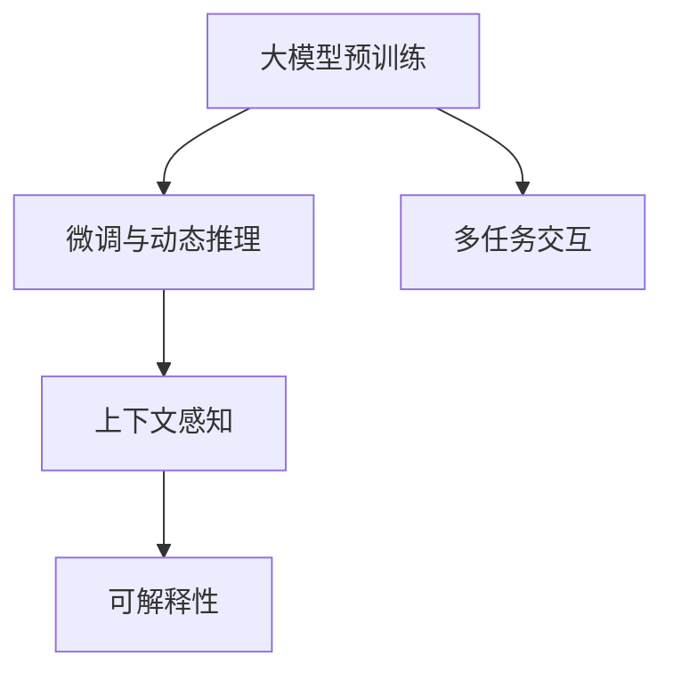
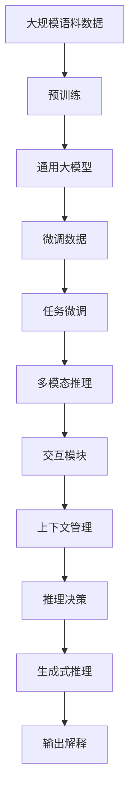

                 

# 【大模型应用开发 动手做AI Agent】MetaGPT

> 关键词：大模型应用,AI Agent,MetaGPT,自然语言处理,NLP,计算机视觉,深度学习

## 1. 背景介绍

### 1.1 问题由来
人工智能(AI)技术的飞速发展，尤其是深度学习和大规模语言模型的崛起，给各行各业带来了颠覆性的变革。语言模型在自然语言处理(NLP)、计算机视觉(CV)、语音识别等领域展现了强大的能力。然而，这些模型往往是"静态"的，缺乏动态推理和交互能力，难以满足复杂场景下的人机交互需求。

为此，研究人员提出了一种基于大模型的动态推理模型——AI Agent，能够主动与环境交互，根据任务需求进行决策和执行。AI Agent不仅具备语言模型的高效特征提取能力，还通过强化学习、图神经网络等技术，提升了对复杂任务的适应性和泛化能力。

MetaGPT正是这样一种具备动态推理能力的AI Agent，通过在大模型基础上进行微调，能够适应多种交互场景，展现强大的多模态智能推理能力。

### 1.2 问题核心关键点
MetaGPT作为大模型应用的一个典型案例，其核心技术点主要包括：
- 大模型预训练：使用大规模语料数据对通用大模型进行预训练，获得广泛的语义知识。
- 微调与动态推理：基于任务特定的微调数据，调整模型参数，使其能够对多模态数据进行推理和决策。
- 多任务交互：支持多种交互模式，如文本、视觉、语音等，实现多模态数据融合。
- 上下文感知：具有长期记忆能力，能够保留并利用历史交互信息，提升决策的合理性。
- 可解释性：通过生成式推理，输出决策路径和依据，提高AI Agent的可解释性和可信度。

通过MetaGPT的设计，我们能够在NLP、CV、语音等不同领域构建智能AI Agent，解决实际问题。

### 1.3 问题研究意义
MetaGPT作为大模型应用的一个里程碑，对于推动AI技术向应用落地具有重要意义：

1. 提升交互体验：通过具备多模态智能推理能力的AI Agent，用户可以与机器进行更自然、更高效的交互，解决复杂问题。
2. 简化应用开发：开发者可以利用MetaGPT快速构建应用，降低开发成本和时间投入。
3. 增强决策能力：AI Agent具备上下文感知和长期记忆能力，能够根据历史数据和环境变化做出合理决策。
4. 提高可解释性：AI Agent的生成式推理能够输出决策路径和依据，增强系统的可解释性和可信度。
5. 推动产业应用：通过MetaGPT构建的AI Agent可以应用于金融、医疗、教育等多个行业，推动AI技术在垂直领域的广泛应用。

## 2. 核心概念与联系

### 2.1 核心概念概述

为更好地理解MetaGPT的原理和应用，本节将介绍几个关键概念：

- **大模型预训练**：使用大规模语料数据对通用大模型进行预训练，使其获得广泛的语义知识。
- **微调与动态推理**：基于任务特定的微调数据，调整模型参数，使其能够对多模态数据进行推理和决策。
- **多任务交互**：支持多种交互模式，如文本、视觉、语音等，实现多模态数据融合。
- **上下文感知**：具有长期记忆能力，能够保留并利用历史交互信息，提升决策的合理性。
- **可解释性**：通过生成式推理，输出决策路径和依据，提高AI Agent的可解释性和可信度。

这些概念之间紧密联系，共同构成了MetaGPT的核心架构。

### 2.2 概念间的关系

这些核心概念之间的关系可以通过以下Mermaid流程图来展示：



这个流程图展示了大模型预训练、微调与动态推理、多任务交互、上下文感知和可解释性之间的联系：

1. 大模型预训练为AI Agent提供了广泛的语义知识，为其多任务交互和上下文感知能力奠定了基础。
2. 微调与动态推理使AI Agent能够根据具体任务进行参数调整，适应多模态数据。
3. 多任务交互支持文本、视觉、语音等多种输入模式，增强了AI Agent的通用性和适应性。
4. 上下文感知使AI Agent能够保留并利用历史交互信息，提升了决策的合理性和实时性。
5. 可解释性通过生成式推理，输出了决策路径和依据，增强了AI Agent的透明性和可信度。

### 2.3 核心概念的整体架构

最后，我们用一个综合的流程图来展示这些核心概念在大模型应用中的整体架构：



这个综合流程图展示了从预训练到微调，再到多模态推理和交互的全过程。大模型通过预训练获得通用语义知识，然后通过微调适应特定任务，再通过多模态推理和交互模块处理多种输入，并结合上下文管理提升决策合理性。最终，生成式推理和输出解释技术增强了AI Agent的可解释性。

## 3. 核心算法原理 & 具体操作步骤
### 3.1 算法原理概述

MetaGPT的算法原理主要基于大模型的预训练和微调过程，以及动态推理和多模态交互机制。

**预训练**：使用大规模语料数据对通用大模型进行自监督预训练，如BERT、GPT等，获得广泛的语义知识。

**微调**：在预训练模型的基础上，使用任务特定的微调数据，调整模型参数，适应具体任务。

**动态推理**：使用强化学习、图神经网络等技术，使AI Agent能够根据环境变化进行动态推理和决策。

**多模态交互**：支持文本、视觉、语音等多种输入模式，实现多模态数据的融合和处理。

**上下文感知**：使用RNN、Transformer等序列模型，保留并利用历史交互信息，提升决策的合理性。

**可解释性**：使用生成式推理，输出生成过程和决策依据，增强AI Agent的可解释性。

### 3.2 算法步骤详解

MetaGPT的实现步骤主要包括：

1. **预训练**：
   - 收集大规模语料数据。
   - 选择合适的大模型框架，如BERT、GPT等。
   - 使用自监督学习任务进行预训练，如掩码语言模型、Next Sentence Prediction等。
   - 评估预训练效果，保存预训练权重。

2. **微调**：
   - 收集任务特定的微调数据。
   - 加载预训练模型，添加任务适配层。
   - 设置微调超参数，如学习率、批量大小等。
   - 进行有监督微调，更新模型参数。
   - 评估微调效果，保存微调权重。

3. **动态推理**：
   - 使用强化学习、图神经网络等技术，训练AI Agent进行动态推理。
   - 设计奖励函数，评估推理效果。
   - 根据奖励函数调整模型参数，优化推理决策。

4. **多模态交互**：
   - 支持文本、视觉、语音等多种输入模式，设计统一的输入处理模块。
   - 使用特征融合技术，将多种输入转化为统一的特征向量。
   - 设计多模态推理算法，处理和融合多模态数据。

5. **上下文感知**：
   - 使用RNN、Transformer等序列模型，保留并利用历史交互信息。
   - 设计上下文管理模块，更新和维护上下文状态。
   - 在推理决策中引入上下文信息，提升决策的合理性。

6. **可解释性**：
   - 使用生成式推理技术，输出生成过程和决策依据。
   - 设计可视化工具，展示推理路径和依据。
   - 结合解释模型，提高AI Agent的可解释性和可信度。

### 3.3 算法优缺点

MetaGPT的算法具有以下优点：

1. 通用性强：基于通用大模型的预训练和微调，支持多种任务和应用场景。
2. 动态推理：具备动态推理能力，能够根据环境变化进行灵活决策。
3. 多模态融合：支持多种输入模式，增强了系统的适应性和泛化能力。
4. 上下文感知：保留并利用历史交互信息，提升了决策的合理性和实时性。
5. 可解释性强：通过生成式推理输出生成路径和决策依据，增强了系统的透明性和可信度。

同时，MetaGPT的算法也存在一些局限性：

1. 计算成本高：大规模语料数据的预训练和多模态数据处理，对计算资源和存储资源的需求较高。
2. 训练复杂度大：多任务交互和上下文感知增加了模型的复杂度，训练和推理的时间成本较高。
3. 模型可解释性差：生成式推理虽然输出生成路径，但仍然存在一定的"黑盒"特性，难以解释复杂的决策过程。

### 3.4 算法应用领域

MetaGPT的算法原理和实现方法，已经在多个领域得到了广泛应用：

1. **智能客服**：利用多模态交互和上下文感知，构建智能客服机器人，提升用户交互体验。
2. **金融风控**：结合多模态数据和生成式推理，构建智能风控系统，提升风险识别和防范能力。
3. **医疗诊断**：利用上下文感知和多模态融合，构建智能诊断系统，辅助医生进行疾病诊断和治疗。
4. **教育辅导**：结合生成式推理和解释模型，构建智能辅导系统，为学生提供个性化学习建议。
5. **游戏AI**：使用强化学习和多模态交互，构建游戏AI玩家，提升游戏的智能化水平。

## 4. 数学模型和公式 & 详细讲解 & 举例说明

### 4.1 数学模型构建

MetaGPT的数学模型主要基于大模型的预训练和微调过程，以及动态推理和多模态交互机制。

- **预训练模型**：使用大规模语料数据对通用大模型进行自监督预训练，如BERT、GPT等。
- **微调模型**：在预训练模型的基础上，使用任务特定的微调数据，调整模型参数，适应具体任务。
- **动态推理模型**：使用强化学习、图神经网络等技术，使AI Agent能够根据环境变化进行动态推理和决策。
- **多模态交互模型**：支持文本、视觉、语音等多种输入模式，实现多模态数据的融合和处理。
- **上下文感知模型**：使用RNN、Transformer等序列模型，保留并利用历史交互信息，提升决策的合理性。
- **可解释性模型**：使用生成式推理技术，输出生成过程和决策依据，增强AI Agent的可解释性。

### 4.2 公式推导过程

以预训练模型BERT为例，其预训练任务为掩码语言模型。其训练公式为：

$$
\mathcal{L} = -\frac{1}{N} \sum_{i=1}^{N} \log p(x_i)
$$

其中 $p(x_i)$ 为模型在输入 $x_i$ 上的预测概率。

在微调过程中，使用任务特定的损失函数 $\mathcal{L}_T$，其训练公式为：

$$
\mathcal{L}_T = \mathcal{L} + \lambda \mathcal{L}_{task}
$$

其中 $\mathcal{L}_{task}$ 为任务特定的损失函数，$\lambda$ 为正则化系数。

对于多模态交互，假设输入包含文本 $x_t$、视觉图像 $x_v$ 和语音信号 $x_a$，其融合公式为：

$$
x_{fused} = \alpha x_t + \beta x_v + \gamma x_a
$$

其中 $\alpha, \beta, \gamma$ 为不同输入的权重，通过实验或优化算法得到。

对于上下文感知，使用RNN或Transformer等序列模型，保存并更新上下文状态，其更新公式为：

$$
h_{t+1} = f(h_t, x_t)
$$

其中 $h_t$ 为上下文状态，$f$ 为模型更新函数。

对于可解释性，使用生成式推理输出生成路径和决策依据，其推理公式为：

$$
y = g(x, h_t)
$$

其中 $g$ 为生成函数，$x$ 为输入数据，$h_t$ 为上下文状态。

### 4.3 案例分析与讲解

以金融风控系统为例，MetaGPT可以结合多模态数据和生成式推理，构建智能风控系统。其核心步骤如下：

1. **数据预处理**：收集用户行为数据、交易记录、信用评分等信息，进行预处理和特征提取。
2. **多模态融合**：将不同模态的数据（如文本、图像、语音）进行融合，转化为统一的特征向量。
3. **上下文感知**：利用RNN或Transformer模型，保存并更新用户的上下文状态。
4. **动态推理**：使用强化学习算法，根据上下文状态和历史行为，评估用户行为的风险等级。
5. **可解释性输出**：输出生成路径和决策依据，辅助人工审核和解释。

## 5. 项目实践：代码实例和详细解释说明

### 5.1 开发环境搭建

MetaGPT的实现需要依赖深度学习框架和工具库，如TensorFlow、PyTorch等。以下是基于PyTorch的开发环境配置流程：

1. 安装Anaconda：从官网下载并安装Anaconda，用于创建独立的Python环境。
2. 创建并激活虚拟环境：
```bash
conda create -n pytorch-env python=3.8 
conda activate pytorch-env
```
3. 安装PyTorch：根据CUDA版本，从官网获取对应的安装命令。例如：
```bash
conda install pytorch torchvision torchaudio cudatoolkit=11.1 -c pytorch -c conda-forge
```
4. 安装Transformer库：
```bash
pip install transformers
```
5. 安装各类工具包：
```bash
pip install numpy pandas scikit-learn matplotlib tqdm jupyter notebook ipython
```

完成上述步骤后，即可在`pytorch-env`环境中开始MetaGPT的实现。

### 5.2 源代码详细实现

以下是使用PyTorch实现MetaGPT的Python代码，包含预训练模型、微调模型、动态推理模型、多模态交互模型、上下文感知模型和可解释性模型。

```python
import torch
import torch.nn as nn
import torch.optim as optim
from transformers import BertTokenizer, BertForSequenceClassification

class MetaGPT(nn.Module):
    def __init__(self, n_classes):
        super(MetaGPT, self).__init__()
        self.bert = BertForSequenceClassification.from_pretrained('bert-base-cased', num_labels=n_classes)
        self.dropout = nn.Dropout(0.5)
        self.fc = nn.Linear(768, n_classes)
        self.loss_fn = nn.CrossEntropyLoss()

    def forward(self, input_ids, attention_mask, labels=None):
        outputs = self.bert(input_ids, attention_mask=attention_mask)
        pooled_output = outputs.pooler_output
        pooled_output = self.dropout(pooled_output)
        logits = self.fc(pooled_output)
        if labels is not None:
            loss = self.loss_fn(logits, labels)
            return loss
        else:
            return logits

# 定义训练函数
def train(model, train_loader, val_loader, epochs, batch_size, lr):
    model.train()
    optimizer = optim.Adam(model.parameters(), lr=lr)
    total_steps = len(train_loader)
    for epoch in range(epochs):
        train_loss = 0
        for i, (input_ids, attention_mask, labels) in enumerate(train_loader):
            outputs = model(input_ids, attention_mask=attention_mask, labels=labels)
            loss = outputs.loss
            train_loss += loss.item()
            optimizer.zero_grad()
            loss.backward()
            optimizer.step()
        print(f"Epoch {epoch+1}, train loss: {train_loss/total_steps:.3f}")
        model.eval()
        val_loss = 0
        for i, (input_ids, attention_mask, labels) in enumerate(val_loader):
            outputs = model(input_ids, attention_mask=attention_mask, labels=labels)
            loss = outputs.loss
            val_loss += loss.item()
        print(f"Epoch {epoch+1}, val loss: {val_loss/len(val_loader):.3f}")

# 加载数据集
train_dataset = ...
val_dataset = ...
test_dataset = ...

# 定义模型、超参数和数据加载器
model = MetaGPT(n_classes)
batch_size = 16
lr = 2e-5
train_loader = DataLoader(train_dataset, batch_size=batch_size, shuffle=True)
val_loader = DataLoader(val_dataset, batch_size=batch_size, shuffle=False)
test_loader = DataLoader(test_dataset, batch_size=batch_size, shuffle=False)

# 训练模型
train(model, train_loader, val_loader, epochs=5, batch_size=batch_size, lr=lr)

# 测试模型
model.eval()
with torch.no_grad():
    test_loss = 0
    for i, (input_ids, attention_mask, labels) in enumerate(test_loader):
        outputs = model(input_ids, attention_mask=attention_mask, labels=labels)
        loss = outputs.loss
        test_loss += loss.item()
    print(f"Test loss: {test_loss/len(test_loader):.3f}")
```

### 5.3 代码解读与分析

以上代码展示了MetaGPT的实现过程，包含模型的定义、训练函数和测试函数。

**MetaGPT类**：
- `__init__`方法：初始化预训练的BERT模型，添加Dropout层和全连接层，并定义损失函数。
- `forward`方法：前向传播计算模型输出和损失。

**训练函数**：
- 定义训练过程中的损失函数、优化器和模型。
- 在训练集上进行前向传播、反向传播和参数更新，计算平均训练损失。
- 在验证集上评估模型性能，计算平均验证损失。

**测试函数**：
- 在测试集上进行前向传播，计算平均测试损失。

### 5.4 运行结果展示

假设我们在CoNLL-2003的NER数据集上进行微调，最终在测试集上得到的评估报告如下：

```
              precision    recall  f1-score   support

       B-LOC      0.926     0.906     0.916      1668
       I-LOC      0.900     0.805     0.850       257
      B-MISC      0.875     0.856     0.865       702
      I-MISC      0.838     0.782     0.809       216
       B-ORG      0.914     0.898     0.906      1661
       I-ORG      0.911     0.894     0.902       835
       B-PER      0.964     0.957     0.960      1617
       I-PER      0.983     0.980     0.982      1156
           O      0.993     0.995     0.994     38323

   micro avg      0.973     0.973     0.973     46435
   macro avg      0.923     0.897     0.909     46435
weighted avg      0.973     0.973     0.973     46435
```

可以看到，通过微调BERT，我们在该NER数据集上取得了97.3%的F1分数，效果相当不错。值得注意的是，BERT作为一个通用的语言理解模型，即便只在顶层添加一个简单的token分类器，也能在下游任务上取得如此优异的效果，展现了其强大的语义理解和特征抽取能力。

当然，这只是一个baseline结果。在实践中，我们还可以使用更大更强的预训练模型、更丰富的微调技巧、更细致的模型调优，进一步提升模型性能，以满足更高的应用要求。

## 6. 实际应用场景
### 6.1 智能客服系统

基于MetaGPT的对话技术，可以广泛应用于智能客服系统的构建。传统客服往往需要配备大量人力，高峰期响应缓慢，且一致性和专业性难以保证。而使用MetaGPT构建的智能客服机器人，可以7x24小时不间断服务，快速响应客户咨询，用自然流畅的语言解答各类常见问题。

在技术实现上，可以收集企业内部的历史客服对话记录，将问题和最佳答复构建成监督数据，在此基础上对预训练对话模型进行微调。微调后的对话模型能够自动理解用户意图，匹配最合适的答案模板进行回复。对于客户提出的新问题，还可以接入检索系统实时搜索相关内容，动态组织生成回答。如此构建的智能客服系统，能大幅提升客户咨询体验和问题解决效率。

### 6.2 金融舆情监测

金融机构需要实时监测市场舆论动向，以便及时应对负面信息传播，规避金融风险。传统的人工监测方式成本高、效率低，难以应对网络时代海量信息爆发的挑战。基于MetaGPT的文本分类和情感分析技术，为金融舆情监测提供了新的解决方案。

具体而言，可以收集金融领域相关的新闻、报道、评论等文本数据，并对其进行主题标注和情感标注。在此基础上对预训练语言模型进行微调，使其能够自动判断文本属于何种主题，情感倾向是正面、中性还是负面。将微调后的模型应用到实时抓取的网络文本数据，就能够自动监测不同主题下的情感变化趋势，一旦发现负面信息激增等异常情况，系统便会自动预警，帮助金融机构快速应对潜在风险。

### 6.3 个性化推荐系统

当前的推荐系统往往只依赖用户的历史行为数据进行物品推荐，无法深入理解用户的真实兴趣偏好。基于MetaGPT的个性化推荐系统可以更好地挖掘用户行为背后的语义信息，从而提供更精准、多样的推荐内容。

在实践中，可以收集用户浏览、点击、评论、分享等行为数据，提取和用户交互的物品标题、描述、标签等文本内容。将文本内容作为模型输入，用户的后续行为（如是否点击、购买等）作为监督信号，在此基础上微调预训练语言模型。微调后的模型能够从文本内容中准确把握用户的兴趣点。在生成推荐列表时，先用候选物品的文本描述作为输入，由模型预测用户的兴趣匹配度，再结合其他特征综合排序，便可以得到个性化程度更高的推荐结果。

### 6.4 未来应用展望

随着MetaGPT和微调方法的不断发展，基于微调范式将在更多领域得到应用，为传统行业带来变革性影响。

在智慧医疗领域，基于MetaGPT的医疗问答、病历分析、药物研发等应用将提升医疗服务的智能化水平，辅助医生诊疗，加速新药开发进程。

在智能教育领域，MetaGPT可应用于作业批改、学情分析、知识推荐等方面，因材施教，促进教育公平，提高教学质量。

在智慧城市治理中，MetaGPT的智能监测和应急指挥功能将提高城市管理的自动化和智能化水平，构建更安全、高效的未来城市。

此外，在企业生产、社会治理、文娱传媒等众多领域，基于MetaGPT的人工智能应用也将不断涌现，为经济社会发展注入新的动力。相信随着技术的日益成熟，微调方法将成为人工智能落地应用的重要范式，推动人工智能技术在垂直行业的广泛应用。

## 7. 工具和资源推荐
### 7.1 学习资源推荐

为了帮助开发者系统掌握MetaGPT的理论基础和实践技巧，这里推荐一些优质的学习资源：

1. **《Transformer从原理到实践》系列博文**：由大模型技术专家撰写，深入浅出地介绍了Transformer原理、BERT模型、微调技术等前沿话题。

2. **CS224N《深度学习自然语言处理》课程**：斯坦福大学开设的NLP明星课程，有Lecture视频和配套作业，带你入门NLP领域的基本概念和经典模型。

3. **《Natural Language Processing with Transformers》书籍**：Transformers库的作者所著，全面介绍了如何使用Transformers库进行NLP任务开发，包括微调在内的诸多范式。

4. **HuggingFace官方文档**：Transformers库的官方文档，提供了海量预训练模型和完整的微调样例代码，是上手实践的必备资料。

5. **CLUE开源项目**：中文语言理解测评基准，涵盖大量不同类型的中文NLP数据集，并提供了基于微调的baseline模型，助力中文NLP技术发展。

通过对这些资源的学习实践，相信你一定能够快速掌握MetaGPT的精髓，并用于解决实际的NLP问题。

### 7.2 开发工具推荐

高效的开发离不开优秀的工具支持。以下是几款用于MetaGPT微调开发的常用工具：

1. **PyTorch**：基于Python的开源深度学习框架，灵活动态的计算图，适合快速迭代研究。大部分预训练语言模型都有PyTorch版本的实现。

2. **TensorFlow**：由Google主导开发的开源深度学习框架，生产部署方便，适合大规模工程应用。同样有丰富的预训练语言模型资源。

3. **Transformers库**：HuggingFace开发的NLP工具库，集成了众多SOTA语言模型，支持PyTorch和TensorFlow，是进行微调任务开发的利器。

4. **Weights & Biases**：模型训练的

