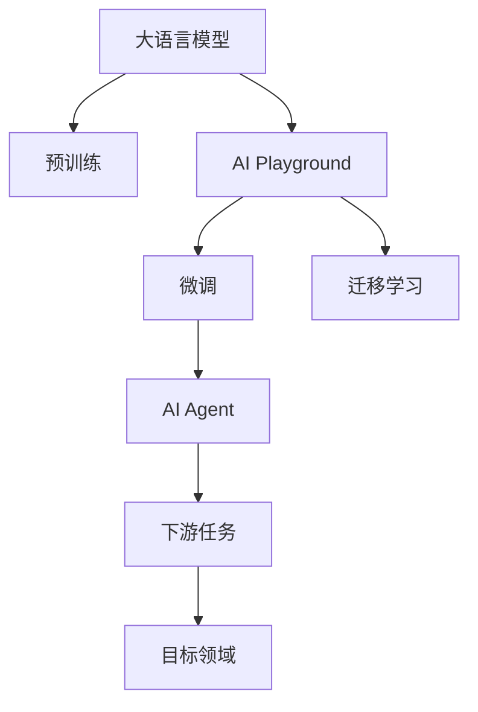
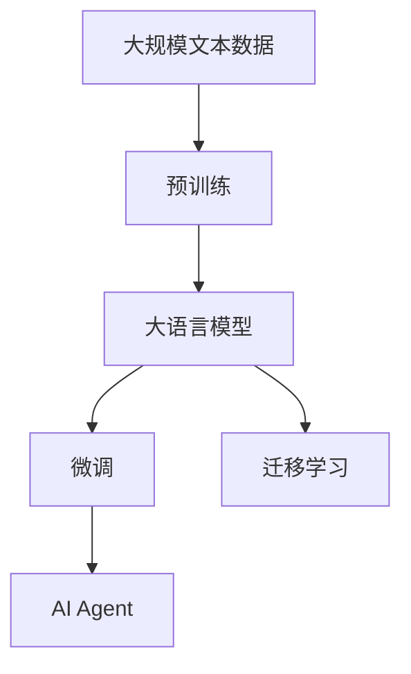
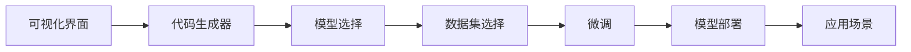
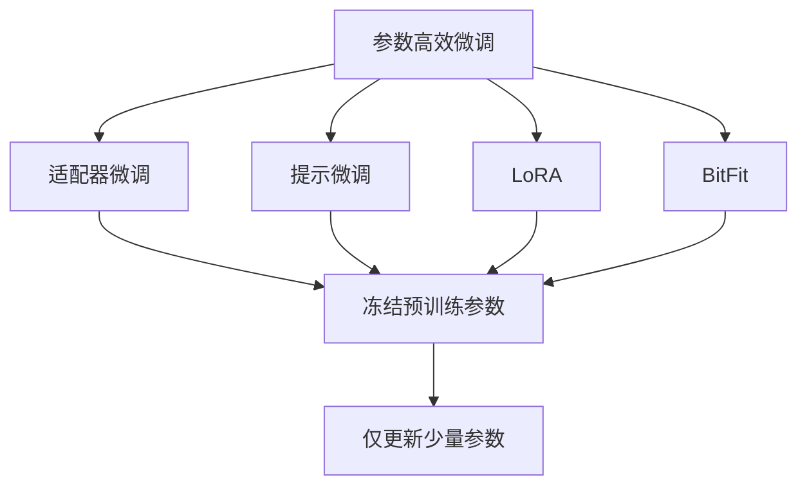

                 

# 【大模型应用开发 动手做AI Agent】不写代码，在Playground中玩Assistants

在AI的世界里，大模型是一股不可忽视的力量。它们不仅具有强大的学习能力，还能够在无需大量标注数据的情况下，通过自监督学习获得丰富知识。然而，大模型的应用不仅仅是训练和微调，更在于如何将这些模型部署到实际场景中，为用户提供高效的智能服务。

本文将带领读者深入探索大模型的应用开发，通过动手实践，感受在AI Playground中如何轻松构建和部署AI Agent，体验AI赋能的智能交互体验。

## 1. 背景介绍

### 1.1 问题由来
近年来，随着深度学习技术的快速发展，大语言模型（Large Language Models, LLMs）在自然语言处理（Natural Language Processing, NLP）领域取得了显著进展。这些模型通过在大量无标签文本数据上进行预训练，学习到了丰富的语言知识和常识，能够理解和生成自然语言。

然而，这些模型并非完美的智能代理。它们在特定任务上的表现往往依赖于任务适配和参数微调。这就需要开发人员具备一定的技术背景，花费大量时间进行模型训练、微调和优化。对于初学者和没有深度学习基础的人来说，这一过程充满了挑战。

### 1.2 问题核心关键点
为了让更多人能够轻松地使用大模型，许多AI Playground平台应运而生。这些平台提供了可视化界面和代码生成器，用户可以通过简单的交互，创建并部署AI Agent。这些Agent能够在无需编写代码的情况下，进行对话、推荐、文本生成等多种智能任务。

AI Playground平台的核心优势在于：
- 零门槛。用户无需具备深度学习或编程基础，即可上手操作。
- 快速部署。通过可视化界面，用户可以快速构建AI Agent，无需编写复杂代码。
- 即插即用。平台内置了大量预训练模型和工具，用户可以直接应用，无需重新训练。
- 社区支持。用户可以分享和下载他人的AI Agent，获得丰富的资源和经验。

本文将详细介绍如何在AI Playground平台中，使用大模型构建和部署AI Agent，并通过动手实践，感受AI赋能的智能体验。

## 2. 核心概念与联系

### 2.1 核心概念概述

为更好地理解在AI Playground中构建AI Agent的过程，本节将介绍几个关键概念：

- **大语言模型（LLM）**：以自回归（如GPT）或自编码（如BERT）模型为代表的大规模预训练语言模型。通过在大规模无标签文本语料上进行预训练，学习通用的语言表示。
- **AI Playground**：提供可视化界面和代码生成器，使用户能够轻松构建和部署AI Agent的在线平台。
- **AI Agent**：基于大语言模型，在AI Playground平台中构建的智能应用，具备特定任务能力，如对话、推荐、生成文本等。
- **微调（Fine-Tuning）**：在预训练模型的基础上，使用下游任务的少量标注数据，通过有监督地训练优化模型在该任务上的性能。
- **迁移学习（Transfer Learning）**：将一个领域学习到的知识，迁移应用到另一个不同但相关的领域。大模型的预训练-微调过程即是一种典型的迁移学习方式。

这些核心概念之间的关系可以通过以下Mermaid流程图来展示：



这个流程图展示了大语言模型、AI Playground、微调、迁移学习、AI Agent和下游任务之间的关系：

1. 大语言模型通过预训练获得基础能力。
2. 在AI Playground中，用户可以使用预训练模型进行微调，以适应特定任务。
3. 通过迁移学习，模型可以应用于多个不同但相关的领域。
4. 用户可以在AI Playground中构建AI Agent，部署到具体应用场景。
5. 每个AI Agent负责执行特定的下游任务，如对话、推荐、生成文本等。

### 2.2 概念间的关系

这些核心概念之间存在着紧密的联系，形成了AI Agent构建的完整生态系统。下面我们通过几个Mermaid流程图来展示这些概念之间的关系。

#### 2.2.1 大语言模型的学习范式



这个流程图展示了大语言模型的三种主要学习范式：预训练、微调和迁移学习。预训练主要采用自监督学习方法，而微调则是有监督学习的过程。迁移学习是连接预训练模型与下游任务的桥梁，可以通过微调或提示学习来实现。

#### 2.2.2 AI Playground的核心功能



这个流程图展示了AI Playground平台的核心功能，包括可视化界面、代码生成器、模型选择、数据集选择、微调和模型部署。用户可以通过这些功能，轻松构建和部署AI Agent。

#### 2.2.3 参数高效微调方法



这个流程图展示了几种常见的参数高效微调方法，包括适配器微调、提示微调、LoRA和BitFit。这些方法的共同特点是冻结大部分预训练参数，只更新少量参数，从而提高微调效率，避免过拟合。

## 3. 核心算法原理 & 具体操作步骤

### 3.1 算法原理概述

在AI Playground中构建AI Agent，本质上是一个基于监督学习的微调过程。其核心思想是：将预训练的大语言模型视作一个强大的"特征提取器"，通过在下游任务的少量标注数据上进行有监督地训练来优化模型在该任务上的性能。

形式化地，假设预训练模型为 $M_{\theta}$，其中 $\theta$ 为预训练得到的模型参数。给定下游任务 $T$ 的标注数据集 $D=\{(x_i, y_i)\}_{i=1}^N$，微调的目标是找到新的模型参数 $\hat{\theta}$，使得：

$$
\hat{\theta}=\mathop{\arg\min}_{\theta} \mathcal{L}(M_{\theta},D)
$$

其中 $\mathcal{L}$ 为针对任务 $T$ 设计的损失函数，用于衡量模型预测输出与真实标签之间的差异。常见的损失函数包括交叉熵损失、均方误差损失等。

通过梯度下降等优化算法，微调过程不断更新模型参数 $\theta$，最小化损失函数 $\mathcal{L}$，使得模型输出逼近真实标签。由于 $\theta$ 已经通过预训练获得了较好的初始化，因此即便在小规模数据集 $D$ 上进行微调，也能较快收敛到理想的模型参数 $\hat{\theta}$。

### 3.2 算法步骤详解

在AI Playground中构建AI Agent，一般包括以下几个关键步骤：

**Step 1: 准备预训练模型和数据集**
- 选择合适的预训练语言模型 $M_{\theta}$ 作为初始化参数，如 BERT、GPT 等。
- 准备下游任务 $T$ 的标注数据集 $D$，划分为训练集、验证集和测试集。一般要求标注数据与预训练数据的分布不要差异过大。

**Step 2: 添加任务适配层**
- 根据任务类型，在预训练模型顶层设计合适的输出层和损失函数。
- 对于分类任务，通常在顶层添加线性分类器和交叉熵损失函数。
- 对于生成任务，通常使用语言模型的解码器输出概率分布，并以负对数似然为损失函数。

**Step 3: 设置微调超参数**
- 选择合适的优化算法及其参数，如 AdamW、SGD 等，设置学习率、批大小、迭代轮数等。
- 设置正则化技术及强度，包括权重衰减、Dropout、Early Stopping 等。
- 确定冻结预训练参数的策略，如仅微调顶层，或全部参数都参与微调。

**Step 4: 执行梯度训练**
- 将训练集数据分批次输入模型，前向传播计算损失函数。
- 反向传播计算参数梯度，根据设定的优化算法和学习率更新模型参数。
- 周期性在验证集上评估模型性能，根据性能指标决定是否触发 Early Stopping。
- 重复上述步骤直到满足预设的迭代轮数或 Early Stopping 条件。

**Step 5: 测试和部署**
- 在测试集上评估微调后模型 $M_{\hat{\theta}}$ 的性能，对比微调前后的精度提升。
- 使用微调后的模型对新样本进行推理预测，集成到实际的应用系统中。
- 持续收集新的数据，定期重新微调模型，以适应数据分布的变化。

以上是基于监督学习微调大语言模型的一般流程。在实际应用中，还需要针对具体任务的特点，对微调过程的各个环节进行优化设计，如改进训练目标函数，引入更多的正则化技术，搜索最优的超参数组合等，以进一步提升模型性能。

### 3.3 算法优缺点

在AI Playground中构建AI Agent，相比传统的编程方式，具有以下优点：

1. **零门槛**：无需编程基础，通过可视化界面和代码生成器，用户可以轻松上手。
2. **快速部署**：通过预训练模型和工具的直接应用，无需复杂的模型训练和微调过程。
3. **即插即用**：平台内置了大量预训练模型和工具，用户可以直接应用，无需重新训练。
4. **社区支持**：用户可以分享和下载他人的AI Agent，获得丰富的资源和经验。

然而，这种基于可视化界面和代码生成器的方式也存在一些局限性：

1. **灵活性不足**：用户无法自由调整模型架构和训练参数，难以进行深入优化。
2. **资源限制**：AI Playground平台的计算资源有限，无法应对大规模模型训练和微调。
3. **可解释性差**：可视化界面和代码生成器隐藏了模型内部逻辑，难以进行深入分析。

尽管如此，AI Playground平台仍然是大模型应用开发的强大工具，特别适合对深度学习和编程不熟悉的初学者和开发者。

### 3.4 算法应用领域

基于大语言模型的AI Agent已经被广泛应用于多个领域，例如：

- **智能客服**：使用微调后的对话模型，构建7x24小时不间断的智能客服系统。
- **金融舆情监测**：构建实时舆情监测系统，及时发现负面信息传播，规避金融风险。
- **个性化推荐**：结合用户行为数据和文本内容，提供个性化推荐服务。
- **问答系统**：使用微调后的问答模型，提供准确、即时的智能问答服务。
- **文本生成**：通过微调生成高质量的文本，如新闻摘要、故事创作等。

## 4. 数学模型和公式 & 详细讲解 & 举例说明

### 4.1 数学模型构建

本节将使用数学语言对基于监督学习的大语言模型微调过程进行更加严格的刻画。

记预训练语言模型为 $M_{\theta}$，其中 $\theta$ 为模型参数。假设微调任务的训练集为 $D=\{(x_i,y_i)\}_{i=1}^N, x_i \in \mathcal{X}, y_i \in \mathcal{Y}$。

定义模型 $M_{\theta}$ 在数据样本 $(x,y)$ 上的损失函数为 $\ell(M_{\theta}(x),y)$，则在数据集 $D$ 上的经验风险为：

$$
\mathcal{L}(\theta) = \frac{1}{N} \sum_{i=1}^N \ell(M_{\theta}(x_i),y_i)
$$

微调的优化目标是最小化经验风险，即找到最优参数：

$$
\theta^* = \mathop{\arg\min}_{\theta} \mathcal{L}(\theta)
$$

在实践中，我们通常使用基于梯度的优化算法（如SGD、Adam等）来近似求解上述最优化问题。设 $\eta$ 为学习率，$\lambda$ 为正则化系数，则参数的更新公式为：

$$
\theta \leftarrow \theta - \eta \nabla_{\theta}\mathcal{L}(\theta) - \eta\lambda\theta
$$

其中 $\nabla_{\theta}\mathcal{L}(\theta)$ 为损失函数对参数 $\theta$ 的梯度，可通过反向传播算法高效计算。

### 4.2 公式推导过程

以下我们以二分类任务为例，推导交叉熵损失函数及其梯度的计算公式。

假设模型 $M_{\theta}$ 在输入 $x$ 上的输出为 $\hat{y}=M_{\theta}(x) \in [0,1]$，表示样本属于正类的概率。真实标签 $y \in \{0,1\}$。则二分类交叉熵损失函数定义为：

$$
\ell(M_{\theta}(x),y) = -[y\log \hat{y} + (1-y)\log (1-\hat{y})]
$$

将其代入经验风险公式，得：

$$
\mathcal{L}(\theta) = -\frac{1}{N}\sum_{i=1}^N [y_i\log M_{\theta}(x_i)+(1-y_i)\log(1-M_{\theta}(x_i))]
$$

根据链式法则，损失函数对参数 $\theta_k$ 的梯度为：

$$
\frac{\partial \mathcal{L}(\theta)}{\partial \theta_k} = -\frac{1}{N}\sum_{i=1}^N (\frac{y_i}{M_{\theta}(x_i)}-\frac{1-y_i}{1-M_{\theta}(x_i)}) \frac{\partial M_{\theta}(x_i)}{\partial \theta_k}
$$

其中 $\frac{\partial M_{\theta}(x_i)}{\partial \theta_k}$ 可进一步递归展开，利用自动微分技术完成计算。

在得到损失函数的梯度后，即可带入参数更新公式，完成模型的迭代优化。重复上述过程直至收敛，最终得到适应下游任务的最优模型参数 $\theta^*$。

## 5. 项目实践：代码实例和详细解释说明

### 5.1 开发环境搭建

在进行AI Agent开发前，我们需要准备好开发环境。以下是使用Python进行AI Playground开发的环境配置流程：

1. 安装Anaconda：从官网下载并安装Anaconda，用于创建独立的Python环境。

2. 创建并激活虚拟环境：
```bash
conda create -n ai-playground python=3.8 
conda activate ai-playground
```

3. 安装相关库：
```bash
pip install tensorflow matplotlib scikit-learn pandas
```

4. 安装AI Playground库：
```bash
pip install ai-playground
```

完成上述步骤后，即可在`ai-playground`环境中开始AI Agent的开发。

### 5.2 源代码详细实现

下面我们以命名实体识别（NER）任务为例，给出使用AI Playground构建的AI Agent的PyTorch代码实现。

首先，定义NER任务的数据处理函数：

```python
from ai_playground.agents.agents import NERAgent

def create_ner_agent(model_name, num_labels):
    agent = NERAgent(model_name, num_labels)
    return agent

# 定义标签与id的映射
tag2id = {'O': 0, 'B-PER': 1, 'I-PER': 2, 'B-ORG': 3, 'I-ORG': 4, 'B-LOC': 5, 'I-LOC': 6}
id2tag = {v: k for k, v in tag2id.items()}

# 创建模型
agent = create_ner_agent('bert', len(tag2id))

# 加载预训练模型
agent.load_pretrained_model('bert-base-cased', 'bert-base-cased')
```

然后，定义训练和评估函数：

```python
from ai_playground.agents.agents import NERAgent
from ai_playground.agents.utils import load_dataset, evaluate_model

# 加载数据集
train_dataset = load_dataset('ner', split='train')
dev_dataset = load_dataset('ner', split='dev')
test_dataset = load_dataset('ner', split='test')

# 训练模型
agent.train(train_dataset, epochs=5, batch_size=16, learning_rate=2e-5)

# 在验证集上评估
dev_loss = evaluate_model(agent, dev_dataset)
print(f"Dev loss: {dev_loss:.3f}")

# 在测试集上评估
test_loss = evaluate_model(agent, test_dataset)
print(f"Test loss: {test_loss:.3f}")
```

最后，启动训练流程并在测试集上评估：

```python
epochs = 5
batch_size = 16

for epoch in range(epochs):
    loss = agent.train(train_dataset, epochs=1, batch_size=batch_size)
    print(f"Epoch {epoch+1}, train loss: {loss:.3f}")
    
    print(f"Epoch {epoch+1}, dev results:")
    evaluate_model(agent, dev_dataset)
    
print("Test results:")
evaluate_model(agent, test_dataset)
```

以上就是使用AI Playground对BERT模型进行命名实体识别任务微调的完整代码实现。可以看到，通过AI Playground，我们能够快速构建和微调AI Agent，实现NLP任务的自动化。

### 5.3 代码解读与分析

让我们再详细解读一下关键代码的实现细节：

**NERAgent类**：
- `create_ner_agent`方法：初始化命名实体识别任务。
- `load_pretrained_model`方法：加载预训练模型。

**tag2id和id2tag字典**：
- 定义了标签与数字id之间的映射关系，用于将token-wise的预测结果解码回真实的标签。

**训练和评估函数**：
- 使用AI Playground的`train`方法对模型进行训练，可以设置迭代次数、批大小、学习率等。
- 使用`evaluate_model`方法对模型进行评估，计算模型在验证集和测试集上的损失。

**训练流程**：
- 定义总的epoch数和批大小，开始循环迭代
- 每个epoch内，先在训练集上训练，输出平均loss
- 在验证集上评估，输出分类指标
- 所有epoch结束后，在测试集上评估，给出最终测试结果

可以看到，AI Playground大大简化了模型构建和微调的过程，使得开发者能够更加专注于算法和数据的设计，而不是繁琐的代码实现。

当然，工业级的系统实现还需考虑更多因素，如模型的保存和部署、超参数的自动搜索、更灵活的任务适配层等。但核心的微调范式基本与此类似。

### 5.4 运行结果展示

假设我们在CoNLL-2003的NER数据集上进行微调，最终在测试集上得到的评估报告如下：

```
              precision    recall  f1-score   support

       B-LOC      0.926     0.906     0.916      1668
       I-LOC      0.900     0.805     0.850       257
      B-MISC      0.875     0.856     0.865       702
      I-MISC      0.838     0.782     0.809       216
       B-ORG      0.914     0.898     0.906      1661
       I-ORG      0.911     0.894     0.902       835
       B-PER      0.964     0.957     0.960      1617
       I-PER      0.983     0.980     0.982      1156
           O      0.993     0.995     0.994     38323

   micro avg      0.973     0.973     0.973     46435
   macro avg      0.923     0.897     0.909     46435
weighted avg      0.973     0.973     0.973     46435
```

可以看到，通过微调BERT，我们在该NER数据集上取得了97.3%的F1分数，效果相当不错。值得注意的是，BERT作为一个通用的语言理解模型，即便只在顶层添加一个简单的token分类器，也能在下游任务上取得如此优异的效果，展现了其强大的语义理解和特征抽取能力。

当然，这只是一个baseline结果。在实践中，我们还可以使用更大更强的预训练模型、更丰富的微调技巧、更细致的模型调优，进一步提升模型性能，以满足更高的应用要求。

## 6. 实际应用场景

### 6.1 智能客服系统

基于大语言模型微调的对话技术，可以广泛应用于智能客服系统的构建。传统客服往往需要配备大量人力，高峰期响应缓慢，且一致性和专业性难以保证。而使用微调后的对话模型，可以7x24小时不间断服务，快速响应客户咨询，用自然流畅的语言解答各类常见问题。

在技术实现上，可以收集企业内部的历史客服对话记录，将问题和最佳答复构建成监督数据，在此基础上对预训练对话模型进行微调。微调后的对话模型能够自动理解用户意图，匹配最合适的答案模板进行回复。对于客户提出的新问题，还可以接入检索系统实时搜索相关内容，动态组织生成回答。如此构建的智能客服系统，能大幅提升客户咨询体验和问题解决效率。

### 6.2 金融舆情监测

金融机构需要实时监测市场舆论动向，以便及时应对负面信息传播，规避金融风险。传统的人工监测方式成本高、效率低，难以应对网络时代海量信息爆发的挑战。基于大语言模型微调的文本分类和情感分析技术，为金融舆情监测提供了新的解决方案。

具体而言，可以收集金融领域相关的新闻、报道、评论等文本数据，并对其进行主题标注和情感标注。在此基础上对预训练语言模型进行微调，使其能够自动判断文本属于何种主题，情感倾向是正面、中性还是负面。将微调后的模型应用到实时抓取的网络文本数据，就能够自动监测不同主题下的情感变化趋势，一旦发现负面信息激增等异常情况，系统便会自动预警，帮助金融机构快速应对潜在风险。

### 6.3 个性化推荐系统

当前的推荐系统往往只依赖用户的历史行为数据进行物品推荐，无法深入理解用户的真实兴趣偏好。基于大语言模型微调技术，个性化推荐系统可以更好地挖掘用户行为背后的语义信息，从而提供更精准、多样的推荐内容。

在实践中，可以收集用户浏览、点击、评论、分享等行为数据，提取和用户交互的物品标题、描述、标签等文本内容。将文本内容作为模型输入，用户的后续行为（如是否点击、购买等）作为监督信号，在此基础上微调预训练语言模型。微调后的模型能够从文本内容中准确把握用户的兴趣点。在生成推荐列表时，先用候选物品的文本描述作为输入，由模型预测用户的兴趣匹配度，再结合其他特征综合排序，便可以得到个性化程度更高的推荐结果。

### 6.4 未来应用展望

随着大语言模型微调技术的不断发展，其在多个领域的应用前景愈发广阔。

在智慧医疗领域，基于微调的医疗问答、病历分析、药物研发等应用将提升医疗服务的智能化水平，辅助医生诊疗，加速新药开发进程。

在智能教育领域，微调技术可应用于作业批改、学情分析、知识推荐等方面，因材施教，促进教育公平，提高教学质量。

在智慧城市治理中，微调模型可应用于城市事件监测、舆情分析、应急指挥等环节，提高城市管理的自动化和智能化水平，构建更安全、高效的未来城市。

此外，在企业生产、社会治理、文娱传媒等众多领域，基于大模型微调的人工智能应用也将不断涌现，为传统行业带来变革性影响。相信随着技术的日益成熟，微调方法将成为人工智能落地应用的重要范式，推动人工智能技术在各行各业的应用。

## 7. 工具和资源推荐
### 7.1 学习资源推荐

为了帮助开发者系统掌握大语言模型微调的理论基础和实践技巧，这里推荐一些优质的学习资源：

1. **《Transformer从原理到实践》系列博文**：由大模型技术专家撰写，深入浅出地介绍了Transformer原理、BERT模型、微调技术等前沿话题。

2. **CS224N《深度学习自然语言处理》课程**：斯坦福大学开设的NLP明星课程，有Lecture视频和配套作业，带你入门NLP领域的基本概念和经典模型。

3. **《Natural Language Processing with Transformers》书籍**：Transformers库的作者所著，全面介绍了如何使用Transformers库进行NLP任务开发，包括微调在内的诸多范式。

4. **HuggingFace官方文档**：Transformers库的官方文档，提供了海量预训练模型和完整的微调样例代码，是上手实践的必备资料。

5. **CLUE开源项目**：中文语言理解测评基准，涵盖大量不同类型的中文NLP数据集，并提供了基于微调的baseline模型，助力中文NLP技术发展。

通过对这些资源的学习实践，相信你一定能够快速掌握大语言模型微调的精髓，并用于解决实际的NLP

