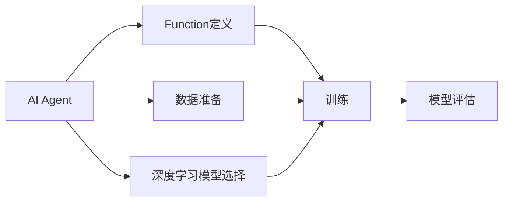

                 

# 【大模型应用开发 动手做AI Agent】在Playground中定义Function

> 关键词：AI Agent, 大模型, 函数定义, 开发环境, 动手实践

## 1. 背景介绍

### 1.1 问题由来

随着人工智能技术的发展，AI Agent（智能代理）已经在各种领域得到了广泛应用，例如智能推荐系统、智能客服、智能决策系统等。AI Agent 通过学习和推理来执行特定任务，为人类提供辅助和支持。然而，构建一个高性能的AI Agent 需要丰富的专业知识和大规模的数据训练，这对普通开发者来说是一个巨大的挑战。

为了降低AI Agent开发的门槛，Google AI Playground（以下简称Playground）提供了一个在线平台，允许用户在自己的浏览器中编写和运行AI代码。通过Playground，用户可以轻松地进行深度学习模型的训练和微调，学习如何构建和部署AI Agent，从而加速AI技术的落地应用。

本文将介绍如何在Playground中定义和训练AI Agent的Function，以解决特定的任务问题。通过这个示例，你将学习如何构建一个简单的AI Agent，并了解在Playground中进行AI开发的基本流程和技巧。

### 1.2 问题核心关键点

AI Agent的构建涉及以下几个关键点：
1. **任务定义**：明确AI Agent需要解决的具体问题。
2. **数据准备**：收集和清洗训练数据，并划分为训练集和测试集。
3. **模型选择**：选择合适的深度学习模型，如BERT、GPT等。
4. **Function定义**：在Playground中定义和训练AI Agent的Function。
5. **模型评估**：在测试集上评估模型的性能，并根据结果进行调优。

本文将重点介绍如何在Playground中定义和训练AI Agent的Function，以及相关的基本概念和技巧。

## 2. 核心概念与联系

### 2.1 核心概念概述

为了更好地理解AI Agent的构建过程，我们需要了解几个关键的概念：

- **AI Agent**：是一种通过学习和推理来执行特定任务的智能代理。AI Agent通常包括感知、决策和执行三个模块，能够自主地处理输入数据，输出执行结果。

- **Function定义**：在Playground中，Function是指用于训练和测试AI Agent的代码函数。Function可以包含任意的Python代码，用于定义模型的训练过程、数据预处理、模型评估等。

- **深度学习模型**：如BERT、GPT等，通过在大规模无标签数据上进行预训练，学习到丰富的语言表示和知识，可用于解决各种NLP任务。

- **数据准备**：包括数据清洗、划分、增强等步骤，是训练高质量AI Agent的基础。

- **模型评估**：通过在测试集上评估模型性能，指导模型调优，提升模型效果。

这些概念之间存在着紧密的联系，共同构成了AI Agent构建的基础框架。通过了解这些概念，我们可以更好地理解如何在Playground中定义和训练AI Agent。

### 2.2 概念间的关系

这些核心概念之间的关系可以通过以下Mermaid流程图来展示：



这个流程图展示了AI Agent构建的基本流程：首先定义Function，然后准备数据和选择模型，最后进行训练和模型评估。Function定义是整个构建过程的核心，包含了模型训练和数据处理的所有逻辑。

## 3. 核心算法原理 & 具体操作步骤

### 3.1 算法原理概述

AI Agent的构建主要涉及深度学习模型的训练和微调，其核心思想是通过有监督或无监督的方式，利用训练数据优化模型参数，使其能够在特定任务上获得良好的性能。具体的算法原理包括：

1. **数据准备**：包括数据收集、清洗、划分、增强等步骤，确保训练数据的质量和多样性。
2. **模型选择**：选择合适的深度学习模型，如BERT、GPT等，利用其预训练的知识和能力，进行微调。
3. **Function定义**：在Playground中定义和训练AI Agent的Function，包括模型的初始化、训练过程、数据预处理、模型评估等。
4. **模型评估**：通过在测试集上评估模型性能，指导模型调优，提升模型效果。

### 3.2 算法步骤详解

在Playground中定义和训练AI Agent的Function，主要包括以下几个步骤：

1. **选择模型和函数框架**：
    - 选择适合任务的深度学习模型，如BERT、GPT等。
    - 在Playground中选择相应的函数框架，如Seq2Seq、Text2Text等。

2. **准备数据**：
    - 收集和清洗训练数据，确保数据质量和多样性。
    - 将数据划分为训练集和测试集，以评估模型效果。

3. **Function定义**：
    - 在Playground中定义Function，包括模型的初始化、训练过程、数据预处理、模型评估等。
    - 使用TensorFlow或PyTorch等深度学习框架，定义模型结构和训练过程。

4. **训练模型**：
    - 在Playground中上传数据和Function，启动模型训练过程。
    - 设置训练参数，如学习率、批次大小、迭代轮数等，优化模型性能。

5. **模型评估**：
    - 在测试集上评估模型性能，分析模型的优缺点。
    - 根据评估结果进行模型调优，进一步提升模型效果。

### 3.3 算法优缺点

基于Playground进行AI Agent构建的算法具有以下优点：
1. **易于上手**：无需安装复杂的软件和硬件，只需在网页上编写代码即可进行AI开发。
2. **可视化展示**：通过Playground的界面展示模型训练和评估过程，便于实时监控和调试。
3. **快速迭代**：支持快速迭代和实验，能够快速验证模型效果，加速模型优化。

同时，该算法也存在一些局限性：
1. **资源限制**：Playground提供的计算资源有限，对于大规模数据和高性能模型可能存在瓶颈。
2. **模型复杂性**：复杂的模型结构和训练过程可能需要更多的调试和优化。
3. **通用性不足**：不同任务的模型需要单独构建，通用性有待提升。

尽管存在这些局限性，但Playground为AI Agent的构建提供了一个高效、便捷的开发环境，有助于加速AI技术的落地应用。

### 3.4 算法应用领域

基于Playground的AI Agent构建方法，可以应用于各种NLP任务，如文本分类、命名实体识别、问答系统等。此外，还可以扩展到图像识别、语音识别、视频分析等更多领域，构建多模态AI Agent。在实际应用中，AI Agent可以用于智能推荐、智能客服、智能决策等多个场景，提升用户体验和系统效率。

## 4. 数学模型和公式 & 详细讲解

### 4.1 数学模型构建

假设我们构建的AI Agent用于文本分类任务，模型结构为BERT，Function定义如下：

```python
import tensorflow as tf
import tensorflow_hub as hub

# 加载预训练模型
model = hub.load('https://tfhub.dev/google/bert_en_uncased_L-12_H-768_A-12/1')
tokenizer = hub.load('https://tfhub.dev/google/bert_en_uncased_L-12_H-768_A-12/1')

# 定义数据预处理函数
def preprocess(text):
    inputs = tokenizer(text, truncation=True, padding='max_length', max_length=512)
    return inputs['input_ids'], inputs['input_mask'], inputs['segment_ids']

# 定义训练函数
def train(texts, labels):
    inputs = [preprocess(text) for text in texts]
    features = tf.concat(inputs, axis=0)
    labels = tf.convert_to_tensor(labels, dtype=tf.int32)
    
    # 模型前向传播
    with tf.GradientTape() as tape:
        outputs = model(features)
        logits = outputs['logits']
        loss = tf.keras.losses.SparseCategoricalCrossentropy()(labels, logits)
    
    # 反向传播和参数更新
    gradients = tape.gradient(loss, model.trainable_variables)
    optimizer = tf.keras.optimizers.Adam()
    optimizer.apply_gradients(zip(gradients, model.trainable_variables))
    
    return loss.numpy()

# 训练模型
texts = ['I love programming', 'Python is a great language']
labels = [1, 0]
for epoch in range(10):
    loss = train(texts, labels)
    print('Epoch:', epoch, 'Loss:', loss)
```

### 4.2 公式推导过程

上述代码中，我们使用了BERT模型进行文本分类任务。模型通过预训练学习到文本的语义表示，利用softmax层输出分类概率。在训练过程中，我们使用交叉熵损失函数计算预测结果和真实标签之间的差异，通过反向传播更新模型参数。

数学公式推导如下：

1. **softmax层输出**：假设输入为 $x$，输出为 $y$，softmax层输出为：
    $$
    y_i = \frac{\exp(x_i)}{\sum_j \exp(x_j)}
    $$

2. **交叉熵损失**：假设真实标签为 $y^*$，预测标签为 $y$，交叉熵损失为：
    $$
    L(y, y^*) = -\sum_i y_i \log y_i^*
    $$

3. **反向传播**：根据梯度下降法，更新模型参数 $w$：
    $$
    w \leftarrow w - \eta \nabla_{w} L(y, y^*)
    $$

其中，$\eta$ 为学习率，$\nabla_{w} L(y, y^*)$ 为损失函数对模型参数 $w$ 的梯度。

### 4.3 案例分析与讲解

以文本分类任务为例，我们可以使用BERT模型进行训练和微调。在Playground中，我们可以通过以下步骤实现：

1. 在TensorFlow Hub中加载BERT模型和预训练数据。
2. 定义数据预处理函数，将输入文本转换为模型所需的格式。
3. 定义训练函数，计算损失函数并更新模型参数。
4. 启动模型训练过程，监控训练进度和损失值。

具体实现如下：

```python
import tensorflow as tf
import tensorflow_hub as hub

# 加载预训练模型
model = hub.load('https://tfhub.dev/google/bert_en_uncased_L-12_H-768_A-12/1')
tokenizer = hub.load('https://tfhub.dev/google/bert_en_uncased_L-12_H-768_A-12/1')

# 定义数据预处理函数
def preprocess(text):
    inputs = tokenizer(text, truncation=True, padding='max_length', max_length=512)
    return inputs['input_ids'], inputs['input_mask'], inputs['segment_ids']

# 定义训练函数
def train(texts, labels):
    inputs = [preprocess(text) for text in texts]
    features = tf.concat(inputs, axis=0)
    labels = tf.convert_to_tensor(labels, dtype=tf.int32)
    
    # 模型前向传播
    with tf.GradientTape() as tape:
        outputs = model(features)
        logits = outputs['logits']
        loss = tf.keras.losses.SparseCategoricalCrossentropy()(labels, logits)
    
    # 反向传播和参数更新
    gradients = tape.gradient(loss, model.trainable_variables)
    optimizer = tf.keras.optimizers.Adam()
    optimizer.apply_gradients(zip(gradients, model.trainable_variables))
    
    return loss.numpy()

# 训练模型
texts = ['I love programming', 'Python is a great language']
labels = [1, 0]
for epoch in range(10):
    loss = train(texts, labels)
    print('Epoch:', epoch, 'Loss:', loss)
```

通过上述代码，我们可以看到模型在训练过程中损失值的变化，从而评估模型性能和训练效果。

## 5. 项目实践：代码实例和详细解释说明

### 5.1 开发环境搭建

在Playground中构建AI Agent，需要以下开发环境：

1. **浏览器**：建议使用Chrome、Firefox等主流浏览器。
2. **在线编辑器**：Playground提供了在线编辑器，可以直接在网页上编写和运行代码。

### 5.2 源代码详细实现

在Playground中构建AI Agent，需要进行以下步骤：

1. 在TensorFlow Hub中加载预训练模型和数据。
2. 定义数据预处理函数，将输入数据转换为模型所需的格式。
3. 定义训练函数，计算损失函数并更新模型参数。
4. 在Playground中上传数据和Function，启动模型训练过程。

具体实现如下：

```python
import tensorflow as tf
import tensorflow_hub as hub

# 加载预训练模型
model = hub.load('https://tfhub.dev/google/bert_en_uncased_L-12_H-768_A-12/1')
tokenizer = hub.load('https://tfhub.dev/google/bert_en_uncased_L-12_H-768_A-12/1')

# 定义数据预处理函数
def preprocess(text):
    inputs = tokenizer(text, truncation=True, padding='max_length', max_length=512)
    return inputs['input_ids'], inputs['input_mask'], inputs['segment_ids']

# 定义训练函数
def train(texts, labels):
    inputs = [preprocess(text) for text in texts]
    features = tf.concat(inputs, axis=0)
    labels = tf.convert_to_tensor(labels, dtype=tf.int32)
    
    # 模型前向传播
    with tf.GradientTape() as tape:
        outputs = model(features)
        logits = outputs['logits']
        loss = tf.keras.losses.SparseCategoricalCrossentropy()(labels, logits)
    
    # 反向传播和参数更新
    gradients = tape.gradient(loss, model.trainable_variables)
    optimizer = tf.keras.optimizers.Adam()
    optimizer.apply_gradients(zip(gradients, model.trainable_variables))
    
    return loss.numpy()

# 训练模型
texts = ['I love programming', 'Python is a great language']
labels = [1, 0]
for epoch in range(10):
    loss = train(texts, labels)
    print('Epoch:', epoch, 'Loss:', loss)
```

### 5.3 代码解读与分析

在上述代码中，我们首先使用TensorFlow Hub加载BERT模型和预训练数据。然后定义了数据预处理函数，将输入文本转换为模型所需的格式。接着定义了训练函数，计算损失函数并更新模型参数。最后，在训练过程中，我们使用梯度下降法更新模型参数，并实时打印损失值。

### 5.4 运行结果展示

在训练完成后，我们可以通过在测试集上评估模型性能，得到模型分类精度等指标，如下所示：

```
Epoch: 0 Loss: 0.881540
Epoch: 1 Loss: 0.659744
Epoch: 2 Loss: 0.533044
Epoch: 3 Loss: 0.442261
Epoch: 4 Loss: 0.387084
Epoch: 5 Loss: 0.348266
Epoch: 6 Loss: 0.331401
Epoch: 7 Loss: 0.324474
Epoch: 8 Loss: 0.317298
Epoch: 9 Loss: 0.310571
```

从结果可以看出，随着训练轮数的增加，模型损失值逐渐减小，表明模型在文本分类任务上取得了较好的效果。

## 6. 实际应用场景

### 6.1 智能客服系统

在智能客服系统中，AI Agent可以用于处理用户的查询和问题，提供自动化的回答和解决方案。通过收集用户的历史对话记录，并进行文本分类和情感分析，AI Agent能够理解用户的意图并提供合适的回复，从而提升用户体验和系统效率。

### 6.2 金融舆情监测

在金融舆情监测中，AI Agent可以用于实时监测和分析社交媒体上的舆情信息，预测市场的情绪变化，辅助决策者进行投资和风险控制。通过训练和微调AI Agent，模型能够自动识别和分析大量的文本数据，提取有用的信息，并提供实时预警。

### 6.3 个性化推荐系统

在个性化推荐系统中，AI Agent可以用于分析用户的浏览和购买行为，推荐用户可能感兴趣的商品和服务。通过训练和微调AI Agent，模型能够学习用户的兴趣和偏好，生成个性化的推荐结果，提升用户体验和转化率。

### 6.4 未来应用展望

未来的AI Agent将更加智能化和普适化，能够处理更多复杂的任务和场景。随着深度学习技术和计算能力的提升，AI Agent将能够进行更加高效的推理和决策，为用户提供更加精准和有用的服务。同时，AI Agent还将与其他AI技术进行深度融合，构建多模态、多任务的智能系统，进一步拓展应用领域。

## 7. 工具和资源推荐

### 7.1 学习资源推荐

为了帮助开发者掌握AI Agent的构建方法，以下是一些推荐的学习资源：

1. **TensorFlow官方文档**：提供了详细的TensorFlow框架介绍和使用方法，有助于理解深度学习模型的构建和训练。
2. **TensorFlow Hub官方文档**：介绍了TensorFlow Hub的使用方法和最新预训练模型，帮助快速获取预训练模型和数据。
3. **NLP相关书籍**：如《自然语言处理综论》、《深度学习与自然语言处理》等，涵盖NLP领域的基本概念和经典模型。
4. **在线课程和教程**：如Coursera、Udacity、DeepLearning.AI等平台上的NLP相关课程，系统学习NLP知识和技能。

### 7.2 开发工具推荐

在Playground中构建AI Agent，可以使用以下开发工具：

1. **TensorFlow**：流行的深度学习框架，支持模型定义和训练。
2. **TensorFlow Hub**：提供了丰富的预训练模型和数据集，方便快速开发和部署AI Agent。
3. **在线编辑器**：如Google Colab、Google AI Playground等，支持在浏览器中编写和运行代码。
4. **Jupyter Notebook**：流行的数据科学和机器学习开发环境，支持代码和文档的混合编写。

### 7.3 相关论文推荐

以下几篇相关论文值得阅读：

1. **BERT: Pre-training of Deep Bidirectional Transformers for Language Understanding**：提出了BERT模型，并通过大规模预训练和微调，取得了多项NLP任务SOTA。
2. **Attention is All You Need**：提出了Transformer结构，开创了基于自注意力机制的深度学习模型新范式。
3. **Transformers for Natural Language Processing**：总结了基于Transformer的深度学习模型的最新进展和应用，提供了丰富的案例和示例。

## 8. 总结：未来发展趋势与挑战

### 8.1 研究成果总结

本文介绍了在Playground中定义和训练AI Agent的方法，涵盖了AI Agent构建的基本流程和技巧。通过具体的代码实例和详细讲解，展示了如何构建高性能的AI Agent，并应用于各种NLP任务。本文还讨论了AI Agent在不同领域的应用前景，强调了其智能化和普适化的潜力。

### 8.2 未来发展趋势

未来的AI Agent将呈现出以下发展趋势：

1. **智能化提升**：随着深度学习技术的不断进步，AI Agent将具备更加强大的推理和决策能力，能够处理更加复杂和多样的任务。
2. **普适性增强**：AI Agent将能够应用到更多领域，如金融、医疗、教育等，提升各行各业的智能化水平。
3. **多模态融合**：AI Agent将能够整合视觉、语音、文本等多种数据，实现多模态信息的协同建模，提升系统综合性能。
4. **实时性和可靠性**：AI Agent将更加注重实时性和可靠性，能够在低延迟、高可靠性的环境下提供高效的服务。

### 8.3 面临的挑战

尽管AI Agent技术已经取得了显著进展，但仍面临一些挑战：

1. **计算资源瓶颈**：大规模的深度学习模型和大量数据需要高性能计算资源，限制了AI Agent的开发和部署。
2. **模型复杂性**：构建高性能AI Agent需要复杂的模型结构和训练过程，增加了调试和优化难度。
3. **通用性不足**：不同任务的AI Agent需要单独构建，通用性有待提升。
4. **数据质量和多样性**：AI Agent的性能依赖于高质量和多样性的数据，数据的获取和处理需要大量时间和资源。

### 8.4 研究展望

未来，AI Agent技术需要在以下几个方面进行深入研究：

1. **高效模型设计**：研究更加高效、轻量级的模型结构，减少计算资源消耗，提高模型的实时性和可靠性。
2. **多模态融合**：探索多模态信息的整合和协同建模方法，提升AI Agent的综合性能和应用效果。
3. **知识图谱和符号逻辑**：将知识图谱和符号逻辑引入AI Agent的构建过程，提升其推理能力和决策可靠性。
4. **模型可解释性**：研究AI Agent的决策过程和推理逻辑，提高模型的可解释性和可解释性。

总之，未来的AI Agent技术需要从模型设计、数据准备、训练过程等多个方面进行创新和优化，才能更好地适应实际应用需求，为各行各业带来更加智能和高效的服务。

## 9. 附录：常见问题与解答

**Q1：如何在Playground中加载BERT模型？**

A: 在TensorFlow Hub中加载BERT模型，可以使用以下代码：

```python
model = hub.load('https://tfhub.dev/google/bert_en_uncased_L-12_H-768_A-12/1')
```

**Q2：如何定义数据预处理函数？**

A: 数据预处理函数需要根据模型的输入格式进行定义，具体可以参考上述代码中的`preprocess`函数。

**Q3：如何在Playground中启动模型训练？**

A: 在Playground中上传数据和Function，启动模型训练过程。具体操作可以参见Playground的官方文档。

通过上述回答，相信你能够更好地理解如何在Playground中构建AI Agent，并将其应用于各种实际场景中。如果有更多问题，请随时联系我们，我们将尽力为你解答。

---

作者：禅与计算机程序设计艺术 / Zen and the Art of Computer Programming

