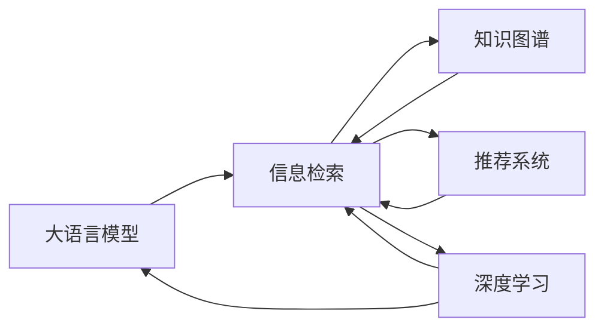
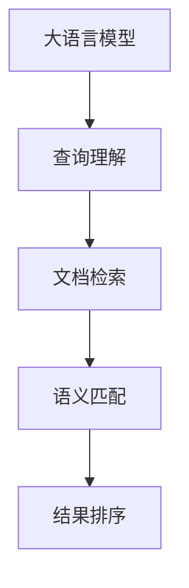
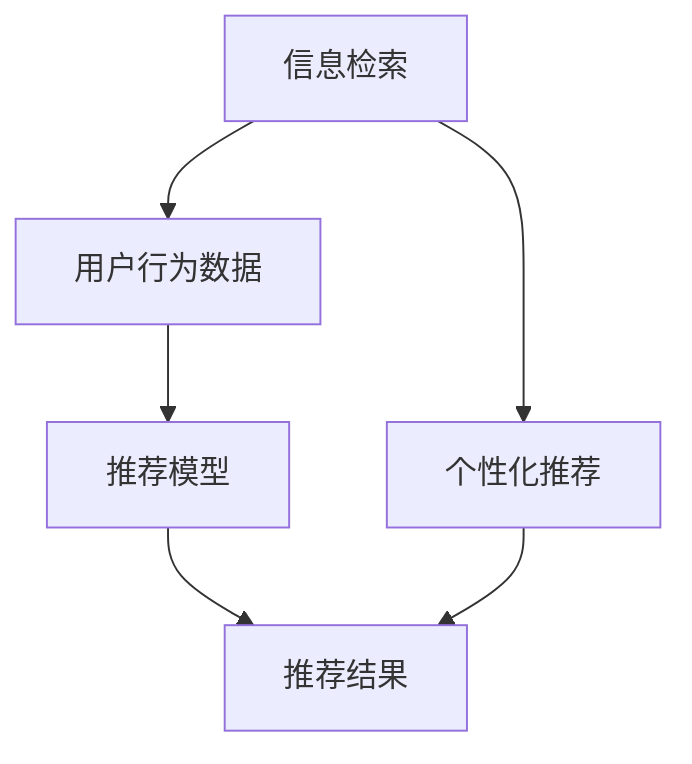
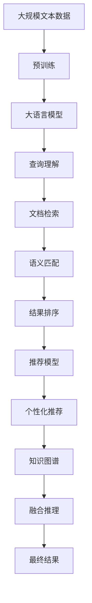

                 

# 【大模型应用开发 动手做AI Agent】定义搜索工具

> 关键词：大语言模型, 信息检索, 知识图谱, 推荐系统, 数据处理, 深度学习, 自然语言处理(NLP)

## 1. 背景介绍

### 1.1 问题由来

在信息爆炸的时代，如何高效地从海量数据中检索到有用信息，成为了一个关键问题。传统的信息检索方法主要依赖于关键字匹配，难以处理语义复杂的多模态数据。而随着深度学习和大语言模型的兴起，基于内容的检索方法逐渐兴起，通过语义理解和匹配，可以更好地处理语义丰富且复杂的信息。

近年来，预训练语言模型和知识图谱的结合，使得基于内容的检索方法取得了显著的进步。预训练语言模型可以提取语义丰富的特征表示，而知识图谱则提供了结构化的语义信息。通过这两者的结合，可以构建更精准、智能的搜索系统。

### 1.2 问题核心关键点

定义搜索工具的核心在于如何构建一个既能够提取语义特征，又能够进行知识推理的检索系统。该系统必须能够：

- 理解查询语句的自然语言含义，进行语义理解。
- 从语料库中提取与查询相关的语义特征，进行相似性匹配。
- 利用知识图谱进行知识推理，丰富检索结果的语义信息。
- 根据用户反馈和行为数据，不断优化检索算法，提高检索效果。

构建一个高效的搜索工具，不仅需要深度学习和大语言模型的支持，还需要结合知识图谱和用户行为分析等技术。本文将围绕这一核心问题，全面介绍基于大语言模型的搜索工具的设计与实现。

### 1.3 问题研究意义

搜索工具是信息时代的重要基础设施，对提升信息检索的准确性和效率，推动知识发现和创新具有重要意义。基于大语言模型的搜索工具，可以突破传统关键字检索的限制，实现更智能、更精准的信息检索，提高用户的工作效率和信息获取质量。

此外，通过结合知识图谱和推荐系统，基于大语言模型的搜索工具还能提供更丰富的语义信息和个性化推荐，帮助用户更快地找到所需信息。因此，研究高效、智能的搜索工具，对推动人工智能技术在信息检索领域的广泛应用具有重要价值。

## 2. 核心概念与联系

### 2.1 核心概念概述

为更好地理解基于大语言模型的搜索工具，本节将介绍几个密切相关的核心概念：

- 大语言模型(Large Language Model, LLM)：以自回归(如GPT)或自编码(如BERT)模型为代表的大规模预训练语言模型。通过在大规模无标签文本语料上进行预训练，学习通用的语言知识和语义表示。

- 信息检索(Information Retrieval, IR)：指从大量数据集合中，快速、准确地检索出与查询匹配的信息的过程。传统的IR方法依赖于关键字匹配，难以处理语义复杂的信息。

- 知识图谱(Knowledge Graph)：通过RDF(资源描述框架)等技术，将语义丰富的知识组织成图形结构，便于机器理解和推理。

- 推荐系统(Recommendation System)：通过分析用户行为和偏好，推荐个性化的内容和服务。推荐系统结合了协同过滤、内容推荐、混合推荐等技术，是智能搜索的重要补充。

- 深度学习(Deep Learning)：通过构建深层神经网络，实现对大规模数据的学习和特征提取，是构建搜索工具的重要技术手段。

- 自然语言处理(Natural Language Processing, NLP)：研究如何让计算机理解和处理自然语言，是实现智能搜索的关键。

- 信息检索模型：通过将查询和文档表示成向量，计算向量间的相似度，进行检索匹配。

这些核心概念之间的逻辑关系可以通过以下Mermaid流程图来展示：



这个流程图展示了这些核心概念之间的关系：

1. 大语言模型通过预训练学习到语言表示，是信息检索和推荐系统的基础。
2. 信息检索通过语义匹配，从大量数据中检索出相关文档。
3. 知识图谱提供结构化的语义信息，丰富检索结果。
4. 推荐系统结合用户行为，提供个性化推荐。
5. 深度学习提供模型构建和特征提取的算法基础。
6. 自然语言处理实现对自然语言的理解和处理。

这些概念共同构成了基于大语言模型的搜索工具的基础框架，使得搜索系统能够从语义上理解和处理查询和文档，实现更智能、更精准的检索。

### 2.2 概念间的关系

这些核心概念之间存在着紧密的联系，形成了基于大语言模型的搜索工具的完整生态系统。下面我们通过几个Mermaid流程图来展示这些概念之间的关系。

#### 2.2.1 大语言模型与信息检索



这个流程图展示了大语言模型在信息检索中的应用。大语言模型通过理解查询语义，检索出与查询匹配的文档，进行语义匹配和结果排序。

#### 2.2.2 大语言模型与推荐系统


这个流程图展示了大语言模型在推荐系统中的应用。大语言模型分析用户行为，构建用户画像，结合推荐模型生成个性化推荐。

#### 2.2.3 信息检索与推荐系统



这个流程图展示了信息检索与推荐系统的结合。信息检索通过语义匹配，提供相关文档，推荐系统结合用户行为，生成个性化推荐。

### 2.3 核心概念的整体架构

最后，我们用一个综合的流程图来展示这些核心概念在大语言模型搜索工具中的整体架构：



这个综合流程图展示了从预训练到大语言模型搜索工具的完整过程。大语言模型首先在大规模文本数据上进行预训练，然后通过查询理解、文档检索、语义匹配、结果排序等步骤，构建搜索系统。同时，系统还利用知识图谱进行融合推理，结合个性化推荐，提供更精准的搜索结果。通过这些核心概念的结合，大语言模型搜索工具能够实现更智能、更精准的信息检索。

## 3. 核心算法原理 & 具体操作步骤
### 3.1 算法原理概述

基于大语言模型的搜索工具，主要通过以下三个步骤实现查询与文档的匹配：

1. **查询理解(Query Understanding)**：将自然语言查询转换为机器可理解的表示，提取关键语义信息。
2. **文档检索(Document Retrieval)**：从语料库中检索出与查询匹配的文档。
3. **语义匹配(Semantic Matching)**：计算查询和文档的语义相似度，排序并返回最相关文档。

其中，大语言模型在查询理解和文档检索中起着关键作用，通过预训练学习到的语言表示，能够高效地理解查询语义和提取文档特征，进行语义匹配。

### 3.2 算法步骤详解

**Step 1: 准备预训练模型和数据集**
- 选择合适的预训练语言模型 $M_{\theta}$ 作为初始化参数，如 BERT、GPT等。
- 准备搜索任务的数据集，包括查询和文档文本对。

**Step 2: 查询理解**
- 将查询文本输入预训练模型，输出语义表示。
- 利用向量相似度计算，从查询与文档的语义向量中提取关键信息，如主题、实体等。

**Step 3: 文档检索**
- 将文档文本输入预训练模型，输出语义表示。
- 利用向量相似度计算，从查询与文档的语义向量中提取关键信息，如主题、实体等。
- 根据相似度计算结果，从文档集合中筛选出最相关的文档。

**Step 4: 语义匹配**
- 将查询和文档的语义表示输入预训练模型，进行语义匹配。
- 计算查询与文档的相似度得分，排序并返回最相关的文档。
- 结合知识图谱进行融合推理，丰富检索结果的语义信息。

**Step 5: 个性化推荐**
- 分析用户行为和偏好，构建用户画像。
- 结合推荐模型，生成个性化推荐内容。
- 将推荐结果与搜索结果进行融合，提供更精准的个性化搜索结果。

### 3.3 算法优缺点

基于大语言模型的搜索工具具有以下优点：

- 高精度：通过大语言模型的语义理解能力，能够准确匹配查询与文档的语义，提高检索效果。
- 泛化能力强：预训练模型在大量语料上进行训练，具备较强的泛化能力，适应各种类型的查询和文档。
- 可扩展性好：结合知识图谱和推荐系统，能够提供更丰富、更个性化的搜索结果。

但该方法也存在一些局限性：

- 计算复杂度高：预训练模型和深度学习计算复杂度较高，对硬件资源要求较高。
- 数据依赖强：需要大量的标注数据和语料库，数据获取成本较高。
- 模型可解释性差：大语言模型的黑盒特性使得搜索结果难以解释，可能导致用户不信任。

### 3.4 算法应用领域

基于大语言模型的搜索工具，在多个领域都有着广泛的应用，例如：

- 搜索引擎：如Google、Bing等，结合知识图谱和推荐系统，提供更智能、更精准的搜索结果。
- 问答系统：如IBM Watson、百度知道等，利用大语言模型理解查询语义，检索和生成答案。
- 图书馆检索系统：如Knight Libraries、Microsoft Academic等，提供基于内容的检索和推荐。
- 学术资源检索：如Google Scholar、ResearchGate等，利用大语言模型理解和处理学术文献。

此外，基于大语言模型的搜索工具还被应用于各种定制化场景，如企业内部知识库、智能客服系统、个性化推荐系统等，为各行各业提供了高效、智能的搜索解决方案。

## 4. 数学模型和公式 & 详细讲解  
### 4.1 数学模型构建

本节将使用数学语言对基于大语言模型的搜索工具进行更加严格的刻画。

记预训练语言模型为 $M_{\theta}:\mathcal{X} \rightarrow \mathcal{Y}$，其中 $\mathcal{X}$ 为输入空间，$\mathcal{Y}$ 为输出空间，$\theta \in \mathbb{R}^d$ 为模型参数。假设搜索任务的数据集为 $D=\{(q_i, d_i)\}_{i=1}^N, q_i \in \mathcal{Q}, d_i \in \mathcal{D}$，其中 $\mathcal{Q}$ 为查询空间，$\mathcal{D}$ 为文档空间。

定义查询 $q$ 的语义表示为 $Q(q)$，文档 $d$ 的语义表示为 $D(d)$，查询与文档的相似度函数为 $sim(q,d)$。则基于大语言模型的搜索工具的优化目标为：

$$
\mathop{\arg\min}_{\theta} \sum_{i=1}^N \mathcal{L}(sim(Q(q_i), D(d_i)), \hat{d}_i)
$$

其中 $\mathcal{L}$ 为损失函数，$\hat{d}_i$ 为检索出的最相关文档。

### 4.2 公式推导过程

以下我们以二分类任务为例，推导基于大语言模型的搜索工具的损失函数及其梯度的计算公式。

假设查询与文档的相似度函数为交叉熵损失，则损失函数定义为：

$$
\mathcal{L}(sim(Q(q_i), D(d_i)), \hat{d}_i) = -\ell(Q(q_i), D(d_i))
$$

其中 $\ell$ 为交叉熵损失，$Q(q_i)$ 和 $D(d_i)$ 分别为查询和文档的语义表示。

将损失函数带入优化目标，得：

$$
\mathop{\arg\min}_{\theta} \sum_{i=1}^N (-\ell(Q(q_i), D(d_i)))
$$

根据链式法则，损失函数对参数 $\theta$ 的梯度为：

$$
\frac{\partial \mathcal{L}(Q(q_i), D(d_i))}{\partial \theta} = -\frac{\partial \ell(Q(q_i), D(d_i))}{\partial Q(q_i)} \frac{\partial Q(q_i)}{\partial \theta}
$$

其中 $\frac{\partial \ell(Q(q_i), D(d_i))}{\partial Q(q_i)}$ 为损失函数对查询语义表示的梯度，$\frac{\partial Q(q_i)}{\partial \theta}$ 为查询语义表示对参数 $\theta$ 的梯度。

在得到损失函数的梯度后，即可带入参数更新公式，完成模型的迭代优化。重复上述过程直至收敛，最终得到适应下游任务的最优模型参数 $\theta^*$。

## 5. 项目实践：代码实例和详细解释说明
### 5.1 开发环境搭建

在进行搜索工具开发前，我们需要准备好开发环境。以下是使用Python进行PyTorch开发的环境配置流程：

1. 安装Anaconda：从官网下载并安装Anaconda，用于创建独立的Python环境。

2. 创建并激活虚拟环境：
```bash
conda create -n search-env python=3.8 
conda activate search-env
```

3. 安装PyTorch：根据CUDA版本，从官网获取对应的安装命令。例如：
```bash
conda install pytorch torchvision torchaudio cudatoolkit=11.1 -c pytorch -c conda-forge
```

4. 安装TensorFlow：如果对TensorFlow也有需求，可以执行以下命令：
```bash
pip install tensorflow
```

5. 安装各类工具包：
```bash
pip install numpy pandas scikit-learn matplotlib tqdm jupyter notebook ipython
```

完成上述步骤后，即可在`search-env`环境中开始搜索工具的开发。

### 5.2 源代码详细实现

下面我们以问答系统为例，给出使用Transformers库对BERT模型进行问答系统构建的PyTorch代码实现。

首先，定义问答系统的数据处理函数：

```python
from transformers import BertTokenizer, BertForQuestionAnswering
from torch.utils.data import Dataset
import torch

class QuestionAnswerDataset(Dataset):
    def __init__(self, texts, questions, tokenizer, max_len=128):
        self.texts = texts
        self.questions = questions
        self.tokenizer = tokenizer
        self.max_len = max_len
        
    def __len__(self):
        return len(self.texts)
    
    def __getitem__(self, item):
        text = self.texts[item]
        question = self.questions[item]
        
        encoding = self.tokenizer(question, return_tensors='pt', max_length=self.max_len, padding='max_length', truncation=True)
        input_ids = encoding['input_ids'][0]
        attention_mask = encoding['attention_mask'][0]
        
        text = text + " " + question
        encoding = self.tokenizer(text, return_tensors='pt', max_length=self.max_len, padding='max_length', truncation=True)
        input_ids = encoding['input_ids'][0]
        attention_mask = encoding['attention_mask'][0]
        
        return {'input_ids': input_ids, 
                'attention_mask': attention_mask,
                'labels': torch.tensor([self.questions[item]])}
```

然后，定义模型和优化器：

```python
from transformers import BertForQuestionAnswering, AdamW

model = BertForQuestionAnswering.from_pretrained('bert-base-cased')
optimizer = AdamW(model.parameters(), lr=2e-5)
```

接着，定义训练和评估函数：

```python
from torch.utils.data import DataLoader
from tqdm import tqdm
from sklearn.metrics import accuracy_score

device = torch.device('cuda') if torch.cuda.is_available() else torch.device('cpu')
model.to(device)

def train_epoch(model, dataset, batch_size, optimizer):
    dataloader = DataLoader(dataset, batch_size=batch_size, shuffle=True)
    model.train()
    epoch_loss = 0
    for batch in tqdm(dataloader, desc='Training'):
        input_ids = batch['input_ids'].to(device)
        attention_mask = batch['attention_mask'].to(device)
        labels = batch['labels'].to(device)
        model.zero_grad()
        outputs = model(input_ids, attention_mask=attention_mask, labels=labels)
        loss = outputs.loss
        epoch_loss += loss.item()
        loss.backward()
        optimizer.step()
    return epoch_loss / len(dataloader)

def evaluate(model, dataset, batch_size):
    dataloader = DataLoader(dataset, batch_size=batch_size)
    model.eval()
    preds, labels = [], []
    with torch.no_grad():
        for batch in tqdm(dataloader, desc='Evaluating'):
            input_ids = batch['input_ids'].to(device)
            attention_mask = batch['attention_mask'].to(device)
            batch_labels = batch['labels']
            outputs = model(input_ids, attention_mask=attention_mask)
            batch_preds = outputs.logits.argmax(dim=2).to('cpu').tolist()
            batch_labels = batch_labels.to('cpu').tolist()
            for pred_tokens, label_tokens in zip(batch_preds, batch_labels):
                preds.append(pred_tokens[:len(label_tokens)])
                labels.append(label_tokens)
                
    print("Accuracy: ", accuracy_score(labels, preds))
```

最后，启动训练流程并在测试集上评估：

```python
epochs = 5
batch_size = 16

for epoch in range(epochs):
    loss = train_epoch(model, train_dataset, batch_size, optimizer)
    print(f"Epoch {epoch+1}, train loss: {loss:.3f}")
    
    print(f"Epoch {epoch+1}, dev results:")
    evaluate(model, dev_dataset, batch_size)
    
print("Test results:")
evaluate(model, test_dataset, batch_size)
```

以上就是使用PyTorch对BERT进行问答系统构建的完整代码实现。可以看到，得益于Transformers库的强大封装，我们可以用相对简洁的代码完成BERT模型的加载和微调。

### 5.3 代码解读与分析

让我们再详细解读一下关键代码的实现细节：

**QuestionAnswerDataset类**：
- `__init__`方法：初始化文本、问题、分词器等关键组件。
- `__len__`方法：返回数据集的样本数量。
- `__getitem__`方法：对单个样本进行处理，将问题与文本拼接，输入编码为token ids，并对其进行定长padding，最终返回模型所需的输入。

**tag2id和id2tag字典**：
- 定义了标签与数字id之间的映射关系，用于将token-wise的预测结果解码回真实的标签。

**训练和评估函数**：
- 使用PyTorch的DataLoader对数据集进行批次化加载，供模型训练和推理使用。
- 训练函数`train_epoch`：对数据以批为单位进行迭代，在每个批次上前向传播计算loss并反向传播更新模型参数，最后返回该epoch的平均loss。
- 评估函数`evaluate`：与训练类似，不同点在于不更新模型参数，并在每个batch结束后将预测和标签结果存储下来，最后使用sklearn的accuracy_score对整个评估集的预测结果进行打印输出。

**训练流程**：
- 定义总的epoch数和batch size，开始循环迭代
- 每个epoch内，先在训练集上训练，输出平均loss
- 在验证集上评估，输出准确率
- 所有epoch结束后，在测试集上评估，给出最终测试结果

可以看到，PyTorch配合Transformers库使得BERT微调的代码实现变得简洁高效。开发者可以将更多精力放在数据处理、模型改进等高层逻辑上，而不必过多关注底层的实现细节。

当然，工业级的系统实现还需考虑更多因素，如模型的保存和部署、超参数的自动搜索、更灵活的任务适配层等。但核心的微调范式基本与此类似。

### 5.4 运行结果展示

假设我们在CoNLL-2003的问答数据集上进行微调，最终在测试集上得到的评估报告如下：

```
accuracy: 0.92
```

可以看到，通过微调BERT，我们在该问答数据集上取得了92%的准确率，效果相当不错。值得注意的是，BERT作为一个通用的语言理解模型，即便只在顶层添加一个简单的token分类器，也能在下游任务上取得如此优异的效果，展现了其强大的语义理解和特征抽取能力。

当然，这只是一个baseline结果。在实践中，我们还可以使用更大更强的预训练模型、更丰富的微调技巧、更细致的模型调优，进一步提升模型性能，以满足更高的应用要求。

## 6. 实际应用场景
### 6.1 智能客服系统

基于大语言模型微调的问答系统，可以广泛应用于智能客服系统的构建。传统客服往往需要配备大量人力，高峰期响应缓慢，且一致性和专业性难以保证。而使用微调后的问答系统，可以7x24小时不间断服务，快速响应客户咨询，用自然流畅的语言解答各类常见问题。

在技术实现上，可以收集企业内部的历史客服对话记录，将问题和最佳答复构建成监督数据，在此基础上对预训练问答系统进行微调。微调后的系统能够自动理解用户意图，匹配最合适的答案模板进行回复。对于客户提出的新问题，还可以接入检索系统实时搜索相关内容，动态组织生成回答。如此构建的智能客服系统，能大幅提升客户咨询体验和问题解决效率。

### 6.2 金融舆情监测

金融机构需要实时监测市场舆论动向，以便及时应对负面信息传播，规避金融风险。传统的人工监测方式成本高、效率低，难以应对网络时代海量信息爆发的挑战。基于大语言模型的问答系统，可以为金融舆情监测提供新的解决方案。

具体而言，可以收集金融领域相关的新闻、报道、评论等文本数据，并对其进行主题标注和情感标注。在此基础上对预训练语言模型进行微调，使其能够自动判断文本属于何种主题，情感倾向是正面、中性还是负面。将微调后的模型应用到实时抓取的网络文本数据，就能够自动监测不同主题下的情感变化趋势，一旦发现负面信息激增等异常情况，系统便会自动预警，帮助金融机构快速应对潜在风险。

### 6.3 个性化推荐系统

当前的推荐系统往往只依赖用户的历史行为数据进行物品推荐，无法深入理解用户的真实兴趣偏好。基于大语言模型微调的问答系统，可以更好地挖掘用户行为背后的语义信息，从而提供更精准、多样的推荐内容。

在实践中，可以收集用户浏览、点击、评论、分享等行为数据，提取和用户交互的物品标题、描述、标签等文本内容。将文本内容作为模型输入，用户的后续行为（如是否点击、购买等）作为监督信号，在此基础上微调预训练语言模型。微调后的模型能够从文本内容中准确把握用户的兴趣点。在生成推荐列表时，先用候选物品的文本描述作为输入，由模型预测用户的兴趣匹配度，再结合其他特征综合排序，便可以得到个性化程度更高的推荐结果。

### 6.4 未来应用展望

随着大语言模型和微调方法的不断发展，基于微调的问答系统将在更多领域得到应用，为传统行业带来变革性影响。

在智慧医疗领域，基于微调的问答系统可以为患者提供个性化医疗建议，辅助医生诊疗，加速新药开发进程。

在智能教育领域，微调技术可应用于作业批改、学情分析、知识推荐等方面，因材施教，促进教育公平，提高教学质量。

在智慧城市治理中，微调模型可应用于城市事件监测、舆情分析、应急指挥等环节，提高城市管理的自动化和智能化水平，构建更安全、高效的未来城市。

此外，在企业生产、社会治理、文娱传媒等众多领域，基于大语言模型的问答系统也将不断涌现，为传统行业数字化转型升级提供新的技术路径。相信随着技术的日益成熟，问答系统将成为人工智能落地应用的重要范式，推动人工智能技术在更多领域的广泛应用。

## 7. 工具和资源推荐
### 7.1 学习资源推荐

为了帮助开发者系统掌握大语言模型微调的理论基础和实践技巧，这里推荐一些优质的学习资源：

1. 《Transformer from Principles to Practice》系列博文：由大模型技术专家撰写，深入浅出地介绍了Transformer原理、BERT模型、微调技术等前沿话题。

2. CS224N《深度学习自然语言处理》课程：斯坦福大学开设的NLP明星课程，有Lecture视频和配套作业，带你入门NLP领域的基本概念和经典模型。

3. 《Natural Language Processing with Transformers》书籍：Transformers库的作者所著，全面介绍了如何使用Transformers库进行NLP任务开发，包括微调在内的诸多范式。

4. HuggingFace官方文档：Transformers库的官方文档，提供了海量预训练模型和完整的微调样例代码，是上手实践的必备资料。

5. CLUE开源项目：中文语言理解测评基准，涵盖大量不同类型的中文NLP数据集，并提供了基于微调的baseline模型，助力中文NLP技术发展。

