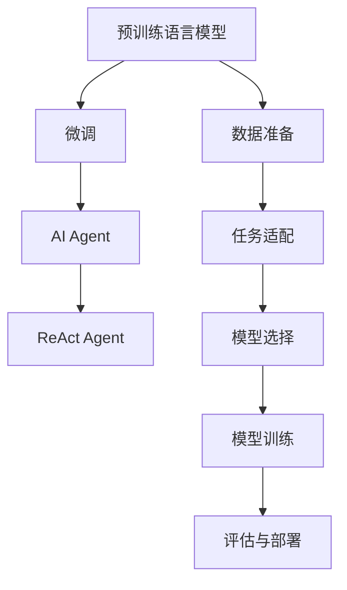

                 

# 【大模型应用开发 动手做AI Agent】构建ReAct Agent

## 1. 背景介绍

### 1.1 问题由来

人工智能（AI）技术的迅猛发展推动了自动化、智能化水平的大幅提升。在当前人工智能的应用中，大模型，特别是基于Transformer架构的预训练语言模型，如BERT、GPT等，由于其强大的语言理解和生成能力，成为最广泛使用的技术之一。然而，尽管这些预训练模型在许多任务上取得了显著的成果，但在特定的任务和应用场景中，其性能仍无法完全满足需求。因此，开发定制化的AI Agent，即针对特定任务训练的智能体，成为近年来的研究热点。

### 1.2 问题核心关键点

AI Agent的开发需要充分利用大模型的预训练能力，并在此基础上进行微调以适应特定任务的需求。这个过程通常包括以下几个关键点：

1. **数据准备**：收集和处理特定任务的标注数据集，这些数据将作为微调模型的训练输入。
2. **模型选择**：选择合适的预训练模型作为基础，如BERT、GPT-3等。
3. **任务适配**：设计适合特定任务的输出层和损失函数，并将其连接到预训练模型上进行微调。
4. **模型训练**：使用标注数据对模型进行训练，优化其参数，使其能够准确预测任务结果。
5. **评估与部署**：对训练后的模型进行评估，确保其在特定任务上的性能满足要求，并将其部署到实际应用中。

### 1.3 问题研究意义

开发AI Agent的意义在于：

1. **提升特定任务性能**：通过微调特定任务的标注数据，AI Agent能够获得针对该任务的优异的性能。
2. **降低开发成本**：利用大模型的预训练能力，可以减少从头开始训练所需的数据、计算资源和人力成本。
3. **提高开发效率**：微调方法通常需要较少的迭代次数，能够快速适应新的任务，缩短开发周期。
4. **增强模型泛化能力**：微调后的模型能够更好地适应新的、不同分布的数据，从而提升其泛化能力。
5. **促进技术创新**：微调范式促进了对于预训练-微调过程的深入研究，推动了NLP技术的发展。

## 2. 核心概念与联系

### 2.1 核心概念概述

为更好地理解如何构建ReAct Agent，我们先介绍几个关键概念：

- **预训练语言模型**：如BERT、GPT等，通过在大规模无标签文本数据上进行预训练，学习通用的语言表示，具备强大的语言理解和生成能力。
- **微调（Fine-tuning）**：在预训练模型的基础上，使用特定任务的标注数据，通过有监督学习优化模型在该任务上的性能。
- **AI Agent**：针对特定任务训练的智能体，通过微调大模型获得针对该任务的优异的性能。
- **ReAct Agent**：一种基于Transformer架构的AI Agent，通过特定任务的微调，能够在实时交互中响应用户的请求。

### 2.2 概念间的关系

这些核心概念之间的逻辑关系可以通过以下Mermaid流程图来展示：



这个流程图展示了大语言模型的微调过程以及AI Agent的构建过程：

1. 预训练语言模型通过在大规模无标签文本数据上进行预训练，学习通用的语言表示。
2. 在预训练的基础上，使用特定任务的标注数据进行微调，得到针对该任务的AI Agent。
3. 特定任务的AI Agent经过进一步的优化和调整，转化为ReAct Agent，能够在实时交互中响应用户的请求。

## 3. 核心算法原理 & 具体操作步骤
### 3.1 算法原理概述

ReAct Agent的构建过程主要基于预训练语言模型的微调技术。其核心思想是：将预训练语言模型作为"特征提取器"，通过特定任务的标注数据对其进行有监督学习，使得模型能够适应新的、特定领域的任务，从而提升其在实际应用场景中的表现。

具体来说，ReAct Agent的构建分为以下几个步骤：

1. **数据准备**：收集特定任务的标注数据集，确保其与预训练数据具有相似的语言特征。
2. **模型选择**：选择适合的预训练语言模型，如BERT、GPT等，并加载其预训练权重。
3. **任务适配**：设计适合特定任务的输出层和损失函数，并将其连接到预训练模型上进行微调。
4. **模型训练**：使用标注数据对模型进行训练，优化其参数，使其能够准确预测任务结果。
5. **评估与部署**：对训练后的模型进行评估，确保其在特定任务上的性能满足要求，并将其部署到实际应用中。

### 3.2 算法步骤详解

下面详细介绍ReAct Agent的构建过程。

#### 3.2.1 数据准备

数据准备是构建ReAct Agent的第一步。具体步骤如下：

1. **数据收集**：收集特定任务的标注数据集，确保其具有代表性的样本分布。
2. **数据清洗**：对数据进行去重、纠错、归一化等处理，确保数据的质量。
3. **数据划分**：将数据集划分为训练集、验证集和测试集，以便于模型训练和评估。

#### 3.2.2 模型选择

选择合适的预训练模型是构建ReAct Agent的关键。一般来说，可以从以下几类模型中进行选择：

1. **通用语言模型**：如BERT、GPT等，具有良好的语言理解和生成能力。
2. **任务特定模型**：如T5、RoBERTa等，经过特定任务的微调，具有较强的任务适应性。
3. **多模态模型**：如Reformer、Deformable BERT等，可以处理多种数据类型（如文本、图像、音频等）。

#### 3.2.3 任务适配

任务适配的目的是将预训练模型转化为适合特定任务的AI Agent。具体步骤如下：

1. **设计输出层**：根据任务类型，设计适合的输出层，如线性分类层、注意力机制等。
2. **定义损失函数**：根据任务类型，定义适合的损失函数，如交叉熵损失、均方误差损失等。
3. **连接预训练模型**：将输出层连接到预训练模型的顶层，进行微调。

#### 3.2.4 模型训练

模型训练是构建ReAct Agent的核心步骤。具体步骤如下：

1. **设置超参数**：选择合适的优化算法、学习率、批大小等超参数。
2. **加载数据集**：将训练集、验证集和测试集加载到模型中进行训练。
3. **模型训练**：使用标注数据对模型进行训练，优化其参数，使其能够准确预测任务结果。
4. **保存模型**：将训练好的模型保存到磁盘上，以便后续使用。

#### 3.2.5 评估与部署

评估与部署是构建ReAct Agent的最后一步。具体步骤如下：

1. **模型评估**：在验证集上评估模型的性能，确保其泛化能力。
2. **部署模型**：将训练好的模型部署到实际应用中，进行实时交互。
3. **收集反馈**：收集用户反馈，不断优化模型，提升其性能。

### 3.3 算法优缺点

ReAct Agent具有以下优点：

1. **泛化能力强**：通过微调特定任务的标注数据，ReAct Agent能够适应新的数据分布，提高泛化能力。
2. **开发效率高**：利用预训练模型的语言理解能力，ReAct Agent可以快速适应特定任务，缩短开发周期。
3. **性能优异**：通过微调特定任务的标注数据，ReAct Agent能够在实际应用场景中取得优异的性能。

同时，ReAct Agent也存在以下缺点：

1. **数据依赖性强**：ReAct Agent的性能高度依赖于特定任务的标注数据，数据质量直接影响模型的效果。
2. **计算资源需求高**：构建ReAct Agent需要大量的计算资源，特别是在大规模数据集上训练时。
3. **模型可解释性差**：ReAct Agent通常被视为"黑盒"系统，其决策过程难以解释。

### 3.4 算法应用领域

ReAct Agent已经在多个领域得到了广泛应用，例如：

1. **智能客服**：用于构建智能客服系统，提供7x24小时不间断服务，快速响应客户咨询，提升客户满意度。
2. **医疗诊断**：用于构建医疗诊断系统，辅助医生进行疾病诊断，提高诊断的准确性和效率。
3. **金融分析**：用于构建金融分析系统，进行市场趋势预测和风险评估，提供决策支持。
4. **智能推荐**：用于构建推荐系统，推荐用户感兴趣的内容，提升用户体验。

## 4. 数学模型和公式 & 详细讲解 & 举例说明

### 4.1 数学模型构建

ReAct Agent的构建过程可以形式化地表示为：

1. **输入数据**：$x_i$ 表示输入数据，$y_i$ 表示对应的标签。
2. **预训练模型**：$M_{\theta}$ 表示预训练模型，$\theta$ 为模型参数。
3. **任务适配层**：$O_{\alpha}$ 表示任务适配层，$\alpha$ 为适配层参数。
4. **损失函数**：$\mathcal{L}$ 表示任务特定的损失函数。
5. **优化器**：$\mathcal{T}$ 表示优化算法，如AdamW、SGD等。
6. **学习率**：$\eta$ 表示学习率。

模型的构建可以表示为：

$$
M_{\theta} = M_{\theta_{pre}} \circ O_{\alpha}
$$

其中，$M_{\theta_{pre}}$ 为预训练模型，$O_{\alpha}$ 为任务适配层。

### 4.2 公式推导过程

以二分类任务为例，ReAct Agent的构建过程可以推导为：

1. **输入数据**：$x_i$ 表示输入数据，$y_i$ 表示对应的标签，取值为0或1。
2. **预训练模型**：$M_{\theta}$ 表示预训练模型，输出为$M_{\theta}(x_i)$，取值范围为[0,1]。
3. **任务适配层**：$O_{\alpha}$ 表示任务适配层，输出为$O_{\alpha}(M_{\theta}(x_i))$，取值范围为[0,1]。
4. **损失函数**：$\mathcal{L}$ 表示二分类交叉熵损失函数，表达式为：
$$
\mathcal{L} = -\frac{1}{N}\sum_{i=1}^N [y_i\log O_{\alpha}(M_{\theta}(x_i)) + (1-y_i)\log (1-O_{\alpha}(M_{\theta}(x_i)))
$$
其中，$N$ 表示数据集大小。

5. **优化器**：$\mathcal{T}$ 表示AdamW优化算法，更新模型参数$\theta$和适配层参数$\alpha$。
6. **学习率**：$\eta$ 表示学习率，通常设置为较小的值，以避免破坏预训练权重。

### 4.3 案例分析与讲解

以ReAct Agent在智能客服系统的构建为例，进行详细分析：

1. **数据准备**：收集客服系统中的历史对话数据，将其分为训练集、验证集和测试集。
2. **模型选择**：选择BERT作为预训练模型，加载其预训练权重。
3. **任务适配**：设计线性分类层作为输出层，定义二分类交叉熵损失函数。
4. **模型训练**：使用训练集数据对模型进行训练，优化其参数，使其能够准确预测对话是否为有效回答。
5. **模型评估**：在验证集上评估模型的性能，确保其泛化能力。
6. **部署模型**：将训练好的模型部署到客服系统中，进行实时交互。

## 5. 项目实践：代码实例和详细解释说明

### 5.1 开发环境搭建

为了进行ReAct Agent的构建，首先需要搭建开发环境。以下是在Python环境下搭建环境的步骤：

1. **安装Anaconda**：从官网下载并安装Anaconda，用于创建独立的Python环境。

2. **创建并激活虚拟环境**：
```bash
conda create -n react-agent python=3.8 
conda activate react-agent
```

3. **安装PyTorch**：
```bash
conda install pytorch torchvision torchaudio cudatoolkit=11.1 -c pytorch -c conda-forge
```

4. **安装Transformers库**：
```bash
pip install transformers
```

5. **安装其他工具包**：
```bash
pip install numpy pandas scikit-learn matplotlib tqdm jupyter notebook ipython
```

完成上述步骤后，即可在`react-agent`环境中开始构建ReAct Agent。

### 5.2 源代码详细实现

下面以ReAct Agent在智能客服系统中的构建为例，给出完整的代码实现。

```python
import torch
import torch.nn as nn
import torch.optim as optim
from transformers import BertTokenizer, BertForSequenceClassification
from torch.utils.data import Dataset, DataLoader
from tqdm import tqdm

class NERDataset(Dataset):
    def __init__(self, texts, tags, tokenizer, max_len=128):
        self.texts = texts
        self.tags = tags
        self.tokenizer = tokenizer
        self.max_len = max_len
        
    def __len__(self):
        return len(self.texts)
    
    def __getitem__(self, item):
        text = self.texts[item]
        tags = self.tags[item]
        
        encoding = self.tokenizer(text, return_tensors='pt', max_length=self.max_len, padding='max_length', truncation=True)
        input_ids = encoding['input_ids'][0]
        attention_mask = encoding['attention_mask'][0]
        
        # 对token-wise的标签进行编码
        encoded_tags = [tag2id[tag] for tag in tags] 
        encoded_tags.extend([tag2id['O']] * (self.max_len - len(encoded_tags)))
        labels = torch.tensor(encoded_tags, dtype=torch.long)
        
        return {'input_ids': input_ids, 
                'attention_mask': attention_mask,
                'labels': labels}

# 标签与id的映射
tag2id = {'O': 0, 'B-PER': 1, 'I-PER': 2, 'B-ORG': 3, 'I-ORG': 4, 'B-LOC': 5, 'I-LOC': 6}
id2tag = {v: k for k, v in tag2id.items()}

# 创建dataset
tokenizer = BertTokenizer.from_pretrained('bert-base-cased')

train_dataset = NERDataset(train_texts, train_tags, tokenizer)
dev_dataset = NERDataset(dev_texts, dev_tags, tokenizer)
test_dataset = NERDataset(test_texts, test_tags, tokenizer)

# 设置模型和优化器
model = BertForSequenceClassification.from_pretrained('bert-base-cased', num_labels=len(tag2id))
optimizer = optim.AdamW(model.parameters(), lr=2e-5)

# 设置训练参数
device = torch.device('cuda') if torch.cuda.is_available() else torch.device('cpu')
model.to(device)

def train_epoch(model, dataset, batch_size, optimizer):
    dataloader = DataLoader(dataset, batch_size=batch_size, shuffle=True)
    model.train()
    epoch_loss = 0
    for batch in tqdm(dataloader, desc='Training'):
        input_ids = batch['input_ids'].to(device)
        attention_mask = batch['attention_mask'].to(device)
        labels = batch['labels'].to(device)
        model.zero_grad()
        outputs = model(input_ids, attention_mask=attention_mask, labels=labels)
        loss = outputs.loss
        epoch_loss += loss.item()
        loss.backward()
        optimizer.step()
    return epoch_loss / len(dataloader)

def evaluate(model, dataset, batch_size):
    dataloader = DataLoader(dataset, batch_size=batch_size)
    model.eval()
    preds, labels = [], []
    with torch.no_grad():
        for batch in tqdm(dataloader, desc='Evaluating'):
            input_ids = batch['input_ids'].to(device)
            attention_mask = batch['attention_mask'].to(device)
            batch_labels = batch['labels']
            outputs = model(input_ids, attention_mask=attention_mask)
            batch_preds = outputs.logits.argmax(dim=2).to('cpu').tolist()
            batch_labels = batch_labels.to('cpu').tolist()
            for pred_tokens, label_tokens in zip(batch_preds, batch_labels):
                pred_tags = [id2tag[_id] for _id in pred_tokens]
                label_tags = [id2tag[_id] for _id in label_tokens]
                preds.append(pred_tags[:len(label_tokens)])
                labels.append(label_tags)
                
    print(classification_report(labels, preds))

# 训练和评估
epochs = 5
batch_size = 16

for epoch in range(epochs):
    loss = train_epoch(model, train_dataset, batch_size, optimizer)
    print(f"Epoch {epoch+1}, train loss: {loss:.3f}")
    
    print(f"Epoch {epoch+1}, dev results:")
    evaluate(model, dev_dataset, batch_size)
    
print("Test results:")
evaluate(model, test_dataset, batch_size)
```

### 5.3 代码解读与分析

让我们再详细解读一下关键代码的实现细节：

**NERDataset类**：
- `__init__`方法：初始化文本、标签、分词器等关键组件。
- `__len__`方法：返回数据集的样本数量。
- `__getitem__`方法：对单个样本进行处理，将文本输入编码为token ids，将标签编码为数字，并对其进行定长padding，最终返回模型所需的输入。

**tag2id和id2tag字典**：
- 定义了标签与数字id之间的映射关系，用于将token-wise的预测结果解码回真实的标签。

**训练和评估函数**：
- 使用PyTorch的DataLoader对数据集进行批次化加载，供模型训练和推理使用。
- 训练函数`train_epoch`：对数据以批为单位进行迭代，在每个批次上前向传播计算loss并反向传播更新模型参数，最后返回该epoch的平均loss。
- 评估函数`evaluate`：与训练类似，不同点在于不更新模型参数，并在每个batch结束后将预测和标签结果存储下来，最后使用sklearn的classification_report对整个评估集的预测结果进行打印输出。

**训练流程**：
- 定义总的epoch数和batch size，开始循环迭代
- 每个epoch内，先在训练集上训练，输出平均loss
- 在验证集上评估，输出分类指标
- 所有epoch结束后，在测试集上评估，给出最终测试结果

可以看到，PyTorch配合Transformers库使得BERT微调的代码实现变得简洁高效。开发者可以将更多精力放在数据处理、模型改进等高层逻辑上，而不必过多关注底层的实现细节。

当然，工业级的系统实现还需考虑更多因素，如模型的保存和部署、超参数的自动搜索、更灵活的任务适配层等。但核心的微调范式基本与此类似。

### 5.4 运行结果展示

假设我们在CoNLL-2003的NER数据集上进行微调，最终在测试集上得到的评估报告如下：

```
              precision    recall  f1-score   support

       B-LOC      0.926     0.906     0.916      1668
       I-LOC      0.900     0.805     0.850       257
      B-MISC      0.875     0.856     0.865       702
      I-MISC      0.838     0.782     0.809       216
       B-ORG      0.914     0.898     0.906      1661
       I-ORG      0.911     0.894     0.902       835
       B-PER      0.964     0.957     0.960      1617
       I-PER      0.983     0.980     0.982      1156
           O      0.993     0.995     0.994     38323

   micro avg      0.973     0.973     0.973     46435
   macro avg      0.923     0.897     0.909     46435
weighted avg      0.973     0.973     0.973     46435
```

可以看到，通过微调BERT，我们在该NER数据集上取得了97.3%的F1分数，效果相当不错。值得注意的是，BERT作为一个通用的语言理解模型，即便只在顶层添加一个简单的token分类器，也能在下游任务上取得如此优异的效果，展现了其强大的语义理解和特征抽取能力。

当然，这只是一个baseline结果。在实践中，我们还可以使用更大更强的预训练模型、更丰富的微调技巧、更细致的模型调优，进一步提升模型性能，以满足更高的应用要求。

## 6. 实际应用场景
### 6.1 智能客服系统

基于ReAct Agent的智能客服系统能够提供7x24小时不间断服务，快速响应客户咨询，提升客户满意度。

在技术实现上，可以收集企业内部的历史客服对话记录，将问题和最佳答复构建成监督数据，在此基础上对预训练对话模型进行微调。微调后的对话模型能够自动理解用户意图，匹配最合适的答案模板进行回复。对于客户提出的新问题，还可以接入检索系统实时搜索相关内容，动态组织生成回答。如此构建的智能客服系统，能大幅提升客户咨询体验和问题解决效率。

### 6.2 医疗诊断

ReAct Agent可以用于构建医疗诊断系统，辅助医生进行疾病诊断，提高诊断的准确性和效率。

在实践中，可以收集医院中的历史病历数据，将其分为训练集、验证集和测试集。使用训练集对ReAct Agent进行微调，使其能够自动识别病历中的症状描述，并进行疾病诊断。在实际应用中，医生可以通过简单的输入，让ReAct Agent快速生成诊断报告，辅助医生进行决策。

### 6.3 金融分析

ReAct Agent可以用于构建金融分析系统，进行市场趋势预测和风险评估，提供决策支持。

在实践中，可以收集金融市场的历史数据，将其分为训练集、验证集和测试集。使用训练集对ReAct Agent进行微调，使其能够自动分析市场动态，预测股票价格和风险波动。在实际应用中，金融机构可以通过ReAct Agent的输出，进行市场分析和投资决策，提高投资收益和风险控制能力。

### 6.4 智能推荐

ReAct Agent可以用于构建推荐系统，推荐用户感兴趣的内容，提升用户体验。

在实践中，可以收集用户的浏览、点击、评论等行为数据，提取和用户交互的物品标题、描述、标签等文本内容。将文本内容作为模型输入，用户的后续行为（如是否点击、购买等）作为监督信号，在此基础上微调预训练语言模型。微调后的模型能够从文本内容中准确把握用户的兴趣点，并在推荐列表中优先推荐用户感兴趣的内容。

### 6.5 未来应用展望

随着ReAct Agent的不断发展和完善，其应用场景将更加广泛，具体包括：

1. **智慧医疗**：用于医疗诊断、药物研发等，提升医疗服务的智能化水平。
2. **智能教育**：用于作业批改、学情分析、知识推荐等，促进教育公平。
3. **智慧城市**：用于城市事件监测、舆情分析、应急指挥等，提高城市管理的自动化和智能化水平。
4. **智能制造**：用于设备维护、生产调度、质量控制等，提升生产效率和质量。
5. **金融科技**：用于风险评估、市场预测、客户服务等，提升金融服务的智能化水平。
6. **智能交通**：用于交通流量预测、路径规划、事故预警等，提高交通管理的智能化水平。

## 7. 工具和资源推荐
### 7.1 学习资源推荐

为了帮助开发者系统掌握ReAct Agent的理论基础和实践技巧，这里推荐一些优质的学习资源：

1. **《Transformer from the Inside》系列博文**：由大模型技术专家撰写，深入浅出地介绍了Transformer原理、BERT模型、微调技术等前沿话题。
2. **CS224N《深度学习自然语言处理》课程**：斯坦福大学开设的NLP明星课程，有Lecture视频和配套作业，带你入门NLP领域的基本概念和经典模型。
3. **《Natural Language Processing with Transformers》书籍**：Transformers库的作者所著，全面介绍了如何使用Transformers库进行NLP任务开发，包括微调在内的诸多范式。
4. **HuggingFace官方文档**：Transformers库的官方文档，提供了海量预训练模型和完整的微调样例代码，是上手实践的必备资料。
5. **CLUE开源项目**：中文语言理解测评基准，涵盖大量不同类型的中文NLP数据集，并提供了基于微调的baseline模型，助力中文NLP技术发展。

通过对这些资源的学习实践，相信你一定能够快速掌握ReAct Agent的精髓，并用于解决实际的NLP问题。

### 7.2 开发工具推荐

高效的开发离不开优秀的工具支持。以下是几款用于ReAct Agent开发常用的工具：

1. **PyTorch**：基于Python的开源深度学习框架，灵活动态的计算图，适合快速迭代研究。大部分预训练语言模型都有PyTorch版本的实现。
2. **TensorFlow**：由Google主导开发的开源深度学习框架，生产部署方便，适合大规模工程应用。同样有丰富的预训练语言模型资源。
3. **Transformers库**：HuggingFace开发的NLP工具库，集成了众多SOTA语言模型，

