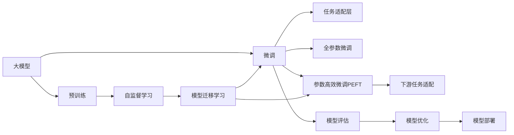

                 

# 【大模型应用开发 动手做AI Agent】第三轮思考：模型完成任务

## 1. 背景介绍

### 1.1 问题由来

在人工智能(AI)领域，构建智能体(Agent)来执行特定任务一直是研究热点。近年来，随着深度学习特别是大语言模型(Big Language Models, BLMs)的发展，基于大模型的AI Agent获得了显著的突破。这些模型通常通过大规模预训练和微调获得通用语义理解能力，然后通过设计适当的任务适配层，用于特定任务，从而完成复杂、多变的AI任务。

例如，GPT-3模型可以在自然语言生成、问答、摘要、翻译等多个领域内表现出令人惊叹的性能。通过微调，模型可以适应各种下游任务，例如医学问答、金融分析、法律咨询等。这种范式不仅简化了任务开发过程，也提升了模型的泛化能力。

### 1.2 问题核心关键点

大模型微调范式包括以下几个关键步骤：

1. **预训练模型选择**：选择合适的预训练模型，如BERT、GPT等。
2. **数据准备**：收集和准备目标任务的数据集。
3. **任务适配层设计**：设计适合特定任务的适配层，如分类器、生成器等。
4. **微调过程**：在预训练模型的基础上，通过监督学习优化模型以适应特定任务。
5. **模型评估与部署**：在验证集上评估模型性能，并在实际应用中不断优化和部署。

### 1.3 问题研究意义

大模型微调方法简化了AI任务开发，提高了模型性能，加速了AI技术在各行各业的落地应用。它不仅降低了任务开发的成本，还提高了模型的泛化能力和适应性。

## 2. 核心概念与联系

### 2.1 核心概念概述

- **大语言模型(大模型)**：通过在大规模无标签文本数据上进行预训练，学习通用语言表示的模型。常见的预训练模型包括BERT、GPT-3等。
- **微调(Fine-tuning)**：在预训练模型的基础上，使用下游任务的少量标注数据进行有监督学习，优化模型以适应特定任务。
- **任务适配层(Task Adapter)**：设计适合特定任务的输出层和损失函数，用于连接预训练模型和下游任务。
- **模型迁移学习(Transfer Learning)**：将预训练模型在其他领域的应用知识迁移到新领域。
- **参数高效微调(Parameter-Efficient Fine-Tuning, PEFT)**：只更新模型中少量参数，以提高微调效率和避免过拟合。

### 2.2 概念间的关系

这些核心概念间的关系可以通过以下Mermaid流程图来展示：



此流程图展示了预训练、微调和任务适配层的内在联系，以及模型迁移和参数高效微调的具体实现路径。

## 3. 核心算法原理 & 具体操作步骤

### 3.1 算法原理概述

大模型微调的核心思想是通过预训练模型获取通用语言表示，然后在特定任务的标注数据集上进行微调，以优化模型输出，适应下游任务。微调过程中，通常采用监督学习方法，通过反向传播更新模型参数，以最小化损失函数。

### 3.2 算法步骤详解

1. **预训练模型准备**：选择合适的预训练模型，如BERT、GPT等，并加载到内存中。
2. **数据集准备**：准备下游任务的标注数据集，划分为训练集、验证集和测试集。
3. **任务适配层设计**：根据任务类型，设计相应的任务适配层，如分类器、生成器等。
4. **微调过程**：
   - 设置优化器、学习率、批大小等超参数。
   - 在训练集上进行前向传播和反向传播，计算损失函数。
   - 根据损失函数更新模型参数，直至收敛或达到预设的迭代次数。
5. **模型评估与部署**：在验证集和测试集上评估模型性能，并将其部署到实际应用中。

### 3.3 算法优缺点

大模型微调方法具有以下优点：
- 简单易用：只需要少量标注数据，即可在较短时间内完成微调。
- 高效泛化：能够在大规模数据集上进行预训练，然后通过微调快速适应特定任务。
- 灵活适配：通过任务适配层设计，可以轻松适配各种类型的AI任务。

同时，该方法也存在一些缺点：
- 依赖标注数据：微调效果受数据质量影响较大，获取高质量标注数据的成本较高。
- 过拟合风险：在数据量较小的情况下，容易发生过拟合。
- 迁移能力有限：预训练模型的领域适应性可能受限，跨领域迁移效果不佳。
- 模型鲁棒性：在特定输入样本或攻击下，模型的泛化能力可能下降。

### 3.4 算法应用领域

大模型微调方法在多个领域得到了广泛应用，包括：

- **自然语言处理(NLP)**：文本分类、命名实体识别、关系抽取、问答系统、机器翻译、文本摘要等。
- **计算机视觉(CV)**：图像分类、目标检测、图像生成等。
- **语音处理(Audio)**：语音识别、语音合成等。
- **游戏AI**：智能决策、路径规划等。
- **机器人**：导航、任务执行等。

## 4. 数学模型和公式 & 详细讲解 & 举例说明

### 4.1 数学模型构建

假设预训练模型为 $M_{\theta}$，其中 $\theta$ 为模型参数。微调任务为 $T$，标注数据集为 $D=\{(x_i, y_i)\}_{i=1}^N$。微调的目标是最小化损失函数 $\mathcal{L}(\theta)$：

$$
\mathcal{L}(\theta) = \frac{1}{N} \sum_{i=1}^N \ell(M_{\theta}(x_i), y_i)
$$

其中 $\ell$ 为任务 $T$ 的损失函数，如交叉熵损失、均方误差损失等。

### 4.2 公式推导过程

以二分类任务为例，假设模型输出为 $\hat{y}=M_{\theta}(x)$，真实标签为 $y \in \{0, 1\}$。二分类交叉熵损失函数为：

$$
\ell(M_{\theta}(x), y) = -[y\log \hat{y} + (1-y)\log (1-\hat{y})]
$$

在训练集上进行前向传播和反向传播，计算损失函数，更新模型参数 $\theta$：

$$
\theta \leftarrow \theta - \eta \nabla_{\theta}\mathcal{L}(\theta)
$$

其中 $\eta$ 为学习率。

### 4.3 案例分析与讲解

假设我们有一个包含文本和标签的训练集 $D$，文本 $x$ 的长度为 $L$。文本通过BERT模型编码为向量，向量长度为 $d$。使用sigmoid激活函数作为输出层，交叉熵作为损失函数，进行二分类任务。微调过程中，损失函数梯度计算如下：

$$
\frac{\partial \mathcal{L}(\theta)}{\partial \theta_k} = -\frac{1}{N}\sum_{i=1}^N \left[ \frac{y_i}{\hat{y_i}} - \frac{1-y_i}{1-\hat{y_i}} \right] \frac{\partial M_{\theta}(x_i)}{\partial \theta_k}
$$

其中 $\partial M_{\theta}(x_i)/\partial \theta_k$ 可以通过反向传播算法计算得到。

## 5. 项目实践：代码实例和详细解释说明

### 5.1 开发环境搭建

在开始项目实践前，需要准备好开发环境：

1. **安装Python**：安装Python 3.8及以上版本，推荐使用Anaconda环境。
2. **安装必要的Python库**：使用pip安装transformers、torch等库。
3. **准备数据集**：将标注数据集划分为训练集、验证集和测试集。

### 5.2 源代码详细实现

以下是一个使用BERT模型进行二分类任务微调的PyTorch代码示例：

```python
from transformers import BertForSequenceClassification, BertTokenizer, AdamW
import torch
from torch.utils.data import DataLoader

# 初始化BERT模型和分词器
model = BertForSequenceClassification.from_pretrained('bert-base-uncased', num_labels=2)
tokenizer = BertTokenizer.from_pretrained('bert-base-uncased')

# 准备数据集
train_data = ...  # 训练数据集
val_data = ...   # 验证数据集
test_data = ...  # 测试数据集

# 定义优化器和学习率
optimizer = AdamW(model.parameters(), lr=2e-5)

# 训练模型
for epoch in range(epochs):
    # 设置批次大小
    batch_size = 16
    dataloaders = {
        'train': DataLoader(train_data, batch_size=batch_size),
        'val': DataLoader(val_data, batch_size=batch_size)
    }

    # 设置训练参数
    device = torch.device('cuda' if torch.cuda.is_available() else 'cpu')
    model.to(device)
    total_steps = len(dataloaders['train'].dataset) // batch_size * epochs
    scheduler = get_linear_schedule_with_warmup(optimizer, num_warmup_steps=0, num_training_steps=total_steps)

    # 训练循环
    for step, batch in enumerate(dataloaders['train']):
        input_ids = batch['input_ids'].to(device)
        attention_mask = batch['attention_mask'].to(device)
        labels = batch['labels'].to(device)
        
        # 前向传播
        outputs = model(input_ids, attention_mask=attention_mask, labels=labels)
        loss = outputs.loss
        loss.backward()
        optimizer.step()
        scheduler.step()

        # 验证集评估
        if step % 100 == 0:
            acc = calculate_accuracy(val_data, model, tokenizer, device)
            print(f'Epoch {epoch+1}, Step {step}, Loss {loss:.3f}, Acc {acc:.3f}')
```

### 5.3 代码解读与分析

- **BERT模型加载**：使用`BertForSequenceClassification`加载预训练的BERT模型，设置输出层为二分类器。
- **分词器加载**：使用`BertTokenizer`加载分词器，进行文本编码。
- **数据集准备**：使用`DataLoader`准备训练集、验证集和测试集，并设置批次大小。
- **优化器设置**：使用`AdamW`优化器，设置学习率。
- **模型训练**：在每个epoch内，对训练集进行前向传播和反向传播，计算损失函数，更新模型参数。在每个100步后，评估验证集上的准确率。

### 5.4 运行结果展示

在训练结束后，可以在测试集上评估微调后模型的性能：

```python
def calculate_accuracy(dataset, model, tokenizer, device):
    model.eval()
    total, correct = 0, 0
    with torch.no_grad():
        for batch in dataloader:
            input_ids = batch['input_ids'].to(device)
            attention_mask = batch['attention_mask'].to(device)
            labels = batch['labels'].to(device)
            outputs = model(input_ids, attention_mask=attention_mask)
            predictions = torch.argmax(outputs.logits, dim=1)
            total += labels.size(0)
            correct += (predictions == labels).sum().item()
    return correct / total
```

在测试集上计算准确率，评估模型性能：

```python
print(f'Test Accuracy: {calculate_accuracy(test_data, model, tokenizer, device):.3f}')
```

## 6. 实际应用场景

### 6.4 未来应用展望

大模型微调技术具有广阔的应用前景，未来将在更多领域得到应用：

1. **智慧医疗**：用于辅助诊断、个性化治疗、健康管理等。
2. **智能客服**：提供24小时在线客服，提升用户体验和满意度。
3. **金融分析**：实时监控市场动态，辅助决策支持。
4. **法律咨询**：提供法律查询、合同审核、案例分析等服务。
5. **智能制造**：用于生产计划优化、质量控制、故障诊断等。
6. **城市管理**：提供智能交通、环境监测、公共安全等服务。

## 7. 工具和资源推荐

### 7.1 学习资源推荐

- **Transformer从原理到实践**：由大模型技术专家撰写，全面介绍了Transformer原理、BERT模型、微调技术等。
- **CS224N《深度学习自然语言处理》课程**：斯坦福大学开设的NLP明星课程，详细讲解了NLP的基本概念和经典模型。
- **《Natural Language Processing with Transformers》书籍**：由Transformers库的作者所著，介绍了如何使用Transformers库进行NLP任务开发。
- **HuggingFace官方文档**：提供了海量预训练模型和微调样例代码，是上手实践的必备资料。
- **CLUE开源项目**：涵盖大量不同类型的中文NLP数据集，并提供了基于微调的baseline模型，助力中文NLP技术发展。

### 7.2 开发工具推荐

- **PyTorch**：基于Python的开源深度学习框架，适合快速迭代研究。
- **TensorFlow**：由Google主导开发的开源深度学习框架，适合大规模工程应用。
- **Transformers库**：HuggingFace开发的NLP工具库，集成了众多SOTA语言模型。
- **Weights & Biases**：模型训练的实验跟踪工具，用于记录和可视化模型训练过程。
- **TensorBoard**：TensorFlow配套的可视化工具，实时监测模型训练状态。
- **Google Colab**：免费的在线Jupyter Notebook环境，方便开发者快速上手实验最新模型，分享学习笔记。

### 7.3 相关论文推荐

- **Attention is All You Need**：提出了Transformer结构，开启了NLP领域的预训练大模型时代。
- **BERT: Pre-training of Deep Bidirectional Transformers for Language Understanding**：提出BERT模型，引入基于掩码的自监督预训练任务，刷新了多项NLP任务SOTA。
- **Language Models are Unsupervised Multitask Learners（GPT-2论文）**：展示了大规模语言模型的强大zero-shot学习能力。
- **Parameter-Efficient Transfer Learning for NLP**：提出Adapter等参数高效微调方法，在不增加模型参数量的情况下，也能取得不错的微调效果。
- **Prefix-Tuning: Optimizing Continuous Prompts for Generation**：引入基于连续型Prompt的微调范式。
- **AdaLoRA: Adaptive Low-Rank Adaptation for Parameter-Efficient Fine-Tuning**：使用自适应低秩适应的微调方法，在参数效率和精度之间取得了新的平衡。

## 8. 总结：未来发展趋势与挑战

### 8.1 研究成果总结

基于大模型的微调技术，已经取得了显著的进展，并广泛应用于NLP、CV、Audio等多个领域。其高效、灵活的特点，显著提升了AI任务的开发效率和性能表现。

### 8.2 未来发展趋势

未来，大模型微调技术将呈现以下几个发展趋势：

1. **模型规模持续增大**：随着算力成本的下降和数据规模的扩张，预训练语言模型的参数量还将持续增长。超大规模语言模型蕴含的丰富语言知识，有望支撑更加复杂多变的下游任务微调。
2. **微调方法日趋多样**：除了传统的全参数微调外，未来会涌现更多参数高效的微调方法，如Prefix-Tuning、LoRA等。
3. **持续学习成为常态**：随着数据分布的不断变化，微调模型也需要持续学习新知识以保持性能。
4. **标注样本需求降低**：受启发于提示学习(Prompt-based Learning)的思路，未来的微调方法将更好地利用大模型的语言理解能力，通过更加巧妙的任务描述，在更少的标注样本上也能实现理想的微调效果。
5. **多模态微调崛起**：未来的微调模型将拓展到图像、视频、语音等多模态数据微调。
6. **模型通用性增强**：经过海量数据的预训练和多领域任务的微调，未来的语言模型将具备更强大的常识推理和跨领域迁移能力。

### 8.3 面临的挑战

尽管大模型微调技术已经取得了瞩目成就，但在迈向更加智能化、普适化应用的过程中，它仍面临着诸多挑战：

1. **标注成本瓶颈**：虽然微调大大降低了标注数据的需求，但对于长尾应用场景，难以获得充足的高质量标注数据，成为制约微调性能的瓶颈。
2. **模型鲁棒性不足**：微调模型面对域外数据时，泛化性能往往大打折扣。对于测试样本的微小扰动，微调模型的预测也容易发生波动。
3. **推理效率有待提高**：大模型虽然精度高，但在实际部署时往往面临推理速度慢、内存占用大等效率问题。
4. **可解释性亟需加强**：当前微调模型更像是"黑盒"系统，难以解释其内部工作机制和决策逻辑。
5. **安全性有待保障**：预训练语言模型难免会学习到有偏见、有害的信息，通过微调传递到下游任务，产生误导性、歧视性的输出。
6. **知识整合能力不足**：现有的微调模型往往局限于任务内数据，难以灵活吸收和运用更广泛的先验知识。

### 8.4 研究展望

针对这些挑战，未来的研究需要在以下几个方面寻求新的突破：

1. **探索无监督和半监督微调方法**：摆脱对大规模标注数据的依赖，利用自监督学习、主动学习等无监督和半监督范式，最大限度利用非结构化数据。
2. **研究参数高效和计算高效的微调范式**：开发更加参数高效的微调方法，在固定大部分预训练参数的同时，只更新极少量的任务相关参数。
3. **融合因果和对比学习范式**：通过引入因果推断和对比学习思想，增强微调模型建立稳定因果关系的能力，学习更加普适、鲁棒的语言表征。
4. **引入更多先验知识**：将符号化的先验知识，如知识图谱、逻辑规则等，与神经网络模型进行巧妙融合。
5. **结合因果分析和博弈论工具**：将因果分析方法引入微调模型，识别出模型决策的关键特征，增强输出解释的因果性和逻辑性。
6. **纳入伦理道德约束**：在模型训练目标中引入伦理导向的评估指标，过滤和惩罚有偏见、有害的输出倾向。
7. **加强人工干预和审核**：建立模型行为的监管机制，确保输出符合人类价值观和伦理道德。

这些研究方向将引领大模型微调技术迈向更高的台阶，为构建安全、可靠、可解释、可控的智能系统铺平道路。

## 9. 附录：常见问题与解答

**Q1：大模型微调是否适用于所有NLP任务？**

A: 大模型微调在大多数NLP任务上都能取得不错的效果，特别是对于数据量较小的任务。但对于一些特定领域的任务，如医学、法律等，仅仅依靠通用语料预训练的模型可能难以很好地适应。此时需要在特定领域语料上进一步预训练，再进行微调，才能获得理想效果。

**Q2：微调过程中如何选择合适的学习率？**

A: 微调的学习率一般要比预训练时小1-2个数量级，如果使用过大的学习率，容易破坏预训练权重，导致过拟合。一般建议从1e-5开始调参，逐步减小学习率，直至收敛。也可以使用warmup策略，在开始阶段使用较小的学习率，再逐渐过渡到预设值。需要注意的是，不同的优化器(如AdamW、Adafactor等)以及不同的学习率调度策略，可能需要设置不同的学习率阈值。

**Q3：采用大模型微调时会面临哪些资源瓶颈？**

A: 目前主流的预训练大模型动辄以亿计的参数规模，对算力、内存、存储都提出了很高的要求。GPU/TPU等高性能设备是必不可少的，但即便如此，超大批次的训练和推理也可能遇到显存不足的问题。因此需要采用一些资源优化技术，如梯度积累、混合精度训练、模型并行等，来突破硬件瓶颈。同时，模型的存储和读取也可能占用大量时间和空间，需要采用模型压缩、稀疏化存储等方法进行优化。

**Q4：如何缓解微调过程中的过拟合问题？**

A: 过拟合是微调面临的主要挑战，尤其是在标注数据不足的情况下。常见的缓解策略包括：
1. 数据增强：通过回译、近义替换等方式扩充训练集
2. 正则化：使用L2正则、Dropout、Early Stopping等避免过拟合
3. 对抗训练：引入对抗样本，提高模型鲁棒性
4. 参数高效微调：只调整少量参数(如Adapter、Prefix等)，减小过拟合风险
5. 多模型集成：训练多个微调模型，取平均输出，抑制过拟合

这些策略往往需要根据具体任务和数据特点进行灵活组合。只有在数据、模型、训练、推理等各环节进行全面优化，才能最大限度地发挥大模型微调的威力。

**Q5：微调模型在落地部署时需要注意哪些问题？**

A: 将微调模型转化为实际应用，还需要考虑以下因素：
1. 模型裁剪：去除不必要的层和参数，减小模型尺寸，加快推理速度
2. 量化加速：将浮点模型转为定点模型，压缩存储空间，提高计算效率
3. 服务化封装：将模型封装为标准化服务接口，便于集成调用
4. 弹性伸缩：根据请求流量动态调整资源配置，平衡服务质量和成本
5. 监控告警：实时采集系统指标，设置异常告警阈值，确保服务稳定性
6. 安全防护：采用访问鉴权、数据脱敏等措施，保障数据和模型安全

大模型微调为NLP应用开启了广阔的想象空间，但如何将强大的性能转化为稳定、高效、安全的业务价值，还需要工程实践的不断打磨。只有从数据、算法、工程、业务等多个维度协同发力，才能真正实现人工智能技术在垂直行业的规模化落地。

---

作者：禅与计算机程序设计艺术 / Zen and the Art of Computer Programming

