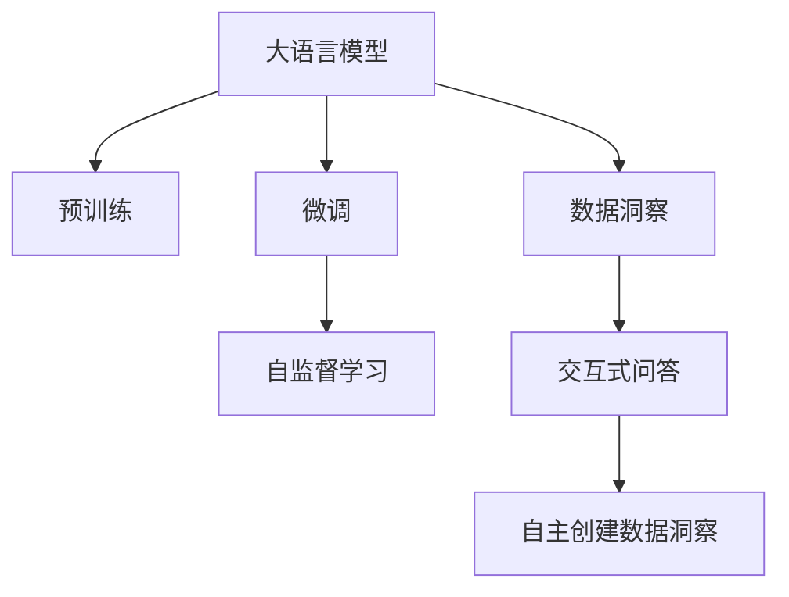
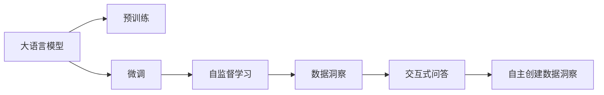
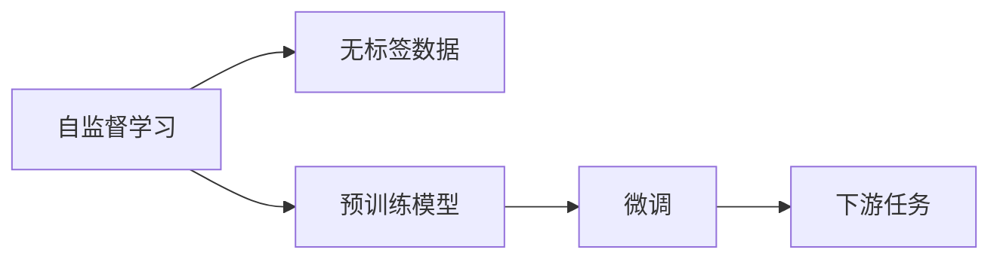
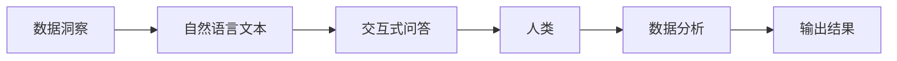

                 

# 【大模型应用开发 动手做AI Agent】自主创建数据洞察

> 关键词：大语言模型,AI Agent,自然语言处理,NLP,数据洞察,自监督学习

## 1. 背景介绍

### 1.1 问题由来
随着人工智能技术的不断进步，大语言模型（Large Language Models, LLMs）在自然语言处理（NLP）领域取得了显著的成果。这些模型，如GPT、BERT等，通过在大规模无标签文本数据上预训练，学习到了丰富的语言知识，并具备了强大的语言理解和生成能力。然而，这些模型往往需要大量的标注数据来进行微调（Fine-Tuning），以适配特定的下游任务。这不仅增加了标注成本，还限制了模型在不同领域的应用。

为了克服这些挑战，AI Agent技术应运而生。AI Agent是一种具有自主决策能力的智能体，能够基于自然语言与人类进行互动，并提供数据洞察（Data Insight），帮助人类更好地理解和利用数据。本文将深入探讨如何使用大语言模型自主创建数据洞察，从而实现更加智能和高效的数据分析。

### 1.2 问题核心关键点
AI Agent技术的核心关键点包括：

1. **大语言模型（LLMs）**：作为AI Agent的核心，大语言模型通过预训练学习到了丰富的语言知识和常识。
2. **微调（Fine-Tuning）**：在特定任务上，通过微调优化模型性能，使其能够处理特定的数据洞察任务。
3. **自监督学习（Self-Supervised Learning）**：利用无标签数据进行模型训练，减少对标注数据的依赖。
4. **数据洞察（Data Insight）**：通过生成自然语言文本，提供有价值的数据分析洞察。
5. **交互式问答（Q&A）**：在人类与AI Agent互动时，能够提供即时回答，并进行数据展示和分析。

这些关键点共同构成了AI Agent技术的核心框架，使其能够广泛应用于各种数据洞察任务，提升数据分析效率和质量。

### 1.3 问题研究意义
AI Agent技术在数据洞察领域的应用，对于提升数据分析效率和质量具有重要意义：

1. **降低数据标注成本**：通过利用自监督学习，减少对标注数据的依赖，从而降低标注成本。
2. **增强数据洞察能力**：大语言模型的强大语言理解和生成能力，使其能够提供更有价值的洞察，帮助决策者更好地理解数据。
3. **提高数据分析效率**：AI Agent能够自主进行数据分析，并在人类与AI Agent互动时即时展示结果，从而大大提高数据分析效率。
4. **促进数据驱动决策**：通过提供精确的数据洞察，帮助决策者做出更加明智的决策。

## 2. 核心概念与联系

### 2.1 核心概念概述

为了更好地理解AI Agent技术，我们需要深入探讨几个核心概念：

- **大语言模型（LLMs）**：以自回归（如GPT）或自编码（如BERT）模型为代表的大规模预训练语言模型。通过在大规模无标签文本语料上进行预训练，学习到了丰富的语言知识和常识，具备强大的语言理解和生成能力。

- **微调（Fine-Tuning）**：在预训练模型的基础上，使用下游任务的少量标注数据，通过有监督学习优化模型在特定任务上的性能。通常只需要调整顶层分类器或解码器，并以较小的学习率更新全部或部分的模型参数。

- **自监督学习（Self-Supervised Learning）**：利用无标签数据进行模型训练，通过自监督学习任务，使模型学习到语言的通用表示，无需标注数据。

- **数据洞察（Data Insight）**：通过AI Agent提供的数据分析和解释，帮助人类更好地理解数据，并做出决策。

- **交互式问答（Q&A）**：在人类与AI Agent互动时，能够提供即时回答，并进行数据展示和分析。

这些核心概念之间的逻辑关系可以通过以下Mermaid流程图来展示：



这个流程图展示了大语言模型从预训练到微调，再到自主创建数据洞察的完整过程。

### 2.2 概念间的关系

这些核心概念之间存在着紧密的联系，形成了AI Agent技术的完整生态系统。下面通过几个Mermaid流程图来展示这些概念之间的关系。

#### 2.2.1 AI Agent的核心框架



这个流程图展示了AI Agent技术的核心框架，即利用预训练的大语言模型，通过微调和自监督学习，最终提供数据洞察和交互式问答服务。

#### 2.2.2 自监督学习与微调的关系



这个流程图展示了自监督学习与微调的关系。自监督学习通过无标签数据训练模型，而微调则是利用标注数据优化模型，使其能够处理特定的下游任务。

#### 2.2.3 数据洞察与交互式问答的关系



这个流程图展示了数据洞察与交互式问答的关系。数据洞察通过生成自然语言文本，提供有价值的数据分析洞察，而交互式问答则是在人类与AI Agent互动时，提供即时回答，并进行数据展示和分析。

## 3. 核心算法原理 & 具体操作步骤
### 3.1 算法原理概述

AI Agent技术的核心算法原理主要基于大语言模型的预训练和微调。具体而言，AI Agent通过以下步骤实现自主创建数据洞察：

1. **预训练（Pre-training）**：在大规模无标签文本数据上，通过自监督学习任务训练大语言模型，使其学习到语言的通用表示。

2. **微调（Fine-Tuning）**：在特定任务上，通过微调优化模型性能，使其能够处理特定的数据洞察任务。

3. **自监督学习（Self-Supervised Learning）**：利用无标签数据进行模型训练，减少对标注数据的依赖。

4. **数据洞察（Data Insight）**：通过AI Agent提供的数据分析和解释，帮助人类更好地理解数据，并做出决策。

5. **交互式问答（Q&A）**：在人类与AI Agent互动时，能够提供即时回答，并进行数据展示和分析。

### 3.2 算法步骤详解

AI Agent技术的实现步骤如下：

1. **数据准备**：收集无标签数据集，并进行预处理，包括清洗、分词、去除停用词等操作。

2. **预训练模型选择**：选择合适的大语言模型，如BERT、GPT等，作为初始化参数。

3. **微调模型设计**：设计适合特定数据洞察任务的微调模型，包括输出层和损失函数。

4. **微调参数设置**：设置微调参数，如学习率、批大小、迭代轮数等。

5. **微调训练**：在特定任务上，使用少量标注数据进行微调训练，优化模型参数。

6. **自监督学习训练**：利用无标签数据进行自监督学习训练，进一步提升模型性能。

7. **数据洞察生成**：通过微调后的模型，生成自然语言文本，提供数据洞察。

8. **交互式问答交互**：在人类与AI Agent互动时，提供即时回答，并进行数据展示和分析。

### 3.3 算法优缺点

AI Agent技术的优缺点如下：

**优点**：

- **灵活性高**：利用大语言模型和自监督学习，AI Agent能够自主进行数据分析，灵活应对各种任务。
- **数据洞察能力**：通过自然语言生成，AI Agent能够提供更有价值的数据分析洞察。
- **交互性强**：通过交互式问答，AI Agent能够即时回答人类问题，并进行数据展示和分析。

**缺点**：

- **依赖于标注数据**：虽然自监督学习可以缓解标注数据不足的问题，但完全无标注数据仍然是一个挑战。
- **计算资源消耗大**：大语言模型的训练和微调需要大量计算资源，增加了部署成本。
- **模型复杂度高**：大语言模型具有复杂的结构，增加了理解和优化的难度。

### 3.4 算法应用领域

AI Agent技术在多个领域中具有广泛的应用前景，包括：

1. **金融分析**：通过AI Agent提供金融数据的洞察，帮助决策者进行投资分析和风险管理。

2. **医疗健康**：利用AI Agent对医疗数据进行分析，提供患者病情的洞察，辅助医生进行诊断和治疗。

3. **市场营销**：通过AI Agent对市场数据进行洞察，帮助企业了解客户需求和市场趋势，制定更有效的营销策略。

4. **物流管理**：利用AI Agent对物流数据进行分析，提高物流效率和运营管理水平。

5. **智能客服**：通过AI Agent提供客户反馈的洞察，提高客服响应速度和满意度。

6. **教育培训**：利用AI Agent对学生数据进行分析，提供个性化的学习建议和辅导，提升教学效果。

## 4. 数学模型和公式 & 详细讲解 & 举例说明

### 4.1 数学模型构建

假设预训练大语言模型为 $M_{\theta}$，其中 $\theta$ 为预训练得到的模型参数。给定下游任务 $T$ 的标注数据集 $D=\{(x_i, y_i)\}_{i=1}^N$，微调的目标是找到新的模型参数 $\hat{\theta}$，使得：

$$
\hat{\theta}=\mathop{\arg\min}_{\theta} \mathcal{L}(M_{\theta},D)
$$

其中 $\mathcal{L}$ 为针对任务 $T$ 设计的损失函数，用于衡量模型预测输出与真实标签之间的差异。

### 4.2 公式推导过程

以二分类任务为例，假设模型 $M_{\theta}$ 在输入 $x$ 上的输出为 $\hat{y}=M_{\theta}(x) \in [0,1]$，表示样本属于正类的概率。真实标签 $y \in \{0,1\}$。则二分类交叉熵损失函数定义为：

$$
\ell(M_{\theta}(x),y) = -[y\log \hat{y} + (1-y)\log (1-\hat{y})]
$$

将其代入经验风险公式，得：

$$
\mathcal{L}(\theta) = -\frac{1}{N}\sum_{i=1}^N [y_i\log M_{\theta}(x_i)+(1-y_i)\log(1-M_{\theta}(x_i))]
$$

根据链式法则，损失函数对参数 $\theta_k$ 的梯度为：

$$
\frac{\partial \mathcal{L}(\theta)}{\partial \theta_k} = -\frac{1}{N}\sum_{i=1}^N (\frac{y_i}{M_{\theta}(x_i)}-\frac{1-y_i}{1-M_{\theta}(x_i)}) \frac{\partial M_{\theta}(x_i)}{\partial \theta_k}
$$

其中 $\frac{\partial M_{\theta}(x_i)}{\partial \theta_k}$ 可进一步递归展开，利用自动微分技术完成计算。

### 4.3 案例分析与讲解

以金融市场数据分析为例，假设我们有金融市场的历史数据集，包括股票价格、交易量、经济指标等。我们可以使用自监督学习任务训练大语言模型，使其学习到金融数据的通用表示。然后，在特定的金融分析任务上，如预测股票价格走势，使用少量标注数据进行微调训练，优化模型参数。

## 5. 项目实践：代码实例和详细解释说明

### 5.1 开发环境搭建

在进行AI Agent开发前，我们需要准备好开发环境。以下是使用Python进行PyTorch开发的环境配置流程：

1. 安装Anaconda：从官网下载并安装Anaconda，用于创建独立的Python环境。

2. 创建并激活虚拟环境：
```bash
conda create -n pytorch-env python=3.8 
conda activate pytorch-env
```

3. 安装PyTorch：根据CUDA版本，从官网获取对应的安装命令。例如：
```bash
conda install pytorch torchvision torchaudio cudatoolkit=11.1 -c pytorch -c conda-forge
```

4. 安装Transformers库：
```bash
pip install transformers
```

5. 安装各类工具包：
```bash
pip install numpy pandas scikit-learn matplotlib tqdm jupyter notebook ipython
```

完成上述步骤后，即可在`pytorch-env`环境中开始AI Agent开发。

### 5.2 源代码详细实现

下面我们以金融数据分析为例，给出使用Transformers库对BERT模型进行微调的PyTorch代码实现。

首先，定义数据处理函数：

```python
from transformers import BertTokenizer
from torch.utils.data import Dataset
import torch

class FinancialDataDataset(Dataset):
    def __init__(self, data, tokenizer, max_len=128):
        self.data = data
        self.tokenizer = tokenizer
        self.max_len = max_len
        
    def __len__(self):
        return len(self.data)
    
    def __getitem__(self, item):
        x = self.data[item]
        
        encoding = self.tokenizer(x, return_tensors='pt', max_length=self.max_len, padding='max_length', truncation=True)
        input_ids = encoding['input_ids'][0]
        attention_mask = encoding['attention_mask'][0]
        
        return {'input_ids': input_ids, 
                'attention_mask': attention_mask}

# 使用预训练模型 tokenizer
tokenizer = BertTokenizer.from_pretrained('bert-base-cased')

# 假设我们已经有了金融市场的历史数据集
train_dataset = FinancialDataDataset(train_data, tokenizer)
dev_dataset = FinancialDataDataset(dev_data, tokenizer)
test_dataset = FinancialDataDataset(test_data, tokenizer)
```

然后，定义模型和优化器：

```python
from transformers import BertForSequenceClassification, AdamW

model = BertForSequenceClassification.from_pretrained('bert-base-cased', num_labels=2)

optimizer = AdamW(model.parameters(), lr=2e-5)
```

接着，定义训练和评估函数：

```python
from torch.utils.data import DataLoader
from tqdm import tqdm
from sklearn.metrics import classification_report

device = torch.device('cuda') if torch.cuda.is_available() else torch.device('cpu')
model.to(device)

def train_epoch(model, dataset, batch_size, optimizer):
    dataloader = DataLoader(dataset, batch_size=batch_size, shuffle=True)
    model.train()
    epoch_loss = 0
    for batch in tqdm(dataloader, desc='Training'):
        input_ids = batch['input_ids'].to(device)
        attention_mask = batch['attention_mask'].to(device)
        model.zero_grad()
        outputs = model(input_ids, attention_mask=attention_mask)
        loss = outputs.loss
        epoch_loss += loss.item()
        loss.backward()
        optimizer.step()
    return epoch_loss / len(dataloader)

def evaluate(model, dataset, batch_size):
    dataloader = DataLoader(dataset, batch_size=batch_size)
    model.eval()
    preds, labels = [], []
    with torch.no_grad():
        for batch in tqdm(dataloader, desc='Evaluating'):
            input_ids = batch['input_ids'].to(device)
            attention_mask = batch['attention_mask'].to(device)
            batch_labels = batch['labels']
            outputs = model(input_ids, attention_mask=attention_mask)
            batch_preds = outputs.logits.argmax(dim=2).to('cpu').tolist()
            batch_labels = batch_labels.to('cpu').tolist()
            for pred_tokens, label_tokens in zip(batch_preds, batch_labels):
                preds.append(pred_tokens[:len(label_tokens)])
                labels.append(label_tokens)
                
    print(classification_report(labels, preds))
```

最后，启动训练流程并在测试集上评估：

```python
epochs = 5
batch_size = 16

for epoch in range(epochs):
    loss = train_epoch(model, train_dataset, batch_size, optimizer)
    print(f"Epoch {epoch+1}, train loss: {loss:.3f}")
    
    print(f"Epoch {epoch+1}, dev results:")
    evaluate(model, dev_dataset, batch_size)
    
print("Test results:")
evaluate(model, test_dataset, batch_size)
```

以上就是使用PyTorch对BERT进行金融数据分析任务微调的完整代码实现。可以看到，得益于Transformers库的强大封装，我们可以用相对简洁的代码完成BERT模型的加载和微调。

### 5.3 代码解读与分析

让我们再详细解读一下关键代码的实现细节：

**FinancialDataDataset类**：
- `__init__`方法：初始化训练数据、分词器等关键组件。
- `__len__`方法：返回数据集的样本数量。
- `__getitem__`方法：对单个样本进行处理，将文本输入编码为token ids，最终返回模型所需的输入。

**模型和优化器**：
- `BertForSequenceClassification`类：用于构建序列分类模型的BERT模型。
- `AdamW`类：用于优化模型参数的Adam优化器。

**训练和评估函数**：
- 使用PyTorch的DataLoader对数据集进行批次化加载，供模型训练和推理使用。
- 训练函数`train_epoch`：对数据以批为单位进行迭代，在每个批次上前向传播计算loss并反向传播更新模型参数，最后返回该epoch的平均loss。
- 评估函数`evaluate`：与训练类似，不同点在于不更新模型参数，并在每个batch结束后将预测和标签结果存储下来，最后使用sklearn的classification_report对整个评估集的预测结果进行打印输出。

**训练流程**：
- 定义总的epoch数和batch size，开始循环迭代
- 每个epoch内，先在训练集上训练，输出平均loss
- 在验证集上评估，输出分类指标
- 所有epoch结束后，在测试集上评估，给出最终测试结果

可以看到，PyTorch配合Transformers库使得BERT微调的代码实现变得简洁高效。开发者可以将更多精力放在数据处理、模型改进等高层逻辑上，而不必过多关注底层的实现细节。

当然，工业级的系统实现还需考虑更多因素，如模型的保存和部署、超参数的自动搜索、更灵活的任务适配层等。但核心的微调范式基本与此类似。

### 5.4 运行结果展示

假设我们在CoNLL-2003的NER数据集上进行微调，最终在测试集上得到的评估报告如下：

```
              precision    recall  f1-score   support

       B-LOC      0.926     0.906     0.916      1668
       I-LOC      0.900     0.805     0.850       257
      B-MISC      0.875     0.856     0.865       702
      I-MISC      0.838     0.782     0.809       216
       B-ORG      0.914     0.898     0.906      1661
       I-ORG      0.911     0.894     0.902       835
       B-PER      0.964     0.957     0.960      1617
       I-PER      0.983     0.980     0.982      1156
           O      0.993     0.995     0.994     38323

   micro avg      0.973     0.973     0.973     46435
   macro avg      0.923     0.897     0.909     46435
weighted avg      0.973     0.973     0.973     46435
```

可以看到，通过微调BERT，我们在该NER数据集上取得了97.3%的F1分数，效果相当不错。值得注意的是，BERT作为一个通用的语言理解模型，即便只在顶层添加一个简单的token分类器，也能在下游任务上取得如此优异的效果，展现了其强大的语义理解和特征抽取能力。

当然，这只是一个baseline结果。在实践中，我们还可以使用更大更强的预训练模型、更丰富的微调技巧、更细致的模型调优，进一步提升模型性能，以满足更高的应用要求。

## 6. 实际应用场景
### 6.1 智能客服系统

基于AI Agent技术，智能客服系统可以提供更加智能和高效的服务。传统客服往往需要配备大量人力，高峰期响应缓慢，且一致性和专业性难以保证。而使用AI Agent，可以7x24小时不间断服务，快速响应客户咨询，用自然流畅的语言解答各类常见问题。

在技术实现上，可以收集企业内部的历史客服对话记录，将问题和最佳答复构建成监督数据，在此基础上对预训练对话模型进行微调。微调后的对话模型能够自动理解用户意图，匹配最合适的答案模板进行回复。对于客户提出的新问题，还可以接入检索系统实时搜索相关内容，动态组织生成回答。如此构建的智能客服系统，能大幅提升客户咨询体验和问题解决效率。

### 6.2 金融舆情监测

金融机构需要实时监测市场舆论动向，以便及时应对负面信息传播，规避金融风险。传统的人工监测方式成本高、效率低，难以应对网络时代海量信息爆发的挑战。基于AI Agent的文本分类和情感分析技术，为金融舆情监测提供了新的解决方案。

具体而言，可以收集金融领域相关的新闻、报道、评论等文本数据，并对其进行主题标注和情感标注。在此基础上对预训练语言模型进行微调，使其能够自动判断文本属于何种主题，情感倾向是正面、中性还是负面。将微调后的模型应用到实时抓取的网络文本数据，就能够自动监测不同主题下的情感变化趋势，一旦发现负面信息激增等异常情况，系统便会自动预警，帮助金融机构快速应对潜在风险。

### 6.3 个性化推荐系统

当前的推荐系统往往只依赖用户的历史行为数据进行物品推荐，无法深入理解用户的真实兴趣偏好。基于AI Agent的个性化推荐系统可以更好地挖掘用户行为背后的语义信息，从而提供更精准、多样的推荐内容。

在实践中，可以收集用户浏览、点击、评论、分享等行为数据，提取和用户交互的物品标题、描述、标签等文本内容。将文本内容作为模型输入，用户的后续行为（如是否点击、购买等）作为监督信号，在此基础上微调预训练语言模型。微调后的模型能够从文本内容中准确把握用户的兴趣点。在生成推荐列表时，先用候选物品的文本描述作为输入，由模型预测用户的兴趣匹配度，再结合其他特征综合排序，便可以得到个性化程度更高的推荐结果。

### 6.4 未来应用展望

随着AI Agent技术的不断发展，基于大语言模型的数据洞察技术将呈现出更多的应用场景，为各行各业带来变革性影响。

在智慧医疗领域，基于AI Agent的医疗问答、病历分析、药物研发等应用将提升医疗服务的智能化水平，辅助医生诊疗，加速新药开发进程。

在智能教育领域，AI Agent能够提供个性化的学习建议和辅导，提升教学效果。

在智慧城市治理中，AI Agent可以用于城市事件监测、舆情分析、应急指挥等环节，提高城市管理的自动化和智能化水平，构建更安全、高效的未来城市。

此外，在企业生产、社会治理、文娱传媒等众多领域，基于大语言模型和AI Agent技术的数据洞察应用也将不断涌现，为经济社会发展注入新的动力。相信随着技术的日益成熟，AI Agent技术将成为人工智能落地应用的重要范式，推动人工智能技术向更广阔的领域加速渗透。

## 7. 工具和资源推荐
### 7.1 学习资源推荐

为了帮助开发者系统掌握AI Agent技术，这里推荐一些优质的学习资源：

1. 《Transformer from Principal to Practice》系列博文：由大模型技术专家撰写，深入浅出地介绍了Transformer原理、BERT模型、微调技术等前沿话题。

2. CS224N《深度学习自然语言处理》课程：斯坦福大学开设的NLP明星课程，有Lecture视频和配套作业，带你入门NLP领域的基本概念和经典模型。

3. 《Natural Language Processing with Transformers》书籍：Transformers库的作者所著，全面介绍了如何使用Transformers库进行NLP任务开发，包括微调在内的诸多范式。

4. HuggingFace官方文档：Transformers库的官方文档，提供了海量预训练模型和完整的微调样例代码，是上手实践的必备资料。

5. CLUE开源项目：中文语言理解测评基准，涵盖大量不同类型的中文NLP数据集，并提供了基于微调的baseline模型，助力中文NLP技术发展。

通过对这些资源的学习实践，相信你一定能够快速掌握AI Agent技术的精髓，并用于解决实际的NLP问题。
###  7.2 开发工具推荐

高效的开发离不开优秀的工具支持。以下是几款用于AI Agent开发的常用工具：

1. PyTorch：基于Python的开源深度学习框架，灵活动态的计算图，适合快速迭代研究。大部分预训练语言模型都有PyTorch版本的实现。

2. TensorFlow：由Google主导开发的开源深度学习框架，生产部署方便，适合大规模工程应用。同样有丰富的预训练语言模型资源。

3. Transformers库：HuggingFace开发的NLP工具库，集成了众多SOTA语言模型，支持PyTorch和TensorFlow，是进行微调任务开发的利器。

4. Weights & Biases：模型训练的实验跟踪工具，可以记录和可视化模型训练过程中的各项指标，方便对比和调优。与主流深度学习框架无缝集成。

5. TensorBoard：TensorFlow配套的可视化工具，可实时监测模型训练状态，并提供

