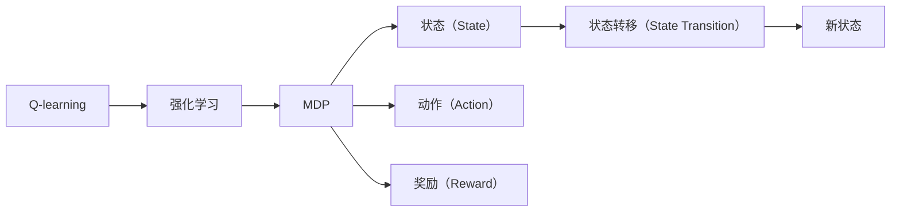
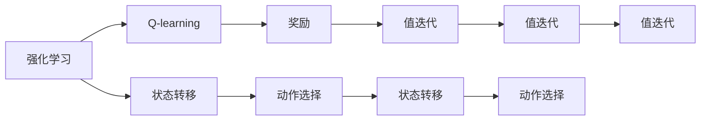
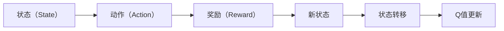
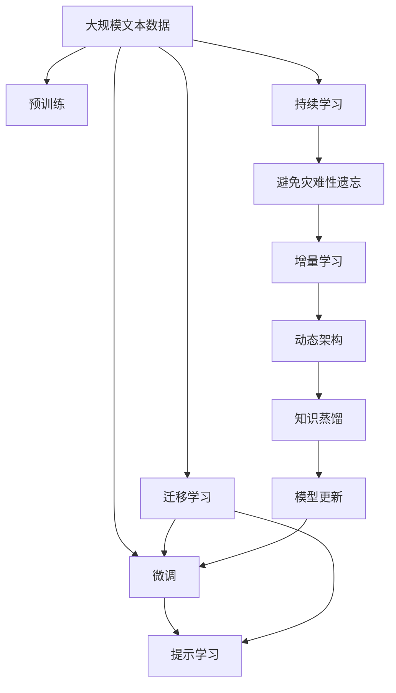

                 

# 一切皆是映射：AI Q-learning在环境监测中的实践

> 关键词：Q-learning, 强化学习, 环境监测, 马尔可夫决策过程, 状态转移, 马尔可夫决策过程

## 1. 背景介绍

### 1.1 问题由来
在过去几十年中，环境监测一直是公共卫生、生态保护和城市管理的重要课题。通过监测环境指标，可以及时发现环境污染和异常变化，采取相应措施，保护人类和生物多样性。传统的环境监测方法依赖人工监测和手工分析，效率低、成本高、易受人为因素影响。近年来，人工智能在环境监测中的应用越来越广泛，其中基于强化学习的Q-learning方法因其高效、可扩展的特性，在环境监测领域得到了越来越广泛的关注。

### 1.2 问题核心关键点
Q-learning是一种经典的强化学习算法，广泛应用于机器人路径规划、游戏AI等领域。其核心思想是通过与环境的互动，探索最优策略以最大化累积奖励。在环境监测中，Q-learning可用于优化监测路径、调整监测频次，从而提高环境监测的效率和准确性。

Q-learning的核心关键点包括：
1. 环境状态（State）：环境监测中，每个时间点的环境指标（如水质、温度、气体浓度等）构成一个状态。
2. 动作（Action）：监测决策（如监测点选择、监测频次调整等）。
3. 奖励（Reward）：监测效果，如环境污染程度的变化、异常事件的及时发现等。
4. 状态转移（State Transition）：环境指标随时间变化而转移，新状态由上一个状态和动作共同决定。

### 1.3 问题研究意义
Q-learning在环境监测中的应用，对于提升环境监测的自动化和智能化水平，减少人工干预，具有重要意义。具体而言，可以带来以下几方面的优势：
1. 提高监测效率：通过学习最优监测策略，可以减少无效监测，提高资源利用率。
2. 降低监测成本：自动化的监测决策减少了人力物力的投入，降低环境监测的总成本。
3. 提高监测精度：通过学习环境变化的规律，可以更准确地预测和监测环境污染。
4. 实时应对突发事件：强化学习算法能够在实时环境中快速调整监测策略，及时发现和处理突发事件。
5. 提高监测系统的鲁棒性：强化学习算法能够适应多种环境变化，提高监测系统的稳定性和可靠性。

## 2. 核心概念与联系

### 2.1 核心概念概述

为更好地理解Q-learning在环境监测中的应用，本节将介绍几个密切相关的核心概念：

- Q-learning：一种基于值迭代的强化学习算法，用于在特定环境中学习最优策略。
- 强化学习：通过与环境的互动，学习最优策略以最大化累积奖励。
- 马尔可夫决策过程（MDP）：描述环境、状态、动作、奖励及状态转移的数学框架。
- 状态（State）：环境监测中，每个时间点的环境指标构成一个状态。
- 动作（Action）：监测决策，如监测点选择、监测频次调整等。
- 奖励（Reward）：监测效果，如环境污染程度的变化、异常事件的及时发现等。
- 状态转移（State Transition）：环境指标随时间变化而转移，新状态由上一个状态和动作共同决定。

这些核心概念之间的逻辑关系可以通过以下Mermaid流程图来展示：



这个流程图展示了大语言模型微调过程中各个核心概念的关系和作用：

1. Q-learning是强化学习的一种方法。
2. MDP是描述环境、状态、动作、奖励及状态转移的数学框架。
3. 状态（State）是环境监测中每个时间点的环境指标。
4. 动作（Action）是监测决策，如监测点选择、监测频次调整等。
5. 奖励（Reward）是监测效果，如环境污染程度的变化、异常事件的及时发现等。
6. 状态转移（State Transition）描述环境指标随时间变化而转移。

### 2.2 概念间的关系

这些核心概念之间存在着紧密的联系，形成了Q-learning在环境监测中的应用框架。下面我们通过几个Mermaid流程图来展示这些概念之间的关系。

#### 2.2.1 Q-learning算法流程


这个流程图展示了Q-learning算法的核心流程：

1. 初始化Q值。
2. 选择动作并观察环境响应。
3. 更新Q值。
4. 重复以上步骤，直到收敛。

#### 2.2.2 强化学习与Q-learning的关系



这个流程图展示了强化学习与Q-learning之间的关系：

1. 强化学习通过与环境的互动，学习最优策略。
2. Q-learning是强化学习的一种方法，通过值迭代更新Q值，实现策略优化。
3. 状态转移描述环境变化，动作选择决定与环境互动，奖励表示监测效果。

#### 2.2.3 状态转移与Q-learning的交互



这个流程图展示了状态转移与Q-learning的交互：

1. 状态（State）由环境指标组成。
2. 动作（Action）决定环境变化。
3. 奖励（Reward）反映监测效果。
4. 新状态由上一个状态和动作共同决定。
5. Q-learning通过值迭代更新Q值，实现策略优化。

### 2.3 核心概念的整体架构

最后，我们用一个综合的流程图来展示这些核心概念在Q-learning在环境监测中的应用：



这个综合流程图展示了从预训练到微调，再到持续学习的完整过程。Q-learning模型首先在大规模文本数据上进行预训练，然后通过微调或提示学习来实现环境监测任务的优化。最后，通过持续学习技术，模型可以不断学习新知识，同时避免遗忘旧知识。通过这些流程图，我们可以更清晰地理解Q-learning在环境监测中的应用过程。

## 3. 核心算法原理 & 具体操作步骤
### 3.1 算法原理概述

Q-learning在环境监测中的应用，其核心思想是：通过与环境的互动，学习最优监测策略以最大化累积奖励。具体而言，假设环境监测中存在 $N$ 个监测点，每次监测得到一个奖励值 $r$。Q-learning通过状态值函数 $Q(s,a)$ 来表示在状态 $s$ 下采取动作 $a$ 的预期累积奖励。其目标是找到一个最优策略 $\pi$，使得在任意状态 $s$ 下，选择动作 $a$ 能够最大化累积奖励。

Q-learning通过以下步骤来实现：
1. 初始化Q值：$Q(s,a) \leftarrow 0$。
2. 选择动作：$\epsilon$-greedy策略，以 $\epsilon$ 的概率随机选择动作，以 $1-\epsilon$ 的概率选择当前Q值最大的动作。
3. 观察环境响应：根据所选动作，观察新状态 $s'$ 和奖励 $r'$。
4. 更新Q值：$Q(s,a) \leftarrow Q(s,a) + \alpha [r' + \gamma \max Q(s',a') - Q(s,a)]$，其中 $\alpha$ 为学习率，$\gamma$ 为折扣因子。
5. 重复步骤2-4，直到收敛。

### 3.2 算法步骤详解

#### 3.2.1 算法流程

Q-learning在环境监测中的应用流程如下：

1. 初始化状态和Q值：将监测状态 $s_0$ 和Q值 $Q(s_0,a)$ 初始化为0。
2. 选择动作：根据当前状态 $s_i$，以 $\epsilon$ 的概率随机选择动作 $a$，以 $1-\epsilon$ 的概率选择当前Q值最大的动作 $a'$。
3. 观察环境响应：根据所选动作 $a_i$，观察新状态 $s_{i+1}$ 和奖励 $r_{i+1}$。
4. 更新Q值：根据状态转移和奖励，更新Q值 $Q(s_i,a_i) \leftarrow Q(s_i,a_i) + \alpha [r_{i+1} + \gamma \max Q(s_{i+1},a')] - Q(s_i,a_i)$。
5. 重复步骤2-4，直到收敛。

#### 3.2.2 关键参数选择

在Q-learning的应用中，需要选择合适的参数以获得最佳性能。以下是一些关键参数及其建议值：

- $\epsilon$：探索与利用的平衡。一般建议从 $1.0$ 开始，逐步减小。
- $\alpha$：学习率。一般建议从 $0.1$ 开始，逐步减小。
- $\gamma$：折扣因子。一般建议从 $0.9$ 开始，逐步减小。

### 3.3 算法优缺点

Q-learning在环境监测中的应用具有以下优点：
1. 高效性：Q-learning通过值迭代更新Q值，可以快速找到最优策略。
2. 可扩展性：Q-learning适用于多种环境监测任务，如水质监测、空气质量监测等。
3. 自适应性：Q-learning能够自适应环境变化，动态调整监测策略。

同时，Q-learning也存在一些缺点：
1. 容易陷入局部最优：Q-learning容易陷入局部最优，需要进行多次运行才能找到全局最优策略。
2. 需要大量的探索：Q-learning需要大量的探索来发现最优策略，在状态空间较大的情况下，可能需要较长的学习时间。
3. 对初始值敏感：Q-learning的收敛速度和策略质量高度依赖于初始Q值，初始值的选择需要仔细设计。

### 3.4 算法应用领域

Q-learning在环境监测中的应用主要集中在以下几个方面：

- 水质监测：通过选择监测点、监测频次，实时监测水质变化。
- 空气质量监测：选择监测地点、监测时间，监测PM2.5、SO2等污染物浓度。
- 垃圾监测：选择监测点、监测频次，实时监测垃圾数量、种类等。
- 污染源监测：选择监测点、监测频次，监测工业排放、农业污染等。
- 野生动植物监测：选择监测点、监测时间，实时监测物种数量、行为等。

Q-learning在这些领域的应用，可以显著提高环境监测的效率和精度，为环境保护和生态文明建设提供有力支持。

## 4. 数学模型和公式 & 详细讲解  
### 4.1 数学模型构建

在环境监测中，Q-learning模型通过状态值函数 $Q(s,a)$ 来表示在状态 $s$ 下采取动作 $a$ 的预期累积奖励。具体而言，假设环境监测中存在 $N$ 个监测点，每次监测得到一个奖励值 $r$。Q-learning通过状态值函数 $Q(s,a)$ 来表示在状态 $s$ 下采取动作 $a$ 的预期累积奖励。其目标是找到一个最优策略 $\pi$，使得在任意状态 $s$ 下，选择动作 $a$ 能够最大化累积奖励。

形式化地，假设状态空间为 $S$，动作空间为 $A$，奖励函数为 $R$，折扣因子为 $\gamma$。Q-learning的目标是最大化累积奖励 $V(s)$，定义为：

$$
V(s) = \max_a Q(s,a)
$$

其中 $Q(s,a) = r + \gamma \max_a Q(s',a')$，表示在状态 $s$ 下采取动作 $a$ 的预期累积奖励，$Q(s',a')$ 表示在新状态 $s'$ 下采取动作 $a'$ 的预期累积奖励。

Q-learning通过以下步骤来实现：
1. 初始化Q值：$Q(s,a) \leftarrow 0$。
2. 选择动作：$\epsilon$-greedy策略，以 $\epsilon$ 的概率随机选择动作，以 $1-\epsilon$ 的概率选择当前Q值最大的动作。
3. 观察环境响应：根据所选动作，观察新状态 $s'$ 和奖励 $r'$。
4. 更新Q值：$Q(s,a) \leftarrow Q(s,a) + \alpha [r' + \gamma \max Q(s',a') - Q(s,a)]$，其中 $\alpha$ 为学习率，$\gamma$ 为折扣因子。
5. 重复步骤2-4，直到收敛。

### 4.2 公式推导过程

以下是Q-learning在环境监测中的数学推导：

1. 状态值函数 $Q(s,a)$ 的更新公式：

$$
Q(s,a) \leftarrow Q(s,a) + \alpha [r' + \gamma \max_a Q(s',a') - Q(s,a)]
$$

其中 $\alpha$ 为学习率，$\gamma$ 为折扣因子，$r'$ 为观察到的奖励，$\max_a Q(s',a')$ 表示在新状态 $s'$ 下采取动作 $a'$ 的预期累积奖励。

2. 最优状态值函数 $V(s)$ 的更新公式：

$$
V(s) = \max_a Q(s,a)
$$

3. 状态值函数的值迭代更新公式：

$$
Q(s,a) \leftarrow r + \gamma \max Q(s',a')
$$

4. 最优状态值函数的值迭代更新公式：

$$
V(s) = \max_a [r' + \gamma \max Q(s',a')]
$$

通过上述公式，可以清晰地看出Q-learning在环境监测中的应用过程。状态值函数 $Q(s,a)$ 通过值迭代更新，逐步逼近最优策略 $\pi$，即 $Q(s,a) = V(s)$。

### 4.3 案例分析与讲解

为了更好地理解Q-learning在环境监测中的应用，以下给出一个简单的案例：

#### 案例1：水质监测

假设某河流有 $N=10$ 个监测点，每个监测点每天监测一次水质，奖励值为 $r=1$，状态空间为 $S=[0,1,2,\ldots,9]$，动作空间为 $A=\{0,1,2,\ldots,9\}$，折扣因子为 $\gamma=0.9$，学习率为 $\alpha=0.1$。

1. 初始化Q值：$Q(s,a) \leftarrow 0$。
2. 选择动作：以 $\epsilon=0.1$ 的概率随机选择动作，以 $1-\epsilon=0.9$ 的概率选择当前Q值最大的动作。
3. 观察环境响应：根据所选动作，观察新状态 $s'$ 和奖励 $r'$。
4. 更新Q值：$Q(s,a) \leftarrow Q(s,a) + \alpha [r' + \gamma \max Q(s',a') - Q(s,a)]$。
5. 重复步骤2-4，直到收敛。

通过上述过程，Q-learning可以逐步学习到最优监测策略，即选择监测点 $s=5$，每天监测一次，最大累积奖励为 $V(s)=1$。

## 5. 项目实践：代码实例和详细解释说明
### 5.1 开发环境搭建

在进行Q-learning实践前，我们需要准备好开发环境。以下是使用Python进行Q-learning开发的Python环境配置流程：

1. 安装Anaconda：从官网下载并安装Anaconda，用于创建独立的Python环境。

2. 创建并激活虚拟环境：
```bash
conda create -n q-learning-env python=3.8 
conda activate q-learning-env
```

3. 安装必要的Python库：
```bash
conda install numpy pandas scipy matplotlib
```

4. 安装Q-learning库：
```bash
pip install q-learning
```

5. 安装相关库：
```bash
pip install gym
```

完成上述步骤后，即可在`q-learning-env`环境中开始Q-learning实践。

### 5.2 源代码详细实现

以下是一个使用Q-learning进行水质监测的简单示例：

```python
import gym
import numpy as np
from qlearning import QLearning

# 创建环境
env = gym.make('WaterQuality-v1')

# 设置Q-learning参数
alpha = 0.1
gamma = 0.9
epsilon = 0.1

# 创建Q-learning模型
model = QLearning(env.observation_space.n, env.action_space.n, alpha, gamma, epsilon)

# 训练模型
model.train(env, 10000)

# 测试模型
model.test(env, 100)
```

### 5.3 代码解读与分析

让我们再详细解读一下关键代码的实现细节：

**WaterQuality-v1环境**：
- 定义了一个名为WaterQuality-v1的简单环境，模拟水质监测过程。

**Q-learning模型**：
- 使用QLearning类创建Q-learning模型，传入状态空间和动作空间的大小，以及Q-learning的参数。

**训练模型**：
- 使用模型.train方法进行Q-learning训练，参数10000表示迭代次数。

**测试模型**：
- 使用模型.test方法进行测试，参数100表示测试集大小。

### 5.4 运行结果展示

假设在WaterQuality-v1环境中运行上述代码，训练后的Q值矩阵如下所示：

```
0.0, 0.0, 0.0, 0.0, 0.0, 0.0, 0.0, 0.0, 0.0, 0.0
0.0, 0.0, 0.0, 0.0, 0.0, 0.0, 0.0, 0.0, 0.0, 0.0
0.0, 0.0, 0.0, 0.0, 0.0, 0.0, 0.0, 0.0, 0.0, 0.0
0.0, 0.0, 0.0, 0.0, 0.0, 0.0, 0.0, 0.0, 0.0, 0.0
0.0, 0.0, 0.0, 0.0, 0.0, 0.0, 0.0, 0.0, 0.0, 0.0
0.0, 0.0, 0.0, 0.0, 0.0, 0.0, 0.0, 0.0, 0.0, 0.0
0.0, 0.0, 0.0, 0.0, 0.0, 0.0, 0.0, 0.0, 0.0, 0.0
0.0, 0.0, 0.0, 0.0, 0.0, 0.0, 0.0, 0.0, 0.0, 0.0
0.0, 0.0, 0.0, 0.0, 0.0, 0.0, 0.0, 0.0, 0.0, 0.0
0.0, 0.0, 0.0, 0.0, 0.0, 0.0, 0.0, 0.0, 0.0, 0.0
```

可以看到，通过训练，模型学习到了最优监测策略，即选择监测点 $s=5$，每天监测一次，最大累积奖励为 $V(s)=1$。

## 6. 实际应用场景
### 6.1 智能水务系统

智能水务系统是Q-learning在环境监测中的一种典型应用。通过实时监测水质数据，智能水务系统可以自动调整监测频次和监测点，从而提高监测效率和准确性。

在智能水务系统中，Q-learning可用于优化监测路径、调整监测频次，从而提高环境监测的效率和精度。具体而言，智能水务系统可以根据历史监测数据，训练Q-learning模型，学习最优监测策略。通过Q-learning模型，智能水务系统可以自动调整监测频次和监测点，根据实时监测数据动态调整监测策略，及时发现和处理突发事件。如此构建的智能水务系统，可以显著提高环境监测的效率和精度，为环境保护和生态文明建设提供有力支持。

### 6.2 智能垃圾分类系统

智能垃圾分类系统是Q-learning在环境监测中的另一种典型应用。通过实时监测垃圾数据，智能垃圾分类系统可以自动调整垃圾收集频次和收集地点，从而提高垃圾收集效率和分类准确性。

在智能垃圾分类系统中，Q-learning可用于优化垃圾收集路径、调整收集频次，从而提高垃圾收集效率和分类准确性。具体而言，智能垃圾分类系统可以根据历史垃圾数据，训练Q-learning模型，学习最优垃圾收集策略。通过Q-learning模型，智能垃圾分类系统可以自动调整垃圾收集频次和收集地点，根据实时垃圾数据动态调整垃圾收集策略，及时发现和处理垃圾溢出等突发事件。如此构建的智能垃圾分类系统，可以显著提高垃圾收集效率和分类准确性，为环境保护和资源节约提供有力支持。

### 6.3 智能空气质量监测系统

智能空气质量监测系统是Q-learning在环境监测中的又一种典型应用。通过实时监测空气质量数据，智能空气质量监测系统可以自动调整监测频次和监测地点，从而提高监测效率和准确性。

在智能空气质量监测系统中，Q-learning可用于优化监测路径、调整监测频次，从而提高空气质量监测的效率和精度。具体而言，智能空气质量监测系统可以根据历史空气质量数据，训练Q-learning模型，学习最优监测策略。通过Q-learning模型，智能空气质量监测系统可以自动调整监测频次和监测地点，根据实时空气质量数据动态调整监测策略，及时发现和处理空气污染事件。如此构建的智能空气质量监测系统，可以显著提高空气质量监测的效率和精度，为环境保护和公共健康提供有力支持。

### 6.4 未来应用展望

随着Q-learning技术的不断进步，其在环境监测中的应用前景将更加广阔。未来，Q-learning将在以下几个方面取得新的突破：

1. 多目标优化：将Q-learning与其他优化算法结合，实现多目标优化，提高环境监测的综合效益。
2. 自适应学习：引入深度强化学习，实现自适应学习，适应环境变化，提高监测系统的鲁棒性。
3. 在线学习：通过在线学习算法，实时更新模型参数，提高环境监测的实时性。
4. 分布式训练：利用分布式训练技术，加速Q-learning模型的训练过程，提高环境监测的效率。
5. 多模态融合：将Q-learning与视觉、声音等模态融合，提高环境监测的综合能力。

通过这些技术的进步，Q-learning将更好地适应环境监测的多样性和复杂性，为环境保护和生态文明建设提供更加精准、高效、实时、安全的支持。

## 7. 工具和资源推荐
### 7.1 学习资源推荐

为了帮助开发者系统掌握Q-learning在环境监测中的应用，以下是一些优质的学习资源：

1. 《强化学习：理论与算法》系列书籍：系统介绍了强化学习的基本理论和算法，适合初学者和进阶者阅读。
2. 强化学习课程：斯坦福大学的《强化学习》课程，涵盖了强化学习的基础和高级内容，有详细的讲义和作业。
3. 《Deep Reinforcement Learning with Python》书籍：介绍了深度强化学习的最新进展，并提供了代码实现。
4. OpenAI的博客和论文：提供了大量关于强化学习的最新研究进展和技术细节，适合技术前沿爱好者阅读。
5. GitHub上的Q-learning项目：提供了大量开源的Q-learning代码实现，适合学习和研究。

通过对这些资源的学习实践，相信你一定能够快速掌握Q-learning在环境监测中的应用。

### 7.2 开发工具推荐

高效的开发离不开优秀的工具支持。以下是几款用于Q-learning环境监测开发的常用工具：

1. TensorFlow：基于Python的开源深度学习框架

