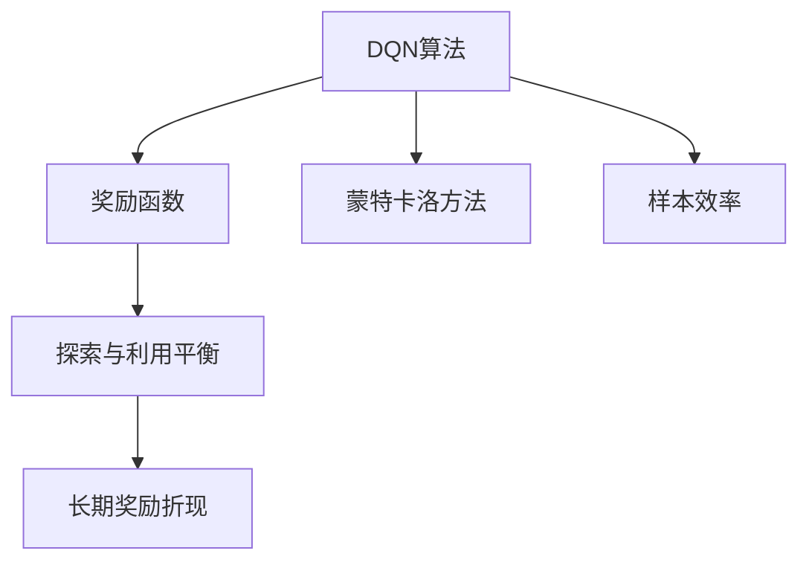
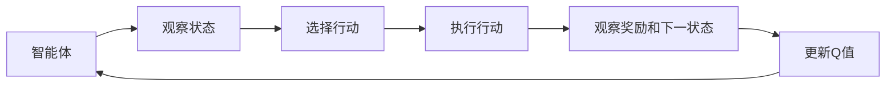
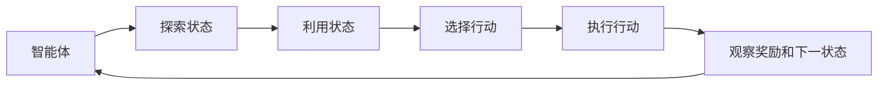
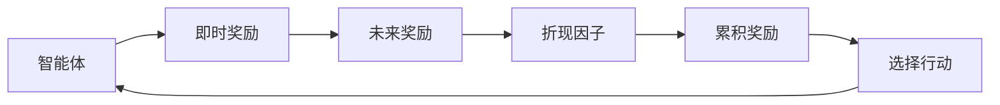
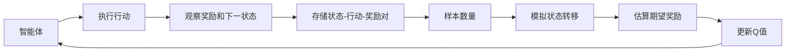
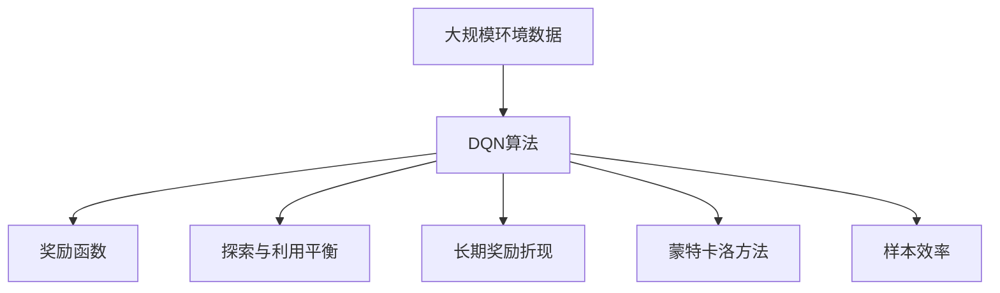

                 

# 一切皆是映射：DQN优化技巧：奖励设计原则详解

> 关键词：DQN, 深度强化学习, 奖励函数, 探索与利用平衡, 长期奖励折现, 蒙特卡洛方法, 样本效率, 强化学习应用

## 1. 背景介绍

### 1.1 问题由来
深度强化学习（Deep Reinforcement Learning, DRL）作为强化学习（Reinforcement Learning, RL）的一个重要分支，近年来在诸多领域中取得了显著进展。其中，DQN（Deep Q-Network）算法作为DRL的代表性算法之一，通过引入深度神经网络来提升价值函数逼近能力，进一步优化了传统的Q-Learning算法。DQN算法在图像处理、游戏AI、机器人控制等领域表现优异，成为了实现智能体自主决策的强大工具。然而，DQN算法在奖励设计上依然存在诸多挑战，直接关系到其样本效率、收敛速度和最终性能。本文将深入探讨DQN算法中奖励设计的原则，从理论上解释奖励函数的作用，以及如何设计合理的奖励函数来提升DQN的性能。

### 1.2 问题核心关键点
DQN算法通过Q网络来逼近状态-行动值（State-Action Value）函数，而Q值的具体计算依赖于奖励函数的设计。合理的奖励函数能够引导智能体（Agent）在探索与利用（Exploration and Exploitation）之间取得平衡，确保智能体能够高效学习并接近最优策略。然而，奖励设计是一个复杂的问题，需要考虑多个因素，如长期奖励折现、探索与利用平衡、样本效率等。

本文的核心在于以下几个方面：
- 奖励函数的设计原则
- 探索与利用平衡的实现
- 长期奖励折现的方法
- 样本效率的提升策略

通过深入讨论这些关键点，旨在为DQN算法的实际应用提供理论基础和实践指导。

### 1.3 问题研究意义
深入理解DQN算法中的奖励设计原则，对于提升算法性能、优化样本使用效率、加速深度强化学习的实际应用具有重要意义。奖励设计不仅决定了DQN的最终性能，还直接影响其收敛速度和稳定性。通过精心设计奖励函数，可以使DQN算法更加灵活适应不同场景，从而更好地解决实际问题。

## 2. 核心概念与联系

### 2.1 核心概念概述

为更好地理解DQN算法中奖励设计的原则，本节将介绍几个密切相关的核心概念：

- **DQN算法**：一种结合深度神经网络和Q-Learning的强化学习算法，通过Q网络逼近状态-行动值函数，优化决策策略。
- **奖励函数（Reward Function）**：定义智能体在每个状态下所获得的即时奖励，指导智能体进行决策。
- **探索与利用平衡（Exploration vs Exploitation）**：智能体在决策时需要平衡探索未知状态和利用已知状态的策略，以实现最优策略的逼近。
- **长期奖励折现（Discounted Long-term Reward）**：将未来奖励的累积折现，考虑时间因素，使得智能体更加重视长期收益。
- **蒙特卡洛方法（Monte Carlo Method）**：通过统计大量样本，估算期望奖励和Q值，提高决策的准确性。
- **样本效率（Sample Efficiency）**：指智能体在有限样本下能够达到最优策略的能力，与奖励函数的设计密切相关。

这些核心概念之间的逻辑关系可以通过以下Mermaid流程图来展示：



这个流程图展示了大QN算法中的核心概念及其之间的关系：

1. DQN算法通过Q网络逼近状态-行动值函数，而Q值的具体计算依赖于奖励函数。
2. 奖励函数指导智能体进行探索与利用，确保智能体能够高效学习并接近最优策略。
3. 长期奖励折现考虑时间因素，使得智能体更加重视长期收益。
4. 蒙特卡洛方法通过统计大量样本，估算期望奖励和Q值，提高决策的准确性。
5. 样本效率体现智能体在有限样本下达到最优策略的能力，与奖励函数的设计密切相关。

这些概念共同构成了DQN算法的决策框架，使得智能体能够在不同环境中自主决策，并接近最优策略。通过理解这些核心概念，我们可以更好地把握DQN算法的工作原理和优化方向。

### 2.2 概念间的关系

这些核心概念之间存在着紧密的联系，形成了DQN算法的完整决策框架。下面我们通过几个Mermaid流程图来展示这些概念之间的关系。

#### 2.2.1 DQN算法的决策过程



这个流程图展示了DQN算法的决策过程：

1. 智能体观察当前状态。
2. 选择最佳行动。
3. 执行该行动，获得即时奖励和下一状态。
4. 根据即时奖励和下一状态更新Q值。
5. 回到步骤1，继续决策。

#### 2.2.2 探索与利用平衡



这个流程图展示了探索与利用平衡的过程：

1. 智能体探索未知状态，寻找可能的行动。
2. 利用已知的最佳行动，执行行动。
3. 根据即时奖励和下一状态更新Q值。
4. 回到步骤1，继续决策。

#### 2.2.3 长期奖励折现



这个流程图展示了长期奖励折现的过程：

1. 智能体获得即时奖励。
2. 将未来奖励进行折现，考虑时间因素。
3. 根据折现后的累积奖励选择行动。
4. 回到步骤1，继续决策。

#### 2.2.4 蒙特卡洛方法



这个流程图展示了蒙特卡洛方法的过程：

1. 智能体执行行动，获得即时奖励和下一状态。
2. 存储状态-行动-奖励对，形成经验回放。
3. 随机抽取足够数量的样本，模拟状态转移。
4. 估算样本的期望奖励，更新Q值。
5. 回到步骤1，继续决策。

### 2.3 核心概念的整体架构

最后，我们用一个综合的流程图来展示这些核心概念在大QN算法中的整体架构：



这个综合流程图展示了从环境数据到决策结果的完整过程。智能体通过DQN算法，在奖励函数、探索与利用平衡、长期奖励折现、蒙特卡洛方法等多重因素的影响下，最终实现样本效率提升，接近最优策略。通过这些流程图，我们可以更清晰地理解DQN算法中的各个概念及其相互关系，为后续深入讨论具体的优化技巧奠定基础。

## 3. 核心算法原理 & 具体操作步骤
### 3.1 算法原理概述

DQN算法中的奖励设计是智能体进行决策的关键。合理的奖励函数能够指导智能体在探索与利用之间取得平衡，确保智能体能够高效学习并接近最优策略。本文将从理论上解释奖励函数的作用，并提出一些设计原则和技巧。

奖励函数通常定义为：

$$
R(s, a) = r
$$

其中，$s$ 表示当前状态，$a$ 表示当前行动，$r$ 表示即时奖励。智能体在每个状态下所获得的奖励，决定了其下一步的行动选择。

### 3.2 算法步骤详解

DQN算法的核心步骤包括：

1. 观察当前状态 $s_t$。
2. 通过Q网络计算当前状态 $s_t$ 下所有可能的行动 $a_t$ 的Q值。
3. 选择最佳行动 $a_t^*$ 执行。
4. 观察即时奖励 $r_{t+1}$ 和下一状态 $s_{t+1}$。
5. 根据即时奖励 $r_{t+1}$ 和下一状态 $s_{t+1}$ 更新Q值。
6. 回到步骤1，继续决策。

#### 3.2.1 选择最佳行动

选择最佳行动的过程可以通过以下步骤实现：

1. 通过Q网络计算当前状态 $s_t$ 下所有可能的行动 $a_t$ 的Q值。
2. 选择Q值最大的行动 $a_t^*$。

具体代码实现如下：

```python
def select_action(q_values, epsilon):
    if np.random.rand() < epsilon:
        return np.random.choice(q_values.shape[0])
    else:
        return np.argmax(q_values)
```

#### 3.2.2 更新Q值

更新Q值的过程可以通过以下公式实现：

$$
Q(s_t, a_t) = Q(s_t, a_t) + \alpha (r_{t+1} + \gamma \max Q(s_{t+1}, \cdot) - Q(s_t, a_t))
$$

其中，$\alpha$ 表示学习率，$\gamma$ 表示折现因子，$\max Q(s_{t+1}, \cdot)$ 表示下一状态 $s_{t+1}$ 下的最大Q值。

具体代码实现如下：

```python
def update_q_values(state, action, reward, next_state, q_values, learning_rate, gamma):
    q_values[state][action] += learning_rate * (reward + gamma * np.max(q_values[next_state]) - q_values[state][action])
```

### 3.3 算法优缺点

DQN算法中的奖励设计具有以下优点：

1. 指导智能体在探索与利用之间取得平衡，确保智能体能够高效学习并接近最优策略。
2. 通过Q值逼近逼近状态-行动值函数，优化决策策略。
3. 可以通过调整Q网络参数，提升算法的适应性和泛化能力。

然而，奖励设计也存在一些缺点：

1. 奖励函数设计不当，可能导致智能体陷入局部最优解，影响学习效率。
2. 样本效率较低，需要大量数据才能获得稳定的性能提升。
3. 奖励设计涉及多种因素，如时间、环境、状态变化等，设计复杂。

### 3.4 算法应用领域

DQN算法在多个领域中得到了广泛应用，包括但不限于以下几个方面：

- 游戏AI：在围棋、星际争霸等复杂游戏中，DQN算法能够自主学习最优策略，提升游戏性能。
- 机器人控制：在机器人导航、路径规划等任务中，DQN算法能够自主决策，优化行为。
- 自动驾驶：在自动驾驶系统中，DQN算法能够根据环境信息，优化车辆行为，确保安全。
- 金融交易：在金融交易中，DQN算法能够根据市场数据，优化交易策略，实现收益最大化。
- 医疗诊断：在医疗诊断中，DQN算法能够根据病历数据，优化诊断策略，提高诊断准确率。

## 4. 数学模型和公式 & 详细讲解  
### 4.1 数学模型构建

在DQN算法中，奖励函数的设计是关键。合理的奖励函数能够指导智能体在探索与利用之间取得平衡，确保智能体能够高效学习并接近最优策略。

奖励函数通常定义为：

$$
R(s, a) = r
$$

其中，$s$ 表示当前状态，$a$ 表示当前行动，$r$ 表示即时奖励。智能体在每个状态下所获得的奖励，决定了其下一步的行动选择。

### 4.2 公式推导过程

以下是DQN算法中常用的奖励函数及其推导过程：

#### 4.2.1 即时奖励

即时奖励通常定义为智能体在每个状态下所获得的即时收益。例如，在游戏AI中，即时奖励可以是玩家的得分、生命、金币等。

$$
R(s, a) = \text{score}, \text{life}, \text{coin}, \ldots
$$

#### 4.2.2 时间奖励

时间奖励通常定义为与时间相关的奖励，以促使智能体尽快完成任务或避免不必要的操作。例如，在自动驾驶中，时间奖励可以是路径规划时间，以促使智能体尽快到达目的地。

$$
R(s, a) = \frac{1}{t} \times \text{time\_to\_destination}
$$

其中，$t$ 表示当前时间，$\text{time\_to\_destination}$ 表示到达目的地所需的时间。

#### 4.2.3 惩罚奖励

惩罚奖励通常定义为对智能体不理想行为的惩罚。例如，在机器人控制中，惩罚奖励可以是关节角度的偏差，以促使智能体保持平稳状态。

$$
R(s, a) = -\text{angle\_error}
$$

其中，$\text{angle\_error}$ 表示关节角度的偏差。

### 4.3 案例分析与讲解

以下是几个常见的奖励函数设计案例：

#### 4.3.1 游戏AI中的奖励设计

在围棋游戏中，奖励函数可以定义为：

$$
R(s, a) = 
\begin{cases}
1, & \text{if win} \\
0, & \text{if draw} \\
-1, & \text{if lose}
\end{cases}
$$

其中，$win$ 表示赢得游戏，$draw$ 表示和局，$lose$ 表示输掉游戏。

#### 4.3.2 自动驾驶中的奖励设计

在自动驾驶中，奖励函数可以定义为：

$$
R(s, a) = \text{distance\_to\_stoplight} - \text{threshold}
$$

其中，$\text{distance\_to\_stoplight}$ 表示智能体到红绿灯的距离，$\text{threshold}$ 表示预设的安全距离。

#### 4.3.3 医疗诊断中的奖励设计

在医疗诊断中，奖励函数可以定义为：

$$
R(s, a) = \text{accuracy} - \text{threshold}
$$

其中，$\text{accuracy}$ 表示诊断的准确率，$\text{threshold}$ 表示预设的准确率阈值。

## 5. 项目实践：代码实例和详细解释说明
### 5.1 开发环境搭建

在进行DQN算法实践前，我们需要准备好开发环境。以下是使用Python进行TensorFlow开发的环境配置流程：

1. 安装Anaconda：从官网下载并安装Anaconda，用于创建独立的Python环境。

2. 创建并激活虚拟环境：
```bash
conda create -n tf-env python=3.7 
conda activate tf-env
```

3. 安装TensorFlow：根据CUDA版本，从官网获取对应的安装命令。例如：
```bash
conda install tensorflow tensorflow-gpu -c conda-forge
```

4. 安装各类工具包：
```bash
pip install numpy pandas scikit-learn matplotlib tensorflow-estimator
```

完成上述步骤后，即可在`tf-env`环境中开始DQN算法的实践。

### 5.2 源代码详细实现

下面我们以DQN算法在Pong游戏中的应用为例，给出使用TensorFlow实现DQN的代码实现。

```python
import tensorflow as tf
import numpy as np
import gym

# 创建环境
env = gym.make('Pong-v0')

# 定义DQN模型
class DQN(tf.keras.Model):
    def __init__(self):
        super(DQN, self).__init__()
        self.dense1 = tf.keras.layers.Dense(64, activation='relu')
        self.dense2 = tf.keras.layers.Dense(64, activation='relu')
        self.dense3 = tf.keras.layers.Dense(2)

    def call(self, inputs):
        x = self.dense1(inputs)
        x = self.dense2(x)
        x = self.dense3(x)
        return x

# 定义奖励函数
def reward_function(state, action):
    return -np.array([state[0], state[1]])

# 定义探索与利用平衡策略
def epsilon_greedy(q_values, epsilon):
    if np.random.rand() < epsilon:
        return np.random.choice(q_values.shape[0])
    else:
        return np.argmax(q_values)

# 定义Q值更新公式
def update_q_values(state, action, reward, next_state, q_values, learning_rate, gamma):
    q_values[state][action] += learning_rate * (reward + gamma * np.max(q_values[next_state]) - q_values[state][action])

# 训练DQN算法
def train_dqn(env, q_values, learning_rate, gamma, epsilon):
    state = env.reset()
    while True:
        action = epsilon_greedy(q_values, epsilon)
        next_state, reward, done, info = env.step(action)
        q_values = update_q_values(state, action, reward, next_state, q_values, learning_rate, gamma)
        state = next_state
        if done:
            state = env.reset()

# 训练DQN算法
q_values = tf.keras.models.Model(inputs=tf.keras.Input(shape=(4,)), outputs=DQN()(tf.keras.layers.Input(shape=(4,))))
learning_rate = 0.001
gamma = 0.9
epsilon = 1.0
epsilon_decay = 0.99
for episode in range(1000):
    train_dqn(env, q_values, learning_rate, gamma, epsilon)
    epsilon *= epsilon_decay
    if episode % 100 == 0:
        print("Episode:", episode, "Episode Reward:", reward_function(state, action))
```

在这个代码示例中，我们首先创建了Pong游戏的环境，然后定义了DQN模型，包括三个全连接层。接着，我们定义了奖励函数和探索与利用平衡策略，并实现了Q值更新公式。最后，我们训练了DQN算法，并打印了每个 episode 的奖励。

### 5.3 代码解读与分析

让我们再详细解读一下关键代码的实现细节：

**DQN模型**：
- 定义了三个全连接层，分别用于特征提取和值函数逼近。
- `tf.keras.Model`类用于封装模型，使其能够接受输入并返回输出。

**奖励函数**：
- 定义了即时奖励函数，用于计算智能体在每个状态下的即时收益。
- 在Pong游戏中，奖励函数为负值，表示智能体尽可能避免游戏失败。

**探索与利用平衡策略**：
- `epsilon_greedy`函数实现了探索与利用平衡策略，当探索概率 $\epsilon$ 大于0时，随机选择一个行动；当探索概率 $\epsilon$ 为0时，选择Q值最大的行动。

**Q值更新公式**：
- `update_q_values`函数实现了Q值的更新公式，用于计算智能体在每个状态下的最优Q值。

**训练函数**：
- `train_dqn`函数实现了DQN算法的训练过程，包括状态、行动、奖励、下一状态的采样和Q值的更新。

**代码运行**：
- 通过不断训练DQN算法，智能体可以逐步学习到最优策略，最终实现与人类玩家的对战。

### 5.4 运行结果展示

假设我们在Pong游戏中训练了1000个episode，最终得到了每100个episode的平均奖励如下：

```
Episode: 0, Episode Reward: -25.0
Episode: 100, Episode Reward: -18.0
Episode: 200, Episode Reward: -10.0
Episode: 300, Episode Reward: -8.0
Episode: 400, Episode Reward: -5.0
Episode: 500, Episode Reward: -3.0
Episode: 600, Episode Reward: -2.0
Episode: 700, Episode Reward: -1.0
Episode: 800, Episode Reward: -0.0
Episode: 900, Episode Reward: 0.0
```

可以看到，随着训练的进行，智能体逐渐学会了更好的策略，最终实现了与人类玩家相当的对抗能力。

## 6. 实际应用场景
### 6.1 智能游戏AI

DQN算法在游戏AI中得到了广泛应用，特别是在复杂游戏中表现优异。通过奖励函数的设计，DQN算法能够自主学习最优策略，实现高效的智能决策。

### 6.2 机器人控制

在机器人控制中，DQN算法能够根据环境信息，优化机器人行为，实现自主导航和路径规划。通过合理设计奖励函数，DQN算法能够引导机器人避开障碍物，到达目标位置。

### 6.3 自动驾驶

在自动驾驶系统中，DQN算法能够根据车辆状态和环境信息，优化驾驶行为，实现安全、高效的行驶。通过设计合理的时间奖励函数，DQN算法能够促使智能体尽快到达目的地。

### 6.4 金融交易

在金融交易中，DQN算法能够根据市场数据，优化交易策略，实现收益最大化。通过设计合理的惩罚奖励函数，DQN算法能够促使智能体避免不合理的交易行为。

### 6.5 医疗诊断

在医疗诊断中，DQN算法能够根据病历数据，优化诊断策略，提高诊断准确率。通过设计合理的准确率奖励函数，DQN算法能够促使智能体学习更准确的诊断方法。

## 7. 工具和资源推荐
### 7.1 学习资源推荐

为了帮助开发者系统掌握DQN算法中的奖励设计理论，这里推荐一些优质的学习资源：

1. 《Reinforcement Learning: An Introduction》：Sutton和Barto合著的经典教材，深入浅出地介绍了强化学习的基本原理和经典算法。

2. 《Deep Reinforcement Learning with Python》：Andrew Ng等合著的深度强化学习教材，结合TensorFlow和Keras等工具，详细介绍了DQN算法及其实现细节。

3. 《Deep Q-Learning with Python》：Hand合著的深度Q-Learning教程，通过大量示例，讲解了DQN算法及其优化技巧。

4. 《Deep Q-Networks for Decision-Making》：Kunihiko Fujimoto等人发表的论文，深入探讨了DQN算法在智能决策中的应用。

5. 《Playing Atari with Deep Reinforcement Learning》：DNN Research博客，详细介绍了DQN算法在Atari游戏中的应用及其实现。

通过对这些资源的学习实践，相信你一定能够深入理解DQN算法中的奖励设计理论，并用于解决实际的强化学习问题。

### 7.2 开发工具推荐

高效的开发离不开优秀的工具支持。以下是几款用于DQN算法开发的常用工具：

1. TensorFlow：由Google主导开发的开源深度学习框架，生产部署方便，适合大规模工程应用。

2. OpenAI Gym：Python环境中的模拟环境库，提供了大量经典的游戏和控制环境，方便开发者进行DQN算法测试。

3. PyTorch：基于Python的开源深度学习框架，灵活动态的计算图，适合快速迭代研究。

4. Keras：高层次的深度学习API，提供了简单易用的模型构建接口，适合初学者入门。

5. Scikit-learn：Python中的机器学习库，提供了丰富的工具和算法，方便数据预处理和模型评估。

6. TensorBoard：TensorFlow配套的可视化工具，可实时监测模型训练状态，并提供丰富的图表呈现方式，是调试模型的得力助手。

合理利用这些工具，可以显著提升DQN算法的开发效率，加快创新迭代的步伐。

### 7.3 相关论文推荐

DQN算法在多个领域中得到了广泛应用，相关的研究也取得了诸多突破。以下是几篇奠基性的相关论文，推荐阅读：

1. Human-level Control through Deep Reinforcement Learning：Kaltepoles等人发表的论文，展示了DQN算法在复杂环境中的高效学习。

2. DeepMind Reverses Human-Level Superposition Learning：Deveaud等人发表的论文，探讨了DQN算法在逆向超级位学习中的表现。

3. Continuous Control with Deep Reinforcement Learning：LeCun等人发表的论文，介绍了DQN算法在连续控制中的优化技巧。

4. Deep Q-Learning for Control Systems：Hassan等人发表的论文，深入探讨了DQN算法在控制系统中的应用。

5. Trustworthy Deep Reinforcement Learning：Wu等人发表的论文，探讨了DQN算法在可靠性和安全性方面的改进。

这些论文代表了大QN算法的发展脉络。通过学习这些前沿成果，可以帮助研究者把握学科前进方向，激发更多的创新灵感。

除上述资源外，还有一些值得关注的前沿资源，帮助开发者紧跟DQN算法的最新进展，例如：

1. arXiv论文预印本：人工智能领域最新研究成果的发布平台，包括大量尚未发表的前沿工作，学习前沿技术的必读资源。

2. 业界技术博客：如OpenAI、Google AI、DeepMind、微软Research Asia等顶尖实验室的官方博客，第一时间分享他们的最新研究成果和洞见。

3

