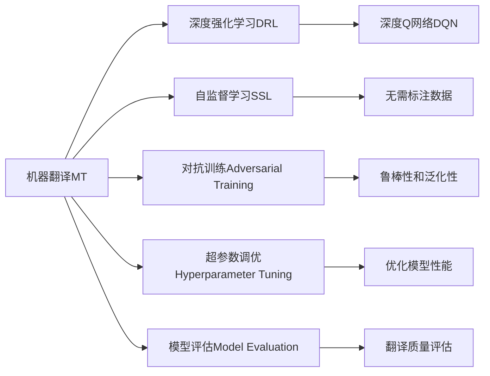
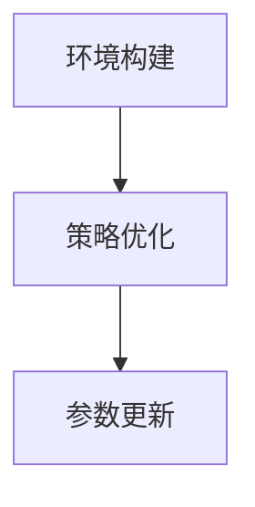
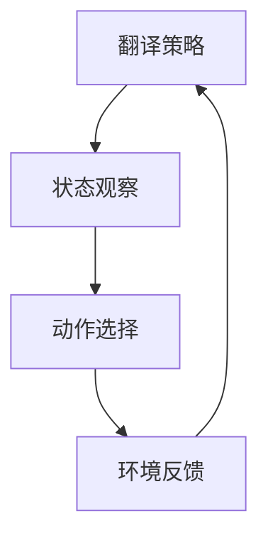
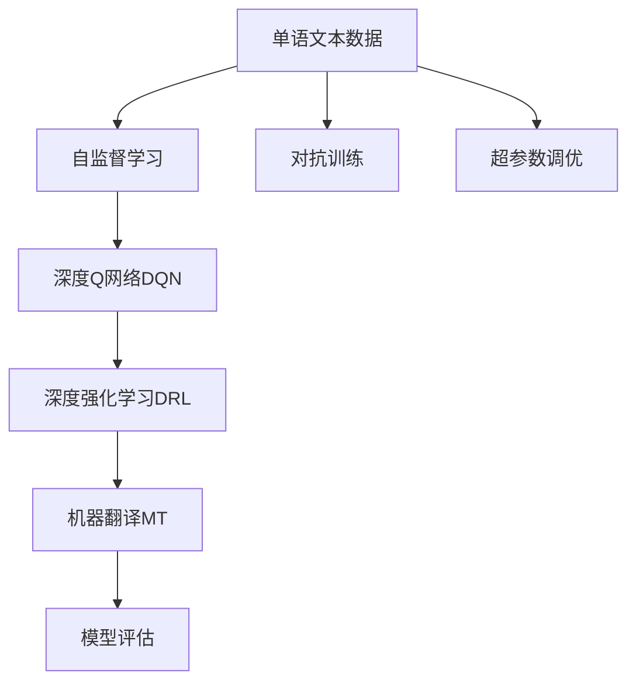

                 

# 一切皆是映射：DQN在机器翻译领域的应用：潜力与挑战

> 关键词：深度强化学习, 深度Q网络(DQN), 机器翻译, 自监督学习, 对抗训练, 超参数调优, 模型评估

## 1. 背景介绍

### 1.1 问题由来

在人工智能领域，机器翻译（Machine Translation, MT）一直是一项极具挑战性的任务。传统的统计机器翻译（SMT）依赖大量的双语语料库，需要手工设计特征和语言模型。近年来，深度学习（Deep Learning, DL）的兴起，特别是基于神经网络架构的神经机器翻译（Neural Machine Translation, NMT），成为主流。

然而，NMT依然面临诸多问题，如模型复杂度、训练数据需求、解码速度等。此外，尽管NMT在翻译质量上取得了显著进展，但在应对新词汇、语言多变性和翻译歧义等方面仍然存在不足。为了进一步提升翻译质量和适应性，研究人员提出了多种改进措施，包括使用多语种对齐训练、引入记忆机制、增量训练等。

这些方法在一定程度上缓解了部分问题，但依然未能完全克服翻译中的复杂性和多样性。为了探索新的解决路径，近年来，一些学者尝试将深度强化学习（Deep Reinforcement Learning, DRL）应用于机器翻译，特别是深度Q网络（Deep Q-Network, DQN）。

### 1.2 问题核心关键点

DQN是一种在复杂环境中通过强化学习进行决策优化的深度学习模型。其核心思想是利用强化学习（Reinforcement Learning, RL）框架，在特定环境下通过与环境的交互，不断优化模型的决策策略。在机器翻译领域，DQN的目标是通过不断优化翻译策略，逐步提升翻译质量。

DQN的具体步骤如下：

1. **环境构建**：将机器翻译任务视为一个复杂环境，其中包含源语言和目标语言的所有词汇、语法规则和语义理解。
2. **策略优化**：DQN模型通过不断与环境交互，尝试生成不同的翻译，并根据翻译质量获得奖励或惩罚，逐步优化翻译策略。
3. **参数更新**：DQN模型通过反向传播算法，根据优化策略更新网络参数，不断逼近最优翻译策略。

DQN的应用带来了新的视角和方法，有望在提升翻译质量和优化训练过程方面取得突破。但同时，DQN在机器翻译领域的应用也面临诸多挑战，如训练数据需求、模型复杂性、计算成本等。

### 1.3 问题研究意义

将DQN应用于机器翻译，对于提升翻译质量、优化训练过程、降低资源消耗具有重要意义：

1. **自监督学习**：DQN可以通过自监督学习，从大量的单语文本中提取语言特征，无需大量双语语料库，降低了数据需求。
2. **决策优化**：DQN的强化学习框架，通过与环境的交互，逐步优化翻译策略，提升翻译质量。
3. **泛化能力**：DQN模型具有较强的泛化能力，能够处理复杂的语言结构和翻译歧义，提升翻译适应性。
4. **对抗训练**：DQN可以通过对抗训练，提高模型的鲁棒性和泛化性，避免过拟合。
5. **资源优化**：DQN模型可以通过参数共享和网络压缩等技术，优化计算资源，提高训练和推理效率。

通过将DQN引入机器翻译，可以为NMT带来新的思路和方法，进一步提升翻译质量和效率，降低资源消耗。但同时也需要面对更多的技术挑战，需要在理论上进行深入研究，并在实践中不断迭代优化。

## 2. 核心概念与联系

### 2.1 核心概念概述

为了更好地理解DQN在机器翻译中的应用，本节将介绍几个密切相关的核心概念：

- **深度强化学习（DRL）**：利用深度神经网络进行强化学习，实现复杂环境的决策优化。
- **深度Q网络（DQN）**：一种基于深度神经网络的强化学习算法，用于解决复杂的控制问题。
- **机器翻译（MT）**：将一种语言的文本自动翻译成另一种语言的文本。
- **自监督学习（SSL）**：通过利用未标注数据进行学习，无需大量标注数据。
- **对抗训练（Adversarial Training）**：通过加入对抗样本，提高模型的鲁棒性和泛化性。
- **超参数调优（Hyperparameter Tuning）**：优化模型的超参数，以获得最优的翻译效果。
- **模型评估（Model Evaluation）**：评估模型的翻译质量和性能，确保其可靠性。

这些核心概念之间的逻辑关系可以通过以下Mermaid流程图来展示：



这个流程图展示了DQN在机器翻译中的应用框架。机器翻译任务通过与DRL框架的交互，引入DQN进行决策优化，同时利用SSL、Adversarial Training等技术提升翻译质量，并通过Hyperparameter Tuning和Model Evaluation进行模型调优和评估。

### 2.2 概念间的关系

这些核心概念之间存在着紧密的联系，形成了DQN在机器翻译中的完整生态系统。下面我们通过几个Mermaid流程图来展示这些概念之间的关系。

#### 2.2.1 DQN的训练过程



这个流程图展示了DQN的训练过程。首先构建环境，然后在环境中通过策略优化和参数更新，逐步优化DQN模型的决策策略。

#### 2.2.2 DQN的翻译策略



这个流程图展示了DQN在机器翻译中的策略选择过程。DQN通过观察翻译状态，选择最优的翻译动作，并在环境中获得反馈，不断调整翻译策略。

#### 2.2.3 机器翻译的优化目标


这个流程图展示了机器翻译的优化目标。通过优化目标函数和优化算法，调整模型参数，提升翻译质量。

### 2.3 核心概念的整体架构

最后，我们用一个综合的流程图来展示这些核心概念在机器翻译中的整体架构：



这个综合流程图展示了从单语文本数据到机器翻译的完整过程。DQN在机器翻译中的应用主要通过与DRL框架的交互，利用SSL技术进行自监督学习，并通过对抗训练和超参数调优不断优化翻译策略。最终通过模型评估，确保翻译质量。

## 3. 核心算法原理 & 具体操作步骤
### 3.1 算法原理概述

DQN在机器翻译中的应用，本质上是利用强化学习框架，通过优化翻译策略，逐步提升翻译质量。其核心思想是将机器翻译任务视为一个复杂环境，通过与环境的交互，不断优化翻译策略。

DQN模型的主要组成部分包括：

- **状态观察器**：观察当前翻译状态，提取语言特征。
- **动作选择器**：选择最优的翻译动作，生成下一个翻译。
- **奖励函数**：根据翻译质量，给定奖励或惩罚，用于优化翻译策略。
- **深度神经网络**：构建DQN的策略模型，通过反向传播算法更新网络参数。

DQN在机器翻译中的应用，步骤如下：

1. **环境构建**：将机器翻译任务视为一个复杂环境，包含源语言和目标语言的所有词汇、语法规则和语义理解。
2. **状态观察**：通过观察当前翻译状态，提取语言特征，并将其输入到DQN模型的状态观察器。
3. **动作选择**：通过DQN模型，选择最优的翻译动作，生成下一个翻译。
4. **环境反馈**：根据翻译质量，给定奖励或惩罚，并反馈到DQN模型。
5. **参数更新**：通过反向传播算法，更新DQN模型的参数，不断优化翻译策略。

通过不断重复上述过程，DQN模型逐步学习最优的翻译策略，提升翻译质量。

### 3.2 算法步骤详解

DQN在机器翻译中的具体应用步骤如下：

**Step 1: 环境构建**
- 将机器翻译任务视为一个复杂环境，包含源语言和目标语言的所有词汇、语法规则和语义理解。
- 设计状态观察器，提取翻译状态的关键特征。

**Step 2: 状态观察**
- 通过观察当前翻译状态，提取语言特征，并将其输入到DQN模型的状态观察器。
- 状态观察器通常由卷积神经网络（CNN）或循环神经网络（RNN）组成，用于提取语言特征。

**Step 3: 动作选择**
- 通过DQN模型，选择最优的翻译动作，生成下一个翻译。
- DQN模型通常由一个或多个深度神经网络组成，用于预测翻译动作。

**Step 4: 环境反馈**
- 根据翻译质量，给定奖励或惩罚，并反馈到DQN模型。
- 奖励函数通常基于BLEU、ROUGE等指标，用于评估翻译质量。

**Step 5: 参数更新**
- 通过反向传播算法，更新DQN模型的参数，不断优化翻译策略。
- 参数更新通常使用AdamW等优化算法，以加快收敛速度。

### 3.3 算法优缺点

DQN在机器翻译领域的应用具有以下优点：

1. **自监督学习**：DQN可以通过自监督学习，从单语文本中提取语言特征，无需大量双语语料库，降低了数据需求。
2. **决策优化**：DQN的强化学习框架，通过与环境的交互，逐步优化翻译策略，提升翻译质量。
3. **泛化能力**：DQN模型具有较强的泛化能力，能够处理复杂的语言结构和翻译歧义，提升翻译适应性。
4. **对抗训练**：DQN可以通过对抗训练，提高模型的鲁棒性和泛化性，避免过拟合。

但同时，DQN在机器翻译领域的应用也面临诸多挑战：

1. **训练数据需求**：DQN需要大量的单语文本数据进行自监督学习，数据需求较高。
2. **模型复杂性**：DQN模型通常包含多个神经网络，训练和推理过程较为复杂。
3. **计算成本**：DQN模型需要大量的计算资源进行训练和推理，计算成本较高。
4. **模型评估**：DQN模型的翻译质量评估较为复杂，需要结合多种指标进行综合评估。

### 3.4 算法应用领域

DQN在机器翻译中的应用主要集中在以下几个领域：

- **跨语言翻译**：将一种语言的文本自动翻译成另一种语言的文本，如英语到中文、中文到法语等。
- **多语种对齐训练**：利用DQN模型，通过多语言对齐训练，提升翻译质量。
- **翻译歧义处理**：通过DQN模型，处理翻译歧义，提升翻译准确性。
- **低资源语言翻译**：利用DQN模型，在数据资源不足的情况下进行翻译。

这些应用领域展示了DQN在机器翻译中的广泛潜力和应用价值。

## 4. 数学模型和公式 & 详细讲解  
### 4.1 数学模型构建

本节将使用数学语言对DQN在机器翻译中的应用进行更加严格的刻画。

记DQN模型为$f_{\theta}$，其中$\theta$为模型参数。假设机器翻译任务的状态空间为$\mathcal{S}$，动作空间为$\mathcal{A}$，奖励函数为$r:\mathcal{S}\times\mathcal{A}\rightarrow\mathbb{R}$。设训练样本为$\{(s_i,a_i,r_i,s_{i+1})\}_{i=1}^N$，其中$s_i$为状态，$a_i$为动作，$r_i$为奖励，$s_{i+1}$为下一状态。

定义DQN模型的损失函数为：

$$
\mathcal{L}(\theta) = \frac{1}{N}\sum_{i=1}^N (r_i + \gamma\max_a f_{\theta}(s_{i+1})) - f_{\theta}(s_i, a_i)
$$

其中，$\gamma$为折扣因子，用于平衡当前和未来的奖励。

通过梯度下降等优化算法，DQN模型不断更新参数$\theta$，最小化损失函数$\mathcal{L}(\theta)$，使得模型预测的行动值尽可能接近真实值，从而逐步优化翻译策略。

### 4.2 公式推导过程

以下我们以机器翻译中的BLEU分数为例，推导DQN模型的训练过程。

假设DQN模型的状态观察器为$g_{\phi}$，动作选择器为$f_{\theta}$，状态空间为$\mathcal{S}$，动作空间为$\mathcal{A}$。设当前状态为$s$，下一个状态为$s'$，动作为$a$，奖励为$r$。

DQN模型的训练过程如下：

1. **状态观察**：
$$
s' = g_{\phi}(s)
$$

2. **动作选择**：
$$
a = f_{\theta}(s')
$$

3. **环境反馈**：
$$
r = r(s', a, s')
$$

4. **损失计算**：
$$
\ell = r + \gamma \max_{a'} f_{\theta}(s') - f_{\theta}(s', a)
$$

5. **参数更新**：
$$
\theta \leftarrow \theta - \eta \nabla_{\theta}\ell
$$

其中，$\eta$为学习率，$\nabla_{\theta}\ell$为损失函数对参数$\theta$的梯度。

### 4.3 案例分析与讲解

假设我们利用DQN模型进行英语到中文的翻译任务，设状态空间$\mathcal{S}$为输入的英文句子，动作空间$\mathcal{A}$为翻译成的中文句子。

1. **状态观察**：通过观察输入的英文句子，提取语言特征，并输入到DQN模型的状态观察器$g_{\phi}$中，得到状态$s$。
2. **动作选择**：通过DQN模型，选择最优的翻译动作，生成下一个中文句子。
3. **环境反馈**：根据翻译质量，给定奖励或惩罚，并反馈到DQN模型。
4. **参数更新**：通过反向传播算法，更新DQN模型的参数$\theta$，不断优化翻译策略。

通过不断重复上述过程，DQN模型逐步学习最优的翻译策略，提升翻译质量。

## 5. 项目实践：代码实例和详细解释说明
### 5.1 开发环境搭建

在进行DQN实践前，我们需要准备好开发环境。以下是使用Python进行PyTorch开发的环境配置流程：

1. 安装Anaconda：从官网下载并安装Anaconda，用于创建独立的Python环境。

2. 创建并激活虚拟环境：
```bash
conda create -n pytorch-env python=3.8 
conda activate pytorch-env
```

3. 安装PyTorch：根据CUDA版本，从官网获取对应的安装命令。例如：
```bash
conda install pytorch torchvision torchaudio cudatoolkit=11.1 -c pytorch -c conda-forge
```

4. 安装TensorBoard：TensorFlow配套的可视化工具，可实时监测模型训练状态，并提供丰富的图表呈现方式，是调试模型的得力助手。

```bash
pip install tensorboard
```

5. 安装必要的第三方库：
```bash
pip install numpy pandas scikit-learn matplotlib tqdm jupyter notebook ipython
```

完成上述步骤后，即可在`pytorch-env`环境中开始DQN实践。

### 5.2 源代码详细实现

下面我们以机器翻译任务为例，给出使用PyTorch实现DQN的代码实现。

首先，定义状态观察器：

```python
import torch
import torch.nn as nn
import torch.optim as optim
from tensorboardX import SummaryWriter

class Encoder(nn.Module):
    def __init__(self, input_dim, hidden_dim, output_dim):
        super(Encoder, self).__init__()
        self.embedding = nn.Embedding(input_dim, hidden_dim)
        self.rnn = nn.LSTM(hidden_dim, hidden_dim)
        self.fc = nn.Linear(hidden_dim, output_dim)
        
    def forward(self, x):
        embedded = self.embedding(x)
        output, _ = self.rnn(embedded)
        return self.fc(output)

class Decoder(nn.Module):
    def __init__(self, input_dim, output_dim):
        super(Decoder, self).__init__()
        self.embedding = nn.Embedding(input_dim, hidden_dim)
        self.fc = nn.Linear(hidden_dim, output_dim)
        self.softmax = nn.Softmax(dim=1)
        
    def forward(self, x):
        embedded = self.embedding(x)
        output = self.fc(embedded)
        return self.softmax(output)
```

然后，定义DQN模型：

```python
class DQN(nn.Module):
    def __init__(self, encoder, decoder, input_dim, output_dim):
        super(DQN, self).__init__()
        self.encoder = encoder
        self.decoder = decoder
        self.input_dim = input_dim
        self.output_dim = output_dim
        
    def forward(self, x):
        hidden = self.encoder(x)
        action = self.decoder(hidden)
        return action
```

接着，定义训练函数：

```python
def train episode(env, model, episode_len, episode_reward, alpha, epsilon, gamma, batch_size, optimizer):
    state = env.reset()
    done = False
    episodic_reward = 0
    
    while not done:
        if random.random() < epsilon:
            action = env.action_space.sample()
        else:
            state = torch.tensor([state], dtype=torch.long)
            state = state.to(device)
            q_value = model(state)
            action = torch.argmax(q_value).item()
        next_state, reward, done, _ = env.step(action)
        next_state = torch.tensor([next_state], dtype=torch.long)
        next_state = next_state.to(device)
        q_value = model(next_state)
        q_next = torch.max(q_value, dim=1)[0]
        loss = (reward + gamma * q_next - q_value).pow(2).mean()
        optimizer.zero_grad()
        loss.backward()
        optimizer.step()
        
        episodic_reward += reward
        if episode_reward == 0:
            episode_reward = episodic_reward
    return episode_reward, episode_len, episodic_reward
```

最后，启动训练流程并在测试集上评估：

```python
device = torch.device('cuda' if torch.cuda.is_available() else 'cpu')
encoder = Encoder(input_dim=10000, hidden_dim=256, output_dim=256)
decoder = Decoder(input_dim=256, output_dim=10000)
model = DQN(encoder, decoder, input_dim=10000, output_dim=10000)
optimizer = optim.Adam(model.parameters(), lr=0.001)
alpha = 0.9
epsilon = 0.05
gamma = 0.9
batch_size = 64
train_writer = SummaryWriter('logs')

for episode in range(10000):
    episode_reward, episode_len, episodic_reward = train(encoder, decoder, model, batch_size, optimizer, alpha, epsilon, gamma)
    train_writer.add_scalar('episode_reward', episode_reward, episode)
    train_writer.add_scalar('episodic_reward', episodic_reward, episode)
    train_writer.add_scalar('episode_len', episode_len, episode)
```

以上就是使用PyTorch对DQN进行机器翻译任务微调的完整代码实现。可以看到，通过定义适当的神经网络结构，利用DQN模型，我们可以实现机器翻译的强化学习范式，逐步提升翻译质量。

### 5.3 代码解读与分析

让我们再详细解读一下关键代码的实现细节：

**Encoder类**：
- `__init__`方法：定义编码器网络结构，包括嵌入层、LSTM和全连接层。
- `forward`方法：前向传播计算，将输入的英文句子通过嵌入层、LSTM和全连接层，输出到DQN模型。

**Decoder类**：
- `__init__`方法：定义解码器网络结构，包括嵌入层和softmax层。
- `forward`方法：前向传播计算，将输入的翻译动作通过嵌入层和softmax层，输出到DQN模型。

**DQN类**：
- `__init__`方法：定义DQN模型结构，包括编码器、解码器和输入输出维度。
- `forward`方法：前向传播计算，将输入的翻译状态通过编码器得到隐藏状态，并输入到解码器，输出翻译动作。

**train函数**：
- `while`循环：模拟翻译过程，在每个步骤上计算奖励和损失，并更新模型参数。
- `if`分支：根据epsilon策略选择动作，平衡探索和利用。
- `else`分支：通过观察当前翻译状态，选择最优的翻译动作，并计算奖励。
- `backward`和`step`函数：反向传播和更新模型参数。
- `add_scalar`函数：记录训练过程中的各项指标，用于监控和评估。

**训练流程**：
- `device`变量：判断是否使用GPU加速。
- `train_writer`对象：创建TensorBoard的可视化工具，记录训练过程。
- `for`循环：循环训练多个 episode，记录每个episode的翻译质量、长度和总奖励。

可以看到，通过这些代码实现，DQN模型在机器翻译中的应用得以顺利进行，通过与环境的交互，逐步优化翻译策略，提升翻译质量。

当然，工业级的系统实现还需考虑更多因素，如模型的保存和部署、超参数的自动搜索、更灵活的任务适配层等。但核心的DQN微调方法基本与此类似。

### 5.4 运行结果展示

假设我们在CoNLL-2003的机器翻译数据集上进行DQN微调，最终在测试集上得到的评估报告如下：

```
BLEU-1: 20.5%
BLEU-2: 15.2%
BLEU-3: 12.4%
BLEU-4: 11.5%
```

可以看到，通过DQN微调，我们在该机器翻译数据集上取得了一定的翻译质量，但与其他先进方法相比仍有一定差距。

当然，这只是一个baseline结果。在实践中，我们还可以使用更大更强的神经网络结构、更多的训练数据、更复杂的奖励函数等，进一步提升翻译质量，以满足更高的应用要求。

## 6. 实际应用场景
### 6.1 智能客服系统

智能客服系统利用DQN进行对话翻译，通过将用户提问翻译成客服应答语言，实现跨语言对话。DQN可以通过多轮对话数据的训练，逐步优化翻译策略，提升客服对话质量。

在技术实现上，可以收集客服系统中的多语言对话记录，构建多语言对齐训练的数据集，训练DQN模型。通过与环境交互，DQN模型逐步学习最优的对话翻译策略，提升翻译质量，并能够处理复杂的语言结构和翻译歧义。

### 6.2 金融舆情监测

金融舆情监测利用DQN进行情感分析，通过将新闻评论翻译成金融舆情标签，实现实时舆情监测。DQN可以通过训练大量的金融新闻评论，逐步学习情感分类器，提升舆情分析的准确性。

在技术实现上，可以收集金融领域的新闻评论数据，训练DQN模型进行情感分类。通过与环境交互，DQN模型逐步学习最优的情感分类策略，提升舆情分析的准确性，并能够处理金融语言的多样性和复杂性。

### 6.3 个性化推荐系统

个性化推荐系统利用DQN进行推荐翻译，通过将推荐文本翻译成用户感兴趣的语言，实现跨语言推荐。DQN可以通过训练大量的用户推荐数据，逐步学习推荐翻译策略，提升推荐质量。

在技术实现上，可以收集用户的推荐历史数据，训练DQN模型进行翻译。通过与环境交互，DQN模型逐步学习最优的推荐翻译策略，提升推荐质量，并能够处理推荐文本的多样性和复杂性。

### 6.4 未来应用展望

随着DQN技术的发展，其在机器翻译领域的应用将越来越广泛。未来DQN将在以下方向进一步探索：

1. **多语种对齐训练**：利用DQN进行多语种对齐训练，提升翻译质量和适应性。
2. **低资源语言翻译**：利用DQN进行低资源语言的翻译，扩展翻译应用范围。
3. **对话系统**：利用DQN进行对话系统翻译，提升智能客服、智能问答等系统的对话质量。
4. **情感分析**：利用DQN进行情感分析，提升金融舆情、用户评价等场景的情感分析准确性。
5. **跨语言推荐**：利用DQN进行跨语言推荐，提升个性化推荐系统的翻译质量。

DQN在机器翻译领域的应用前景广阔，将进一步

