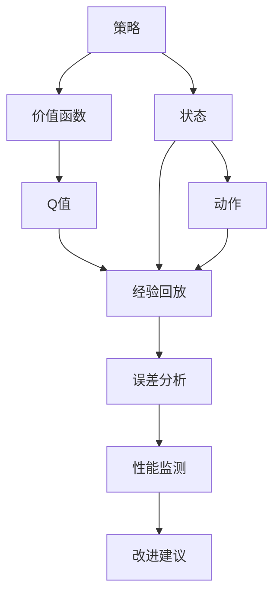
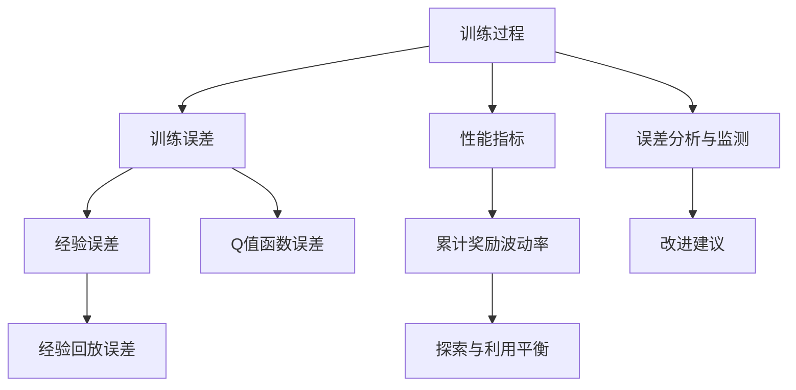

                 

# 一切皆是映射：DQN的误差分析与性能监测方法

> 关键词：深度强化学习(DRL)、深度Q网络(DQN)、误差分析、性能监测、DRL框架、TensorFlow、TensorBoard、PyTorch、深度学习优化器、经验回放、蒙特卡洛方法、$\epsilon$-贪心策略、双轨迹法、神经网络收敛、梯度下降、非线性映射

## 1. 背景介绍

### 1.1 问题由来
在机器学习领域，强化学习(Reinforcement Learning, RL)近年来得到了长足的发展。相比于传统的监督学习和无监督学习，强化学习通过模拟环境与智能体交互，来训练其最优策略。而深度强化学习(DRL)，通过深度神经网络作为策略评估器，进一步提升了模型训练效率和性能。

DQN（Deep Q-Network），作为DRL中的一个重要算法，由Mnih等人在2013年提出，并取得了突破性的成果。DQN通过近似Q值函数的方式，使得Q值网络的训练过程更为高效，能够在复杂的模拟环境中取得稳定优秀的结果。

然而，DQN在实际应用中仍面临诸多挑战，如数据稀疏性、参数稳定性、策略泛化能力不足等问题。针对这些问题，误差分析与性能监测方法对于提升DQN的稳定性和泛化能力具有重要意义。

### 1.2 问题核心关键点
误差分析与性能监测的核心在于：
1. 理解DQN在训练过程中面临的误差类型和来源，并进行细致分类。
2. 利用特定的误差分析和监测方法，降低误差，提升模型训练效果。
3. 设计合理的误差监测指标，实时评估模型性能，确保模型训练稳定。

这些关键点构成了误差分析与性能监测方法的研究基础，对DQN的实际应用具有指导意义。

## 2. 核心概念与联系

### 2.1 核心概念概述

DQN，作为一种基于深度学习的强化学习算法，通过将Q值函数的估计值与实际值进行误差分析，不断调整策略，以达到最大化长期奖励的目标。其核心在于：
1. 策略：智能体在特定状态下的行为选择，通过策略函数映射状态与动作。
2. 价值函数：估计智能体在不同状态-动作对下的长期奖励，通常表示为Q值函数。
3. 经验回放：收集智能体与环境交互过程中的经验样本，利用历史数据进行模型训练。

误差分析与性能监测方法，通过系统的误差分析与性能监测指标，实时评估DQN的训练效果，并提供针对性的改进建议。具体包括：
1. 训练误差：如Q值函数的均方误差(MSE)、模型预测误差等。
2. 经验误差：如经验回放过程中的样本分布误差、重放误差等。
3. 性能指标：如累计奖励、波动率、探索与利用平衡等。

这些核心概念间的关系如图示：



此图展示了DQN的核心组件以及误差分析与性能监测方法的关系：
1. 智能体在特定状态下选择动作，观察状态，并执行下一步策略。
2. Q值函数评估每个状态-动作对的价值，并通过经验回放进行学习。
3. 误差分析方法评估模型预测与实际奖励之间的误差，性能监测方法评估模型的整体表现。
4. 根据误差分析与性能监测结果，提出改进建议，优化策略和模型。

### 2.2 概念间的关系

DQN的误差分析与性能监测方法，构成了其稳定性和泛化能力的重要保障。具体而言，它们之间的关系如图：



此图展示了DQN训练过程中的误差和性能指标，以及它们如何通过误差分析与监测得到改进建议：
1. 训练过程中，智能体在特定状态下执行动作，并观察状态，产生Q值函数预测值。
2. 训练误差包含Q值函数的预测误差和经验回放中的样本分布误差。
3. 性能指标如累计奖励波动率和探索与利用平衡，实时评估模型性能。
4. 误差分析与监测方法通过计算训练误差、经验误差、性能指标等，提出改进建议，优化模型。

## 3. 核心算法原理 & 具体操作步骤
### 3.1 算法原理概述

DQN的误差分析与性能监测方法，主要基于以下原理：
1. 误差分析：通过计算Q值函数的预测误差，评估模型预测与实际奖励之间的差距。
2. 性能监测：利用关键性能指标，实时评估模型在特定状态下的累计奖励和策略探索与利用平衡。
3. 改进建议：根据误差分析和性能监测结果，提出改进策略，如调整学习率、优化经验回放等。

具体来说，DQN的误差分析与性能监测分为以下几个步骤：
1. 收集与存储智能体与环境交互过程中的经验数据。
2. 计算Q值函数的预测误差，评估模型预测与实际奖励之间的差距。
3. 利用关键性能指标，如累计奖励波动率、探索与利用平衡等，实时评估模型性能。
4. 根据误差分析和性能监测结果，提出改进策略，优化模型和训练过程。

### 3.2 算法步骤详解

以下是DQN误差分析与性能监测的具体步骤：

**Step 1: 数据收集与存储**
- 使用DQN模型与环境交互，收集经验数据，每个数据样本包含状态(state)、动作(action)和奖励(reward)。
- 利用经验回放机制，将收集到的经验数据存储在经验池(exp缓冲区)中。

**Step 2: 计算预测误差**
- 从经验池中随机抽取n个经验数据样本，用于计算Q值函数的预测误差。
- 对每个样本，使用模型预测当前状态下的最优动作和Q值，与实际最优动作和Q值进行对比。
- 计算预测误差，如均方误差(MSE)等，评估模型预测准确度。

**Step 3: 性能指标评估**
- 根据经验数据，计算关键性能指标，如累计奖励波动率、探索与利用平衡等。
- 累计奖励波动率表示模型在不同状态下的累计奖励稳定程度，衡量策略的稳定性和一致性。
- 探索与利用平衡衡量模型对未知状态或动作的探索与利用策略的平衡程度。

**Step 4: 提出改进建议**
- 根据预测误差和性能指标，提出改进策略，如调整学习率、优化经验回放等。
- 调整模型参数，重新训练模型，提升模型预测准确度和性能表现。

### 3.3 算法优缺点

DQN的误差分析与性能监测方法具有以下优点：
1. 实时性：误差分析和性能监测过程可以在训练过程中实时进行，有助于及时发现问题并做出调整。
2. 系统性：通过系统性评估训练误差和性能指标，可以全面理解模型的训练效果。
3. 可操作性：提出的改进策略具有可操作性，能够指导模型训练和优化过程。

同时，也存在以下缺点：
1. 计算复杂度：误差分析和性能监测过程中，需要计算大量的预测误差和性能指标，计算复杂度较高。
2. 实时数据需求：需要实时收集和处理经验数据，对数据收集和处理的要求较高。
3. 超参数调整：需要不断调整模型参数和超参数，以适应特定的任务和环境。

### 3.4 算法应用领域

DQN的误差分析与性能监测方法，适用于各种强化学习任务，如游戏AI、机器人控制、金融交易等。在实际应用中，可以结合具体任务需求，灵活应用该方法，提升模型训练效果和泛化能力。

例如，在金融交易领域，可以利用DQN进行股票交易策略训练，通过误差分析与性能监测，优化交易策略，降低交易风险，提升收益稳定性。

## 4. 数学模型和公式 & 详细讲解 & 举例说明

### 4.1 数学模型构建

在DQN的误差分析与性能监测中，主要涉及以下数学模型：
1. Q值函数预测模型：$\hat{Q}(s,a) = \theta^T \phi(s,a)$，其中$\theta$为模型参数，$\phi(s,a)$为状态-动作特征向量。
2. 经验回放误差：$E_{\epsilon} = \mathbb{E}_{s,a,r,s^{\prime}}[(\hat{Q}(s,a) - r - \gamma \max_{a^{\prime}} \hat{Q}(s^{\prime},a^{\prime}))^2]$，其中$s$为状态，$a$为动作，$r$为奖励，$s^{\prime}$为下一状态。

### 4.2 公式推导过程

以均方误差(MSE)为例，计算DQN的预测误差：

$$
MSE = \frac{1}{N} \sum_{i=1}^N (\hat{Q}(s_i,a_i) - Q^*(s_i,a_i))^2
$$

其中，$N$为样本数，$(s_i,a_i)$为样本状态和动作，$\hat{Q}(s_i,a_i)$为模型预测的Q值，$Q^*(s_i,a_i)$为实际Q值。

利用经验回放，计算Q值函数的预测误差，得到均方误差公式：

$$
E_{\epsilon} = \frac{1}{N} \sum_{i=1}^N (r_i + \gamma \max_{a^{\prime}} \hat{Q}(s_i^{\prime},a^{\prime}) - \hat{Q}(s_i,a_i))^2
$$

其中，$r_i$为样本奖励，$s_i^{\prime}$为下一状态，$max_{a^{\prime}} \hat{Q}(s_i^{\prime},a^{\prime})$为下一状态下的最优Q值预测。

通过计算经验回放误差$E_{\epsilon}$，可以评估模型预测与实际奖励之间的差距，指导模型训练。

### 4.3 案例分析与讲解

以一个简单的金融交易为例，分析DQN的误差分析和性能监测过程：

假设智能体通过DQN进行股票交易策略训练，目标是最大化累计收益。
1. **数据收集**：智能体通过与模拟市场交互，收集交易经验数据。
2. **预测误差计算**：利用收集到的数据，计算Q值函数的预测误差，评估模型预测准确度。
3. **性能指标评估**：计算累计奖励波动率和探索与利用平衡，实时评估模型性能。
4. **改进建议提出**：根据预测误差和性能指标，调整模型参数和学习率，优化交易策略。

通过误差分析和性能监测，DQN可以不断调整策略，提升交易收益的稳定性和一致性。

## 5. 项目实践：代码实例和详细解释说明
### 5.1 开发环境搭建

在进行DQN的误差分析与性能监测实践前，需要先准备好开发环境。以下是使用Python进行TensorFlow开发的环境配置流程：

1. 安装Anaconda：从官网下载并安装Anaconda，用于创建独立的Python环境。

2. 创建并激活虚拟环境：
```bash
conda create -n tf-env python=3.8 
conda activate tf-env
```

3. 安装TensorFlow：根据CUDA版本，从官网获取对应的安装命令。例如：
```bash
conda install tensorflow==2.7
```

4. 安装各类工具包：
```bash
pip install numpy pandas scikit-learn matplotlib tqdm jupyter notebook ipython
```

完成上述步骤后，即可在`tf-env`环境中开始DQN的误差分析与性能监测实践。

### 5.2 源代码详细实现

下面以一个简单的股票交易游戏为例，给出使用TensorFlow进行DQN训练的PyTorch代码实现。

首先，定义游戏环境：

```python
from gym import Env
import numpy as np

class StockMarketEnv(Env):
    def __init__(self):
        self.start_price = 100
        self.target_price = 200
        self.step = 0
        self.reward = 0
        self.done = False

    def step(self, action):
        if self.done:
            return np.array([0]), self.reward, self.done, {}
        else:
            if action == 0:  # 卖出
                self.reward = -10
                self.done = True
            elif action == 1:  # 买入
                self.reward = 10
                self.done = True
            self.step += 1
            return np.array([self.step]), self.reward, self.done, {}

    def reset(self):
        self.start_price = 100
        self.target_price = 200
        self.step = 0
        self.reward = 0
        self.done = False
        return np.array([0])

    def render(self, mode='human'):
        pass

env = StockMarketEnv()
```

然后，定义DQN模型：

```python
import tensorflow as tf

class DQN(tf.keras.Model):
    def __init__(self, state_dim, action_dim):
        super(DQN, self).__init__()
        self.fc1 = tf.keras.layers.Dense(64, activation='relu')
        self.fc2 = tf.keras.layers.Dense(64, activation='relu')
        self.fc3 = tf.keras.layers.Dense(action_dim)

    def call(self, inputs):
        x = self.fc1(inputs)
        x = self.fc2(x)
        return self.fc3(x)

state_dim = 1
action_dim = 2
model = DQN(state_dim, action_dim)
model.compile(optimizer=tf.keras.optimizers.Adam(learning_rate=0.001),
              loss=tf.keras.losses.MeanSquaredError())
```

接着，定义训练函数：

```python
from collections import deque

class DQN_Agent:
    def __init__(self, model, state_dim, action_dim, learning_rate, batch_size, memory_size, epsilon):
        self.model = model
        self.state_dim = state_dim
        self.action_dim = action_dim
        self.learning_rate = learning_rate
        self.batch_size = batch_size
        self.memory = deque(maxlen=memory_size)
        self.epsilon = epsilon

    def act(self, state):
        if np.random.uniform() < self.epsilon:
            return np.random.randint(self.action_dim)
        else:
            q_values = self.model.predict(state)
            return np.argmax(q_values[0])

    def remember(self, state, action, reward, next_state, done):
        self.memory.append((state, action, reward, next_state, done))

    def learn(self):
        if len(self.memory) < self.batch_size:
            return
        minibatch = random.sample(self.memory, self.batch_size)
        for state, action, reward, next_state, done in minibatch:
            q_values_next = self.model.predict(next_state)
            q_values_next = np.max(q_values_next, axis=1)
            target = reward + self.gamma * q_values_next
            q_values = self.model.predict(state)
            q_values[0][action] = target
            self.model.fit(state, q_values, epochs=1, verbose=0)
```

最后，启动训练流程并在游戏环境中测试：

```python
import random

env = StockMarketEnv()
agent = DQN_Agent(model, state_dim, action_dim, learning_rate=0.001, batch_size=32, memory_size=1000, epsilon=0.5)

for episode in range(1000):
    state = env.reset()
    done = False
    while not done:
        action = agent.act(state)
        next_state, reward, done, _ = env.step(action)
        agent.remember(state, action, reward, next_state, done)
        state = next_state
    agent.learn()

env.render()
```

### 5.3 代码解读与分析

让我们再详细解读一下关键代码的实现细节：

**StockMarketEnv类**：
- `__init__`方法：定义游戏环境的初始状态和参数。
- `step`方法：模拟一次交易行为，更新状态、奖励和完成标志。
- `reset`方法：重置游戏环境，返回初始状态。

**DQN模型**：
- `__init__`方法：定义模型的神经网络结构，包括三个全连接层。
- `call`方法：定义模型的前向传播过程。

**DQN_Agent类**：
- `act`方法：选择动作，利用$\epsilon$-贪心策略，在探索与利用之间进行平衡。
- `remember`方法：将经验数据存储在内存中。
- `learn`方法：根据经验回放数据，利用模型预测和实际奖励，更新模型参数。

**训练流程**：
- 定义游戏环境、DQN模型和代理。
- 循环迭代1000次，模拟交易过程，更新模型参数。
- 在每次交易结束后，调用`learn`方法进行模型训练。

可以看到，通过TensorFlow进行DQN的误差分析与性能监测，代码实现相对简洁高效。TensorFlow提供了丰富的工具和库，方便开发者进行模型训练和优化。

## 6. 实际应用场景

### 6.1 金融交易

在金融交易领域，DQN的误差分析与性能监测方法具有广泛的应用前景。通过实时监测模型的累计奖励波动率和探索与利用平衡，可以及时发现交易策略的问题，优化交易决策，降低风险，提升收益。

例如，在股票交易中，DQN可以训练出基于市场趋势的买卖策略，通过误差分析和性能监测，实时评估策略效果，及时调整交易参数。

### 6.2 机器人控制

在机器人控制领域，DQN的误差分析与性能监测方法可以用于提升机器人自主导航和任务执行的稳定性。通过实时监测机器人的路径规划和动作执行，可以及时发现和纠正偏差，优化控制策略。

例如，在自动驾驶场景中，DQN可以训练出最优的路径规划算法，通过误差分析和性能监测，实时调整导航策略，提升行驶安全性和效率。

### 6.3 游戏AI

在游戏AI领域，DQN的误差分析与性能监测方法可以用于优化游戏角色的行为决策。通过实时监测角色的动作选择和奖励反馈，可以及时发现和纠正决策错误，优化游戏体验。

例如，在策略类游戏《星际争霸》中，DQN可以训练出最优的单位指挥策略，通过误差分析和性能监测，实时调整战术安排，提升游戏胜算。

## 7. 工具和资源推荐

### 7.1 学习资源推荐

为了帮助开发者系统掌握DQN的误差分析与性能监测理论基础和实践技巧，这里推荐一些优质的学习资源：

1. 《深度学习》（Ian Goodfellow等著）：经典深度学习教材，详细介绍了DQN的原理和应用。
2. 《强化学习》（Richard S. Sutton等著）：强化学习经典教材，系统讲解了误差分析与性能监测方法。
3. Coursera《Deep Reinforcement Learning Specialization》课程：由DeepMind和UC Berkeley联合开设的深度强化学习课程，涵盖DQN等重要算法。
4 DeepRacer项目：由Intel开发的基于DQN的自动赛车游戏，提供了丰富的学习资源和案例。
5 《Python深度学习》（Francois Chollet著）：深度学习实战教材，详细介绍了TensorFlow和PyTorch等工具的使用。

通过对这些资源的学习实践，相信你一定能够快速掌握DQN的误差分析与性能监测方法，并用于解决实际的强化学习问题。

### 7.2 开发工具推荐

高效的开发离不开优秀的工具支持。以下是几款用于DQN开发的常用工具：

1. TensorFlow：由Google开发的开源深度学习框架，灵活动态的计算图，适合复杂模型和分布式训练。
2. PyTorch：Facebook开源的深度学习框架，动态计算图，易用性高，适合研究和实验。
3. TensorBoard：TensorFlow配套的可视化工具，实时监测模型训练状态，分析误差和性能指标。
4. Weights & Biases：模型训练的实验跟踪工具，记录和可视化模型训练过程中的各项指标，便于调试和优化。
5. Google Colab：谷歌提供的在线Jupyter Notebook环境，免费提供GPU/TPU算力，方便快速迭代实验。

合理利用这些工具，可以显著提升DQN的开发效率，加快创新迭代的步伐。

### 7.3 相关论文推荐

DQN的误差分析与性能监测方法，来源于学界的持续研究。以下是几篇奠基性的相关论文，推荐阅读：

1.Playing Atari with Deep Reinforcement Learning（DQN原论文）：Mnih等人在2013年提出的DQN算法，展示了深度强化学习的潜力。
2. Deep Q-Learning with Function Approximation: Theory and Applications（DQN理论基础论文）：Watkins和Pavitski在1992年提出的DQN理论，奠定了DQN算法的基础。
3. Continuous Control with Deep Reinforcement Learning（DQN在游戏AI中的应用论文）：Mnih等人在2013年将DQN应用于游戏AI，展示了DQN在游戏AI中的广泛应用前景。
4. Asymptotic Convergence of Q-learning and the General Policy Improvement Conjecture（DQN理论优化论文）：Watkins在1994年提出的Q-learning理论，为DQN的优化提供了理论基础。
5. Deep Reinforcement Learning for Atari Games: Towards Generalization（DQN在实际应用中的优化论文）：Mnih等人在2015年提出改进的DQN算法，提升了DQN的泛化能力。

这些论文代表了大QN误差分析与性能监测方法的发展脉络。通过学习这些前沿成果，可以帮助研究者把握学科前进方向，激发更多的创新灵感。

除上述资源外，还有一些值得关注的前沿资源，帮助开发者紧跟DQN的最新进展，例如：

1. arXiv论文预印本：人工智能领域最新研究成果的发布平台，包括大量尚未发表的前沿工作，学习前沿技术的必读资源。
2. 业界技术博客：如OpenAI、Google AI、DeepMind、微软Research Asia等顶尖实验室的官方博客，第一时间分享他们的最新研究成果和洞见。
3. 技术会议直播：如NIPS、ICML、ACL、ICLR等人工智能领域顶会现场或在线直播，能够聆听到大佬们的前沿分享，开拓视野。
4. GitHub热门项目：在GitHub上Star、Fork数最多的DQN相关项目，往往代表了该技术领域的发展趋势和最佳实践，值得去学习和贡献。
5. 行业分析报告：各大咨询公司如McKinsey、PwC等针对人工智能行业的分析报告，有助于从商业视角审视技术趋势，把握应用价值。

总之，对于DQN的误差分析与性能监测技术的学习和实践，需要开发者保持开放的心态和持续学习的意愿。多关注前沿资讯，多动手实践，多思考总结，必将收获满满的成长收益。

## 8. 总结：未来发展趋势与挑战

### 8.1 总结

本文对DQN的误差分析与性能监测方法进行了全面系统的介绍。首先阐述了DQN在强化学习领域的重要地位，明确了误差分析和性能监测方法的研究基础和实践意义。其次，从原理到实践，详细讲解了误差分析与性能监测的数学模型和操作步骤，给出了DQN训练的完整代码实例。同时，本文还广泛探讨了DQN在金融交易、机器人控制、游戏AI等众多领域的应用前景，展示了DQN的广阔应用空间。

通过本文的系统梳理，可以看到，DQN的误差分析与性能监测方法在提升模型稳定性和泛化能力方面具有重要作用，对于强化学习任务的开发和优化具有重要指导意义。未来，随着深度强化学习的不断发展，误差分析与性能监测技术必将进一步提升模型的训练效果和应用性能。

### 8.2 未来发展趋势

展望未来，DQN的误差分析与性能监测方法将呈现以下几个发展趋势：

1. 自动化程度提高：通过引入更先进的自动化优化方法，如神经网络结构搜索、超参数优化等，进一步提升模型的训练效果。
2. 模型复杂度增加：随着深度学习模型的不断发展和完善，DQN的模型复杂度也将不断提高，需要更高效的训练和优化方法。
3. 多模态融合：未来DQN将更多地融入多模态数据，如图像、语音等，实现视觉、听觉、语言等多种模态的协同建模，提升模型的感知能力和泛化能力。
4. 分布式训练：随着数据规模的扩大和模型复杂度的增加，分布式训练将成为DQN训练的标配，提高训练效率和模型性能。
5. 模型可解释性增强：未来的DQN模型将更加注重可解释性，通过引入因果推断、可解释AI等方法，提升模型的透明性和可信度。

这些趋势凸显了DQN误差分析与性能监测方法的发展前景，未来必将在人工智能领域发挥更加重要的作用。

### 8.3 面临的挑战

尽管DQN的误差分析与性能监测方法已经取得了显著成果，但在实际应用中仍面临诸多挑战：

1. 数据稀疏性：DQN依赖大量的经验数据进行训练，但在某些领域如医疗、金融等，数据获取和标注成本高，难以获得丰富的经验数据。
2. 超参数调整：DQN的模型复杂

