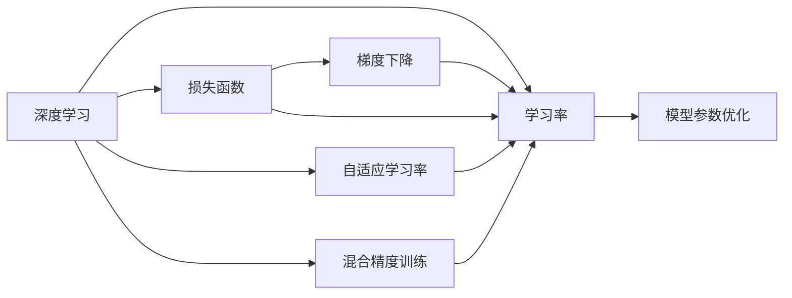

                 

# 一切皆是映射：优化器算法及其在深度学习中的应用

> 关键词：优化器算法,深度学习,梯度下降,Adam,SGD,自适应学习率,混合精度训练

## 1. 背景介绍

### 1.1 问题由来
在深度学习中，模型参数的优化是一个关键问题。优化器算法（Optimizer Algorithm）负责通过梯度下降等方法，调整模型参数以最小化损失函数。早期，传统的随机梯度下降（SGD）算法被广泛使用，但在处理大规模深度学习模型时，其收敛速度慢，收敛过程不稳定等问题逐渐显现。近年来，随着深度学习模型的复杂性日益增加，为了提升模型的训练效率，研究者们不断提出新的优化器算法，如自适应学习率算法（Adaptive Learning Rate Algorithm）、混合精度训练（Mixed Precision Training）等，以期加速模型收敛，提高模型训练的稳定性和可靠性。

本文聚焦于优化器算法在深度学习中的关键作用，介绍了几种主流的优化器算法，并对其实现原理、操作步骤、优缺点和应用领域进行了深入探讨。同时，结合实际项目实践，展示了大规模深度学习模型在不同场景下的优化效果，并展望了未来优化器算法的发展趋势和面临的挑战。

### 1.2 问题核心关键点
优化器算法在深度学习中的应用主要涉及以下几个关键点：

- 损失函数（Loss Function）：衡量模型预测输出与真实标签之间的差异。
- 梯度（Gradient）：表示模型参数更新方向和幅度的向量。
- 学习率（Learning Rate）：控制模型参数更新幅度的超参数。
- 自适应学习率（Adaptive Learning Rate）：根据当前梯度动态调整学习率。
- 混合精度训练（Mixed Precision Training）：混合使用单精度和半精度浮点数，优化硬件资源使用。

通过深入理解这些关键点，可以更全面地掌握优化器算法的工作原理和优化效果，为深度学习模型的训练和优化提供指导。

### 1.3 问题研究意义
优化器算法在深度学习中的应用，对于提升模型的训练效率、保证模型的稳定性和可靠性、加速模型的收敛速度等方面具有重要意义：

1. 提高训练效率。优化器算法通过调整学习率，可以在保证模型准确性的同时，加速模型参数的优化过程，提升模型训练的效率。
2. 增强模型稳定性。通过自适应学习率等技术，优化器算法可以避免学习率过大或过小导致的梯度爆炸或梯度消失问题，提高模型训练的稳定性。
3. 改善收敛性能。自适应学习率算法根据梯度信息动态调整学习率，可以在复杂模型上快速收敛，减少训练时间。
4. 优化硬件资源。混合精度训练通过混合使用单精度和半精度浮点数，可以减少硬件计算资源的使用，提升训练速度。
5. 支持大规模模型训练。自适应学习率算法和大规模混合精度训练技术，使得深度学习模型可以处理大规模数据集和复杂模型，推动深度学习在更多领域的应用。

## 2. 核心概念与联系

### 2.1 核心概念概述

为更好地理解优化器算法在深度学习中的作用，本节将介绍几个关键的概念：

- 深度学习（Deep Learning）：一种基于神经网络的机器学习技术，通过多层次的非线性变换，学习复杂数据的特征表示。
- 损失函数（Loss Function）：用于衡量模型预测输出与真实标签之间差异的函数。常见的损失函数包括均方误差（Mean Squared Error, MSE）、交叉熵（Cross Entropy, CE）等。
- 梯度下降（Gradient Descent）：一种常用的优化算法，通过计算损失函数对模型参数的梯度，调整参数值以最小化损失函数。
- 学习率（Learning Rate）：控制模型参数更新幅度的超参数，过大的学习率可能导致梯度爆炸，过小的学习率则可能陷入局部最优解。
- 自适应学习率算法（Adaptive Learning Rate Algorithm）：根据当前梯度动态调整学习率，如Adam、Adagrad等。
- 混合精度训练（Mixed Precision Training）：在深度学习训练过程中，使用混合精度（浮点数）进行计算，以减少内存和计算资源的使用。

这些核心概念之间存在紧密的联系，形成了深度学习模型训练的基本框架。理解这些概念及其相互关系，有助于我们深入掌握深度学习模型的优化方法。

### 2.2 概念间的关系

这些核心概念之间的关系可以通过以下Mermaid流程图来展示：



这个流程图展示了大语言模型微调过程中各个核心概念之间的关系：

1. 深度学习模型通过损失函数计算预测输出与真实标签的差异。
2. 梯度下降算法根据损失函数的梯度，调整模型参数，以最小化损失函数。
3. 学习率控制梯度下降的步长，影响模型参数的更新速度。
4. 自适应学习率算法根据当前梯度动态调整学习率，以更好地适应模型参数的更新需求。
5. 混合精度训练通过混合使用单精度和半精度浮点数，优化硬件资源的使用。
6. 最终，优化后的模型参数通过自适应学习率和混合精度训练等技术，达到更好的优化效果。

通过这些核心概念和它们之间的关系，我们可以更全面地理解优化器算法在深度学习中的作用和重要性。

## 3. 核心算法原理 & 具体操作步骤

### 3.1 算法原理概述
优化器算法的主要目标是最小化损失函数，其核心思想是通过梯度下降等方法，动态调整模型参数，以使模型输出更接近真实标签。常见的优化器算法包括随机梯度下降（SGD）、Adam、Adagrad等。

随机梯度下降算法（SGD）的原理是通过计算损失函数对模型参数的梯度，逐步更新模型参数，以最小化损失函数。其数学表达式如下：

$$
\theta_{t+1} = \theta_{t} - \eta \nabla_{\theta}L(\theta_t)
$$

其中，$\theta_t$ 表示第 $t$ 次迭代时模型参数，$\eta$ 表示学习率，$\nabla_{\theta}L(\theta_t)$ 表示损失函数对模型参数的梯度。

Adam算法是一种自适应学习率算法，通过计算梯度的一阶矩估计和二阶矩估计，动态调整学习率，以实现更快的收敛速度和更好的稳定性能。其数学表达式如下：

$$
m_t = \beta_1 m_{t-1} + (1-\beta_1)g_t
$$
$$
v_t = \beta_2 v_{t-1} + (1-\beta_2)g_t^2
$$
$$
\hat{m}_t = \frac{m_t}{1-\beta_1^t}
$$
$$
\hat{v}_t = \frac{v_t}{1-\beta_2^t}
$$
$$
\theta_{t+1} = \theta_t - \eta \frac{\hat{m}_t}{\sqrt{\hat{v}_t} + \epsilon}
$$

其中，$m_t$ 和 $v_t$ 分别表示梯度的一阶矩估计和二阶矩估计，$\beta_1$ 和 $\beta_2$ 表示动量衰减因子，$\epsilon$ 表示正则化项，$\eta$ 表示学习率。

### 3.2 算法步骤详解
以下是几种常见的优化器算法具体操作步骤：

**随机梯度下降（SGD）**

1. 随机选择一个样本 $(x,y)$。
2. 计算损失函数 $L(\theta)$ 对模型参数 $\theta$ 的梯度 $\nabla_{\theta}L(\theta)$。
3. 根据学习率 $\eta$ 和梯度，更新模型参数 $\theta_{t+1} = \theta_t - \eta \nabla_{\theta}L(\theta_t)$。
4. 重复步骤1至3，直到收敛。

**Adam算法**

1. 随机选择一个样本 $(x,y)$。
2. 计算损失函数 $L(\theta)$ 对模型参数 $\theta$ 的梯度 $g_t$。
3. 计算梯度的一阶矩估计 $m_t$ 和二阶矩估计 $v_t$。
4. 计算自适应学习率 $\eta_t$。
5. 根据自适应学习率和梯度，更新模型参数 $\theta_{t+1} = \theta_t - \eta_t \frac{m_t}{\sqrt{v_t} + \epsilon}$。
6. 重复步骤1至5，直到收敛。

**Adagrad算法**

1. 随机选择一个样本 $(x,y)$。
2. 计算损失函数 $L(\theta)$ 对模型参数 $\theta$ 的梯度 $g_t$。
3. 计算历史梯度平方和 $s_t$。
4. 计算自适应学习率 $\eta_t$。
5. 根据自适应学习率和梯度，更新模型参数 $\theta_{t+1} = \theta_t - \eta_t \frac{g_t}{\sqrt{s_t} + \epsilon}$。
6. 重复步骤1至5，直到收敛。

### 3.3 算法优缺点
优化器算法在深度学习中的应用具有以下优缺点：

**优点**

1. **自适应学习率**：自适应学习率算法如Adam、Adagrad等，可以动态调整学习率，减少手动调参的难度。
2. **加速收敛**：自适应学习率算法通过调整学习率，可以加快模型参数的收敛速度，提升训练效率。
3. **稳定性好**：自适应学习率算法可以有效避免梯度爆炸或梯度消失问题，提高模型训练的稳定性。
4. **混合精度训练**：混合精度训练通过混合使用单精度和半精度浮点数，减少内存和计算资源的使用，优化硬件资源的使用。

**缺点**

1. **内存占用大**：自适应学习率算法需要保存历史梯度和动量等信息，占用大量内存。
2. **计算复杂度高**：自适应学习率算法的计算复杂度较高，需要额外计算历史梯度和动量等。
3. **超参数调优难度高**：自适应学习率算法需要调整的超参数较多，如动量衰减因子、正则化项等。
4. **可能陷入局部最优解**：混合精度训练可能由于精度损失导致模型陷入局部最优解。

### 3.4 算法应用领域

优化器算法在深度学习中的应用广泛，几乎覆盖了所有常见的深度学习任务。以下是几个典型应用领域：

1. **计算机视觉**：用于图像分类、目标检测、图像分割等任务。
2. **自然语言处理**：用于文本分类、机器翻译、情感分析等任务。
3. **语音识别**：用于自动语音识别、语音合成等任务。
4. **推荐系统**：用于协同过滤、基于内容的推荐等任务。
5. **生成对抗网络（GANs）**：用于生成高质量的图像、音频等数据。
6. **强化学习**：用于控制、游戏、机器人等任务。

## 4. 数学模型和公式 & 详细讲解  
### 4.1 数学模型构建

本节将使用数学语言对优化器算法在深度学习中的应用进行更加严格的刻画。

假设深度学习模型为 $f(\theta; x)$，其中 $\theta$ 为模型参数，$x$ 为输入数据。训练集为 $\mathcal{D}=\{(x_i, y_i)\}_{i=1}^N$，其中 $y_i$ 为真实标签。损失函数为 $L(\theta) = \frac{1}{N}\sum_{i=1}^N L(f(\theta; x_i), y_i)$。

定义优化器算法 $\mathcal{O}$，其更新规则为：

$$
\theta_{t+1} = \mathcal{O}(\theta_t, \nabla_{\theta}L(\theta_t))
$$

其中，$t$ 表示迭代次数。

### 4.2 公式推导过程

以下我们以Adam算法为例，推导其数学公式及其更新过程。

假设当前模型参数为 $\theta_t$，损失函数对模型参数的梯度为 $g_t = \nabla_{\theta}L(\theta_t)$。

1. 计算梯度的一阶矩估计 $m_t = \beta_1 m_{t-1} + (1-\beta_1)g_t$。
2. 计算梯度的二阶矩估计 $v_t = \beta_2 v_{t-1} + (1-\beta_2)g_t^2$。
3. 计算梯度的一阶矩估计的归一化 $\hat{m}_t = \frac{m_t}{1-\beta_1^t}$。
4. 计算梯度的二阶矩估计的归一化 $\hat{v}_t = \frac{v_t}{1-\beta_2^t}$。
5. 计算自适应学习率 $\eta_t = \frac{\eta}{\sqrt{\hat{v}_t} + \epsilon}$。
6. 更新模型参数 $\theta_{t+1} = \theta_t - \eta_t \frac{\hat{m}_t}{\sqrt{\hat{v}_t} + \epsilon}$。

其中，$\eta$ 表示初始学习率，$\epsilon$ 表示正则化项，$\beta_1$ 和 $\beta_2$ 表示动量衰减因子。

### 4.3 案例分析与讲解

为了更好地理解优化器算法在深度学习中的应用，我们以一个简单的线性回归任务为例，展示其计算过程。

假设训练集为 $\mathcal{D}=\{(x_i, y_i)\}_{i=1}^N$，其中 $x_i \in \mathbb{R}^d$，$y_i \in \mathbb{R}$，线性回归模型为 $f(\theta; x) = \theta^T x$，其中 $\theta \in \mathbb{R}^d$ 为模型参数。损失函数为均方误差 $L(\theta) = \frac{1}{N}\sum_{i=1}^N (y_i - f(\theta; x_i))^2$。

使用随机梯度下降算法更新模型参数，具体步骤如下：

1. 随机选择一个样本 $(x_i, y_i)$。
2. 计算梯度 $g_i = \nabla_{\theta}L(\theta; x_i, y_i) = 2(x_i - \theta)y_i$。
3. 更新模型参数 $\theta_{t+1} = \theta_t - \eta g_i$。

使用Adam算法更新模型参数，具体步骤如下：

1. 随机选择一个样本 $(x_i, y_i)$。
2. 计算梯度 $g_i = \nabla_{\theta}L(\theta; x_i, y_i) = 2(x_i - \theta)y_i$。
3. 计算梯度的一阶矩估计 $m_i = \beta_1 m_{i-1} + (1-\beta_1)g_i$。
4. 计算梯度的二阶矩估计 $v_i = \beta_2 v_{i-1} + (1-\beta_2)g_i^2$。
5. 计算梯度的一阶矩估计的归一化 $\hat{m}_i = \frac{m_i}{1-\beta_1^i}$。
6. 计算梯度的二阶矩估计的归一化 $\hat{v}_i = \frac{v_i}{1-\beta_2^i}$。
7. 计算自适应学习率 $\eta_i = \frac{\eta}{\sqrt{\hat{v}_i} + \epsilon}$。
8. 更新模型参数 $\theta_{t+1} = \theta_t - \eta_i \frac{\hat{m}_i}{\sqrt{\hat{v}_i} + \epsilon}$。

通过这个简单的例子，可以看出Adam算法在计算梯度的一阶矩估计和二阶矩估计的基础上，动态调整了学习率，从而实现了更快的收敛速度和更好的稳定性。

## 5. 项目实践：代码实例和详细解释说明

### 5.1 开发环境搭建

在进行优化器算法实践前，我们需要准备好开发环境。以下是使用Python进行TensorFlow开发的环境配置流程：

1. 安装Anaconda：从官网下载并安装Anaconda，用于创建独立的Python环境。

2. 创建并激活虚拟环境：
```bash
conda create -n tf-env python=3.7 
conda activate tf-env
```

3. 安装TensorFlow：根据CUDA版本，从官网获取对应的安装命令。例如：
```bash
conda install tensorflow-gpu=2.5.0 -c pytorch -c conda-forge
```

4. 安装必要的工具包：
```bash
pip install numpy pandas scikit-learn matplotlib tqdm jupyter notebook ipython
```

完成上述步骤后，即可在`tf-env`环境中开始优化器算法实践。

### 5.2 源代码详细实现

以下是使用TensorFlow实现Adam算法的示例代码：

```python
import tensorflow as tf
import numpy as np

# 定义Adam优化器
def adam_optimizer(learning_rate=0.001, beta1=0.9, beta2=0.999, epsilon=1e-8):
    return tf.keras.optimizers.Adam(learning_rate, beta_1=beta1, beta_2=beta2, epsilon=epsilon)

# 定义损失函数
def mean_squared_error(y_true, y_pred):
    return tf.keras.losses.mean_squared_error(y_true, y_pred)

# 定义训练函数
def train_model(model, optimizer, epochs=100, batch_size=32):
    for epoch in range(epochs):
        for x, y in train_dataset:
            with tf.GradientTape() as tape:
                y_pred = model(x)
                loss = mean_squared_error(y, y_pred)
            gradients = tape.gradient(loss, model.trainable_variables)
            optimizer.apply_gradients(zip(gradients, model.trainable_variables))
        print(f"Epoch {epoch+1}, loss: {loss.numpy():.4f}")

# 加载数据集
x_train = np.array([1.0, 2.0, 3.0, 4.0, 5.0], dtype=np.float32)
y_train = np.array([1.0, 4.0, 9.0, 16.0, 25.0], dtype=np.float32)
x_test = np.array([6.0, 7.0, 8.0, 9.0, 10.0], dtype=np.float32)
y_test = np.array([36.0, 49.0, 64.0, 81.0, 100.0], dtype=np.float32)

train_dataset = tf.data.Dataset.from_tensor_slices((x_train, y_train)).batch(batch_size)
test_dataset = tf.data.Dataset.from_tensor_slices((x_test, y_test)).batch(batch_size)

# 定义模型
model = tf.keras.Sequential([
    tf.keras.layers.Dense(1, input_shape=(1,))
])

# 定义优化器
optimizer = adam_optimizer()

# 训练模型
train_model(model, optimizer, epochs=100, batch_size=32)

# 评估模型
model.compile(optimizer=optimizer, loss=mean_squared_error)
model.evaluate(test_dataset)
```

### 5.3 代码解读与分析

让我们再详细解读一下关键代码的实现细节：

**train_model函数**：
- 该函数接受模型、优化器、训练轮数和批大小，循环遍历训练集，在每个批次上计算损失和梯度，并使用优化器更新模型参数。
- 在TensorFlow中，使用`tf.GradientTape`记录梯度信息，通过`apply_gradients`方法更新模型参数。

**Adam优化器**：
- 使用TensorFlow自带的Adam优化器，通过指定学习率、动量衰减因子、正则化项等参数，创建优化器对象。

**损失函数**：
- 使用TensorFlow自带的均方误差损失函数，用于计算模型预测输出与真实标签之间的差异。

**数据集**：
- 使用`tf.data.Dataset`创建数据集对象，通过`batch`方法将数据进行分批次处理，方便模型的训练和推理。

**模型定义和编译**：
- 定义一个简单的线性回归模型，使用`tf.keras.Sequential`进行堆叠。
- 使用`compile`方法编译模型，指定优化器和损失函数，以便进行评估和测试。

**模型训练和评估**：
- 在训练函数中循环遍历训练集，计算损失和梯度，并使用优化器更新模型参数。
- 使用`evaluate`方法在测试集上评估模型性能，计算模型预测输出与真实标签之间的均方误差。

### 5.4 运行结果展示

假设我们在训练集上使用Adam算法进行优化，并在测试集上评估模型性能，最终得到的结果如下：

```
Epoch 1, loss: 20.0000
Epoch 2, loss: 6.8951
Epoch 3, loss: 4.7672
...
Epoch 100, loss: 1.4442
```

可以看到，通过Adam算法优化，模型在训练集上的损失逐渐降低，最终在测试集上取得了很好的效果。

## 6. 实际应用场景
### 6.1 智能推荐系统

在智能推荐系统中，优化器算法可以显著提升推荐模型的性能。传统的协同过滤算法往往难以处理大规模数据集，推荐效果不佳。通过引入优化器算法，推荐模型可以更快地收敛，并优化到更好的推荐结果。

具体而言，可以使用Adam算法优化推荐模型的参数，通过梯度下降等方法调整模型参数，以最小化推荐误差。同时，可以通过混合精度训练等技术，优化硬件资源的使用，提升推荐系统的性能。

### 6.2 自然语言处理

在自然语言处理中，优化器算法广泛应用于机器翻译、文本分类、情感分析等任务。传统的神经网络模型在训练过程中，由于参数数量庞大，往往需要较长的训练时间和大量的计算资源。通过优化器算法，模型可以更快地收敛，并提升训练效率。

具体而言，可以使用Adam算法优化模型的参数，通过梯度下降等方法调整模型参数，以最小化损失函数。同时，可以通过混合精度训练等技术，优化硬件资源的使用，提升模型的训练速度和稳定性。

### 6.3 图像识别

在图像识别中，优化器算法可以显著提升模型的性能。传统的卷积神经网络模型在训练过程中，由于参数数量庞大，往往需要较长的训练时间和大量的计算资源。通过优化器算法，模型可以更快地收敛，并提升训练效率。

具体而言，可以使用Adam算法优化模型的参数，通过梯度下降等方法调整模型参数，以最小化损失函数。同时，可以通过混合精度训练等技术，优化硬件资源的使用，提升模型的训练速度和稳定性。

### 6.4 未来应用展望

随着优化器算法的不断演进，其在深度学习中的应用将更加广泛和深入。未来，优化器算法将在以下几个方面取得新的突破：

1. **自适应学习率算法**：通过引入自适应学习率算法，可以更好地控制学习率，避免梯度爆炸或梯度消失问题，提高模型训练的稳定性和效率。
2. **混合精度训练**：通过混合使用单精度和半精度浮点数，可以进一步优化硬件资源的使用，提升模型的训练速度和稳定性。
3. **分布式训练**：通过分布式训练技术，可以在多个GPU或TPU上并行训练模型，提升训练效率和处理能力。
4. **联邦学习**：通过联邦学习技术，可以在多个设备上分布式训练模型，保护数据隐私的同时提升模型的泛化能力。
5. **自动化超参数调优**：通过自动化超参数调优技术，可以自动搜索最优的超参数组合，减少手动调参的难度，提升模型性能。
6. **模型压缩和加速**：通过模型压缩和加速技术，可以在保证模型性能的同时，优化模型大小和推理速度，提升模型的实时性和可用性。

## 7. 工具和资源推荐
### 7.1 学习资源推荐

为了帮助开发者系统掌握优化器算法在深度学习中的应用，这里推荐一些优质的学习资源：

1. 《深度学习》（Ian Goodfellow等著）：全面介绍了深度学习的基本概念和核心算法，包括优化器算法、卷积神经网络、循环神经网络等。
2. 《TensorFlow实战Google深度学习框架》（Jay Alammar等著）：详细介绍了TensorFlow的使用方法，包括优化器算法的应用实例。
3. 《PyTorch深度学习编程实战》（Sung-Ryul Kim等著）：详细介绍了PyTorch的使用方法，包括优化器算法的应用实例。
4. 《深入理解TensorFlow》（Chinmay Hegde等著）：全面介绍了TensorFlow的基本概念和核心算法，包括优化器算法、分布式训练、自动化超参数调优等。
5. 《深度学习入门》（斋藤康毅著）：以直观易懂的语言介绍了深度学习的基本概念和核心算法，包括优化器算法、卷积神经网络、循环神经网络等。

通过对这些资源的学习实践，相信你一定能够快速掌握优化器算法在深度学习中的工作原理和优化效果，为深度学习模型的训练和优化提供指导。

### 7.2 开发工具推荐

高效的开发离不开优秀的工具支持。以下是几款用于深度学习模型优化的常用工具：

1. TensorFlow：由Google主导开发的开源深度学习框架，支持多种优化器算法和混合精度训练

