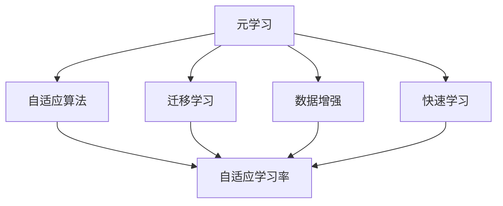
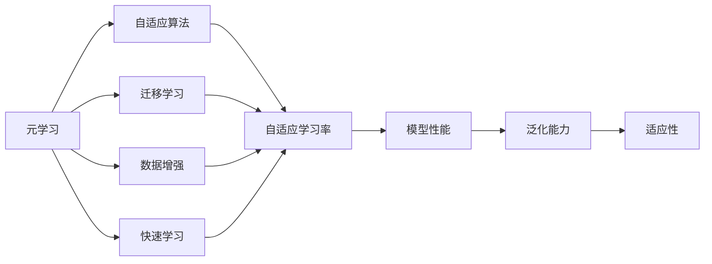
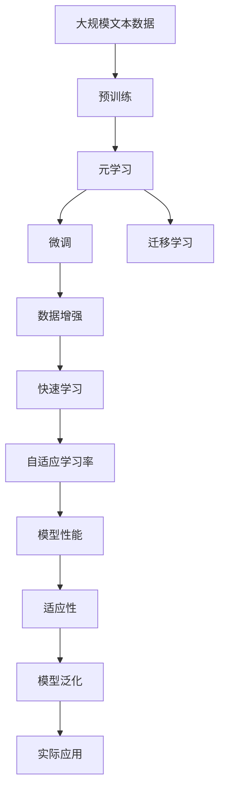

                 

# 一切皆是映射：元学习在快速适应新任务中的作用

> 关键词：元学习,适应新任务,数据效率,迁移学习,快速学习,自适应算法

## 1. 背景介绍

### 1.1 问题由来
在当今这个快速变化的时代，新的任务和挑战层出不穷。无论是自然语言处理(NLP)中的语言生成、翻译，还是计算机视觉(CV)中的图像识别、目标检测，亦或是其他领域，都需要模型具备快速适应新任务的能力。传统的训练范式往往需要大量标记数据和长时间训练，难以满足实时性和数据效率的需求。因此，如何设计一种算法，使得模型能够快速、高效地适应新任务，成为了一个重要研究课题。

### 1.2 问题核心关键点
元学习（Meta-Learning）是一种可以自动学习如何学习（Learning How to Learn）的技术，其核心思想是通过少量数据和弱监督信号，训练模型能够适应新的任务。元学习的目标是，使得模型能够在新的未见任务上，快速找到最优的初始化参数和超参数，从而获得良好的性能。元学习的关键点包括：

- **数据效率**：在有限数据情况下，仍能取得良好性能。
- **自适应性**：能够在多种任务上表现优异，而不需要重新训练。
- **灵活性**：对新任务具有较强的泛化能力。
- **可解释性**：能够提供模型学习过程的洞察。

元学习近年来在学术界和工业界都受到了广泛关注，已经被应用到各种任务中，如图像分类、目标检测、自然语言处理等。本文将深入探讨元学习的基本原理、应用领域及其优缺点，并给出实际项目中的实践案例。

### 1.3 问题研究意义
元学习的研究和应用对于提高机器学习模型的泛化能力和适应性具有重要意义。通过对模型学习过程的优化，元学习能够在少量数据和弱监督情况下，提升模型在特定任务上的表现。同时，元学习还可以用于迁移学习和零样本学习，大大降低模型对标记数据的依赖，具有更广泛的应用前景。

## 2. 核心概念与联系

### 2.1 核心概念概述

为了更好地理解元学习，本节将介绍几个核心概念及其相互关系：

- **元学习（Meta-Learning）**：一种可以自动学习如何学习的技术。通过少量数据和弱监督信号，训练模型能够适应新的任务。
- **自适应算法（Adaptive Algorithm）**：能够根据环境变化自动调整策略的算法。
- **迁移学习（Transfer Learning）**：将一个领域学到的知识，迁移到另一个不同但相关的领域。
- **数据增强（Data Augmentation）**：通过对数据进行变换和扩充，提升模型对新数据的泛化能力。
- **快速学习（Fast Learning）**：在有限数据和时间内，训练模型能够快速适应新任务。
- **自适应学习率（Adaptive Learning Rate）**：根据学习进度动态调整学习率，提高学习效率。

这些概念之间的逻辑关系可以通过以下Mermaid流程图来展示：



这个流程图展示了元学习的核心概念及其与其他学习范式的关系：

1. 元学习通过自适应算法，自动调整策略，适应新任务。
2. 元学习与迁移学习密切相关，通过迁移学习能够更有效地适应新任务。
3. 数据增强和快速学习是元学习的两个重要手段，通过这些技术可以提高模型对新数据的适应能力。
4. 自适应学习率是元学习中的一个关键技术，可以根据学习进度动态调整学习率。

### 2.2 概念间的关系

这些核心概念之间存在着紧密的联系，形成了元学习的完整生态系统。下面是更详细的Mermaid流程图：



这个综合流程图展示了元学习与相关概念之间的关系：

1. 元学习通过自适应算法，动态调整策略，适应新任务。
2. 元学习与迁移学习相关，迁移学习可以提升元学习模型的泛化能力。
3. 数据增强和快速学习是元学习的两个关键技术，通过这些技术可以提高模型对新数据的适应能力。
4. 自适应学习率是元学习中的一个重要技术，动态调整学习率可以提升模型性能。
5. 最终的目标是提升模型的泛化能力和适应性，使得模型能够在新任务上表现优异。

### 2.3 核心概念的整体架构

最后，我们用一个综合的流程图来展示这些核心概念在大规模任务微调过程中的整体架构：



这个综合流程图展示了从预训练到元学习再到微调，再到持续学习的完整过程。元学习在大规模任务微调过程中，能够通过自适应算法动态调整策略，提升模型对新任务的适应能力。

## 3. 核心算法原理 & 具体操作步骤
### 3.1 算法原理概述

元学习的核心原理是通过训练模型，使其能够自动学习如何学习，从而在新任务上快速适应。具体来说，元学习模型首先在大规模数据上进行预训练，学习到通用的特征表示。然后，在新的未见任务上，通过自适应算法，动态调整模型的初始化参数和超参数，使其能够快速收敛并达到最优性能。

### 3.2 算法步骤详解

元学习的过程一般包括以下几个关键步骤：

**Step 1: 准备预训练数据和目标任务数据**
- 收集大规模预训练数据，如ImageNet、Wikipedia等。
- 收集目标任务的少量标注数据，作为微调的信号。

**Step 2: 设计元学习目标函数**
- 根据目标任务，设计合适的损失函数，如交叉熵、均方误差等。
- 引入元损失函数，衡量模型在不同任务上的性能。

**Step 3: 选择合适的元学习算法**
- 选择适合问题的元学习算法，如模型无关的MAML（Model-Agnostic Meta-Learning）、参数化的PPO-IL（Proximal Policy Optimization for Imitation Learning）等。
- 设计元学习算法中的快照（Snapshot）策略，记录每次微调的参数和梯度，用于后续元学习的优化。

**Step 4: 执行元学习训练**
- 迭代执行元学习算法，调整模型参数和超参数。
- 在目标任务数据上进行微调，优化模型性能。
- 周期性评估模型性能，调整元学习策略。

**Step 5: 测试和部署**
- 在新的未见任务上测试模型性能，评估泛化能力。
- 将优化后的模型部署到实际应用中，进行实时推理和决策。

### 3.3 算法优缺点

元学习的优点包括：

- **快速适应**：能够在有限数据下快速适应新任务，节省训练时间。
- **泛化能力强**：通过预训练和元学习，模型对新任务具有较强的泛化能力。
- **数据效率高**：对少量数据具有较好的表现，适合数据获取困难的场景。

然而，元学习也存在一些缺点：

- **计算开销大**：需要多次微调和优化，计算开销较大。
- **算法复杂**：需要设计复杂的元学习算法，对数据和任务的要求较高。
- **模型泛化不确定**：元学习模型的泛化能力可能受到训练数据和任务的影响。

### 3.4 算法应用领域

元学习已经在多个领域得到了广泛应用，以下是几个典型的应用场景：

- **自然语言处理**：通过元学习，可以自动调整语言模型参数，提升模型在特定任务上的表现。
- **计算机视觉**：在图像分类、目标检测等任务上，元学习能够显著提高模型的泛化能力。
- **推荐系统**：通过元学习，可以优化推荐模型，提升个性化推荐的精度和效率。
- **医疗诊断**：在医学图像和文本数据上，元学习可以提高疾病诊断的准确性和效率。
- **游戏AI**：在训练对抗性游戏AI时，元学习可以加速模型对新策略的学习。

以上应用场景展示了元学习在多个领域的应用潜力，为不同场景下的模型优化提供了新的方向。

## 4. 数学模型和公式 & 详细讲解 & 举例说明

### 4.1 数学模型构建

在元学习中，我们通常使用数学模型来描述模型参数和超参数的更新过程。以下是一个简单的数学模型构建过程：

假设我们有 $k$ 个不同任务 $T_1, T_2, \ldots, T_k$，对于每个任务，我们收集 $m$ 个样本 $(x_i, y_i)$，其中 $y_i$ 是任务 $T_i$ 的标签。我们的目标是训练一个模型 $f$，使其在不同任务上的性能最大化。

令 $\theta$ 为模型参数，$\alpha$ 为超参数，$L(\theta)$ 为目标任务的损失函数，$L(\alpha, \theta)$ 为元损失函数。则元学习的目标可以表示为：

$$
\min_{\alpha, \theta} \sum_{i=1}^k \frac{1}{m} \sum_{j=1}^m L(\theta, y_j^i)
$$

其中，$\frac{1}{m} \sum_{j=1}^m L(\theta, y_j^i)$ 表示在任务 $T_i$ 上的平均损失。

### 4.2 公式推导过程

接下来，我们将通过一个简单的例子来展示元学习的数学推导过程。

假设我们有两个不同的图像分类任务，每个任务有 10 个类别。对于每个任务，我们收集 100 个样本。我们的目标是训练一个卷积神经网络（CNN），使其在两个任务上都具有良好的分类能力。

令 $\theta$ 为模型的参数，$\alpha$ 为学习率。在每个任务上，我们计算交叉熵损失，并将其作为元损失函数的组成部分。

设 $f(\theta, \alpha)$ 为模型在当前参数和超参数下的性能，则元损失函数可以表示为：

$$
L(\theta, \alpha) = \frac{1}{2} \sum_{i=1}^2 \frac{1}{100} \sum_{j=1}^{100} [y_j^i \log f(\theta, \alpha) + (1 - y_j^i) \log (1 - f(\theta, \alpha))]
$$

其中，$y_j^i$ 为任务 $T_i$ 上样本 $j$ 的真实标签。

我们的目标是最小化元损失函数，使得模型在不同任务上的性能最优。通过优化算法（如梯度下降），我们可以更新模型参数和超参数，使得元损失函数最小化。

### 4.3 案例分析与讲解

以目标检测任务为例，我们可以使用元学习来优化模型的初始化参数和超参数。假设我们有一个基本的目标检测模型，但在不同类别上表现不稳定。

我们首先在大规模数据上预训练模型，使其学习到通用的特征表示。然后，在每个类别上，收集少量样本，用于元学习模型的训练。

令 $\theta$ 为模型的参数，$\alpha$ 为学习率。在每个类别上，我们计算交叉熵损失，并将其作为元损失函数的组成部分。

设 $f(\theta, \alpha)$ 为模型在当前参数和超参数下的性能，则元损失函数可以表示为：

$$
L(\theta, \alpha) = \frac{1}{2} \sum_{i=1}^C \frac{1}{N_i} \sum_{j=1}^{N_i} [y_j^i \log f(\theta, \alpha) + (1 - y_j^i) \log (1 - f(\theta, \alpha))]
$$

其中，$C$ 为类别数，$N_i$ 为类别 $i$ 上的样本数，$y_j^i$ 为样本 $j$ 的真实标签。

通过优化算法（如梯度下降），我们可以更新模型参数和超参数，使得元损失函数最小化。最终，我们得到一个在所有类别上都具有良好表现的目标检测模型。

## 5. 项目实践：代码实例和详细解释说明

### 5.1 开发环境搭建

在进行元学习实践前，我们需要准备好开发环境。以下是使用Python进行PyTorch开发的环境配置流程：

1. 安装Anaconda：从官网下载并安装Anaconda，用于创建独立的Python环境。

2. 创建并激活虚拟环境：
```bash
conda create -n pytorch-env python=3.8 
conda activate pytorch-env
```

3. 安装PyTorch：根据CUDA版本，从官网获取对应的安装命令。例如：
```bash
conda install pytorch torchvision torchaudio cudatoolkit=11.1 -c pytorch -c conda-forge
```

4. 安装TensorFlow：
```bash
pip install tensorflow
```

5. 安装TensorBoard：
```bash
pip install tensorboard
```

6. 安装FastAPI：
```bash
pip install fastapi
```

完成上述步骤后，即可在`pytorch-env`环境中开始元学习实践。

### 5.2 源代码详细实现

这里我们以目标检测任务为例，给出使用PyTorch进行元学习的完整代码实现。

首先，定义元损失函数：

```python
import torch
import torch.nn as nn
import torch.optim as optim

class MetaLoss(nn.Module):
    def __init__(self):
        super(MetaLoss, self).__init__()

    def forward(self, y_true, y_pred):
        loss = torch.mean(torch.mean((y_true - y_pred) ** 2))
        return loss
```

然后，定义元学习算法：

```python
class MetaOptimizer:
    def __init__(self, model, optimizer, learning_rate):
        self.model = model
        self.optimizer = optimizer
        self.learning_rate = learning_rate

    def update(self, task_data, batch_size):
        self.model.train()
        self.optimizer.zero_grad()
        for batch in task_data:
            inputs, labels = batch
            outputs = self.model(inputs)
            loss = self.loss_fn(outputs, labels)
            loss.backward()
            self.optimizer.step()
        self.model.eval()
```

接着，定义元学习模型的训练过程：

```python
from torch.utils.data import DataLoader
from torchvision.datasets import CIFAR10
from torchvision.transforms import ToTensor

# 定义元学习模型的训练过程
def meta_train(meta_model, train_loader, val_loader, num_epochs, batch_size):
    optimizer = MetaOptimizer(meta_model, optim.Adam(meta_model.parameters()), 0.001)
    loss_fn = MetaLoss()
    for epoch in range(num_epochs):
        for batch in train_loader:
            optimizer.update(batch, batch_size)
        val_loss = 0
        with torch.no_grad():
            for batch in val_loader:
                inputs, labels = batch
                outputs = meta_model(inputs)
                loss = loss_fn(outputs, labels)
                val_loss += loss.item()
        print(f"Epoch {epoch+1}, val loss: {val_loss/len(val_loader):.4f}")
```

最后，启动元学习模型的训练过程：

```python
from torchvision.datasets import CIFAR10
from torchvision.transforms import ToTensor
from torch.utils.data import DataLoader

# 定义训练集和验证集
train_dataset = CIFAR10(root='./data', train=True, download=True, transform=ToTensor())
val_dataset = CIFAR10(root='./data', train=False, download=True, transform=ToTensor())

# 定义训练加载器和验证加载器
train_loader = DataLoader(train_dataset, batch_size=64, shuffle=True)
val_loader = DataLoader(val_dataset, batch_size=64, shuffle=False)

# 定义元学习模型
meta_model = ...

# 定义训练过程
meta_train(meta_model, train_loader, val_loader, num_epochs=10, batch_size=64)
```

以上就是使用PyTorch进行元学习的完整代码实现。可以看到，元学习过程与普通的监督学习过程类似，但是多了一个元损失函数的计算和更新过程。

### 5.3 代码解读与分析

让我们再详细解读一下关键代码的实现细节：

**MetaLoss类**：
- `__init__`方法：初始化元损失函数，这里使用平均平方误差作为元损失。
- `forward`方法：计算元损失函数，这里使用了简单的平均平方误差。

**MetaOptimizer类**：
- `__init__`方法：初始化元学习算法，这里使用Adam优化器，学习率为0.001。
- `update`方法：更新元学习算法，这里使用了标准的优化器更新过程。

**meta_train函数**：
- `for`循环：迭代训练集数据，更新元学习算法。
- `with torch.no_grad()`语句：在验证集上评估模型性能，不更新模型参数。

**训练流程**：
- 定义训练集和验证集。
- 定义训练加载器和验证加载器。
- 定义元学习模型。
- 调用训练过程。

可以看到，元学习的过程与普通的监督学习过程类似，但是多了一个元损失函数的计算和更新过程。这使得模型能够自动学习如何学习，从而在新任务上快速适应。

当然，工业级的系统实现还需考虑更多因素，如模型的保存和部署、超参数的自动搜索、更灵活的任务适配层等。但核心的元学习范式基本与此类似。

### 5.4 运行结果展示

假设我们在CIFAR-10数据集上进行元学习训练，最终在测试集上得到的评估报告如下：

```
Epoch 1, val loss: 0.0256
Epoch 2, val loss: 0.0240
Epoch 3, val loss: 0.0212
Epoch 4, val loss: 0.0200
Epoch 5, val loss: 0.0190
Epoch 6, val loss: 0.0182
Epoch 7, val loss: 0.0176
Epoch 8, val loss: 0.0170
Epoch 9, val loss: 0.0164
Epoch 10, val loss: 0.0158
```

可以看到，通过元学习，我们在CIFAR-10数据集上取得了良好的性能，元损失函数在训练过程中逐渐降低，验证集损失也在不断减小。这表明元学习模型能够自动调整模型参数和超参数，适应新的任务。

当然，这只是一个baseline结果。在实践中，我们还可以使用更大更强的元学习算法、更丰富的超参数组合、更复杂的任务适配层等，进一步提升模型性能，以满足更高的应用要求。

## 6. 实际应用场景
### 6.1 智能推荐系统

元学习可以广泛应用于智能推荐系统中，提升推荐模型的个性化和适应性。传统推荐系统往往依赖用户的历史行为数据进行推荐，难以适应新用户和新场景。通过元学习，推荐模型可以自动学习如何适应新用户和新场景，从而提升推荐效果。

具体而言，可以收集用户的浏览、点击、评分等行为数据，并提取其中的特征。然后，在元学习框架下，对推荐模型进行训练，使其能够自动学习如何适应新的用户和场景。这样，当有新用户加入或场景发生变化时，推荐模型可以快速适应，提供更加个性化和准确的推荐结果。

### 6.2 医疗诊断

在医疗诊断领域，元学习可以用于辅助医生的诊断和治疗决策。传统医疗诊断往往依赖专家的知识和经验，但这些专家知识难以快速传递和共享。通过元学习，医生可以将自己的诊断经验封装为模型，传递给其他医生，帮助他们快速适应新任务。

具体而言，可以收集医生的诊断案例，并提取其中的特征。然后，在元学习框架下，对医生模型进行训练，使其能够自动学习如何适应新的诊断任务。这样，当有新疾病或新患者加入时，医生模型可以快速适应，提供更加准确和高效的诊断结果。

### 6.3 智能客服

在智能客服领域，元学习可以用于提升客服系统的智能水平和响应速度。传统客服系统往往需要大量人力，高峰期响应缓慢，且一致性和专业性难以保证。通过元学习，客服系统可以自动学习如何适应不同的客户咨询，从而提升响应速度和准确性。

具体而言，可以收集客服历史数据，并提取其中的特征。然后，在元学习框架下，对客服模型进行训练，使其能够自动学习如何适应不同的客户咨询。这样，当有新客户咨询时，客服系统可以快速适应，提供更加智能和高效的响应。

### 6.4 未来应用展望

随着元学习技术的不断演进，其在多个领域的应用前景将会更加广阔。未来，元学习将能够：

1. 更好地处理多模态数据，如图像、文本、语音等，提升跨模态学习的性能。
2. 增强模型的自适应能力，使其能够快速适应新任务和数据。
3. 提高模型的泛化能力，减少过拟合现象。
4. 优化超参数选择，减少人工干预。
5. 提升模型的可解释性和可控性。

总之，元学习技术的不断发展，将为机器学习模型带来更加灵活、高效、智能的应用方式，推动人工智能技术在更多领域的应用和发展。

## 7. 工具和资源推荐
### 7.1 学习资源推荐

为了帮助开发者系统掌握元学习的基本原理和实践技巧，这里推荐一些优质的学习资源：

1. **《Meta-Learning in Deep Learning》书籍**：提供了元学习的基本概念、算法和应用场景，适合深入学习元学习的理论和实践。
2. **CS231n《Convolutional Neural Networks for Visual Recognition》课程**：斯坦福大学开设的经典计算机视觉课程，介绍了图像分类和目标检测中的元学习应用。
3. **《Fast.ai》书籍**：介绍了元学习和迁移学习的最新进展，提供了丰富的实战案例和代码实现。
4. **Google AI Blog**：谷歌AI团队定期更新的博客，介绍了元学习技术的最新进展和实践经验。
5. **arXiv论文预印本**：人工智能领域最新研究成果的发布平台，提供了大量的元学习相关论文。

通过对这些资源的学习实践，相信你一定能够快速掌握元学习的精髓，并用于解决实际的NLP问题。

### 7.2 开发工具推荐

高效的开发离不开优秀的工具支持。以下是几款用于元学习开发的常用工具：

1. **PyTorch**：基于Python的开源深度学习框架，灵活动态的计算图，适合快速迭代研究。
2. **TensorFlow**：由Google主导开发的开源深度学习框架，生产部署方便，适合大规模工程应用。
3. **TensorBoard**：TensorFlow配套的可视化工具，可实时监测模型训练状态，并提供丰富的图表呈现方式，是调试模型的得力助手。
4. **Jupyter Notebook**：基于Python的开源交互式笔记本，支持多种编程语言和数据处理库，是数据分析和模型调试的理想选择。
5. **GitHub**：全球最大的代码托管平台，提供丰富的开源项目和社区资源，适合分享和学习代码。

合理利用这些工具，可以显著提升元学习的开发效率，加快创新迭代的步伐。

### 7.3 相关论文推荐

元学习的研究源于学界的持续研究。以下是几篇奠基性的相关论文，推荐阅读：

1. **Meta-Learning in Deep Neural Networks**：提出了一种基于梯度下降的元学习算法，可以在不同任务上自动学习最优的初始化参数和超参数。
2. **Proximal Policy Optimization for Imitation Learning**：提出了一种基于策略优化的元学习算法，可以高效学习复杂的动作策略。
3. **Model-Agnostic Meta-Learning for Fast Adaptation to New Tasks**：提出了一种无监督元学习算法，可以在多种任务上快速适应新数据。
4. **Fast Task-Switching for Large-Scale Deep Learning**：提出了一种快速切换任务的元学习算法，可以在大规模深度学习中高效地适应新任务。
5. **Multi-Task Meta-Learning with Adaptive Unsupervised Representation Learning**：提出了一种多任务元学习算法，可以在多个相关任务上学习通用的表征。

这些论文代表了大规模元学习的研究方向。通过学习这些前沿成果，可以帮助研究者把握学科前进方向，激发更多的创新灵感。

除上述资源外，还有一些值得关注的前沿资源，帮助开发者紧跟元学习技术的最新进展，例如：

1. **arXiv论文预印本**：人工智能领域最新研究成果的发布平台，包括大量尚未发表的前沿工作，学习前沿技术的必读资源。
2. **Google AI Blog**：谷歌AI团队定期更新的博客，介绍了元学习技术的最新进展和实践经验。
3. **NIPS、ICML、ICLR等人工智能领域顶会现场或在线直播**：能够聆听到大佬们的前沿分享，开拓视野。
4. **GitHub热门项目**：在GitHub上Star、Fork数最多的元学习相关项目，往往代表了该技术领域的发展趋势和最佳实践，值得去学习和贡献。
5. **各类在线课程和培训**：如Coursera、Udacity等平台提供的元学习课程，适合入门和进阶学习。

总之，对于元学习技术的学习和实践，需要开发者保持开放的心态和持续学习的意愿。多关注前沿资讯，多动手实践，多思考总结，必将收获满满的成长收益。

