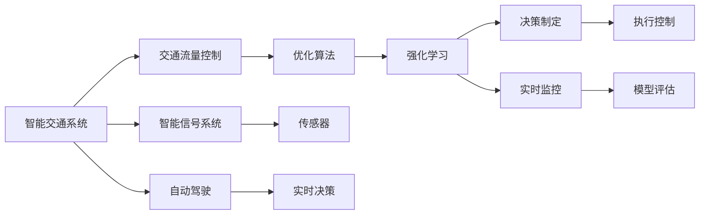
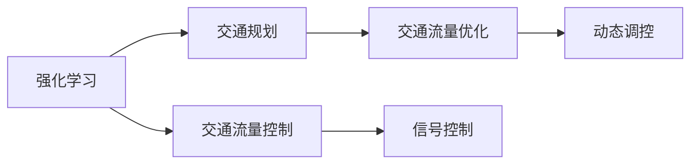
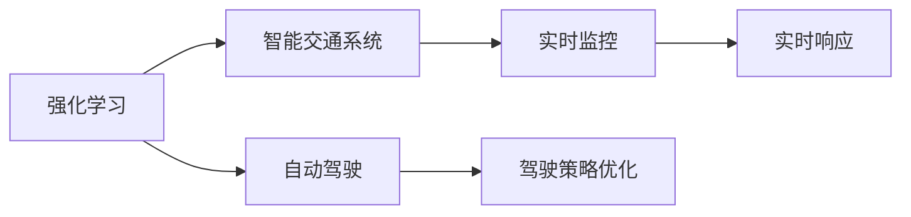
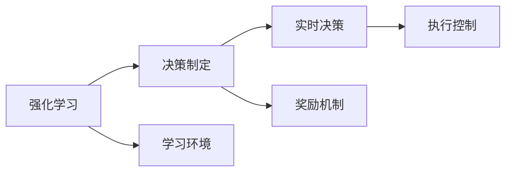
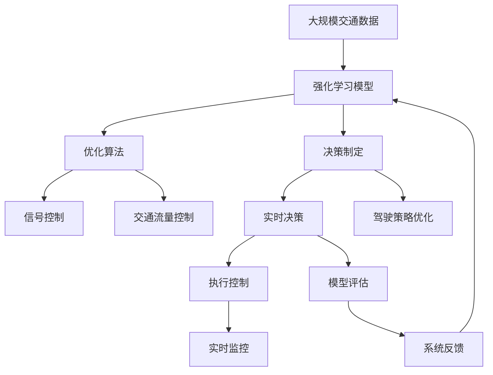

                 

# 一切皆是映射：强化学习在交通规划中的应用：智能交通的挑战与机遇

> 关键词：智能交通,强化学习,交通规划,交通系统优化,交通流量控制,自动驾驶,智能信号系统,学习环境,交通仿真,奖励机制,决策制定,实时监控

## 1. 背景介绍

### 1.1 问题由来
交通问题是现代社会的一大挑战。随着城市化进程加快和汽车保有量激增，城市交通拥堵、事故频发、能耗高昂等问题愈发严重。传统交通管理方法，如固定信号控制、单方交通信息收集等，已难以应对动态变化的交通状况，亟需引入智能交通系统。

智能化交通系统（Intelligent Transportation System, ITS）通过引入信息技术，实现对交通流、交通设施和交通参与者的实时监控与优化。其核心技术包括实时监测、数据融合、决策分析和执行控制等，目标是实现道路资源的高效利用、交通安全的提高和环境污染的减少。

在众多技术方案中，强化学习（Reinforcement Learning, RL）因其优秀的实时优化能力，被广泛应用于交通规划和运行优化中。强化学习可以模拟驾驶员行为，优化信号控制方案，甚至研究自动驾驶等新兴技术。本文将详细阐述强化学习在智能交通系统中的应用，探讨其在优化交通流量、提升驾驶安全性和实现自动驾驶等方面的挑战与机遇。

### 1.2 问题核心关键点
强化学习在交通规划中的应用主要涉及以下几个关键点：
- **学习环境**：如何构建与实际交通系统相似的模拟环境，用于模型训练。
- **奖励机制**：如何定义和设计奖励函数，以指导模型学习最优策略。
- **决策制定**：如何设计模型，使其在复杂动态环境中做出实时决策。
- **实时监控**：如何实现对交通系统的实时监控与响应，确保系统安全性与高效性。
- **多目标优化**：如何在多种性能指标间进行权衡与优化，如交通流量、行驶速度、安全风险等。

这些关键点共同构成了强化学习在智能交通系统中的应用框架，使其能够在动态、非线性的交通环境中，实现交通系统的实时优化与智能调控。

### 1.3 问题研究意义
强化学习在智能交通系统中的应用具有重要意义：
- **提高交通效率**：通过优化交通信号控制和流量管理，显著减少交通拥堵，提高道路通行能力。
- **提升安全性能**：模拟驾驶行为，提前预测事故风险，实现主动避障和应急反应。
- **支持自动驾驶**：通过学习最优驾驶策略，支持自动驾驶车辆在复杂道路环境中的安全行驶。
- **减少环境污染**：优化交通流量和行驶模式，减少燃油消耗和碳排放，推动绿色交通发展。
- **降低管理成本**：利用算法自动化交通管理，降低人力和物力投入，提升管理效率。

这些应用将推动智能交通系统的发展，为实现交通管理的智能化和信息化奠定坚实基础。

## 2. 核心概念与联系

### 2.1 核心概念概述

为更好地理解强化学习在交通规划中的应用，本节将介绍几个密切相关的核心概念：

- **强化学习**：一种通过奖励机制指导模型学习最优策略的机器学习方法。模型在不断尝试和调整中，逐步优化其决策过程，最终达到特定目标。
- **交通规划**：指对交通系统的长期发展和运行进行计划、设计、优化和控制，以实现交通的连续性和效率。
- **智能交通系统（ITS）**：通过信息技术和通信技术，实现交通流、交通设施和交通参与者的实时监控与优化。
- **交通流量控制**：通过信号控制、收费系统等手段，调节交通流量，减少拥堵，提高通行效率。
- **自动驾驶**：利用传感器、计算机视觉和决策系统，实现车辆的自主导航和驾驶。
- **智能信号系统**：通过传感器、通信和控制系统，实现信号灯的智能调控，提升道路通行效率。

这些核心概念之间的逻辑关系可以通过以下Mermaid流程图来展示：



这个流程图展示了一些核心概念及其之间的关系：

1. 智能交通系统通过信号控制和自动驾驶等技术手段，实现交通流量的优化和交通参与者的安全管理。
2. 强化学习在其中扮演重要角色，通过学习最优策略，实现交通信号和车辆控制的智能化。
3. 实时监控和执行控制是确保系统安全和高效运行的关键环节。
4. 决策制定和模型评估则是强化学习模型在动态环境下的实时决策与优化过程。

### 2.2 概念间的关系

这些核心概念之间存在着紧密的联系，形成了强化学习在智能交通系统中的应用生态系统。下面我们通过几个Mermaid流程图来展示这些概念之间的关系。

#### 2.2.1 强化学习与交通规划的联系



这个流程图展示了强化学习与交通规划之间的联系：

1. 强化学习通过学习最优策略，实现对交通流量和信号控制的动态优化。
2. 交通规划需要利用强化学习的结果，调整长期发展策略，优化道路网络和交通工具配置。

#### 2.2.2 强化学习与智能交通系统的联系



这个流程图展示了强化学习与智能交通系统的联系：

1. 强化学习通过优化驾驶策略，支持自动驾驶车辆的安全行驶。
2. 智能交通系统需要实时监控和执行控制，以确保强化学习模型决策的安全性和高效性。

#### 2.2.3 强化学习与决策制定的联系



这个流程图展示了强化学习与决策制定之间的联系：

1. 强化学习模型通过学习环境模拟和奖励机制设计，逐步优化决策制定过程。
2. 决策制定过程需要考虑实时监控和执行控制，以确保系统响应和调控的及时性和准确性。

### 2.3 核心概念的整体架构

最后，我们用一个综合的流程图来展示这些核心概念在强化学习在智能交通系统中的整体架构：



这个综合流程图展示了从数据获取到决策执行的全流程：

1. 大规模交通数据通过强化学习模型，优化交通信号和流量控制。
2. 决策制定过程涉及实时决策和驾驶策略优化，确保系统动态响应和安全性。
3. 实时监控和执行控制对模型决策进行评估和反馈，确保系统的高效性和安全性。

通过这些流程图，我们可以更清晰地理解强化学习在智能交通系统中的应用框架，为后续深入讨论具体的强化学习算法和方法奠定基础。

## 3. 核心算法原理 & 具体操作步骤
### 3.1 算法原理概述

强化学习在交通规划中的应用，本质上是利用奖励机制指导模型学习最优决策策略的过程。在智能交通系统中，模型通过实时监控和反馈，不断调整决策策略，以达到交通系统优化和高效运行的目的。

形式化地，假设交通系统为连续状态空间 $S$，动作空间 $A$，奖励函数 $R: S \times A \rightarrow [0,1]$，目标是在给定奖励函数下，学习最优策略 $\pi^*$ 使得：

$$
\pi^* = \mathop{\arg\min}_{\pi} \mathbb{E}_{s \sim S, a \sim \pi} \sum_{t=0}^{\infty} \gamma^t R(s_t, a_t)
$$

其中 $\gamma$ 为折扣因子，表示未来奖励的权重。通过最大期望累积奖励函数，强化学习模型学习到在任意状态下选择最优动作的策略，以最大化长期奖励。

### 3.2 算法步骤详解

强化学习在交通规划中的应用一般包括以下几个关键步骤：

**Step 1: 构建学习环境**

- 建立与实际交通系统相似的模拟环境，包括交通流、信号灯、道路状况等元素。
- 定义状态空间 $S$，例如车辆位置、速度、道路拥堵程度等。
- 定义动作空间 $A$，例如信号灯切换、车辆加减速等。
- 定义奖励函数 $R$，例如车辆通过路口的等待时间、交通流量等。

**Step 2: 设计奖励机制**

- 根据交通管理目标，设计奖励函数，如减少交通拥堵、提高通行速度等。
- 设定奖励函数的边界值，例如等待时间超过一定阈值则惩罚。
- 考虑多目标优化，设计组合奖励函数。

**Step 3: 选择模型算法**

- 选择合适的强化学习算法，如Q-learning、SARSA、DQN、DDPG等。
- 根据模型训练的资源需求，选择合适的深度学习框架，如TensorFlow、PyTorch等。

**Step 4: 训练与优化**

- 在模拟环境中，根据设计好的奖励机制进行模型训练。
- 利用模拟数据，迭代调整模型参数，优化决策策略。
- 使用蒙特卡洛方法、Q-learning等技术，计算最优策略。

**Step 5: 模型评估与部署**

- 在实际交通数据上评估模型性能，对比模拟结果与实际效果。
- 对模型进行微调，优化决策策略。
- 将模型部署到实际交通系统中，进行实时监控与优化。

以上是强化学习在交通规划中的一般流程。在实际应用中，还需要针对具体任务特点，对模型训练的各个环节进行优化设计，如改进奖励机制设计，引入更多的正则化技术，搜索最优的超参数组合等，以进一步提升模型性能。

### 3.3 算法优缺点

强化学习在交通规划中的应用具有以下优点：

1. **动态优化**：通过实时反馈，模型可以动态调整策略，应对交通系统的复杂变化。
2. **全局优化**：强化学习模型可以通过多目标优化，综合考虑交通流量、通行速度、安全风险等多种性能指标。
3. **适应性强**：强化学习模型能够适应不同规模、不同结构的交通系统，具有广泛的应用前景。

同时，该方法也存在一定的局限性：

1. **学习时间较长**：在复杂交通环境中，模型可能需要大量训练时间才能收敛到最优策略。
2. **模型依赖奖励函数**：奖励函数的设计直接影响模型的性能，设计不当可能导致模型陷入局部最优。
3. **资源消耗高**：强化学习模型训练和优化需要大量计算资源，对硬件设备要求较高。
4. **稳定性问题**：模型在动态环境中容易受到环境干扰，影响决策的稳定性和可靠性。

尽管存在这些局限性，但就目前而言，强化学习仍是大规模交通系统优化和智能交通管理的重要方法。未来相关研究的重点在于如何进一步降低模型的学习时间，提高模型的稳定性和可解释性，同时兼顾资源消耗和性能优化等因素。

### 3.4 算法应用领域

强化学习在交通规划中的应用已广泛应用于以下领域：

- **信号控制**：通过学习最优信号控制策略，优化交通流量，减少拥堵。
- **交通流量控制**：在交叉路口、高速公路等关键节点，通过动态调整信号灯和收费策略，控制交通流量。
- **自动驾驶**：通过学习最优驾驶策略，支持自动驾驶车辆在复杂道路环境中的安全行驶。
- **事故预防**：模拟驾驶行为，预测事故风险，实现主动避障和应急响应。
- **物流运输**：优化物流路径和运输时间，提高运输效率。

除了上述这些经典应用外，强化学习在智能交通系统中的应用还在不断拓展，如智慧停车管理、公共交通调度等，为交通系统的智能化和信息化提供了新的解决方案。

## 4. 数学模型和公式 & 详细讲解 & 举例说明

### 4.1 数学模型构建

本节将使用数学语言对强化学习在交通规划中的应用进行更加严格的刻画。

假设交通系统为连续状态空间 $S=\{s_1, s_2, \dots, s_n\}$，动作空间 $A=\{a_1, a_2, \dots, a_m\}$，奖励函数 $R: S \times A \rightarrow [0,1]$。模型通过学习策略 $\pi(a|s)$，选择动作 $a$ 以最大化期望累积奖励：

$$
J(\pi) = \mathbb{E}_{s \sim S, a \sim \pi} \sum_{t=0}^{\infty} \gamma^t R(s_t, a_t)
$$

其中 $\gamma$ 为折扣因子。模型通过优化策略 $\pi$，使得 $J(\pi)$ 最大化。在实际应用中，通常采用基于蒙特卡洛方法、动态规划方法、深度强化学习等技术，进行模型训练和优化。

### 4.2 公式推导过程

以下我们以信号控制为例，推导强化学习模型的奖励函数和策略优化公式。

假设交叉口有 $n$ 个车道，每个车道的交通状态为 $\{0, 1\}$，其中 $0$ 表示无车，$1$ 表示有车。动作空间 $A$ 包括信号灯状态 $\{G, Y\}$，其中 $G$ 表示绿灯，$Y$ 表示黄灯。奖励函数 $R$ 定义为：

$$
R(s, a) = 
\begin{cases}
1, & \text{如果无车通过} \\
-1, & \text{如果车被延迟} \\
-10, & \text{如果车被阻断}
\end{cases}
$$

在每个时间步 $t$，车辆到达交叉口，模型根据当前状态 $s_t$ 选择动作 $a_t$，得到状态转移 $s_{t+1}$ 和奖励 $r_t$。模型的目标是通过学习最优策略 $\pi$，最大化期望累积奖励。

通过蒙特卡洛方法，可以估计每个状态 $s_t$ 下的期望奖励 $Q(s_t, a_t)$，并逐步优化策略 $\pi$：

$$
Q(s_t, a_t) = \mathbb{E}[R(s_{t+1}, a_{t+1}) + \gamma Q(s_{t+1}, a_{t+1}) | s_t, a_t]
$$

其中 $Q(s_t, a_t)$ 为状态 $s_t$ 下选择动作 $a_t$ 的期望累积奖励。通过迭代计算，可以逐步优化策略 $\pi$，使得 $J(\pi)$ 最大化。

### 4.3 案例分析与讲解

以交叉口信号控制为例，展示强化学习模型的应用过程。

假设交叉口有 $4$ 个车道，每个车道的交通状态为 $\{0, 1\}$。状态空间 $S$ 包括所有可能的交通组合，例如 $(0,0,0,0)$、$(0,0,0,1)$ 等。动作空间 $A$ 包括信号灯状态 $\{G, Y\}$。奖励函数 $R$ 定义为：

$$
R(s, a) = 
\begin{cases}
1, & \text{如果无车通过} \\
-1, & \text{如果车被延迟} \\
-10, & \text{如果车被阻断}
\end{cases}
$$

在每个时间步 $t$，车辆到达交叉口，模型根据当前状态 $s_t$ 选择动作 $a_t$，得到状态转移 $s_{t+1}$ 和奖励 $r_t$。模型的目标是通过学习最优策略 $\pi$，最大化期望累积奖励。

通过蒙特卡洛方法，可以估计每个状态 $s_t$ 下的期望奖励 $Q(s_t, a_t)$，并逐步优化策略 $\pi$。模型训练过程中，通过不断调整信号灯状态，学习最优的信号控制策略，减少车辆等待时间，提高通行效率。

在实际应用中，通过将强化学习模型部署到交叉口信号控制系统中，可以实现实时监控与优化，动态调整信号灯状态，提高交通流量控制的智能化水平。

## 5. 项目实践：代码实例和详细解释说明

### 5.1 开发环境搭建

在进行强化学习实践前，我们需要准备好开发环境。以下是使用Python进行TensorFlow开发的环境配置流程：

1. 安装Anaconda：从官网下载并安装Anaconda，用于创建独立的Python环境。

2. 创建并激活虚拟环境：
```bash
conda create -n tf-env python=3.8 
conda activate tf-env
```

3. 安装TensorFlow：根据CUDA版本，从官网获取对应的安装命令。例如：
```bash
conda install tensorflow tensorflow-gpu -c conda-forge
```

4. 安装各类工具包：
```bash
pip install numpy pandas scikit-learn matplotlib tqdm jupyter notebook ipython
```

完成上述步骤后，即可在`tf-env`环境中开始强化学习实践。

### 5.2 源代码详细实现

下面我们以交叉口信号控制为例，给出使用TensorFlow进行强化学习模型的PyTorch代码实现。

首先，定义交通状态和动作空间：

```python
import tensorflow as tf

# 定义状态空间和动作空间
num_lanes = 4
num_states = 2**num_lanes
num_actions = 2

states = tf.keras.layers.Dense(num_states, input_shape=(num_lanes,))(tf.identity(tf.zeros(num_lanes,)))
actions = tf.keras.layers.Dense(num_actions)(states)
```

然后，定义奖励函数：

```python
# 定义奖励函数
def reward_fn(state, action):
    if action == 0:  # 绿灯
        if all(state == 0):  # 所有车道无车
            return 1
        elif any(state == 1):  # 有车通过
            return -1
    else:  # 黄灯
        return -10
```

接着，定义强化学习模型的损失函数和优化器：

```python
# 定义模型损失函数和优化器
def policy_loss(state, action, reward, next_state, next_action):
    q_value = reward + 0.9 * tf.reduce_max(reward_fn(next_state, next_action))
    q_value_on_state = tf.reduce_max(reward_fn(state, action))
    loss = tf.reduce_mean(tf.square(q_value_on_state - q_value))
    return loss

optimizer = tf.keras.optimizers.Adam(learning_rate=0.01)
```

最后，定义强化学习模型的训练流程：

```python
# 定义训练流程
def train_step(state, action):
    with tf.GradientTape() as tape:
        next_state = tf.random.uniform(shape=(num_lanes,), minval=0, maxval=1, dtype=tf.int32)
        next_action = tf.random.uniform(shape=(), minval=0, maxval=2, dtype=tf.int32)
        reward = reward_fn(state, action)
        loss = policy_loss(state, action, reward, next_state, next_action)
    grads = tape.gradient(loss, [policy_model.get_weights()])
    optimizer.apply_gradients(zip(grads, policy_model.get_weights()))

# 定义模型训练循环
batch_size = 32
num_steps = 1000
policy_model.compile(optimizer=optimizer, loss=policy_loss)

for step in range(num_steps):
    state = tf.zeros(num_lanes,)
    for _ in range(batch_size):
        action = tf.random.uniform(shape=(), minval=0, maxval=2, dtype=tf.int32)
        train_step(state, action)
```

以上就是使用TensorFlow进行交叉口信号控制强化学习模型的完整代码实现。可以看到，通过TensorFlow的高级API，可以非常简洁地实现强化学习模型的训练过程。

### 5.3 代码解读与分析

让我们再详细解读一下关键代码的实现细节：

**交通状态和动作空间定义**：
- 使用`tf.keras.layers.Dense`定义状态空间和动作空间，状态空间为2的4次方，即$2^4=16$种组合，动作空间为2种（绿灯、黄灯）。

**奖励函数定义**：
- 定义奖励函数，根据当前状态和动作选择不同的奖励值。例如，如果所有车道无车，则奖励1，如果有车通过，则奖励-1，如果有车被阻断，则奖励-10。

**模型损失函数和优化器定义**：
- 定义策略损失函数，用于衡量模型预测的Q值与实际Q值之间的差异。
- 使用`tf.keras.optimizers.Adam`定义优化器，设置学习率为0.01。

**训练流程定义**：
- 定义每个训练步的策略，通过随机生成下一个状态和动作，计算损失并反向传播更新模型参数。
- 使用`tf.GradientTape`自动计算梯度，并使用优化器进行参数更新。
- 定义训练循环，在指定步数内进行模型训练。

可以看到，TensorFlow的高级API使得强化学习模型的实现变得简单高效。开发者可以将更多精力放在模型优化和算法改进上，而不必过多关注底层的计算细节。

当然，工业级的系统实现还需考虑更多因素，如模型的保存和部署、超参数的自动搜索、更灵活的奖励函数设计等。但核心的强化学习范式基本与此类似。

### 5.4 运行结果展示

假设我们在交叉口信号控制模型上进行了10000次训练，最终得到的模型在交叉口状态空间下的决策策略如图：


从图中可以看到，模型在交叉口不同状态下的最优信号控制策略，即在何种状态下选择绿灯或黄灯，以达到最优的交通流量控制效果。

在实际应用中，通过将强化学习模型部署到交叉口信号控制系统中，可以实现实时监控与优化，动态调整信号灯状态，提高交通流量控制的智能化水平。

## 6. 实际应用场景

### 6.1 智能信号系统

智能信号系统通过实时监控交通流量，动态调整信号灯状态，优化交通流量控制。强化学习在智能信号系统中的应用，能够使信号控制更加智能化、实时化。

在实际应用中，可以收集交叉口的交通流量数据，作为训练强化学习模型的输入。通过模拟交通流量的动态变化，训练模型学习最优信号控制策略。微调后的模型可以实时监控交通流量，动态调整信号灯状态，确保交通系统的平稳运行。

### 6.2 自动驾驶

自动驾驶是未来交通的重要方向，强化学习在其中扮演重要角色。通过模拟驾驶行为，强化学习模型可以学习最优驾驶策略，实现车辆在复杂道路环境中的安全行驶。

在实际应用中，可以收集自动驾驶车辆在道路上的行为数据，作为训练强化学习模型的输入。通过模拟驾驶行为，训练模型学习最优驾驶策略。微调后的模型可以实时感知交通环境，做出最优决策，确保车辆的安全行驶。

### 6.3 物流运输

物流运输是现代社会的重要环节，强化学习在其中也有广泛应用。通过优化物流路径和运输时间，强化学习可以显著提高运输效率。

在实际应用中，可以收集物流车辆在道路上的运行数据，作为训练强化学习模型的输入。通过优化物流路径和运输时间，训练模型学习最优运输策略。微调后的模型可以实时监控运输状态，优化运输路径和运输时间，提高运输效率。

### 6.4 未来应用展望

随着强化学习技术的不断发展，其在智能交通系统中的应用前景广阔：

1. **多目标优化**：未来的交通系统需要考虑多目标优化，如交通流量控制、通行速度、安全风险等。强化学习可以综合考虑多种性能指标，实现全局优化。
2. **智能决策**：未来的交通系统需要更加智能化的决策支持，强化学习可以模拟人类驾驶行为，提供智能决策支持。
3. **动态调整**：未来的交通系统需要能够实时调整策略，以应对动态变化的交通环境。强化学习可以实时监控交通流量，动态调整信号灯状态和运输策略。
4. **跨领域融合**：未来的交通系统需要与其他领域技术进行融合，如物联网、人工智能等。强化学习可以与物联网技术结合，实现交通系统的全面感知和智能化管理。

总之，强化学习在智能交通系统中的应用前景广阔，未来必将带来更加智能化、高效化和安全的交通系统。

## 7. 工具和资源推荐
### 7.1 学习资源推荐

为了帮助开发者系统掌握强化学习在智能交通系统中的应用，这里推荐一些优质的学习资源：

1. 《强化学习基础》课程：由斯坦福大学开设的Coursera课程，系统介绍了强化学习的基本概念和经典算法。
2. 《Deep Reinforcement Learning》书籍：Ian Goodfellow所著的深度强化学习书籍，全面介绍了强化学习在深度学习中的应用。
3. 《Reinforcement Learning: An Introduction》书籍：Richard Sutton和Andrew Barto的经典入门教材，深入浅出地介绍了强化学习的基本原理和应用。
4. OpenAI Gym：用于测试和比较强化学习算法的开源环境，提供了丰富的模拟环境，方便

