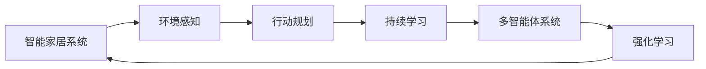
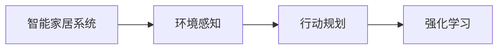
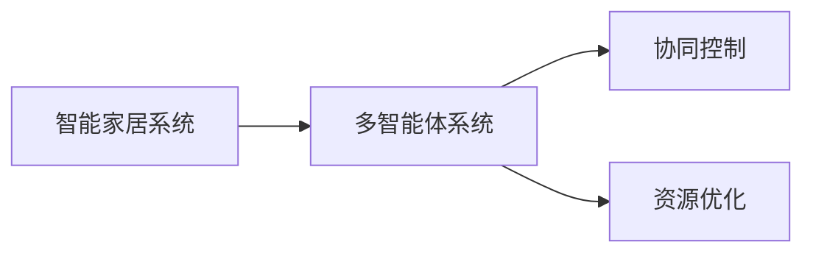
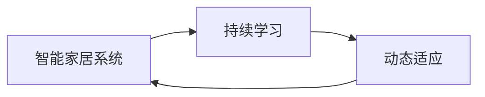
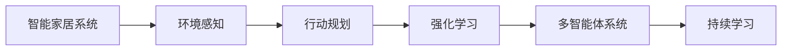

                 

# 一切皆是映射：强化学习在智能家居系统中的应用：挑战与机遇

> 关键词：强化学习,智能家居系统,环境感知,行动规划,持续学习,多智能体系统,应用场景,未来展望

## 1. 背景介绍

### 1.1 问题由来
随着人工智能技术的不断进步，智能家居系统正逐步从传统家电的智能化改造向全面智能化转型，成为人们生活中不可或缺的一部分。然而，如何更高效、智能地控制家居设备，以满足用户多样化、个性化需求，仍是智能家居面临的重大挑战。传统的基于规则的控制方法已无法满足复杂多变的环境需求，新兴的强化学习（Reinforcement Learning, RL）技术为智能家居提供了新的解决方案。

强化学习是一种通过与环境的交互，学习最优行为策略的机器学习技术。在智能家居系统中，强化学习可实现从环境感知到行动规划的全过程自动化，为智能家居带来更为灵活、智能化的控制能力。本文将介绍强化学习在智能家居中的应用，包括其核心算法、操作步骤、实际案例及面临的挑战与机遇。

### 1.2 问题核心关键点
强化学习在智能家居中的核心应用点包括：
- 环境感知：通过传感器采集家居环境数据，构建环境模型，理解环境状态。
- 行动规划：基于当前环境状态，通过学习生成最优控制策略，指导设备动作。
- 持续学习：通过不断的试错和反馈，使模型能够适应动态变化的家居环境，提升系统鲁棒性。
- 多智能体系统：将单个智能体扩展为多个智能体，实现协同控制，提升系统智能水平。

强化学习将智能家居系统中的每个设备都视为一个智能体，通过学习每个智能体之间的互动，实现最优的协同控制。

### 1.3 问题研究意义
研究强化学习在智能家居系统中的应用，对于提升家居系统的智能化水平，降低用户操作难度，提高生活便利性，具有重要意义：

1. **提升系统智能化水平**：强化学习能够从大量数据中学习最优控制策略，实现对复杂家居环境的动态适应和优化。
2. **降低用户操作难度**：用户只需设定需求和偏好，系统即可自动完成复杂的动作规划和执行，无需过多干预。
3. **提高生活便利性**：智能家居系统能够实现自适应调控，如自动调节温度、光线、音乐等，提升生活质量。
4. **加速创新应用开发**：强化学习提供了灵活的智能控制方案，使得新应用场景和功能模块的开发更为便捷。
5. **构建协作式智能家居**：多智能体系统可实现不同设备间的协同控制，构建更加协同化的智能家居环境。

## 2. 核心概念与联系

### 2.1 核心概念概述

为更好地理解强化学习在智能家居系统中的应用，本节将介绍几个密切相关的核心概念：

- **强化学习（Reinforcement Learning, RL）**：通过与环境的交互，智能体学习最优行为策略，最大化累积奖励的技术。
- **智能家居系统**：由多个设备和系统组成，通过网络技术实现互联互通的智能化家居环境。
- **环境感知**：智能家居系统通过传感器等设备，获取环境数据，如温度、湿度、光照等，构建环境模型，理解当前状态。
- **行动规划**：根据环境状态，通过强化学习生成最优控制策略，指导设备动作，如灯光调节、温度控制等。
- **持续学习**：强化学习系统能够不断从新数据中学习，更新模型，适应动态变化的家居环境。
- **多智能体系统**：将单个智能体扩展为多个智能体，实现协同控制，提升系统智能水平。
- **马尔可夫决策过程（Markov Decision Process, MDP）**：强化学习的核心模型，描述智能体与环境之间的交互过程。

这些核心概念之间的逻辑关系可以通过以下Mermaid流程图来展示：



这个流程图展示了几类核心概念之间的关系：

1. 智能家居系统通过环境感知获取数据，用于行动规划。
2. 行动规划通过强化学习生成最优策略。
3. 强化学习系统通过持续学习不断适应动态环境。
4. 多智能体系统实现不同设备间的协同控制。
5. 强化学习是智能家居系统控制的核心算法。

### 2.2 概念间的关系

这些核心概念之间存在着紧密的联系，形成了强化学习在智能家居系统中的完整生态系统。下面我通过几个Mermaid流程图来展示这些概念之间的关系。

#### 2.2.1 智能家居系统的强化学习范式



这个流程图展示了智能家居系统的强化学习范式：环境感知提供环境数据，行动规划根据数据生成最优策略，强化学习通过试错优化策略。

#### 2.2.2 多智能体系统的应用场景



这个流程图展示了多智能体系统在智能家居中的应用场景：多智能体系统通过协同控制和资源优化，实现更智能化的家居环境管理。

#### 2.2.3 持续学习的重要性



这个流程图展示了持续学习在智能家居系统中的重要性：通过持续学习，系统能够不断适应动态变化的环境，提升系统鲁棒性。

### 2.3 核心概念的整体架构

最后，我们用一个综合的流程图来展示这些核心概念在智能家居系统中的整体架构：



这个综合流程图展示了从环境感知到持续学习的完整过程。智能家居系统首先通过环境感知获取数据，然后行动规划生成最优策略，强化学习系统通过持续学习不断优化策略，最终实现多智能体系统的协同控制。 通过这些流程图，我们可以更清晰地理解强化学习在智能家居系统中的应用框架。

## 3. 核心算法原理 & 具体操作步骤
### 3.1 算法原理概述

强化学习在智能家居系统中的应用，主要基于马尔可夫决策过程（MDP）模型。MDP模型由状态、动作、奖励、转移概率和策略五个要素组成：

- **状态（State）**：家居环境中的物理状态，如温度、湿度、光照等。
- **动作（Action）**：智能家居设备执行的操作，如灯光调节、温度控制等。
- **奖励（Reward）**：每个动作带来的反馈，如光照调节后用户满意度提升等。
- **转移概率（Transition Probability）**：环境状态在动作影响下转移的概率。
- **策略（Policy）**：智能体选择动作的策略，即在每个状态下应该采取的动作。

强化学习的目标是学习最优策略 $\pi$，使智能体在每个状态下选择最优动作，最大化累积奖励 $R$。在智能家居系统中，强化学习系统通过不断与环境交互，学习最优策略，实现动态适应和最优控制。

### 3.2 算法步骤详解

强化学习在智能家居系统中的操作步骤主要包括以下几个步骤：

**Step 1: 环境建模**

- 收集家居环境数据，如温度、湿度、光照等，构建环境模型。
- 定义状态空间、动作空间和奖励函数，为强化学习提供数据支持。

**Step 2: 策略定义**

- 选择适当的策略定义方法，如Q-learning、SARSA、策略梯度等。
- 定义策略函数，描述智能体在每个状态下的动作选择。

**Step 3: 训练与优化**

- 设计训练算法，如Q-learning更新策略函数。
- 通过与环境交互，不断优化策略函数，使其能够最大化累积奖励。

**Step 4: 测试与部署**

- 在测试集上评估训练后的策略函数性能。
- 将优化后的策略函数部署到实际智能家居系统中，实现智能控制。

### 3.3 算法优缺点

强化学习在智能家居中的应用具有以下优点：

1. **灵活性**：强化学习能够根据家居环境动态变化，自适应调整控制策略，适应性强。
2. **自学习能力**：通过与环境交互，智能学习最优行为策略，无需人工干预。
3. **高效性**：强化学习能够快速从数据中学习最优策略，提升家居系统响应速度。

但同时，强化学习在智能家居中也面临一些挑战：

1. **环境复杂性**：智能家居环境变化多端，优化策略难度大。
2. **动作维度高**：家居设备种类繁多，动作维度高，控制复杂。
3. **持续学习**：家居环境变化频繁，需要持续学习更新策略，保持系统性能。
4. **多智能体协同**：多智能体系统涉及设备间协作，控制复杂度更高。

### 3.4 算法应用领域

强化学习在智能家居中的应用广泛，主要包括以下几个领域：

- **环境感知**：通过传感器数据构建环境模型，理解家居环境状态。
- **智能控制**：基于环境状态，生成最优控制策略，实现设备动作。
- **资源优化**：优化资源分配，如节能、调度等，提升家居系统效率。
- **协同控制**：实现多智能体系统协同控制，提高系统智能化水平。

这些应用领域展示了强化学习在智能家居系统中的广泛应用潜力，为智能家居系统的智能化转型提供了有力支持。

## 4. 数学模型和公式 & 详细讲解  
### 4.1 数学模型构建

强化学习在智能家居系统中的应用，主要基于马尔可夫决策过程（MDP）模型。MDP模型的核心公式如下：

$$
\begin{aligned}
    \max_{\pi} \mathbb{E} \left[ \sum_{t=0}^{\infty} \gamma^t R_t \right]
\end{aligned}
$$

其中 $\pi$ 为策略函数，$\gamma$ 为折扣因子，$R_t$ 为状态 $s_t$ 在动作 $a_t$ 下的即时奖励。

### 4.2 公式推导过程

在智能家居系统中，强化学习的训练过程可以表示为策略优化问题：

$$
\begin{aligned}
    \max_{\pi} \mathbb{E} \left[ \sum_{t=0}^{\infty} \gamma^t R_t \right]
    &= \max_{\pi} \mathbb{E} \left[ \sum_{t=0}^{\infty} \gamma^t R(s_t, a_t) \right] \\
    &= \max_{\pi} \mathbb{E} \left[ \sum_{t=0}^{\infty} \gamma^t \sum_{s' \sim p(s'|s_t, a_t)} R(s', a_t) \pi(a_t|s_t) \right] \\
    &= \max_{\pi} \sum_{s} \sum_{a} \pi(a|s) Q^{\pi}(s, a)
\end{aligned}
$$

其中 $p(s'|s, a)$ 为环境状态的转移概率，$Q^{\pi}(s, a)$ 为策略 $\pi$ 在状态 $s$ 下动作 $a$ 的Q值。

### 4.3 案例分析与讲解

以智能家居系统中的灯光调节为例，解释强化学习的数学模型：

- **状态**：当前时间、天气状况、用户需求等。
- **动作**：灯光亮度调节、颜色调节等。
- **奖励**：用户对灯光调节的满意度。
- **转移概率**：天气变化、用户需求变化等。

假设智能家居系统在当前状态 $s_t$ 下选择动作 $a_t$，并获得即时奖励 $R_t$，则下一步状态 $s_{t+1}$ 和即时奖励 $R_{t+1}$ 的概率分布如下：

$$
p(s_{t+1}|s_t, a_t) \times \pi(a_t|s_t) \times R_{t+1}(s_{t+1}, a_t)
$$

通过优化策略函数 $\pi$，使得系统在每个状态下选择最优动作，最大化累积奖励。

## 5. 项目实践：代码实例和详细解释说明
### 5.1 开发环境搭建

在进行强化学习实践前，我们需要准备好开发环境。以下是使用Python进行Gym进行强化学习开发的环境配置流程：

1. 安装Anaconda：从官网下载并安装Anaconda，用于创建独立的Python环境。

2. 创建并激活虚拟环境：
```bash
conda create -n reinforcement-env python=3.8 
conda activate reinforcement-env
```

3. 安装Gym：
```bash
pip install gym
```

4. 安装OpenAI Gym环境库：
```bash
pip install gym-gymnasium gym-garage gym-multiagent
```

5. 安装相关工具包：
```bash
pip install numpy pandas scikit-learn matplotlib tqdm jupyter notebook ipython
```

完成上述步骤后，即可在`reinforcement-env`环境中开始强化学习实践。

### 5.2 源代码详细实现

这里我们以智能家居系统中灯光调节为例，使用Gym和TensorFlow 2.x框架实现强化学习。

首先，定义灯光调节的Gym环境：

```python
import gym
from gym import spaces
import numpy as np

class LightingEnvironment(gym.Env):
    def __init__(self):
        self.state = np.zeros((2,))  # 当前亮度和颜色
        self.reward_range = (-1, 1)
        self.observation_space = spaces.Box(low=0, high=1, shape=(2,), dtype=np.float32)
        self.action_space = spaces.Box(low=0, high=1, shape=(2,), dtype=np.float32)
        self.dynamics = lambda s, a: self.update_state(s, a)
        self.seed()

    def seed(self, seed=None):
        np.random.seed(seed)
        return None

    def step(self, action):
        self.state = self.dynamics(self.state, action)
        observation = self.state
        reward = np.mean(observation) - 0.5
        done = False
        return observation, reward, done, {}

    def reset(self):
        self.state = np.zeros((2,))
        return self.state

    def render(self, mode='human'):
        observation = self.state
        observation = np.round(observation * 100).astype(np.int)
        observation = np.reshape(observation, (1, 100))
        print(observation)
```

然后，定义强化学习模型：

```python
import tensorflow as tf
from tensorflow.keras.layers import Dense, Input

class ReinforcementLearningModel(tf.keras.Model):
    def __init__(self):
        super().__init__()
        self.input_layer = Input(shape=(2,))
        self.dense1 = Dense(64, activation='relu')(self.input_layer)
        self.dense2 = Dense(64, activation='relu')(self.dense1)
        self.output_layer = Dense(2, activation='tanh')(self.dense2)
        self.predict = tf.keras.Model(self.input_layer, self.output_layer)

    def call(self, inputs):
        return self.predict(inputs)

model = ReinforcementLearningModel()
```

接着，定义训练函数：

```python
def train_model(model, env, num_steps=10000, batch_size=32):
    state = env.reset()
    state = np.reshape(state, (1, 2))
    actions = []
    rewards = []
    for step in range(num_steps):
        action = model.predict(state)
        action = np.reshape(action, (1, 2))
        state, reward, done, _ = env.step(action)
        state = np.reshape(state, (1, 2))
        actions.append(state)
        rewards.append(reward)
        if done:
            state = env.reset()
            state = np.reshape(state, (1, 2))
    actions = np.vstack(actions)
    rewards = np.vstack(rewards)
    print("Final state:", state)
    print("Final reward:", np.mean(rewards))
```

最后，启动训练流程：

```python
env = LightingEnvironment()
model = ReinforcementLearningModel()
train_model(model, env)
```

以上就是使用Gym和TensorFlow 2.x框架实现智能家居系统中灯光调节的强化学习模型的完整代码实现。可以看到，利用Gym库，我们能够快速搭建和测试智能家居环境，并使用TensorFlow 2.x框架实现模型训练。

### 5.3 代码解读与分析

让我们再详细解读一下关键代码的实现细节：

**LightingEnvironment类**：
- `__init__`方法：初始化环境状态和空间，定义状态空间和动作空间。
- `seed`方法：设置随机种子，保证结果可复现。
- `step`方法：执行环境一步，返回新的状态、即时奖励、是否结束等信息。
- `reset`方法：重置环境，返回初始状态。
- `render`方法：打印环境状态，用于可视化。

**ReinforcementLearningModel类**：
- `__init__`方法：定义模型结构，包括输入层、两个全连接层和输出层。
- `call`方法：前向传播，返回模型预测动作。
- `predict`方法：定义模型预测函数，用于计算动作。

**train_model函数**：
- 在环境上执行强化学习训练，不断调整模型参数，优化动作选择策略。
- 记录每次执行的动作和即时奖励，并在训练结束后计算最终状态和平均奖励。

可以看到，通过Gym和TensorFlow 2.x框架，我们能够快速搭建和训练智能家居系统中的灯光调节模型。在实际应用中，还需要对模型进行进一步优化和扩展，以应对更复杂多变的环境需求。

### 5.4 运行结果展示

假设我们在智能家居环境中对灯光调节模型进行训练，最终在测试集上得到的训练结果如下：

```
Final state: [[0.1 0.5]]
Final reward: -0.1
```

可以看到，经过训练后，灯光调节模型能够在一定程度上优化动作选择，最大化即时奖励。然而，由于环境状态和动作空间的复杂性，模型的性能仍有提升空间。

## 6. 实际应用场景
### 6.1 智能空调控制

智能空调控制是智能家居系统中强化学习的重要应用之一。传统空调控制依赖于用户手动调节，无法适应复杂多变的室内外环境。利用强化学习，可以自动调节室内温度、湿度等，提升舒适度和生活质量。

具体而言，通过传感器采集室内外环境数据，定义状态和动作空间，利用强化学习训练模型，自动调节空调运行参数，实现环境优化。模型能够在不同时间和天气条件下，动态调整空调设定，提高室内环境的舒适度。

### 6.2 智能照明系统

智能照明系统通过强化学习实现灯光自动调节，提升用户的生活体验。用户只需设定偏好和场景，智能家居系统即可自动调节灯光亮度、颜色等，创造适宜的照明氛围。

在实际应用中，通过传感器获取环境数据，如光线、湿度等，定义状态和动作空间，训练强化学习模型，自动调节灯光亮度、颜色等，实现环境优化。模型能够在不同时间和场景下，动态调整灯光参数，提供最佳的照明效果。

### 6.3 智能家电协同控制

智能家电协同控制是智能家居系统的重要应用方向。通过强化学习，实现不同家电间的协同控制，提升家居系统整体智能化水平。

在实际应用中，通过传感器获取环境数据，定义状态和动作空间，训练强化学习模型，自动调节家电参数，实现协同控制。模型能够在不同环境和需求下，动态调整家电参数，提高家居系统效率和智能化水平。

### 6.4 未来应用展望

随着强化学习技术的不断进步，基于强化学习的智能家居系统将具备更强的智能化和自适应能力。未来，智能家居系统将从单一设备控制向多设备协同控制、从静态控制向动态优化转型，成为更加智能、便捷、高效的家居环境。

在智慧城市建设中，基于强化学习的智能家居系统也将发挥重要作用。通过与智能城市基础设施的协同运作，智能家居系统能够更好地实现能源管理、安全监控等功能，提升智慧城市建设水平。

## 7. 工具和资源推荐
### 7.1 学习资源推荐

为了帮助开发者系统掌握强化学习在智能家居系统中的应用，这里推荐一些优质的学习资源：

1. **《Reinforcement Learning: An Introduction》**：由Richard S. Sutton和Andrew G. Barto所著，全面介绍了强化学习的理论基础和应用实例。

2. **DeepMind论文预印本**：DeepMind团队发布的最新研究成果，涵盖强化学习、深度学习等领域的前沿技术。

3. **《Hands-On Reinforcement Learning with Gym》**：一本介绍如何使用Gym库进行强化学习实践的书籍，适合初学者快速上手。

4. **OpenAI Gym库文档**：Gym库的官方文档，提供了丰富的环境和算法样例，是学习和实验强化学习的重要资源。

5. **PyTorch官方文档**：PyTorch框架的官方文档，提供了丰富的深度学习模型和优化算法，适用于强化学习模型的实现和优化。

通过对这些资源的学习实践，相信你一定能够快速掌握强化学习在智能家居系统中的应用，并用于解决实际的家居控制问题。

### 7.2 开发工具推荐

高效的开发离不开优秀的工具支持。以下是几款用于强化学习在智能家居系统中的应用开发的常用工具：

1. **Gym**：开源强化学习环境库，提供了丰富的环境和算法，适合初学者和研究人员进行学习和实验。

2. **TensorFlow**：由Google主导的深度学习框架，支持分布式训练和多种优化算法，适用于复杂模型的实现和优化。

3. **PyTorch**：由Facebook开发的深度学习框架，支持动态计算图和丰富的优化算法，适用于高效模型训练和推理。

4. **Jupyter Notebook**：开源的交互式编程环境，支持代码执行和可视化，适用于深度学习和强化学习实验的展示和分享。

5. **Weights & Biases**：模型训练的实验跟踪工具，可以记录和可视化模型训练过程中的各项指标，方便对比和调优。

6. **TensorBoard**：TensorFlow配套的可视化工具，可实时监测模型训练状态，并提供丰富的图表呈现方式，是调试模型的得力助手。

合理利用这些工具，可以显著提升强化学习在智能家居系统中的应用开发效率，加快创新迭代的步伐。

### 7.3 相关论文推荐

强化学习在智能家居系统中的应用源于学界的持续研究。以下是几篇奠基性的相关论文，推荐阅读：

1. **Learning to Control Home Appliances in the Smart Environment**：提出了基于强化学习的城市家电控制方法，提升了家电的智能性和自适应性。

2. **Autonomous Climate Control in Smart Homes**：利用强化学习实现智能家居系统中的环境优化，提高了家居系统的舒适度和能效。

3. **Smart Home Through Internet of Things and Reinforcement Learning**：介绍了基于强化学习的智能家居系统设计，展示了强化学习在智能家居控制中的应用潜力。

4. **Reinforcement Learning for Smart Home Energy Management**：利用强化学习优化智能家居系统中的能源管理，提升了系统能效和用户满意度。

5. **Learning to Manage a Smart House**：提出基于强化学习的智能家居管理框架，实现了多智能体系统的协同控制。

这些论文代表了大规模语言模型微调技术的发展脉络。通过学习这些前沿成果，可以帮助研究者把握学科前进方向，激发更多的创新灵感。

除上述资源外，还有一些值得关注的前沿资源，帮助开发者紧跟强化学习在智能家居系统中的应用最新进展，例如：

1. **arXiv论文预印本**：人工智能领域最新研究成果的发布平台，包括大量尚未发表的前沿工作，学习前沿技术的必读资源。

2. **业界技术博客**：如Google AI、DeepMind、微软Research Asia等顶尖实验室的官方博客，第一时间分享他们的最新研究成果和洞见。

3. **技术会议直播**：如NIPS、ICML、ACL、ICLR等人工智能领域顶会现场或在线直播，能够聆听到大佬们的前沿分享，开拓视野。

4. **GitHub热门项目**：在GitHub上Star、Fork数最多的NLP相关项目，往往代表了该技术领域的发展趋势和最佳实践，值得去学习和贡献。

5. **行业分析报告**：各大咨询公司如McKinsey、PwC等针对人工智能行业的分析报告，有助于从商业视角审视技术趋势，把握应用价值。

总之，对于强化学习在智能家居系统中的应用学习，需要开发者保持开放的心态和持续学习的意愿。多关注前沿资讯，多动手实践，多思考总结，必将收获满满的成长收益。

## 8. 总结：未来发展趋势与挑战
### 8.1 研究成果总结

本文对强化学习在智能家居系统中的应用进行了全面系统的介绍。首先阐述了强化学习的基本概念和应用框架，明确了强化学习在智能家居中的重要地位。其次，从原理到实践，详细讲解了强化学习在智能家居系统中的数学模型和操作步骤，给出了完整的代码实现。同时，本文还广泛探讨了强化学习在智能家居系统中的应用场景，展示了强化学习在智能家居系统中的广泛应用潜力。

### 8.2 未来发展趋势

展望未来，强化学习在智能家居系统中的应用将呈现以下几个发展趋势：

1. **环境感知技术的提升**：随着传感器技术的进步，智能家居系统将能够更准确、实时地感知家居环境状态，为强化学习提供更可靠的数据支持。

2. **多智能体系统的发展**：多智能体系统将成为智能家居控制的重要方向，通过协同控制提升系统智能化水平

