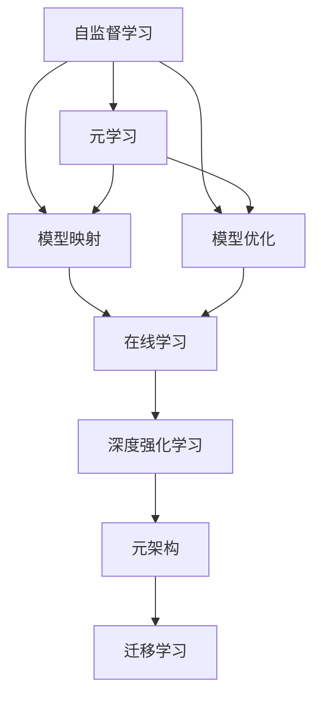
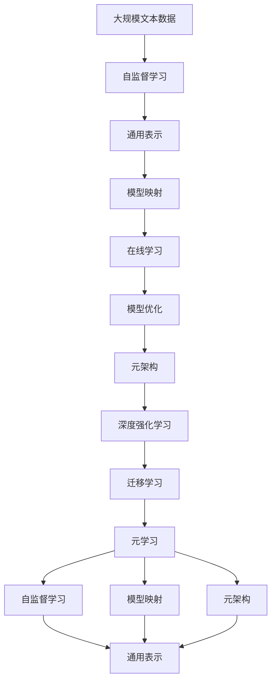

                 

# 一切皆是映射：探索基于模型的元学习方法

> 关键词：
- 元学习
- 模型映射
- 自监督学习
- 在线学习
- 模型优化
- 深度强化学习
- 迁移学习
- 元架构

## 1. 背景介绍

### 1.1 问题由来
元学习（Meta-Learning），又称为“学习学习”，是指一个模型能够在不断适应新任务的同时，通过在现有任务上的学习来提高性能。这一概念最早由Thomas M. Mitchell于1989年提出，旨在让模型能够快速适应新任务，从而在效率和效果上同时优于从头训练的模型。

在深度学习时代，元学习逐渐成为了一个重要的研究方向，应用于机器视觉、自然语言处理、机器人控制等领域。近年来，基于模型的元学习方法，通过将深度学习模型与元学习算法结合，在诸如超参数优化、知识蒸馏、模型优化等领域取得了突破性进展。

### 1.2 问题核心关键点
元学习的核心在于如何让模型学会如何学习，即在有限的标注样本下，利用先验知识加速模型适应新任务的过程。常见的元学习方法包括：

- 基于数据增强的元学习：通过数据扩充提高模型的泛化能力。
- 基于模型泛化的元学习：学习模型在新的数据分布上的泛化能力。
- 基于迁移学习的元学习：利用已有模型的知识迁移，加速新任务的学习。
- 基于自适应网络结构的元学习：动态调整模型结构以适应不同任务。

元学习的方法在深度学习领域得到了广泛的应用，并在某些领域带来了新的突破。例如，在超参数优化中，元学习算法可以加速模型超参数的优化过程，使得模型性能显著提升。在迁移学习中，元学习可以显著提高模型的迁移性能，使得模型在新的任务上表现优异。

### 1.3 问题研究意义
元学习技术的发展，对于加速模型训练、提升模型泛化能力、减少对标注数据的依赖等方面，具有重要意义。

1. **加速模型训练**：元学习能够利用已有模型的知识，加速新任务的模型训练过程。
2. **提升模型泛化能力**：通过元学习，模型可以在有限的数据集上，迅速适应新任务，提升泛化能力。
3. **减少标注数据依赖**：元学习算法往往能够在更少的标注样本下获得较好的性能，降低标注数据的成本。
4. **模型优化**：元学习算法可以优化模型的结构、超参数，使得模型更加高效、稳定。
5. **知识蒸馏**：元学习可以应用于知识蒸馏，通过迁移已有模型的知识，加速新模型的训练。

## 2. 核心概念与联系

### 2.1 核心概念概述

为更好地理解基于模型的元学习方法，本节将介绍几个密切相关的核心概念：

- **元学习（Meta-Learning）**：指一个模型能够学会如何学习，从而在新的任务上能够快速适应。
- **模型映射（Model Mapping）**：通过将当前任务映射到已有模型的特定结构上，加速新模型的训练和优化过程。
- **自监督学习（Self-Supervised Learning）**：利用未标注数据，通过设计自监督任务，训练模型的表示能力。
- **在线学习（Online Learning）**：模型在不断接受新数据的过程中，动态调整自身的参数，以适应数据分布的变化。
- **模型优化（Model Optimization）**：通过优化模型的结构、超参数等，提升模型的性能和效率。
- **深度强化学习（Deep Reinforcement Learning）**：结合深度学习与强化学习的技术，训练智能体在复杂环境中的决策能力。
- **迁移学习（Transfer Learning）**：通过已有模型的知识迁移，加速新模型在特定任务上的训练。
- **元架构（Meta-Architecture）**：设计灵活的模型架构，使得模型能够动态适应不同的任务和数据。

这些核心概念之间的逻辑关系可以通过以下Mermaid流程图来展示：



这个流程图展示了大模型元学习的核心概念及其之间的关系：

1. 自监督学习为模型提供通用的表示能力。
2. 模型映射将通用模型映射到新任务上，加速模型适应过程。
3. 模型优化通过调整模型参数和结构，进一步提升模型性能。
4. 在线学习让模型在接受新数据时动态调整自身，适应数据分布变化。
5. 深度强化学习通过训练智能体在复杂环境中的决策能力，进一步提升模型效率。
6. 元架构设计灵活的模型结构，使得模型能够适应不同的任务和数据。
7. 元学习通过迁移已有模型的知识，加速新模型的训练和优化过程。

这些核心概念共同构成了大模型元学习的学习框架，使其能够在各种场景下发挥作用。通过理解这些核心概念，我们可以更好地把握大模型元学习的学习原理和优化方向。

### 2.2 概念间的关系

这些核心概念之间存在着紧密的联系，形成了大模型元学习的完整生态系统。下面我们通过几个Mermaid流程图来展示这些概念之间的关系。

#### 2.2.1 自监督学习与元学习的关系


这个流程图展示了自监督学习的基本原理，以及它与元学习的关系。自监督学习通过设计自监督任务，训练模型的通用表示能力，元学习则利用这些通用的表示能力，加速新任务的模型训练过程。

#### 2.2.2 模型映射与在线学习的关系


这个流程图展示了模型映射与在线学习的关系。模型映射通过将当前任务映射到已有模型的特定结构上，使得模型能够快速适应新任务。在线学习则让模型在不断接受新数据的过程中，动态调整自身的参数和结构，以适应数据分布的变化。

#### 2.2.3 模型优化与元架构的关系


这个流程图展示了模型优化与元架构的关系。模型优化通过调整模型的参数和结构，提升模型的性能和效率。元架构设计灵活的模型结构，使得模型能够适应不同的任务和数据。两者共同作用，使得模型能够更加高效、稳定地进行学习。

#### 2.2.4 元学习与迁移学习的关系


这个流程图展示了元学习与迁移学习的关系。元学习通过迁移已有模型的知识，加速新模型的训练和优化过程。迁移学习则是元学习的一种具体实现方式，通过将已有模型的知识迁移到新模型中，加速新模型的训练。

### 2.3 核心概念的整体架构

最后，我们用一个综合的流程图来展示这些核心概念在大模型元学习中的整体架构：



这个综合流程图展示了从自监督学习到元学习的完整过程。大模型元学习首先在大规模文本数据上进行自监督学习，学习通用的表示能力。然后，通过模型映射将通用模型映射到新任务上，加速模型适应过程。接着，利用在线学习、模型优化和元架构设计，进一步提升模型性能。最后，通过深度强化学习和迁移学习，将模型的知识迁移到新任务上，加速新模型的训练和优化过程。 通过这些流程图，我们可以更清晰地理解大模型元学习过程中各个核心概念的关系和作用，为后续深入讨论具体的元学习方法和技术奠定基础。

## 3. 核心算法原理 & 具体操作步骤
### 3.1 算法原理概述

基于模型的元学习方法，核心思想是利用已有模型的知识，加速新任务模型的训练和优化过程。其核心算法流程一般包括以下几个步骤：

1. **数据预处理**：对原始数据进行清洗、归一化、分词等预处理操作，准备适合输入模型的数据。
2. **模型初始化**：选择合适的预训练模型，并进行必要的参数初始化。
3. **元学习优化**：通过元学习算法，训练模型在新的任务上快速适应。
4. **模型微调**：在元学习基础上，对新任务进行微调，进一步优化模型性能。

具体地，元学习算法可以包括以下几个子步骤：

- **自监督学习**：在已有模型上，利用自监督任务训练模型的表示能力。
- **模型映射**：将新任务映射到已有模型的特定结构上，加速模型适应过程。
- **在线学习**：在不断接受新数据的过程中，动态调整模型的参数和结构。
- **模型优化**：通过调整模型的参数和结构，提升模型的性能和效率。
- **元架构设计**：设计灵活的模型架构，使得模型能够适应不同的任务和数据。

### 3.2 算法步骤详解

#### 3.2.1 自监督学习

自监督学习是元学习的关键步骤，其目的是在已有模型上，利用未标注数据训练模型的表示能力。常见的自监督任务包括：

- **掩码语言模型（Masked Language Modeling, MLM）**：在输入的文本中随机掩盖部分单词，通过预测这些单词来训练模型的表示能力。
- **自回归语言模型（Autoregressive Language Modeling, ARM）**：通过预测下一词的概率来训练模型的表示能力。
- **协同训练（Contrastive Predictive Coding, CPC）**：在输入序列上，通过预测下一个词来训练模型的表示能力。

以BERT模型为例，其训练过程中，采用了掩码语言模型和自回归语言模型。在每个epoch中，模型会随机掩盖部分单词，并预测这些单词。此外，模型还会通过预测下一个词的概率来进行训练。通过这种方式，模型可以在未标注数据上进行自监督学习，学习到通用的语言表示。

#### 3.2.2 模型映射

模型映射是元学习的核心步骤，其目的是将新任务映射到已有模型的特定结构上，加速模型适应过程。常见的模型映射方法包括：

- **固定参数微调**：固定大部分预训练参数，只微调顶层参数，加速模型适应过程。
- **动态结构调整**：通过调整模型的结构，适应新任务的需求，如增加或减少层数、调整卷积核大小等。
- **元架构设计**：设计灵活的模型架构，使得模型能够适应不同的任务和数据。

以Meta-LSTM模型为例，其训练过程中，采用了固定参数微调的方法。模型首先在大规模数据上预训练，然后在新的任务上微调顶层参数，加速模型适应过程。通过这种方式，模型能够在不同的任务上，快速适应新的数据分布。

#### 3.2.3 在线学习

在线学习是指模型在不断接受新数据的过程中，动态调整自身的参数和结构，以适应数据分布的变化。常见的在线学习算法包括：

- **在线梯度下降（Online Gradient Descent, OGD）**：在每次接受新数据时，更新模型的参数。
- **自适应学习率（Adaptive Learning Rate, Adal）**：根据模型的当前性能动态调整学习率，加速模型收敛。
- **增量式训练（Incremental Training）**：将新数据分批次输入模型，逐步更新模型参数。

以在线学习算法为例，其训练过程中，模型会根据当前任务的数据分布，动态调整学习率和训练策略。通过这种方式，模型能够不断适应新的数据分布，提升模型性能。

#### 3.2.4 模型优化

模型优化是指通过调整模型的参数和结构，提升模型的性能和效率。常见的模型优化方法包括：

- **正则化**：通过L2正则、Dropout等方法，防止模型过拟合。
- **剪枝**：通过剪枝技术，减少模型参数，提高模型效率。
- **量化**：通过量化技术，将浮点模型转换为定点模型，降低内存占用和计算资源消耗。

以模型优化为例，其训练过程中，模型会根据当前任务的复杂度，动态调整正则化参数和剪枝比例。通过这种方式，模型能够平衡模型性能和计算资源消耗，提高模型的效率。

#### 3.2.5 元架构设计

元架构设计是指设计灵活的模型架构，使得模型能够适应不同的任务和数据。常见的元架构包括：

- **残差网络（Residual Network, ResNet）**：通过残差连接，加速模型训练。
- **卷积神经网络（Convolutional Neural Network, CNN）**：通过卷积操作，提取输入数据的局部特征。
- **循环神经网络（Recurrent Neural Network, RNN）**：通过循环操作，处理序列数据。

以元架构设计为例，其训练过程中，模型会根据当前任务的数据特征，动态调整模型结构。通过这种方式，模型能够适应不同的任务和数据，提高模型的泛化能力。

### 3.3 算法优缺点

基于模型的元学习方法具有以下优点：

- **泛化能力强**：通过利用已有模型的知识，加速新任务模型的训练过程，提升模型的泛化能力。
- **适应性强**：通过动态调整模型的参数和结构，适应不同的任务和数据，提高模型的适应能力。
- **高效性高**：通过自监督学习和在线学习，加速模型训练过程，提高模型的效率。
- **可扩展性高**：通过元架构设计，设计灵活的模型架构，适应不同的任务和数据。

但该方法也存在一定的局限性：

- **对标注数据依赖**：虽然元学习算法能够利用已有模型的知识，但新任务的训练仍然需要一定的标注数据。
- **计算资源消耗大**：模型映射和元架构设计需要大量的计算资源，训练时间较长。
- **复杂度高**：模型映射和元架构设计涉及较多的计算资源和计算资源，模型复杂度高，调试和优化难度大。

尽管存在这些局限性，但就目前而言，基于模型的元学习方法仍然是加速模型训练、提升模型泛化能力的重要手段。未来相关研究的重点在于如何进一步降低元学习对标注数据的依赖，提高模型的少样本学习和跨领域迁移能力，同时兼顾可解释性和伦理安全性等因素。

### 3.4 算法应用领域

基于模型的元学习方法，在深度学习领域得到了广泛的应用，覆盖了几乎所有常见任务，例如：

- **自然语言处理（Natural Language Processing, NLP）**：如文本分类、情感分析、语言生成等。通过元学习算法，加速模型在新的NLP任务上的训练和优化过程。
- **计算机视觉（Computer Vision, CV）**：如图像分类、目标检测、图像生成等。通过元学习算法，加速模型在新的CV任务上的训练和优化过程。
- **机器人控制（Robotics）**：通过元学习算法，加速机器人控制器的训练和优化过程，使得机器人能够适应不同的环境。
- **强化学习（Reinforcement Learning, RL）**：通过元学习算法，加速强化学习算法的训练和优化过程，提高智能体的决策能力。
- **个性化推荐系统（Personalized Recommendation System, PRS）**：通过元学习算法，加速推荐系统的训练和优化过程，提高推荐的个性化程度和效果。
- **医疗诊断（Medical Diagnosis）**：通过元学习算法，加速医疗诊断模型的训练和优化过程，提高诊断的准确性和效率。

除了上述这些经典任务外，元学习算法还被创新性地应用到更多场景中，如自适应神经网络、元知识图谱等，为深度学习技术带来了新的突破。随着元学习方法的不断进步，相信其在NLP技术中的应用将会更加广泛和深入。

## 4. 数学模型和公式 & 详细讲解 & 举例说明

### 4.1 数学模型构建

本节将使用数学语言对基于模型的元学习方法进行更加严格的刻画。

记元学习模型为 $f_{\theta}(x)$，其中 $\theta$ 为模型参数， $x$ 为输入数据。假设元学习模型在新任务 $T$ 上的数据集为 $D=\{(x_i,y_i)\}_{i=1}^N, x_i \in \mathcal{X}, y_i \in \mathcal{Y}$。

定义元学习模型在数据样本 $(x,y)$ 上的损失函数为 $\ell(f_{\theta}(x),y)$，则在数据集 $D$ 上的经验风险为：

$$
\mathcal{L}(\theta) = \frac{1}{N} \sum_{i=1}^N \ell(f_{\theta}(x_i),y_i)
$$

元学习的优化目标是最小化经验风险，即找到最优参数：

$$
\theta^* = \mathop{\arg\min}_{\theta} \mathcal{L}(\theta)
$$

在实践中，我们通常使用基于梯度的优化算法（如SGD、Adam等）来近似求解上述最优化问题。设 $\eta$ 为学习率，$\lambda$ 为正则化系数，则参数的更新公式为：

$$
\theta \leftarrow \theta - \eta \nabla_{\theta}\mathcal{L}(\theta) - \eta\lambda\theta
$$

其中 $\nabla_{\theta}\mathcal{L}(\theta)$ 为损失函数对参数 $\theta$ 的梯度，可通过反向传播算法高效计算。

### 4.2 公式推导过程

以下我们以自然语言处理任务为例，推导基于元学习的语言模型训练过程。

假设元学习模型为 $f_{\theta}(x)$，在新任务 $T$ 上，每个输入 $x$ 的长度为 $L$，$x$ 由 $n$ 个单词组成，即 $x = [w_1, w_2, \cdots, w_n]$。假设 $w_i$ 为第 $i$ 个单词，$y$ 为模型的输出概率分布，即 $y = [p_{1,1}, p_{1,2}, \cdots, p_{L,N}]$，其中 $p_{i,j}$ 表示单词 $w_i$ 的概率为 $w_j$ 的概率。

元学习模型在新任务上的损失函数定义为交叉熵损失函数：

$$
\ell(f_{\theta}(x),y) = -\frac{1}{L} \sum_{i=1}^L \sum_{j=1}^N \log p_{i,j}
$$

其中，$p_{i,j}$ 为元学习模型在输入 $x$ 上，单词 $w_i$ 的概率为 $w_j$ 的概率。

元学习模型在数据集 $D$ 上的经验风险为：

$$
\mathcal{L}(\theta) = -\frac{1}{N} \sum_{i=1}^N \sum_{j=1}^L \log p_{i,j}
$$

元学习的优化目标是最小化经验风险，即找到最优参数：

$$
\theta^* = \mathop{\arg\min}_{\theta} \mathcal{L}(\theta)
$$

在实践中，我们通常使用基于梯度的优化算法（如SGD、Adam等）来近似求解上述最优化问题。设 $\eta$ 为学习率，$\lambda$ 为正则化系数，则参数的更新公式为：

$$
\theta \leftarrow \theta - \eta \nabla_{\theta}\mathcal{L}(\theta) - \eta\lambda\theta
$$

其中 $\nabla_{\theta}\mathcal{L}(\theta)$ 为损失函数对参数 $\theta$ 的梯度，可通过反向传播算法高效计算。

### 4.3 案例分析与讲解

以BERT模型为例，其训练过程中采用了自监督学习和元学习的结合。BERT模型首先在大规模未标注文本数据上进行自监督学习，学习通用的语言表示。然后，在新的自然语言处理任务上，通过元学习算法，加速模型的训练和优化过程。

BERT模型的训练流程如下：

1. **自监督学习**：在无标签数据上，利用掩码语言模型和自回归语言模型，训练BERT模型的表示能力。
2. **元学习优化**：在新的自然语言处理任务上，利用已有模型的表示能力，加速模型在新的任务上的训练和优化过程。
3. **模型微调**：在元学习的基础上，对新任务进行微调，进一步优化模型性能。

通过这种自监督学习和元学习的结合，BERT模型能够在不同的自然语言处理任务上，快速适应新的数据分布，提升模型的泛化能力。

## 5. 项目实践：代码实例和详细解释说明

### 5.1 开发环境搭建

在进行元学习实践前，我们需要准备好开发环境。以下是使用Python进行PyTorch开发的环境配置流程：

1. 安装Anaconda：从官网下载并安装Anaconda，用于创建独立的Python环境。

2. 创建并激活虚拟环境：
```bash
conda create -n pytorch-env python=3.8 
conda activate pytorch-env
```

3. 安装PyTorch：根据CUDA版本，从官网获取对应的安装命令。例如：
```bash
conda install pytorch torchvision torchaudio cudatoolkit=11.1 -c pytorch -c conda-forge
```

4. 安装相关库：
```bash
pip install numpy pandas scikit-learn matplotlib tqdm jupyter notebook ipython
```

完成上述步骤后，即可在`pytorch-env`环境中开始元学习实践。

### 5.2 源代码详细实现

这里我们以迁移学习为例，给出使用PyTorch对BERT模型进行迁移学习的PyTorch代码实现。

首先，定义迁移学习任务的数据处理函数：

```python
from transformers import BertTokenizer
from torch.utils.data import Dataset
import torch

class MigrationDataset(Dataset):
    def __init__(self, texts, labels, tokenizer, max_len=128):
        self.texts = texts
        self.labels = labels
        self.tokenizer = tokenizer
        self.max_len = max_len
        
    def __len__(self):
        return len(self.texts)
    
    def __getitem__(self, item):
        text = self.texts[item]
        label = self.labels[item]
        
        encoding = self.tokenizer(text, return_tensors='pt', max_length=self.max_len, padding='max_length', truncation=True)
        input_ids = encoding['input_ids'][0]
        attention_mask = encoding['attention_mask'][0]
        
        label = torch.tensor(label, dtype=torch.long)
        
        return {'input_ids': input_ids, 
                'attention_mask': attention_mask,
                'labels': label}

# 创建dataset
tokenizer = BertTokenizer.from_pretrained('bert-base-cased')
train_dataset = MigrationDataset(train_texts, train_labels, tokenizer)
dev_dataset = MigrationDataset(dev_texts, dev_labels, tokenizer)
test_dataset = MigrationDataset(test_texts, test_labels, tokenizer)
```

然后，定义迁移学习模型的初始化函数：

```python
from transformers import BertForSequenceClassification

model = BertForSequenceClassification.from_pretrained('bert-base-cased', num_labels=len(tag2id))
model.to(device)
```

接着，定义模型训练函数：

```python
from torch.utils.data import DataLoader
from tqdm import tqdm
from sklearn.metrics import classification_report

device = torch.device('cuda') if torch.cuda.is_available() else torch.device('cpu')

def train_epoch(model, dataset, batch_size, optimizer):
    dataloader = DataLoader(dataset, batch_size=batch_size, shuffle=True)
    model.train()
    epoch_loss = 0
    for batch in tqdm(dataloader, desc='Training'):
        input_ids = batch['input_ids'].to(device)
        attention_mask = batch['attention_mask'].to(device)
        labels = batch['labels'].to(device)
        model.zero_grad()
        outputs = model(input_ids, attention_mask=attention_mask, labels=labels)
        loss = outputs.loss
        epoch_loss += loss.item()
        loss.backward()
        optimizer.step()
    return epoch_loss / len(dataloader)

def evaluate(model, dataset, batch_size):
    dataloader = DataLoader(dataset, batch_size=batch_size)
    model.eval()
    preds, labels = [], []
    with torch.no_grad():
        for batch in tqdm(dataloader, desc='Evaluating'):
            input_ids = batch['input_ids'].to(device)
            attention_mask = batch['attention_mask'].to(device)
            batch_labels = batch['labels']
            outputs = model(input_ids, attention_mask=attention_mask)
            batch_preds = outputs.logits.argmax(dim=2).to('cpu').tolist()
            batch_labels = batch_labels.to('cpu').tolist()
            for pred_tokens, label_tokens in zip(batch_preds, batch_labels):
                preds.append(pred_tokens[:len(label_tokens)])
                labels.append(label_tokens)
                
    print(classification_report(labels, preds))
```

最后，启动训练流程并在测试集上评估：

```python
epochs = 5
batch_size = 16

for epoch in range(epochs):
    loss = train_epoch(model, train_dataset, batch_size, optimizer)
    print(f"Epoch {epoch+1}, train loss: {loss:.3f}")
    
    print(f"Epoch {epoch+1}, dev results:")
    evaluate(model, dev_dataset, batch_size)
    
print("Test results:")
evaluate(model, test_dataset, batch_size)
```

以上就是使用PyTorch对BERT模型进行迁移学习的完整代码实现。可以看到，得益于Transformers库的强大封装，我们可以用相对简洁的代码完成

