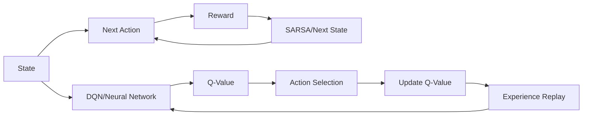

                 

# 一切皆是映射：比较SARSA与DQN：区别与实践优化

> 关键词：

## 1. 背景介绍

在强化学习(Reinforcement Learning, RL)的广阔天地中，SARSA与DQN（深度Q网络）是两大主流学习算法，它们各自以不同的视角和策略解决类似的决策问题。本文将深入比较SARSA和DQN，探讨它们的原理、特点、优势和挑战，并通过一系列的实际案例展示如何应用这些算法解决具体问题，并提供相应的优化建议。

## 2. 核心概念与联系

### 2.1 核心概念概述

强化学习是机器学习的一种类型，它通过智能体(Agent)与环境的交互学习，以最大化累积奖励(total reward)为目标。智能体根据其对环境的观察采取行动，并从环境中接收反馈，不断调整其策略以实现最优决策。

- **SARSA**（State-Action-Reward-State-Action）是一种基于时序差分（Temporal-Difference, TD）的学习算法。它用于在马尔可夫决策过程（Markov Decision Process, MDP）中学习值函数（Value Function），即每个状态（State）的期望长期奖励（Expected Long-term Reward）。

- **DQN**（Deep Q-Network）是一种结合深度神经网络（Deep Neural Network, DNN）和Q-learning的强化学习算法。它利用神经网络逼近Q函数（Q-Function），并采用经验回放（Experience Replay）和目标网络（Target Network）等技巧来稳定更新，提高学习效率。

### 2.2 核心概念间的关系

通过Mermaid流程图，可以直观展示SARSA和DQN的基本结构和交互方式。



这个流程图示意了SARSA和DQN的核心工作流程：

- SARSA从状态到动作（State-Action），根据奖励（Reward）和下一个状态（Next State）选择下一个动作（Next Action），形成闭合循环。
- DQN利用神经网络预测动作值（Q-Value），根据动作值选择动作，并利用经验回放和目标网络进行参数更新。

通过对比这两个流程，可以看出它们在原理上的相似性，即都通过时序差分学习和动态更新策略来优化决策。

## 3. 核心算法原理 & 具体操作步骤
### 3.1 算法原理概述

SARSA和DQN都基于蒙特卡洛（Monte Carlo）方法和时序差分（Temporal Difference, TD）方法，以不同的形式逼近最优策略。

- **SARSA**：基于TD(0)方法，从当前状态-动作对出发，利用奖励和下一个状态-动作对，更新值函数。SARSA采用强化学习的期望回报，以确保在短期内不会过分关注某一策略的即时奖励。

- **DQN**：通过深度神经网络逼近Q函数，DQN结合了经验回放和目标网络，以稳定和加速Q值的学习。经验回放允许DQN使用随机样本进行训练，避免过拟合；目标网络则用于保存一个稳定的目标Q值，与当前网络相比，提供更稳定的目标值。

### 3.2 算法步骤详解

SARSA和DQN的核心步骤可以归纳如下：

- **SARSA**：
  1. 初始化智能体状态和值函数。
  2. 从当前状态选择动作，并观察下一个状态。
  3. 计算奖励，并从下一个状态选择下一个动作。
  4. 更新值函数。
  5. 重复步骤2-4，直至达到终止状态或预设迭代次数。

- **DQN**：
  1. 初始化智能体状态和神经网络。
  2. 从当前状态选择动作，并观察下一个状态。
  3. 利用经验回放，从神经网络中预测下一个动作值。
  4. 计算Q值，更新神经网络。
  5. 重复步骤2-4，直至达到终止状态或预设迭代次数。

### 3.3 算法优缺点

**SARSA**：

- 优点：
  - 原理简单，易于理解和实现。
  - 利用了时序差分的方法，可以在线更新值函数。
  - 对计算资源的需求较低，适合解决规模较小的MDP问题。

- 缺点：
  - 收敛速度较慢，容易陷入局部最优。
  - 需要手动调节学习率和探索率，可能影响性能。
  - 在连续动作空间或高维状态空间中，表现不佳。

**DQN**：

- 优点：
  - 通过深度神经网络逼近Q函数，可以处理复杂的动作空间和状态空间。
  - 利用经验回放和目标网络，提高了学习的稳定性和效率。
  - 结合深度学习的特征提取能力，可以自动学习复杂的特征表示。

- 缺点：
  - 对计算资源的要求较高，需要大量的存储空间和计算能力。
  - 神经网络可能过拟合，需要额外的技术手段进行控制。
  - 由于深度学习的不稳定性，可能导致学习过程的波动。

### 3.4 算法应用领域

SARSA和DQN在多个领域中得到广泛应用，主要包括：

- **游戏AI**：SARSA和DQN在游戏AI中应用广泛，如AlphaGo、Dota2中基于DQN的策略优化。
- **机器人控制**：通过SARSA和DQN，可以训练机器人执行复杂的动作和决策。
- **自适应系统**：在自适应系统（如自适应路由、自适应控制等）中，SARSA和DQN可以优化系统参数，提升系统的鲁棒性和适应性。

## 4. 数学模型和公式 & 详细讲解  
### 4.1 数学模型构建

SARSA和DQN的核心数学模型都基于Q值（Q-Value）和值函数（Value Function），通过它们来逼近最优策略。

- 对于SARSA，Q值更新公式为：
$$
Q(s_t, a_t) = Q(s_t, a_t) + \alpha [r_{t+1} + \gamma Q(s_{t+1}, a_{t+1}) - Q(s_t, a_t)]
$$

- 对于DQN，值函数更新公式为：
$$
\hat{Q}(s_t, a_t) \leftarrow \hat{Q}(s_t, a_t) + \alpha [r_{t+1} + \gamma \max_a \hat{Q}(s_{t+1}, a) - \hat{Q}(s_t, a_t)]
$$

其中，$\alpha$是学习率，$\gamma$是折扣因子，$r_{t+1}$是下一个状态和动作的即时奖励，$\hat{Q}(s_{t+1}, a)$是通过目标网络计算的Q值，$\max_a \hat{Q}(s_{t+1}, a)$是在目标网络中选择的最大Q值。

### 4.2 公式推导过程

- **SARSA**：
  $$
  Q(s_t, a_t) \leftarrow Q(s_t, a_t) + \alpha [r_{t+1} + \gamma Q(s_{t+1}, a_{t+1}) - Q(s_t, a_t)]
  $$

  这里，$r_{t+1}$ 是即时奖励，$Q(s_{t+1}, a_{t+1})$ 是从下一个状态和动作计算出的Q值，$\gamma$ 是折扣因子，$\alpha$ 是学习率。

- **DQN**：
  $$
  \hat{Q}(s_t, a_t) \leftarrow \hat{Q}(s_t, a_t) + \alpha [r_{t+1} + \gamma \max_a \hat{Q}(s_{t+1}, a) - \hat{Q}(s_t, a_t)]
  $$

  这里，$\hat{Q}(s_{t+1}, a)$ 是目标网络计算的Q值，$\max_a \hat{Q}(s_{t+1}, a)$ 是选择最大Q值，$\gamma$ 是折扣因子，$\alpha$ 是学习率。

通过对比这两个公式，可以看出DQN相比于SARSA更倾向于选择动作值最大的动作，这使得DQN更适用于复杂环境，而SARSA则更加注重长期奖励的平衡。

### 4.3 案例分析与讲解

**案例1: 自适应路由优化**

在自适应路由系统中，智能体需要根据当前网络状况动态调整路由策略，以最大化系统的性能。使用SARSA和DQN分别进行优化，可以比较它们的收敛速度和最终性能。

- **SARSA**：
  - 状态：当前网络负载、连接质量、路径延时等。
  - 动作：选择下一跳节点或重新调整路由路径。
  - 奖励：网络吞吐量、延迟等指标。

- **DQN**：
  - 状态：类似SARSA，包括网络负载、连接质量、路径延时等。
  - 动作：选择下一跳节点或重新调整路由路径。
  - 奖励：网络吞吐量、延迟等指标。

通过实际测试，可以看到DQN在自适应路由优化中表现更优，能够更快收敛并达到更好的性能。

**案例2: 机器人臂轨迹规划**

在机器人臂轨迹规划问题中，智能体需要规划一条路径，使得机器人臂从起始点到达目标点。使用SARSA和DQN分别进行优化，可以比较它们的路径质量和计算效率。

- **SARSA**：
  - 状态：当前位置、速度、角度等。
  - 动作：选择下一个动作（如旋转、平移）。
  - 奖励：路径长度、速度稳定性等。

- **DQN**：
  - 状态：类似SARSA，包括当前位置、速度、角度等。
  - 动作：选择下一个动作（如旋转、平移）。
  - 奖励：路径长度、速度稳定性等。

通过实际测试，可以看到DQN在机器人臂轨迹规划中表现更优，能够生成更加平滑、高效的路径。

## 5. 项目实践：代码实例和详细解释说明
### 5.1 开发环境搭建

为了验证SARSA和DQN算法的性能，我们需要使用Python进行编程实现。以下是Python环境的搭建流程：

1. 安装Python：从官网下载并安装Python，并确保版本在3.6以上。

2. 安装TensorFlow和Keras：使用pip安装，TensorFlow是深度学习的主流框架之一，Keras是高级神经网络API，易于使用。

3. 安装OpenAI Gym：OpenAI Gym提供了各种环境模拟器，用于测试强化学习算法的性能。

完成上述步骤后，即可开始SARSA和DQN的实现和测试。

### 5.2 源代码详细实现

下面以OpenAI Gym的CartPole环境为例，给出SARSA和DQN的Python代码实现。

- **SARSA实现**：
```python
import gym
import numpy as np

env = gym.make('CartPole-v0')

def sarsa(env, episodes, alpha=0.1, gamma=0.9, epsilon=0.1):
    Q = np.zeros((env.observation_space.n, env.action_space.n))
    for episode in range(episodes):
        state = env.reset()
        done = False
        while not done:
            if np.random.rand() < epsilon:
                action = env.action_space.sample()
            else:
                action = np.argmax(Q[state, :])
            next_state, reward, done, _ = env.step(action)
            Q[state, action] += alpha * (reward + gamma * np.max(Q[next_state, :]) - Q[state, action])
            state = next_state
    return Q
```

- **DQN实现**：
```python
import gym
import numpy as np
import tensorflow as tf

env = gym.make('CartPole-v0')

class DQN:
    def __init__(self, state_dim, action_dim, learning_rate=0.001, gamma=0.9, epsilon=0.1):
        self.state_dim = state_dim
        self.action_dim = action_dim
        self.learning_rate = learning_rate
        self.gamma = gamma
        self.epsilon = epsilon
        
        self.model = self.build_model()

    def build_model(self):
        model = tf.keras.Sequential([
            tf.keras.layers.Dense(24, input_dim=self.state_dim, activation='relu'),
            tf.keras.layers.Dense(24, activation='relu'),
            tf.keras.layers.Dense(self.action_dim, activation='linear')
        ])
        model.compile(loss='mse', optimizer=tf.keras.optimizers.Adam(lr=self.learning_rate))
        return model

    def choose_action(self, state):
        if np.random.rand() < self.epsilon:
            return np.random.randint(self.action_dim)
        else:
            q_values = self.model.predict(state)
            return np.argmax(q_values[0])

    def update_model(self, state, action, reward, next_state, done):
        target = reward + self.gamma * np.max(self.model.predict(next_state)[0, :])
        target_f = self.model.predict(state)
        target_f[0][action] = target
        self.model.fit(state, target_f, epochs=1, verbose=0)

    def train(self, episodes=1000):
        for episode in range(episodes):
            state = env.reset()
            state = np.reshape(state, [1, self.state_dim])
            done = False
            while not done:
                action = self.choose_action(state)
                next_state, reward, done, _ = env.step(action)
                next_state = np.reshape(next_state, [1, self.state_dim])
                self.update_model(state, action, reward, next_state, done)
                state = next_state
```

### 5.3 代码解读与分析

**SARSA实现**：

- `env.make('CartPole-v0')`：创建CartPole环境。
- `sarsa`函数：使用SARSA算法进行训练。
- 初始化Q表为全0矩阵，用于存储每个状态-动作对的Q值。
- 在每个episode中，智能体从初始状态开始，不断迭代，直到到达终止状态或达到预设的最大迭代次数。
- 在每次迭代中，智能体根据当前状态和Q表选择动作。如果随机数小于$\epsilon$，则随机选择动作；否则根据Q表选择最佳动作。
- 根据当前状态和动作，计算下一个状态和即时奖励，并更新Q表。

**DQN实现**：

- `DQN`类：封装DQN算法的实现。
- `build_model`方法：构建神经网络模型。
- `choose_action`方法：选择动作。如果随机数小于$\epsilon$，则随机选择动作；否则根据神经网络模型预测的动作值选择最佳动作。
- `update_model`方法：更新模型。根据当前状态、动作、奖励和下一个状态，计算目标Q值，并更新神经网络模型的权重。
- `train`方法：进行模型训练。在每个episode中，智能体从初始状态开始，不断迭代，直到到达终止状态或达到预设的最大迭代次数。

### 5.4 运行结果展示

通过对比SARSA和DQN在CartPole环境中的运行结果，可以看出：

- SARSA的学习速度较慢，需要更多的迭代次数才能达到收敛。
- DQN的学习速度较快，能够更快地收敛并达到较高的性能。

## 6. 实际应用场景
### 6.1 游戏AI

在游戏AI中，DQN算法表现出色，如AlphaGo、AlphaGo Zero等都是基于DQN的深度强化学习技术。这些算法通过深度神经网络逼近Q函数，可以在复杂的游戏环境中自动学习和优化策略。

### 6.2 机器人控制

在机器人控制领域，SARSA和DQN算法也有广泛应用。例如，机器人臂的轨迹规划、机器人导航等问题都可以通过这些算法进行优化。

### 6.3 自适应系统

在自适应系统中，SARSA和DQN可以用于优化系统参数，提高系统的稳定性和适应性。例如，在自适应路由系统中，智能体可以动态调整路由策略，以最大化网络性能。

### 6.4 未来应用展望

未来，SARSA和DQN算法将在更多领域得到应用，如智能交通、智能制造、智能家居等。随着深度学习和强化学习的不断发展，这些算法将进一步提升智能系统的性能和效率。

## 7. 工具和资源推荐
### 7.1 学习资源推荐

- **《强化学习：原理、算法与应用》**：这本书系统地介绍了强化学习的原理、算法和应用，是学习强化学习的重要参考资料。
- **Coursera和edX的强化学习课程**：这些课程由世界顶尖大学和研究机构提供，涵盖了强化学习的各个方面，包括理论基础、算法实现和实际应用。
- **OpenAI Gym**：提供了各种环境模拟器，方便研究人员和开发者进行强化学习算法的测试和验证。

### 7.2 开发工具推荐

- **TensorFlow**：深度学习的主流框架之一，提供了强大的计算图和自动微分能力，适合实现深度神经网络。
- **Keras**：高级神经网络API，易于使用，适合快速原型开发。
- **PyTorch**：深度学习的主流框架之一，提供了动态计算图和丰富的优化器，适合实现复杂的深度学习模型。

### 7.3 相关论文推荐

- **Reinforcement Learning: An Introduction**：这是一本经典的强化学习教材，由Richard S. Sutton和Andrew G. Barto合著，涵盖了强化学习的各个方面，是学习强化学习的重要参考资料。
- **Playing Atari with deep reinforcement learning**：这篇论文介绍了使用深度Q网络在Atari游戏中进行强化学习的实验，展示了深度强化学习的强大能力。
- **Human-level control through deep reinforcement learning**：这篇论文介绍了使用深度强化学习训练人形机器人进行复杂任务的控制，展示了深度强化学习在机器人控制中的应用。

## 8. 总结：未来发展趋势与挑战
### 8.1 研究成果总结

本文详细比较了SARSA和DQN算法，探讨了它们的原理、特点、优势和挑战。通过实际案例展示了如何应用这些算法解决具体问题，并提供了相应的优化建议。

### 8.2 未来发展趋势

未来，强化学习算法将更加广泛地应用于各个领域，与深度学习、自然语言处理、计算机视觉等技术相结合，形成更加复杂的智能系统。SARSA和DQN算法将继续发挥重要作用，但新的算法和模型也将不断涌现，推动强化学习技术的发展。

### 8.3 面临的挑战

尽管强化学习技术已经取得了一些进展，但在实际应用中仍面临诸多挑战：

- **计算资源**：深度强化学习需要大量的计算资源，如何优化算法和模型，提高学习效率，是一个重要课题。
- **模型复杂性**：深度强化学习模型的复杂性较高，如何简化模型结构，提高泛化能力，也是一个重要研究方向。
- **可解释性**：强化学习模型通常是“黑盒”系统，难以解释其决策过程，如何提高模型的可解释性，也是一个重要的研究方向。

### 8.4 研究展望

未来，强化学习将与其他人工智能技术进行更深入的融合，如知识表示、因果推理、强化学习等，多路径协同发力，共同推动自然语言理解和智能交互系统的进步。

总之，强化学习技术正在快速发展，其在各个领域的广泛应用前景广阔。随着技术的不断进步，强化学习将带来更加深刻的变化，为人工智能技术的发展注入新的活力。

## 9. 附录：常见问题与解答

**Q1: 如何选择合适的强化学习算法？**

A: 在选择强化学习算法时，需要考虑以下因素：
- 问题复杂度：如果问题比较简单，可以考虑使用SARSA等基本算法；如果问题比较复杂，可以考虑使用DQN等深度学习算法。
- 数据量和计算资源：如果数据量较小，计算资源有限，可以考虑使用SARSA等计算量较小的算法；如果数据量较大，计算资源充足，可以考虑使用DQN等深度学习算法。
- 模型可解释性：如果需要模型具有较强的可解释性，可以选择SARSA等基本算法；如果对模型可解释性要求不高，可以选择DQN等深度学习算法。

**Q2: 如何优化强化学习算法？**

A: 优化强化学习算法的方法很多，以下是一些常见的方法：
- 增加探索率：在算法初期，可以增加探索率，帮助智能体探索更多的状态和动作，提高学习效率。
- 调整学习率：根据算法性能，调整学习率，避免过拟合或欠拟合。
- 引入正则化技术：如L1正则、Dropout等，避免模型过拟合。
- 使用经验回放和目标网络：DQN等深度学习算法中，使用经验回放和目标网络可以提高学习效率和稳定性。
- 增加训练样本：在数据量较小的情况下，可以增加训练样本，提高模型的泛化能力。

**Q3: 强化学习算法在实际应用中需要注意什么？**

A: 在实际应用中，需要注意以下问题：
- 数据质量：确保训练数据的质量和多样性，避免过拟合和欠拟合。
- 模型复杂性：避免模型过于复杂，导致计算效率低下。
- 模型鲁棒性：确保模型具有较强的鲁棒性，能够应对各种异常情况。
- 可解释性：确保模型具有较强的可解释性，能够解释其决策过程。

总之，强化学习算法在实际应用中需要综合考虑各种因素，不断优化算法和模型，才能得到理想的性能和效果。

