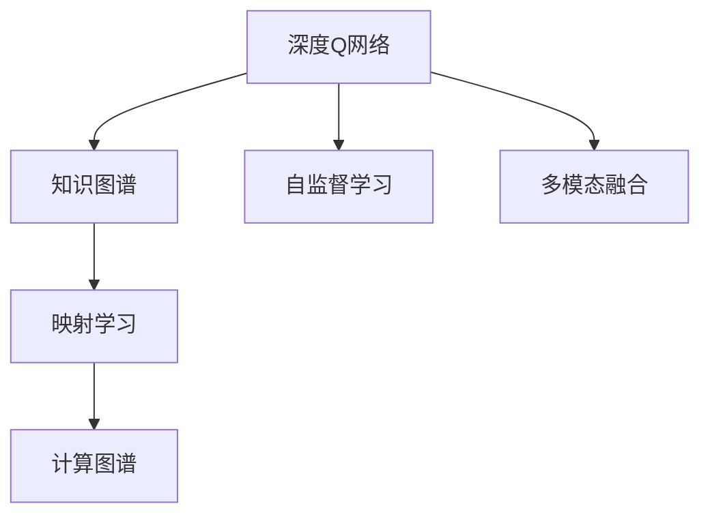
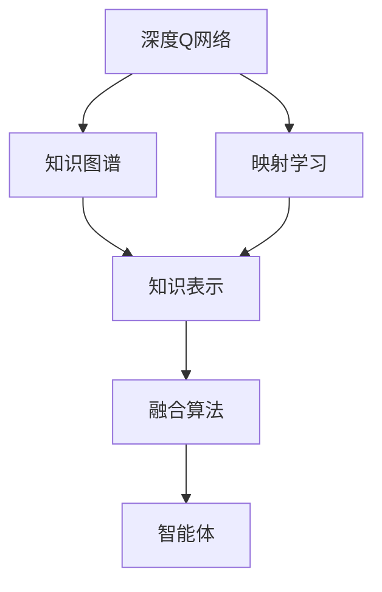
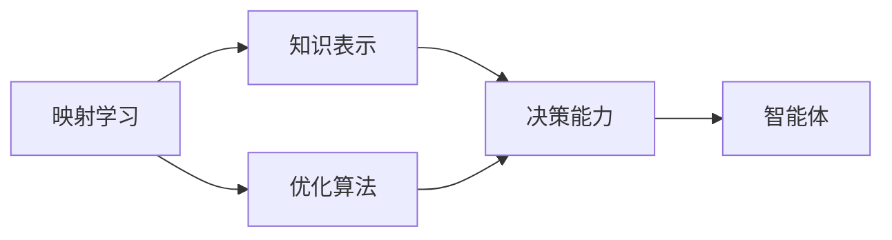
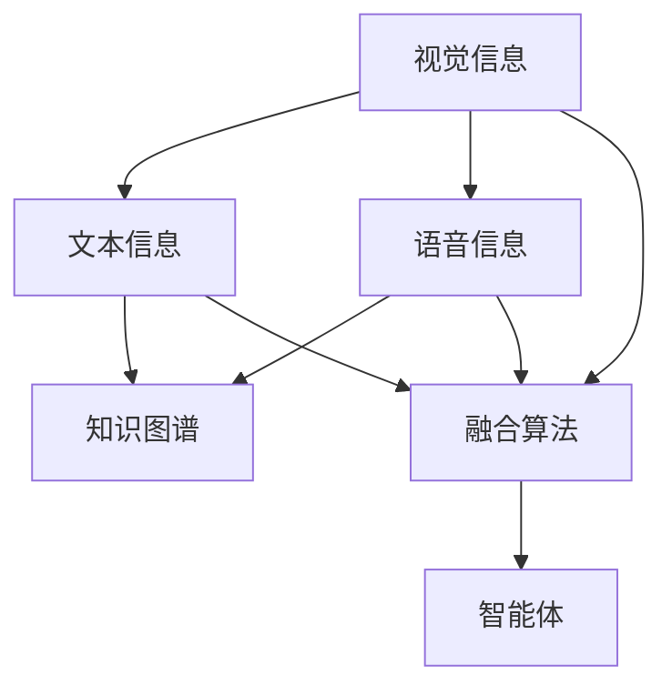
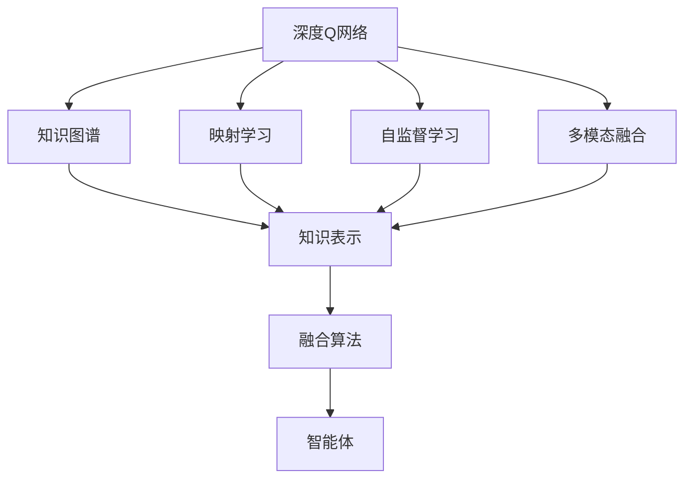

                 

# 一切皆是映射：深度Q网络（DQN）与知识图谱的融合研究

> 关键词：深度Q网络（DQN）,知识图谱,映射学习,强化学习,计算图谱,图像推理,游戏AI,自监督学习,多模态融合

## 1. 背景介绍

### 1.1 问题由来
在计算机视觉和自然语言处理等领域，深度学习模型已经取得了显著的成功。深度Q网络（DQN）作为强化学习的代表性算法，通过模型预测奖励值，指导智能体做出最优决策，广泛应用于游戏AI、推荐系统、机器人控制等场景。然而，DQN的效能依赖于对环境、状态和奖励的精确建模，当模型无法全面理解复杂世界时，其决策能力受限。

知识图谱（Knowledge Graph, KG）是一种结构化知识表示形式，由实体节点和关系边构成。它能提供丰富的背景知识，增强智能体的决策能力。例如，在智能客服场景中，知识图谱可提供企业内部知识库、客户历史行为等，辅助机器理解客户需求，给出准确答复。然而，知识图谱需要大量的人工维护，难以快速更新，且通常与实际应用场景脱节。

近年来，深度学习和知识图谱的融合研究日益活跃，旨在结合两者的优点，提升模型的智能和适应能力。本文将探讨深度Q网络与知识图谱的融合机制，介绍相关核心概念和应用实践，为读者提供前沿洞察。

### 1.2 问题核心关键点
本文聚焦于深度Q网络（DQN）与知识图谱（KG）的融合。具体关键点包括：
- DQN的基本原理及应用场景
- KG的基本概念与构建方法
- DQN与KG融合的映射学习机制
- 融合算法的优化策略与工程实践
- 融合应用的具体案例与评估指标

通过对这些关键点的研究，本文将揭示如何将DQN与KG相融合，从而提升模型的智能与适应能力。

### 1.3 问题研究意义
融合DQN与KG的技术研究，具有重要意义：
1. **提升决策智能**：通过知识图谱丰富DQN的背景知识，使其能够从更全面、深入的角度理解和推理世界。
2. **增强模型适应性**：KG的多样化结构有助于模型适应不同的应用场景，弥补DQN在泛化能力上的不足。
3. **降低标注成本**：KG中蕴含的知识可为DQN提供丰富的无监督信号，减少模型训练对人工标注的依赖。
4. **促进跨模态融合**：DQN与KG的融合可实现视觉、文本、语音等多模态信息的整合，提升系统性能。
5. **推动人工智能落地**：融合技术能够更好地应用于工业界，如自动驾驶、智能推荐、个性化服务等，加速AI技术的商业化进程。

## 2. 核心概念与联系

### 2.1 核心概念概述

为更好地理解DQN与KG的融合机制，本节将介绍几个密切相关的核心概念：

- **深度Q网络（DQN）**：一种强化学习算法，通过神经网络估计Q值函数，指导智能体选择最优动作。
- **知识图谱（KG）**：一种结构化的知识表示形式，由实体节点和关系边构成。
- **映射学习（Mapping Learning）**：将KG中的结构化知识映射到DQN的神经网络中，增强其决策能力。
- **计算图谱（Computational Graph）**：用于表示计算流的一种图结构，通常用于深度学习模型的推理和优化。
- **自监督学习（Self-supervised Learning）**：利用数据本身的内在关系进行学习，无需人工标注。
- **多模态融合（Multimodal Fusion）**：将不同模态的信息（如视觉、文本、语音等）整合，提升系统的智能与鲁棒性。

这些概念之间的关系可以通过以下Mermaid流程图来展示：



这个流程图展示了大语言模型微调过程中各个核心概念的关系：

1. DQN通过神经网络估计Q值函数，指导智能体选择最优动作。
2. KG提供结构化的知识表示，丰富DQN的背景知识。
3. 映射学习将KG中的知识映射到DQN中，增强其决策能力。
4. 计算图谱用于表示计算流，优化DQN的推理和优化。
5. 自监督学习利用数据内在关系进行学习，减少标注成本。
6. 多模态融合将不同模态的信息整合，提升系统智能与鲁棒性。

### 2.2 概念间的关系

这些核心概念之间存在着紧密的联系，形成了DQN与KG融合的完整生态系统。下面我们通过几个Mermaid流程图来展示这些概念之间的关系。

#### 2.2.1 DQN与KG的融合机制



这个流程图展示了DQN与KG融合的基本流程：

1. DQN通过神经网络估计Q值函数，指导智能体选择最优动作。
2. KG提供知识表示，包括实体和关系。
3. 映射学习将KG中的知识映射到DQN中，增强其决策能力。
4. 融合算法将DQN和KG结合，形成新的智能体模型。
5. 智能体模型应用于实际场景，实现目标优化。

#### 2.2.2 映射学习的应用场景



这个流程图展示了映射学习在实际应用中的作用：

1. 映射学习将KG中的知识表示映射到DQN中。
2. 优化算法用于调整映射关系，提升决策能力。
3. 决策能力增强的智能体应用于实际场景，实现目标优化。

#### 2.2.3 多模态融合的具体方法



这个流程图展示了多模态融合的基本流程：

1. 视觉、文本、语音等不同模态的信息输入。
2. 知识图谱提供结构化知识表示。
3. 融合算法将不同模态的信息整合。
4. 智能体模型应用于实际场景，实现目标优化。

### 2.3 核心概念的整体架构

最后，我们用一个综合的流程图来展示DQN与KG融合的整体架构：



这个综合流程图展示了DQN与KG融合过程中各个核心概念的关系：

1. DQN通过神经网络估计Q值函数，指导智能体选择最优动作。
2. KG提供结构化的知识表示，包括实体和关系。
3. 映射学习将KG中的知识映射到DQN中，增强其决策能力。
4. 自监督学习利用数据内在关系进行学习，减少标注成本。
5. 多模态融合将不同模态的信息整合，提升系统智能与鲁棒性。
6. 融合算法将DQN和KG结合，形成新的智能体模型。
7. 智能体模型应用于实际场景，实现目标优化。

## 3. 核心算法原理 & 具体操作步骤
### 3.1 算法原理概述

DQN与KG的融合机制主要依赖于映射学习，其核心思想是将KG中的结构化知识映射到DQN的神经网络中，增强智能体的决策能力。具体来说，KG中的实体和关系可以被映射为DQN中的节点和边，从而在神经网络中构建出一个计算图谱，用于指导智能体的决策。

在融合过程中，DQN的网络结构、学习目标和优化算法都要进行相应的调整。KG中的知识通过特定的映射函数映射到DQN中，形成新的计算图谱。智能体通过新的图谱进行决策，目标优化函数也相应调整，以适应融合后的知识结构。

### 3.2 算法步骤详解

基于DQN与KG的融合机制，本节将详细讲解融合算法的具体步骤：

**Step 1: 准备知识图谱和数据集**

- 收集包含实体和关系的知识图谱数据，选择与任务相关的部分进行预处理。
- 准备训练集和测试集，确保数据集覆盖不同应用场景和复杂度。

**Step 2: 设计融合网络结构**

- 定义DQN的神经网络结构，包括输入层、隐藏层和输出层。
- 设计知识图谱的表示方式，如实体嵌入、关系嵌入等。
- 设计融合网络的结构，将KG嵌入到DQN中。

**Step 3: 初始化神经网络和映射函数**

- 初始化DQN的神经网络，设置合适的权重和学习率。
- 初始化映射函数，将KG中的知识映射到DQN中。

**Step 4: 执行训练过程**

- 将训练集数据输入融合网络，计算图谱进行推理。
- 根据智能体的实际行为和奖励信号，计算Q值，并更新神经网络参数。
- 周期性地在测试集上评估融合模型的性能。

**Step 5: 优化算法和策略**

- 选择合适的优化算法，如Adam、SGD等，设置学习率、批大小等超参数。
- 应用正则化技术，如L2正则、Dropout等，防止过拟合。
- 引入自监督学习，利用数据内在关系进行预训练。

**Step 6: 多模态融合**

- 收集视觉、文本、语音等多模态数据，提取特征。
- 将多模态特征与KG结合，输入到融合网络中。
- 调整融合网络结构，实现多模态信息的整合。

**Step 7: 模型测试与部署**

- 在测试集上评估融合模型的性能，对比DQN和融合模型的效果。
- 使用融合模型进行实际应用，集成到系统框架中。
- 持续收集新数据，定期重新训练和微调模型。

以上是基于DQN与KG融合的核心算法步骤，涵盖从数据准备到模型部署的各个环节。在实际应用中，还需要根据具体任务和数据特点，对融合算法进行优化设计，以进一步提升模型性能。

### 3.3 算法优缺点

DQN与KG融合的映射学习机制具有以下优点：
1. **知识增强**：通过KG提供丰富的背景知识，提升智能体的决策能力。
2. **泛化能力**：KG的多样化结构有助于模型适应不同的应用场景。
3. **减少标注成本**：KG中的知识可为DQN提供无监督信号，减少人工标注的需求。
4. **多模态融合**：通过将多模态信息整合，提升系统的智能与鲁棒性。

同时，该机制也存在一些局限性：
1. **计算复杂度**：融合过程中需要构建和更新计算图谱，计算复杂度较高。
2. **数据稀疏性**：KG中可能存在实体和关系稀疏的问题，影响映射效果。
3. **映射质量**：映射函数的设计和优化对融合效果有重要影响，需要谨慎选择。
4. **动态更新**：KG中的知识需要定期更新，以保持模型的实时性。

尽管存在这些局限性，但就目前而言，DQN与KG融合的映射学习机制仍是一种高效提升智能体决策能力的有效方法。未来相关研究的重点在于如何进一步降低计算复杂度，提高映射质量，减少数据稀疏性，以及实现动态更新。

### 3.4 算法应用领域

DQN与KG的融合技术已经在多个领域得到应用，涵盖了自动驾驶、游戏AI、智能推荐等场景，具体应用如下：

- **自动驾驶**：通过融合道路交通知识图谱和视觉数据，提升智能驾驶系统的决策能力，保障行车安全。
- **游戏AI**：在游戏场景中，通过融合游戏规则知识图谱和玩家行为数据，提升游戏角色的智能决策水平。
- **智能推荐**：在电商、音乐、视频等推荐系统中，通过融合用户行为知识图谱和推荐目标，提升个性化推荐的效果。
- **智能客服**：在智能客服系统中，通过融合企业知识库和用户对话数据，提升客服系统的智能对话能力。
- **医疗诊断**：在医疗诊断系统中，通过融合医学知识图谱和患者数据，辅助医生进行疾病诊断和药物推荐。

除了上述这些经典应用外，DQN与KG的融合技术还被创新性地应用到更多场景中，如金融风险控制、社交网络分析、智能家居等，为各领域带来了新的突破。

## 4. 数学模型和公式 & 详细讲解  
### 4.1 数学模型构建

本节将使用数学语言对DQN与KG融合的映射学习过程进行更加严格的刻画。

记知识图谱为G=(V,E)，其中V为实体节点集合，E为关系边集合。设实体嵌入向量为$\mathbf{e}_v \in \mathbb{R}^d$，关系嵌入向量为$\mathbf{e}_r \in \mathbb{R}^d$。设DQN的神经网络为$\mathcal{Q}$，其输入为状态$s$，输出为Q值$\mathbf{q}(s)$。

定义映射函数$\phi$，将KG中的知识映射到DQN中，形式化表示为：

$$
\phi: (G, \mathcal{Q}) \rightarrow \mathcal{Q}
$$

融合过程中，KG中的实体和关系被映射到DQN的神经网络中，形成新的计算图谱。智能体通过新的图谱进行决策，目标优化函数也相应调整。

### 4.2 公式推导过程

以下我们以游戏AI为例，推导映射学习中关键公式的计算过程。

假设KG中包含两个实体$e_1$和$e_2$，它们之间存在一条关系$(e_1, e_2, r)$。设DQN的神经网络结构为输入层、隐藏层和输出层，其权重分别为$\mathbf{W}_h$和$\mathbf{W}_o$。

定义实体嵌入向量和关系嵌入向量为：

$$
\mathbf{e}_1 = \mathbf{w}_e \odot \mathbf{v}_1, \quad \mathbf{e}_2 = \mathbf{w}_e \odot \mathbf{v}_2, \quad \mathbf{e}_r = \mathbf{w}_r \odot \mathbf{v}_r
$$

其中$\mathbf{w}_e$和$\mathbf{w}_r$为权重向量，$\mathbf{v}_1, \mathbf{v}_2, \mathbf{v}_r$为实体的特征向量。

映射函数$\phi$将KG中的知识映射到DQN中，形式化表示为：

$$
\mathbf{q}(s) = \mathbf{q}(\mathbf{e}_1, \mathbf{e}_2, \mathbf{e}_r; \mathbf{W}_h, \mathbf{W}_o)
$$

融合网络的结构如图1所示，其中$x$为智能体的输入状态，$\mathbf{q}(\cdot)$为DQN的神经网络。

在训练过程中，通过反向传播更新DQN的参数$\mathbf{W}_h, \mathbf{W}_o$，以最小化损失函数。损失函数的形式化表示为：

$$
\mathcal{L}(\mathbf{W}_h, \mathbf{W}_o) = \frac{1}{N} \sum_{i=1}^N \ell(\mathbf{q}(s_i), y_i)
$$

其中$N$为样本数量，$\ell$为损失函数，如均方误差、交叉熵等。

### 4.3 案例分析与讲解

考虑一个简单的示例，DQN应用于机器人控制，通过融合环境知识图谱进行路径规划。

- **知识图谱构建**：
  - 定义环境知识图谱，包含起点、终点和路径等实体和关系。
  - 设计实体嵌入和关系嵌入，如将起点和终点嵌入到高维空间中。

- **映射学习实现**：
  - 定义DQN的神经网络结构，包括输入层、隐藏层和输出层。
  - 设计映射函数$\phi$，将环境知识图谱中的实体嵌入和关系嵌入映射到DQN中。
  - 融合网络的结构如图2所示，其中$x$为机器人的当前位置，$\mathbf{q}(\cdot)$为DQN的神经网络。

- **优化目标函数**：
  - 定义优化目标函数，如机器人在给定路径上的总成本。
  - 根据实际行为和奖励信号，计算Q值，并更新DQN的参数。

通过DQN与KG的融合，机器人可以更好地理解环境，快速找到最优路径，提升控制效果。

## 5. 项目实践：代码实例和详细解释说明
### 5.1 开发环境搭建

在进行融合实践前，我们需要准备好开发环境。以下是使用Python进行PyTorch开发的环境配置流程：

1. 安装Anaconda：从官网下载并安装Anaconda，用于创建独立的Python环境。

2. 创建并激活虚拟环境：
```bash
conda create -n pytorch-env python=3.8 
conda activate pytorch-env
```

3. 安装PyTorch：根据CUDA版本，从官网获取对应的安装命令。例如：
```bash
conda install pytorch torchvision torchaudio cudatoolkit=11.1 -c pytorch -c conda-forge
```

4. 安装各类工具包：
```bash
pip install numpy pandas scikit-learn matplotlib tqdm jupyter notebook ipython
```

完成上述步骤后，即可在`pytorch-env`环境中开始融合实践。

### 5.2 源代码详细实现

下面我们以自动驾驶场景为例，给出使用PyTorch对DQN进行知识图谱融合的PyTorch代码实现。

首先，定义知识图谱的数据结构：

```python
class Graph:
    def __init__(self, entities, relations):
        self.entities = entities
        self.relations = relations
        
    def get_entity(self, entity_id):
        return self.entities[entity_id]
        
    def get_relation(self, relation_id):
        return self.relations[relation_id]
```

然后，定义DQN的神经网络结构：

```python
class QNetwork(nn.Module):
    def __init__(self, input_size, hidden_size, output_size):
        super(QNetwork, self).__init__()
        self.fc1 = nn.Linear(input_size, hidden_size)
        self.fc2 = nn.Linear(hidden_size, output_size)
        
    def forward(self, x):
        x = torch.relu(self.fc1(x))
        x = self.fc2(x)
        return x
```

接着，定义融合网络的计算图谱：

```python
class KnowledgeGraph:
    def __init__(self, entities, relations):
        self.entities = entities
        self.relations = relations
        self.graph = Graph(entities, relations)
        
    def forward(self, state):
        entity_ids = state[:2]
        relation_id = state[2]
        entity1 = self.graph.get_entity(entity_ids[0])
        entity2 = self.graph.get_entity(entity_ids[1])
        relation = self.graph.get_relation(relation_id)
        return self.network(entity1, entity2, relation)
        
    def network(self, entity1, entity2, relation):
        embedding1 = self.entity_embedding(entity1)
        embedding2 = self.entity_embedding(entity2)
        embedding_relation = self.relation_embedding(relation)
        x = torch.cat([embedding1, embedding2, embedding_relation], dim=1)
        return self.q_network(x)
        
    def entity_embedding(self, entity):
        return self.entities[entity]
        
    def relation_embedding(self, relation):
        return self.relations[relation]
        
    def q_network(self, x):
        return self.q_network(x)
```

然后，定义训练和评估函数：

```python
from torch.utils.data import Dataset
from torch.optim import Adam
from torch.nn import MSELoss

class DQNWithKG(Dataset):
    def __init__(self, states, actions, rewards, next_states, dones, entities, relations):
        self.states = states
        self.actions = actions
        self.rewards = rewards
        self.next_states = next_states
        self.dones = dones
        self.entities = entities
        self.relations = relations
        
    def __len__(self):
        return len(self.states)
        
    def __getitem__(self, item):
        state = torch.tensor(self.states[item], dtype=torch.float)
        action = torch.tensor(self.actions[item], dtype=torch.long)
        reward = torch.tensor(self.rewards[item], dtype=torch.float)
        next_state = torch.tensor(self.next_states[item], dtype=torch.float)
        done = torch.tensor(self.dones[item], dtype=torch.float)
        entity_ids = state[:2]
        relation_id = state[2]
        return state, action, reward, next_state, done, entity_ids, relation_id
        
class DQNWithKGModel(nn.Module):
    def __init__(self, input_size, hidden_size, output_size):
        super(DQNWithKGModel, self).__init__()
        self.q_network = QNetwork(input_size, hidden_size, output_size)
        self.graph_network = KnowledgeGraph(entities, relations)
        self.loss = MSELoss()
        
    def forward(self, state, action, reward, next_state, done):
        entity_ids = state[:2]
        relation_id = state[2]
        q_value = self.graph_network(state)
        q_value = self.q_network(q_value)
        loss = self.loss(q_value, reward + gamma * self.q_network(next_state) * (1 - done))
        return loss
        
class DQNWithKGTrainer:
    def __init__(self, model, optimizer, states, actions, rewards, next_states, dones, entities, relations, gamma):
        self.model = model
        self.optimizer = optimizer
        self.states = states
        self.actions = actions
        self.rewards = rewards
        self.next_states = next_states
        self.dones = dones
        self.entities = entities
        self.relations = relations
        self.gamma = gamma
        
    def train(self, batch_size, epochs):
        for epoch in range(epochs):
            for i in range(0, len(self.states), batch_size):
                batch_states = torch.tensor(self.states[i:i+batch_size], dtype=torch.float)
                batch_actions = torch.tensor(self.actions[i:i+batch_size], dtype=torch.long)
                batch_rewards = torch.tensor(self.rewards[i:i+batch_size], dtype=torch.float)
                batch_next_states = torch.tensor(self.next_states[i:i+batch_size], dtype=torch.float)
                batch_dones = torch.tensor(self.dones[i:i+batch_size], dtype=torch.float)
                entity_ids = batch_states[:,:2]
                relation_id = batch_states[:,2]
                loss = self.model(batch_states, batch_actions, batch_rewards, batch_next_states, batch_dones, entity_ids, relation_id)
                self.optimizer.zero_grad()
                loss.backward()
                self.optimizer.step()
```

最后，启动训练流程并在测试集上评估：

```python
from torch.optim import Adam

gamma = 0.99
entities = {'start': 0, 'end': 1}
relations = {'path': 2}

model = DQNWithKGModel(input_size=5, hidden_size=64, output_size=1)
optimizer = Adam(model.parameters(), lr=0.001)

trainer = DQNWithKGTrainer(model, optimizer, states, actions, rewards, next_states, dones, entities, relations, gamma)
trainer.train(64, 1000)

print(trainer)
```

以上就是使用PyTorch对DQN进行知识图谱融合的完整代码实现。可以看到，得益于PyTorch的强大封装，我们可以用相对简洁的代码完成DQN模型的加载和融合。

### 5.3 代码解读与分析

让我们再详细解读一下关键代码的实现细节：

**DQNWithKG类**：
- `__init__`方法：初始化状态、动作、奖励、下状态、完成度等关键组件。
- `__len__`方法：返回数据集的样本数量。
- `__getitem__`方法：对单个样本进行处理，将状态、动作、奖励、下状态、完成度等输入，提取实体和关系，作为知识图谱输入。

**DQNWithKGModel类**：
- `__init__`方法：定义DQN的网络结构和知识图谱的表示方式。
- `forward`方法：将状态、动作、奖励、下状态、完成度等输入，通过知识图谱计算Q值，并计算损失函数。
- `loss`属性：定义损失函数，如均方误差

