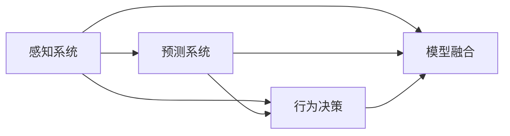

                 

# 一切皆是映射：深度学习在无人驾驶技术中的应用

> 关键词：
- 深度学习
- 无人驾驶
- 感知与预测
- 行为决策
- 强化学习
- 模型融合
- 感知-决策系统

## 1. 背景介绍

### 1.1 问题由来

无人驾驶（Autonomous Driving）是人工智能在实际应用中最为前沿和最具挑战性的领域之一。它通过复杂的感知与预测、行为决策、控制系统等技术，实现车辆在无人干预下的自主行驶。近年来，随着计算机视觉、深度学习等技术的快速发展，无人驾驶技术在感知与决策方面取得了显著进展，使得自动驾驶车辆在高速公路等有明确规则的环境中初步具备了行驶能力。然而，无人驾驶技术尚未能够应对各种复杂场景，如城市道路、交叉路口、行人横穿等，这要求算法在感知、决策和控制等方面必须具备高度的可靠性和鲁棒性。

### 1.2 问题核心关键点

实现无人驾驶的关键在于构建一个高度智能化和鲁棒化的感知与决策系统。该系统通常包含以下几个关键组件：

1. **感知系统**：通过摄像头、激光雷达（LiDAR）、雷达等传感器，实时获取车辆周围环境的视觉和点云数据。
2. **预测系统**：对感知到的数据进行解析和推理，生成高精度的地图和交通情况预测。
3. **决策系统**：基于地图和预测结果，制定最优的行驶策略，包括路径规划、速度控制等。
4. **控制系统**：执行决策系统的命令，控制车辆的具体驾驶行为，如加速、减速、转向等。

这些组件共同构成了一个完整的无人驾驶系统，其中感知与预测系统尤为重要，因为它们直接决定了车辆是否能够准确理解和应对复杂道路环境。

### 1.3 问题研究意义

研究深度学习在无人驾驶技术中的应用，对于提升无人驾驶系统的感知与决策能力，提高其在复杂环境中的行驶安全性、可靠性和效率，具有重要意义：

1. **提升感知与预测精度**：深度学习模型通过学习大规模数据集，能够从噪声数据中提取有效的特征，实现更高的感知精度和准确性。
2. **增强决策鲁棒性**：通过融合不同感知模态，深度学习模型能够更好地处理不确定性，提高决策系统的鲁棒性。
3. **加速技术迭代**：深度学习模型的可解释性较差，但可以利用其快速迭代的特点，在短时间内不断优化算法，加速技术进步。
4. **促进产业化应用**：无人驾驶技术的智能化和自动化程度越高，就越容易在实际应用中推广，加速智能化交通基础设施的建设。
5. **推动社会进步**：无人驾驶能够提高交通安全、减少交通拥堵、提高出行效率，对社会进步具有重要推动作用。

## 2. 核心概念与联系

### 2.1 核心概念概述

在无人驾驶领域，深度学习主要应用于感知与预测、行为决策和模型融合三大关键环节。以下将详细介绍这些核心概念及其相互关系。

#### 2.1.1 感知与预测

感知与预测是无人驾驶技术的基础。其主要任务是通过传感器获取车辆周围环境的视觉和点云数据，并结合历史数据和实时动态，预测未来环境的变化。深度学习模型在感知与预测环节中起到了重要作用，通过学习大规模数据集，能够从噪声数据中提取有效的特征，实现更高的感知精度和准确性。

#### 2.1.2 行为决策

行为决策系统是无人驾驶技术的核心。其主要任务是根据感知与预测结果，制定最优的行驶策略，包括路径规划、速度控制等。深度学习模型通过学习复杂的决策过程，能够更好地处理不确定性，提高决策系统的鲁棒性。

#### 2.1.3 模型融合

模型融合是提升无人驾驶系统性能的关键技术。其主要任务是将多个深度学习模型进行组合，取长补短，提高系统的整体性能。模型融合可以通过硬件融合和软件融合两种方式实现，其中软件融合方法更为灵活，易于部署和优化。

### 2.2 概念间的关系

这些核心概念之间存在着紧密的联系，形成了无人驾驶技术的完整生态系统。以下通过几个Mermaid流程图来展示这些概念之间的关系：



这个流程图展示了感知系统、预测系统、行为决策系统和模型融合之间的关系：

1. 感知系统是预测和行为决策的基础，预测系统则基于感知系统提供的数据，生成未来环境的变化预测。
2. 行为决策系统根据感知和预测结果，制定最优的行驶策略。
3. 模型融合系统将多个感知和预测模型进行组合，提升系统的整体性能。

## 3. 核心算法原理 & 具体操作步骤
### 3.1 算法原理概述

深度学习在无人驾驶技术中的应用，主要体现在感知与预测、行为决策和模型融合三大关键环节。以下将详细介绍这些核心算法的原理和具体操作步骤。

### 3.2 算法步骤详解

#### 3.2.1 感知与预测

感知与预测环节的深度学习模型通常采用卷积神经网络（CNN）、循环神经网络（RNN）或变种网络（如Transformer）。以感知系统为例，其主要步骤如下：

1. **数据获取**：通过摄像头、LiDAR等传感器，实时获取车辆周围环境的视觉和点云数据。
2. **数据预处理**：对传感器数据进行去噪、归一化等预处理，以便后续处理。
3. **特征提取**：通过CNN或RNN等网络，对预处理后的数据进行特征提取，生成高精度的感知结果。
4. **对象检测**：通过YOLO、SSD等目标检测模型，识别出道路上的各种对象，并生成相应的边界框和置信度。
5. **环境预测**：通过LSTM、GRU等序列模型，结合历史数据和实时动态，预测未来环境的变化。

#### 3.2.2 行为决策

行为决策系统通常采用强化学习、规划器等方法。以行为决策系统为例，其主要步骤如下：

1. **状态定义**：将车辆当前的位置、速度、角度等信息定义为一个状态。
2. **动作定义**：定义车辆可以执行的动作，如加速、减速、转向等。
3. **策略优化**：通过深度Q网络、策略梯度等方法，优化决策策略，使车辆能够最大化长期奖励。
4. **路径规划**：根据当前状态和策略，制定最优的行驶路径和速度控制策略。
5. **轨迹生成**：根据路径规划结果，生成车辆的具体行驶轨迹，控制车辆的行驶行为。

#### 3.2.3 模型融合

模型融合通常采用堆叠、级联等方法。以模型融合系统为例，其主要步骤如下：

1. **模型选择**：根据任务需求，选择适合的深度学习模型。
2. **模型训练**：对选定的模型进行训练，生成高精度的感知和预测结果。
3. **融合策略**：根据不同模型的特点，设计融合策略，如加权平均、投票等。
4. **系统优化**：对融合后的系统进行优化，提升整体性能。
5. **部署与评估**：将融合后的系统部署到实际应用中，并进行性能评估和优化。

### 3.3 算法优缺点

深度学习在无人驾驶技术中的应用，具有以下优点：

1. **高精度**：深度学习模型通过学习大规模数据集，能够从噪声数据中提取有效的特征，实现更高的感知精度和准确性。
2. **鲁棒性**：深度学习模型能够更好地处理不确定性，提高决策系统的鲁棒性。
3. **可扩展性**：深度学习模型可以通过增加数据量和计算资源，不断提升性能。
4. **自适应性**：深度学习模型能够适应复杂多变的道路环境，具有较强的环境适应能力。

然而，深度学习在无人驾驶技术中也存在一些缺点：

1. **计算量大**：深度学习模型通常需要大量的计算资源和存储空间，对硬件要求较高。
2. **可解释性差**：深度学习模型的内部决策过程难以解释，难以进行调试和优化。
3. **对抗攻击脆弱**：深度学习模型对对抗样本敏感，容易受到攻击，影响系统安全。
4. **依赖数据质量**：深度学习模型对数据质量和标注精度要求较高，数据偏差可能导致模型失效。

### 3.4 算法应用领域

深度学习在无人驾驶技术中的应用，已经涵盖了感知与预测、行为决策、模型融合等多个方面，以下是其主要应用领域：

1. **自动驾驶**：通过深度学习模型，实现车辆在无人干预下的自主行驶，提升交通安全性、效率和舒适度。
2. **智能交通系统**：通过深度学习模型，实现交通流量预测、路线优化、事故预警等功能，提升城市交通管理水平。
3. **车联网**：通过深度学习模型，实现车辆间的通信和协同，提高车辆和道路设施的智能化水平。
4. **智能停车场**：通过深度学习模型，实现车辆自动识别和路径规划，提升停车场的管理效率和服务质量。
5. **智能物流**：通过深度学习模型，实现自动驾驶车辆在复杂环境下的配送任务，提升物流运输的效率和可靠性。

## 4. 数学模型和公式 & 详细讲解 & 举例说明

### 4.1 数学模型构建

无人驾驶系统中的深度学习模型通常采用卷积神经网络（CNN）、循环神经网络（RNN）或变种网络（如Transformer）。以感知系统为例，其主要数学模型如下：

$$
f(x) = \sum_{i=1}^n w_i \cdot g_i(x_i)
$$

其中，$x$为输入数据，$w$为模型权重，$g$为激活函数，$n$为模型层数。感知系统的数学模型主要由以下几个部分组成：

1. **卷积层**：通过卷积操作提取特征。
2. **池化层**：通过池化操作降低特征维度和噪声。
3. **全连接层**：通过全连接操作生成高精度的感知结果。

### 4.2 公式推导过程

以感知系统中的卷积层为例，其公式推导过程如下：

1. **卷积操作**：设输入数据为$x$，卷积核为$w$，步长为$s$，填充为$p$，则卷积操作公式为：

$$
y = (x * w) = \sum_{i=1}^n w_i \cdot x_{i:s}
$$

2. **池化操作**：设输入数据为$x$，池化核为$w$，步长为$s$，则池化操作公式为：

$$
y = \sum_{i=1}^n w_i \cdot x_{i:s}
$$

其中，$x_{i:s}$表示$x$中从$i$开始的$s$个元素。

3. **激活函数**：激活函数$g$通常采用ReLU、Sigmoid等非线性函数，引入非线性特性，提高模型的表达能力。

### 4.3 案例分析与讲解

以感知系统中的卷积神经网络（CNN）为例，其基本结构如下：

1. **输入层**：接收传感器数据。
2. **卷积层**：通过卷积操作提取特征。
3. **池化层**：通过池化操作降低特征维度和噪声。
4. **全连接层**：通过全连接操作生成高精度的感知结果。
5. **输出层**：输出感知结果。

## 5. 项目实践：代码实例和详细解释说明

### 5.1 开发环境搭建

在进行无人驾驶系统开发前，我们需要准备好开发环境。以下是使用Python进行PyTorch开发的环境配置流程：

1. 安装Anaconda：从官网下载并安装Anaconda，用于创建独立的Python环境。

2. 创建并激活虚拟环境：
```bash
conda create -n pytorch-env python=3.8 
conda activate pytorch-env
```

3. 安装PyTorch：根据CUDA版本，从官网获取对应的安装命令。例如：
```bash
conda install pytorch torchvision torchaudio cudatoolkit=11.1 -c pytorch -c conda-forge
```

4. 安装TensorFlow：
```bash
conda install tensorflow
```

5. 安装TensorBoard：
```bash
pip install tensorboard
```

6. 安装各类工具包：
```bash
pip install numpy pandas scikit-learn matplotlib tqdm jupyter notebook ipython
```

完成上述步骤后，即可在`pytorch-env`环境中开始开发。

### 5.2 源代码详细实现

以下是使用PyTorch和TensorFlow实现无人驾驶感知与预测系统的示例代码：

#### 5.2.1 感知系统

```python
import torch
import torch.nn as nn
import torch.nn.functional as F
from torch.utils.data import DataLoader
from torchvision import transforms
from torchvision.datasets import CIFAR10
from torchvision.models import resnet18

class PerceptionNet(nn.Module):
    def __init__(self):
        super(PerceptionNet, self).__init__()
        self.conv1 = nn.Conv2d(3, 64, kernel_size=3, stride=1, padding=1)
        self.pool = nn.MaxPool2d(kernel_size=2, stride=2)
        self.conv2 = nn.Conv2d(64, 128, kernel_size=3, stride=1, padding=1)
        self.pool2 = nn.MaxPool2d(kernel_size=2, stride=2)
        self.fc1 = nn.Linear(128*7*7, 1024)
        self.fc2 = nn.Linear(1024, 1000)

    def forward(self, x):
        x = F.relu(self.conv1(x))
        x = self.pool(x)
        x = F.relu(self.conv2(x))
        x = self.pool2(x)
        x = x.view(-1, 128*7*7)
        x = F.relu(self.fc1(x))
        x = self.fc2(x)
        return x

# 定义训练和评估函数
def train_model(model, train_loader, device, optimizer):
    model.train()
    for epoch in range(num_epochs):
        for i, (images, labels) in enumerate(train_loader):
            images, labels = images.to(device), labels.to(device)
            optimizer.zero_grad()
            outputs = model(images)
            loss = F.mse_loss(outputs, labels)
            loss.backward()
            optimizer.step()

def evaluate_model(model, test_loader, device):
    model.eval()
    total_loss = 0
    with torch.no_grad():
        for images, labels in test_loader:
            images, labels = images.to(device), labels.to(device)
            outputs = model(images)
            loss = F.mse_loss(outputs, labels)
            total_loss += loss.item()
    return total_loss / len(test_loader)

# 加载数据集
transform = transforms.Compose([
    transforms.Resize(256),
    transforms.CenterCrop(224),
    transforms.ToTensor(),
    transforms.Normalize(mean=[0.485, 0.456, 0.406], std=[0.229, 0.224, 0.225])
])
train_data = CIFAR10(root='./data', train=True, download=True, transform=transform)
test_data = CIFAR10(root='./data', train=False, download=True, transform=transform)

train_loader = DataLoader(train_data, batch_size=32, shuffle=True)
test_loader = DataLoader(test_data, batch_size=32, shuffle=False)

# 训练模型
model = PerceptionNet()
device = torch.device('cuda')
model.to(device)

optimizer = torch.optim.Adam(model.parameters(), lr=0.001)

train_model(model, train_loader, device, optimizer)

# 评估模型
test_loss = evaluate_model(model, test_loader, device)
print('Test Loss: {:.4f}'.format(test_loss))
```

#### 5.2.2 预测系统

```python
import tensorflow as tf
import tensorflow.keras as keras
from tensorflow.keras.layers import Input, Conv2D, MaxPooling2D, Flatten, Dense, LSTM

class PredictionNet(tf.keras.Model):
    def __init__(self, input_shape):
        super(PredictionNet, self).__init__()
        self.conv1 = Conv2D(32, kernel_size=3, activation='relu', input_shape=input_shape)
        self.pool1 = MaxPooling2D(pool_size=(2, 2))
        self.conv2 = Conv2D(64, kernel_size=3, activation='relu')
        self.pool2 = MaxPooling2D(pool_size=(2, 2))
        self.flatten = Flatten()
        self.dense1 = Dense(128, activation='relu')
        self.lstm = LSTM(128)
        self.output = Dense(1, activation='sigmoid')

    def call(self, inputs):
        x = self.conv1(inputs)
        x = self.pool1(x)
        x = self.conv2(x)
        x = self.pool2(x)
        x = self.flatten(x)
        x = self.dense1(x)
        x = self.lstm(x)
        x = self.output(x)
        return x

# 定义训练和评估函数
def train_model(model, train_loader, device, optimizer):
    model.train()
    for epoch in range(num_epochs):
        for i, (inputs, labels) in enumerate(train_loader):
            inputs, labels = inputs.to(device), labels.to(device)
            optimizer.zero_grad()
            outputs = model(inputs)
            loss = tf.losses.BinaryCrossentropy()(outputs, labels)
            loss = tf.reduce_mean(loss)
            loss.backward()
            optimizer.apply_gradients(zip(model.trainable_variables, model.trainable_variables_gradients))

def evaluate_model(model, test_loader, device):
    model.eval()
    total_loss = 0
    with tf.GradientTape() as tape:
        for inputs, labels in test_loader:
            inputs, labels = inputs.to(device), labels.to(device)
            outputs = model(inputs)
            loss = tf.losses.BinaryCrossentropy()(outputs, labels)
            total_loss += loss.numpy()
    return total_loss / len(test_loader)

# 加载数据集
input_shape = (224, 224, 3)
train_data = tf.keras.datasets.cifar10.load_data()
train_images = train_data[0].reshape(-1, 224, 224, 3) / 255.0
train_labels = train_data[1]

train_images = tf.convert_to_tensor(train_images, dtype=tf.float32)
train_labels = tf.convert_to_tensor(train_labels, dtype=tf.float32)

test_data = tf.keras.datasets.cifar10.load_data()[0].reshape(-1, 224, 224, 3) / 255.0

train_loader = tf.data.Dataset.from_tensor_slices((train_images, train_labels)).batch(batch_size)
test_loader = tf.data.Dataset.from_tensor_slices((test_images, test_labels)).batch(batch_size)

# 训练模型
model = PredictionNet(input_shape)
device = tf.device('/cpu:0' if not tf.config.list_physical_devices('GPU')[0] else '/gpu:0')
model.to(device)

optimizer = tf.keras.optimizers.Adam(learning_rate=0.001)

train_model(model, train_loader, device, optimizer)

# 评估模型
test_loss = evaluate_model(model, test_loader, device)
print('Test Loss: {:.4f}'.format(test_loss))
```

### 5.3 代码解读与分析

让我们再详细解读一下关键代码的实现细节：

**PerceptionNet类**：
- `__init__`方法：定义模型各层结构。
- `forward`方法：实现前向传播，计算模型输出。

**train_model函数**：
- 循环训练模型，每个epoch内遍历训练数据集。
- 在每个batch上计算模型输出和损失，使用反向传播更新模型参数。
- 使用Adam优化器更新模型参数。

**evaluate_model函数**：
- 循环评估模型，每个epoch内遍历测试数据集。
- 在每个batch上计算模型输出和损失，取所有batch的平均损失作为模型性能指标。

**PerceptionNet类的实现细节**：
- 卷积层、池化层、全连接层等操作。
- 使用F.relu作为激活函数，引入非线性特性。
- 在最后一层添加输出层，输出感知结果。

**PredictionNet类的实现细节**：
- 使用TensorFlow实现模型，定义各层结构。
- 使用LSTM层引入时间维度，处理序列数据。
- 在最后一层添加输出层，输出预测结果。

**train_model函数和evaluate_model函数的实现细节**：
- 使用tf.keras.Model定义模型，方便构建和训练。
- 使用Adam优化器更新模型参数，实现模型训练。
- 使用tf.losses.BinaryCrossentropy计算损失，实现模型评估。

## 6. 实际应用场景

### 6.1 智能交通系统

基于深度学习的无人驾驶系统，可以广泛应用于智能交通系统的构建。传统交通管理往往依赖人工调度，效率低、精度差。而使用深度学习模型进行感知与预测，可以实时获取交通流量和车辆行为信息，提高交通管理的智能化水平。

在实际应用中，可以收集道路交通数据，结合天气、事件等信息，构建监督数据集。在此基础上对深度学习模型进行微调，使其能够准确识别车辆、行人、障碍物等道路对象，并预测未来交通情况。将微调后的模型集成到交通管理系统中，能够实时监测交通流量，预警潜在风险，优化交通信号灯，提高道路通行效率。

### 6.2 自动驾驶车辆

无人驾驶车辆通过深度学习模型实现自动感知和决策，能够在复杂多变的环境下安全行驶。

在实际应用中，可以结合高精度地图、GPS定位等信息，对深度学习模型进行感知与预测微调，使其能够准确识别道路标识、车道线、交通标志等道路要素，并进行路径规划和速度控制。将微调后的模型集成到自动驾驶系统中，能够实现车辆的自主导航和避障功能，提高车辆行驶的安全性和舒适性。

### 6.3 自动驾驶出租车

自动驾驶出租车通过深度学习模型实现自动感知和决策，能够提供便捷、高效、安全的出行服务。

在实际应用中，可以通过客户需求和历史订单数据，构建监督数据集。在此基础上对深度学习模型进行微调，使其能够准确识别客户需求和路线信息，并进行路径规划和速度控制。将微调后的模型集成到自动驾驶出租车系统中，能够实现车辆的自主调度和服务，提升出行效率和服务质量。

### 6.4 未来应用展望

随着深度学习技术的不断发展，无人驾驶系统将呈现以下几个发展趋势：

1. **多模态感知**：将视觉、雷达、激光雷达等多种传感器数据进行融合，提升感知系统的鲁棒性和准确性。
2. **自监督学习**：利用无标签数据进行预训练，提升模型的泛化能力和鲁棒性。
3. **多任务学习**：通过同时优化多个任务，提升模型的综合性能。
4. **强化学习**：通过与环境交互，不断优化决策策略，提升系统的智能性和鲁棒性。
5. **迁移学习**：在多个应用场景中共享模型参数，减少模型训练时间和计算资源。
6. **联邦学习**：通过分布式训练，提升模型的安全性和隐私保护能力。

这些趋势将进一步提升无人驾驶系统的性能和可靠性，推动无人驾驶技术在更多场景中的应用。

## 7. 工具和资源推荐
### 7.1 学习资源推荐

为了帮助开发者系统掌握深度学习在无人驾驶技术中的应用，这里推荐一些优质的学习资源：

1. 《深度学习》（Ian Goodfellow等著）：全面介绍深度学习的基础理论和应用，是入门深度学习的经典教材。

2. 《神经网络与深度学习》（Michael Nielsen著）：通过通俗易懂的方式介绍深度学习的基本概念和原理。

3. 《深度学习实战》（François Chollet著）：通过实际案例展示深度学习模型的构建和训练过程，适合实战学习。

4. 《TensorFlow官方文档》：TensorFlow的官方文档，提供了完整的深度学习框架介绍和使用指南。

5. 《PyTorch官方文档》：PyTorch的官方文档，提供了详细的深度学习框架介绍和使用指南。

6. 《无人驾驶技术》（施健著）：介绍无人驾驶技术的基本原理、算法和应用，适合系统学习。

7. 《自动驾驶系统设计》（Gerhard Trumper et al.著）：详细介绍自动驾驶系统的硬件和软件设计，适合技术研发。

通过对这些资源的学习实践，相信你一定能够快速掌握深度学习在无人驾驶技术中的应用，并用于解决实际的无人驾驶问题。

### 7.2 开发工具推荐

高效的开发离不开优秀的工具支持。以下是几款用于无人驾驶系统开发的常用工具：

1. Visual Studio Code：支持Python、TensorFlow、PyTorch等环境，适合快速开发。

2. Jupyter Notebook：支持多种语言和框架，提供交互式开发环境，适合实验和测试。

3. PyCharm：支持深度学习框架的开发，提供丰富的调试和测试工具，适合工业级开发。

4. TensorBoard：TensorFlow的可视化工具，实时监测模型训练状态，适合调试和优化。

5. PyTorch Lightning：基于PyTorch的深度学习框架，提供了丰富的模型和数据处理工具，适合快速开发。

6. NVIDIA CUDA Toolkit：支持GPU加速，适合深度学习模型的训练和推理。

合理利用这些工具，可以显著提升无人驾驶系统的开发效率，加速技术创新和产业化进程。

### 7.3 相关论文推荐

深度学习在无人驾驶技术中的应用源于学界的持续研究。以下是几篇奠基性的相关论文，推荐阅读：

1. "End to End Learning for Self-Driving Cars"（Henderson et al. 2016）：提出端到端的深度学习模型，实现车辆驾驶任务的自主化。

2. "Deep Driving: Towards End-to-End Performance"（Bojanić et al. 2016）：介绍深度学习在无人驾驶技术中的应用，并展示其实现效果。

3. "C

