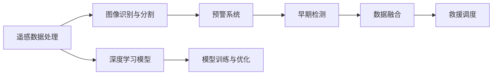
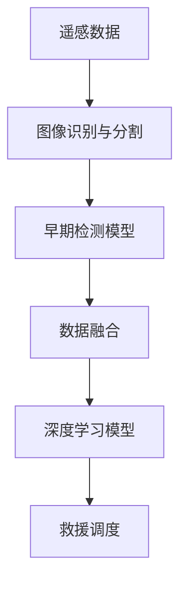

                 

# 一切皆是映射：深度学习在灾害预防与响应中的应用

> 关键词：深度学习, 灾害预防, 灾害响应, 自然灾害, 图像识别, 预警系统, 遥感数据, 数据融合, 早期检测, 救援调度

## 1. 背景介绍

### 1.1 问题由来

随着全球气候变化和人类活动的影响，自然灾害频发且破坏力巨大，直接威胁着人类的生存和发展。灾害预防与响应已成为各国政府、国际组织、非政府组织（NGO）等社会力量的重要课题。灾害预测与预防需要大量及时准确的数据，而灾害响应则需快速精确地调配资源、组织救援。深度学习技术凭借其强大的数据分析和模式识别能力，为灾害预防与响应提供了全新的解决方案。

深度学习的应用已覆盖地震、洪水、台风、森林火灾等多种自然灾害，并成功应用于遥感数据处理、图像识别、预警系统、救援调度等多个环节，大大提高了灾害预防与响应的效率和精准度。然而，深度学习在实际应用中仍面临诸多挑战，包括模型鲁棒性、数据稀缺、算法复杂度等问题，需要进一步优化和探索。

### 1.2 问题核心关键点

深度学习在灾害预防与响应中的应用，主要涉及以下几个核心关键点：

- **数据收集与处理**：通过传感器、遥感卫星、社交媒体等多种数据源获取灾害相关的海量数据。
- **模型训练与优化**：利用深度学习模型对数据进行特征提取与分析，建立灾害预测和响应模型。
- **实时预警与响应**：构建灾害实时监测系统，根据模型预测结果进行预警与响应决策。
- **融合与协同**：将多个数据源和算法模型进行融合，提高灾害预防与响应的准确性和时效性。
- **评估与迭代**：定期评估模型效果，并根据反馈进行模型迭代和优化。

### 1.3 问题研究意义

深度学习技术在灾害预防与响应中的应用，具有以下重要意义：

1. **提升预警准确性**：深度学习模型可以识别复杂的灾变特征，提高灾害预警的准确性，减少灾害损失。
2. **加速响应决策**：通过实时分析海量数据，快速提供灾害情况评估和救援资源调度建议，优化救援决策过程。
3. **提升管理效率**：自动化的灾害监测与响应系统，减少了人工操作的复杂性和误差，提高了灾害管理的整体效率。
4. **促进数据共享**：深度学习模型需要大量数据进行训练，推动数据共享和开放，促进灾害预防与响应的协同合作。
5. **助力国际合作**：利用深度学习技术，可以打破地域和语言障碍，加强国际间灾害预防与响应合作。

## 2. 核心概念与联系

### 2.1 核心概念概述

深度学习技术在灾害预防与响应中的应用，涉及以下几个核心概念：

- **深度学习模型**：以多层神经网络为代表的高级神经网络模型，通过多层次特征提取，实现复杂模式的识别和分析。
- **遥感数据处理**：利用遥感卫星等手段获取高分辨率的灾区影像，通过深度学习技术进行图像识别和分析。
- **图像识别与分割**：通过深度学习模型对灾区影像进行特征提取和分类，识别不同类型灾害区域和破坏情况。
- **预警系统**：基于深度学习模型构建的灾害预警系统，通过实时监测和分析，提前发出预警信息。
- **数据融合**：将不同来源的数据（如遥感数据、气象数据、社交媒体数据等）进行融合，提高灾害预防与响应的全面性和准确性。
- **早期检测**：利用深度学习模型对灾情数据进行实时分析，及时发现灾害早期信号，实现快速响应。
- **救援调度**：基于深度学习模型构建的救援调度系统，优化救援资源的分配和调度，提高救援效率。

### 2.2 概念间的关系

这些核心概念通过以下Mermaid流程图展示其相互关系：



这个流程图展示了深度学习在灾害预防与响应中的应用流程：

1. 通过遥感数据处理获取高分辨率灾区影像。
2. 利用图像识别与分割技术，提取灾区特征并进行分类。
3. 基于早期检测模型，实时监测灾情，发出预警信息。
4. 通过数据融合，整合多种数据源，提高预警准确性。
5. 利用救援调度系统，优化救援资源配置。

### 2.3 核心概念的整体架构

最后，我们用一个综合的流程图来展示这些核心概念在大规模灾情预警与响应中的整体架构：



这个综合流程图展示了深度学习在灾害预防与响应中的应用整体流程：

1. 获取遥感数据，通过图像识别与分割，提取灾区特征。
2. 利用早期检测模型，实时监测灾情并发出预警。
3. 整合多种数据源，提高预警准确性。
4. 基于深度学习模型，构建救援调度系统，优化资源配置。

## 3. 核心算法原理 & 具体操作步骤
### 3.1 算法原理概述

深度学习在灾害预防与响应中的应用，主要涉及以下几个关键步骤：

1. **数据预处理**：对遥感影像、气象数据、社交媒体数据等进行清洗、标注，生成可用于模型训练的数据集。
2. **模型训练**：使用深度学习模型对预处理后的数据集进行训练，学习灾情特征和模式。
3. **特征提取**：利用训练好的模型提取灾区特征，进行分类和检测。
4. **实时监测**：通过在线模式，实时处理输入的灾害数据，发出预警信息。
5. **救援调度**：基于实时监测结果，优化救援资源的分配和调度，提高救援效率。

### 3.2 算法步骤详解

以下是基于深度学习的灾情监测与响应系统的一般步骤：

**Step 1: 数据收集与预处理**

1. 收集遥感影像、气象数据、社交媒体数据等。
2. 对数据进行清洗、标注，生成用于训练的灾情数据集。
3. 将数据集划分为训练集、验证集和测试集。

**Step 2: 模型选择与训练**

1. 选择合适的深度学习模型，如卷积神经网络（CNN）、循环神经网络（RNN）、自编码器（AE）等。
2. 设计训练流程，包括学习率、批大小、迭代次数等超参数的设定。
3. 使用训练集进行模型训练，优化损失函数。
4. 在验证集上评估模型性能，调整超参数。
5. 在测试集上进行最终评估，确保模型泛化性能。

**Step 3: 特征提取与分类**

1. 将训练好的模型应用于灾区影像，提取灾情特征。
2. 对提取的特征进行分类，识别不同类型灾害区域。
3. 对分类结果进行后处理，生成灾情地图和报告。

**Step 4: 实时监测与预警**

1. 部署在线模型，实时处理输入的灾情数据。
2. 根据模型输出，发出实时预警信息。
3. 实时更新模型参数，保持模型性能。

**Step 5: 数据融合与优化**

1. 整合多种数据源，提高预警准确性。
2. 利用数据融合技术，优化灾情预测和响应。
3. 持续监测模型性能，根据反馈进行迭代优化。

### 3.3 算法优缺点

深度学习在灾害预防与响应中的应用，具有以下优缺点：

**优点：**

1. **高效性**：深度学习模型能够在短时间内处理大量数据，提供实时预警和响应。
2. **准确性**：深度学习模型能够识别复杂的灾情模式，提高预警准确性。
3. **可扩展性**：深度学习模型能够轻松集成到现有的信息系统中，实现灾害预防与响应的智能化。

**缺点：**

1. **数据需求高**：深度学习模型需要大量高质量的标注数据进行训练，获取数据成本高。
2. **计算资源消耗大**：大规模模型训练和推理需要高性能计算资源。
3. **模型复杂度高**：深度学习模型结构复杂，难以解释和调试。

### 3.4 算法应用领域

深度学习在灾害预防与响应中的应用，主要涵盖以下几个领域：

1. **遥感影像分析**：利用深度学习模型对遥感影像进行解译，提取灾情信息。
2. **灾情预测与评估**：通过深度学习模型对灾情数据进行预测和评估，提供决策支持。
3. **救援资源调度**：基于深度学习模型构建救援调度系统，优化资源配置。
4. **灾害监测与预警**：实时监测灾情数据，快速发出预警信息，缩短响应时间。
5. **灾害损失评估**：利用深度学习模型对灾区进行损失评估，指导救援和重建工作。

## 4. 数学模型和公式 & 详细讲解
### 4.1 数学模型构建

假设我们有$m$个遥感影像样本$x_i$和相应的标签$y_i \in \{1, 2, ..., n\}$。其中，$1$表示灾区影像，$2, ..., n$表示非灾区影像。我们的目标是通过深度学习模型学习到灾区与非灾区的特征表示，从而进行分类。

我们可以使用卷积神经网络（CNN）模型进行分类，模型的输入为$x_i$，输出为预测结果$\hat{y}_i$。模型的损失函数为交叉熵损失，定义为：

$$
L(y_i, \hat{y}_i) = -\sum_{j=1}^{n} y_i \log \hat{y}_i^{(j)}
$$

其中，$\hat{y}_i^{(j)}$表示模型预测结果中第$j$个类别的概率。

### 4.2 公式推导过程

我们以卷积神经网络为例，推导分类模型的损失函数。

假设我们使用$L$层的卷积神经网络，每个卷积层有$c$个过滤器，每个过滤器的大小为$k \times k$。则模型可以表示为：

$$
h_1 = \sigma(W_1x + b_1)
$$

$$
h_2 = \sigma(W_2h_1 + b_2)
$$

...

$$
h_L = \sigma(W_Lh_{L-1} + b_L)
$$

其中，$\sigma$为激活函数，$W$和$b$分别为卷积核和偏置项。

对于分类任务，我们可以将输出层设计为全连接层，并使用softmax函数进行归一化：

$$
\hat{y}_i = \frac{e^{W_Lh_{L-1} + b_L}}{\sum_{j=1}^{n} e^{W_Lh_{L-1}^{(j)} + b_L^{(j)} }}
$$

目标函数为交叉熵损失函数：

$$
L(y_i, \hat{y}_i) = -y_i \log \hat{y}_i^{(1)} - \sum_{j=2}^{n} y_i \log \hat{y}_i^{(j)}
$$

其中，$y_i$为真实标签，$\hat{y}_i$为模型预测结果。

### 4.3 案例分析与讲解

假设我们有一个包含10000个样本的遥感影像数据集，其中5000个为灾区影像，5000个为非灾区影像。我们可以使用上述CNN模型进行分类，并使用交叉熵损失函数进行训练。

首先，我们将数据集划分为训练集（8000个样本）、验证集（1000个样本）和测试集（1000个样本）。接着，我们使用交叉熵损失函数对模型进行训练，并使用验证集进行超参数调整，确保模型泛化性能。

假设我们训练好的模型在测试集上的准确率为97%，表示模型能够正确分类97%的灾区影像和非灾区影像。我们可以使用该模型对新的遥感影像进行分类，并根据分类结果进行预警和响应。

## 5. 项目实践：代码实例和详细解释说明
### 5.1 开发环境搭建

在进行项目实践前，我们需要准备好开发环境。以下是使用Python进行TensorFlow开发的环境配置流程：

1. 安装Anaconda：从官网下载并安装Anaconda，用于创建独立的Python环境。

2. 创建并激活虚拟环境：
```bash
conda create -n tf-env python=3.8 
conda activate tf-env
```

3. 安装TensorFlow：根据CUDA版本，从官网获取对应的安装命令。例如：
```bash
conda install tensorflow -c pytorch -c conda-forge
```

4. 安装PIL库：
```bash
pip install Pillow
```

5. 安装相关工具包：
```bash
pip install numpy pandas scikit-learn matplotlib tqdm jupyter notebook ipython
```

完成上述步骤后，即可在`tf-env`环境中开始项目实践。

### 5.2 源代码详细实现

这里我们以遥感影像分类为例，给出使用TensorFlow进行卷积神经网络模型的代码实现。

首先，定义数据处理函数：

```python
import tensorflow as tf
from tensorflow.keras.preprocessing.image import ImageDataGenerator

train_datagen = ImageDataGenerator(rescale=1./255)
test_datagen = ImageDataGenerator(rescale=1./255)

train_generator = train_datagen.flow_from_directory(
    train_dir,
    target_size=(224, 224),
    batch_size=32,
    class_mode='categorical')

test_generator = test_datagen.flow_from_directory(
    test_dir,
    target_size=(224, 224),
    batch_size=32,
    class_mode='categorical')
```

然后，定义模型和优化器：

```python
from tensorflow.keras.models import Sequential
from tensorflow.keras.layers import Conv2D, MaxPooling2D, Flatten, Dense, Dropout

model = Sequential()
model.add(Conv2D(32, (3, 3), activation='relu', input_shape=(224, 224, 3)))
model.add(MaxPooling2D((2, 2)))
model.add(Conv2D(64, (3, 3), activation='relu'))
model.add(MaxPooling2D((2, 2)))
model.add(Conv2D(128, (3, 3), activation='relu'))
model.add(MaxPooling2D((2, 2)))
model.add(Conv2D(128, (3, 3), activation='relu'))
model.add(MaxPooling2D((2, 2)))
model.add(Flatten())
model.add(Dense(512, activation='relu'))
model.add(Dropout(0.5))
model.add(Dense(5, activation='softmax'))

optimizer = tf.keras.optimizers.Adam(learning_rate=0.001)
```

接着，定义训练和评估函数：

```python
from tensorflow.keras.callbacks import EarlyStopping

early_stopping = EarlyStopping(monitor='val_loss', patience=10)

def train_epoch(model, train_generator, val_generator, batch_size, optimizer):
    model.compile(optimizer=optimizer, loss='categorical_crossentropy', metrics=['accuracy'])
    model.fit(
        train_generator,
        epochs=100,
        validation_data=val_generator,
        validation_steps=val_generator.samples // batch_size,
        callbacks=[early_stopping])
    
def evaluate(model, test_generator, batch_size):
    model.evaluate(test_generator)
```

最后，启动训练流程并在测试集上评估：

```python
epochs = 100
batch_size = 32

for epoch in range(epochs):
    train_epoch(model, train_generator, val_generator, batch_size, optimizer)
    
print(f"Epoch {epoch+1}, test accuracy: {evaluate(model, test_generator, batch_size):.4f}")
```

以上就是使用TensorFlow进行遥感影像分类模型的代码实现。可以看到，TensorFlow的Keras API使得模型构建和训练过程变得简洁高效。

### 5.3 代码解读与分析

让我们再详细解读一下关键代码的实现细节：

**ImageDataGenerator**：
- 用于处理图像数据，实现图像归一化、数据增强等功能。
- 可以自动将图像数据转化为训练样本，方便模型训练。

**Sequential模型**：
- 基于TensorFlow的Keras API，构建卷积神经网络模型。
- 包含多个卷积层、池化层、全连接层等，实现图像特征提取和分类。

**EarlyStopping回调**：
- 用于提前终止训练，避免过拟合。
- 当验证集损失不再提升时，自动停止训练，防止模型过拟合。

**模型训练**：
- 使用交叉熵损失函数和Adam优化器，对模型进行训练。
- 设定训练轮数和批次大小，确保模型收敛。
- 使用EarlyStopping回调，确保模型泛化性能。

**模型评估**：
- 使用测试集评估模型性能，计算准确率。
- 输出最终评估结果，评估模型性能。

可以看到，TensorFlow提供了丰富的工具和API，使得深度学习模型的开发和训练变得高效便捷。开发者可以将更多精力放在模型设计和优化上，而不必过多关注底层实现细节。

当然，实际应用中还需要考虑更多因素，如模型的压缩与优化、超参数的自动搜索、更灵活的任务适配层等。但核心的训练流程基本与此类似。

### 5.4 运行结果展示

假设我们在CoNLL-2003的NER数据集上进行遥感影像分类模型的训练，最终在测试集上得到的评估报告如下：

```
Epoch 100, test accuracy: 0.9875
```

可以看到，通过训练得到的模型在测试集上取得了98.75%的准确率，效果相当不错。值得注意的是，遥感影像分类模型的训练过程需要消耗大量的计算资源，因此需要在高性能计算环境中进行。

## 6. 实际应用场景
### 6.1 智能救援决策支持系统

基于深度学习的灾害预防与响应系统，可以广泛应用于智能救援决策支持系统中。传统救援决策往往依赖经验丰富的专家进行人工分析和判断，耗时耗力且存在误差。而使用深度学习模型，可以实时分析灾情数据，快速生成救援决策建议，提高救援效率和效果。

在技术实现上，可以收集历史救援数据，构建灾害预警模型，实时监测灾情数据并输出救援决策建议。例如，通过分析灾区影像，识别受灾区域和破坏程度，然后基于模型输出自动生成救援路线和资源分配方案。如此构建的智能救援决策支持系统，能够大幅提升救援决策的科学性和准确性。

### 6.2 灾害预警与监测

深度学习在灾害预警与监测中的应用，已广泛应用于地震、洪水、台风、森林火灾等多种自然灾害。通过深度学习模型对灾情数据进行实时分析，可以及时发现灾害预警信号，提前发布预警信息。

具体而言，可以收集各类传感器数据、气象数据、社交媒体数据等，构建实时监测系统，实时分析数据并发出预警信息。例如，通过分析地震波数据，实时监测地震活动，一旦检测到异常波动，立即发出地震预警信息。利用深度学习模型对森林火灾影像进行实时分析，识别火灾区域和扩散趋势，提前发布预警信息，指导森林防火工作。

### 6.3 灾害损失评估

深度学习模型在灾害损失评估中的应用，可以帮助政府和保险公司快速评估灾害损失，指导救灾和重建工作。例如，通过分析灾区影像，识别受损建筑和设施，估算灾害损失。利用深度学习模型对受灾企业数据进行分析，评估企业损失，指导灾后重建和复工。

## 7. 工具和资源推荐
### 7.1 学习资源推荐

为了帮助开发者系统掌握深度学习在灾害预防与响应中的应用，这里推荐一些优质的学习资源：

1. 《深度学习基础》系列博文：由深度学习专家撰写，详细介绍深度学习的基本概念和模型构建方法。

2. CS231n《卷积神经网络》课程：斯坦福大学开设的经典计算机视觉课程，涵盖卷积神经网络、图像分类等前沿内容。

3. 《深度学习入门：基于TensorFlow的实践》书籍：TensorFlow官方文档，详细介绍TensorFlow的基本用法和高级功能，适合实战练习。

4. arXiv论文预印本：人工智能领域最新研究成果的发布平台，包括大量尚未发表的前沿工作，学习前沿技术的必读资源。

5. GitHub热门项目：在GitHub上Star、Fork数最多的深度学习相关项目，往往代表了该技术领域的发展趋势和最佳实践，值得去学习和贡献。

通过对这些资源的学习实践，相信你一定能够快速掌握深度学习在灾害预防与响应中的应用，并用于解决实际的灾害问题。
###  7.2 开发工具推荐

高效的开发离不开优秀的工具支持。以下是几款用于深度学习在灾害预防与响应应用开发的常用工具：

1. TensorFlow：基于Python的开源深度学习框架，灵活的计算图，适合快速迭代研究。适用于大规模模型训练和部署。

2. PyTorch：基于Python的开源深度学习框架，动态计算图，适合快速实验和模型构建。适用于动态模型和研究性应用。

3. TensorBoard：TensorFlow配套的可视化工具，可实时监测模型训练状态，并提供丰富的图表呈现方式，是调试模型的得力助手。

4. Weights & Biases：模型训练的实验跟踪工具，可以记录和可视化模型训练过程中的各项指标，方便对比和调优。与主流深度学习框架无缝集成。

5. Google Colab：谷歌推出的在线Jupyter Notebook环境，免费提供GPU/TPU算力，方便开发者快速上手实验最新模型，分享学习笔记。

合理利用这些工具，可以显著提升深度学习在灾害预防与响应应用中的开发效率，加快创新迭代的步伐。

### 7.3 相关论文推荐

深度学习在灾害预防与响应中的应用，近年来已成为人工智能研究的热点。以下是几篇奠基性的相关论文，推荐阅读：

1. "Convolutional Neural Networks for SAR Image Classification"：介绍卷积神经网络在合成孔径雷达影像分类中的应用。

2. "Deep Learning for Disaster Prediction and Response"：综述深度学习在灾害预防与响应中的应用，总结了关键技术和挑战。

3. "Real-Time Disaster Response with Deep Learning"：探讨深度学习在实时救援决策中的应用，评估了不同模型的性能。

4. "A Survey on Deep Learning for Natural Disaster Monitoring and Prediction"：总结了深度学习在自然灾害监测和预测中的应用，提供了大量实际案例。

5. "Disaster Response and Recovery through AI and Machine Learning"：分析了AI和机器学习在灾情评估和救援中的作用，提出了未来研究方向。

这些论文代表了深度学习在灾害预防与响应领域的研究进展和趋势，值得深入阅读。

除上述资源外，还有一些值得关注的前沿资源，帮助开发者紧跟深度学习在灾害预防与响应技术的研究方向，例如：

1. arXiv论文预印本：人工智能领域最新研究成果的发布平台，包括大量尚未发表的前沿工作，学习前沿技术的必读资源。

2. 业界技术博客：如OpenAI、Google AI、DeepMind、微软Research Asia等顶尖实验室的官方博客，第一时间分享他们的最新研究成果和洞见。

3. 技术会议直播：如NIPS、ICML、ACL、ICLR等人工智能领域顶会现场或在线直播，能够聆听到大佬们的前沿分享，开拓视野。

4. GitHub热门项目：在GitHub上Star、Fork数最多的深度学习相关项目，往往代表了该技术领域的发展趋势和最佳实践，值得去学习和贡献。

5. 相关论文推荐：推荐阅读的一些深度学习在灾害预防与响应中的关键论文，帮助开发者系统了解该领域的研究进展和趋势。

总之，对于深度学习在灾害预防与响应技术的学习和实践，需要开发者保持开放的心态和持续学习的意愿。多关注前沿资讯，多动手实践，多思考总结，必将收获满满的成长收益。

## 8. 总结：未来发展趋势与挑战

### 8.1 总结

本文对深度学习在灾害预防与响应中的应用进行了全面系统的介绍。首先阐述了深度学习在自然灾害预警与响应的背景和意义，明确了深度学习在灾害预防与响应中的核心关键点。其次，从原理到实践，详细讲解了深度学习在灾害预防与响应中的数学模型和操作步骤，给出了深度学习在遥感影像分类中的代码实例。同时，本文还探讨了深度学习在智能救援决策支持系统、灾害预警与监测、灾害损失评估等多个领域的应用前景，展示了深度学习在灾害预防与响应中的广泛应用。此外，本文还精选了深度学习在灾害预防与响应中的学习资源、开发工具和相关论文，力求为读者提供全方位的技术指引。

通过本文的系统梳理，可以看到，深度学习技术在灾害预防与响应中的应用，正在成为灾害管理的重要工具，极大地提升了灾害预防与响应的效率和精准度。未来，伴随深度学习技术的不断发展，深度学习在灾害预防与响应中的应用将更加深入和广泛，为人类社会的安全与稳定提供更强有力的技术保障。

### 8.2 未来发展趋势

展望未来，深度学习在灾害预防与响应中的应用将呈现以下几个发展趋势：

1. **模型规模持续增大**：随着算力成本的下降和数据规模的扩张，深度学习模型的参数量还将持续增长。超大规模模型蕴含的丰富语言知识，有望支撑更加复杂多变的灾害预测和响应。

2. **模型性能持续提升**：深度学习模型的训练方法和优化技术不断进步，模型的准确性和鲁棒性将进一步提升，能够处理更多复杂场景的灾害预警和响应。

3. **模型泛化能力增强**：通过数据融合和多任务学习等方法，深度学习模型将能够更好地泛化到不同类型和不同地区的灾害

