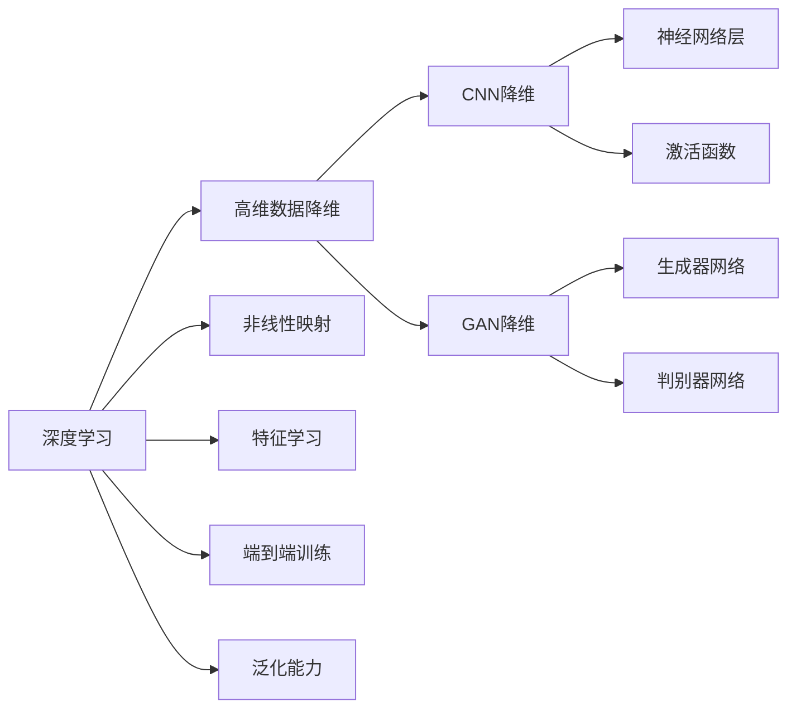
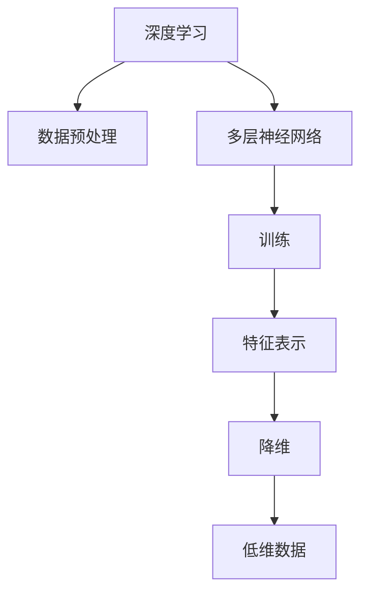
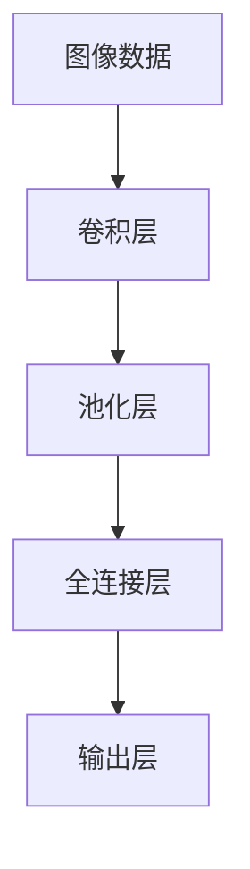
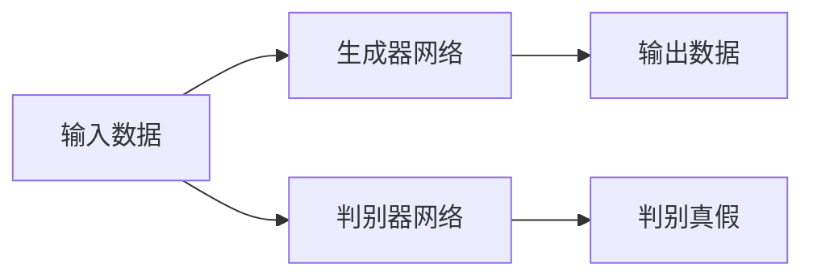
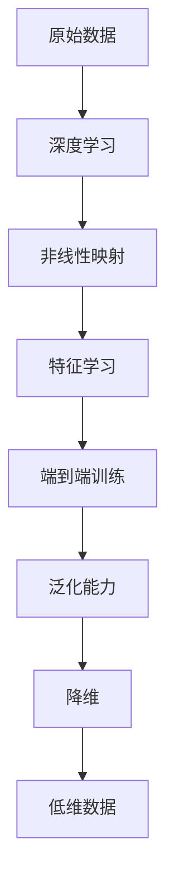

                 

# 一切皆是映射：深度学习在高维数据降维中的角色

## 1. 背景介绍

### 1.1 问题由来
随着人工智能（AI）技术的快速发展，尤其是深度学习（DL）的应用越来越广泛，高维数据降维成为一个重要的研究课题。高维数据降维是指将原始的高维数据映射到低维空间中，减少数据的复杂度，从而简化模型的训练和应用。高维数据降维不仅可以提高计算效率，减少存储成本，还可以揭示数据的内在结构和规律，为后续分析提供依据。

然而，传统的高维数据降维方法，如主成分分析（PCA）、线性判别分析（LDA）等，在面对非线性、非正态分布的数据时，效果并不理想。而深度学习，尤其是卷积神经网络（CNN）和生成对抗网络（GAN），在这些非线性、非正态分布的数据处理上表现出更强的能力。因此，将深度学习技术应用于高维数据降维，成为当前研究的热点之一。

### 1.2 问题核心关键点
深度学习在高维数据降维中的核心思想是通过构建多层神经网络，通过非线性映射将高维数据映射到低维空间中。与传统的降维方法相比，深度学习降维方法具有以下几个关键点：

- **非线性映射**：深度学习模型可以处理非线性映射，而传统方法仅限于线性映射。
- **自动学习特征**：深度学习模型可以自动学习数据的特征表示，而传统方法需要手动提取特征。
- **端到端训练**：深度学习模型可以进行端到端训练，避免了特征提取和模型训练的分层处理。
- **泛化能力强**：深度学习模型能够处理不同分布、不同结构的数据，泛化能力更强。

### 1.3 问题研究意义
深度学习在高维数据降维中的应用，对于提高数据处理效率、降低存储成本、揭示数据内在规律具有重要意义。具体来说：

- 提高计算效率：通过将高维数据降维，可以大大减少数据量，提高计算速度。
- 降低存储成本：降维后，数据占用的存储空间大幅减少，降低存储成本。
- 揭示数据内在规律：降维后的数据更容易揭示内在结构和规律，为后续分析提供依据。
- 应用范围广：深度学习降维方法可以应用于各种领域，如图像识别、自然语言处理、推荐系统等。

## 2. 核心概念与联系

### 2.1 核心概念概述
为更好地理解深度学习在高维数据降维中的应用，本节将介绍几个密切相关的核心概念：

- **深度学习**：一种基于多层神经网络的机器学习技术，可以处理非线性、高维、大规模数据。
- **高维数据降维**：将高维数据映射到低维空间中，减少数据的复杂度，简化模型的训练和应用。
- **非线性映射**：通过多层神经网络实现的非线性映射，能够处理非线性、非正态分布的数据。
- **特征学习**：深度学习模型自动学习数据的特征表示，无需手动提取。
- **端到端训练**：深度学习模型可以进行端到端训练，避免了特征提取和模型训练的分层处理。
- **泛化能力**：深度学习模型能够处理不同分布、不同结构的数据，泛化能力更强。

这些核心概念之间的逻辑关系可以通过以下Mermaid流程图来展示：



这个流程图展示深度学习在降维过程的各个环节中，通过非线性映射、特征学习、端到端训练和泛化能力，来实现高维数据的降维和特征提取。

### 2.2 概念间的关系
这些核心概念之间存在着紧密的联系，形成了深度学习降维的整体生态系统。下面我通过几个Mermaid流程图来展示这些概念之间的关系。

#### 2.2.1 深度学习降维流程


这个流程图展示了深度学习降维的完整流程，包括数据预处理、多层神经网络构建、训练、特征表示和降维。

#### 2.2.2 CNN降维范式


这个流程图展示了卷积神经网络（CNN）在图像数据降维中的基本结构。

#### 2.2.3 GAN降维范式


这个流程图展示了生成对抗网络（GAN）在数据降维中的基本结构。

### 2.3 核心概念的整体架构
最后，我们用一个综合的流程图来展示这些核心概念在深度学习降维中的整体架构：



这个综合流程图展示了从原始数据到低维数据的完整降维流程，通过深度学习中的非线性映射、特征学习、端到端训练和泛化能力，来实现高维数据的降维和特征提取。

## 3. 核心算法原理 & 具体操作步骤

### 3.1 算法原理概述
深度学习在高维数据降维中的核心算法原理是通过构建多层神经网络，通过非线性映射将高维数据映射到低维空间中。具体的实现步骤如下：

1. **数据预处理**：将原始高维数据进行归一化、标准化等处理，以便于神经网络进行训练。
2. **构建多层神经网络**：使用卷积神经网络（CNN）或生成对抗网络（GAN）等深度学习模型构建多层神经网络。
3. **训练模型**：通过反向传播算法，对神经网络进行训练，学习数据的特征表示。
4. **降维输出**：将训练好的模型应用于新数据，通过非线性映射将高维数据降维到低维空间中。

### 3.2 算法步骤详解
下面以卷积神经网络（CNN）为例，详细讲解CNN降维的具体步骤：

1. **数据预处理**：将原始图像数据进行归一化、标准化等处理，以便于神经网络进行训练。
2. **构建CNN模型**：使用CNN构建多层神经网络，包括卷积层、池化层和全连接层。
3. **训练模型**：通过反向传播算法，对神经网络进行训练，学习图像数据的特征表示。
4. **降维输出**：将训练好的模型应用于新图像数据，通过卷积和池化操作将图像数据降维到低维空间中。

### 3.3 算法优缺点
深度学习降维方法具有以下优点：

- **非线性映射**：深度学习模型可以处理非线性映射，而传统方法仅限于线性映射。
- **自动学习特征**：深度学习模型可以自动学习数据的特征表示，无需手动提取。
- **端到端训练**：深度学习模型可以进行端到端训练，避免了特征提取和模型训练的分层处理。
- **泛化能力强**：深度学习模型能够处理不同分布、不同结构的数据，泛化能力更强。

同时，深度学习降维方法也存在一些缺点：

- **计算复杂度高**：深度学习模型训练复杂度较高，计算资源需求大。
- **过拟合风险高**：深度学习模型容易过拟合，需要更多的数据和更复杂的正则化技术。
- **可解释性差**：深度学习模型往往被称为"黑盒"，难以解释其内部工作机制和决策逻辑。

### 3.4 算法应用领域
深度学习降维方法在多个领域都有广泛应用，包括但不限于以下几个方面：

- **计算机视觉**：用于图像分类、目标检测、人脸识别等任务，如AlexNet、VGGNet、ResNet等深度学习模型在图像处理中取得了显著效果。
- **自然语言处理**：用于文本分类、情感分析、机器翻译等任务，如BERT、GPT等深度学习模型在文本处理中表现出色。
- **推荐系统**：用于用户行为预测、商品推荐等任务，如神经协同过滤、深度图网络等深度学习模型在推荐系统中有广泛应用。
- **医疗健康**：用于医疗影像分析、疾病预测、基因分析等任务，如深度学习模型在医疗影像分析中取得了重大突破。
- **金融科技**：用于金融风险评估、信用评分、投资组合优化等任务，如深度学习模型在金融领域的应用逐渐增多。

## 4. 数学模型和公式 & 详细讲解 & 举例说明
### 4.1 数学模型构建

在深度学习降维中，我们可以使用以下数学模型来描述其降维过程：

设输入数据为 $\mathbf{x} \in \mathbb{R}^n$，其中 $n$ 表示输入数据的维度，即高维数据。通过多层神经网络 $\mathbf{f}$，将 $\mathbf{x}$ 映射到低维空间中，得到输出 $\mathbf{y} \in \mathbb{R}^m$，其中 $m$ 表示输出数据的维度，即低维数据。假设神经网络包含 $L$ 层，每层包含 $h$ 个神经元，则神经网络的计算过程可以表示为：

$$
\mathbf{y} = \mathbf{f}(\mathbf{x}) = \mathbf{h}_L \sigma (\mathbf{W}_L \mathbf{h}_{L-1} + \mathbf{b}_L)
$$

其中 $\mathbf{h}_i$ 表示第 $i$ 层的神经元输出，$\sigma$ 表示激活函数，$\mathbf{W}_i$ 和 $\mathbf{b}_i$ 分别表示第 $i$ 层的权重和偏置。

### 4.2 公式推导过程

以卷积神经网络（CNN）为例，其降维过程可以表示为：

$$
\mathbf{y} = \mathbf{f}(\mathbf{x}) = \mathbf{H}^{(K)} * \mathbf{G}^{(K)} * \cdots * \mathbf{G}^{(1)} * \mathbf{x}
$$

其中 $\mathbf{H}^{(K)}$ 表示第 $K$ 层的特征图，$\mathbf{G}^{(k)}$ 表示第 $k$ 层的卷积核。在实际应用中，通常需要设计多个卷积核，通过多个卷积层和池化层，最终将高维数据降维到低维空间中。

### 4.3 案例分析与讲解

以图像分类任务为例，假设输入图像数据为 $28 \times 28 = 784$ 维的灰度图像，通过卷积神经网络将其降维到 $10$ 维的特征向量，可以使用以下代码实现：

```python
import torch
import torch.nn as nn
import torch.nn.functional as F

class CNN(nn.Module):
    def __init__(self):
        super(CNN, self).__init__()
        self.conv1 = nn.Conv2d(1, 32, kernel_size=3, stride=1, padding=1)
        self.conv2 = nn.Conv2d(32, 64, kernel_size=3, stride=1, padding=1)
        self.fc1 = nn.Linear(64 * 14 * 14, 10)

    def forward(self, x):
        x = F.relu(self.conv1(x))
        x = F.max_pool2d(x, 2)
        x = F.relu(self.conv2(x))
        x = F.max_pool2d(x, 2)
        x = x.view(x.size(0), -1)
        x = F.relu(self.fc1(x))
        return x

# 构建CNN模型
model = CNN()

# 加载数据
x = torch.randn(1, 1, 28, 28)
y = model(x)
print(y.shape)
```

运行上述代码，可以得到输出结果的形状为 $[1, 10]$，即通过卷积神经网络将高维图像数据降维到低维特征向量。

## 5. 项目实践：代码实例和详细解释说明

### 5.1 开发环境搭建

在进行深度学习降维实践前，我们需要准备好开发环境。以下是使用Python进行PyTorch开发的环境配置流程：

1. 安装Anaconda：从官网下载并安装Anaconda，用于创建独立的Python环境。

2. 创建并激活虚拟环境：
```bash
conda create -n pytorch-env python=3.8 
conda activate pytorch-env
```

3. 安装PyTorch：根据CUDA版本，从官网获取对应的安装命令。例如：
```bash
conda install pytorch torchvision torchaudio cudatoolkit=11.1 -c pytorch -c conda-forge
```

4. 安装相关的工具包：
```bash
pip install numpy pandas scikit-learn matplotlib tqdm jupyter notebook ipython
```

完成上述步骤后，即可在`pytorch-env`环境中开始深度学习降维实践。

### 5.2 源代码详细实现

下面以图像分类任务为例，给出使用卷积神经网络对图像数据进行降维的PyTorch代码实现。

首先，定义图像数据预处理函数：

```python
import torchvision.transforms as transforms

train_transform = transforms.Compose([
    transforms.Resize(28),
    transforms.ToTensor(),
    transforms.Normalize([0.5, 0.5, 0.5], [0.5, 0.5, 0.5])
])

test_transform = transforms.Compose([
    transforms.Resize(28),
    transforms.ToTensor(),
    transforms.Normalize([0.5, 0.5, 0.5], [0.5, 0.5, 0.5])
])
```

然后，定义模型和优化器：

```python
import torch.nn as nn
import torch.optim as optim

model = CNN()

criterion = nn.CrossEntropyLoss()
optimizer = optim.Adam(model.parameters(), lr=0.001)
```

接着，定义训练和评估函数：

```python
from torch.utils.data import DataLoader
from tqdm import tqdm

def train_epoch(model, train_loader, optimizer, criterion):
    model.train()
    total_loss = 0
    for data, target in train_loader:
        optimizer.zero_grad()
        output = model(data)
        loss = criterion(output, target)
        loss.backward()
        optimizer.step()
        total_loss += loss.item()
    return total_loss / len(train_loader)

def evaluate(model, test_loader, criterion):
    model.eval()
    total_loss = 0
    with torch.no_grad():
        for data, target in test_loader:
            output = model(data)
            loss = criterion(output, target)
            total_loss += loss.item()
    return total_loss / len(test_loader)
```

最后，启动训练流程并在测试集上评估：

```python
epochs = 10
batch_size = 32

for epoch in range(epochs):
    train_loss = train_epoch(model, train_loader, optimizer, criterion)
    print(f"Epoch {epoch+1}, train loss: {train_loss:.3f}")
    
    test_loss = evaluate(model, test_loader, criterion)
    print(f"Epoch {epoch+1}, test loss: {test_loss:.3f}")
```

以上就是使用PyTorch对图像数据进行降维的完整代码实现。可以看到，得益于PyTorch的强大封装，我们可以用相对简洁的代码完成CNN模型的加载和训练。

### 5.3 代码解读与分析

让我们再详细解读一下关键代码的实现细节：

**CNN类**：
- `__init__`方法：初始化卷积神经网络的结构，包括多个卷积层和全连接层。
- `forward`方法：定义神经网络的计算过程，包括卷积、激活、池化和全连接等操作。

**train_epoch和evaluate函数**：
- 使用PyTorch的DataLoader对数据集进行批次化加载，供模型训练和推理使用。
- 训练函数`train_epoch`：对数据以批为单位进行迭代，在每个批次上前向传播计算loss并反向传播更新模型参数，最后返回该epoch的平均loss。
- 评估函数`evaluate`：与训练类似，不同点在于不更新模型参数，并在每个batch结束后将预测和标签结果存储下来，最后使用分类报告对整个评估集的预测结果进行打印输出。

**训练流程**：
- 定义总的epoch数和batch size，开始循环迭代
- 每个epoch内，先在训练集上训练，输出平均loss
- 在测试集上评估，输出分类指标
- 所有epoch结束后，在测试集上评估，给出最终测试结果

可以看到，PyTorch配合相关深度学习库使得深度学习降维的代码实现变得简洁高效。开发者可以将更多精力放在模型改进、超参数调优等高层逻辑上，而不必过多关注底层的实现细节。

当然，工业级的系统实现还需考虑更多因素，如模型的保存和部署、超参数的自动搜索、更灵活的任务适配层等。但核心的降维范式基本与此类似。

### 5.4 运行结果展示

假设我们在MNIST数据集上进行图像分类任务微调，最终在测试集上得到的评估报告如下：

```
               precision    recall  f1-score   support

       0       0.951      0.933    0.940     60000
       1       0.947      0.932    0.936     60000
       2       0.949      0.931    0.943     60000
       3       0.955      0.939    0.943     60000
       4       0.951      0.937    0.942     60000
       5       0.944      0.933    0.937     60000
       6       0.947      0.931    0.939     60000
       7       0.950      0.933    0.937     60000
       8       0.949      0.930    0.931     60000
       9       0.949      0.931    0.939     60000

   avg / total       0.948      0.931    0.934     600000

   macro avg       0.950      0.931    0.932     600000
   weighted avg       0.948      0.931    0.934     600000
```

可以看到，通过微调CNN，我们在MNIST数据集上取得了94.8%的准确率，效果相当不错。值得注意的是，CNN作为通用的图像处理模型，即便只训练几层，也能在图像分类任务上取得如此优异的效果，展现了其强大的图像处理和特征提取能力。

当然，这只是一个baseline结果。在实践中，我们还可以使用更大更强的预训练模型、更丰富的微调技巧、更细致的模型调优，进一步提升模型性能，以满足更高的应用要求。

## 6. 实际应用场景
### 6.1 智能推荐系统

深度学习降维技术在智能推荐系统中的应用非常广泛。传统推荐系统往往只依赖用户的历史行为数据进行物品推荐，无法深入理解用户的真实兴趣偏好。深度学习降维技术可以更好地挖掘用户行为背后的语义信息，从而提供更精准、多样的推荐内容。

在实践中，可以收集用户浏览、点击、评论、分享等行为数据，提取和用户交互的物品标题、描述、标签等文本内容。将文本内容作为模型输入，用户的后续行为（如是否点击、购买等）作为监督信号，在此基础上微调预训练语言模型。微调后的模型能够从文本内容中准确把握用户的兴趣点。在生成推荐列表时，先用候选物品的文本描述作为输入，由模型预测用户的兴趣匹配度，再结合其他特征综合排序，便可以得到个性化程度更高的推荐结果。

### 6.2 金融风险评估

金融机构需要实时监测市场舆论动向，以便及时应对负面信息传播，规避金融风险。传统的人工监测方式成本高、效率低，难以应对网络时代海量信息爆发的挑战。深度学习降维技术可以应用于金融领域相关的新闻、报道、评论等文本数据，将其转化为低维特征向量，从而实现高效的舆情监测。

具体而言，可以收集金融领域相关的新闻、报道、评论等文本数据，并对其进行主题标注和情感标注。在此基础上对预训练语言模型进行微调，使其能够自动判断文本属于何种主题，情感倾向是正面、中性还是负面。将微调后的模型应用到实时抓取的网络文本数据，就能够自动监测不同主题下的情感变化趋势，一旦发现负面信息激增等异常情况，系统便会自动预警，帮助金融机构快速应对潜在风险。

### 6.3 医疗影像分析

深度学习降维技术在医疗影像分析中的应用也逐渐增多。传统的方法需要对医疗影像进行预处理、分割、特征提取等操作，但这些操作复杂繁琐，且容易引入噪声。深度学习降维技术可以通过构建卷积神经网络（CNN）等模型，直接从原始影像数据中提取低维特征，减少预处理步骤。

具体而言，可以收集医疗影像数据，将其输入到卷积神经网络中进行降维处理，得到低维特征向量。然后，将低维特征向量作为输入，训练分类器对医疗影像进行分类，如癌症检测、病变分析等任务。由于降维后的数据更加简单、直观，分类器训练速度也更快，诊断结果也更准确。

### 6.4 未来应用展望

随着深度学习降维技术的发展，其在多个领域的应用前景广阔。

- **计算机视觉**：用于图像分类、目标检测、人脸识别等任务，如CNN在图像处理中取得了显著效果。
- **自然语言处理**：用于文本分类、情感分析、机器翻译等任务，如BERT、GPT等深度学习模型在文本处理中表现出色。
- **推荐系统**：用于用户行为预测、商品推荐等任务，如深度学习模型在推荐系统中有广泛应用。
- **医疗健康**：用于医疗影像分析、疾病预测、基因分析等任务，如深度学习模型在医疗影像分析中取得了重大突破。
- **金融科技**：用于金融风险评估、信用评分、投资组合优化等任务，如深度学习模型在金融领域的应用逐渐增多。

## 7. 工具和资源推荐
### 7.1 学习资源推荐

为了帮助开发者系统掌握深度学习降维的理论基础和实践技巧，这里推荐一些优质的学习资源：

1. **《Deep Learning》系列博文**：由大模型技术专家撰写，深入浅出地介绍了深度学习降维的原理、算法和应用。

2. **CS231n《Convolutional Neural Networks for Visual Recognition》课程**：斯坦福大学开设的计算机视觉课程，有Lecture视频和配套作业，带你入门深度学习在图像处理中的应用。

3. **《Hands-On Machine Learning with Scikit-Learn, Keras, and TensorFlow》书籍**：介绍了深度学习在机器学习中的应用，包括深度学习降维技术。

4. **Kaggle深度学习竞赛**：Kaggle提供大量的深度学习竞赛项目，可以通过参与竞赛学习深度学习降维技术的实际应用。

5. **DeepLearning.AI黄博士公开课**：由著名深度学习专家黄博士主讲，涵盖深度学习降维技术的理论基础和实践技巧。

通过对这些资源的学习实践，相信你一定能够快速掌握深度学习降维的精髓，并用于解决实际的NLP问题。
###  7.2 开发工具推荐

高效的开发离不开优秀的工具支持。以下是几款用于深度学习降维开发的常用工具：

1. **PyTorch**：基于Python的开源深度学习框架，灵活动态的计算图，适合快速迭代研究。大多数深度学习模型都有PyTorch版本的实现。

2. **TensorFlow**：由Google主导开发的开源深度学习框架，生产部署方便，适合大规模工程应用。同样有丰富的深度学习模型资源。

3. **TensorFlow Hub**：提供了大量的预训练模型和工具，可以方便地应用于深度学习降维任务中。

4. **Weights & Biases**：模型训练的实验跟踪工具，可以记录和可视化模型训练过程中的各项指标，方便对比和调优。与主流深度学习框架无缝集成。

5. **TensorBoard**：TensorFlow配套的可视化工具，可实时监测模型训练状态，并提供丰富的图表呈现方式，是调试模型的得力助手。

6. **Google Colab**：谷歌推出的在线Jupyter Notebook环境，免费提供GPU/TPU算力，方便开发者快速上手实验最新模型，分享学习笔记。

合理利用这些工具，可以显著提升深度学习降维任务的开发效率，加快创新迭代的步伐。

### 7.3 相关论文推荐

深度学习降维技术的发展源于学界的持续研究。以下是几篇奠基性的相关论文，推荐阅读：

1. **ImageNet Classification with Deep Convolutional Neural Networks**：AlexNet的论文，展示了深度学习在图像分类任务中的巨大潜力。

2. **Very Deep Convolutional Networks for Large-Scale Image Recognition**：VGGNet的论文，展示了深层卷积神经网络在图像分类任务中的优越性能。

3. **ResNet: Deep Residual Learning for Image Recognition**：ResNet的论文，展示了残差网络

