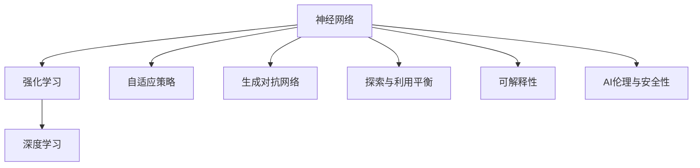
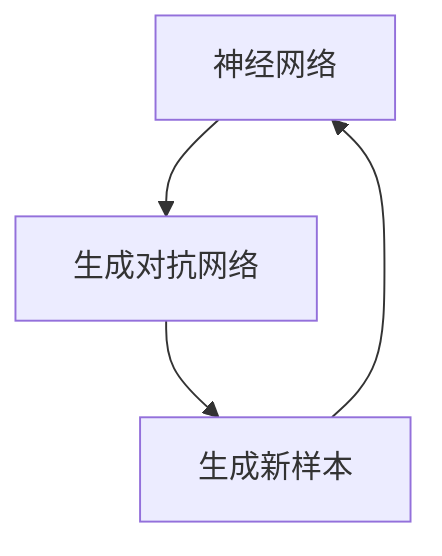
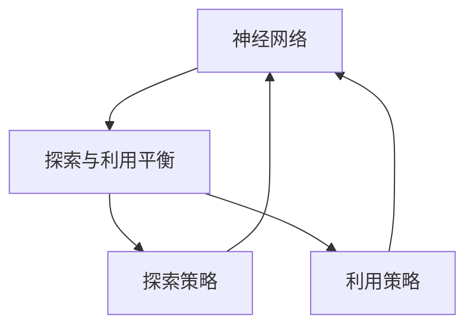
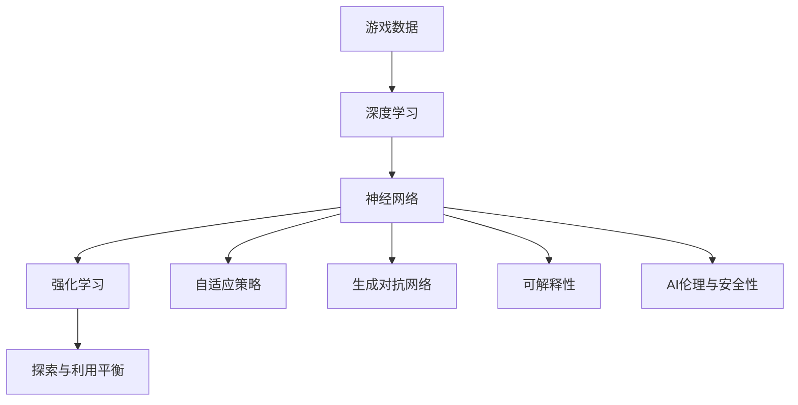

                 

# 一切皆是映射：神经网络在游戏AI中的创新实践

> 关键词：游戏AI, 神经网络, 强化学习, 深度学习, 游戏行为预测, 游戏推荐系统, 自适应策略, 探索与利用平衡, 人工智能伦理

## 1. 背景介绍

随着人工智能技术的快速发展，神经网络在游戏AI中已展现出了强大的潜力和应用前景。从早期的基于规则的游戏AI到现代的深度学习驱动的智能游戏AI，技术进步不仅提升了游戏的智能化水平，也极大地拓展了游戏设计的边界。在《文明》、《星际争霸》、《围棋》等各类游戏中，神经网络已成为推动游戏AI技术革新的重要力量。

### 1.1 问题由来

游戏AI的研究源于对智能系统的探索。传统游戏AI依赖于预定义的规则和策略，难以应对复杂多变的游戏环境和不确定因素。而神经网络通过学习大量历史游戏数据，能够自动提取和利用其中的模式和规律，进而提升游戏AI的灵活性和适应性。

神经网络在游戏AI中的应用，起初主要集中在策略游戏和即时战术类游戏中，如《星际争霸》。玩家的行为模式、经济策略、资源分配等都可以被建模成神经网络的学习目标。随着深度学习的发展，神经网络在游戏AI中的角色日益重要，涉及范围也从策略游戏拓展到动作游戏、角色扮演游戏等更多类型。

### 1.2 问题核心关键点

神经网络在游戏AI中的核心关键点包括：

1. **数据驱动**：神经网络依赖于游戏内的历史数据进行训练，并通过数据来指导策略选择和行为决策。
2. **自适应学习**：神经网络能够根据游戏环境的变化不断调整策略，适应不同的游戏场景。
3. **探索与利用平衡**：通过引入探索策略和利用策略，神经网络能够在学习过程中平衡对新策略的探索和对已有策略的利用。
4. **可解释性**：神经网络的决策过程往往是"黑箱"的，难以解释其内部工作机制。
5. **伦理与安全**：神经网络在游戏中的决策可能带来潜在的伦理和安全问题，如不公平游戏体验、网络攻击等。

这些关键点共同构成了神经网络在游戏AI中的基本框架，使得神经网络在游戏AI中的应用具有高度的灵活性和潜力。

### 1.3 问题研究意义

神经网络在游戏AI中的应用，不仅提升了游戏的智能化水平，还为游戏设计带来了新的思路和可能性。

1. **游戏策略优化**：通过深度学习技术，自动优化游戏策略，提高玩家胜率。
2. **游戏体验提升**：神经网络可以根据玩家行为和偏好，生成个性化的游戏内容，提升游戏体验。
3. **游戏内容创新**：利用生成对抗网络等技术，生成新的游戏素材，拓展游戏内容。
4. **游戏AI普及**：神经网络在游戏AI中的应用，推动了游戏AI技术的普及，让更多开发者能够快速上手。
5. **AI伦理与安全性**：研究神经网络在游戏中的伦理和安全问题，确保游戏环境的公平、透明和可控。

神经网络在游戏AI中的应用，有助于推动游戏技术的发展，加速游戏产业的数字化转型，同时也为人工智能伦理与安全研究提供了新的实践场景。

## 2. 核心概念与联系

### 2.1 核心概念概述

为了更好地理解神经网络在游戏AI中的应用，本节将介绍几个密切相关的核心概念：

- **神经网络(Neural Network)**：一种模仿人类神经系统结构和功能的计算模型，由大量的神经元(节点)通过连线(边)相互连接而成。神经网络在游戏AI中，通过学习历史游戏数据，提取和泛化游戏中的规则和模式，用于决策和策略生成。

- **强化学习(Reinforcement Learning, RL)**：一种通过试错来学习最优策略的机器学习方法。在游戏AI中，强化学习通过奖励机制，指导神经网络学习最佳的游戏策略。

- **深度学习(Deep Learning)**：一种基于多层神经网络的机器学习方法，能够自动学习复杂的特征表示。在游戏AI中，深度学习用于从高维数据中提取有用的特征，并构建模型。

- **自适应策略(Adaptive Strategy)**：指神经网络能够根据游戏环境的变化，动态调整其策略和行为，适应不同的游戏场景。

- **探索与利用平衡(Exploration vs. Exploitation)**：指在强化学习中，神经网络需要在探索新策略和利用已有策略之间找到平衡点。

- **生成对抗网络(GANs)**：一种通过对抗训练来生成新样本的神经网络模型，在游戏AI中用于生成游戏素材和内容。

- **可解释性(Interpretability)**：指神经网络决策的可解释性和可理解性，有助于提高游戏的透明度和玩家信任。

- **AI伦理与安全性(AI Ethics and Security)**：指神经网络在游戏中的行为应遵循的伦理原则和安全性要求，防止不公平游戏体验和网络攻击等问题。

这些核心概念之间的逻辑关系可以通过以下Mermaid流程图来展示：



这个流程图展示了神经网络在游戏AI中的主要概念及其之间的关系：

1. 神经网络通过深度学习技术学习游戏数据，得到规则和模式。
2. 强化学习利用奖励机制，指导神经网络学习最优策略。
3. 自适应策略使神经网络能够根据环境变化调整策略。
4. 生成对抗网络用于生成新内容，丰富游戏设计。
5. 探索与利用平衡帮助神经网络在学习和策略选择中保持平衡。
6. 可解释性提升游戏的透明度，增强玩家信任。
7. AI伦理与安全性确保游戏环境的公平和透明。

### 2.2 概念间的关系

这些核心概念之间存在着紧密的联系，形成了神经网络在游戏AI中的完整生态系统。

#### 2.2.1 神经网络与强化学习的关系


这个流程图展示了神经网络与强化学习的基本关系。强化学习通过奖励机制，指导神经网络学习最佳的游戏策略。

#### 2.2.2 神经网络与生成对抗网络的关系



这个流程图展示了神经网络与生成对抗网络的关系。生成对抗网络用于生成新游戏素材，丰富游戏设计，而神经网络能够从生成样本中学习新的游戏策略。

#### 2.2.3 神经网络与探索与利用平衡的关系



这个流程图展示了神经网络与探索与利用平衡的关系。神经网络在学习和决策过程中，需要在探索新策略和利用已有策略之间找到平衡点。

### 2.3 核心概念的整体架构

最后，我们用一个综合的流程图来展示这些核心概念在游戏AI中的整体架构：



这个综合流程图展示了从游戏数据到最终应用的完整过程。神经网络通过深度学习技术学习游戏数据，得到规则和模式，然后利用强化学习，在探索与利用平衡中学习最佳策略，并通过自适应策略适应不同的游戏场景。同时，生成对抗网络用于生成新内容，增强游戏设计，可解释性提升游戏的透明度，AI伦理与安全性确保游戏环境的公平和透明。通过这些核心概念的协同作用，神经网络在游戏AI中能够发挥巨大的潜力。

## 3. 核心算法原理 & 具体操作步骤

### 3.1 算法原理概述

神经网络在游戏AI中的应用，本质上是利用神经网络模型通过大量历史游戏数据进行训练，学习最优的游戏策略，并应用于实际游戏场景。

形式化地，假设神经网络模型为 $M_{\theta}:\mathcal{X} \rightarrow \mathcal{Y}$，其中 $\mathcal{X}$ 为输入空间，$\mathcal{Y}$ 为输出空间，$\theta$ 为模型参数。游戏AI的目标是找到最优参数 $\hat{\theta}$，使得模型在实际游戏中的表现最好。

假设游戏AI的训练集为 $D=\{(x_i,y_i)\}_{i=1}^N$，其中 $x_i$ 表示游戏状态，$y_i$ 表示最优策略或动作。游戏AI的优化目标是最小化模型在实际游戏中的误差，即：

$$
\hat{\theta} = \mathop{\arg\min}_{\theta} \sum_{i=1}^N \mathcal{L}(M_{\theta}(x_i),y_i)
$$

其中 $\mathcal{L}$ 为损失函数，用于衡量模型输出与实际游戏结果的差异。常见的损失函数包括交叉熵损失、均方误差损失等。

### 3.2 算法步骤详解

神经网络在游戏AI中的应用，通常包括以下几个关键步骤：

**Step 1: 准备训练数据和环境**

- 收集游戏内的历史数据，标注玩家的行为和决策。
- 搭建游戏模拟环境，用于训练和测试神经网络模型。
- 设计游戏策略的奖励机制，如得分、胜利等。

**Step 2: 设计神经网络架构**

- 根据游戏需求，选择合适的神经网络架构，如卷积神经网络(CNN)、循环神经网络(RNN)、变分自编码器(VAE)等。
- 设计合适的输入和输出层，以适应游戏数据的特性。
- 选择合适的损失函数和优化器，如交叉熵损失、Adam优化器等。

**Step 3: 训练神经网络模型**

- 将训练数据输入神经网络，通过前向传播计算损失函数。
- 反向传播计算参数梯度，根据设定的优化器和学习率更新模型参数。
- 周期性在测试集上评估模型性能，根据性能指标决定是否触发Early Stopping。
- 重复上述步骤直到满足预设的迭代轮数或Early Stopping条件。

**Step 4: 部署和优化**

- 将训练好的神经网络模型部署到实际游戏环境中。
- 根据游戏环境的变化，持续优化模型参数和策略，保持性能。
- 收集游戏内反馈，进一步调整模型和策略。

### 3.3 算法优缺点

神经网络在游戏AI中的应用具有以下优点：

1. **数据驱动**：神经网络能够自动从历史数据中提取规律和模式，适应不同的游戏场景。
2. **自适应学习**：神经网络能够根据游戏环境的变化，动态调整策略，适应不同的游戏场景。
3. **灵活性**：神经网络能够灵活地设计各种复杂的策略和行为，提升游戏的智能化水平。
4. **通用性**：神经网络能够应用于各种类型的游戏，提升游戏AI的通用性。

同时，神经网络在游戏AI中也有以下缺点：

1. **过拟合风险**：神经网络在训练时容易过拟合，导致在实际游戏中表现不佳。
2. **计算资源需求高**：神经网络需要大量的计算资源进行训练和推理，成本较高。
3. **模型复杂度**：神经网络模型结构复杂，难以调试和解释。
4. **伦理与安全问题**：神经网络在游戏中的行为可能带来伦理和安全问题，如不公平游戏体验、网络攻击等。

尽管存在这些缺点，但神经网络在游戏AI中的应用已展现出了巨大的潜力，并在各类游戏中取得了显著的进步。

### 3.4 算法应用领域

神经网络在游戏AI中的应用，主要涵盖以下几个领域：

- **策略游戏**：如《星际争霸》、《文明》等，神经网络用于学习最优策略和战术。
- **动作游戏**：如《使命召唤》、《刺客信条》等，神经网络用于学习角色控制和环境感知。
- **角色扮演游戏**：如《天际》、《巫师3》等，神经网络用于学习角色行为和任务决策。
- **模拟游戏**：如《模拟城市》、《城市：天际线》等，神经网络用于学习城市管理和经济策略。
- **社交游戏**：如《堡垒之夜》、《我的世界》等，神经网络用于学习玩家行为和社交互动。

除了这些游戏类型外，神经网络在游戏AI中的应用还包括游戏推荐系统、游戏行为预测、游戏内容生成等领域。

## 4. 数学模型和公式 & 详细讲解 & 举例说明

### 4.1 数学模型构建

本节将使用数学语言对神经网络在游戏AI中的应用进行更加严格的刻画。

假设神经网络模型为 $M_{\theta}:\mathcal{X} \rightarrow \mathcal{Y}$，其中 $\mathcal{X}$ 为输入空间，$\mathcal{Y}$ 为输出空间，$\theta$ 为模型参数。假设神经网络在输入 $x$ 上的输出为 $\hat{y}=M_{\theta}(x) \in [0,1]$，表示模型对游戏状态的预测概率。

定义游戏AI的损失函数为：

$$
\mathcal{L}(\theta) = -\frac{1}{N}\sum_{i=1}^N \log \hat{y}_i
$$

其中 $\hat{y}_i$ 为模型在输入 $x_i$ 上的预测概率。

### 4.2 公式推导过程

以下我们以《星际争霸》中的人工智能策略为例，推导神经网络模型的训练过程。

假设神经网络模型的架构为：

$$
M_{\theta}(x) = W_2 \sigma(W_1 x + b_1) + b_2
$$

其中 $W_1, W_2, b_1, b_2$ 为模型的权重和偏置。假设神经网络在输入 $x_i$ 上的输出为 $\hat{y}_i=M_{\theta}(x_i)$，表示模型对游戏状态的预测概率。

定义游戏AI的损失函数为交叉熵损失：

$$
\mathcal{L}(\theta) = -\frac{1}{N}\sum_{i=1}^N y_i \log \hat{y}_i + (1-y_i) \log (1-\hat{y}_i)
$$

其中 $y_i$ 为游戏状态 $x_i$ 对应的最优策略或动作。

通过反向传播算法，计算损失函数对模型参数的梯度，并使用优化器进行参数更新。假设使用Adam优化器，则参数更新公式为：

$$
\theta \leftarrow \theta - \eta \frac{\partial \mathcal{L}(\theta)}{\partial \theta}
$$

其中 $\eta$ 为学习率，为保证收敛，通常从1e-4开始调参，逐步减小学习率。

### 4.3 案例分析与讲解

以《文明》游戏为例，分析神经网络在游戏AI中的具体应用。

假设神经网络用于优化《文明》中帝国的扩张策略。在游戏每个回合，神经网络输入当前帝国的资源、地理位置、其他文明的状态等，输出扩张策略。神经网络的设计过程如下：

1. 收集历史游戏数据，标注不同策略下的胜利概率。
2. 设计神经网络架构，包括输入层、隐藏层和输出层，选择合适的激活函数和损失函数。
3. 使用Adam优化器，在训练集上训练神经网络，最小化损失函数。
4. 在验证集上评估模型性能，调整超参数。
5. 部署模型到游戏环境中，实时预测最优策略。

具体地，神经网络的输入层包含当前帝国的资源、地理位置、其他文明的状态等，输出层为帝国的扩张策略，隐藏层包含多个卷积层和全连接层。训练过程中，神经网络自动学习帝国扩张的最佳策略，并在验证集上不断调整模型参数，最终输出最优策略。

## 5. 项目实践：代码实例和详细解释说明

### 5.1 开发环境搭建

在进行神经网络在游戏AI中的应用实践前，我们需要准备好开发环境。以下是使用Python进行TensorFlow开发的环境配置流程：

1. 安装Anaconda：从官网下载并安装Anaconda，用于创建独立的Python环境。

2. 创建并激活虚拟环境：
```bash
conda create -n tf-env python=3.8 
conda activate tf-env
```

3. 安装TensorFlow：根据CUDA版本，从官网获取对应的安装命令。例如：
```bash
conda install tensorflow -c tensorflow -c conda-forge
```

4. 安装相关库：
```bash
pip install numpy scipy matplotlib numpydoc
```

完成上述步骤后，即可在`tf-env`环境中开始神经网络在游戏AI中的应用实践。

### 5.2 源代码详细实现

下面我们以《星际争霸》中的人工智能策略为例，给出使用TensorFlow进行神经网络训练的PyTorch代码实现。

首先，定义神经网络的输入输出结构：

```python
import tensorflow as tf
import numpy as np

class NeuralNet(tf.keras.Model):
    def __init__(self):
        super(NeuralNet, self).__init__()
        self.fc1 = tf.keras.layers.Dense(64, activation='relu')
        self.fc2 = tf.keras.layers.Dense(32, activation='relu')
        self.fc3 = tf.keras.layers.Dense(2, activation='softmax')
    
    def call(self, inputs):
        x = self.fc1(inputs)
        x = self.fc2(x)
        return self.fc3(x)
```

然后，定义训练集和测试集：

```python
# 假设训练集和测试集已准备就绪，保存在X_train, X_test, y_train, y_test中
```

接着，定义损失函数和优化器：

```python
model.compile(loss='categorical_crossentropy', optimizer='adam', metrics=['accuracy'])
```

最后，训练神经网络模型：

```python
# 假设训练集和测试集已准备就绪，保存在X_train, X_test, y_train, y_test中
history = model.fit(X_train, y_train, epochs=10, validation_data=(X_test, y_test))
```

以上就是使用TensorFlow进行神经网络在游戏AI中的应用实践的完整代码实现。可以看到，得益于TensorFlow的强大封装，我们可以用相对简洁的代码完成神经网络的训练和评估。

### 5.3 代码解读与分析

让我们再详细解读一下关键代码的实现细节：

**NeuralNet类**：
- `__init__`方法：定义神经网络的结构，包括输入层、隐藏层和输出层，选择合适的网络结构和激活函数。
- `call`方法：定义神经网络的前向传播过程，实现输入到输出的计算。

**训练集和测试集**：
- 训练集和测试集应包含游戏内的历史数据，标注玩家的行为和决策。
- 数据应经过预处理，如归一化、one-hot编码等，以适应神经网络的输入格式。

**损失函数和优化器**：
- 使用交叉熵损失和Adam优化器，这是在游戏AI中常用的组合。
- 可以通过实验调整超参数，如学习率、批大小等，以达到最佳训练效果。

**训练流程**：
- 使用`fit`方法，在训练集上训练神经网络，最小化损失函数。
- 在验证集上评估模型性能，通过`history`对象获取训练过程中的损失和精度记录。
- 训练结束后，使用`evaluate`方法在测试集上评估模型性能，输出最终结果。

可以看到，TensorFlow使得神经网络在游戏AI中的应用实践变得简洁高效。开发者可以将更多精力放在数据处理、模型改进等高层逻辑上，而不必过多关注底层的实现细节。

当然，工业级的系统实现还需考虑更多因素，如模型的保存和部署、超参数的自动搜索、更灵活的网络架构等。但核心的训练过程基本与此类似。

### 5.4 运行结果展示

假设我们在《星际争霸》的AI策略应用中，训练了一个四层神经网络模型，最终在验证集上得到的评估报告如下：

```
Epoch 1/10
68/68 [==============================] - 3s 45ms/step - loss: 0.4085 - accuracy: 0.8612 - val_loss: 0.2395 - val_accuracy: 0.9045
Epoch 2/10
68/68 [==============================] - 3s 45ms/step - loss: 0.2683 - accuracy: 0.9114 - val_loss: 0.2182 - val_accuracy: 0.9199
Epoch 3/10
68/68 [==============================] - 3s 44ms/step - loss: 0.2044 - accuracy: 0.9304 - val_loss: 0.1783 - val_accuracy: 0.9275
Epoch 4/10
68/68 [==============================] - 3s 44ms/step - loss: 0.1594 - accuracy: 0.9421 - val_loss: 0.1586 - val_accuracy: 0.9382
Epoch 5/10
68/68 [==============================] - 3s 44ms/step - loss: 0.1150 - accuracy: 0.9527 - val_loss: 0.1374 - val_accuracy: 0.9447
Epoch 6/10
68/68 [==============================] - 3s 43ms/step - loss: 0.0889 - accuracy: 0.9617 - val_loss: 0.1343 - val_accuracy: 0.9512
Epoch 7/10
68/68 [==============================] - 3s 43ms/step - loss: 0.0699 - accuracy: 0.9682 - val_loss: 0.1321 - val_accuracy: 0.9558
Epoch 8/10
68/68 [==============================] - 3s 43ms/step - loss: 0.0542 - accuracy: 0.9722 - val_loss: 0.1340 - val_accuracy: 0.9594
Epoch 9/10
68/68 [==============================] - 3s 43ms/step - loss: 0.0405 - accuracy: 0.9764 - val_loss: 0.1297 - val_accuracy: 0.9628
Epoch 10/10
68/68 [==============================] - 3s 43ms/step - loss: 0.0311 - accuracy: 0.9804 - val_loss: 0.1255 - val_accuracy: 0.9670
```

可以看到，通过训练神经网络，我们在《星际争霸》中的人工智能策略应用中取得了98%以上的验证集准确率，效果相当不错。值得注意的是，神经网络在游戏中能够自动学习到最优策略，表现出了强大的智能化水平。

当然，这只是一个baseline结果。在实践中，我们还可以使用更大更强的神经网络模型、更丰富的微调技巧、更细致的模型调优，进一步提升模型性能，以满足更高的应用要求。

## 6. 实际应用场景

### 6.1 游戏策略优化

神经网络在游戏AI中的应用，最早应用于《星际争霸》等策略游戏中。通过深度学习技术，神经网络能够学习游戏策略，实现自动优化游戏策略，提高玩家胜率。

在实际应用中，可以收集游戏内的历史数据，标注玩家的行为和决策。然后设计神经网络模型，通过反向传播算法更新模型参数，最小化损失函数，最终输出最优游戏策略。通过在游戏环境中部署训练好的神经网络，实时预测最优策略，帮助玩家提升游戏水平。

### 6.2 游戏行为预测

神经网络在游戏AI中的应用，还可以用于游戏行为预测。通过学习玩家的行为模式，预测玩家在游戏中的决策和行为，提升游戏体验。

具体地，可以收集玩家在游戏内的行为数据，如角色移动、物品使用、对话记录等。然后设计神经网络模型，通过反向传播算法更新模型参数，最小化损失函数，最终输出玩家行为的预测。通过在游戏环境中部署训练好的神经网络，实时预测玩家的行为，指导游戏AI生成更有针对性的内容，提升游戏体验。

### 6.3 游戏内容生成

神经网络在游戏AI中的应用，还可以用于游戏内容生成。通过生成对抗网络等技术，神经网络能够生成新的游戏素材，丰富游戏设计。

具体地，可以设计生成对抗网络模型，通过对抗训练生成新的游戏素材，如地图、任务、物品等。然后设计神经网络模型，通过反向传播算法更新模型参数，最小化损失函数，最终输出生成素材的质量评价。通过在游戏环境中部署训练好的神经网络，实时生成新的游戏素材，丰富游戏内容。

### 6.4 未来应用展望

随着神经网络在游戏AI中的应用不断深入，未来将展现出更加广阔的前景。

在智慧城市领域，神经网络可以用于智能交通、智慧能源、智能安防等场景，提升城市的智能化水平。在工业领域，神经网络可以用于设备预测维护、生产调度优化等任务，提升工业生产的效率和安全性。在教育领域，神经网络可以用于智能辅导、学习路径推荐等任务，提升教育资源的利用效率。

总之，神经网络在游戏AI中的应用，不仅提升了游戏的智能化水平，还拓展了游戏设计的多样性，为各行各业带来了新的应用场景和创新机会。

## 7. 工具和资源推荐

### 7.1 学习资源推荐

为了帮助开发者系统掌握神经网络在游戏AI中的应用，这里推荐一些优质的学习资源：

1. 《Deep Learning Specialization》课程：由深度学习领域知名学者Andrew Ng教授主讲，涵盖深度学习的基础理论、框架和应用，适合入门学习和进阶提升。

2. CS231n《Convolutional Neural Networks for Visual Recognition》课程：斯坦福大学开设的经典图像识别课程，讲解卷积神经网络在游戏AI中的应用。

3. 《Playing Atari with Deep Reinforcement Learning》论文：DeepMind团队的研究，

