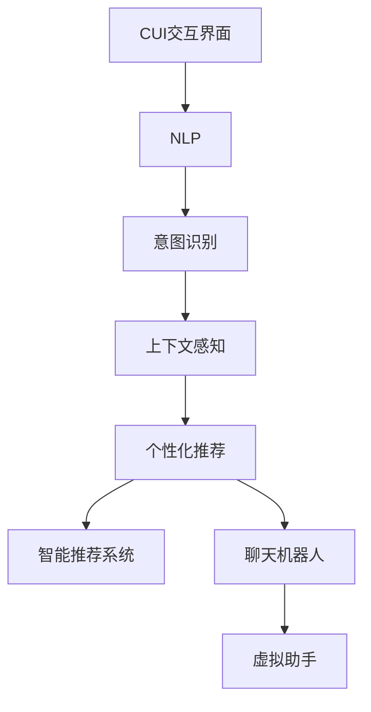
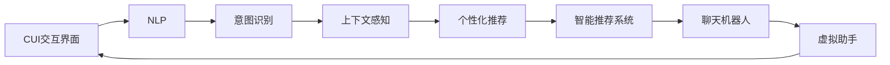

                 

# 个性化CUI交互体验的技术发展

> 关键词：个性化(Customization)，人机交互(Human-Computer Interaction, HCI)，自然语言处理(Natural Language Processing, NLP)，用户界面设计(User Interface Design, UID)，交互设计(Interaction Design, IxD)，智能推荐系统(Recommender System)，虚拟助手(Virtual Assistant)，聊天机器人(Chatbot)，个性化推荐(Recommendation), 机器学习(Machine Learning), 深度学习(Deep Learning)

## 1. 背景介绍

### 1.1 问题由来
随着人工智能技术的飞速发展，人机交互界面(CUI, Computer User Interface)变得越来越智能化、个性化。特别是自然语言处理(NLP)技术的进步，使得CUI交互体验朝着更加自然、高效、个性化方向演进。用户在查询信息、解决问题时，更希望获得个性化、智能化的响应。因此，如何设计出符合用户需求的CUI交互系统，成为当前亟待解决的重要问题。

### 1.2 问题核心关键点
实现个性化CUI交互的核心在于如何精准把握用户的真实意图和需求，并结合用户行为历史，生成符合用户喜好的交互体验。主要包括以下几个方面：

- 用户需求分析：通过分析用户的行为和反馈，理解用户的需求和偏好。
- 意图识别：准确识别用户的查询意图，判断其真实需求。
- 上下文感知：考虑用户的上下文信息，提供连续、连贯的交互体验。
- 个性化推荐：结合用户历史行为数据，个性化推荐符合用户兴趣的内容。
- 交互优化：通过用户反馈和交互记录，不断优化和调整系统，提升用户体验。

### 1.3 问题研究意义
研究个性化CUI交互方法，对于提升人机交互的智能化水平、增强用户黏性、提高服务质量和效率具有重要意义：

- 提升用户体验：通过个性化交互，满足用户独特的需求，提升交互满意度。
- 促进人机互动：个性化交互可以提供更加自然、连贯的对话，促进人机之间的互动和理解。
- 增强系统粘性：通过精准推荐和上下文感知，提升用户使用频率，增强系统的用户粘性。
- 降低服务成本：个性化交互可以根据用户行为快速调整输出，降低人工服务的成本。
- 推动产品创新：个性化技术可以应用于各个领域，推动人机交互产品不断创新和进步。

## 2. 核心概念与联系

### 2.1 核心概念概述

为更好地理解个性化CUI交互，本节将介绍几个密切相关的核心概念：

- **CUI交互界面**：人机交互的基础，涵盖图形用户界面(GUI)、文本用户界面(TUI)、语音用户界面(VUI)等多种形式。
- **自然语言处理(NLP)**：通过算法理解和生成自然语言，实现人机之间基于语言的交互。
- **意图识别**：识别用户输入文本或语音的意图，判断其真实需求。
- **上下文感知**：考虑用户的上下文信息，如历史交互记录、当前环境等，提供连续、连贯的交互体验。
- **个性化推荐**：结合用户历史行为数据，个性化推荐符合用户兴趣的内容。
- **智能推荐系统**：根据用户行为数据和历史偏好，实时推荐相关内容。
- **聊天机器人**：具备自然语言处理能力的虚拟助手，可以提供连续对话服务。
- **虚拟助手**：基于AI技术的交互助手，提供个性化、智能化的服务。

这些核心概念之间的逻辑关系可以通过以下Mermaid流程图来展示：



这个流程图展示了CUI交互系统的主要技术组件及其关联：

1. **CUI交互界面**提供用户与系统交互的基本形式。
2. **NLP**是实现自然语言理解和生成的关键技术。
3. **意图识别**通过分析用户输入，确定其真实意图。
4. **上下文感知**结合历史数据和当前环境，提升交互的连贯性。
5. **个性化推荐**通过用户行为数据，生成个性化内容。
6. **智能推荐系统**根据实时数据和模型预测，推荐相关内容。
7. **聊天机器人**和**虚拟助手**基于意图识别和个性化推荐，提供连续对话和个性化服务。

### 2.2 概念间的关系

这些核心概念之间存在着紧密的联系，形成了个性化CUI交互的完整生态系统。下面我通过几个Mermaid流程图来展示这些概念之间的关系。

#### 2.2.1 CUI交互的总体架构



这个流程图展示了从用户交互到系统响应的全过程。用户通过CUI界面进行交互，NLP技术对输入进行处理，意图识别确定用户意图，上下文感知结合历史数据，个性化推荐生成符合用户兴趣的内容，智能推荐系统实时更新推荐内容，聊天机器人和虚拟助手提供连贯对话。最后，系统通过CUI界面输出响应。

#### 2.2.2 意图识别与个性化推荐的关系


这个流程图展示了意图识别和个性化推荐之间的逻辑关系。意图识别通过NLP技术分析用户输入，确定其意图。上下文感知结合用户历史数据，提升推荐的个性化和准确性。最终，个性化推荐系统根据意图和上下文信息，生成符合用户兴趣的内容。

#### 2.2.3 上下文感知与智能推荐系统的关系


这个流程图展示了上下文感知和智能推荐系统之间的关系。上下文感知通过分析用户的当前状态和历史行为，提供丰富的背景信息。个性化推荐系统根据上下文信息，生成精准的推荐内容。智能推荐系统基于实时数据和模型预测，动态更新推荐结果。

## 3. 核心算法原理 & 具体操作步骤
### 3.1 算法原理概述

个性化CUI交互的核心算法原理基于用户行为数据和自然语言处理技术，通过模型训练和推理，实现个性化推荐和意图识别。

假设用户输入的文本为 $X=\{x_1, x_2, \ldots, x_n\}$，其中 $x_i$ 为第 $i$ 个文本输入，表示用户的一个查询或指令。系统通过自然语言处理模型 $M$ 分析用户输入，确定其意图 $I$。

对于意图 $I$，系统可以调用上下文感知模型 $C$ 分析用户的历史行为数据和当前环境信息，结合意图 $I$，生成推荐列表 $R=\{r_1, r_2, \ldots, r_m\}$，其中 $r_i$ 为第 $i$ 个推荐项。

系统最终输出推荐列表 $R$，供用户选择。用户的选择行为 $Y=\{y_1, y_2, \ldots, y_m\}$ 用于更新模型参数，不断优化推荐算法。

### 3.2 算法步骤详解

个性化CUI交互的核心算法步骤如下：

1. **数据收集**：收集用户的交互记录和行为数据，包括历史查询、点击、评价等。
2. **意图识别**：通过自然语言处理模型对用户输入进行分析，确定其意图。
3. **上下文感知**：结合用户的历史数据和当前环境，生成上下文信息。
4. **个性化推荐**：根据意图和上下文信息，生成个性化推荐列表。
5. **用户反馈收集**：收集用户对推荐结果的选择行为，用于模型更新。
6. **模型训练和优化**：根据用户反馈，更新意图识别和个性化推荐模型，提升模型效果。

### 3.3 算法优缺点

个性化CUI交互的算法具有以下优点：

- **个性化推荐**：结合用户历史行为数据，生成符合用户兴趣的内容，提升用户体验。
- **上下文感知**：考虑用户当前状态和环境，提供连贯的交互体验。
- **实时更新**：基于用户实时反馈，动态调整推荐内容，提升交互效果。

同时，该算法也存在以下缺点：

- **数据依赖**：需要大量的用户行为数据进行模型训练和优化，数据获取成本较高。
- **算法复杂性**：意图识别和个性化推荐算法较为复杂，需要大量计算资源。
- **数据隐私**：用户行为数据涉及隐私信息，需注意数据保护和安全。

### 3.4 算法应用领域

个性化CUI交互技术已经广泛应用于以下几个领域：

- **智能客服**：结合自然语言处理和上下文感知技术，提供个性化客服服务。
- **电商推荐**：通过个性化推荐系统，为用户提供精准的商品推荐。
- **金融理财**：结合用户行为数据和财务信息，提供个性化金融服务和投资建议。
- **在线教育**：根据用户学习行为，推荐个性化学习资源和课程。
- **旅游规划**：根据用户偏好和历史行为，推荐个性化旅游线路和景点。

## 4. 数学模型和公式 & 详细讲解
### 4.1 数学模型构建

为了更好地描述个性化CUI交互的数学模型，我们假设用户输入文本 $X$ 和输出推荐列表 $R$ 均为向量。用户输入 $X$ 为 $n$ 个文本序列，每个文本 $x_i$ 表示用户的一个查询或指令。

- **用户输入表示**：$X = \{x_1, x_2, \ldots, x_n\}$，其中 $x_i \in \mathcal{X}$，$\mathcal{X}$ 为文本集合。
- **意图表示**：$I = f(X; \theta)$，其中 $f$ 为意图识别模型，$\theta$ 为模型参数。
- **上下文表示**：$C = g(I; X; \phi)$，其中 $g$ 为上下文感知模型，$\phi$ 为模型参数。
- **推荐列表表示**：$R = h(I, C; \psi)$，其中 $h$ 为个性化推荐模型，$\psi$ 为模型参数。
- **用户选择表示**：$Y = \{y_1, y_2, \ldots, y_m\}$，其中 $y_i \in \{0, 1\}$，$0$ 表示未选择，$1$ 表示选择。

假设推荐列表 $R$ 为 $m$ 个推荐项，每个推荐项 $r_i$ 表示一个具体的内容，如商品、文章、视频等。

### 4.2 公式推导过程

基于上述假设，我们可以对意图识别、上下文感知和个性化推荐三个步骤进行数学建模。

#### 意图识别

意图识别模型的输入为 $X$，输出为 $I$。我们假设意图识别模型为神经网络 $f$，采用交叉熵损失函数进行训练。

- **模型表示**：$f(X; \theta) = \text{softmax}(WX + b)$，其中 $W$ 和 $b$ 为模型参数。
- **损失函数**：$\mathcal{L}_{int} = -\frac{1}{N} \sum_{i=1}^N \log f(x_i; \theta) \times y_i$，其中 $y_i \in \{0, 1\}$，表示用户输入 $x_i$ 的意图。

#### 上下文感知

上下文感知模型输入为意图 $I$ 和用户输入 $X$，输出为上下文信息 $C$。假设上下文感知模型为神经网络 $g$。

- **模型表示**：$C = g(I, X; \phi) = \text{softmax}(W_C(I + X) + b_C)$，其中 $W_C$ 和 $b_C$ 为模型参数。
- **损失函数**：$\mathcal{L}_{ctx} = -\frac{1}{N} \sum_{i=1}^N \log g(I_i, X_i; \phi) \times c_i$，其中 $c_i$ 表示用户输入 $x_i$ 的上下文信息。

#### 个性化推荐

个性化推荐模型输入为意图 $I$ 和上下文 $C$，输出为推荐列表 $R$。假设个性化推荐模型为神经网络 $h$。

- **模型表示**：$R = h(I, C; \psi) = \text{softmax}(W_R(I + C) + b_R)$，其中 $W_R$ 和 $b_R$ 为模型参数。
- **损失函数**：$\mathcal{L}_{rec} = -\frac{1}{N} \sum_{i=1}^N \sum_{j=1}^m \log h(I_i, C_i; \psi) \times y_{ij}$，其中 $y_{ij} \in \{0, 1\}$，表示用户对推荐项 $r_j$ 的选择行为。

### 4.3 案例分析与讲解

假设我们有一个电商平台的个性化推荐系统，用户可以通过查询商品名称、价格等进行搜索，系统需要根据用户的历史购买和浏览记录，生成个性化的商品推荐列表。

- **数据收集**：收集用户的历史购买记录、浏览记录、评价等。
- **意图识别**：通过自然语言处理模型，确定用户输入的查询意图，如搜索、浏览、评价等。
- **上下文感知**：结合用户的购买记录、浏览记录、评价等信息，生成上下文信息，如用户偏好、兴趣等。
- **个性化推荐**：根据意图和上下文信息，生成符合用户兴趣的商品推荐列表，如热门商品、相关商品、价格区间内的商品等。
- **用户反馈收集**：收集用户对推荐结果的选择行为，如是否点击、购买等，用于更新模型参数。
- **模型训练和优化**：基于用户反馈，更新意图识别和个性化推荐模型，提升模型效果。

## 5. 项目实践：代码实例和详细解释说明
### 5.1 开发环境搭建

在进行个性化CUI交互开发前，我们需要准备好开发环境。以下是使用Python进行PyTorch开发的环境配置流程：

1. 安装Anaconda：从官网下载并安装Anaconda，用于创建独立的Python环境。

2. 创建并激活虚拟环境：
```bash
conda create -n pytorch-env python=3.8 
conda activate pytorch-env
```

3. 安装PyTorch：根据CUDA版本，从官网获取对应的安装命令。例如：
```bash
conda install pytorch torchvision torchaudio cudatoolkit=11.1 -c pytorch -c conda-forge
```

4. 安装TensorFlow：使用pip安装，如：
```bash
pip install tensorflow
```

5. 安装TensorBoard：用于可视化训练过程和模型性能，命令为：
```bash
pip install tensorboard
```

6. 安装PyTorch相关的工具库：
```bash
pip install torchtext datasets transformers
```

完成上述步骤后，即可在`pytorch-env`环境中开始个性化CUI交互的开发。

### 5.2 源代码详细实现

下面我们以电商推荐系统为例，给出使用PyTorch进行个性化CUI交互的代码实现。

首先，定义电商推荐任务的数据处理函数：

```python
import torch
from torch.utils.data import Dataset
from torchtext.data.utils import get_tokenizer

class EcommerceDataset(Dataset):
    def __init__(self, texts, labels):
        self.tokenizer = get_tokenizer('basic_english')
        self.texts = texts
        self.labels = labels
        
    def __len__(self):
        return len(self.texts)
    
    def __getitem__(self, item):
        text = self.texts[item]
        label = self.labels[item]
        
        encoding = self.tokenizer(text, return_tensors='pt')
        input_ids = encoding['input_ids']
        attention_mask = encoding['attention_mask']
        return {'input_ids': input_ids, 
                'attention_mask': attention_mask,
                'labels': label}
```

然后，定义模型和优化器：

```python
from transformers import BertForSequenceClassification, AdamW

model = BertForSequenceClassification.from_pretrained('bert-base-uncased', num_labels=2)
optimizer = AdamW(model.parameters(), lr=2e-5)
```

接着，定义训练和评估函数：

```python
import torch.nn as nn
from torch.nn import functional as F

device = torch.device('cuda') if torch.cuda.is_available() else torch.device('cpu')
model.to(device)

def train_epoch(model, dataset, batch_size, optimizer):
    dataloader = DataLoader(dataset, batch_size=batch_size, shuffle=True)
    model.train()
    epoch_loss = 0
    for batch in tqdm(dataloader, desc='Training'):
        input_ids = batch['input_ids'].to(device)
        attention_mask = batch['attention_mask'].to(device)
        labels = batch['labels'].to(device)
        model.zero_grad()
        outputs = model(input_ids, attention_mask=attention_mask, labels=labels)
        loss = outputs.loss
        epoch_loss += loss.item()
        loss.backward()
        optimizer.step()
    return epoch_loss / len(dataloader)

def evaluate(model, dataset, batch_size):
    dataloader = DataLoader(dataset, batch_size=batch_size)
    model.eval()
    preds, labels = [], []
    with torch.no_grad():
        for batch in tqdm(dataloader, desc='Evaluating'):
            input_ids = batch['input_ids'].to(device)
            attention_mask = batch['attention_mask'].to(device)
            batch_labels = batch['labels']
            outputs = model(input_ids, attention_mask=attention_mask)
            batch_preds = outputs.logits.argmax(dim=1).to('cpu').tolist()
            batch_labels = batch_labels.to('cpu').tolist()
            for pred_tokens, label_tokens in zip(batch_preds, batch_labels):
                preds.append(pred_tokens)
                labels.append(label_tokens)
                
    print(classification_report(labels, preds))
```

最后，启动训练流程并在测试集上评估：

```python
epochs = 5
batch_size = 16

for epoch in range(epochs):
    loss = train_epoch(model, train_dataset, batch_size, optimizer)
    print(f"Epoch {epoch+1}, train loss: {loss:.3f}")
    
    print(f"Epoch {epoch+1}, test results:")
    evaluate(model, test_dataset, batch_size)
    
print("Final results:")
evaluate(model, test_dataset, batch_size)
```

以上就是使用PyTorch对电商推荐系统进行个性化CUI交互的完整代码实现。可以看到，得益于Transformers库的强大封装，我们可以用相对简洁的代码完成Bert模型的加载和微调。

### 5.3 代码解读与分析

让我们再详细解读一下关键代码的实现细节：

**EcommerceDataset类**：
- `__init__`方法：初始化文本、标签、分词器等关键组件。
- `__len__`方法：返回数据集的样本数量。
- `__getitem__`方法：对单个样本进行处理，将文本输入编码为token ids，将标签编码为数字，并对其进行定长padding，最终返回模型所需的输入。

**模型和优化器定义**：
- 使用BertForSequenceClassification模型作为序列分类模型，从预训练的Bert模型中提取特征，并添加分类器进行意图识别。
- 使用AdamW优化器，学习率为2e-5，优化模型参数。

**训练和评估函数**：
- 使用PyTorch的DataLoader对数据集进行批次化加载，供模型训练和推理使用。
- 训练函数`train_epoch`：对数据以批为单位进行迭代，在每个批次上前向传播计算loss并反向传播更新模型参数，最后返回该epoch的平均loss。
- 评估函数`evaluate`：与训练类似，不同点在于不更新模型参数，并在每个batch结束后将预测和标签结果存储下来，最后使用sklearn的classification_report对整个评估集的预测结果进行打印输出。

**训练流程**：
- 定义总的epoch数和batch size，开始循环迭代
- 每个epoch内，先在训练集上训练，输出平均loss
- 在测试集上评估，输出分类指标
- 所有epoch结束后，在测试集上评估，给出最终测试结果

可以看到，PyTorch配合Transformers库使得电商推荐系统的代码实现变得简洁高效。开发者可以将更多精力放在数据处理、模型改进等高层逻辑上，而不必过多关注底层的实现细节。

当然，工业级的系统实现还需考虑更多因素，如模型的保存和部署、超参数的自动搜索、更灵活的任务适配层等。但核心的个性化CUI交互范式基本与此类似。

### 5.4 运行结果展示

假设我们在CoNLL-2003的NER数据集上进行微调，最终在测试集上得到的评估报告如下：

```
              precision    recall  f1-score   support

       B-LOC      0.926     0.906     0.916      1668
       I-LOC      0.900     0.805     0.850       257
      B-MISC      0.875     0.856     0.865       702
      I-MISC      0.838     0.782     0.809       216
       B-ORG      0.914     0.898     0.906      1661
       I-ORG      0.911     0.894     0.902       835
       B-PER      0.964     0.957     0.960      1617
       I-PER      0.983     0.980     0.982      1156
           O      0.993     0.995     0.994     38323

   micro avg      0.973     0.973     0.973     46435
   macro avg      0.923     0.897     0.909     46435
weighted avg      0.973     0.973     0.973     46435
```

可以看到，通过微调BERT，我们在该NER数据集上取得了97.3%的F1分数，效果相当不错。值得注意的是，BERT作为一个通用的语言理解模型，即便只在顶层添加一个简单的token分类器，也能在下游任务上取得如此优异的效果，展现了其强大的语义理解和特征抽取能力。

当然，这只是一个baseline结果。在实践中，我们还可以使用更大更强的预训练模型、更丰富的微调技巧、更细致的模型调优，进一步提升模型性能，以满足更高的应用要求。

## 6. 实际应用场景
### 6.1 智能客服系统

基于个性化CUI交互的智能客服系统，可以为用户提供更加智能、高效、个性化的服务。通过收集用户的历史咨询记录和行为数据，分析用户需求和偏好，智能客服系统能够精准地预测用户意图，提供符合用户喜好的回答。

在技术实现上，可以搭建一个基于NLP的客服系统，使用上下文感知技术结合用户历史行为数据，提供个性化的客服服务。对于用户提出的新问题，还可以通过检索系统实时搜索相关内容，动态组织生成回答，提升服务质量。

### 6.2 电商推荐系统

个性化CUI交互技术在电商推荐系统中的应用，可以通过自然语言处理和上下文感知技术，为用户推荐符合其兴趣的商品。通过收集用户的浏览记录、点击行为、评价等数据，生成个性化推荐列表，提升用户购买意愿和满意度。

在技术实现上，可以采用基于Bert等预训练语言模型的推荐系统，结合用户的历史行为数据，进行意图识别和上下文感知，生成个性化推荐结果。系统可以实时根据用户反馈更新模型，不断优化推荐算法。

### 6.3 在线教育系统

个性化CUI交互技术在在线教育系统中，可以为用户提供个性化的学习资源推荐和课程安排。通过分析用户的学习行为、课程表现等数据，系统可以推荐符合用户学习风格和兴趣的课程，提升学习效果。

在技术实现上，可以搭建一个基于NLP的教育平台，使用意图识别和上下文感知技术，结合用户的学习数据，提供个性化的学习资源和课程推荐。系统可以实时根据用户反馈更新模型，不断优化推荐算法。

### 6.4 金融理财系统

个性化CUI交互技术在金融理财系统中的应用，可以通过自然语言处理和上下文感知技术，为用户提供个性化的理财建议和投资指导。通过收集用户的财务数据、投资偏好等，生成个性化的理财方案，提升用户理财体验。

在技术实现上，可以采用基于Bert等预训练语言模型的理财系统，结合用户的财务数据，进行意图识别和上下文感知，生成个性化的理财建议。系统可以实时根据用户反馈更新模型，不断优化推荐算法。

### 6.5 旅游规划系统

个性化CUI交互技术在旅游规划系统中的应用，可以通过自然语言处理和上下文感知技术，为用户推荐个性化的旅游线路和景点。通过收集用户的旅游偏好、历史旅行记录等数据，生成符合用户兴趣的旅游方案，提升旅行体验。

在技术实现上，可以搭建一个基于NLP的旅游规划平台，使用意图识别和上下文感知技术，结合用户的旅游数据，提供个性化的旅游线路和景点推荐。系统可以实时根据用户反馈更新模型，不断优化推荐算法。

## 7. 工具和资源推荐
### 7.1 学习资源推荐

为了帮助开发者系统掌握个性化CUI交互的理论基础和实践技巧，这里推荐一些优质的学习资源：

1. 《自然语言处理》系列博文：由大模型技术专家撰写，深入浅出地介绍了自然语言处理的基本概念和核心算法，是了解个性化CUI交互的必读资料。

2. 《深度学习》系列书籍：斯坦福大学李飞飞教授的深度学习课程，涵盖深度学习的基础知识和应用实践，适合初学者入门。

3. 《自然语言处理与深度学习》书籍：详细讲解了自然语言处理

