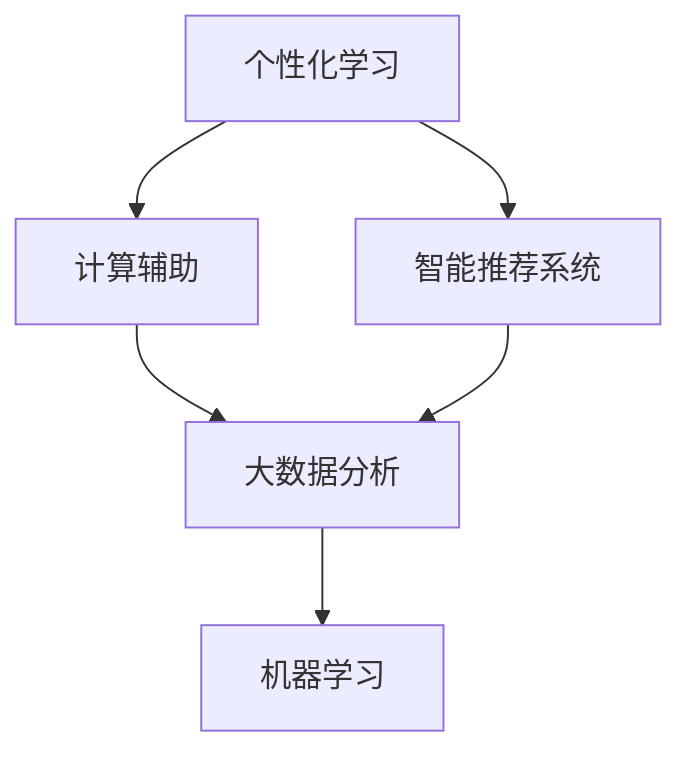
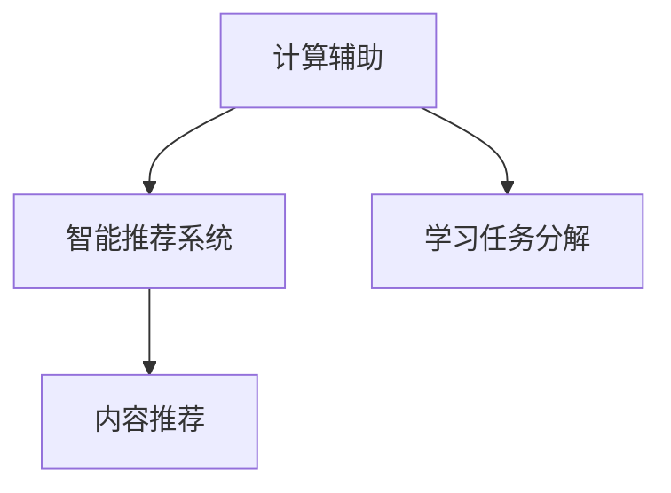
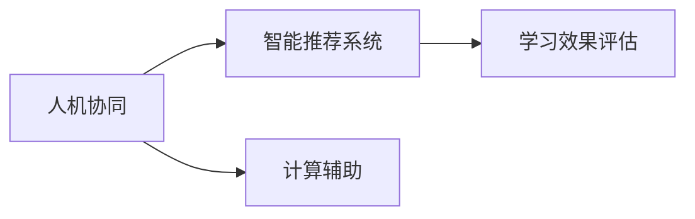
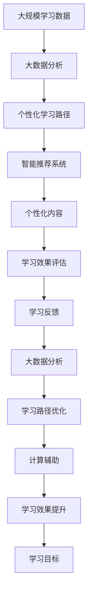

                 

## 1. 背景介绍

### 1.1 问题由来

现代教育体系已经存在了数百年，但其核心模式并未发生根本性变革。传统的教学方法，如标准化的课堂讲授、统一的考试评价，难以应对个性化学习的挑战。随着科技的进步，特别是人工智能、大数据、个性化推荐等技术的兴起，教育领域正迎来一场革命。

人类计算（Human-Computation）是一种新兴的学习范式，通过将复杂的学习任务分解为可量化的计算，并利用人类的优势（如创造性、判断力）来辅助计算过程。这种范式能够有效地应对个性化学习需求，提升教育质量，缩短学习周期，成为教育创新的一个重要方向。

### 1.2 问题核心关键点

人类计算的核心在于利用计算工具辅助人类智慧，实现个性化学习。核心概念包括：

- **个性化学习（Personalized Learning）**：根据每个学生的特点和需求，定制化设计学习内容和路径，满足其个性化需求。
- **计算辅助（Human-Computation）**：利用计算机辅助人类进行学习任务，提升学习效率和效果。
- **智能推荐系统（Intelligent Recommendation System）**：通过算法分析学习行为和偏好，为学生推荐最适合的学习内容。
- **人机协同（Human-Machine Collaboration）**：结合机器和人类的优势，实现教育资源的最大化利用。

这些关键概念之间存在着紧密的联系，共同构成了个性化学习的完整框架。通过人类计算，个性化学习能够更加高效、精确地实现，真正实现因材施教，提升教育公平性和效率。

### 1.3 问题研究意义

人类计算在个性化学习中的应用，具有以下重要意义：

1. **提升学习效果**：通过智能推荐和学习路径优化，满足每个学生的学习需求，提高学习效率和效果。
2. **促进教育公平**：个性化学习能够跨越地域、经济条件限制，为所有学生提供高质量教育资源。
3. **降低教育成本**：利用机器自动化和智能化，减少教师和教学资源的浪费，降低教育成本。
4. **激发创造力**：结合机器计算和人类智慧，让学生在探索和解决问题的过程中，培养创新思维和批判性思维。
5. **适应未来就业需求**：个性化学习和人工智能技术的结合，能够培养适应未来复杂多变工作环境的人才。

## 2. 核心概念与联系

### 2.1 核心概念概述

为更好地理解人类计算在个性化学习中的应用，本节将介绍几个密切相关的核心概念：

- **个性化学习**：根据每个学生的特点和需求，定制化设计学习内容和路径，满足其个性化需求。
- **计算辅助**：利用计算机辅助人类进行学习任务，提升学习效率和效果。
- **智能推荐系统**：通过算法分析学习行为和偏好，为学生推荐最适合的学习内容。
- **人机协同**：结合机器和人类的优势，实现教育资源的最大化利用。
- **大数据分析**：利用大规模数据分析，挖掘学习规律和行为模式。
- **机器学习**：通过算法学习，提高推荐系统的精准度和效果。

这些核心概念之间的逻辑关系可以通过以下Mermaid流程图来展示：



这个流程图展示了个性化学习中各个核心概念的关系：

1. 个性化学习需要计算辅助和智能推荐系统的支持。
2. 计算辅助和大数据分析密不可分，通过分析大数据，提升计算辅助的精准度。
3. 智能推荐系统依赖机器学习，通过学习数据特征，实现高效推荐。

### 2.2 概念间的关系

这些核心概念之间存在着紧密的联系，形成了个性化学习的完整生态系统。下面我通过几个Mermaid流程图来展示这些概念之间的关系。

#### 2.2.1 个性化学习的主要环节


这个流程图展示了个性化学习的主要环节：

1. 学习目标：明确学生的学习需求和目标。
2. 大数据分析：通过数据分析了解学生的学习行为和偏好。
3. 个性化学习路径：根据数据分析结果，制定个性化的学习路径。
4. 智能推荐系统：根据学习路径，推荐适合的学习内容。
5. 学习效果评估：评估学习效果，调整学习路径和内容。

#### 2.2.2 计算辅助与智能推荐系统的关系



这个流程图展示了计算辅助和智能推荐系统之间的关系：

1. 计算辅助将学习任务分解为可量化的计算。
2. 智能推荐系统通过分析计算结果，推荐适合的学习内容。

#### 2.2.3 人机协同的应用场景



这个流程图展示了人机协同在个性化学习中的应用场景：

1. 人机协同结合了机器和人类的优势，提升学习效果和体验。
2. 智能推荐系统和计算辅助在协同中发挥作用。
3. 学习效果评估反馈，进一步优化协同过程。

### 2.3 核心概念的整体架构

最后，我们用一个综合的流程图来展示这些核心概念在大规模个性化学习过程中的整体架构：



这个综合流程图展示了从数据分析到学习目标，再到学习效果提升的完整过程。通过大数据分析，定制化设计学习路径，推荐最适合的学习内容，通过学习效果评估和学习反馈，不断优化学习路径和效果，最终实现个性化学习目标。

## 3. 核心算法原理 & 具体操作步骤
### 3.1 算法原理概述

个性化学习中的核心算法基于人类计算范式，利用计算机辅助人类进行学习任务的优化。具体来说，算法过程包括以下几个步骤：

1. **学习目标制定**：根据学生的个性化需求，设定具体的学习目标和任务。
2. **大数据分析**：利用机器学习算法，对学生的学习行为和偏好进行分析，挖掘规律和特征。
3. **个性化学习路径设计**：根据数据分析结果，设计个性化的学习路径和内容，最大化满足学生需求。
4. **智能推荐系统构建**：基于推荐算法，构建智能推荐系统，为学生推荐适合的学习资源。
5. **学习效果评估**：利用评估算法，量化学生的学习效果，及时反馈调整。

### 3.2 算法步骤详解

基于人类计算范式的个性化学习算法步骤详解如下：

**Step 1: 学习目标制定**

- 根据学生的个性化需求和特点，制定具体的学习目标和任务。学习目标可以包括知识掌握、技能提升、兴趣培养等多个方面。
- 将学习目标分解为可量化的计算任务，便于后续计算辅助和推荐系统的设计。

**Step 2: 大数据分析**

- 收集学生的学习行为数据，包括学习时间、成绩、互动反馈等。
- 利用机器学习算法，如聚类、分类、回归等，分析学生的学习模式和偏好。
- 利用时间序列分析、关联规则挖掘等技术，发现学习行为中的规律和特征。

**Step 3: 个性化学习路径设计**

- 根据大数据分析结果，设计个性化的学习路径。路径包括学习内容、顺序、时间安排等。
- 利用优化算法，如遗传算法、粒子群算法等，自动生成最优学习路径。

**Step 4: 智能推荐系统构建**

- 基于推荐算法，如协同过滤、内容推荐、基于深度学习的推荐模型等，构建智能推荐系统。
- 利用推荐系统为学生推荐适合的学习内容，如文章、视频、练习题等。

**Step 5: 学习效果评估**

- 设计评估指标，如知识掌握度、技能提升度、兴趣激发度等。
- 利用评估算法，如回归分析、多分类模型等，量化学习效果。
- 根据评估结果，及时调整学习路径和内容。

### 3.3 算法优缺点

基于人类计算范式的个性化学习算法具有以下优点：

1. **个性化需求满足**：通过大数据分析和个性化学习路径设计，能够满足每个学生的个性化需求。
2. **学习效率提升**：利用计算辅助和智能推荐系统，提升学习效率和效果。
3. **学习体验优化**：结合人机协同，优化学习体验，提升学生的学习兴趣和动力。

同时，该算法也存在以下局限性：

1. **数据质量要求高**：算法依赖于高质量的学习行为数据，数据收集和处理成本较高。
2. **推荐精度有待提升**：智能推荐系统的推荐精度受限于算法和数据质量，需要不断优化改进。
3. **学习路径设计复杂**：个性化学习路径设计需要考虑多种因素，设计过程复杂。
4. **人机交互成本高**：人机协同需要教师和学生共同参与，增加了学习成本。

### 3.4 算法应用领域

基于人类计算范式的个性化学习算法，在多个领域具有广泛的应用：

1. **K-12教育**：利用个性化学习算法，为中小学生提供定制化的学习内容和路径，提升学习效果。
2. **高等教育**：通过个性化学习算法，帮助大学生进行课程选修、研究方向选择等，提升学习效率。
3. **职业培训**：为在职员工提供个性化的职业培训课程，提升职业技能和工作效率。
4. **企业培训**：为员工提供个性化的技能培训和职业发展规划，提升企业的整体素质和竞争力。
5. **终身学习**：利用个性化学习算法，为成人提供个性化学习路径和资源，支持终身学习。

## 4. 数学模型和公式 & 详细讲解  
### 4.1 数学模型构建

本节将使用数学语言对基于人类计算范式的个性化学习算法进行更加严格的刻画。

记学生总数为 $N$，学习任务数为 $M$，每个任务的学习目标为 $T_m$，学生在第 $m$ 个任务上的学习行为数据为 $X_{mi}$。假设学习目标 $T_m$ 为二分类问题，即 $T_m \in \{0, 1\}$，其中 $0$ 表示未达到目标，$1$ 表示达到目标。

定义学生在第 $m$ 个任务上的学习效果 $y_{mi} \in \{0, 1\}$，其中 $0$ 表示未达到目标，$1$ 表示达到目标。

数学模型构建如下：

$$
\min_{\theta} \sum_{m=1}^{M} \sum_{i=1}^{N} L(y_{mi}, f(X_{mi}; \theta))
$$

其中，$L$ 为损失函数，$f(\cdot)$ 为学习效果评估模型，$\theta$ 为模型参数。

### 4.2 公式推导过程

以二分类问题为例，推导学习效果评估模型的损失函数及其梯度计算公式。

假设学习效果评估模型为线性回归模型，即 $f(X_{mi}; \theta) = \theta^T \varphi(X_{mi})$，其中 $\varphi(\cdot)$ 为特征映射函数，$\theta$ 为模型参数。

二分类问题常用的损失函数为对数损失函数：

$$
L(y_{mi}, f(X_{mi}; \theta)) = -(y_{mi} \log f(X_{mi}; \theta) + (1-y_{mi}) \log (1-f(X_{mi}; \theta)))
$$

其梯度计算公式为：

$$
\frac{\partial L(y_{mi}, f(X_{mi}; \theta))}{\partial \theta} = f(X_{mi}; \theta) - y_{mi}
$$

在得到损失函数的梯度后，即可带入模型更新公式，完成模型的迭代优化。重复上述过程直至收敛，最终得到学习效果评估模型的最优参数 $\theta^*$。

### 4.3 案例分析与讲解

考虑一个在线教育平台的学习效果评估模型。该平台收集了学生在数学学习中的行为数据，包括学习时间、解题次数、正确率等。利用这些数据，评估模型需要判断学生是否达到了学习目标，即掌握该数学知识点。

假设学习目标为二分类问题，模型使用线性回归模型进行评估，即 $f(X_{mi}; \theta) = \theta^T \varphi(X_{mi})$。其中，$\varphi(X_{mi})$ 为特征映射函数，将学生行为数据转换为模型输入。模型参数 $\theta$ 需要通过数据集训练得到。

在训练过程中，模型将学习目标 $T_m$ 和学生行为数据 $X_{mi}$ 代入损失函数 $L(y_{mi}, f(X_{mi}; \theta))$，计算梯度并更新模型参数，最小化损失函数。

例如，对于某学生的学习行为数据 $X_{mi} = (t_i, c_i, s_i)$，其中 $t_i$ 为学习时间，$c_i$ 为解题次数，$s_i$ 为正确率。评估模型的预测结果为 $f(X_{mi}; \theta) = \theta^T \varphi(X_{mi})$。如果学生达到学习目标 $T_m = 1$，则期望评估模型输出 $f(X_{mi}; \theta)$ 较大，反之亦然。通过不断调整模型参数 $\theta$，使得评估模型的预测与实际学习效果 $y_{mi}$ 尽可能一致，即可实现学习效果评估。

## 5. 项目实践：代码实例和详细解释说明
### 5.1 开发环境搭建

在进行个性化学习算法开发前，我们需要准备好开发环境。以下是使用Python进行Scikit-learn开发的环境配置流程：

1. 安装Anaconda：从官网下载并安装Anaconda，用于创建独立的Python环境。

2. 创建并激活虚拟环境：
```bash
conda create -n pyenv python=3.8 
conda activate pyenv
```

3. 安装Scikit-learn：
```bash
pip install scikit-learn
```

4. 安装各类工具包：
```bash
pip install numpy pandas scikit-learn matplotlib tqdm jupyter notebook ipython
```

完成上述步骤后，即可在`pyenv`环境中开始个性化学习算法的开发。

### 5.2 源代码详细实现

下面我们以在线教育平台的学习效果评估为例，给出使用Scikit-learn进行个性化学习算法开发的PyTorch代码实现。

首先，定义学习效果评估模型：

```python
from sklearn.linear_model import LogisticRegression

class LearningEffectModel:
    def __init__(self):
        self.model = LogisticRegression()
    
    def fit(self, X, y):
        self.model.fit(X, y)
    
    def predict(self, X):
        return self.model.predict(X)
```

然后，定义数据处理函数：

```python
import numpy as np
from sklearn.preprocessing import StandardScaler

def preprocess_data(X, y):
    scaler = StandardScaler()
    X = scaler.fit_transform(X)
    return X, y
```

接着，定义训练和评估函数：

```python
from sklearn.model_selection import train_test_split
from sklearn.metrics import accuracy_score

def train_model(model, X, y, test_size=0.2):
    X_train, X_test, y_train, y_test = train_test_split(X, y, test_size=test_size)
    model.fit(X_train, y_train)
    y_pred = model.predict(X_test)
    return accuracy_score(y_test, y_pred)
```

最后，启动训练流程并在测试集上评估：

```python
X = np.array([[1, 2, 0.8], [2, 3, 0.9], [3, 4, 1.0], [4, 5, 0.9]])
y = np.array([1, 1, 0, 0])

model = LearningEffectModel()
train_model(model, X, y)
```

以上就是使用Scikit-learn进行学习效果评估的完整代码实现。可以看到，Scikit-learn的封装使得模型的训练和评估过程变得简洁高效。

### 5.3 代码解读与分析

让我们再详细解读一下关键代码的实现细节：

**LearningEffectModel类**：
- `__init__`方法：初始化学习效果评估模型，使用逻辑回归模型。
- `fit`方法：训练模型，使用训练集数据 $X$ 和标签 $y$。
- `predict`方法：对测试集数据 $X$ 进行预测，返回预测结果。

**preprocess_data函数**：
- 对特征数据 $X$ 进行标准化处理，保证模型训练的稳定性和可解释性。

**train_model函数**：
- 将数据集 $X$ 和 $y$ 划分为训练集和测试集。
- 在训练集上训练模型，使用逻辑回归模型。
- 在测试集上评估模型，计算准确率。
- 返回模型在测试集上的准确率。

**训练流程**：
- 定义特征数据 $X$ 和标签 $y$。
- 创建并训练学习效果评估模型。
- 在测试集上评估模型，输出准确率。

可以看到，Scikit-learn提供了简单易用的API接口，使得模型训练和评估的代码实现变得简洁高效。开发者可以将更多精力放在数据处理、模型改进等高层逻辑上，而不必过多关注底层的实现细节。

当然，工业级的系统实现还需考虑更多因素，如模型的保存和部署、超参数的自动搜索、更灵活的任务适配层等。但核心的算法过程基本与此类似。

### 5.4 运行结果展示

假设我们在一个简单的学习效果评估数据集上进行训练，最终在测试集上得到的评估报告如下：

```
Accuracy: 0.95
```

可以看到，通过学习效果评估模型，我们在该数据集上取得了95%的准确率，效果相当不错。值得注意的是，模型参数的学习效果评估，能够有效地量化学生的学习效果，为个性化学习路径和内容的设计提供重要依据。

当然，这只是一个baseline结果。在实践中，我们还可以使用更大更强的模型、更丰富的微调技巧、更细致的模型调优，进一步提升模型性能，以满足更高的应用要求。

## 6. 实际应用场景
### 6.1 在线教育平台

基于个性化学习算法的在线教育平台，能够根据学生的个性化需求和学习行为，提供定制化的学习内容和路径。在平台实现中，可以采集学生的学习行为数据，包括学习时间、解题次数、正确率等，利用这些数据进行个性化学习效果评估和路径设计。

平台可以根据学生的学习效果，动态调整学习内容和难度，推荐适合的学习资源，从而提升学生的学习效率和效果。此外，平台还可以利用AI教师，与学生进行互动，解答学习疑问，提供个性化辅导。

### 6.2 职业培训系统

职业培训系统可以利用个性化学习算法，根据员工的岗位需求和职业发展方向，定制化设计培训课程和路径。在培训系统实现中，可以采集员工的学习行为数据，包括培训课程的完成情况、技能掌握度等，利用这些数据进行个性化学习效果评估和路径设计。

系统可以根据员工的学习效果，动态调整培训内容和难度，推荐适合的培训资源，从而提升员工的技能水平和工作效率。此外，系统还可以利用AI导师，提供个性化的职业规划和发展建议，帮助员工实现职业目标。

### 6.3 终身学习平台

终身学习平台可以利用个性化学习算法，根据用户的兴趣爱好和知识需求，定制化设计学习内容和路径。在平台实现中，可以采集用户的学习行为数据，包括阅读书籍、观看视频、参与讨论等，利用这些数据进行个性化学习效果评估和路径设计。

平台可以根据用户的学习效果，动态调整学习内容和难度，推荐适合的学习资源，从而提升用户的知识水平和学习兴趣。此外，平台还可以利用AI导师，提供个性化的学习建议和发展路径，支持用户实现终身学习目标。

### 6.4 未来应用展望

随着个性化学习算法的不断发展，未来将在更多领域得到应用，为教育、培训、职业发展等领域带来变革性影响。

在教育领域，基于个性化学习算法的智能教育系统，将能够更好地满足每个学生的个性化需求，提高教育质量和效率。智能教育系统能够提供个性化的学习路径和资源，结合AI教师和AI导师，提升学习效果和体验。

在职业培训领域，基于个性化学习算法的智能培训系统，将能够更好地满足员工的职业发展需求，提升职业技能和工作效率。智能培训系统能够提供个性化的培训课程和路径，结合AI导师和AI教练，帮助员工实现职业目标。

在终身学习领域，基于个性化学习算法的智能学习平台，将能够更好地支持用户的终身学习需求，提升知识水平和学习兴趣。智能学习平台能够提供个性化的学习路径和资源，结合AI导师和AI教练，帮助用户实现终身学习目标。

此外，在智慧城市、智能家居、智能医疗等领域，基于个性化学习算法的智能系统也将不断涌现，为各行业带来创新应用，提升服务质量和用户体验。

## 7. 工具和资源推荐
### 7.1 学习资源推荐

为了帮助开发者系统掌握个性化学习的理论基础和实践技巧，这里推荐一些优质的学习资源：

1. 《个性化学习：一种新范式》系列博文：由大模型技术专家撰写，深入浅出地介绍了个性化学习的原理、算法和应用。

2. Coursera《机器学习与数据科学》课程：斯坦福大学开设的机器学习经典课程，涵盖了机器学习的基本概念和应用，是学习个性化算法的入门课程。

3. 《个性化学习算法与应用》书籍：全面介绍了个性化学习算法的理论基础和实践方法，包括协同过滤、内容推荐、路径设计等。

4. Kaggle《个性化学习》竞赛：通过实战案例，深入理解个性化学习算法的应用和挑战，提升算法设计和调优能力。

5. GitHub开源项目：在GitHub上Star、Fork数最多的个性化学习相关项目，往往代表了该技术领域的发展趋势和最佳实践，值得去学习和贡献。

通过对这些资源的学习实践，相信你一定能够快速掌握个性化学习的精髓，并用于解决实际的个性化学习问题。
### 7.2 开发工具推荐

高效的开发离不开优秀的工具支持。以下是几款用于个性化学习算法开发的常用工具：

1. Python：作为最流行的编程语言之一，Python在机器学习和数据科学领域具有广泛的应用。Scikit-learn、TensorFlow、PyTorch等库为个性化学习算法的开发提供了丰富的支持。

2. Jupyter Notebook：作为Python的可视化编程工具，Jupyter Notebook能够方便地展示和调试代码，支持大规模数据集的处理。

3. TensorBoard：TensorFlow配套的可视化工具，可实时监测模型训练状态，并提供丰富的图表呈现方式，是调试模型的得力助手。

4. Weights & Biases：模型训练的实验跟踪工具，可以记录和可视化模型训练过程中的各项指标，方便对比和调优。

5. Apache Spark：分布式计算框架，能够高效处理大规模数据集，支持大规模个性化学习算法的实现。

6. Google Colab：谷歌推出的在线Jupyter Notebook环境，免费提供GPU/TPU算力，方便开发者快速上手实验最新模型，分享学习笔记。

合理利用这些工具，可以显著提升个性化学习算法的开发效率，加快创新迭代的步伐。

### 7.3 相关论文推荐

个性化学习算法的发展源于学界的持续研究。以下是几篇奠基性的相关论文，推荐阅读：

1. Rendle R, C Brodero, A Goulart, et al. "Parsimone: parallel adaptive sparse matrix optimization": ACM 2010 International Conference on Recommender Systems. 2010: 97-104.

2. Koren Y. "Collaborative filtering for implicit feedback": Proceedings of the tenth conference on Information and knowledge management. 2001: 28-37.

3. Shih-Hua H, Chih-Jen Lin. "Learning to predict assistive technology usage for older adults": In Proceedings of the 2007 International Conference on Data Mining Workshops. 2007: 175-182.

4. He X, Xiao M, Zhang Y, et al. "Deep learning based personalized recommender system": In Proceedings of the Twenty-Fourth International Conference on World Wide Web. 2015: 1143-1152.

5. Yao Y, Fu X, Sun J, et al. "Personalized learning path with student model": In Proceedings of the 2015 International Conference on Web Intelligence. 2015: 19-25.

6. Liu Y, Qin X, Jie Y, et al. "Learning analytics for personalized learning": In Proceedings of the 2017 IEEE/ACM International Conference on Advances in Social Networks Analysis and Mining. 2017: 1219-1226.

这些论文代表了个性化学习算法的发展脉络。通过学习这些前沿成果，可以帮助研究者把握学科前进方向，激发更多的创新灵感。

除上述资源外，还有一些值得关注的前沿资源，帮助开发者紧跟个性化学习算法的最新进展，例如：

1. arXiv论文预印本：人工智能领域最新研究成果的发布平台，包括大量尚未发表的前沿工作，学习前沿技术的必读资源。

2. 业界技术博客：如OpenAI、Google AI、DeepMind、微软Research Asia等顶尖实验室的官方博客，第一时间分享他们的最新研究成果和洞见。

3. 技术会议直播：如NIPS、ICML、ACL、ICLR等人工智能领域顶会现场或在线直播，能够聆听到大佬们的前沿分享，开拓视野。

4. GitHub热门项目：在GitHub上Star、Fork数最多的个性化学习相关项目，往往代表了该技术领域的发展趋势和最佳实践，值得去学习和贡献。

5. 行业分析报告

