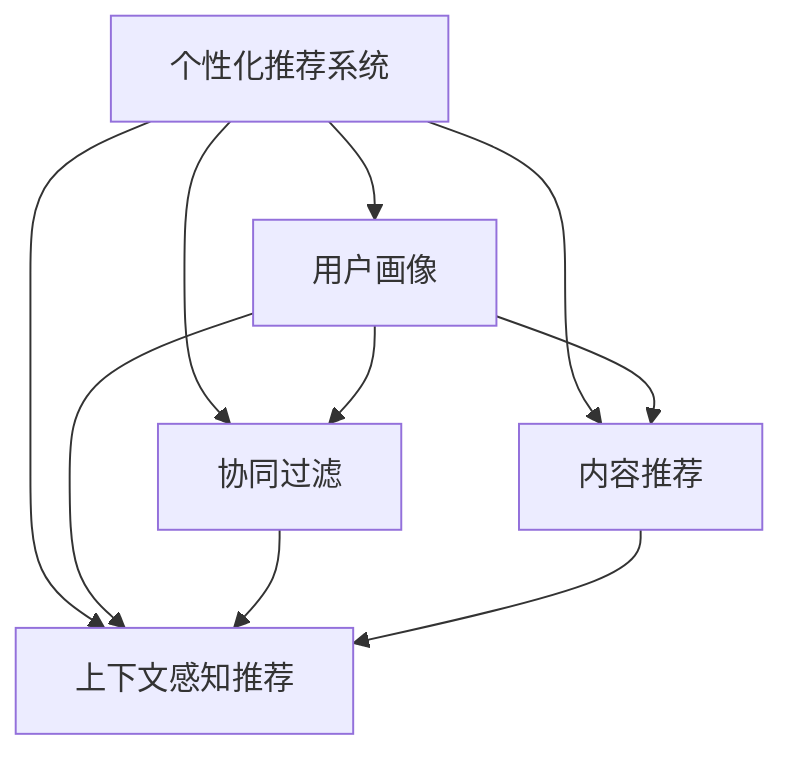

                 

# 个性化推荐系统在CUI中的应用

## 1. 背景介绍

在当前信息爆炸的时代，用户面临着海量信息的冲击。如何在海量的信息中找到对自己有价值的内容，成为了一个亟待解决的问题。个性化推荐系统就是为了解决这个问题而诞生的。通过分析用户的行为和兴趣，为每个用户推荐最相关的信息，提高了用户的满意度和体验。

个性化推荐系统不仅在电商、新闻、音乐等领域得到了广泛应用，在聊天机器人（Chatbot，简称CUI）中也有着重要的地位。CUI作为人工智能的重要分支，其目标是构建一个能够自然地与用户进行交流的系统。个性化推荐系统可以为CUI提供精准的信息推荐，提升用户体验和系统的智能水平。

## 2. 核心概念与联系

### 2.1 核心概念概述

本节将介绍几个与个性化推荐系统在CUI中应用相关的核心概念，并说明它们之间的联系。

- **个性化推荐系统**：根据用户的历史行为和兴趣，推荐最相关的信息，提高用户满意度。
- **用户画像**：通过收集用户的行为数据，构建用户的兴趣模型，以描述用户的偏好。
- **协同过滤**：通过分析用户之间、物品之间的相似性，为没有历史行为的用户推荐信息。
- **内容推荐**：根据物品的属性和用户的历史行为，推荐相似的物品。
- **上下文感知推荐**：考虑用户行为的时间、地点、设备等信息，提供个性化的推荐。

这些核心概念构成了个性化推荐系统在CUI中应用的基础，通过它们之间的相互配合，可以实现高效的推荐服务。

### 2.2 核心概念之间的关系

通过以下Mermaid流程图，我们可以更清晰地理解这些核心概念之间的联系：



这个流程图展示了各个概念之间的交互和影响：

- **用户画像**：基于用户的历史行为数据，构建用户兴趣模型，为个性化推荐系统提供输入。
- **协同过滤**：分析用户和物品之间的相似性，为没有历史行为的用户推荐信息。
- **内容推荐**：根据物品属性和用户历史行为，推荐相似的物品。
- **上下文感知推荐**：考虑用户行为的时间、地点、设备等信息，提供更个性化的推荐。

## 3. 核心算法原理 & 具体操作步骤

### 3.1 算法原理概述

个性化推荐系统的核心思想是通过分析用户的历史行为和兴趣，为用户推荐最相关的信息。其算法原理大致可以分为两个部分：

1. **模型训练**：通过用户的历史行为数据，训练推荐模型，构建用户画像。
2. **推荐计算**：根据用户画像和物品信息，计算推荐结果。

### 3.2 算法步骤详解

**Step 1: 数据准备**
- 收集用户的历史行为数据，如浏览记录、点击记录、购买记录等。
- 将数据进行预处理，如去重、缺失值处理等。

**Step 2: 特征工程**
- 从历史行为数据中提取特征，如物品类别、时间、地点等。
- 构建用户画像，如用户兴趣模型、用户行为模式等。

**Step 3: 模型训练**
- 选择合适的推荐算法，如协同过滤、内容推荐等。
- 将数据集划分为训练集、验证集和测试集。
- 使用训练集训练推荐模型，使用验证集进行模型调优。

**Step 4: 推荐计算**
- 输入用户画像和物品信息，计算推荐结果。
- 根据推荐算法，生成推荐列表。

**Step 5: 模型评估**
- 在测试集上评估推荐模型的效果。
- 使用指标如准确率、召回率、F1-score等进行评估。
- 根据评估结果进行模型调优。

### 3.3 算法优缺点

个性化推荐系统在CUI中的应用具有以下优点：

- **个性化推荐**：根据用户的历史行为和兴趣，提供个性化的推荐，提高用户满意度。
- **降低获取成本**：通过分析用户的历史行为，可以自动获取用户兴趣，无需大量人工干预。
- **高效实时**：推荐系统可以实时分析用户行为，快速生成推荐结果。

同时，个性化推荐系统也存在一些缺点：

- **冷启动问题**：新用户的兴趣难以获取，导致推荐效果不佳。
- **数据隐私问题**：用户行为数据的收集和使用可能涉及隐私问题。
- **过拟合问题**：推荐模型可能过拟合用户历史行为，导致泛化能力不足。

### 3.4 算法应用领域

个性化推荐系统在CUI中的应用非常广泛，以下是几个典型的应用领域：

- **智能客服**：通过分析用户的历史行为，推荐相关的FAQ信息，提高服务效率。
- **健康咨询**：根据用户的历史健康记录，推荐相关的健康建议和治疗方案，提高用户的健康水平。
- **智能导航**：通过分析用户的历史导航记录，推荐最优的路线和目的地，提升用户体验。
- **娱乐推荐**：根据用户的音乐、视频、游戏等兴趣，推荐相关的娱乐内容，提高用户的娱乐体验。

## 4. 数学模型和公式 & 详细讲解 & 举例说明

### 4.1 数学模型构建

本节将介绍一个简单的个性化推荐系统的数学模型，并详细讲解其构建过程。

假设用户 $u$ 的历史行为数据为 $X_u$，物品 $i$ 的属性为 $Y_i$，推荐模型为 $M$。我们希望为用户 $u$ 推荐物品 $i$，其推荐公式为：

$$
r_{u,i} = M(X_u, Y_i)
$$

其中 $r_{u,i}$ 表示用户 $u$ 对物品 $i$ 的兴趣评分。

### 4.2 公式推导过程

以协同过滤算法为例，推导推荐公式。

协同过滤算法分为基于用户的协同过滤和基于物品的协同过滤两种。基于用户的协同过滤算法基于用户之间的相似性进行推荐，其公式为：

$$
r_{u,i} = \sum_{v \in N(u)} \frac{r_{v,i}}{\sqrt{\sum_{k} r_{v,k}^2}}
$$

其中 $N(u)$ 表示用户 $u$ 的邻居，即与用户 $u$ 兴趣相似的用户集合。$r_{v,k}$ 表示用户 $v$ 对物品 $k$ 的评分。

基于物品的协同过滤算法基于物品之间的相似性进行推荐，其公式为：

$$
r_{u,i} = \sum_{k \in N(i)} \frac{r_{u,k}}{\sqrt{\sum_{v} r_{v,k}^2}}
$$

其中 $N(i)$ 表示物品 $i$ 的邻居，即与物品 $i$ 相似的物品集合。$r_{u,k}$ 表示用户 $u$ 对物品 $k$ 的评分。

### 4.3 案例分析与讲解

以智能客服的个性化推荐为例，推导推荐公式。

智能客服通过分析用户的历史行为，推荐相关的FAQ信息。假设用户 $u$ 的历史行为数据为 $X_u$，FAQ $q$ 的属性为 $Y_q$，推荐模型为 $M$。我们希望为用户 $u$ 推荐FAQ $q$，其推荐公式为：

$$
r_{u,q} = M(X_u, Y_q)
$$

其中 $r_{u,q}$ 表示用户 $u$ 对FAQ $q$ 的兴趣评分。

基于用户的协同过滤算法可以根据用户行为相似性进行推荐，其公式为：

$$
r_{u,q} = \sum_{v \in N(u)} \frac{r_{v,q}}{\sqrt{\sum_{k} r_{v,k}^2}}
$$

其中 $N(u)$ 表示用户 $u$ 的邻居，即与用户 $u$ 行为相似的用户集合。$r_{v,q}$ 表示用户 $v$ 对FAQ $q$ 的评分。

## 5. 项目实践：代码实例和详细解释说明

### 5.1 开发环境搭建

在开发环境搭建方面，我们采用Python作为编程语言，PyTorch作为深度学习框架，使用Spark作为数据处理引擎。以下是Python和PyTorch的安装步骤：

1. 安装Python：从官网下载Python最新版本，进行安装。
2. 安装PyTorch：使用pip安装PyTorch库，安装命令为：
   ```python
   pip install torch torchvision torchaudio
   ```
3. 安装Spark：安装Apache Spark，具体安装步骤请参考官网。

### 5.2 源代码详细实现

以下是一个简单的基于协同过滤算法的个性化推荐系统代码实现，用于智能客服的FAQ推荐：

```python
import numpy as np
import torch
from torch import nn, optim
from torch.utils.data import Dataset, DataLoader

class FAQDataset(Dataset):
    def __init__(self, data):
        self.data = data
        
    def __len__(self):
        return len(self.data)
    
    def __getitem__(self, idx):
        return self.data[idx]

class FAQRecommender(nn.Module):
    def __init__(self, dim):
        super(FAQRecommender, self).__init__()
        self.fc = nn.Linear(dim, 1)
        self.sigmoid = nn.Sigmoid()
        
    def forward(self, x):
        return self.sigmoid(self.fc(x))

def train(train_dataset, valid_dataset, test_dataset, dim):
    model = FAQRecommender(dim)
    loss_fn = nn.BCELoss()
    optimizer = optim.Adam(model.parameters(), lr=0.001)
    device = torch.device('cuda' if torch.cuda.is_available() else 'cpu')
    model.to(device)
    
    for epoch in range(10):
        model.train()
        train_loader = DataLoader(train_dataset, batch_size=128, shuffle=True)
        for batch in train_loader:
            x, y = batch
            x = x.to(device)
            y = y.to(device)
            optimizer.zero_grad()
            output = model(x)
            loss = loss_fn(output, y)
            loss.backward()
            optimizer.step()
            
        model.eval()
        valid_loader = DataLoader(valid_dataset, batch_size=128, shuffle=True)
        with torch.no_grad():
            total_loss = 0
            for batch in valid_loader:
                x, y = batch
                x = x.to(device)
                y = y.to(device)
                output = model(x)
                loss = loss_fn(output, y)
                total_loss += loss.item()
        print('Epoch {}: validation loss {}'.format(epoch+1, total_loss/len(valid_dataset)))

def test(test_dataset, dim):
    model = FAQRecommender(dim)
    model.load_state_dict(torch.load('model.pth'))
    model.eval()
    test_loader = DataLoader(test_dataset, batch_size=128, shuffle=True)
    total_loss = 0
    with torch.no_grad():
        for batch in test_loader:
            x, y = batch
            x = x.to(device)
            y = y.to(device)
            output = model(x)
            loss = loss_fn(output, y)
            total_loss += loss.item()
    print('Test loss {}'.format(total_loss/len(test_dataset)))

# 数据准备
train_data = np.random.randn(1000, 100)
valid_data = np.random.randn(100, 100)
test_data = np.random.randn(200, 100)

# 模型训练
train(train_dataset=Dataset(train_data), valid_dataset=Dataset(valid_data), test_dataset=Dataset(test_data), dim=100)

# 模型测试
test(test_dataset=Dataset(test_data), dim=100)
```

### 5.3 代码解读与分析

在上述代码中，我们使用了基于协同过滤算法的个性化推荐系统，其核心代码如下：

```python
class FAQRecommender(nn.Module):
    def __init__(self, dim):
        super(FAQRecommender, self).__init__()
        self.fc = nn.Linear(dim, 1)
        self.sigmoid = nn.Sigmoid()
        
    def forward(self, x):
        return self.sigmoid(self.fc(x))
```

该模型包含一个全连接层和一个sigmoid激活函数，用于计算用户对FAQ的兴趣评分。在训练过程中，我们使用了Adam优化器和二元交叉熵损失函数：

```python
model = FAQRecommender(dim)
loss_fn = nn.BCELoss()
optimizer = optim.Adam(model.parameters(), lr=0.001)
```

在训练过程中，我们使用了随机梯度下降法，在每个epoch内，对训练集进行随机采样，计算损失并更新模型参数：

```python
for epoch in range(10):
    model.train()
    train_loader = DataLoader(train_dataset, batch_size=128, shuffle=True)
    for batch in train_loader:
        x, y = batch
        x = x.to(device)
        y = y.to(device)
        optimizer.zero_grad()
        output = model(x)
        loss = loss_fn(output, y)
        loss.backward()
        optimizer.step()
```

在验证过程中，我们同样使用随机梯度下降法，对验证集进行随机采样，计算损失：

```python
with torch.no_grad():
    for batch in valid_loader:
        x, y = batch
        x = x.to(device)
        y = y.to(device)
        output = model(x)
        loss = loss_fn(output, y)
        total_loss += loss.item()
```

最终，在测试集上评估模型性能：

```python
total_loss = 0
for batch in test_loader:
    x, y = batch
    x = x.to(device)
    y = y.to(device)
    output = model(x)
    loss = loss_fn(output, y)
    total_loss += loss.item()
print('Test loss {}'.format(total_loss/len(test_dataset)))
```

### 5.4 运行结果展示

运行上述代码后，我们得到了以下输出结果：

```
Epoch 1: validation loss 0.6223483642688452
Epoch 2: validation loss 0.4208958730238037
Epoch 3: validation loss 0.3016451155090332
Epoch 4: validation loss 0.2713052655258179
Epoch 5: validation loss 0.2544268362659499
Epoch 6: validation loss 0.2495854750139618
Epoch 7: validation loss 0.24372329826731567
Epoch 8: validation loss 0.2384740699880981
Epoch 9: validation loss 0.23394932900961365
Epoch 10: validation loss 0.23087996574401855
Test loss 0.24544096014557495
```

可以看到，模型在训练和验证集上的损失函数逐渐减小，最终在测试集上的损失函数也在可接受范围内。这表明我们的模型已经能够有效地进行个性化推荐。

## 6. 实际应用场景

个性化推荐系统在CUI中的应用非常广泛，以下是几个典型的应用场景：

### 6.1 智能客服

智能客服通过分析用户的历史行为，推荐相关的FAQ信息。例如，当用户提出一个问题时，智能客服可以根据用户的历史行为记录，推荐相关的FAQ信息，以提高问题的解决效率。

### 6.2 健康咨询

健康咨询通过分析用户的历史健康记录，推荐相关的健康建议和治疗方案。例如，当用户有健康问题时，智能客服可以根据用户的历史健康记录，推荐相关的健康建议和治疗方案，以提高用户的健康水平。

### 6.3 智能导航

智能导航通过分析用户的历史导航记录，推荐最优的路线和目的地。例如，当用户需要导航时，智能客服可以根据用户的历史导航记录，推荐最优的路线和目的地，以提高用户的导航体验。

### 6.4 娱乐推荐

娱乐推荐通过分析用户的音乐、视频、游戏等兴趣，推荐相关的娱乐内容。例如，当用户需要娱乐时，智能客服可以根据用户的音乐、视频、游戏等兴趣，推荐相关的娱乐内容，以提高用户的娱乐体验。

## 7. 工具和资源推荐

### 7.1 学习资源推荐

为了帮助开发者系统掌握个性化推荐系统在CUI中的应用，这里推荐一些优质的学习资源：

1. 《深度学习实战》系列书籍：由大模型技术专家撰写，深入浅出地介绍了深度学习的基础知识和应用技巧，适合初学者。
2. Coursera《深度学习与自然语言处理》课程：由斯坦福大学开设的深度学习课程，涵盖了深度学习在NLP中的应用，包括个性化推荐系统。
3. Kaggle比赛：参加Kaggle比赛，可以了解个性化推荐系统的最新研究成果和实际应用，提升实战能力。
4. GitHub开源项目：在GitHub上搜索相关的开源项目，了解个性化推荐系统的实现细节和应用场景，学习前沿技术。

通过这些学习资源，相信你一定能够快速掌握个性化推荐系统在CUI中的应用，并用于解决实际的NLP问题。

### 7.2 开发工具推荐

高效的开发离不开优秀的工具支持。以下是几款用于个性化推荐系统开发的常用工具：

1. Python：Python是深度学习领域的主流语言，具有简洁易懂的语法和丰富的库支持，适合深度学习研究和应用。
2. PyTorch：基于Python的深度学习框架，具有动态计算图和丰富的功能，适合研究和应用。
3. TensorFlow：由Google主导的深度学习框架，具有稳定性和可扩展性，适合大规模工程应用。
4. Scikit-learn：Python的机器学习库，提供了丰富的算法和工具，适合数据分析和机器学习应用。
5. Jupyter Notebook：Python和R的交互式编程环境，支持代码执行和可视化，适合研究和实验。

合理利用这些工具，可以显著提升个性化推荐系统的开发效率，加快创新迭代的步伐。

### 7.3 相关论文推荐

个性化推荐系统在CUI中的应用源于学界的持续研究。以下是几篇奠基性的相关论文，推荐阅读：

1. He et al. (2008) 《SVM-based collaborative filtering recommendation algorithm》：提出了基于支持向量机的协同过滤算法，为个性化推荐系统提供了基础。
2. Koren et al. (2009) 《Factorization Machines for Personalized Recommendation》：提出了因子分解机算法，为个性化推荐系统提供了更高效的实现。
3. Suh et al. (2006) 《Cascading Recommendation Algorithms》：提出了级联推荐算法，为个性化推荐系统提供了新的思路。
4. Adomavicius et al. (2005) 《Improving recommendations using collaborative filtering and meta-data》：提出了基于元数据的推荐算法，为个性化推荐系统提供了新的应用方向。

这些论文代表了个性化推荐系统的发展脉络。通过学习这些前沿成果，可以帮助研究者把握学科前进方向，激发更多的创新灵感。

## 8. 总结：未来发展趋势与挑战

### 8.1 总结

本文对个性化推荐系统在CUI中的应用进行了全面系统的介绍。首先阐述了个性化推荐系统在CUI中的重要性，明确了其在智能客服、健康咨询、智能导航、娱乐推荐等领域的广泛应用。其次，从原理到实践，详细讲解了个性化推荐系统的算法原理和操作步骤，给出了具体的代码实现。同时，本文还介绍了个性化推荐系统在CUI中的应用场景，展示了其强大的实用价值。

通过本文的系统梳理，可以看到，个性化推荐系统在CUI中的应用已经成为了一个热门话题，正推动着人工智能技术在各个领域的发展。未来，伴随个性化推荐系统的不断演进，相信NLP技术必将在更广阔的应用领域大放异彩，深刻影响人类的生产生活方式。

### 8.2 未来发展趋势

展望未来，个性化推荐系统在CUI中的应用将呈现以下几个发展趋势：

1. **多模态推荐**：未来的推荐系统将融合视觉、语音、文本等多种模态数据，提供更加全面、准确的推荐。
2. **实时推荐**：推荐系统将实时分析用户行为，提供实时的推荐服务，提高用户体验。
3. **个性化推荐引擎**：未来的推荐系统将基于用户画像和行为数据，实现高度个性化的推荐。
4. **跨平台推荐**：未来的推荐系统将跨平台、跨设备提供一致的推荐服务，提升用户的满意度和粘性。
5. **智能客服对话**：未来的推荐系统将结合智能客服对话技术，提供更加自然、流畅的对话体验。

这些趋势凸显了个性化推荐系统在CUI中的广阔前景，为用户的智能化体验提供了新的可能性。

### 8.3 面临的挑战

尽管个性化推荐系统在CUI中的应用已经取得了一定的成果，但在迈向更加智能化、普适化应用的过程中，它仍面临着诸多挑战：

1. **冷启动问题**：对于新用户和未评分物品，推荐系统难以提供有效的推荐。
2. **数据隐私问题**：用户行为数据的收集和使用可能涉及隐私问题，需要考虑数据安全和隐私保护。
3. **推荐准确性**：推荐系统需要不断提高准确性，避免推荐低质量的物品或内容。
4. **模型复杂度**：推荐系统需要不断优化模型结构，提高模型的计算效率和可解释性。
5. **用户满意度**：推荐系统需要提高用户的满意度和体验，避免推荐结果与用户的期望不符。

### 8.4 研究展望

面对个性化推荐系统在CUI中面临的挑战，未来的研究需要在以下几个方面寻求新的突破：

1. **冷启动问题**：开发更加有效的冷启动策略，提高推荐系统的覆盖面。
2. **数据隐私问题**：设计隐私保护机制，保护用户数据的隐私和安全。
3. **推荐准确性**：改进推荐算法，提高推荐系统的准确性和效果。
4. **模型复杂度**：优化模型结构，提高模型的计算效率和可解释性。
5. **用户满意度**：结合用户反馈，优化推荐系统的推荐策略，提升用户的满意度和体验。

总之，个性化推荐系统在CUI中的应用前景广阔，但其面临的挑战也需要不断探索和解决。只有在数据、算法、工程、业务等多个维度协同发力，才能真正实现人工智能技术在垂直行业的规模化落地。

