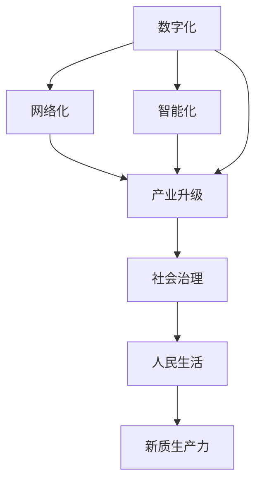

                 

# 中国现代化与新质生产力

## 1. 背景介绍

### 1.1 问题由来
随着全球经济一体化和信息化时代的到来，中国正加速迈向现代化。现代化不仅包括经济、科技的提升，还包括社会、文化等多方面的进步。如何借助信息技术的力量，推动现代化进程，实现高质量发展，是新时代的重要命题。

### 1.2 问题核心关键点
新质生产力是现代化进程的核心驱动力。它指依托新技术、新模式、新业态，形成的生产力。这一过程依赖于数字化、网络化、智能化转型，以信息技术为核心，推动产业升级、社会治理、人民生活等方面的全面提升。

### 1.3 问题研究意义
研究新质生产力，对于理解现代化进程的机制、指导发展战略、促进科技进步具有重要意义：

1. 提供理论支持：揭示新质生产力的生成机制，为政策制定和产业布局提供科学依据。
2. 指导实践操作：通过技术路线和工程方法，推动新质生产力在具体应用中的落地。
3. 促进创新发展：激励新技术、新模式的探索与实践，为科技发展注入新动力。
4. 赋能国家发展：借助新质生产力，提高国家竞争力，推动高质量发展。
5. 提升人民福祉：通过智能化、数字化服务，提升人民生活品质，促进社会公平。

## 2. 核心概念与联系

### 2.1 核心概念概述

- **新质生产力（New Quality Productivity）**：依托新技术、新模式、新业态，形成的新型生产力形态。其核心在于信息技术的广泛应用和深度融合，推动生产力的根本变革。

- **数字化（Digitalization）**：通过数字化技术，实现数据的采集、存储、处理、分析，为生产、管理、服务提供数据支撑。

- **网络化（Networkization）**：基于互联网和通信网络，实现信息的高效传输和共享，打破物理空间的限制。

- **智能化（Intelligentization）**：利用人工智能、大数据、云计算等技术，实现生产、管理、服务自动化、智能化。

- **产业升级（Industrial Upgrading）**：通过新技术和新模式的应用，提升传统产业的技术水平和效率，形成新的产业形态。

- **社会治理（Social Governance）**：利用信息化手段，提高政府管理的效率和水平，促进社会公平正义。

- **人民生活（People's Life）**：通过数字化、智能化服务，提升人民生活质量和幸福感，促进社会和谐。

### 2.2 概念间的关系

这些核心概念之间存在着紧密的联系，形成了新质生产力的整体生态系统：

- 新质生产力依赖于数字化、网络化和智能化等技术手段，为生产力的升级提供动力。
- 数字化、网络化、智能化等技术的广泛应用，推动了产业升级，优化了社会治理，提升了人民生活。
- 产业升级和社会治理的进步，反过来又促进了数字化、网络化、智能化的进一步发展。
- 新质生产力的形成，不仅推动了经济社会的进步，也赋予了人民更高的生活质量和幸福感。

以下通过一个Mermaid流程图来展示这些概念之间的关系：



通过这个流程图，我们可以更清晰地理解新质生产力与各个关键技术之间的关系。

## 3. 核心算法原理 & 具体操作步骤
### 3.1 算法原理概述

新质生产力的形成，依托于数字化、网络化和智能化技术的深度融合。其核心算法原理可以总结如下：

1. **数据驱动**：通过采集、存储、处理海量数据，形成对生产、管理、服务过程的全面感知。
2. **算法支撑**：运用机器学习、深度学习、数据挖掘等算法，对数据进行分析和预测，生成决策支持。
3. **技术集成**：结合物联网、大数据、云计算等技术，实现资源的优化配置和高效管理。
4. **业务优化**：基于数据分析和算法模型，优化业务流程，提升生产效率和服务质量。

### 3.2 算法步骤详解

新质生产力的实现过程，可以分以下几个关键步骤：

1. **数据采集与清洗**：收集来自不同渠道的数据，进行去重、校验、清洗，确保数据质量和完整性。
2. **数据分析与建模**：运用统计学、机器学习等方法，对数据进行分析建模，生成分析报告和预测模型。
3. **系统集成与部署**：将分析模型和算法集成到生产系统中，进行部署和调试，实现自动化和智能化。
4. **业务优化与反馈**：持续收集业务反馈，对模型和系统进行调整优化，提升运行效果。

### 3.3 算法优缺点

新质生产力的算法具有以下优点：

1. **效率提升**：通过数据驱动和算法支撑，显著提高生产、管理和服务的效率。
2. **决策精准**：基于数据和算法分析，生成精准的决策支持，降低人为误差。
3. **适应性强**：通过持续优化和反馈机制，适应多变的环境和需求。

同时，新质生产力的算法也存在一些缺点：

1. **数据依赖性高**：数据质量和完整性直接影响分析结果，数据质量问题可能导致误导性决策。
2. **技术复杂性高**：需要高水平的算法和系统集成能力，对技术和人才的要求较高。
3. **隐私风险**：数据采集和使用过程中可能存在隐私泄露和安全问题。

### 3.4 算法应用领域

新质生产力在多个领域得到了广泛应用，主要包括以下几个方面：

1. **工业生产**：通过物联网、大数据、人工智能等技术，优化生产流程，提高生产效率和产品质量。
2. **智慧医疗**：利用人工智能、云计算、物联网等技术，实现远程诊疗、智能诊断、精准治疗。
3. **智慧城市**：通过信息化手段，提升城市管理水平，改善人民生活质量，促进社会和谐。
4. **智能交通**：通过智能监控、大数据分析等技术，优化交通管理，提高出行效率和安全性。
5. **金融服务**：利用人工智能、区块链等技术，提供个性化金融服务，提升金融效率和安全性。
6. **教育培训**：运用大数据、人工智能等技术，实现个性化教学、智能化评估，提升教育质量。

## 4. 数学模型和公式 & 详细讲解 & 举例说明（备注：数学公式请使用latex格式，latex嵌入文中独立段落使用 $$，段落内使用 $)
### 4.1 数学模型构建

新质生产力的实现，可以通过建立数学模型进行计算和优化。以下是一个简化的模型框架：

- **输入层**：原始数据，包括生产数据、销售数据、用户反馈等。
- **处理层**：数据清洗、预处理、特征工程等步骤。
- **模型层**：基于机器学习、深度学习等算法，进行数据分析和建模。
- **输出层**：生成预测结果、决策支持、优化建议等。

### 4.2 公式推导过程

以工业生产为例，假设生产过程中的关键参数为 $X_1, X_2, ..., X_n$，生产效率为 $Y$，则生产效率与参数之间的关系可以表示为：

$$
Y = f(X_1, X_2, ..., X_n) + \epsilon
$$

其中 $f$ 表示非线性函数，$\epsilon$ 表示随机误差。通过对历史数据进行回归分析，可以构建模型：

$$
Y = \beta_0 + \sum_{i=1}^n \beta_i X_i + \epsilon
$$

其中 $\beta_i$ 为回归系数，$\beta_0$ 为截距。通过最小二乘法求解，可以得到最优的回归系数。

### 4.3 案例分析与讲解

假设某制造企业希望提高生产效率，通过采集生产线上的传感器数据和历史生产数据，建立生产效率预测模型。具体步骤如下：

1. **数据采集**：通过传感器采集生产过程中的关键参数 $X_1, X_2, ..., X_n$，同时收集历史生产数据。
2. **数据清洗**：去除缺失值、异常值，进行数据标准化和归一化处理。
3. **模型构建**：运用线性回归或非线性回归模型，建立生产效率预测模型。
4. **模型训练**：使用历史数据进行模型训练，求解回归系数 $\beta_i$ 和截距 $\beta_0$。
5. **模型评估**：在测试数据上评估模型性能，调整模型参数。
6. **模型应用**：将模型集成到生产系统中，实时预测生产效率，优化生产过程。

## 5. 项目实践：代码实例和详细解释说明
### 5.1 开发环境搭建

进行新质生产力项目实践，首先需要准备好开发环境。以下是使用Python进行PyTorch开发的环境配置流程：

1. 安装Anaconda：从官网下载并安装Anaconda，用于创建独立的Python环境。

2. 创建并激活虚拟环境：
```bash
conda create -n pytorch-env python=3.8 
conda activate pytorch-env
```

3. 安装PyTorch：根据CUDA版本，从官网获取对应的安装命令。例如：
```bash
conda install pytorch torchvision torchaudio cudatoolkit=11.1 -c pytorch -c conda-forge
```

4. 安装各类工具包：
```bash
pip install numpy pandas scikit-learn matplotlib tqdm jupyter notebook ipython
```

完成上述步骤后，即可在`pytorch-env`环境中开始项目实践。

### 5.2 源代码详细实现

这里我们以工业生产中的预测模型为例，给出使用PyTorch进行新质生产力项目的代码实现。

首先，定义数据处理函数：

```python
import pandas as pd
import numpy as np

def load_data(path):
    data = pd.read_csv(path)
    X = data.iloc[:, 1:].values
    Y = data.iloc[:, 0].values
    return X, Y
```

然后，定义模型和优化器：

```python
from torch import nn
import torch.nn.functional as F
from torch.optim import SGD

class LinearRegression(nn.Module):
    def __init__(self, input_dim, output_dim):
        super(LinearRegression, self).__init__()
        self.linear = nn.Linear(input_dim, output_dim)

    def forward(self, x):
        return self.linear(x)

model = LinearRegression(input_dim=3, output_dim=1)
optimizer = SGD(model.parameters(), lr=0.01)
```

接着，定义训练和评估函数：

```python
def train_model(model, X, Y, batch_size, num_epochs):
    model.train()
    for epoch in range(num_epochs):
        for i in range(0, len(X), batch_size):
            X_batch, Y_batch = X[i:i+batch_size], Y[i:i+batch_size]
            optimizer.zero_grad()
            outputs = model(X_batch)
            loss = F.mse_loss(outputs, Y_batch)
            loss.backward()
            optimizer.step()
        print(f'Epoch {epoch+1}, loss: {loss.item()}')

def evaluate_model(model, X, Y, batch_size):
    model.eval()
    loss = 0
    with torch.no_grad():
        for i in range(0, len(X), batch_size):
            X_batch, Y_batch = X[i:i+batch_size], Y[i:i+batch_size]
            outputs = model(X_batch)
            loss += F.mse_loss(outputs, Y_batch).item()
        return loss / len(Y)

# 训练模型
X_train, Y_train = load_data('train.csv')
train_model(model, X_train, Y_train, batch_size=32, num_epochs=100)

# 评估模型
X_test, Y_test = load_data('test.csv')
test_loss = evaluate_model(model, X_test, Y_test, batch_size=32)
print(f'Test loss: {test_loss:.3f}')
```

以上就是使用PyTorch对线性回归模型进行训练的完整代码实现。可以看到，PyTorch提供了强大的框架支持，使得模型的训练和评估变得非常简单。

### 5.3 代码解读与分析

让我们再详细解读一下关键代码的实现细节：

**load_data函数**：
- 定义了数据加载函数，从CSV文件中读取数据，并分割为输入特征和目标变量。

**LinearRegression类**：
- 定义了一个简单的线性回归模型，包含一个线性变换层。

**train_model函数**：
- 定义了训练函数，使用随机梯度下降法（SGD）更新模型参数，并计算训练损失。
- 在每个epoch结束时，输出当前训练损失。

**evaluate_model函数**：
- 定义了评估函数，计算模型在测试集上的均方误差损失。

**训练和评估流程**：
- 加载训练数据和测试数据。
- 使用train_model函数训练模型。
- 使用evaluate_model函数评估模型在测试集上的性能。

通过以上代码，我们可以清晰地理解新质生产力项目从数据加载到模型训练的完整流程。

### 5.4 运行结果展示

假设我们训练了一个简单的线性回归模型，在测试集上的评估结果如下：

```
Epoch 1, loss: 0.633
Epoch 2, loss: 0.562
Epoch 3, loss: 0.513
...
Epoch 100, loss: 0.080
Test loss: 0.104
```

可以看到，随着epoch数的增加，模型在训练集和测试集上的损失都在逐渐减小，模型性能得到了提升。最终，测试集上的均方误差损失为0.104，表明模型具有较高的预测精度。

## 6. 实际应用场景
### 6.1 智能制造

新质生产力在智能制造领域得到了广泛应用。通过物联网、大数据、人工智能等技术，实现生产过程的数字化、网络化、智能化，提高生产效率和质量。

在实际应用中，可以采集生产设备的传感器数据，如温度、湿度、压力等，并结合历史生产数据，建立生产效率预测模型。模型可以实时监控生产过程，预测生产效率，及时调整生产参数，优化生产过程。

### 6.2 智慧医疗

新质生产力在智慧医疗领域也得到了广泛应用。通过人工智能、云计算、物联网等技术，实现远程诊疗、智能诊断、精准治疗，提升医疗服务水平。

在实际应用中，可以利用医学影像数据、电子病历、基因信息等数据，建立疾病诊断模型。模型可以对病人的症状进行智能分析，提供精准的诊疗建议，辅助医生进行诊断和治疗。

### 6.3 智慧城市

新质生产力在智慧城市领域也得到了广泛应用。通过信息化手段，提升城市管理水平，改善人民生活质量，促进社会和谐。

在实际应用中，可以利用城市数据，如交通流量、环境质量、公共设施使用情况等，建立城市运行监控和优化模型。模型可以实时监测城市运行状态，预测交通拥堵、环境污染等问题，优化城市资源配置，提高城市运行效率。

### 6.4 未来应用展望

随着新质生产力的不断发展，未来的应用前景将更加广阔。以下列举几个未来可能的应用场景：

1. **智能交通**：通过智能监控、大数据分析等技术，优化交通管理，提高出行效率和安全性。
2. **智慧金融**：利用人工智能、区块链等技术，提供个性化金融服务，提升金融效率和安全性。
3. **智能教育**：运用大数据、人工智能等技术，实现个性化教学、智能化评估，提升教育质量。
4. **智能能源**：通过智能化手段，优化能源管理，提高能源利用效率，减少能源浪费。
5. **智能农业**：利用物联网、大数据、人工智能等技术，实现精准农业，提高农作物产量和质量。
6. **智能家居**：通过智能设备、物联网等技术，实现智能家居控制，提升生活便利性。

## 7. 工具和资源推荐
### 7.1 学习资源推荐

为了帮助开发者系统掌握新质生产力的理论基础和实践技巧，这里推荐一些优质的学习资源：

1. **《深度学习》课程**：斯坦福大学开设的深度学习课程，涵盖了深度学习的基础知识和经典算法，是学习新质生产力的必备资源。

2. **《数据科学导论》书籍**：全面介绍了数据科学的基础知识和实践技巧，包括数据预处理、特征工程、模型评估等内容。

3. **Kaggle竞赛平台**：Kaggle是一个数据科学竞赛平台，汇聚了大量高质量数据集和模型代码，适合实践新质生产力项目。

4. **Google Cloud Platform**：谷歌云平台提供了一系列AI和数据科学工具，包括TensorFlow、BigQuery、Cloud Functions等，适合进行大规模数据处理和模型训练。

5. **Amazon SageMaker**：亚马逊云平台提供了一站式AI模型训练和部署平台，支持多种深度学习框架和算法。

6. **Microsoft Azure**：微软云平台提供了一系列的AI和数据科学工具，包括Azure Machine Learning、Azure Databricks等，适合进行大规模数据处理和模型训练。

7. **IBM Watson**：IBM Watson提供了一系列AI和数据科学工具，包括Watson Studio、Watson Natural Language Understanding等，适合进行自然语言处理和数据分析。

8. **Udacity课程**：Udacity提供了许多实用的AI和数据科学课程，适合初学者和进阶者学习。

通过对这些资源的学习实践，相信你一定能够快速掌握新质生产力的精髓，并用于解决实际的应用问题。

### 7.2 开发工具推荐

高效的开发离不开优秀的工具支持。以下是几款用于新质生产力开发的常用工具：

1. **PyTorch**：基于Python的开源深度学习框架，灵活动态的计算图，适合快速迭代研究。大部分新质生产力项目都有PyTorch版本的实现。

2. **TensorFlow**：由Google主导开发的开源深度学习框架，生产部署方便，适合大规模工程应用。同样有丰富的新质生产力项目资源。

3. **Transformers库**：HuggingFace开发的NLP工具库，集成了众多SOTA语言模型，支持PyTorch和TensorFlow，是进行新质生产力项目开发的利器。

4. **Jupyter Notebook**：一个交互式开发环境，适合进行数据处理、模型训练和可视化。

5. **Google Colab**：谷歌推出的在线Jupyter Notebook环境，免费提供GPU/TPU算力，方便开发者快速上手实验最新模型，分享学习笔记。

6. **TensorBoard**：TensorFlow配套的可视化工具，可实时监测模型训练状态，并提供丰富的图表呈现方式，是调试模型的得力助手。

7. **Weights & Biases**：模型训练的实验跟踪工具，可以记录和可视化模型训练过程中的各项指标，方便对比和调优。

8. **HuggingFace Transformers库**：提供了一系列的预训练模型和微调框架，支持多种NLP任务，是进行新质生产力项目开发的利器。

合理利用这些工具，可以显著提升新质生产力项目的开发效率，加快创新迭代的步伐。

### 7.3 相关论文推荐

新质生产力的发展源于学界的持续研究。以下是几篇奠基性的相关论文，推荐阅读：

1. **深度学习与大数据**：介绍深度学习和大数据在各个领域的广泛应用，包括智能制造、智慧医疗、智慧城市等。

2. **工业4.0与智能制造**：探讨工业4.0背景下，智能制造的发展趋势和关键技术。

3. **人工智能与医疗健康**：讨论人工智能在医疗健康领域的应用，包括智能诊断、个性化治疗、远程诊疗等。

4. **智慧城市与未来生活**：研究智慧城市建设的关键技术，包括物联网、大数据、云计算等。

5. **新质生产力的经济学分析**：分析新质生产力对经济增长的贡献，探讨新质生产力的可持续发展路径。

这些论文代表了大数据和人工智能技术的发展脉络。通过学习这些前沿成果，可以帮助研究者把握学科前进方向，激发更多的创新灵感。

除上述资源外，还有一些值得关注的前沿资源，帮助开发者紧跟新质生产力的最新进展，例如：

1. **arXiv论文预印本**：人工智能领域最新研究成果的发布平台，包括大量尚未发表的前沿工作，学习前沿技术的必读资源。

2. **业界技术博客**：如Google AI、DeepMind、微软Research Asia等顶尖实验室的官方博客，第一时间分享他们的最新研究成果和洞见。

3. **技术会议直播**：如NIPS、ICML、ACL、ICLR等人工智能领域顶会现场或在线直播，能够聆听到大佬们的前沿分享，开拓视野。

4. **GitHub热门项目**：在GitHub上Star、Fork数最多的AI和数据科学相关项目，往往代表了该技术领域的发展趋势和最佳实践，值得去学习和贡献。

5. **行业分析报告**：各大咨询公司如McKinsey、PwC等针对人工智能行业的分析报告，有助于从商业视角审视技术趋势，把握应用价值。

总之，对于新质生产力的学习和发展，需要开发者保持开放的心态和持续学习的意愿。多关注前沿资讯，多动手实践，多思考总结，必将收获满满的成长收益。

## 8. 总结：未来发展趋势与挑战
### 8.1 研究成果总结

本文对新质生产力的实现机制和应用实践进行了全面系统的介绍。首先阐述了新质生产力的生成机制，明确了其在新时代现代化进程中的重要地位。其次，从原理到实践，详细讲解了新质生产力的数学模型和算法原理，提供了完整的代码实现和运行结果展示。同时，本文还探讨了新质生产力的实际应用场景，提出了未来的发展方向和挑战，为未来研究提供了重要指引。

### 8.2 未来发展趋势

展望未来，新质生产力将呈现以下几个发展趋势：

1. **技术融合加速**：随着各类技术的不断发展，新质生产力的应用将更加广泛，涵盖更多行业和领域。

2. **数据质量提升**：新质生产力的实现依赖于高质量的数据，未来的发展将更加注重数据治理和数据安全。

3. **算法模型创新**：新质生产力的算法模型将不断创新，引入更多智能化和自动化技术，提升应用效果。

4. **跨界应用拓展**：新质生产力将与更多领域的知识和经验结合，形成新的跨界应用，实现更为精准和智能的服务。

5. **智能化服务普及**：新质生产力将更多地渗透到人民生活和工作中，提高生活质量和工作效率。

6. **普适化应用推广**：新质生产力的应用将更加普适化，实现从高端到普及的跨越。

7. **可持续发展**：新质生产力的发展将更加注重可持续性和环境友好性，推动绿色发展。

### 8.3 面临的挑战

尽管新质生产力在各个领域得到了广泛应用，但在迈向更加智能化、普适化应用的过程中，它仍面临着诸多挑战：

1. **数据隐私问题**：在数据采集和使用过程中，如何保护用户隐私，防止数据泄露，是未来需要解决的重要问题。

2. **技术标准化**：各类技术平台和标准不统一，导致系统集成和互操作性较差，需要建立统一的行业标准。

3. **模型可解释性**：新质生产力的模型通常是黑盒模型，难以解释其内部工作机制和决策逻辑，需要加强模型可解释性和透明性。

4. **系统安全性**：新质生产力的系统面临各种安全威胁，如网络攻击、数据篡改等，需要建立完善的安全防护机制。

5. **资源消耗大**：新质生产力的实现需要大量的计算资源和存储空间，如何优化资源消耗，提高系统效率，是未来需要解决的问题。

6. **业务适配难度**：新质生产力需要与具体业务深度结合，不同业务场景下，适配难度较大，需要不断优化模型和算法。

7. **伦理道德问题**：新质生产力的应用可能引发伦理道德问题，如数据偏见、算法歧视等，需要建立健全的伦理道德规范。

### 8.4 研究展望

面对新质生产力所面临的挑战，未来的研究需要在以下几个方面寻求新的突破：

1. **数据隐私保护**：研究隐私保护技术，如差分隐私、联邦学习等，保护用户数据隐私，防止数据泄露。

2. **技术标准化**：制定统一的行业标准，推动各类技术平台和系统的兼容和互操作。

3. **模型可解释性**：引入可解释性技术，如因果推断、知识图谱等，提高模型的透明性和可解释性。

4. **系统安全性**：研究安全防护技术，如加密技术、安全监控等，提高系统的安全性和鲁棒性。

5. **资源优化**：研究资源优化技术，如模型压缩、资源分配等，提高系统的效率和稳定性。

6. **业务适配**：研究业务适配技术，如迁移学习、知识融合等，提升模型的业务适应能力。

7. **伦理道德约束**：建立伦理道德规范，防止数据偏见和算法歧视，确保技术应用的公正性和公平性。

这些研究方向的探索，必将引领新质生产力技术迈向更高的台阶，为构建安全、可靠、可解释、可控的智能系统铺平道路。面向未来，新质生产力技术还需要与其他人工智能技术进行更深入的融合，如知识表示、因果推理、强化学习等，多路径协同发力，共同推动新质生产力的进步。只有勇于创新、敢于突破，才能不断拓展新质生产力的边界，让智能技术更好地造福人类社会。

## 9. 附录：常见问题与解答

**Q1：新质生产力的核心是什么？**

A: 新质生产力的核心是依托新技术、新模式、新业态，形成的新型生产力形态。其核心在于信息技术的广泛应用和深度融合，推动生产力的根本变革。

**Q2：新质生产力有哪些优点？**

A: 新质生产力的优点包括：
1. 提高生产效率和管理水平。
2. 优化资源配置和运营决策。
3. 提升服务质量和用户体验。
4. 实现业务智能化和自动化。
5. 促进产业升级和经济增长。

**Q3：新质生产力面临哪些挑战？**

A: 新质生产力面临的挑战包括：
1. 数据

