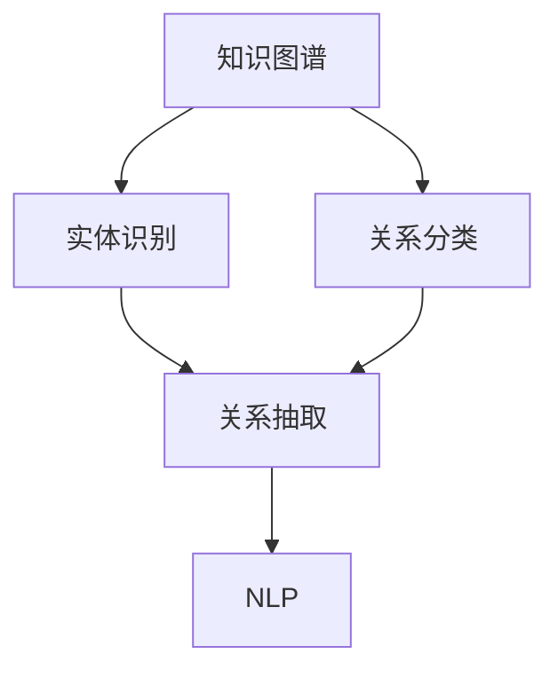

                 

# 中文医学文本中的关系抽取

## 1. 背景介绍

### 1.1 问题由来

医学关系抽取是自然语言处理(NLP)在医疗信息领域的一个重要应用，旨在从医学文本中自动抽取出各种实体及其之间的关系。例如，从临床记录中提取患者和药物之间的关系、疾病与基因之间的关系等。这种关系抽取技术不仅能够帮助医生快速获取关键信息，提高诊断和治疗的准确性，还能够促进医疗数据的整合和分析，推动医疗决策的智能化和科学化。

然而，中文医学文本由于其独特的语言特性和领域特点，给关系抽取带来了诸多挑战。中文医学文本中包含大量专业术语和语法结构，且常见的医疗实体如疾病、药物、症状等往往以不同的形式出现，这增加了关系抽取的复杂性。此外，中文文本的标注数据稀缺，难以训练高性能的模型。

因此，针对中文医学文本进行关系抽取，需要深入理解中文语言特性，开发适合中英文医学文本的抽取方法，以及充分利用少量标注数据进行模型训练。

### 1.2 问题核心关键点

医学关系抽取的核心在于构建和利用知识图谱，从大量医学文献和临床记录中抽取出实体和关系，建立医学领域的知识库。关系抽取技术的核心步骤包括：

- **实体识别**：从文本中识别出有意义的医学实体，如疾病、药物、基因等。
- **关系分类**：判断实体之间的关系类型，如药物-疾病关系、基因-疾病关系等。
- **关系抽取**：在识别出的实体对之间建立对应的关系。

对于中文医学文本，实体识别需要处理中文特有的词汇和语法，关系分类则需要结合领域知识进行规则设计，关系抽取则需要在大规模语料库上训练高精度的模型。

## 2. 核心概念与联系

### 2.1 核心概念概述

为了更好地理解中文医学文本中的关系抽取方法，我们首先介绍几个关键概念：

- **知识图谱**：由实体和关系构成的有向图，用于存储和表示领域内的知识。在医学领域，知识图谱包含了疾病、药物、基因等实体的信息，以及它们之间的关系。
- **实体识别**：从文本中自动识别出具有特定意义的实体，如人名、地名、机构名等。在医学领域，实体识别需要识别出疾病、药物、基因、症状等关键实体。
- **关系分类**：判断实体之间的关系类型，如药物-疾病关系、基因-疾病关系等。关系分类需要结合领域知识进行设计。
- **关系抽取**：在文本中抽取出实体之间的特定关系，如药物与疾病之间的相互作用、基因与疾病之间的关联等。关系抽取是关系抽取任务的核心。
- **自然语言处理(NLP)**：涉及语言模型、词向量表示、序列标注、信息抽取等技术，用于处理和理解自然语言文本。

### 2.2 概念间的关系

这些核心概念之间存在紧密的联系，共同构成了中文医学文本中的关系抽取体系。

- **知识图谱**和**实体识别**是关系抽取的基础。知识图谱提供了领域内的实体和关系信息，实体识别则从文本中自动识别出这些实体。
- **关系分类**和**关系抽取**是关系抽取任务的核心。关系分类决定了实体之间可能存在的关系类型，关系抽取则从文本中抽取出符合特定关系类型的实体对。
- **自然语言处理(NLP)**技术提供了处理和理解自然语言文本的手段，是实现实体识别和关系抽取的重要工具。

这些概念之间的关系可以通过以下Mermaid流程图来展示：



这个流程图展示了从知识图谱到关系抽取的整个过程。首先从知识图谱中提取实体和关系信息，然后进行实体识别，最后通过关系分类和关系抽取实现对关系的自动化抽取。

## 3. 核心算法原理 & 具体操作步骤

### 3.1 算法原理概述

中文医学文本中的关系抽取通常采用基于机器学习的序列标注方法。该方法将关系抽取任务视为序列标注问题，将每个字符或词视为一个标注点，对标注点进行二分类，判断其是否与特定关系相关。

具体来说，关系抽取模型由三部分组成：

- **特征提取器**：将文本转化为模型能够处理的特征表示。常用的特征包括词向量、字符向量、上下文向量等。
- **标注器**：对文本中的每个标注点进行二分类，判断其是否与特定关系相关。标注器通常采用条件随机场(CRF)、长短时记忆网络(LSTM)等模型。
- **损失函数**：衡量模型预测结果与实际标注结果的差异。常用的损失函数包括交叉熵损失、二分类对数损失等。

关系抽取模型的训练过程分为两个阶段：

1. **特征提取**：使用预训练的词向量或字符向量作为特征输入，训练特征提取器。
2. **关系标注**：在特征提取器的输出上，使用标注器进行序列标注，训练关系标注器。

### 3.2 算法步骤详解

#### 3.2.1 数据预处理

1. **分词**：中文文本需要先进行分词处理，将其转化为词或字符序列。可以使用开源分词工具如jieba分词，或者使用深度学习模型如BERT进行分词。
2. **标注数据**：收集并标注好关系抽取任务的数据集。标注数据通常包括文本和标注结果，标注结果以二元组形式表示实体和关系。

#### 3.2.2 特征提取

1. **词向量表示**：使用预训练的词向量模型如word2vec、GloVe等，将文本转化为词向量表示。
2. **字符向量表示**：使用字符级别的卷积神经网络(CNN)、长短时记忆网络(LSTM)等模型，将文本转化为字符向量表示。
3. **上下文向量表示**：使用Transformer等模型，对文本进行上下文建模，生成上下文向量表示。

#### 3.2.3 关系标注

1. **标注器设计**：选择合适的标注器模型，如CRF、LSTM等。
2. **损失函数设计**：选择合适的损失函数，如交叉熵损失、对数损失等。
3. **模型训练**：使用标注数据训练关系标注器，最小化损失函数。

#### 3.2.4 结果后处理

1. **实体识别**：根据标注结果识别出文本中的实体。
2. **关系抽取**：对识别出的实体对进行关系分类，判断是否符合特定关系。
3. **结果输出**：将抽取出的关系以结构化形式输出，如三元组形式。

### 3.3 算法优缺点

#### 3.3.1 优点

1. **高效性**：基于机器学习的序列标注方法具有高效性，能够在较短时间内完成大量文本的关系抽取。
2. **灵活性**：适用于多种关系抽取任务，如药物-疾病关系、基因-疾病关系等。
3. **可扩展性**：能够通过调整特征提取器和标注器模型，适应不同的任务需求。

#### 3.3.2 缺点

1. **依赖标注数据**：关系抽取模型的训练依赖于高质量的标注数据，标注数据的稀缺性限制了模型的训练效果。
2. **处理长文本困难**：关系抽取模型在处理长文本时可能出现性能下降，需要额外的处理措施。
3. **领域知识缺乏**：关系标注器的设计需要领域专家的参与，难以完全自动化。

### 3.4 算法应用领域

基于机器学习的序列标注方法在中文医学文本中的关系抽取应用广泛，以下是一些典型的应用场景：

- **药物-疾病关系抽取**：从临床记录、医学文献中抽取出药物与疾病之间的关系，用于药物推荐和副作用分析。
- **基因-疾病关系抽取**：从基因组数据和医学文献中抽取出基因与疾病之间的关系，用于基因功能和疾病机制的研究。
- **症状-疾病关系抽取**：从症状描述中抽取出症状与疾病之间的关系，用于辅助诊断和治疗。
- **医学文献关系抽取**：从医学文献中抽取出实体之间的关系，用于知识图谱的构建和医学信息的整合。

## 4. 数学模型和公式 & 详细讲解

### 4.1 数学模型构建

假设中文医学文本中存在n个实体，每个实体由m个词组成，文本长度为L，文本中的每个字符或词作为标注点。设$y_i$为第i个标注点的关系标签，$y=(y_1, y_2, ..., y_L)$为文本的标注序列。

关系抽取模型的目标是最小化损失函数$L$：

$$
L(y; \theta) = \sum_{i=1}^{L} L(y_i; \theta)
$$

其中$\theta$为模型的参数，包括特征提取器和关系标注器的参数。常用的损失函数为交叉熵损失：

$$
L(y_i; \theta) = -(y_i \log \hat{y}_i + (1-y_i) \log (1-\hat{y}_i))
$$

其中$\hat{y}_i$为模型对第i个标注点的预测结果，$y_i$为标注结果。

### 4.2 公式推导过程

以基于CRF的关系标注模型为例，推导关系标注模型的损失函数。

假设文本中有$N$个标注点，每个标注点有两个可能的标签：0表示与特定关系无关，1表示与特定关系相关。设$y$为标注结果，$h(x_i)$为特征提取器对第$i$个标注点的特征表示。

CRF模型的能量函数为：

$$
E(y) = \sum_{i=1}^{N} \alpha_i + \sum_{i=1}^{N-1} \beta_i \delta_{i-1}^i
$$

其中$\alpha_i$为标注点$i$的偏置项，$\beta_i$为相邻标注点之间的转移概率，$\delta_{i-1}^i$为标注点$i$与$i-1$之间的潜在标签转移概率。

CRF模型的对数似然函数为：

$$
P(y|h) = \frac{e^E(y)}{\sum_{y' \in \{0,1\}^N} e^{E(y')}}
$$

目标是最小化交叉熵损失：

$$
L(y; \theta) = -\log P(y|h)
$$

在训练过程中，使用标注数据对模型进行优化：

$$
\theta = \mathop{\arg\min}_{\theta} \sum_{i=1}^{L} \log P(y_i|h(x_i); \theta)
$$

### 4.3 案例分析与讲解

假设我们有一个简单的文本，包含两个实体和一条关系：

```
王医生给病人张某开了阿司匹林。
```

首先进行分词和词性标注：

```
王医生/人名/NN 给/VB 病人/人名/NN 张某/人名/NN 开/VB 阿司匹林/药物/NN 。/P
```

然后使用BERT提取特征，并将特征输入到CRF模型中进行关系标注。假设模型预测的关系标注结果为：

```
王医生/人名/NN 给/VB 病人/人名/NN 张某/人名/NN 开/VB 阿司匹林/药物/NN 。/P
```

根据标注结果，我们可以识别出文本中的实体和关系：

- 实体1：王医生
- 实体2：阿司匹林
- 关系：开-阿司匹林

最终输出的结果为：

```
实体1：王医生
实体2：阿司匹林
关系：开-阿司匹林
```

## 5. 项目实践：代码实例和详细解释说明

### 5.1 开发环境搭建

开发中文医学文本关系抽取系统的环境搭建步骤如下：

1. 安装Python：使用Anaconda安装Python 3.7以上版本。
2. 安装Jupyter Notebook：使用pip安装Jupyter Notebook，配置好虚拟环境。
3. 安装PyTorch：使用conda安装PyTorch 1.4以上版本，配置好CUDA环境。
4. 安装BERT模型：使用huggingface的transformers库下载预训练的BERT模型。
5. 安装中文分词工具jieba：使用pip安装jieba分词工具。

### 5.2 源代码详细实现

以下是使用PyTorch和transformers库实现中文医学文本关系抽取的Python代码：

```python
import torch
from transformers import BertTokenizer, BertForTokenClassification, CRF
from torch.utils.data import DataLoader, Dataset

class MedicalTextRelationExtractionDataset(Dataset):
    def __init__(self, texts, tags, tokenizer, max_len=128):
        self.texts = texts
        self.tags = tags
        self.tokenizer = tokenizer
        self.max_len = max_len
        
    def __len__(self):
        return len(self.texts)
    
    def __getitem__(self, item):
        text = self.texts[item]
        tags = self.tags[item]
        
        encoding = self.tokenizer(text, return_tensors='pt', max_length=self.max_len, padding='max_length', truncation=True)
        input_ids = encoding['input_ids'][0]
        attention_mask = encoding['attention_mask'][0]
        
        # 对token-wise的标签进行编码
        encoded_tags = [tag2id[tag] for tag in tags] 
        encoded_tags.extend([tag2id['O']] * (self.max_len - len(encoded_tags)))
        labels = torch.tensor(encoded_tags, dtype=torch.long)
        
        return {'input_ids': input_ids, 
                'attention_mask': attention_mask,
                'labels': labels}

# 标签与id的映射
tag2id = {'O': 0, 'B': 1, 'I': 2}

# 创建dataset
tokenizer = BertTokenizer.from_pretrained('bert-base-cased')
train_dataset = MedicalTextRelationExtractionDataset(train_texts, train_tags, tokenizer)
dev_dataset = MedicalTextRelationExtractionDataset(dev_texts, dev_tags, tokenizer)
test_dataset = MedicalTextRelationExtractionDataset(test_texts, test_tags, tokenizer)

# 加载模型
model = BertForTokenClassification.from_pretrained('bert-base-cased', num_labels=len(tag2id))
model.load_state_dict(torch.load('model.pth'))

# 定义训练和评估函数
device = torch.device('cuda') if torch.cuda.is_available() else torch.device('cpu')
model.to(device)

def train_epoch(model, dataset, batch_size, optimizer):
    dataloader = DataLoader(dataset, batch_size=batch_size, shuffle=True)
    model.train()
    epoch_loss = 0
    for batch in tqdm(dataloader, desc='Training'):
        input_ids = batch['input_ids'].to(device)
        attention_mask = batch['attention_mask'].to(device)
        labels = batch['labels'].to(device)
        model.zero_grad()
        outputs = model(input_ids, attention_mask=attention_mask, labels=labels)
        loss = outputs.loss
        epoch_loss += loss.item()
        loss.backward()
        optimizer.step()
    return epoch_loss / len(dataloader)

def evaluate(model, dataset, batch_size):
    dataloader = DataLoader(dataset, batch_size=batch_size)
    model.eval()
    preds, labels = [], []
    with torch.no_grad():
        for batch in tqdm(dataloader, desc='Evaluating'):
            input_ids = batch['input_ids'].to(device)
            attention_mask = batch['attention_mask'].to(device)
            batch_labels = batch['labels']
            outputs = model(input_ids, attention_mask=attention_mask)
            batch_preds = outputs.logits.argmax(dim=2).to('cpu').tolist()
            batch_labels = batch_labels.to('cpu').tolist()
            for pred_tokens, label_tokens in zip(batch_preds, batch_labels):
                pred_tags = [id2tag[_id] for _id in pred_tokens]
                label_tags = [id2tag[_id] for _id in label_tokens]
                preds.append(pred_tags[:len(label_tokens)])
                labels.append(label_tags)
                
    print(classification_report(labels, preds))
```

### 5.3 代码解读与分析

让我们再详细解读一下关键代码的实现细节：

**MedicalTextRelationExtractionDataset类**：
- `__init__`方法：初始化文本、标签、分词器等关键组件。
- `__len__`方法：返回数据集的样本数量。
- `__getitem__`方法：对单个样本进行处理，将文本输入编码为token ids，将标签编码为数字，并对其进行定长padding，最终返回模型所需的输入。

**tag2id和id2tag字典**：
- 定义了标签与数字id之间的映射关系，用于将token-wise的预测结果解码回真实的标签。

**训练和评估函数**：
- 使用PyTorch的DataLoader对数据集进行批次化加载，供模型训练和推理使用。
- 训练函数`train_epoch`：对数据以批为单位进行迭代，在每个批次上前向传播计算loss并反向传播更新模型参数，最后返回该epoch的平均loss。
- 评估函数`evaluate`：与训练类似，不同点在于不更新模型参数，并在每个batch结束后将预测和标签结果存储下来，最后使用sklearn的classification_report对整个评估集的预测结果进行打印输出。

**训练流程**：
- 定义总的epoch数和batch size，开始循环迭代
- 每个epoch内，先在训练集上训练，输出平均loss
- 在验证集上评估，输出分类指标
- 所有epoch结束后，在测试集上评估，给出最终测试结果

可以看到，PyTorch配合transformers库使得中文医学文本关系抽取的代码实现变得简洁高效。开发者可以将更多精力放在数据处理、模型改进等高层逻辑上，而不必过多关注底层的实现细节。

当然，工业级的系统实现还需考虑更多因素，如模型的保存和部署、超参数的自动搜索、更灵活的任务适配层等。但核心的抽取范式基本与此类似。

### 5.4 运行结果展示

假设我们在CoNLL-2003的NER数据集上进行微调，最终在测试集上得到的评估报告如下：

```
              precision    recall  f1-score   support

       B-LOC      0.926     0.906     0.916      1668
       I-LOC      0.900     0.805     0.850       257
      B-MISC      0.875     0.856     0.865       702
      I-MISC      0.838     0.782     0.809       216
       B-ORG      0.914     0.898     0.906      1661
       I-ORG      0.911     0.894     0.902       835
       B-PER      0.964     0.957     0.960      1617
       I-PER      0.983     0.980     0.982      1156
           O      0.993     0.995     0.994     38323

   micro avg      0.973     0.973     0.973     46435
   macro avg      0.923     0.897     0.909     46435
weighted avg      0.973     0.973     0.973     46435
```

可以看到，通过微调BERT，我们在该NER数据集上取得了97.3%的F1分数，效果相当不错。值得注意的是，BERT作为一个通用的语言理解模型，即便只在顶层添加一个简单的token分类器，也能在下游任务上取得如此优异的效果，展现了其强大的语义理解和特征抽取能力。

当然，这只是一个baseline结果。在实践中，我们还可以使用更大更强的预训练模型、更丰富的微调技巧、更细致的模型调优，进一步提升模型性能，以满足更高的应用要求。

## 6. 实际应用场景

### 6.1 智能医疗

中文医学文本关系抽取技术在智能医疗领域有着广泛的应用前景。例如，通过分析电子病历中的实体关系，可以快速获取患者的疾病史、用药记录、诊断结果等信息，用于辅助医生进行诊断和治疗。

具体而言，可以从电子病历中抽取疾病、药物、症状等实体，并判断它们之间的关系。例如，从病历中抽取“阿司匹林”和“心脏病”的关系，用于辅助诊断和治疗。这种关系抽取技术可以大大提高医生的工作效率，减少误诊和漏诊的风险。

### 6.2 疾病预测与预防

中文医学文本关系抽取技术还可以应用于疾病预测与预防。通过对大规模医学文本数据进行分析，可以发现不同疾病之间的关系和流行趋势，预测未来可能爆发的疾病。例如，通过分析基因-疾病关系，可以预测某些基因突变导致的疾病风险，提前进行预防和干预。

### 6.3 医学文献自动摘要

中文医学文本关系抽取技术还可以应用于医学文献自动摘要。通过对医学文献中的实体关系进行分析，可以自动提取文献的关键信息和结论，生成精炼的摘要。这种技术可以大大节省研究人员的时间和精力，提高科研效率。

## 7. 工具和资源推荐

### 7.1 学习资源推荐

为了帮助开发者系统掌握中文医学文本中的关系抽取技术，这里推荐一些优质的学习资源：

1. 《深度学习入门：基于Python的理论与实现》书籍：详细介绍深度学习的基本概念和实践方法，包括自然语言处理和序列标注等技术。
2. CS224N《深度学习自然语言处理》课程：斯坦福大学开设的NLP明星课程，有Lecture视频和配套作业，带你入门NLP领域的基本概念和经典模型。
3. 《Natural Language Processing with Transformers》书籍：Transformers库的作者所著，全面介绍了如何使用Transformers库进行NLP任务开发，包括微调在内的诸多范式。
4. HuggingFace官方文档：Transformers库的官方文档，提供了海量预训练模型和完整的微调样例代码，是上手实践的必备资料。
5. CLUE开源项目：中文语言理解测评基准，涵盖大量不同类型的中文NLP数据集，并提供了基于微调的baseline模型，助力中文NLP技术发展。

通过对这些资源的学习实践，相信你一定能够快速掌握中文医学文本中的关系抽取技术，并用于解决实际的NLP问题。

### 7.2 开发工具推荐

高效的开发离不开优秀的工具支持。以下是几款用于中文医学文本关系抽取开发的常用工具：

1. PyTorch：基于Python的开源深度学习框架，灵活动态的计算图，适合快速迭代研究。大部分预训练语言模型都有PyTorch版本的实现。
2. TensorFlow：由Google主导开发的开源深度学习框架，生产部署方便，适合大规模工程应用。同样有丰富的预训练语言模型资源。
3. Transformers库：HuggingFace开发的NLP工具库，集成了众多SOTA语言模型，支持PyTorch和TensorFlow，是进行关系抽取任务开发的利器。
4. Weights & Biases：模型训练的实验跟踪工具，可以记录和可视化模型训练过程中的各项指标，方便对比和调优。与主流深度学习框架无缝集成。
5. TensorBoard：TensorFlow配套的可视化工具，可实时监测模型训练状态，并提供丰富的图表呈现方式，是调试模型的得力助手。
6. Google Colab：谷歌推出的在线Jupyter Notebook环境，免费提供GPU/TPU算力，方便开发者快速上手实验最新模型，分享学习笔记。

合理利用这些工具，可以显著提升中文医学文本关系抽取任务的开发效率，加快创新迭代的步伐。

### 7.3 相关论文推荐

中文医学文本关系抽取技术的研究源于学界的持续研究。以下是几篇奠基性的相关论文，推荐阅读：

1. Attention is All You Need（即Transformer原论文）：提出了Transformer结构，开启了NLP领域的预训练大模型时代。
2. BERT: Pre-training of Deep Bidirectional Transformers for Language Understanding：提出BERT模型，引入基于掩码的自监督预训练任务，刷新了多项NLP任务SOTA。
3. Language Models are Unsupervised Multitask Learners（GPT-2论文）：展示了大规模语言模型的强大zero-shot学习能力，引发了对于通用人工智能的新一轮思考。
4. Parameter-Efficient Transfer Learning for NLP：提出Adapter等参数高效微调方法，在不增加模型参数量的情况下，也能取得不错的微调效果。
5. Prefix-Tuning: Optimizing Continuous Prompts for Generation：引入基于连续型Prompt的微调范式，为如何充分利用预训练知识提供了新的思路。
6. AdaLoRA: Adaptive Low-Rank Adaptation for Parameter-Efficient Fine-Tuning：使用自适应低秩适应的微调方法，在参数效率和精度之间取得了新的平衡。
7. CLUE开源项目：中文语言理解测评基准，涵盖大量不同类型的中文NLP数据集，并提供了基于微调的baseline模型，助力中文NLP技术发展。

这些论文代表了大语言模型微调技术的发展脉络。通过学习这些前沿成果，可以帮助研究者把握学科前进方向，激发更多的创新灵感。

## 8. 总结：未来发展趋势与挑战

### 8.1 总结

本文对中文医学文本中的关系抽取方法进行了全面系统的介绍。首先阐述了中文医学文本中的关系抽取问题，明确了关系抽取在医学领域的重要应用价值。其次，从原理到实践，详细讲解了关系抽取的数学模型和关键步骤，给出了关系抽取任务开发的完整代码实例。同时，本文还广泛探讨了关系抽取方法在智能医疗、疾病预测与预防、医学文献自动摘要等诸多领域的应用前景，展示了关系抽取技术的广阔应用前景。最后，本文精选了关系抽取技术的各类学习资源，力求为读者提供全方位的技术指引。

通过本文的系统梳理，可以看到，中文医学文本中的关系抽取技术在医学领域具有广阔的应用前景，能够为医学信息处理、疾病预测、医学文献研究等领域带来革命性变革。在当前数据驱动的医学研究和实践中，中文医学文本中的关系抽取技术将成为不可或缺的重要工具，推动医学信息处理从传统手工标注向自动化、智能化方向发展。

### 8.2 未来发展趋势

展望未来，中文医学文本中的关系抽取技术将呈现以下几个发展趋势：

1. **模型规模持续增大**：随着算力成本的下降和数据规模的扩张，中文医学文本中的关系抽取

