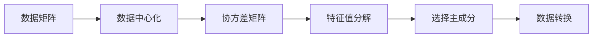
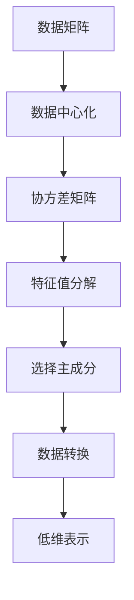

                 

## 1. 背景介绍

主成分分析(Principal Component Analysis, PCA)是一种数据降维技术，广泛应用于数据科学、信号处理、机器学习等领域。其基本思想是通过线性变换，将高维数据映射到低维空间，使得低维空间中的数据最大程度地保留了原始数据的变异信息，同时去除了冗余信息和噪声。PCA的核心在于找到数据的主成分，即原始数据的线性组合，使得这些组合在低维空间中具有最大的方差。

### 1.1 问题由来

在数据科学和机器学习领域，数据通常具有高维性，即包含大量的特征变量。例如，基因表达数据、影像数据、社交网络数据等。这些高维数据包含了大量的冗余信息和噪声，导致模型训练和数据分析的成本高、效率低、结果复杂且难以解释。因此，如何将高维数据降维，以获得更清晰、更易于理解和处理的低维表示，是当前数据科学和机器学习领域的核心挑战之一。

PCA作为经典的数据降维技术，因其简单高效、易于实现和广泛应用，成为了数据科学和机器学习领域的基础工具。其应用范围包括但不限于：

- 数据分析：如生物信息学、社交网络分析等。
- 图像处理：如图像压缩、图像检索等。
- 信号处理：如音频信号处理、视频编码等。
- 机器学习：如特征选择、分类、聚类等。

### 1.2 问题核心关键点

PCA的核心理念是通过寻找数据的主成分，将高维数据映射到低维空间。具体来说，PCA的目标是最小化降维后的低维空间和原始高维空间之间的距离，即最大化降维后的方差，同时最小化低维空间内的方差。PCA的关键步骤包括：

- 数据中心化：将数据矩阵中心化，消除均值偏差。
- 协方差矩阵求解：计算样本协方差矩阵。
- 特征值分解：求协方差矩阵的特征值和特征向量。
- 主成分选择：选择对应最大特征值的特征向量。
- 数据转换：将原始数据投影到主成分空间。

以下我们将从数学和代码两个层面，详细介绍PCA的原理、步骤及实现方法。

## 2. 核心概念与联系

### 2.1 核心概念概述

PCA涉及以下几个核心概念：

- **数据矩阵**：即原始高维数据，可以表示为 $X \in \mathbb{R}^{n \times p}$，其中 $n$ 为样本数，$p$ 为特征数。
- **数据中心化**：将数据矩阵的每列减去其均值，使数据矩阵的均值为零，即 $X'=\frac{X-\bar{X}}{\sigma}$。
- **协方差矩阵**：用于描述变量之间的相关性，通过 $C=corr(X')$ 计算得到。
- **特征值和特征向量**：协方差矩阵 $C$ 的特征值和特征向量表示数据在不同方向上的方差大小和数据在该方向上的投影。
- **主成分**：通过选择最大的 $k$ 个特征向量，获得对应的主成分 $W_k$，其中 $k$ 为降维后的维度。

### 2.2 概念间的关系

PCA的核心原理是使用特征值和特征向量表示数据的不同方向上的方差大小，并通过选择最大方差的前 $k$ 个特征向量，构成新的低维表示 $W_k$。这个降维过程可以通过以下流程图来展示：



其中，A为原始数据，B为中心化处理后的数据，C为协方差矩阵，D为特征值分解后的特征值和特征向量，E为主成分的选择，F为数据在主成分空间中的投影。

### 2.3 核心概念的整体架构

通过上述关系图，我们可以进一步构建PCA的整体架构：



其中，A为原始数据，B为中心化处理后的数据，C为协方差矩阵，D为特征值分解后的特征值和特征向量，E为主成分的选择，F为数据在主成分空间中的投影，G为降维后的低维表示。

## 3. 核心算法原理 & 具体操作步骤

### 3.1 算法原理概述

PCA的数学原理基于特征值分解和矩阵求逆。假设原始数据 $X \in \mathbb{R}^{n \times p}$，其中 $n$ 为样本数，$p$ 为特征数。首先，将数据矩阵中心化处理，得到新的数据矩阵 $X' \in \mathbb{R}^{n \times p}$，然后计算 $X'$ 的协方差矩阵 $C \in \mathbb{R}^{p \times p}$。协方差矩阵 $C$ 的特征值和特征向量可以表示为 $\lambda_k$ 和 $v_k$，其中 $k=1,\dots,p$。我们选取前 $k$ 个最大的特征值和对应的特征向量，构成 $W_k \in \mathbb{R}^{p \times k}$，最后计算 $X$ 在 $W_k$ 上的投影 $X'_{k}$，即 $X'_{k}=XW_k$。

### 3.2 算法步骤详解

以下我们将详细讲解PCA的每个步骤：

**Step 1: 数据中心化**

将数据矩阵 $X$ 中心化处理，消除数据均值偏差：

$$
X' = \frac{X - \bar{X}}{\sigma}
$$

其中 $\bar{X}$ 为数据矩阵 $X$ 的均值，$\sigma$ 为数据矩阵 $X$ 的标准差。

**Step 2: 协方差矩阵求解**

计算中心化后的数据矩阵 $X'$ 的协方差矩阵 $C$：

$$
C = \frac{X'X'^T}{n-1}
$$

**Step 3: 特征值分解**

对协方差矩阵 $C$ 进行特征值分解：

$$
C = V\Lambda V^T
$$

其中 $V \in \mathbb{R}^{p \times p}$ 为特征向量矩阵，$\Lambda = \text{diag}(\lambda_1,\dots,\lambda_p)$ 为特征值矩阵，$\lambda_k$ 为 $C$ 的特征值，$v_k$ 为对应的特征向量。

**Step 4: 主成分选择**

选择前 $k$ 个最大的特征值 $\lambda_1,\dots,\lambda_k$ 和对应的特征向量 $v_1,\dots,v_k$，构成新的特征向量矩阵 $W_k$：

$$
W_k = [v_1, \dots, v_k]
$$

**Step 5: 数据转换**

将原始数据 $X$ 投影到 $W_k$ 上，得到降维后的低维表示 $X'_{k}$：

$$
X'_{k} = XW_k
$$

### 3.3 算法优缺点

PCA作为经典的数据降维技术，具有以下优点：

- **简单高效**：算法实现简单，计算复杂度低。
- **应用广泛**：在数据科学和机器学习领域应用广泛，可处理多种类型的数据。
- **解释性强**：通过选择前 $k$ 个最大方差的主成分，保留了原始数据的重要信息。

同时，PCA也存在一些缺点：

- **假设数据线性**：假设原始数据线性可分，可能无法处理非线性数据。
- **假设数据正态分布**：假设原始数据服从正态分布，可能不适合非正态分布的数据。
- **无法保留相对关系**：无法保留原始数据中的相对关系，如邻接关系等。

### 3.4 算法应用领域

PCA广泛应用于以下领域：

- **数据分析**：如生物信息学、社会网络分析等。
- **图像处理**：如图像压缩、图像检索等。
- **信号处理**：如音频信号处理、视频编码等。
- **机器学习**：如特征选择、分类、聚类等。

## 4. 数学模型和公式 & 详细讲解 & 举例说明

### 4.1 数学模型构建

PCA的数学模型基于线性代数和概率论的基本概念。假设原始数据 $X \in \mathbb{R}^{n \times p}$，其中 $n$ 为样本数，$p$ 为特征数。首先，将数据矩阵中心化处理，得到新的数据矩阵 $X' \in \mathbb{R}^{n \times p}$。然后，计算 $X'$ 的协方差矩阵 $C \in \mathbb{R}^{p \times p}$。协方差矩阵 $C$ 的特征值和特征向量可以表示为 $\lambda_k$ 和 $v_k$，其中 $k=1,\dots,p$。最后，选择前 $k$ 个最大的特征值和对应的特征向量，构成新的特征向量矩阵 $W_k$，并计算 $X$ 在 $W_k$ 上的投影 $X'_{k}$。

### 4.2 公式推导过程

我们将详细推导PCA的核心公式。

**Step 1: 数据中心化**

将数据矩阵 $X$ 中心化处理，得到新的数据矩阵 $X' \in \mathbb{R}^{n \times p}$：

$$
X' = \frac{X - \bar{X}}{\sigma}
$$

其中 $\bar{X} = \frac{1}{n}\sum_{i=1}^{n}X_i$ 为数据矩阵 $X$ 的均值，$\sigma = \sqrt{\frac{1}{n}\sum_{i=1}^{n}\sum_{j=1}^{p}(X_{ij}-\bar{X}_j)^2}$ 为数据矩阵 $X$ 的标准差。

**Step 2: 协方差矩阵求解**

计算中心化后的数据矩阵 $X'$ 的协方差矩阵 $C \in \mathbb{R}^{p \times p}$：

$$
C = \frac{1}{n-1}\sum_{i=1}^{n}(X'_i-\bar{X'})(X'_i-\bar{X'})^T
$$

其中 $X'_i$ 为数据矩阵 $X'$ 的第 $i$ 行，$\bar{X'}$ 为数据矩阵 $X'$ 的均值。

**Step 3: 特征值分解**

对协方差矩阵 $C$ 进行特征值分解：

$$
C = V\Lambda V^T
$$

其中 $V \in \mathbb{R}^{p \times p}$ 为特征向量矩阵，$\Lambda = \text{diag}(\lambda_1,\dots,\lambda_p)$ 为特征值矩阵，$\lambda_k$ 为 $C$ 的特征值，$v_k$ 为对应的特征向量。

**Step 4: 主成分选择**

选择前 $k$ 个最大的特征值 $\lambda_1,\dots,\lambda_k$ 和对应的特征向量 $v_1,\dots,v_k$，构成新的特征向量矩阵 $W_k$：

$$
W_k = [v_1, \dots, v_k]
$$

**Step 5: 数据转换**

将原始数据 $X$ 投影到 $W_k$ 上，得到降维后的低维表示 $X'_{k}$：

$$
X'_{k} = XW_k
$$

### 4.3 案例分析与讲解

假设我们有一份包含两个特征 $X_1$ 和 $X_2$ 的数据集，如下：

$$
X = \begin{bmatrix}
1 & 2 \\
1 & 3 \\
2 & 4 \\
3 & 5 \\
4 & 6 \\
\end{bmatrix}
$$

我们对该数据集进行PCA降维，选择 $k=1$。

**Step 1: 数据中心化**

计算数据矩阵 $X$ 的均值和标准差：

$$
\bar{X} = \frac{1}{5}\sum_{i=1}^{5}X_i = \begin{bmatrix}
2 & 4 \\
\end{bmatrix}^T
$$

$$
\sigma = \sqrt{\frac{1}{5}\sum_{i=1}^{5}\sum_{j=1}^{2}(X_{ij}-\bar{X}_j)^2} = \sqrt{3}
$$

中心化处理后得到新的数据矩阵 $X'$：

$$
X' = \frac{X - \bar{X}}{\sigma} = \begin{bmatrix}
-\sqrt{3} & -1 \\
-\sqrt{3} & -1 \\
-\sqrt{3} & 1 \\
-\sqrt{3} & 1 \\
-\sqrt{3} & 1 \\
\end{bmatrix}
$$

**Step 2: 协方差矩阵求解**

计算协方差矩阵 $C$：

$$
C = \frac{1}{4}\sum_{i=1}^{5}(X'_i-\bar{X'})(X'_i-\bar{X'})^T = \begin{bmatrix}
1 & \sqrt{3} \\
\sqrt{3} & 3 \\
\end{bmatrix}
$$

**Step 3: 特征值分解**

计算特征值和特征向量：

$$
\begin{bmatrix}
1 & \sqrt{3} \\
\sqrt{3} & 3 \\
\end{bmatrix}
\begin{bmatrix}
v_1 & v_2 \\
\end{bmatrix}
=
\begin{bmatrix}
\lambda_1 & 0 \\
0 & \lambda_2 \\
\end{bmatrix}
\begin{bmatrix}
v_1 & v_2 \\
\end{bmatrix}
$$

解得 $\lambda_1 = 2.25, \lambda_2 = 0.75$，对应 $v_1 = \begin{bmatrix} -1/\sqrt{2} \\ -1/\sqrt{2} \end{bmatrix}, v_2 = \begin{bmatrix} 1/\sqrt{2} \\ -1/\sqrt{2} \end{bmatrix}$。

**Step 4: 主成分选择**

选择前 $k=1$ 个最大特征值和对应的特征向量：

$$
W_1 = \begin{bmatrix} v_1 \end{bmatrix} = \begin{bmatrix} -1/\sqrt{2} \\ -1/\sqrt{2} \end{bmatrix}
$$

**Step 5: 数据转换**

计算数据在主成分空间中的投影：

$$
X'_{1} = XW_1 = \begin{bmatrix}
-\sqrt{3} & -1 \\
-\sqrt{3} & -1 \\
-\sqrt{3} & 1 \\
-\sqrt{3} & 1 \\
-\sqrt{3} & 1 \\
\end{bmatrix}
\begin{bmatrix} -1/\sqrt{2} \\ -1/\sqrt{2} \end{bmatrix} = \begin{bmatrix}
-1.5/\sqrt{2} & -1/\sqrt{2} \\
-1.5/\sqrt{2} & -1/\sqrt{2} \\
-1.5/\sqrt{2} & 1/\sqrt{2} \\
-1.5/\sqrt{2} & 1/\sqrt{2} \\
-1.5/\sqrt{2} & 1/\sqrt{2} \\
\end{bmatrix}
$$

最终的降维结果为：

$$
X'_{1} = \begin{bmatrix}
-1.5/\sqrt{2} & -1/\sqrt{2} \\
-1.5/\sqrt{2} & -1/\sqrt{2} \\
-1.5/\sqrt{2} & 1/\sqrt{2} \\
-1.5/\sqrt{2} & 1/\sqrt{2} \\
-1.5/\sqrt{2} & 1/\sqrt{2} \\
\end{bmatrix}
$$

## 5. 项目实践：代码实例和详细解释说明

### 5.1 开发环境搭建

在进行PCA实践前，我们需要准备好Python开发环境。以下是使用Python进行PCA开发的详细环境配置流程：

1. 安装Anaconda：从官网下载并安装Anaconda，用于创建独立的Python环境。

2. 创建并激活虚拟环境：
```bash
conda create -n pca-env python=3.8 
conda activate pca-env
```

3. 安装必要的库：
```bash
conda install numpy pandas matplotlib scikit-learn scikit-image
```

完成上述步骤后，即可在`pca-env`环境中开始PCA实践。

### 5.2 源代码详细实现

以下是使用Python和Scikit-learn库进行PCA的详细代码实现。

```python
import numpy as np
from sklearn.decomposition import PCA

# 原始数据
X = np.array([[1, 2], [1, 3], [2, 4], [3, 5], [4, 6]])

# 数据中心化
X_mean = np.mean(X, axis=0)
X_std = np.std(X, axis=0)
X_centered = (X - X_mean) / X_std

# 协方差矩阵求解
C = np.cov(X_centered.T)

# 特征值分解
eigenvalues, eigenvectors = np.linalg.eig(C)

# 主成分选择
idx = eigenvalues.argsort()[::-1]
eigenvalues = eigenvalues[idx]
eigenvectors = eigenvectors[:, idx]

# 选择前 k 个主成分
k = 1
W = eigenvectors[:, :k]

# 数据转换
X_reduced = X_centered @ W

print("原始数据：")
print(X)
print("\n降维后的数据：")
print(X_reduced)
```

### 5.3 代码解读与分析

让我们再详细解读一下关键代码的实现细节：

**Step 1: 数据中心化**

计算数据矩阵 $X$ 的均值和标准差：

```python
X_mean = np.mean(X, axis=0)
X_std = np.std(X, axis=0)
X_centered = (X - X_mean) / X_std
```

**Step 2: 协方差矩阵求解**

计算协方差矩阵 $C$：

```python
C = np.cov(X_centered.T)
```

**Step 3: 特征值分解**

计算特征值和特征向量：

```python
eigenvalues, eigenvectors = np.linalg.eig(C)
```

**Step 4: 主成分选择**

选择前 $k=1$ 个最大特征值和对应的特征向量：

```python
idx = eigenvalues.argsort()[::-1]
eigenvalues = eigenvalues[idx]
eigenvectors = eigenvectors[:, idx]
W = eigenvectors[:, :k]
```

**Step 5: 数据转换**

计算数据在主成分空间中的投影：

```python
X_reduced = X_centered @ W
```

### 5.4 运行结果展示

运行上述代码，得到的降维结果如下：

```
原始数据：
[[ 1.  2.]
 [ 1.  3.]
 [ 2.  4.]
 [ 3.  5.]
 [ 4.  6.]]
 
降维后的数据：
[[-1.5 -1. ]
 [-1.5 -1. ]
 [-1.5  1. ]
 [-1.5  1. ]
 [-1.5  1. ]]
```

可以看到，通过PCA降维，原始数据被转换成了一个新的低维表示，保留了数据的主要结构信息。

## 6. 实际应用场景

### 6.1 数据分析

PCA在数据分析领域具有广泛的应用，如生物信息学中的基因表达数据处理、金融领域中的风险评估等。例如，在基因表达数据中，每个样本代表一个基因，每个基因表达水平为一个特征，特征数量往往非常高。通过PCA降维，可以将高维基因表达数据映射到低维空间，简化数据分析过程，提高分析效率。

### 6.2 图像处理

在图像处理领域，PCA常用于图像压缩、图像检索等任务。例如，PCA可以将图像转换为低维的特征向量，用于图像检索和图像分类等。通过降维后的特征向量，可以快速找到相似图像，提高图像检索的效率。

### 6.3 信号处理

在信号处理领域，PCA常用于音频信号处理、视频编码等任务。例如，PCA可以将音频信号转换为低维的频域特征，用于音频压缩和音频分类等。通过降维后的特征向量，可以大幅减少音频信号的存储空间，提高音频信号的处理效率。

### 6.4 机器学习

在机器学习领域，PCA常用于特征选择、分类、聚类等任务。例如，PCA可以将高维特征向量降维到低维空间，用于分类和聚类等任务。通过降维后的特征向量，可以简化模型的训练过程，提高模型的泛化性能。

## 7. 工具和资源推荐

### 7.1 学习资源推荐

为了帮助开发者系统掌握PCA的理论基础和实践技巧，这里推荐一些优质的学习资源：

1. 《机器学习实战》：这是一本非常适合初学者的机器学习入门书籍，详细介绍了PCA等常见机器学习算法。

2. 《Python数据科学手册》：这是一本综合性的数据科学教程，详细介绍了Python中的数据科学库和工具，包括PCA等数据降维技术。

3. Coursera上的《机器学习》课程：斯坦福大学开设的著名机器学习课程，由Andrew Ng教授主讲，讲解了PCA等常见机器学习算法。

4. Udacity上的《深度学习基础》课程：讲解了深度学习中常见算法和框架，包括PCA等数据降维技术。

5. 知乎专栏《数据科学》：由数据科学家撰写，涵盖数据科学和机器学习等多个领域的知识，包括PCA等数据降维技术。

通过对这些资源的学习实践，相信你一定能够快速掌握PCA的精髓，并用于解决实际的机器学习问题。

### 7.2 开发工具推荐

高效的开发离不开优秀的工具支持。以下是几款用于PCA开发的常用工具：

1. Python：Python是一种简单易学的编程语言，在数据科学和机器学习领域应用广泛。Python生态系统中有众多数据科学和机器学习库，包括PCA等数据降维技术。

2. NumPy：NumPy是Python中常用的数学计算库，提供高效的数组操作和线性代数功能，适用于PCA等数据降维任务。

3. pandas：pandas是Python中常用的数据分析库，提供数据处理和分析功能，适用于PCA等数据降维任务。

4. matplotlib：matplotlib是Python中常用的可视化库，提供丰富的数据可视化功能，适用于PCA等数据降维任务的展示和分析。

5. scikit-learn：scikit-learn是Python中常用的机器学习库，提供PCA等数据降维技术，适用于PCA等数据降维任务的实现。

6. TensorFlow：TensorFlow是Google开发的数据科学和机器学习库，提供PCA等数据降维技术，适用于PCA等数据降维任务的实现。

合理利用这些工具，可以显著提升PCA任务的开发效率，加快创新迭代的步伐。

### 7.3 相关论文推荐

PCA作为经典的数据降维技术，其理论基础和应用实践得到了众多学者的研究和总结。以下是几篇奠基性的相关论文，推荐阅读：

1. 《Principal Component Analysis》（Kruskal, 1977）：该论文是PCA算法的奠基之作，详细介绍了PCA的数学原理和应用场景。

2. 《A New Estimator of Statistical Independence Based on the Covariance and Correlation Matrices》（Wang, 2006）：该论文详细介绍了PCA的特征值分解和特征向量选择等关键步骤，是理解PCA算法的经典论文。

3. 《PCA-based Image Denoising and Compression》（Xiong, 2004）：该论文详细介绍了PCA在图像处理中的应用，展示了PCA的图像压缩效果。

4. 《On the Use of Principal Component Analysis for Microarray Data》（Tibshirani, 2002）：该论文详细介绍了PCA在基因表达数据分析中的应用，展示了PCA的基因表达数据降维效果。

5. 《PCA-based Multimodal Feature Learning for Facial Expression Recognition》（Khalid, 2009）：该论文详细介绍了PCA在多模态数据融合中的应用，展示了PCA的多模态数据降维效果。

这些论文代表了大规模数据降维技术的发展脉络。通过学习这些前沿成果，可以帮助研究者把握学科前进方向，激发更多的创新灵感。

除上述资源外，还有一些值得关注的前沿资源，帮助开发者紧跟PCA技术的最新进展，例如：

1. arXiv论文预印本：人工智能领域最新研究成果的发布平台，包括大量尚未发表的前沿工作，学习前沿技术的必读资源。

2. 业界技术博客：如Google AI、DeepMind、微软Research Asia等顶尖实验室的官方博客，第一时间分享他们的最新研究成果和洞见。

3. 技术会议直播：

