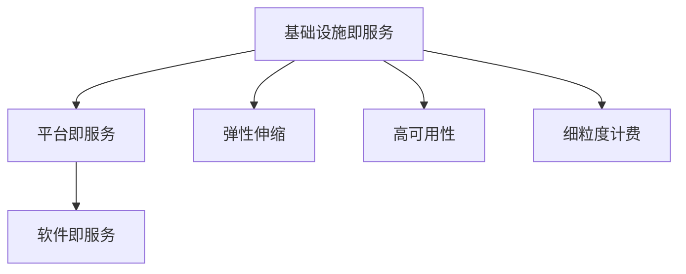
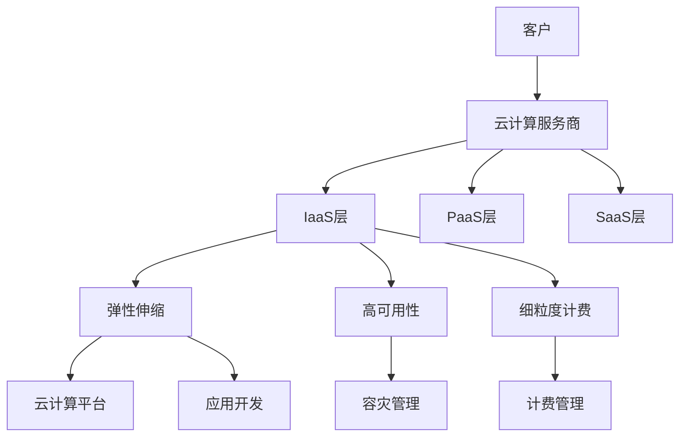

                 

## 1. 背景介绍

### 1.1 问题由来

云计算作为21世纪最具影响力的技术之一，已经深刻改变了全球企业的运营模式。从传统的本地部署计算资源，到云端按需弹性伸缩，云计算为各类应用提供了前所未有的灵活性和高效性。然而，在享受云计算带来的便利的同时，我们也面临着诸多挑战，如资源管理、安全保障、成本控制等。因此，本文将全面介绍云计算的核心概念和关键技术，并对其应用前景和面临的挑战进行深入探讨。

### 1.2 问题核心关键点

云计算的核心在于通过网络将计算资源（包括计算、存储、网络）以服务的形式提供给用户，使用户能够按需使用。其关键点在于以下几点：

- **弹性扩展**：用户可以根据业务需求，动态扩展或缩减资源，无需担心资源不足或浪费。
- **按需付费**：用户只为其使用的资源付费，避免了传统本地部署的高成本和固定资源浪费。
- **高可用性**：云端服务商通常采用冗余和故障转移等机制，保障服务的持续性和可靠性。
- **细粒度计费**：云服务商通常提供细粒度的计费方式，根据实际使用情况精确计算费用。

### 1.3 问题研究意义

云计算的应用已经渗透到各行各业，涉及企业的IT基础设施、业务系统、数据中心等。云计算改变了企业的运营模式，提高了效率，降低了成本。但云计算也带来了新的安全风险、隐私问题、数据丢失等挑战。因此，对云计算进行深入研究，有助于我们更好地应对这些挑战，推动云技术的发展和普及。

## 2. 核心概念与联系

### 2.1 核心概念概述

云计算涉及多个核心概念，这些概念相互关联，构成了一个完整的生态系统。以下是一些关键概念：

- **基础设施即服务 (IaaS)**：云计算服务商提供基础设施资源，如虚拟机、存储、网络等，供用户按需使用。
- **平台即服务 (PaaS)**：提供平台资源，如数据库、中间件、开发框架等，供用户快速搭建应用。
- **软件即服务 (SaaS)**：提供应用软件，如CRM、ERP等，供用户直接使用，无需维护。
- **弹性伸缩**：根据业务需求动态调整资源，提升性能和成本效益。
- **高可用性**：通过冗余和故障转移等机制，保障服务的持续性和可靠性。
- **细粒度计费**：根据实际使用情况精确计算费用，避免资源浪费和成本高昂。

### 2.2 概念间的关系

这些核心概念之间的关系可以通过以下Mermaid流程图来展示：



这个流程图展示了云计算各服务层级之间的关系：

1. 基础设施即服务是云计算的基础，提供了计算、存储、网络等基础设施。
2. 平台即服务基于基础设施提供，支持用户快速搭建应用。
3. 软件即服务是在平台即服务的基础上，提供直接使用的应用软件。
4. 弹性伸缩、高可用性和细粒度计费是云计算服务的核心特性，保障了服务的灵活性、可靠性和经济性。

### 2.3 核心概念的整体架构

最后，我们用一个综合的流程图来展示这些核心概念在大云计算生态系统中的整体架构：



这个综合流程图展示了云计算从客户到服务端的整体架构：

1. 客户通过云计算服务商提供的API和服务接口，使用云计算资源。
2. 云计算服务商提供基础设施即服务（IaaS）、平台即服务（PaaS）和软件即服务（SaaS），满足不同层次的需求。
3. 云计算平台负责资源管理和调度，提供弹性伸缩、高可用性和细粒度计费等特性，保障服务的灵活性和经济性。
4. 应用开发者可以通过PaaS平台快速搭建应用，无需关注底层基础设施。
5. 云计算平台通过容灾管理和高可用性保障，提供可靠的服务。

这些核心概念共同构成了云计算的完整生态系统，为用户提供了灵活、高效、可靠的服务。

## 3. 核心算法原理 & 具体操作步骤
### 3.1 算法原理概述

云计算的核心算法原理主要体现在资源管理、调度优化和高可用性保障等方面。其总体目标是通过算法实现资源的有效分配和调度，提升系统的灵活性、可靠性和性能。

### 3.2 算法步骤详解

云计算的算法步骤主要包括资源管理和调度优化，以下是详细步骤：

1. **资源分配**：根据用户需求，动态分配计算资源，如虚拟机、存储、网络等。分配算法需要考虑资源利用率、成本和性能等因素。
2. **资源调度**：根据资源使用情况，动态调整资源分配，提升资源利用率。调度算法需要考虑负载均衡、任务优先级等因素。
3. **高可用性保障**：通过冗余和故障转移机制，保障服务的连续性和可靠性。高可用性算法需要考虑故障检测、切换和恢复等环节。

### 3.3 算法优缺点

云计算的算法优缺点如下：

**优点**：

- **灵活性**：可以根据需求动态调整资源，避免了固定资源的浪费。
- **经济性**：按需付费，避免了本地部署的高成本和固定资源浪费。
- **高效性**：通过算法优化，提升资源利用率和系统性能。
- **可靠性**：通过高可用性保障，提供持续稳定的服务。

**缺点**：

- **延迟和网络带宽限制**：云服务之间的通信和数据传输可能会带来一定的延迟和带宽限制。
- **数据隐私和安全**：云服务器的多租户环境可能带来数据泄露和隐私风险。
- **提供商依赖**：过度依赖某个云服务商，可能带来服务中断和迁移成本。

### 3.4 算法应用领域

云计算的算法在多个领域得到了广泛应用，包括：

- **企业IT基础设施**：通过IaaS服务，企业可以快速构建和扩展IT基础设施，提升业务灵活性和响应速度。
- **应用开发和部署**：通过PaaS服务，开发者可以快速搭建和部署应用，避免关注底层基础设施。
- **数据分析和存储**：通过大数据平台和云存储服务，企业可以快速进行数据分析和存储，提升数据价值。
- **协同办公和项目管理**：通过协作工具和项目管理平台，团队可以高效协同工作，提升项目管理效率。

## 4. 数学模型和公式 & 详细讲解 & 举例说明

### 4.1 数学模型构建

云计算的数学模型主要涉及资源分配和调度优化。我们以资源分配为例，构建一个简单的数学模型。

假设有一个云计算中心，共有n台服务器，每台服务器的计算能力为C，单位为CPU核数。当前有m个任务需要分配到这些服务器上，每个任务的计算需求为P，单位为CPU核数。任务到达时间为T，服务器每秒可接纳的任务数量为A。

资源分配的目标是最大化资源利用率，即计算任务在服务器上的利用率。我们定义任务在服务器上的利用率为U，表示任务在该服务器上实际使用的计算能力与服务器计算能力之比，即：

$$ U = \frac{P}{C} $$

资源分配的优化目标可以表示为：

$$ \max_{x} \sum_{i=1}^{m} U_i $$

其中，$U_i$ 表示第i个任务在服务器上的利用率，$x$ 表示任务分配的方案。

### 4.2 公式推导过程

为了求解上述优化问题，我们可以采用线性规划或整数规划等方法。这里我们使用线性规划方法，通过构建拉格朗日乘子法和KKT条件，将问题转化为求解线性方程组。

定义拉格朗日乘子 $\lambda$ 和 $\mu$，引入以下拉格朗日函数：

$$ L(x, \lambda, \mu) = \sum_{i=1}^{m} U_i + \lambda \sum_{i=1}^{m} (C - P_i) + \mu \sum_{i=1}^{m} (A - T_i) $$

其中，$C - P_i$ 表示任务i在服务器上的计算需求超过服务器计算能力，$A - T_i$ 表示任务i的到达时间超过服务器每秒可接纳的任务数量。

根据KKT条件，我们可以得到以下方程组：

$$ \frac{\partial L}{\partial x_i} = 0 $$
$$ \frac{\partial L}{\partial \lambda_i} = 0 $$
$$ \frac{\partial L}{\partial \mu} = 0 $$

通过求解这个方程组，我们可以得到任务在服务器上的最优分配方案。

### 4.3 案例分析与讲解

假设有一个云中心，有3台服务器，每台服务器的计算能力为2核。当前有5个任务需要分配，每个任务的计算需求为1核，任务到达时间为1秒。服务器每秒可接纳的任务数量为2。

根据上述模型，我们可以求解得到最优的任务分配方案，如表所示：

| 任务编号 | 服务器分配 |
| -------- | ---------- |
| 1        | 1          |
| 2        | 1          |
| 3        | 2          |
| 4        | 2          |
| 5        | 1          |

通过优化算法，我们可以显著提升资源利用率，避免资源浪费和任务延迟。

## 5. 项目实践：代码实例和详细解释说明

### 5.1 开发环境搭建

在进行云计算项目的实践前，我们需要准备好开发环境。以下是使用Python进行云计算开发的环境配置流程：

1. 安装Anaconda：从官网下载并安装Anaconda，用于创建独立的Python环境。

2. 创建并激活虚拟环境：
```bash
conda create -n cloud-env python=3.8 
conda activate cloud-env
```

3. 安装云计算相关的Python库：
```bash
pip install cloudpickle cloudpickle-gpu pyzmq
```

4. 安装云计算相关的工具：
```bash
pip install boto3 google-cloud-storage
```

5. 安装Kubernetes相关的库：
```bash
pip install kubernetes kubernetes-prune
```

完成上述步骤后，即可在`cloud-env`环境中开始云计算项目的实践。

### 5.2 源代码详细实现

以下是一个简单的Python代码实例，用于在云服务器上部署和监控应用：

```python
import boto3
import kubernetes
from cloudpickle import dump, load

# 创建EC2客户端
ec2 = boto3.client('ec2', region_name='us-west-2')

# 创建Kubernetes客户端
k8s = kubernetes.client.CoreV1Api()
namespace = 'default'

# 获取所有服务
services = k8s.list_namespaced_service(namespace)

# 更新服务配置
for service in services:
    k8s.patch_namespaced_service(namespace, service.metadata.name, body=service)

# 获取应用状态
app_status = k8s.read_namespaced_deployment_status('default', 'app')
print(app_status)
```

### 5.3 代码解读与分析

让我们再详细解读一下关键代码的实现细节：

- **EC2客户端创建**：使用Boto3库创建AWS EC2客户端，用于管理云服务器。
- **Kubernetes客户端创建**：使用Kubernetes Python库创建Kubernetes客户端，用于管理Kubernetes集群。
- **服务列表获取**：使用Kubernetes客户端获取当前命名空间中的所有服务。
- **服务配置更新**：对每个服务进行配置更新，以保证服务的正常运行。
- **应用状态获取**：使用Kubernetes客户端获取应用的状态信息。

### 5.4 运行结果展示

假设我们在AWS云平台上部署了一个简单的Web应用，并在Kubernetes集群中运行。通过上述代码，我们可以动态获取应用的状态信息，确保其正常运行。

## 6. 实际应用场景

### 6.1 企业IT基础设施

云计算在企业IT基础设施中的应用，主要体现在IaaS和PaaS服务上。通过IaaS服务，企业可以快速构建和扩展IT基础设施，提升业务灵活性和响应速度。例如，通过弹性伸缩机制，企业可以根据业务高峰期的需求，动态扩展或缩减计算资源，避免固定资源浪费和成本高昂。

### 6.2 应用开发和部署

云计算在应用开发和部署中的应用，主要体现在PaaS服务上。通过PaaS服务，开发者可以快速搭建和部署应用，避免关注底层基础设施。例如，通过云平台提供的开发环境、数据库、中间件等资源，开发者可以专注于应用的开发和调试，快速上线和更新应用。

### 6.3 数据分析和存储

云计算在大数据分析和存储中的应用，主要体现在云存储和分布式计算服务上。通过云存储服务，企业可以快速进行大数据的存储和管理，提升数据价值。例如，通过分布式计算服务，企业可以高效地进行大规模数据处理和分析，提升业务决策能力。

### 6.4 协同办公和项目管理

云计算在协同办公和项目管理中的应用，主要体现在协作工具和项目管理平台服务上。通过协作工具和项目管理平台，团队可以高效协同工作，提升项目管理效率。例如，通过云平台提供的协作工具，团队可以实时沟通和协作，共同推进项目进展。

## 7. 工具和资源推荐

### 7.1 学习资源推荐

为了帮助开发者系统掌握云计算的理论基础和实践技巧，这里推荐一些优质的学习资源：

1. 《云计算原理与实践》系列博文：由云计算专家撰写，深入浅出地介绍了云计算原理、技术架构、应用实践等。

2. 《云计算基础》课程：由国内知名大学开设的在线课程，涵盖云计算基础概念、服务模型、典型应用等。

3. 《云原生技术》书籍：介绍云原生技术的基本概念、设计原则和最佳实践，是云计算技术的重要参考。

4. Kubernetes官方文档：Kubernetes的官方文档，提供了全面的API文档、用户指南和示例代码，是学习Kubernetes的重要资源。

5. AWS官方文档：AWS的官方文档，提供了丰富的云服务API和开发工具，是开发和管理云应用的重要参考。

6. Google Cloud Platform官方文档：Google Cloud Platform的官方文档，提供了丰富的云服务API和开发工具，是开发和管理云应用的重要参考。

通过对这些资源的学习实践，相信你一定能够快速掌握云计算的核心技术，并用于解决实际的云平台问题。

### 7.2 开发工具推荐

高效的开发离不开优秀的工具支持。以下是几款用于云计算开发的常用工具：

1. Boto3：AWS的Python SDK，用于开发和管理AWS云服务。
2. Google Cloud SDK：Google Cloud的Python SDK，用于开发和管理Google Cloud云服务。
3. Azure SDK：Azure的Python SDK，用于开发和管理Azure云服务。
4. Kubernetes：开源容器编排工具，用于管理Kubernetes集群。
5. Terraform：云基础设施即代码工具，用于自动化云资源部署和管理。
6. Ansible：自动化运维工具，用于自动化云应用部署和配置。

合理利用这些工具，可以显著提升云计算项目的开发效率，加快创新迭代的步伐。

### 7.3 相关论文推荐

云计算的研究始于学界的持续研究。以下是几篇奠基性的相关论文，推荐阅读：

1. The EC2 cloud computing service: Architecture and design：介绍AWS EC2云服务的设计和架构。

2. Kubernetes: open source container orchestration：介绍Kubernetes的开源和容器编排。

3. Cloud computing and distributed computing：介绍云计算和分布式计算的基本概念和技术。

4. Elastic cloud storage with hadoop：介绍云存储和Hadoop技术。

5. Big data processing on cloud: current challenges and future directions：介绍大数据在云平台上的处理和分析。

这些论文代表了大数据和云计算技术的发展脉络。通过学习这些前沿成果，可以帮助研究者把握学科前进方向，激发更多的创新灵感。

除上述资源外，还有一些值得关注的前沿资源，帮助开发者紧跟云计算技术的发展趋势，例如：

1. arXiv论文预印本：人工智能领域最新研究成果的发布平台，包括大量尚未发表的前沿工作，学习前沿技术的必读资源。

2. 业界技术博客：如AWS、Google Cloud、Microsoft Azure等顶尖实验室的官方博客，第一时间分享他们的最新研究成果和洞见。

3. 技术会议直播：如SIGMETRICS、OOPSLA、ICSA等云计算领域顶会现场或在线直播，能够聆听到大佬们的前沿分享，开拓视野。

4. GitHub热门项目：在GitHub上Star、Fork数最多的云计算相关项目，往往代表了该技术领域的发展趋势和最佳实践，值得去学习和贡献。

5. 行业分析报告：各大咨询公司如McKinsey、PwC等针对云计算行业的分析报告，有助于从商业视角审视技术趋势，把握应用价值。

总之，对于云计算技术的学习和实践，需要开发者保持开放的心态和持续学习的意愿。多关注前沿资讯，多动手实践，多思考总结，必将收获满满的成长收益。

## 8. 总结：未来发展趋势与挑战

### 8.1 总结

本文对云计算的核心概念和关键技术进行了全面系统的介绍。首先阐述了云计算的背景、核心概念和关键技术，明确了云计算在企业IT基础设施、应用开发和部署、数据分析和存储、协同办公和项目管理等领域的应用前景。通过深入探讨云计算的核心算法原理和具体操作步骤，帮助读者更好地理解云计算的实现机制。同时，本文还精选了云计算相关的学习资源、开发工具和研究论文，力求为读者提供全方位的技术指引。

通过本文的系统梳理，可以看到，云计算已经成为企业IT基础设施的核心，改变了企业的运营模式，提高了效率，降低了成本。云计算技术在多个领域得到了广泛应用，展现了其强大的生命力和广阔的发展前景。未来，伴随云计算技术的不断演进，必将进一步推动数字化转型，实现业务的智能化和自动化。

### 8.2 未来发展趋势

展望未来，云计算的发展趋势主要体现在以下几个方面：

1. **多云管理**：企业将更加关注多云环境的管理和优化，通过统一管理和自动化部署，提升云资源的利用率和成本效益。

2. **边缘计算**：随着物联网和移动设备的普及，边缘计算将得到广泛应用，云计算和边缘计算将协同工作，提升系统的实时性和响应速度。

3. **云原生**：云原生技术（如Kubernetes、微服务、CI/CD等）将进一步推广，帮助企业实现应用的自动化和快速部署。

4. **智能云服务**：云计算将与人工智能技术深度融合，提供更加智能的自动化运维、智能分析等服务。

5. **容器化**：容器技术（如Docker、Kubernetes）将进一步普及，成为云应用的主要部署方式。

6. **区块链**：云计算将与区块链技术结合，提供更加安全、透明的数据存储和传输机制。

以上趋势凸显了云计算技术的广阔前景，为企业的数字化转型和智能化升级提供了新的动力。

### 8.3 面临的挑战

尽管云计算技术已经取得了显著的进展，但在迈向更加智能化、普适化应用的过程中，它仍面临着诸多挑战：

1. **云服务提供商的依赖**：过度依赖某个云服务商，可能带来服务中断和迁移成本。

2. **数据隐私和安全**：云服务器的多租户环境可能带来数据泄露和隐私风险。

3. **高昂的迁移成本**：不同云平台之间的迁移可能带来高昂的迁移成本和技术壁垒。

4. **服务的可靠性和一致性**：云服务器的分布式特性可能带来服务可靠性和一致性问题。

5. **高成本的云基础设施**：云服务的运行成本可能超出预期，带来财务风险。

6. **多租户环境的管理复杂性**：多租户环境下的资源管理和调优复杂性增加，需要更高的技术和管理水平。

这些挑战需要我们不断探索和优化，才能推动云计算技术的发展和普及。

### 8.4 研究展望

面对云计算面临的挑战，未来的研究需要在以下几个方面寻求新的突破：

1. **跨云管理技术**：开发跨云管理的工具和平台，提升多云环境的效率和安全性。

2. **自动化运维技术**：开发自动化运维工具和平台，提升云应用的稳定性和可靠性。

3. **边缘计算技术**：研究边缘计算与云计算的协同工作机制，提升系统的实时性和响应速度。

4. **智能云服务**：结合人工智能技术，提供更加智能的自动化运维、智能分析等服务。

5. **容器化技术**：研究和推广容器技术，提升云应用的部署和管理效率。

6. **区块链技术**：研究区块链技术与云计算的结合，提供更加安全、透明的数据存储和传输机制。

这些研究方向将推动云计算技术的发展和普及，为企业的数字化转型和智能化升级提供新的动力。

## 9. 附录：常见问题与解答

**Q1：云计算和传统IT基础设施有何不同？**

A: 云计算与传统IT基础设施的主要区别在于其弹性、按需付费和高效性。云计算可以动态调整资源，避免固定资源的浪费；按需付费避免了传统本地部署的高成本和固定资源浪费；云计算的高可用性和细粒度计费保障了服务的灵活性和经济性。

**Q2：如何选择合适的云服务提供商？**

A: 选择合适的云服务提供商需要考虑多个因素，如服务稳定性、安全性、成本、可用性和扩展性等。一般来说，需要评估服务提供商的市场口碑、技术实力、服务质量、用户案例和支持服务等方面。

**Q3：如何进行云应用部署和管理？**

A: 云应用部署和管理主要通过云平台提供的API和开发工具进行。需要选择合适的云平台和开发工具，遵循最佳实践，使用容器化技术（如Docker、Kubernetes）提升应用的自动化和快速部署。

**Q4：如何保障云应用的安全性？**

A: 云应用的安全性保障主要通过数据加密、访问控制、身份验证、监控告警等手段实现。需要选择合适的安全措施，进行定期的安全评估和漏洞修复，保障应用的安全性和稳定性。

**Q5：如何进行云应用性能优化？**

A: 云应用性能优化主要通过负载均衡、缓存、数据库优化、服务拆分和调优等手段实现。需要根据应用的实际需求，选择合适的优化策略，进行持续的性能调优。

这些问题的解答帮助读者更好地理解云计算的核心概念和关键技术，掌握云计算的实践方法和优化策略，推动云计算技术的发展和普及。

---

作者：禅与计算机程序设计艺术 / Zen and the Art of Computer Programming

